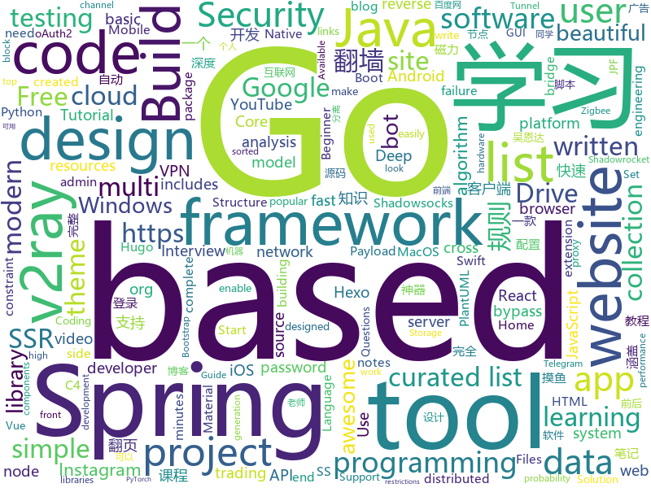

# 2019-09-23
See what the GitHub community is most excited about today.

## python
* [c9-python-getting-started](https://github.com/microsoft/c9-python-getting-started)(**218 stars today**): Sample code for Channel 9 Python for Beginners course
* [multi-agent-emergence-environments](https://github.com/openai/multi-agent-emergence-environments)(**56 stars today**): Environment generation code for the paper "Emergent Tool Use From Multi-Agent Autocurricula"
* [PayloadsAllTheThings](https://github.com/swisskyrepo/PayloadsAllTheThings)(**14 stars today**): A list of useful payloads and bypass for Web Application Security and Pentest/CTF
* [shadowsocks](https://github.com/shadowsocks/shadowsocks)(**24 stars today**): 
* [pwnagotchi](https://github.com/evilsocket/pwnagotchi)(**114 stars today**): (⌐■_■) - Deep Reinforcement Learning vs WiFI
* [DeepFaceLab](https://github.com/iperov/DeepFaceLab)(**41 stars today**): DeepFaceLab is a tool that utilizes machine learning to replace faces in videos. Includes prebuilt ready to work standalone Windows 7,8,10 binary (look readme.md).
* [Shadowrocket-ADBlock-Rules](https://github.com/h2y/Shadowrocket-ADBlock-Rules)(**20 stars today**): 提供多款 Shadowrocket 规则，带广告过滤功能。用于 iOS 未越狱设备选择性地自动翻墙。
* [distribution-is-all-you-need](https://github.com/graykode/distribution-is-all-you-need)(**37 stars today**): The basic distribution probability Tutorial for Deep Learning Researchers
* [zipline](https://github.com/quantopian/zipline)(**2 stars today**): Zipline, a Pythonic Algorithmic Trading Library
* [unlocker](https://github.com/DrDonk/unlocker)(**7 stars today**): VMware Workstation macOS
* [tutorials](https://github.com/MorvanZhou/tutorials)(**6 stars today**): 机器学习相关教程
* [anki](https://github.com/dae/anki)(**7 stars today**): Anki for desktop computers
* [models](https://github.com/tensorflow/models)(**28 stars today**): Models and examples built with TensorFlow
* [DeepCTR-Torch](https://github.com/shenweichen/DeepCTR-Torch)(**10 stars today**): 【PyTorch】Easy-to-use,Modular and Extendible package of deep-learning based CTR models.
* [v2ray-template](https://github.com/veekxt/v2ray-template)(**4 stars today**): v2ray 模板，v2ray 配置生成工具
* [hosts](https://github.com/StevenBlack/hosts)(**6 stars today**): Extending and consolidating hosts files from several well-curated sources like adaway.org, mvps.org, malwaredomainlist.com, someonewhocares.org, and potentially others. You can optionally invoke extensions to block additional sites by category.
* [shadowsocksr-speed](https://github.com/mobier/shadowsocksr-speed)(**1 stars today**): SSR 批量测试节点有效带宽
* [algo](https://github.com/trailofbits/algo)(**11 stars today**): Set up a personal VPN in the cloud
* [qiskit-terra](https://github.com/Qiskit/qiskit-terra)(**2 stars today**): Terra provides the foundations for Qiskit. It allows the user to write quantum circuits easily, and takes care of the constraints of real hardware.
* [instabot.py](https://github.com/instabot-py/instabot.py)(**7 stars today**): Instagram bot. It works without instagram api, need only login and password. Write on python.
* [camporter96-custom](https://github.com/babgozd/camporter96-custom)(**5 stars today**): 
* [youtube-dl-gui](https://github.com/MrS0m30n3/youtube-dl-gui)(**3 stars today**): A cross platform front-end GUI of the popular youtube-dl written in wxPython.
* [armory](https://github.com/armory3d/armory)(**4 stars today**): 3D Engine with Blender Integration
* [ungoogled-chromium](https://github.com/Eloston/ungoogled-chromium)(**2 stars today**): Google Chromium, sans integration with Google
* [InstaPy](https://github.com/timgrossmann/InstaPy)(**13 stars today**): 📷Instagram Bot - Tool for automated Instagram interactions

## java
* [vhr](https://github.com/lenve/vhr)(**67 stars today**): 微人事是一个前后端分离的人力资源管理系统，项目采用SpringBoot+Vue开发。
* [halo](https://github.com/halo-dev/halo)(**26 stars today**): ✍ Halo 一款现代化的个人独立博客系统
* [SpringAll](https://github.com/wuyouzhuguli/SpringAll)(**53 stars today**): 循序渐进，学习Spring Boot、Spring Boot & Shiro、Spring Cloud、Spring Security & Spring Security OAuth2，博客Spring系列源码
* [ghidra](https://github.com/NationalSecurityAgency/ghidra)(**22 stars today**): Ghidra is a software reverse engineering (SRE) framework
* [advanced-java](https://github.com/doocs/advanced-java)(**229 stars today**): 😮互联网 Java 工程师进阶知识完全扫盲：涵盖高并发、分布式、高可用、微服务等领域知识，后端同学必看，前端同学也可学习
* [magnetW](https://github.com/dengyuhan/magnetW)(**26 stars today**): 磁力搜网页版 - 磁力链接聚合搜索 - https://biedian.me
* [Algorithms](https://github.com/williamfiset/Algorithms)(**13 stars today**): A collection of algorithms
* [XQuickEnergy](https://github.com/pansong291/XQuickEnergy)(**4 stars today**): 快速收取蚂蚁森林能量
* [spring-analysis](https://github.com/seaswalker/spring-analysis)(**28 stars today**): Spring源码阅读
* [data-structures](https://github.com/williamfiset/data-structures)(**4 stars today**): A collection of powerful data structures
* [paascloud-master](https://github.com/paascloud/paascloud-master)(**24 stars today**): spring cloud + vue + oAuth2.0全家桶实战，前后端分离模拟商城，完整的购物流程、后端运营平台，可以实现快速搭建企业级微服务项目。支持微信登录等三方登录。
* [Hystrix](https://github.com/Netflix/Hystrix)(**7 stars today**): Hystrix is a latency and fault tolerance library designed to isolate points of access to remote systems, services and 3rd party libraries, stop cascading failure and enable resilience in complex distributed systems where failure is inevitable.
* [SmartYouTubeTV](https://github.com/yuliskov/SmartYouTubeTV)(**6 stars today**): Watch YouTube videos on your TV and set-top-box with comfort
* [JavaGuide](https://github.com/Snailclimb/JavaGuide)(**69 stars today**): 【Java学习+面试指南】 一份涵盖大部分Java程序员所需要掌握的核心知识。
* [baritone](https://github.com/cabaletta/baritone)(**6 stars today**): google maps for block game
* [CtCI-6th-Edition](https://github.com/careercup/CtCI-6th-Edition)(**4 stars today**): Cracking the Coding Interview 6th Ed. Solutions
* [JCSprout](https://github.com/crossoverJie/JCSprout)(**4 stars today**): 👨‍🎓Java Core Sprout : basic, concurrent, algorithm
* [Nukkit](https://github.com/NukkitX/Nukkit)(**0 stars today**): Nuclear-Powered Server Software for Minecraft: Bedrock Edition.
* [Telegram](https://github.com/DrKLO/Telegram)(**4 stars today**): Telegram for Android source
* [EdXposed](https://github.com/ElderDrivers/EdXposed)(**6 stars today**): Elder driver Xposed Framework.
* [dbeaver](https://github.com/dbeaver/dbeaver)(**12 stars today**): Free universal database tool and SQL client
* [SkyStone](https://github.com/FIRST-Tech-Challenge/SkyStone)(**1 stars today**): FTC SDK
* [FirebaseUI-Android](https://github.com/firebase/FirebaseUI-Android)(**2 stars today**): Optimized UI components for Firebase
* [interview](https://github.com/mission-peace/interview)(**6 stars today**): Interview questions
* [jpf-core](https://github.com/javapathfinder/jpf-core)(**1 stars today**): JPF is an extensible software analysis framework for Java bytecode. jpf-core is the basis for all JPF projects; you always need to install it. It contains the basic VM and model checking infrastructure, and can be used to check for concurrency defects like deadlocks, and unhandled exceptions like NullPointerExceptions and AssertionErrors.

## unknown
* [cascadia-code](https://github.com/microsoft/cascadia-code)(**775 stars today**): This is a fun, new monospaced font that includes programming ligatures and is designed to enhance the modern look and feel of the Windows Terminal.
* [Fantastic-Front-End-Toolbox](https://github.com/jamesctucker/Fantastic-Front-End-Toolbox)(**94 stars today**): A catalogue of front-end tools, technologies, and resources for developers.
* [new-pac](https://github.com/Alvin9999/new-pac)(**89 stars today**): 
* [A-to-Z-Resources-for-Students](https://github.com/dipakkr/A-to-Z-Resources-for-Students)(**153 stars today**): ✅Curated list of resources for college students
* [Machine-Learning-Session](https://github.com/shuhuai007/Machine-Learning-Session)(**67 stars today**): 
* [Awesome-Hacking-Resources](https://github.com/vitalysim/Awesome-Hacking-Resources)(**51 stars today**): A collection of hacking / penetration testing resources to make you better!
* [Share-SSR-V2ray](https://github.com/selierlin/Share-SSR-V2ray)(**12 stars today**): 🃏Free SS/SSR/V2ray 免费分享节点账号信息网站
* [class2019Fall](https://github.com/hsnam95/class2019Fall)(**10 stars today**): 
* [chef-sugar](https://github.com/sethvargo/chef-sugar)(**11 stars today**): 
* [ACL4SSR](https://github.com/ACL4SSR/ACL4SSR)(**8 stars today**): SSR 去广告ACL规则/SS完整GFWList规则，Telegram频道订阅地址
* [C4-PlantUML](https://github.com/RicardoNiepel/C4-PlantUML)(**3 stars today**): C4-PlantUML combines the benefits of PlantUML and the C4 model for providing a simple way of describing and communicate software architectures
* [chromium](https://github.com/jjqqkk/chromium)(**18 stars today**): Chromium browser with SSL VPN. Use this browser to unblock websites.
* [clash_for_windows_pkg](https://github.com/Fndroid/clash_for_windows_pkg)(**10 stars today**): A Windows GUI based on Clash
* [trackerslist](https://github.com/ngosang/trackerslist)(**28 stars today**): Updated list of public BitTorrent trackers
* [1024app-android](https://github.com/yuuwill/1024app-android)(**2 stars today**): 草榴官方客户端，小草客户端，Android
* [reverse-interview](https://github.com/viraptor/reverse-interview)(**90 stars today**): Questions to ask the company during your interview
* [awesome-developer-streams](https://github.com/bnb/awesome-developer-streams)(**6 stars today**): 👩🏿‍💻👨🏾‍💻👩🏼‍💻👨🏽‍💻👩🏻‍💻 Awesome Developers, Streaming
* [nogfw](https://github.com/gfw-breaker/nogfw)(**1 stars today**): 一键翻墙软件，包含自由门、无界、Shadowsocks等 翻墙教程
* [Probable-Wordlists](https://github.com/berzerk0/Probable-Wordlists)(**4 stars today**): Version 2 is live! Wordlists sorted by probability originally created for password generation and testing - make sure your passwords aren't popular!
* [reactjs-interview-questions](https://github.com/sudheerj/reactjs-interview-questions)(**2 stars today**): List of top 500 ReactJS Interview Questions & Answers....Coding exercise questions are coming soon!!
* [Projects](https://github.com/karan/Projects)(**11 stars today**): 📃A list of practical projects that anyone can solve in any programming language.
* [AspNetCore-Developer-Roadmap](https://github.com/MoienTajik/AspNetCore-Developer-Roadmap)(**9 stars today**): Roadmap to becoming an ASP.NET Core developer in 2019
* [shadowsocks-rss](https://github.com/shadowsocksr-backup/shadowsocks-rss)(**11 stars today**): ShadowsocksR update rss, SSR organization
* [pwc](https://github.com/zziz/pwc)(**5 stars today**): Papers with code. Sorted by stars. Updated weekly.
* [Beginner-Network-Pentesting](https://github.com/hmaverickadams/Beginner-Network-Pentesting)(**8 stars today**): Notes for Beginner Network Pentesting Course

## javascript
* [Profiles](https://github.com/ConnersHua/Profiles)(**20 stars today**): Clash、Kitsunebi、Quantumult(X)、Shadowrocket、Pepi(ShadowRay)、Surge 的配置规则文件
* [dribbble2react](https://github.com/react-ui-kit/dribbble2react)(**3 stars today**): Transform Dribbble designs to React-Native code & YouTube video tutorials
* [baiduyun](https://github.com/syhyz1990/baiduyun)(**25 stars today**): 🖖油猴脚本 一个脚本搞定百度网盘下载 https://www.baiduyun.wiki
* [theme-ui](https://github.com/system-ui/theme-ui)(**3 stars today**): Build consistent, themeable React apps based on constraint-based design principles
* [material-ui](https://github.com/mui-org/material-ui)(**24 stars today**): React components for faster and easier web development. Build your own design system, or start with Material Design.
* [zigbee2mqtt](https://github.com/Koenkk/zigbee2mqtt)(**5 stars today**): Zigbee🐝to MQTT bridge🌉, get rid of your proprietary Zigbee bridges🔨
* [javascript-algorithms](https://github.com/trekhleb/javascript-algorithms)(**36 stars today**): 📝Algorithms and data structures implemented in JavaScript with explanations and links to further readings
* [google-access-helper](https://github.com/haotian-wang/google-access-helper)(**29 stars today**): 谷歌访问助手破解版
* [gekko](https://github.com/askmike/gekko)(**7 stars today**): A bitcoin trading bot written in node - https://gekko.wizb.it/
* [Pokemon-Showdown](https://github.com/Zarel/Pokemon-Showdown)(**5 stars today**): Pokémon battle simulator.
* [CyberChef](https://github.com/gchq/CyberChef)(**27 stars today**): The Cyber Swiss Army Knife - a web app for encryption, encoding, compression and data analysis
* [Thief-Book](https://github.com/cteamx/Thief-Book)(**9 stars today**): 一款可以在任务栏、桌面、TouchBar上进行摸鱼的最强的跨平台摸鱼神器，支持小说、股票、按键翻页、鼠标翻页、自动翻页让你体验不同的工作 996，上班族必备神器
* [iptv](https://github.com/freearhey/iptv)(**10 stars today**): Collection of 8000+ publicly available IPTV channels from all over the world
* [etcher](https://github.com/balena-io/etcher)(**12 stars today**): Flash OS images to SD cards & USB drives, safely and easily.
* [bypass-paywalls-firefox](https://github.com/iamadamdev/bypass-paywalls-firefox)(**11 stars today**): Bypass Paywalls for Firefox
* [hexo-theme-icarus](https://github.com/ppoffice/hexo-theme-icarus)(**2 stars today**): A simple, delicate, and modern theme for the static site generator Hexo.
* [complete-intro-to-react-v5](https://github.com/btholt/complete-intro-to-react-v5)(**5 stars today**): The Complete Intro to React, the fifth version
* [d3](https://github.com/d3/d3)(**15 stars today**): Bring data to life with SVG, Canvas and HTML.📊📈🎉
* [api-platform](https://github.com/api-platform/api-platform)(**3 stars today**): REST and GraphQL framework to build modern API-driven projects (server-side and client-side)
* [gatsby](https://github.com/gatsbyjs/gatsby)(**24 stars today**): Build blazing fast, modern apps and websites with React
* [swift-evolution](https://github.com/apple/swift-evolution)(**3 stars today**): This maintains proposals for changes and user-visible enhancements to the Swift Programming Language.
* [framework7](https://github.com/framework7io/framework7)(**0 stars today**): Full featured HTML framework for building iOS & Android apps
* [entropic](https://github.com/entropic-dev/entropic)(**16 stars today**): 🦝📦a package registry for anything, but mostly javascript 🦝 🦝 🦝
* [metamask-extension](https://github.com/MetaMask/metamask-extension)(**0 stars today**): 🌐🔌The MetaMask browser extension enables browsing Ethereum blockchain enabled websites.
* [shadowsocks-manager](https://github.com/shadowsocks/shadowsocks-manager)(**0 stars today**): A shadowsocks manager tool for multi user and traffic control.

## html
* [deeplearning_ai_books](https://github.com/fengdu78/deeplearning_ai_books)(**21 stars today**): deeplearning.ai（吴恩达老师的深度学习课程笔记及资源）
* [v2-ui](https://github.com/sprov065/v2-ui)(**24 stars today**): 支持多协议多用户的 v2ray 面板，Support multi-protocol multi-user v2ray panel
* [awesome-piracy](https://github.com/Igglybuff/awesome-piracy)(**5 stars today**): A curated list of awesome warez and piracy links
* [Coursera-ML-AndrewNg-Notes](https://github.com/fengdu78/Coursera-ML-AndrewNg-Notes)(**20 stars today**): 吴恩达老师的机器学习课程个人笔记
* [qiubaiying.github.io](https://github.com/qiubaiying/qiubaiying.github.io)(**5 stars today**): BY Blog ->
* [larabbs](https://github.com/summerblue/larabbs)(**1 stars today**): A forum project base on Laravel
* [cs231n.github.io](https://github.com/cs231n/cs231n.github.io)(**2 stars today**): Public facing notes page
* [hexo-theme-matery](https://github.com/blinkfox/hexo-theme-matery)(**4 stars today**): A beautiful hexo blog theme with material design and responsive design.一个基于材料设计和响应式设计而成的全面、美观的Hexo主题。
* [manual](https://github.com/v2ray/manual)(**4 stars today**): Source code for https://www.v2ray.com/
* [awesome-competitive-programming](https://github.com/lnishan/awesome-competitive-programming)(**3 stars today**): 💎A curated list of awesome Competitive Programming, Algorithm and Data Structure resources
* [startbootstrap-sb-admin-2](https://github.com/BlackrockDigital/startbootstrap-sb-admin-2)(**4 stars today**): A free, open source, Bootstrap admin theme created by Start Bootstrap
* [blackeye](https://github.com/thelinuxchoice/blackeye)(**1 stars today**): The most complete Phishing Tool, with 32 templates +1 customizable
* [coreui-free-bootstrap-admin-template](https://github.com/coreui/coreui-free-bootstrap-admin-template)(**4 stars today**): CoreUI is free bootstrap admin template
* [twofactorauth](https://github.com/2factorauth/twofactorauth)(**0 stars today**): List of sites with two factor auth support which includes SMS, email, phone calls, hardware, and software.
* [hugo-academic](https://github.com/gcushen/hugo-academic)(**7 stars today**): 📝The website builder for Hugo. Build and deploy a beautiful website in minutes!
* [beautiful-jekyll](https://github.com/daattali/beautiful-jekyll)(**1 stars today**): ✨Build a beautiful and simple website in literally minutes. Demo at http://deanattali.com/beautiful-jekyll
* [home-assistant.io](https://github.com/home-assistant/home-assistant.io)(**0 stars today**): 📘Home Assistant User documentation
* [zenbot](https://github.com/DeviaVir/zenbot)(**2 stars today**): Zenbot is a command-line cryptocurrency trading bot using Node.js and MongoDB.
* [fq](https://github.com/it-andy-hou/fq)(**3 stars today**): 🌎🗽翻墙软件不完全汇总
* [REKCARC-TSC-UHT](https://github.com/PKUanonym/REKCARC-TSC-UHT)(**22 stars today**): 清华大学计算机系课程攻略 Guidance for courses in Department of Computer Science and Technology, Tsinghua University
* [en.javascript.info](https://github.com/javascript-tutorial/en.javascript.info)(**5 stars today**): Modern JavaScript Tutorial
* [xss-payload-list](https://github.com/payloadbox/xss-payload-list)(**2 stars today**): 🎯Cross Site Scripting ( XSS ) Vulnerability Payload List
* [technical-books](https://github.com/doocs/technical-books)(**23 stars today**): 😆国内外互联网技术大牛们都写了哪些书籍：计算机基础、网络、前端、后端、数据库、架构、大数据、深度学习...
* [owasp-mstg](https://github.com/OWASP/owasp-mstg)(**3 stars today**): The Mobile Security Testing Guide (MSTG) is a comprehensive manual for mobile app security development, testing and reverse engineering.
* [gohugo-theme-ananke](https://github.com/budparr/gohugo-theme-ananke)(**0 stars today**): Ananke: A theme for Hugo Sites

## go
* [ristretto](https://github.com/dgraph-io/ristretto)(**129 stars today**): A high performance memory-bound Go cache
* [v2ray-core](https://github.com/v2ray/v2ray-core)(**172 stars today**): A platform for building proxies to bypass network restrictions.
* [gnet](https://github.com/panjf2000/gnet)(**98 stars today**): ⚡️A high-performance, lightweight, nonblocking and event-loop networking library written in pure Go.🔥
* [brook](https://github.com/txthinking/brook)(**44 stars today**): Brook is a cross-platform(Linux/MacOS/Windows/Android/iOS) proxy/vpn software
* [goflyway](https://github.com/coyove/goflyway)(**10 stars today**): An encrypted HTTP server
* [go](https://github.com/golang/go)(**26 stars today**): The Go programming language
* [dgraph](https://github.com/dgraph-io/dgraph)(**30 stars today**): Fast, Distributed Graph DB
* [awesome-go](https://github.com/avelino/awesome-go)(**25 stars today**): A curated list of awesome Go frameworks, libraries and software
* [singo](https://github.com/Gourouting/singo)(**7 stars today**): Gin+Gorm开发Golang API快速开发脚手架
* [frp](https://github.com/fatedier/frp)(**21 stars today**): A fast reverse proxy to help you expose a local server behind a NAT or firewall to the internet.
* [badger](https://github.com/dgraph-io/badger)(**8 stars today**): Fast key-value DB in Go.
* [libpod](https://github.com/containers/libpod)(**1 stars today**): libpod is a library used to create container pods. Home of Podman.
* [chainlink](https://github.com/smartcontractkit/chainlink)(**2 stars today**): node of the decentralized oracle network, bridging on and off-chain computation
* [BaiduPCS-Go](https://github.com/iikira/BaiduPCS-Go)(**16 stars today**): 百度网盘客户端 - Go语言编写
* [ebiten](https://github.com/hajimehoshi/ebiten)(**8 stars today**): A dead simple 2D game library in Go
* [v2ray-plugin](https://github.com/shadowsocks/v2ray-plugin)(**8 stars today**): A SIP003 plugin based on v2ray
* [kubeedge](https://github.com/kubeedge/kubeedge)(**10 stars today**): Kubernetes Native Edge Computing Framework (project under CNCF)
* [ultimate-go](https://github.com/hoanhan101/ultimate-go)(**30 stars today**): Ultimate Go study guide, with heavily documented code and programs analysis all in 1 place
* [kcptun](https://github.com/xtaci/kcptun)(**7 stars today**): A Stable & Secure Tunnel based on KCP with N:M multiplexing and FEC. Available for ARM, MIPS, 386 and AMD64
* [rclone](https://github.com/rclone/rclone)(**20 stars today**): "rsync for cloud storage" - Google Drive, Amazon Drive, S3, Dropbox, Backblaze B2, One Drive, Swift, Hubic, Cloudfiles, Google Cloud Storage, Yandex Files
* [linkchain](https://github.com/lianxiangcloud/linkchain)(**13 stars today**): 享云链-郑和版本
* [cue](https://github.com/cuelang/cue)(**8 stars today**): Validate and define text-based and dynamic configuration
* [LeetCode-in-Go](https://github.com/aQuaYi/LeetCode-in-Go)(**1 stars today**): 🎓Go Solution for LeetCode algorithms problems, 100% coverage, continually updating.
* [clash](https://github.com/Dreamacro/clash)(**17 stars today**): A rule-based tunnel in Go.
* [yay](https://github.com/Jguer/yay)(**7 stars today**): Yet another Yogurt - An AUR Helper written in Go

## WordCloud

