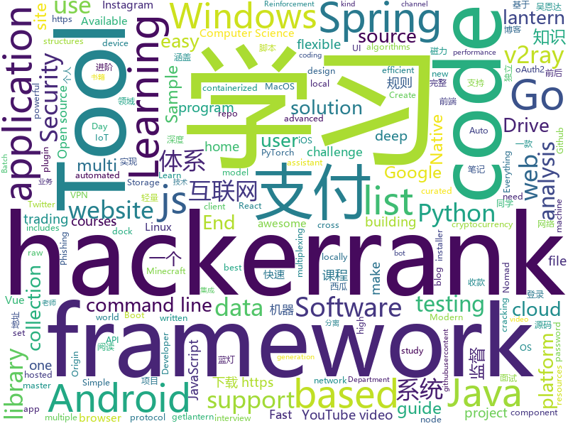

# 2019-09-24
See what the GitHub community is most excited about today.

## python
* [c9-python-getting-started](https://github.com/microsoft/c9-python-getting-started)(**388 stars today**): Sample code for Channel 9 Python for Beginners course
* [kivy](https://github.com/kivy/kivy)(**17 stars today**): Open source UI framework written in Python, running on Windows, Linux, macOS, Android and iOS
* [espresso](https://github.com/freewym/espresso)(**47 stars today**): Espresso: A Fast End-to-End Neural Speech Recognition Toolkit
* [multi-agent-emergence-environments](https://github.com/openai/multi-agent-emergence-environments)(**66 stars today**): Environment generation code for the paper "Emergent Tool Use From Multi-Agent Autocurricula"
* [scikit-learn](https://github.com/scikit-learn/scikit-learn)(**18 stars today**): scikit-learn: machine learning in Python
* [youtube-dl](https://github.com/ytdl-org/youtube-dl)(**38 stars today**): Command-line program to download videos from YouTube.com and other video sites
* [code_snippets](https://github.com/CoreyMSchafer/code_snippets)(**9 stars today**): 
* [pwnagotchi](https://github.com/evilsocket/pwnagotchi)(**103 stars today**): (⌐■_■) - Deep Reinforcement Learning vs WiFI
* [zipline](https://github.com/quantopian/zipline)(**12 stars today**): Zipline, a Pythonic Algorithmic Trading Library
* [InstaPy](https://github.com/timgrossmann/InstaPy)(**9 stars today**): 📷Instagram Bot - Tool for automated Instagram interactions
* [Gooey](https://github.com/chriskiehl/Gooey)(**301 stars today**): Turn (almost) any Python command line program into a full GUI application with one line
* [tuya-convert](https://github.com/ct-Open-Source/tuya-convert)(**1 stars today**): A collection of scripts to flash Tuya IoT devices to alternative firmwares
* [shadowsocks](https://github.com/shadowsocks/shadowsocks)(**29 stars today**): 
* [jupyter](https://github.com/jupyter/jupyter)(**9 stars today**): Jupyter metapackage for installation, docs and chat
* [home-assistant](https://github.com/home-assistant/home-assistant)(**18 stars today**): 🏡Open source home automation that puts local control and privacy first
* [docker-pi-hole](https://github.com/pi-hole/docker-pi-hole)(**14 stars today**): Pi-hole in a docker container
* [examples](https://github.com/pytorch/examples)(**15 stars today**): A set of examples around pytorch in Vision, Text, Reinforcement Learning, etc.
* [kaggle-api](https://github.com/Kaggle/kaggle-api)(**3 stars today**): Official Kaggle API
* [multi-v2ray](https://github.com/Jrohy/multi-v2ray)(**20 stars today**): v2ray easy delpoy & manage tool， support multiple user & protocol manage
* [routersploit](https://github.com/threat9/routersploit)(**2 stars today**): Exploitation Framework for Embedded Devices
* [100-Days-Of-ML-Code](https://github.com/Avik-Jain/100-Days-Of-ML-Code)(**36 stars today**): 100 Days of ML Coding
* [mininet](https://github.com/mininet/mininet)(**3 stars today**): Emulator for rapid prototyping of Software Defined Networks
* [lutris](https://github.com/lutris/lutris)(**5 stars today**): Lutris client - Open Source gaming platform for GNU/Linux
* [DeepCTR-Torch](https://github.com/shenweichen/DeepCTR-Torch)(**16 stars today**): 【PyTorch】Easy-to-use,Modular and Extendible package of deep-learning based CTR models.
* [SSRSpeed](https://github.com/NyanChanMeow/SSRSpeed)(**12 stars today**): Shadowsocks(R), V2Ray Batch Speed Test Tool

## java
* [advanced-java](https://github.com/doocs/advanced-java)(**218 stars today**): 😮互联网 Java 工程师进阶知识完全扫盲：涵盖高并发、分布式、高可用、微服务等领域知识，后端同学必看，前端同学也可学习
* [vhr](https://github.com/lenve/vhr)(**128 stars today**): 微人事是一个前后端分离的人力资源管理系统，项目采用SpringBoot+Vue开发。
* [Algorithms](https://github.com/williamfiset/Algorithms)(**19 stars today**): A collection of algorithms
* [data-structures](https://github.com/williamfiset/data-structures)(**8 stars today**): A collection of powerful data structures
* [SpringAll](https://github.com/wuyouzhuguli/SpringAll)(**118 stars today**): 循序渐进，学习Spring Boot、Spring Boot & Shiro、Spring Cloud、Spring Security & Spring Security OAuth2，博客Spring系列源码
* [MinecraftForge](https://github.com/MinecraftForge/MinecraftForge)(**0 stars today**): Modifications to the Minecraft base files to assist in compatibility between mods.
* [halo](https://github.com/halo-dev/halo)(**106 stars today**): ✍ Halo 一款现代化的个人独立博客系统
* [XQuickEnergy](https://github.com/pansong291/XQuickEnergy)(**15 stars today**): 快速收取蚂蚁森林能量
* [paascloud-master](https://github.com/paascloud/paascloud-master)(**53 stars today**): spring cloud + vue + oAuth2.0全家桶实战，前后端分离模拟商城，完整的购物流程、后端运营平台，可以实现快速搭建企业级微服务项目。支持微信登录等三方登录。
* [baritone](https://github.com/cabaletta/baritone)(**2 stars today**): google maps for block game
* [ghidra](https://github.com/NationalSecurityAgency/ghidra)(**42 stars today**): Ghidra is a software reverse engineering (SRE) framework
* [Hackerrank-Solutions](https://github.com/Java-aid/Hackerrank-Solutions)(**0 stars today**): hackerrank video tutorial|hackerrank | hackerrank cracking the coding interview | hackerrank data structures | hackerrank java | hackerrank algorithms | hackerrank youtube | hackerrank solution | hackerrank challenge | hackerrank solutions | hackerrank coding challenge | hackerrank problems | hackerrank algorithms solutions | hackerrank cracking…
* [JavaGuide](https://github.com/Snailclimb/JavaGuide)(**121 stars today**): 【Java学习+面试指南】 一份涵盖大部分Java程序员所需要掌握的核心知识。
* [camera-samples](https://github.com/android/camera-samples)(**6 stars today**): Multiple samples showing the best practices in camera APIs on Android.
* [SmartYouTubeTV](https://github.com/yuliskov/SmartYouTubeTV)(**6 stars today**): Watch YouTube videos on your TV and set-top-box with comfort
* [roncoo-pay](https://github.com/roncoo/roncoo-pay)(**7 stars today**): 龙果支付系统（roncoo-pay）是国内首款开源的互联网支付系统，拥有独立的账户体系、用户体系、支付接入体系、支付交易体系、对账清结算体系。目标是打造一款集成主流支付方式且轻量易用的支付收款系统，满足互联网业务系统打通支付通道实现支付收款和业务资金管理等功能。
* [magnetW](https://github.com/dengyuhan/magnetW)(**43 stars today**): 磁力搜网页版 - 磁力链接聚合搜索 - https://biedian.me
* [netbeans](https://github.com/apache/netbeans)(**4 stars today**): Apache NetBeans
* [Nukkit](https://github.com/NukkitX/Nukkit)(**1 stars today**): Nuclear-Powered Server Software for Minecraft: Bedrock Edition.
* [dddsample-core](https://github.com/citerus/dddsample-core)(**1 stars today**): This is the new home of the original DDD Sample app (previously hosted at sf.net)..
* [FirebaseUI-Android](https://github.com/firebase/FirebaseUI-Android)(**3 stars today**): Optimized UI components for Firebase
* [HackerRank](https://github.com/RyanFehr/HackerRank)(**0 stars today**): HackerRank solutions in Java/JS/Python/C++/C#
* [runelite](https://github.com/runelite/runelite)(**1 stars today**): Open source Old School RuneScape client
* [spring-analysis](https://github.com/seaswalker/spring-analysis)(**62 stars today**): Spring源码阅读
* [flutter_local_notifications](https://github.com/MaikuB/flutter_local_notifications)(**4 stars today**): A Flutter plugin for displaying local notifications on Android and iOS

## unknown
* [cascadia-code](https://github.com/microsoft/cascadia-code)(**562 stars today**): This is a fun, new monospaced font that includes programming ligatures and is designed to enhance the modern look and feel of the Windows Terminal.
* [Awesome-Hacking-Resources](https://github.com/vitalysim/Awesome-Hacking-Resources)(**79 stars today**): A collection of hacking / penetration testing resources to make you better!
* [awesome](https://github.com/sindresorhus/awesome)(**74 stars today**): 😎Awesome lists about all kinds of interesting topics
* [A-to-Z-Resources-for-Students](https://github.com/dipakkr/A-to-Z-Resources-for-Students)(**51 stars today**): ✅Curated list of resources for college students
* [Machine-Learning-Session](https://github.com/shuhuai007/Machine-Learning-Session)(**34 stars today**): 
* [new-pac](https://github.com/Alvin9999/new-pac)(**80 stars today**): 
* [chromium](https://github.com/jjqqkk/chromium)(**12 stars today**): Chromium browser with SSL VPN. Use this browser to unblock websites.
* [teslaprep](https://github.com/mykeln/teslaprep)(**2 stars today**): A comprehensive guide on preparing for, taking delivery of, and owning a Model 3
* [trackerslist](https://github.com/ngosang/trackerslist)(**24 stars today**): Updated list of public BitTorrent trackers
* [Micro8](https://github.com/Micropoor/Micro8)(**4 stars today**): Gitbook
* [datasharing](https://github.com/jtleek/datasharing)(**2 stars today**): The Leek group guide to data sharing
* [shadowsocks-rss](https://github.com/shadowsocksr-backup/shadowsocks-rss)(**10 stars today**): ShadowsocksR update rss, SSR organization
* [ACL4SSR](https://github.com/ACL4SSR/ACL4SSR)(**4 stars today**): SSR 去广告ACL规则/SS完整GFWList规则，Telegram频道订阅地址
* [url](https://github.com/ZCSSR/url)(**4 stars today**): ZCSSR新地址发布页
* [Probable-Wordlists](https://github.com/berzerk0/Probable-Wordlists)(**3 stars today**): Version 2 is live! Wordlists sorted by probability originally created for password generation and testing - make sure your passwords aren't popular!
* [coding-interview-university](https://github.com/jwasham/coding-interview-university)(**88 stars today**): A complete computer science study plan to become a software engineer.
* [vTemplate](https://github.com/KiriKira/vTemplate)(**7 stars today**): v2ray的模板们
* [Learn_Machine_Learning_in_3_Months](https://github.com/llSourcell/Learn_Machine_Learning_in_3_Months)(**1 stars today**): This is the code for "Learn Machine Learning in 3 Months" by Siraj Raval on Youtube
* [You-Dont-Know-JS](https://github.com/getify/You-Dont-Know-JS)(**44 stars today**): A book series on JavaScript. @YDKJS on twitter.
* [Machine-learning-learning-notes](https://github.com/Vay-keen/Machine-learning-learning-notes)(**10 stars today**): 周志华《机器学习》又称西瓜书是一本较为全面的书籍，书中详细介绍了机器学习领域不同类型的算法(例如：监督学习、无监督学习、半监督学习、强化学习、集成降维、特征选择等)，记录了本人在学习过程中的理解思路与扩展知识点，希望对新人阅读西瓜书有所帮助！
* [interview](https://github.com/andreis/interview)(**4 stars today**): Everything you need to prepare for your technical interview
* [awesome-courses](https://github.com/prakhar1989/awesome-courses)(**15 stars today**): 📚List of awesome university courses for learning Computer Science!
* [API-Security-Checklist](https://github.com/shieldfy/API-Security-Checklist)(**29 stars today**): Checklist of the most important security countermeasures when designing, testing, and releasing your API
* [awesome-indie](https://github.com/mezod/awesome-indie)(**15 stars today**): Resources for independent developers to make money
* [awesome-bigdata](https://github.com/onurakpolat/awesome-bigdata)(**23 stars today**): A curated list of awesome big data frameworks, ressources and other awesomeness.

## javascript
* [shiori](https://github.com/go-shiori/shiori)(**184 stars today**): Simple bookmark manager built with Go
* [strml.net](https://github.com/STRML/strml.net)(**16 stars today**): STRML: Projects & Work
* [iptv](https://github.com/freearhey/iptv)(**33 stars today**): Collection of 8000+ publicly available IPTV channels from all over the world
* [Mobile-Security-Framework-MobSF](https://github.com/MobSF/Mobile-Security-Framework-MobSF)(**12 stars today**): Mobile Security Framework (MobSF) is an automated, all-in-one mobile application (Android/iOS/Windows) pen-testing, malware analysis and security assessment framework capable of performing static and dynamic analysis.
* [Profiles](https://github.com/ConnersHua/Profiles)(**35 stars today**): Clash、Kitsunebi、Quantumult(X)、Shadowrocket、Pepi(ShadowRay)、Surge 的配置规则文件
* [uBlock](https://github.com/gorhill/uBlock)(**20 stars today**): uBlock Origin - An efficient blocker for Chromium and Firefox. Fast and lean.
* [awesome-selfhosted](https://github.com/Kickball/awesome-selfhosted)(**49 stars today**): This is a list of Free Software network services and web applications which can be hosted locally. Selfhosting is the process of locally hosting and managing applications instead of renting from SaaS providers.
* [incubator-echarts](https://github.com/apache/incubator-echarts)(**34 stars today**): A powerful, interactive charting and visualization library for browser
* [KaTeX](https://github.com/KaTeX/KaTeX)(**9 stars today**): Fast math typesetting for the web.
* [Auto.js_Projects](https://github.com/SuperMonster003/Auto.js_Projects)(**15 stars today**): 基于Auto.js的辅助工具项目 Auto.js-based assistant tools projects
* [cgm-remote-monitor](https://github.com/nightscout/cgm-remote-monitor)(**5 stars today**): nightscout web monitor
* [dribbble2react](https://github.com/react-ui-kit/dribbble2react)(**17 stars today**): Transform Dribbble designs to React-Native code & YouTube video tutorials
* [bypass-paywalls-firefox](https://github.com/iamadamdev/bypass-paywalls-firefox)(**7 stars today**): Bypass Paywalls for Firefox
* [ccxt](https://github.com/ccxt/ccxt)(**14 stars today**): A JavaScript / Python / PHP cryptocurrency trading API with support for more than 120 bitcoin/altcoin exchanges
* [etcher](https://github.com/balena-io/etcher)(**12 stars today**): Flash OS images to SD cards & USB drives, safely and easily.
* [P4wnP1_aloa](https://github.com/mame82/P4wnP1_aloa)(**2 stars today**): P4wnP1 A.L.O.A. by MaMe82 is a framework which turns a Rapsberry Pi Zero W into a flexible, low-cost platform for pentesting, red teaming and physical engagements ... or into "A Little Offensive Appliance".
* [axios](https://github.com/axios/axios)(**42 stars today**): Promise based HTTP client for the browser and node.js
* [dash-to-dock](https://github.com/micheleg/dash-to-dock)(**7 stars today**): A dock for the Gnome Shell. This extension moves the dash out of the overview transforming it in a dock for an easier launching of applications and a faster switching between windows and desktops.
* [nuxt.js](https://github.com/nuxt/nuxt.js)(**11 stars today**): The Vue.js Framework
* [CyberChef](https://github.com/gchq/CyberChef)(**50 stars today**): The Cyber Swiss Army Knife - a web app for encryption, encoding, compression and data analysis
* [fanqiang](https://github.com/bannedbook/fanqiang)(**35 stars today**): 翻墙-科学上网
* [react-redux-firebase](https://github.com/prescottprue/react-redux-firebase)(**1 stars today**): Redux bindings for Firebase. Includes Higher Order Component for use with React.
* [Awesome-Design-Tools](https://github.com/LisaDziuba/Awesome-Design-Tools)(**17 stars today**): The best design tools for everything👉
* [baiduyun](https://github.com/syhyz1990/baiduyun)(**77 stars today**): 🖖油猴脚本 一个脚本搞定百度网盘下载 https://www.baiduyun.wiki
* [react](https://github.com/facebook/react)(**75 stars today**): A declarative, efficient, and flexible JavaScript library for building user interfaces.

## html
* [Coursera-ML-AndrewNg-Notes](https://github.com/fengdu78/Coursera-ML-AndrewNg-Notes)(**22 stars today**): 吴恩达老师的机器学习课程个人笔记
* [REKCARC-TSC-UHT](https://github.com/PKUanonym/REKCARC-TSC-UHT)(**16 stars today**): 清华大学计算机系课程攻略 Guidance for courses in Department of Computer Science and Technology, Tsinghua University
* [technical-books](https://github.com/doocs/technical-books)(**13 stars today**): 😆国内外互联网技术大牛们都写了哪些书籍：计算机基础、网络、前端、后端、数据库、架构、大数据、深度学习...
* [HiddenEye](https://github.com/DarkSecDevelopers/HiddenEye)(**2 stars today**): Modern Phishing Tool With Advanced Functionality [ Android-Support-Available ]
* [deeplearning_ai_books](https://github.com/fengdu78/deeplearning_ai_books)(**13 stars today**): deeplearning.ai（吴恩达老师的深度学习课程笔记及资源）
* [ctf-wiki](https://github.com/ctf-wiki/ctf-wiki)(**14 stars today**): CTF Wiki Online. Come and join us, we need you!
* [v2-ui](https://github.com/sprov065/v2-ui)(**18 stars today**): 支持多协议多用户的 v2ray 面板，Support multi-protocol multi-user v2ray panel
* [qiubaiying.github.io](https://github.com/qiubaiying/qiubaiying.github.io)(**2 stars today**): BY Blog ->
* [webdevbootcamp](https://github.com/nax3t/webdevbootcamp)(**3 stars today**): All source code for back-end projects from the Web Developer Bootcamp
* [Java-Interview-Advanced](https://github.com/shishan100/Java-Interview-Advanced)(**5 stars today**): 中华石杉--互联网Java进阶面试训练营
* [JavaScript30](https://github.com/wesbos/JavaScript30)(**15 stars today**): 30 Day Vanilla JS Challenge
* [codeguide](https://github.com/htmlacademy/codeguide)(**0 stars today**): Стиль кода Академии HTML
* [datasciencecoursera](https://github.com/mGalarnyk/datasciencecoursera)(**1 stars today**): Data Science Repo and blog for John Hopkins Coursera Courses. Please let me know if you have any questions.
* [manual](https://github.com/v2ray/manual)(**6 stars today**): Source code for https://www.v2ray.com/
* [home-assistant.io](https://github.com/home-assistant/home-assistant.io)(**0 stars today**): 📘Home Assistant User documentation
* [hoverboard](https://github.com/gdg-x/hoverboard)(**0 stars today**): Conference website template
* [hugo-academic](https://github.com/gcushen/hugo-academic)(**8 stars today**): 📝The website builder for Hugo. Build and deploy a beautiful website in minutes!
* [learning-area](https://github.com/mdn/learning-area)(**0 stars today**): Github repo for the MDN Learning Area.
* [shellphish](https://github.com/thelinuxchoice/shellphish)(**1 stars today**): Phishing Tool for 18 social media: Instagram, Facebook, Snapchat, Github, Twitter, Yahoo, Protonmail, Spotify, Netflix, Linkedin, Wordpress, Origin, Steam, Microsoft, InstaFollowers, Gitlab, Pinterest
* [books](https://github.com/Thinkgamer/books)(**1 stars today**): 技术资料分享
* [PowerShell-Outlook-Signatures](https://github.com/raymix/PowerShell-Outlook-Signatures)(**5 stars today**): Creates company branded Outlook signatures maintained by someone in Marketing department with HTML knowledge
* [blog_os](https://github.com/phil-opp/blog_os)(**3 stars today**): Writing an OS in Rust
* [xss-payload-list](https://github.com/payloadbox/xss-payload-list)(**3 stars today**): 🎯Cross Site Scripting ( XSS ) Vulnerability Payload List
* [zenbot](https://github.com/DeviaVir/zenbot)(**2 stars today**): Zenbot is a command-line cryptocurrency trading bot using Node.js and MongoDB.
* [foundation-sites](https://github.com/foundation/foundation-sites)(**4 stars today**): The most advanced responsive front-end framework in the world. Quickly create prototypes and production code for sites that work on any kind of device.

## go
* [v2ray-core](https://github.com/v2ray/v2ray-core)(**252 stars today**): A platform for building proxies to bypass network restrictions.
* [ristretto](https://github.com/dgraph-io/ristretto)(**231 stars today**): A high performance memory-bound Go cache
* [linkchain](https://github.com/lianxiangcloud/linkchain)(**4 stars today**): 享云链-郑和版本
* [lantern](https://github.com/getlantern/lantern)(**30 stars today**): 蓝灯Windows下载 https://raw.githubusercontent.com/getlantern/lantern-binaries/master/lantern-installer.exe 蓝灯安卓下载 https://raw.githubusercontent.com/getlantern/lantern-binaries/master/lantern-installer.apk
* [lf](https://github.com/gokcehan/lf)(**21 stars today**): Terminal file manager
* [brook](https://github.com/txthinking/brook)(**46 stars today**): Brook is a cross-platform(Linux/MacOS/Windows/Android/iOS) proxy/vpn software
* [rclone](https://github.com/rclone/rclone)(**17 stars today**): "rsync for cloud storage" - Google Drive, Amazon Drive, S3, Dropbox, Backblaze B2, One Drive, Swift, Hubic, Cloudfiles, Google Cloud Storage, Yandex Files
* [ebiten](https://github.com/hajimehoshi/ebiten)(**10 stars today**): A dead simple 2D game library in Go
* [gnet](https://github.com/panjf2000/gnet)(**84 stars today**): ⚡️A high-performance, lightweight, nonblocking and event-loop networking library written in pure Go.🔥
* [tinygo](https://github.com/tinygo-org/tinygo)(**30 stars today**): Go compiler for small places. Microcontrollers, WebAssembly, and command-line tools. Based on LLVM.
* [nomad](https://github.com/hashicorp/nomad)(**8 stars today**): Nomad is an easy-to-use, flexible, and performant workload orchestrator that can deploy a mix of microservice, batch, containerized, and non-containerized applications. Nomad is easy to operate and scale and has native Consul and Vault integrations.
* [dgraph](https://github.com/dgraph-io/dgraph)(**35 stars today**): Fast, Distributed Graph DB
* [fzf](https://github.com/junegunn/fzf)(**32 stars today**): 🌸A command-line fuzzy finder
* [kubeedge](https://github.com/kubeedge/kubeedge)(**16 stars today**): Kubernetes Native Edge Computing Framework (project under CNCF)
* [gobot](https://github.com/hybridgroup/gobot)(**10 stars today**): Golang framework for robotics, drones, and the Internet of Things (IoT)
* [kcptun](https://github.com/xtaci/kcptun)(**15 stars today**): A Stable & Secure Tunnel based on KCP with N:M multiplexing and FEC. Available for ARM, MIPS, 386 and AMD64
* [ultimate-go](https://github.com/hoanhan101/ultimate-go)(**33 stars today**): Ultimate Go study guide, with heavily documented code and programs analysis all in 1 place
* [hugo](https://github.com/gohugoio/hugo)(**32 stars today**): The world’s fastest framework for building websites.
* [yaml](https://github.com/go-yaml/yaml)(**6 stars today**): YAML support for the Go language.
* [oauth2](https://github.com/golang/oauth2)(**3 stars today**): Go OAuth2
* [gev](https://github.com/Allenxuxu/gev)(**30 stars today**): gev 是一个轻量、快速的基于 Reactor 模式的非阻塞 TCP 网络库
* [v2ray-plugin](https://github.com/shadowsocks/v2ray-plugin)(**16 stars today**): A SIP003 plugin based on v2ray
* [syncthing](https://github.com/syncthing/syncthing)(**12 stars today**): Open Source Continuous File Synchronization
* [Cloak](https://github.com/cbeuw/Cloak)(**12 stars today**): A universal pluggable transport utilising TLS domain fronting and multiplexing to evade deep packet inspection and active probing
* [golang-web-dev](https://github.com/GoesToEleven/golang-web-dev)(**7 stars today**): 

## WordCloud

