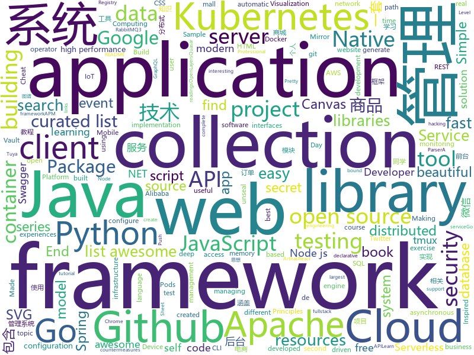

# 2019-09-26
See what the GitHub community is most excited about today.

## python
* [c9-python-getting-started](https://github.com/microsoft/c9-python-getting-started)(**832 stars today**): Sample code for Channel 9 Python for Beginners course
* [wxpy](https://github.com/youfou/wxpy)(**174 stars today**): 微信机器人 / 可能是最优雅的微信个人号 API✨✨
* [tlroadmap](https://github.com/tlbootcamp/tlroadmap)(**16 stars today**): 👩🏼‍💻👨🏻‍💻Карта навыков и модель развития тимлидов
* [flask](https://github.com/pallets/flask)(**37 stars today**): The Python micro framework for building web applications.
* [100-Days-Of-ML-Code](https://github.com/Avik-Jain/100-Days-Of-ML-Code)(**34 stars today**): 100 Days of ML Coding
* [Gooey](https://github.com/chriskiehl/Gooey)(**120 stars today**): Turn (almost) any Python command line program into a full GUI application with one line
* [tuya-convert](https://github.com/ct-Open-Source/tuya-convert)(**2 stars today**): A collection of scripts to flash Tuya IoT devices to alternative firmwares
* [serverless-application-model](https://github.com/awslabs/serverless-application-model)(**7 stars today**): AWS Serverless Application Model (SAM) is an open-source framework for building serverless applications
* [gitGraber](https://github.com/hisxo/gitGraber)(**34 stars today**): gitGraber: monitor GitHub to search and find sensitive data in real time for different online services such as: Google, Amazon, Paypal, Github, Mailgun, Facebook, Twitter, Heroku, Stripe...
* [wait-for-it](https://github.com/vishnubob/wait-for-it)(**5 stars today**): Pure bash script to test and wait on the availability of a TCP host and port
* [redqueen](https://github.com/RUB-SysSec/redqueen)(**31 stars today**): 
* [12306](https://github.com/testerSunshine/12306)(**156 stars today**): 12306智能刷票，订票
* [FaceForensics](https://github.com/ondyari/FaceForensics)(**58 stars today**): Github of the FaceForensics dataset
* [moto](https://github.com/spulec/moto)(**3 stars today**): A library that allows you to easily mock out tests based on AWS infrastructure.
* [Keras-GAN](https://github.com/eriklindernoren/Keras-GAN)(**9 stars today**): Keras implementations of Generative Adversarial Networks.
* [CheatSheetSeries](https://github.com/OWASP/CheatSheetSeries)(**70 stars today**): The OWASP Cheat Sheet Series was created to provide a concise collection of high value information on specific application security topics.
* [espresso](https://github.com/freewym/espresso)(**40 stars today**): Espresso: A Fast End-to-End Neural Speech Recognition Toolkit
* [stylegan](https://github.com/NVlabs/stylegan)(**8 stars today**): StyleGAN - Official TensorFlow Implementation
* [dlrm](https://github.com/facebookresearch/dlrm)(**12 stars today**): An implementation of a deep learning recommendation model (DLRM)
* [WeasyPrint](https://github.com/Kozea/WeasyPrint)(**4 stars today**): WeasyPrint converts web documents (HTML with CSS, SVG, …) to PDF.
* [tornado](https://github.com/tornadoweb/tornado)(**9 stars today**): Tornado is a Python web framework and asynchronous networking library, originally developed at FriendFeed.
* [fastai-v3](https://github.com/render-examples/fastai-v3)(**5 stars today**): Starter app for fastai v3 model deployment on Render
* [FATE](https://github.com/FederatedAI/FATE)(**10 stars today**): An Industrial Level Federated Learning Framework
* [aiohttp](https://github.com/aio-libs/aiohttp)(**13 stars today**): Asynchronous HTTP client/server framework for asyncio and Python
* [python](https://github.com/kubernetes-client/python)(**7 stars today**): Official Python client library for kubernetes

## java
* [spring-analysis](https://github.com/seaswalker/spring-analysis)(**39 stars today**): Spring源码阅读
* [mall](https://github.com/macrozheng/mall)(**84 stars today**): mall项目是一套电商系统，包括前台商城系统及后台管理系统，基于SpringBoot+MyBatis实现。 前台商城系统包含首页门户、商品推荐、商品搜索、商品展示、购物车、订单流程、会员中心、客户服务、帮助中心等模块。 后台管理系统包含商品管理、订单管理、会员管理、促销管理、运营管理、内容管理、统计报表、财务管理、权限管理、设置等模块。
* [halo](https://github.com/halo-dev/halo)(**148 stars today**): ✍ Halo 一款现代化的个人独立博客系统
* [piggymetrics](https://github.com/sqshq/piggymetrics)(**10 stars today**): Microservice Architecture with Spring Boot, Spring Cloud and Docker
* [netty](https://github.com/netty/netty)(**19 stars today**): Netty project - an event-driven asynchronous network application framework
* [skywalking](https://github.com/apache/skywalking)(**25 stars today**): APM, Application Performance Monitoring System
* [thingsboard](https://github.com/thingsboard/thingsboard)(**8 stars today**): Open-source IoT Platform - Device management, data collection, processing and visualization.
* [flink](https://github.com/apache/flink)(**20 stars today**): Apache Flink
* [elasticsearch](https://github.com/elastic/elasticsearch)(**39 stars today**): Open Source, Distributed, RESTful Search Engine
* [mall-learning](https://github.com/macrozheng/mall-learning)(**121 stars today**): mall学习教程，架构、业务、技术要点全方位解析。mall项目（20k+star）是一套电商系统，使用现阶段主流技术实现。 涵盖了SpringBoot2.1.3、MyBatis3.4.6、Elasticsearch6.2.2、RabbitMQ3.7.15、Redis3.2、Mongodb3.2、Mysql5.7等技术，采用Docker容器化部署。
* [ignite](https://github.com/apache/ignite)(**2 stars today**): Mirror of Apache Ignite
* [Algorithms](https://github.com/williamfiset/Algorithms)(**12 stars today**): A collection of algorithms
* [okhttp](https://github.com/square/okhttp)(**20 stars today**): An HTTP client for Android, Kotlin, and Java.
* [tutorials](https://github.com/eugenp/tutorials)(**22 stars today**): The "REST With Spring" Course:
* [react-native-navigation](https://github.com/wix/react-native-navigation)(**4 stars today**): A complete native navigation solution for React Native
* [bigbluebutton](https://github.com/bigbluebutton/bigbluebutton)(**13 stars today**): Complete open source web conferencing system.
* [zeppelin](https://github.com/apache/zeppelin)(**5 stars today**): Mirror of Apache Zeppelin
* [fullstack-tutorial](https://github.com/frank-lam/fullstack-tutorial)(**18 stars today**): 🚀fullstack tutorial 2019，后台技术栈/架构师之路/全栈开发社区，春招/秋招/校招/面试
* [YCSB](https://github.com/brianfrankcooper/YCSB)(**5 stars today**): Yahoo! Cloud Serving Benchmark
* [advanced-java](https://github.com/doocs/advanced-java)(**81 stars today**): 😮互联网 Java 工程师进阶知识完全扫盲：涵盖高并发、分布式、高可用、微服务等领域知识，后端同学必看，前端同学也可学习
* [arthas](https://github.com/alibaba/arthas)(**22 stars today**): Alibaba Java Diagnostic Tool Arthas/Alibaba Java诊断利器Arthas
* [react-native-webview](https://github.com/react-native-community/react-native-webview)(**8 stars today**): React Native Cross-Platform WebView
* [swagger-core](https://github.com/swagger-api/swagger-core)(**9 stars today**): Examples and server integrations for generating the Swagger API Specification, which enables easy access to your REST API
* [spring-framework](https://github.com/spring-projects/spring-framework)(**20 stars today**): Spring Framework
* [otter](https://github.com/alibaba/otter)(**20 stars today**): 阿里巴巴分布式数据库同步系统(解决中美异地机房)

## unknown
* [computer-science](https://github.com/ossu/computer-science)(**962 stars today**): 🎓Path to a free self-taught education in Computer Science!
* [First-steps-towards-Deep-Learning](https://github.com/vaibhawvipul/First-steps-towards-Deep-Learning)(**12 stars today**): This is an open sourced book on deep learning.
* [API-Security-Checklist](https://github.com/shieldfy/API-Security-Checklist)(**43 stars today**): Checklist of the most important security countermeasures when designing, testing, and releasing your API
* [learn-regex](https://github.com/ziishaned/learn-regex)(**129 stars today**): Learn regex the easy way
* [awesome-blazor](https://github.com/AdrienTorris/awesome-blazor)(**22 stars today**): Resources for Blazor, a .NET web framework using C#/Razor and HTML that runs in the browser with WebAssembly.
* [You-Dont-Know-JS](https://github.com/getify/You-Dont-Know-JS)(**51 stars today**): A book series on JavaScript. @YDKJS on twitter.
* [30-seconds-of-css](https://github.com/30-seconds/30-seconds-of-css)(**12 stars today**): A curated collection of useful CSS snippets you can understand in 30 seconds or less.
* [awesome-cpp](https://github.com/fffaraz/awesome-cpp)(**23 stars today**): A curated list of awesome C++ (or C) frameworks, libraries, resources, and shiny things. Inspired by awesome-... stuff.
* [Specs](https://github.com/CocoaPods/Specs)(**9 stars today**): The CocoaPods Master Repo
* [awesome-public-datasets](https://github.com/awesomedata/awesome-public-datasets)(**31 stars today**): A topic-centric list of HQ open datasets. PR ☛☛☛
* [Awesome-Hacking-Resources](https://github.com/vitalysim/Awesome-Hacking-Resources)(**20 stars today**): A collection of hacking / penetration testing resources to make you better!
* [CKAD-exercises](https://github.com/dgkanatsios/CKAD-exercises)(**17 stars today**): A set of exercises to prepare for Certified Kubernetes Application Developer exam by Cloud Native Computing Foundation
* [IntelliJ-IDEA-Tutorial](https://github.com/judasn/IntelliJ-IDEA-Tutorial)(**17 stars today**): IntelliJ IDEA 简体中文专题教程
* [awesome](https://github.com/sindresorhus/awesome)(**92 stars today**): 😎Awesome lists about all kinds of interesting topics
* [AKS](https://github.com/Azure/AKS)(**2 stars today**): Azure Kubernetes Service
* [hacker-laws](https://github.com/dwmkerr/hacker-laws)(**18 stars today**): 💻📖Laws, Theories, Principles and Patterns that developers will find useful. #hackerlaws
* [dotnetconf2019](https://github.com/dotnet-presentations/dotnetconf2019)(**21 stars today**): Creative and technical content for running a .NET Conf 2019 local event in your community
* [tasks](https://github.com/rolling-scopes-school/tasks)(**2 stars today**): 
* [awesome-postgres](https://github.com/dhamaniasad/awesome-postgres)(**7 stars today**): A curated list of awesome PostgreSQL software, libraries, tools and resources, inspired by awesome-mysql
* [docker-cheat-sheet](https://github.com/wsargent/docker-cheat-sheet)(**8 stars today**): Docker Cheat Sheet
* [awesome-java](https://github.com/akullpp/awesome-java)(**19 stars today**): A curated list of awesome frameworks, libraries and software for the Java programming language.
* [PSSC-2019](https://github.com/diercan/PSSC-2019)(**0 stars today**): 
* [Machine-Learning-Session](https://github.com/shuhuai007/Machine-Learning-Session)(**50 stars today**): 
* [OnJava8](https://github.com/LingCoder/OnJava8)(**92 stars today**): 《On Java 8》中文版，又名《Java编程思想》 第5版
* [.tmux](https://github.com/gpakosz/.tmux)(**7 stars today**): 🇫🇷Oh My Tmux! Pretty & versatile tmux configuration made with❤️(imho the best tmux configuration that just works)

## javascript
* [nodebestpractices](https://github.com/goldbergyoni/nodebestpractices)(**39 stars today**): ✅The largest Node.js best practices list (September 2019)
* [shiori](https://github.com/go-shiori/shiori)(**85 stars today**): Simple bookmark manager built with Go
* [javascript-algorithms](https://github.com/trekhleb/javascript-algorithms)(**159 stars today**): 📝Algorithms and data structures implemented in JavaScript with explanations and links to further readings
* [openlayers](https://github.com/openlayers/openlayers)(**11 stars today**): OpenLayers
* [quasar](https://github.com/quasarframework/quasar)(**15 stars today**): Quasar Framework - Build high-performance VueJS user interfaces in record time
* [fabric.js](https://github.com/fabricjs/fabric.js)(**23 stars today**): Javascript Canvas Library, SVG-to-Canvas (& canvas-to-SVG) Parser
* [react](https://github.com/facebook/react)(**73 stars today**): A declarative, efficient, and flexible JavaScript library for building user interfaces.
* [react-beautiful-dnd](https://github.com/atlassian/react-beautiful-dnd)(**27 stars today**): Beautiful and accessible drag and drop for lists with React
* [puppeteer](https://github.com/GoogleChrome/puppeteer)(**40 stars today**): Headless Chrome Node.js API
* [moment](https://github.com/moment/moment)(**18 stars today**): Parse, validate, manipulate, and display dates in javascript.
* [jquery](https://github.com/jquery/jquery)(**11 stars today**): jQuery JavaScript Library
* [backup-and-bcp-for-aws](https://github.com/ned-kelly/backup-and-bcp-for-aws)(**6 stars today**): A collection of scripts & tooling that's executed from Lambda to backup your AWS Services such as Route53, EBS, RDS, EFS, etc into a S3 bucket allowing you to sync into Google Cloud for Business Continuity.
* [incubator-superset](https://github.com/apache/incubator-superset)(**15 stars today**): Apache Superset (incubating) is a modern, enterprise-ready business intelligence web application
* [carbon](https://github.com/carbon-design-system/carbon)(**18 stars today**): A design system built by IBM
* [graphql-engine](https://github.com/hasura/graphql-engine)(**17 stars today**): Blazing fast, instant realtime GraphQL APIs on Postgres with fine grained access control, also trigger webhooks on database events.
* [readme-md-generator](https://github.com/kefranabg/readme-md-generator)(**8 stars today**): 📄CLI that generates beautiful README.md files
* [wxappUnpacker](https://github.com/qwerty472123/wxappUnpacker)(**17 stars today**): Wechat App(微信小程序,.wxapkg)解包及相关文件(.wxss,.json,.wxs,.wxml)还原工具
* [pushgateway](https://github.com/prometheus/pushgateway)(**8 stars today**): Push acceptor for ephemeral and batch jobs.
* [aframe](https://github.com/aframevr/aframe)(**5 stars today**): 🅰️web framework for building virtual reality experiences.
* [search-ui](https://github.com/elastic/search-ui)(**4 stars today**): Search UI. Libraries for the fast development of modern, engaging search experiences.
* [hello-world-npm](https://github.com/Codertocat/hello-world-npm)(**5 stars today**): This is a simple npm package that demonstrates the Github Package Registry
* [hapi](https://github.com/hapijs/hapi)(**5 stars today**): 🏢Server Framework for Node.js
* [faker.js](https://github.com/Marak/faker.js)(**25 stars today**): generate massive amounts of realistic fake data in Node.js and the browser
* [react-router](https://github.com/ReactTraining/react-router)(**25 stars today**): Declarative routing for React
* [g6](https://github.com/antvis/g6)(**4 stars today**): A Graph Visualization Framework in JavaScript

## html
* [dragon-book-exercise-answers](https://github.com/fool2fish/dragon-book-exercise-answers)(**7 stars today**): Compilers Principles, Techniques, & Tools (purple dragon book) second edition exercise answers. 编译原理（紫龙书）第2版习题答案。
* [blog](https://github.com/biaochenxuying/blog)(**10 stars today**): 技术为主，读书笔记、随笔、理财为辅，做个终身学习者。
* [hyperblog](https://github.com/freddier/hyperblog)(**6 stars today**): Un blog increíble para el curso de Git y Github de Platzi
* [hacktoberfest-swag-list](https://github.com/crweiner/hacktoberfest-swag-list)(**25 stars today**): Multiple companies give out swag for Hacktoberfest, and this repo tries to list them all.
* [web-moderno](https://github.com/cod3rcursos/web-moderno)(**5 stars today**): 
* [skill-map](https://github.com/TeamStuQ/skill-map)(**13 stars today**): 程序员技能图谱
* [chosen](https://github.com/harvesthq/chosen)(**2 stars today**): Chosen is a library for making long, unwieldy select boxes more friendly.
* [professional-services](https://github.com/GoogleCloudPlatform/professional-services)(**2 stars today**): Common solutions and tools developed by Google Cloud's Professional Services team
* [webdevbootcamp](https://github.com/nax3t/webdevbootcamp)(**1 stars today**): All source code for back-end projects from the Web Developer Bootcamp
* [core](https://github.com/stackblitz/core)(**4 stars today**): Online IDE powered by Visual Studio Code⚡️
* [portainer](https://github.com/portainer/portainer)(**12 stars today**): Making Docker management easy.
* [owasp-mstg](https://github.com/OWASP/owasp-mstg)(**8 stars today**): The Mobile Security Testing Guide (MSTG) is a comprehensive manual for mobile app security development, testing and reverse engineering.
* [chart-doctor](https://github.com/ft-interactive/chart-doctor)(**5 stars today**): Sample files to accompany the FT's Chart Doctor column
* [hugo-academic](https://github.com/gcushen/hugo-academic)(**6 stars today**): 📝The website builder for Hugo. Build and deploy a beautiful website in minutes!
* [swagger-codegen](https://github.com/swagger-api/swagger-codegen)(**12 stars today**): swagger-codegen contains a template-driven engine to generate documentation, API clients and server stubs in different languages by parsing your OpenAPI / Swagger definition.
* [servicecomb-website](https://github.com/apache/servicecomb-website)(**6 stars today**): Apache ServiceComb
* [JavaScript30](https://github.com/wesbos/JavaScript30)(**5 stars today**): 30 Day Vanilla JS Challenge
* [qcloud-documents](https://github.com/tencentyun/qcloud-documents)(**0 stars today**): 腾讯云官方文档 使用Markdown自动构建
* [masonry](https://github.com/desandro/masonry)(**3 stars today**): 🏩Cascading grid layout plugin
* [sale-workflow](https://github.com/OCA/sale-workflow)(**0 stars today**): Odoo Sales, Workflow and Organization
* [awesome-angular](https://github.com/PatrickJS/awesome-angular)(**3 stars today**): 📄A curated list of awesome Angular resources
* [TheHive](https://github.com/TheHive-Project/TheHive)(**2 stars today**): TheHive: a Scalable, Open Source and Free Security Incident Response Platform
* [startbootstrap-sb-admin-2](https://github.com/BlackrockDigital/startbootstrap-sb-admin-2)(**5 stars today**): A free, open source, Bootstrap admin theme created by Start Bootstrap
* [awesome-modern-cpp](https://github.com/rigtorp/awesome-modern-cpp)(**6 stars today**): A collection of resources on modern C++
* [Flaskex](https://github.com/anfederico/Flaskex)(**3 stars today**): Simple flask example for quick prototypes and small applications

## go
* [shhgit](https://github.com/eth0izzle/shhgit)(**96 stars today**): Ah shhgit! Find GitHub secrets in real time
* [lazydocker](https://github.com/jesseduffield/lazydocker)(**40 stars today**): The lazier way to manage everything docker
* [prometheus](https://github.com/prometheus/prometheus)(**28 stars today**): The Prometheus monitoring system and time series database.
* [libpod](https://github.com/containers/libpod)(**15 stars today**): libpod is a library used to create container pods. Home of Podman.
* [moby](https://github.com/moby/moby)(**17 stars today**): Moby Project - a collaborative project for the container ecosystem to assemble container-based systems
* [kubeedge](https://github.com/kubeedge/kubeedge)(**10 stars today**): Kubernetes Native Edge Computing Framework (project under CNCF)
* [fasthttp](https://github.com/valyala/fasthttp)(**139 stars today**): Fast HTTP package for Go. Tuned for high performance. Zero memory allocations in hot paths. Up to 10x faster than net/http
* [gitea](https://github.com/go-gitea/gitea)(**83 stars today**): Git with a cup of tea, painless self-hosted git service
* [protobuf](https://github.com/golang/protobuf)(**40 stars today**): Go support for Google's protocol buffers
* [consul](https://github.com/hashicorp/consul)(**9 stars today**): Consul is a distributed, highly available, and data center aware solution to connect and configure applications across dynamic, distributed infrastructure.
* [kubernetes](https://github.com/kubernetes/kubernetes)(**48 stars today**): Production-Grade Container Scheduling and Management
* [autoscaler](https://github.com/kubernetes/autoscaler)(**7 stars today**): Autoscaling components for Kubernetes
* [community](https://github.com/kubernetes/community)(**9 stars today**): Kubernetes community content
* [sqlflow](https://github.com/sql-machine-learning/sqlflow)(**9 stars today**): Brings SQL and AI together.
* [faas](https://github.com/openfaas/faas)(**18 stars today**): OpenFaaS - Serverless Functions Made Simple
* [kratos](https://github.com/bilibili/kratos)(**16 stars today**): Kratos是bilibili开源的一套Go微服务框架，包含大量微服务相关框架及工具。
* [helm](https://github.com/helm/helm)(**18 stars today**): The Kubernetes Package Manager
* [clair](https://github.com/coreos/clair)(**6 stars today**): Vulnerability Static Analysis for Containers
* [kubebuilder](https://github.com/kubernetes-sigs/kubebuilder)(**11 stars today**): Kubebuilder - SDK for building Kubernetes APIs using CRDs
* [bank-vaults](https://github.com/banzaicloud/bank-vaults)(**1 stars today**): A Vault swiss-army knife: a K8s operator, Go client with automatic token renewal, automatic configuration, multiple unseal options and more. A CLI tool to init, unseal and configure Vault (auth methods, secret engines). Direct secret injection into Pods.
* [ristretto](https://github.com/dgraph-io/ristretto)(**100 stars today**): A high performance memory-bound Go cache
* [goss](https://github.com/aelsabbahy/goss)(**5 stars today**): Quick and Easy server testing/validation
* [origin](https://github.com/openshift/origin)(**6 stars today**): The self-managing, auto-upgrading, Kubernetes distribution for everyone
* [spark-on-k8s-operator](https://github.com/GoogleCloudPlatform/spark-on-k8s-operator)(**5 stars today**): Kubernetes operator for managing the lifecycle of Apache Spark applications on Kubernetes.
* [cockroach](https://github.com/cockroachdb/cockroach)(**14 stars today**): CockroachDB - the open source, cloud-native SQL database.

## WordCloud

