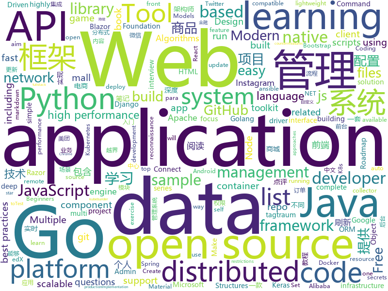

# 2019-09-27
See what the GitHub community is most excited about today.

## python
* [100-Days-Of-ML-Code](https://github.com/Avik-Jain/100-Days-Of-ML-Code)(**33 stars today**): 100 Days of ML Coding
* [wxpy](https://github.com/youfou/wxpy)(**293 stars today**): 微信机器人 / 可能是最优雅的微信个人号 API✨✨
* [c9-python-getting-started](https://github.com/microsoft/c9-python-getting-started)(**356 stars today**): Sample code for Channel 9 Python for Beginners course
* [ansible](https://github.com/ansible/ansible)(**15 stars today**): Ansible is a radically simple IT automation platform that makes your applications and systems easier to deploy. Avoid writing scripts or custom code to deploy and update your applications — automate in a language that approaches plain English, using SSH, with no agents to install on remote systems. https://docs.ansible.com/ansible/
* [redash](https://github.com/getredash/redash)(**13 stars today**): Make Your Company Data Driven. Connect to any data source, easily visualize, dashboard and share your data.
* [python-cheatsheet](https://github.com/gto76/python-cheatsheet)(**36 stars today**): Comprehensive Python Cheatsheet
* [instabot](https://github.com/instagrambot/instabot)(**13 stars today**): 🐙Free Instagram scripts, bots and Python API wrapper. Get free instagram followers with our auto like, auto follow and other scripts!
* [iOS-DeviceSupport](https://github.com/iGhibli/iOS-DeviceSupport)(**27 stars today**): This repository holds the device support files for the iOS, and I will update it regularly.
* [gym](https://github.com/openai/gym)(**8 stars today**): A toolkit for developing and comparing reinforcement learning algorithms.
* [elasticsearch-dsl-py](https://github.com/elastic/elasticsearch-dsl-py)(**3 stars today**): High level Python client for Elasticsearch
* [google-research](https://github.com/google-research/google-research)(**10 stars today**): Google AI Research
* [FaceForensics](https://github.com/ondyari/FaceForensics)(**57 stars today**): Github of the FaceForensics dataset
* [rlpyt](https://github.com/astooke/rlpyt)(**17 stars today**): Reinforcement Learning in PyTorch
* [AutoRecon](https://github.com/Tib3rius/AutoRecon)(**11 stars today**): AutoRecon is a multi-threaded network reconnaissance tool which performs automated enumeration of services.
* [ambassador](https://github.com/datawire/ambassador)(**0 stars today**): open source Kubernetes-native API gateway for microservices built on the Envoy Proxy
* [FinMind](https://github.com/linsamtw/FinMind)(**12 stars today**): Open Data, more than 50 financial data. 提供超過 50 個金融資料，每天更新
* [black](https://github.com/psf/black)(**22 stars today**): The uncompromising Python code formatter
* [aws-cli](https://github.com/aws/aws-cli)(**10 stars today**): Universal Command Line Interface for Amazon Web Services
* [compose](https://github.com/docker/compose)(**7 stars today**): Define and run multi-container applications with Docker
* [edx-platform](https://github.com/edx/edx-platform)(**3 stars today**): The Open edX platform, the software that powers edX!
* [models](https://github.com/PaddlePaddle/models)(**13 stars today**): Pre-trained and Reproduced Deep Learning Models （『飞桨』官方模型库，包含多种学术前沿和工业场景验证的深度学习模型）
* [fastapi](https://github.com/tiangolo/fastapi)(**21 stars today**): FastAPI framework, high performance, easy to learn, fast to code, ready for production
* [image-segmentation-keras](https://github.com/divamgupta/image-segmentation-keras)(**6 stars today**): Implementation of Segnet, FCN, UNet , PSPNet and other models in Keras.
* [Mask_RCNN](https://github.com/matterport/Mask_RCNN)(**16 stars today**): Mask R-CNN for object detection and instance segmentation on Keras and TensorFlow
* [models](https://github.com/tensorflow/models)(**35 stars today**): Models and examples built with TensorFlow

## java
* [halo](https://github.com/halo-dev/halo)(**62 stars today**): ✍ Halo 一款现代化的个人独立博客系统
* [mall-learning](https://github.com/macrozheng/mall-learning)(**41 stars today**): mall学习教程，架构、业务、技术要点全方位解析。mall项目（20k+star）是一套电商系统，使用现阶段主流技术实现。 涵盖了SpringBoot2.1.3、MyBatis3.4.6、Elasticsearch6.2.2、RabbitMQ3.7.15、Redis3.2、Mongodb3.2、Mysql5.7等技术，采用Docker容器化部署。
* [cat](https://github.com/dianping/cat)(**16 stars today**): CAT 作为服务端项目基础组件，提供了 Java, C/C++, Node.js, Python, Go 等多语言客户端，已经在美团点评的基础架构中间件框架（MVC框架，RPC框架，数据库框架，缓存框架等，消息队列，配置系统等）深度集成，为美团点评各业务线提供系统丰富的性能指标、健康状况、实时告警等。
* [MyBookshelf](https://github.com/gedoor/MyBookshelf)(**18 stars today**): 阅读是一款可以自定义来源阅读网络内容的工具，为广大网络文学爱好者提供一种方便、快捷舒适的试读体验。
* [spring-analysis](https://github.com/seaswalker/spring-analysis)(**223 stars today**): Spring源码阅读
* [mall](https://github.com/macrozheng/mall)(**62 stars today**): mall项目是一套电商系统，包括前台商城系统及后台管理系统，基于SpringBoot+MyBatis实现。 前台商城系统包含首页门户、商品推荐、商品搜索、商品展示、购物车、订单流程、会员中心、客户服务、帮助中心等模块。 后台管理系统包含商品管理、订单管理、会员管理、促销管理、运营管理、内容管理、统计报表、财务管理、权限管理、设置等模块。
* [bigbluebutton](https://github.com/bigbluebutton/bigbluebutton)(**5 stars today**): Complete open source web conferencing system.
* [cassandra](https://github.com/apache/cassandra)(**4 stars today**): Mirror of Apache Cassandra
* [antlr4](https://github.com/antlr/antlr4)(**3 stars today**): ANTLR (ANother Tool for Language Recognition) is a powerful parser generator for reading, processing, executing, or translating structured text or binary files.
* [graal](https://github.com/oracle/graal)(**19 stars today**): GraalVM: Run Programs Faster Anywhere🚀
* [apollo](https://github.com/ctripcorp/apollo)(**30 stars today**): Apollo（阿波罗）是携程框架部门研发的分布式配置中心，能够集中化管理应用不同环境、不同集群的配置，配置修改后能够实时推送到应用端，并且具备规范的权限、流程治理等特性，适用于微服务配置管理场景。
* [arthas](https://github.com/alibaba/arthas)(**34 stars today**): Alibaba Java Diagnostic Tool Arthas/Alibaba Java诊断利器Arthas
* [junit5-samples](https://github.com/junit-team/junit5-samples)(**1 stars today**): Collection of sample applications using JUnit 5.
* [elasticsearch](https://github.com/elastic/elasticsearch)(**30 stars today**): Open Source, Distributed, RESTful Search Engine
* [xxl-job](https://github.com/xuxueli/xxl-job)(**25 stars today**): A lightweight distributed task scheduling framework.（分布式任务调度平台XXL-JOB）
* [camera-samples](https://github.com/android/camera-samples)(**7 stars today**): Multiple samples showing the best practices in camera APIs on Android.
* [GCViewer](https://github.com/chewiebug/GCViewer)(**4 stars today**): Fork of tagtraum industries' GCViewer. Tagtraum stopped development in 2008, I aim to improve support for Sun's / Oracle's java 1.6+ garbage collector logs (including G1 collector)
* [SmartRefreshLayout](https://github.com/scwang90/SmartRefreshLayout)(**16 stars today**): 🔥下拉刷新、上拉加载、二级刷新、淘宝二楼、RefreshLayout、OverScroll，Android智能下拉刷新框架，支持越界回弹、越界拖动，具有极强的扩展性，集成了几十种炫酷的Header和 Footer。
* [keycloak](https://github.com/keycloak/keycloak)(**9 stars today**): Open Source Identity and Access Management For Modern Applications and Services
* [skywalking](https://github.com/apache/skywalking)(**27 stars today**): APM, Application Performance Monitoring System
* [zipkin](https://github.com/openzipkin/zipkin)(**7 stars today**): Zipkin is a distributed tracing system
* [seata](https://github.com/seata/seata)(**23 stars today**): 🔥Seata is an easy-to-use, high-performance, open source distributed transaction solution.
* [beam](https://github.com/apache/beam)(**3 stars today**): Apache Beam
* [ksql](https://github.com/confluentinc/ksql)(**1 stars today**): KSQL - the Streaming SQL Engine for Apache Kafka
* [neo4j](https://github.com/neo4j/neo4j)(**8 stars today**): Graphs for Everyone

## unknown
* [computer-science](https://github.com/ossu/computer-science)(**379 stars today**): 🎓Path to a free self-taught education in Computer Science!
* [nlp-roadmap](https://github.com/graykode/nlp-roadmap)(**179 stars today**): ROADMAP(Mind Map) and KEYWORD for students those who have interest in learning NLP
* [awesome-blazor](https://github.com/AdrienTorris/awesome-blazor)(**20 stars today**): Resources for Blazor, a .NET web framework using C#/Razor and HTML that runs in the browser with WebAssembly.
* [API-Security-Checklist](https://github.com/shieldfy/API-Security-Checklist)(**149 stars today**): Checklist of the most important security countermeasures when designing, testing, and releasing your API
* [awesome-architecture](https://github.com/toutiaoio/awesome-architecture)(**23 stars today**): 架构师技术图谱，助你早日成为架构师
* [new-grads-2020](https://github.com/cmackenzie1/new-grads-2020)(**5 stars today**): A collection of new grad roles for 2020
* [summer2020internships](https://github.com/elaine-zheng/summer2020internships)(**13 stars today**): Keep track of internships for Summer 2020 for undergraduates interested in tech./SWE/related fields
* [learn-regex](https://github.com/ziishaned/learn-regex)(**149 stars today**): Learn regex the easy way
* [You-Dont-Know-JS](https://github.com/getify/You-Dont-Know-JS)(**43 stars today**): A book series on JavaScript. @YDKJS on twitter.
* [DSA20](https://github.com/helghareeb/DSA20)(**11 stars today**): Data Structures and Algorithms - Mansoura University - 2019/2020
* [awesome-for-beginners](https://github.com/MunGell/awesome-for-beginners)(**39 stars today**): A list of awesome beginners-friendly projects.
* [OnJava8](https://github.com/LingCoder/OnJava8)(**37 stars today**): 《On Java 8》中文版，又名《Java编程思想》 第5版
* [developer-roadmap](https://github.com/kamranahmedse/developer-roadmap)(**53 stars today**): Roadmap to becoming a web developer in 2019
* [GNNPapers](https://github.com/thunlp/GNNPapers)(**13 stars today**): Must-read papers on graph neural networks (GNN)
* [dotnetconf2019](https://github.com/dotnet-presentations/dotnetconf2019)(**19 stars today**): Creative and technical content for running a .NET Conf 2019 local event in your community
* [Specs](https://github.com/CocoaPods/Specs)(**3 stars today**): The CocoaPods Master Repo
* [First-steps-towards-Deep-Learning](https://github.com/vaibhawvipul/First-steps-towards-Deep-Learning)(**83 stars today**): This is an open sourced book on deep learning.
* [git-flight-rules](https://github.com/k88hudson/git-flight-rules)(**32 stars today**): Flight rules for git
* [aws-modern-application-workshop](https://github.com/aws-samples/aws-modern-application-workshop)(**3 stars today**): A tutorial for developers that want to learn about how to build modern applications on top of AWS. You will build a sample website that leverages infrastructure as code, containers, serverless code functions, CI/CD, and more.
* [reactjs-interview-questions](https://github.com/sudheerj/reactjs-interview-questions)(**11 stars today**): List of top 500 ReactJS Interview Questions & Answers....Coding exercise questions are coming soon!!
* [url](https://github.com/ZCSSR/url)(**2 stars today**): ZCSSR新地址发布页
* [AZ-103-MicrosoftAzureAdministrator](https://github.com/MicrosoftLearning/AZ-103-MicrosoftAzureAdministrator)(**2 stars today**): AZ-103: Microsoft Azure Administrator
* [vagas](https://github.com/frontendbr/vagas)(**3 stars today**): 🔬Espaço para divulgação de vagas para front-enders.
* [you-dont-know-js-ru](https://github.com/azat-io/you-dont-know-js-ru)(**3 stars today**): 📚Russian translation of "You Don't Know JS" book series
* [CKAD-exercises](https://github.com/dgkanatsios/CKAD-exercises)(**9 stars today**): A set of exercises to prepare for Certified Kubernetes Application Developer exam by Cloud Native Computing Foundation

## javascript
* [javascript-algorithms](https://github.com/trekhleb/javascript-algorithms)(**141 stars today**): 📝Algorithms and data structures implemented in JavaScript with explanations and links to further readings
* [carbon](https://github.com/carbon-design-system/carbon)(**16 stars today**): A design system built by IBM
* [markdown-here](https://github.com/adam-p/markdown-here)(**37 stars today**): Google Chrome, Firefox, and Thunderbird extension that lets you write email in Markdown and render it before sending.
* [ogl](https://github.com/oframe/ogl)(**33 stars today**): Minimal WebGL framework
* [openlayers](https://github.com/openlayers/openlayers)(**18 stars today**): OpenLayers
* [releases](https://github.com/react-native-community/releases)(**1 stars today**): React Native releases
* [Web](https://github.com/qianguyihao/Web)(**59 stars today**): 前端入门和进阶学习笔记，超详细的Web前端学习图文教程。从零开始学前端，做一个Web全栈工程师。持续更新...
* [nodebestpractices](https://github.com/goldbergyoni/nodebestpractices)(**222 stars today**): ✅The largest Node.js best practices list (September 2019)
* [Vue.Draggable](https://github.com/SortableJS/Vue.Draggable)(**22 stars today**): Vue drag-and-drop component based on Sortable.js
* [quasar](https://github.com/quasarframework/quasar)(**23 stars today**): Quasar Framework - Build high-performance VueJS user interfaces in record time
* [fullPage.js](https://github.com/alvarotrigo/fullPage.js)(**56 stars today**): fullPage plugin by Alvaro Trigo. Create full screen pages fast and simple
* [react-native](https://github.com/facebook/react-native)(**39 stars today**): A framework for building native apps with React.
* [create-react-app](https://github.com/facebook/create-react-app)(**31 stars today**): Set up a modern web app by running one command.
* [outline](https://github.com/outline/outline)(**31 stars today**): The fastest wiki and knowledge base for growing teams. Beautiful, feature rich, markdown compatible and open source.
* [realworld](https://github.com/gothinkster/realworld)(**44 stars today**): "The mother of all demo apps" — Exemplary fullstack Medium.com clone powered by React, Angular, Node, Django, and many more🏅
* [react-boilerplate](https://github.com/react-boilerplate/react-boilerplate)(**31 stars today**): 🔥A highly scalable, offline-first foundation with the best developer experience and a focus on performance and best practices.
* [CppCon2019](https://github.com/CppCon/CppCon2019)(**56 stars today**): Slides and other materials from CppCon 2019
* [date-fns](https://github.com/date-fns/date-fns)(**15 stars today**): ⏳Modern JavaScript date utility library⌛️
* [adblockradio](https://github.com/adblockradio/adblockradio)(**86 stars today**): An adblocker for live radio streams and podcasts. Machine learning meets Shazam.
* [tabulator](https://github.com/olifolkerd/tabulator)(**18 stars today**): Interactive Tables and Data Grids for JavaScript
* [workbox](https://github.com/GoogleChrome/workbox)(**26 stars today**): 📦Workbox: JavaScript libraries for Progressive Web Apps
* [yup](https://github.com/jquense/yup)(**22 stars today**): Dead simple Object schema validation
* [mobx](https://github.com/mobxjs/mobx)(**11 stars today**): Simple, scalable state management.
* [Windows-universal-samples](https://github.com/microsoft/Windows-universal-samples)(**6 stars today**): API samples for the Universal Windows Platform.
* [engine](https://github.com/cocos-creator/engine)(**1 stars today**): Cocos Creator is a complete package of game development tools and workflow, including a game engine, resource management, scene editing, game preview, debug and publish one project to multiple platforms.

## html
* [hacktoberfest-swag-list](https://github.com/crweiner/hacktoberfest-swag-list)(**20 stars today**): Multiple companies give out swag for Hacktoberfest, and this repo tries to list them all.
* [shellphish](https://github.com/thelinuxchoice/shellphish)(**1 stars today**): Phishing Tool for 18 social media: Instagram, Facebook, Snapchat, Github, Twitter, Yahoo, Protonmail, Spotify, Netflix, Linkedin, Wordpress, Origin, Steam, Microsoft, InstaFollowers, Gitlab, Pinterest
* [swagger-codegen](https://github.com/swagger-api/swagger-codegen)(**9 stars today**): swagger-codegen contains a template-driven engine to generate documentation, API clients and server stubs in different languages by parsing your OpenAPI / Swagger definition.
* [web-moderno](https://github.com/cod3rcursos/web-moderno)(**2 stars today**): 
* [MatBlazor](https://github.com/SamProf/MatBlazor)(**10 stars today**): Material Design components for Blazor and Razor Components
* [Front-end-Developer-Interview-Questions](https://github.com/h5bp/Front-end-Developer-Interview-Questions)(**18 stars today**): A list of helpful front-end related questions you can use to interview potential candidates, test yourself or completely ignore.
* [illuminate](https://github.com/bongikairu/illuminate)(**7 stars today**): 
* [portainer](https://github.com/portainer/portainer)(**5 stars today**): Making Docker management easy.
* [hippocratic-license](https://github.com/ContributorCovenant/hippocratic-license)(**7 stars today**): An ethical open source license alternative.
* [training-kit](https://github.com/github/training-kit)(**6 stars today**): Open source cheat sheets for Git and GitHub
* [Coursera-ML-AndrewNg-Notes](https://github.com/fengdu78/Coursera-ML-AndrewNg-Notes)(**84 stars today**): 吴恩达老师的机器学习课程个人笔记
* [jsr](https://github.com/mercyblitz/jsr)(**4 stars today**): Java Specification Requests
* [fonts](https://github.com/google/fonts)(**6 stars today**): Font files available from Google Fonts
* [chart-doctor](https://github.com/ft-interactive/chart-doctor)(**4 stars today**): Sample files to accompany the FT's Chart Doctor column
* [Django-CRM](https://github.com/MicroPyramid/Django-CRM)(**2 stars today**): Open Source Python CRM based on Django aimed to salesforce compatible for migrating to
* [wpt](https://github.com/web-platform-tests/wpt)(**1 stars today**): Test suites for Web platform specs — including WHATWG, W3C, and others
* [OzBargain-Repo](https://github.com/TheOzBargainer/OzBargain-Repo)(**1 stars today**): 
* [learning-area](https://github.com/mdn/learning-area)(**1 stars today**): Github repo for the MDN Learning Area.
* [AdminLTE](https://github.com/ColorlibHQ/AdminLTE)(**44 stars today**): AdminLTE - Free Premium Admin control Panel Theme Based On Bootstrap 3.x
* [stisla](https://github.com/stisla/stisla)(**5 stars today**): Free Bootstrap Admin Template
* [material-design-lite](https://github.com/google/material-design-lite)(**1 stars today**): Material Design Components in HTML/CSS/JS
* [favorites-web](https://github.com/cloudfavorites/favorites-web)(**2 stars today**): 云收藏 Spring Boot 2.X 开源项目
* [ckeditor5-build-classic](https://github.com/ckeditor/ckeditor5-build-classic)(**2 stars today**): The classic editor build of CKEditor 5.
* [kubernetes-failure-stories](https://github.com/hjacobs/kubernetes-failure-stories)(**3 stars today**): Compilation of public failure/horror stories related to Kubernetes
* [tools](https://github.com/googlecodelabs/tools)(**1 stars today**): Codelabs management & hosting tools

## go
* [gev](https://github.com/Allenxuxu/gev)(**111 stars today**): gev is a lightweight, fast non-blocking TCP network library based on Reactor mode.
* [shhgit](https://github.com/eth0izzle/shhgit)(**213 stars today**): Ah shhgit! Find GitHub secrets in real time
* [client_golang](https://github.com/prometheus/client_golang)(**3 stars today**): Prometheus instrumentation library for Go applications
* [pgx](https://github.com/jackc/pgx)(**12 stars today**): PostgreSQL driver and toolkit for Go
* [libpod](https://github.com/containers/libpod)(**31 stars today**): libpod is a library used to create container pods. Home of Podman.
* [protobuf](https://github.com/golang/protobuf)(**10 stars today**): Go support for Google's protocol buffers
* [gitea](https://github.com/go-gitea/gitea)(**20 stars today**): Git with a cup of tea, painless self-hosted git service
* [grpc-go](https://github.com/grpc/grpc-go)(**10 stars today**): The Go language implementation of gRPC. HTTP/2 based RPC
* [gitleaks](https://github.com/zricethezav/gitleaks)(**10 stars today**): Audit git repos for secrets🔑
* [gorm](https://github.com/jinzhu/gorm)(**11 stars today**): The fantastic ORM library for Golang, aims to be developer friendly
* [lazydocker](https://github.com/jesseduffield/lazydocker)(**112 stars today**): The lazier way to manage everything docker
* [controller-runtime](https://github.com/kubernetes-sigs/controller-runtime)(**0 stars today**): Repo for the controller-runtime subproject of kubebuilder (sig-apimachinery)
* [gitrob](https://github.com/michenriksen/gitrob)(**13 stars today**): Reconnaissance tool for GitHub organizations
* [VictoriaMetrics](https://github.com/VictoriaMetrics/VictoriaMetrics)(**6 stars today**): VictoriaMetrics - high-performance, cost-effective and scalable time series database, long-term remote storage for Prometheus
* [pipeline](https://github.com/tektoncd/pipeline)(**17 stars today**): A K8s-native Pipeline resource.
* [buildkit](https://github.com/moby/buildkit)(**4 stars today**): concurrent, cache-efficient, and Dockerfile-agnostic builder toolkit
* [v2ray-core](https://github.com/v2ray/v2ray-core)(**135 stars today**): A platform for building proxies to bypass network restrictions.
* [consul](https://github.com/hashicorp/consul)(**11 stars today**): Consul is a distributed, highly available, and data center aware solution to connect and configure applications across dynamic, distributed infrastructure.
* [pg](https://github.com/go-pg/pg)(**5 stars today**): Golang ORM with focus on PostgreSQL features and performance
* [testify](https://github.com/stretchr/testify)(**9 stars today**): A toolkit with common assertions and mocks that plays nicely with the standard library
* [kops](https://github.com/kubernetes/kops)(**10 stars today**): Kubernetes Operations (kops) - Production Grade K8s Installation, Upgrades, and Management
* [mongo-go-driver](https://github.com/mongodb/mongo-go-driver)(**4 stars today**): The Go driver for MongoDB
* [elastic](https://github.com/olivere/elastic)(**3 stars today**): Elasticsearch client for Go.
* [alertmanager](https://github.com/prometheus/alertmanager)(**3 stars today**): Prometheus Alertmanager
* [the-way-to-go_ZH_CN](https://github.com/unknwon/the-way-to-go_ZH_CN)(**16 stars today**): 《The Way to Go》中文译本，中文正式名《Go 入门指南》

## WordCloud

