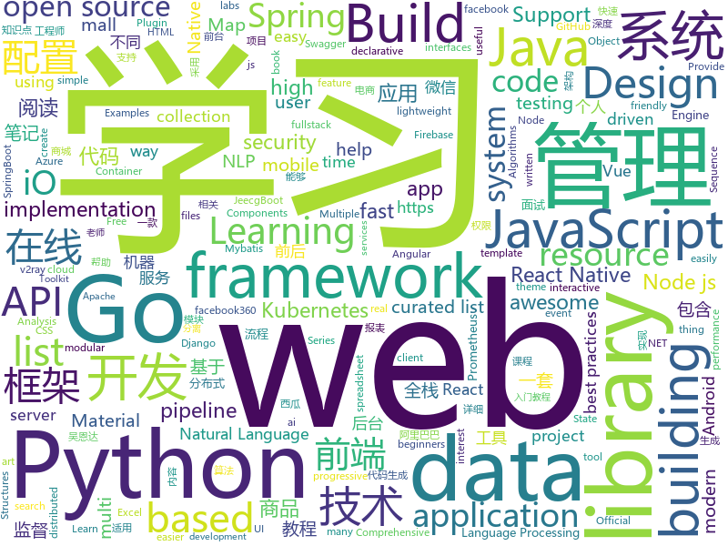

# 2019-09-28
See what the GitHub community is most excited about today.

## python
* [electricitymap-contrib](https://github.com/tmrowco/electricitymap-contrib)(**21 stars today**): A real-time visualisation of the CO2 emissions of electricity consumption
* [FaceForensics](https://github.com/ondyari/FaceForensics)(**76 stars today**): Github of the FaceForensics dataset
* [Python](https://github.com/geekcomputers/Python)(**112 stars today**): My Python Examples
* [wxpy](https://github.com/youfou/wxpy)(**242 stars today**): 微信机器人 / 可能是最优雅的微信个人号 API✨✨
* [100-Days-Of-ML-Code](https://github.com/Avik-Jain/100-Days-Of-ML-Code)(**226 stars today**): 100 Days of ML Coding
* [transformers](https://github.com/huggingface/transformers)(**386 stars today**): 🤗Transformers: State-of-the-art Natural Language Processing for TensorFlow 2.0 and PyTorch.
* [rlpyt](https://github.com/astooke/rlpyt)(**33 stars today**): Reinforcement Learning in PyTorch
* [DeepLearningExamples](https://github.com/NVIDIA/DeepLearningExamples)(**10 stars today**): Deep Learning Examples
* [django](https://github.com/django/django)(**29 stars today**): The Web framework for perfectionists with deadlines.
* [redash](https://github.com/getredash/redash)(**14 stars today**): Make Your Company Data Driven. Connect to any data source, easily visualize, dashboard and share your data.
* [mass-pwn-vbulletin](https://github.com/Frint0/mass-pwn-vbulletin)(**16 stars today**): Identify vulnerable (RCE) vBulletin 5.0.0 - 5.5.4 instances using Shodan (CVE-2019-16759)
* [python-cheatsheet](https://github.com/gto76/python-cheatsheet)(**27 stars today**): Comprehensive Python Cheatsheet
* [pandas-profiling](https://github.com/pandas-profiling/pandas-profiling)(**33 stars today**): Create HTML profiling reports from pandas DataFrame objects
* [CheatSheetSeries](https://github.com/OWASP/CheatSheetSeries)(**64 stars today**): The OWASP Cheat Sheet Series was created to provide a concise collection of high value information on specific application security topics.
* [kedro](https://github.com/quantumblacklabs/kedro)(**6 stars today**): A Python library for building robust production-ready data and analytics pipelines.
* [RecSys2019_DeepLearning_Evaluation](https://github.com/MaurizioFD/RecSys2019_DeepLearning_Evaluation)(**19 stars today**): This is the repository of our article published in RecSys 2019 "Are We Really Making Much Progress? A Worrying Analysis of Recent Neural Recommendation Approaches"
* [flair](https://github.com/zalandoresearch/flair)(**19 stars today**): A very simple framework for state-of-the-art Natural Language Processing (NLP)
* [python-docs-samples](https://github.com/GoogleCloudPlatform/python-docs-samples)(**8 stars today**): Code samples used on cloud.google.com
* [GeneralNewsExtractor](https://github.com/kingname/GeneralNewsExtractor)(**44 stars today**): 新闻网页正文通用抽取器 Alpha 版.
* [insightface](https://github.com/deepinsight/insightface)(**13 stars today**): Face Analysis Project on MXNet
* [saleor](https://github.com/mirumee/saleor)(**13 stars today**): A modular, high performance e-commerce storefront built with Python, GraphQL, Django, and ReactJS.
* [ProxyBroker](https://github.com/constverum/ProxyBroker)(**7 stars today**): Proxy [Finder | Checker | Server]. HTTP(S) & SOCKS🎭
* [fairseq](https://github.com/pytorch/fairseq)(**16 stars today**): Facebook AI Research Sequence-to-Sequence Toolkit written in Python.
* [system-design-primer](https://github.com/donnemartin/system-design-primer)(**56 stars today**): Learn how to design large-scale systems. Prep for the system design interview. Includes Anki flashcards.
* [stanfordnlp](https://github.com/stanfordnlp/stanfordnlp)(**13 stars today**): Official Stanford NLP Python Library for Many Human Languages

## java
* [spring-analysis](https://github.com/seaswalker/spring-analysis)(**71 stars today**): Spring源码阅读
* [elasticsearch](https://github.com/elastic/elasticsearch)(**37 stars today**): Open Source, Distributed, RESTful Search Engine
* [easyexcel](https://github.com/alibaba/easyexcel)(**37 stars today**): 快速、简单避免OOM的java处理Excel工具
* [canal](https://github.com/alibaba/canal)(**39 stars today**): 阿里巴巴 MySQL binlog 增量订阅&消费组件
* [tutorials](https://github.com/eugenp/tutorials)(**25 stars today**): The "REST With Spring" Course:
* [mall](https://github.com/macrozheng/mall)(**60 stars today**): mall项目是一套电商系统，包括前台商城系统及后台管理系统，基于SpringBoot+MyBatis实现。 前台商城系统包含首页门户、商品推荐、商品搜索、商品展示、购物车、订单流程、会员中心、客户服务、帮助中心等模块。 后台管理系统包含商品管理、订单管理、会员管理、促销管理、运营管理、内容管理、统计报表、财务管理、权限管理、设置等模块。
* [MyBookshelf](https://github.com/gedoor/MyBookshelf)(**24 stars today**): 阅读是一款可以自定义来源阅读网络内容的工具，为广大网络文学爱好者提供一种方便、快捷舒适的试读体验。
* [spring-framework](https://github.com/spring-projects/spring-framework)(**29 stars today**): Spring Framework
* [apollo](https://github.com/ctripcorp/apollo)(**23 stars today**): Apollo（阿波罗）是携程框架部门研发的分布式配置中心，能够集中化管理应用不同环境、不同集群的配置，配置修改后能够实时推送到应用端，并且具备规范的权限、流程治理等特性，适用于微服务配置管理场景。
* [otter](https://github.com/alibaba/otter)(**18 stars today**): 阿里巴巴分布式数据库同步系统(解决中美异地机房)
* [byte-buddy](https://github.com/raphw/byte-buddy)(**4 stars today**): Runtime code generation for the Java virtual machine.
* [cim](https://github.com/crossoverJie/cim)(**16 stars today**): 📲cim(cross IM) 适用于开发者的分布式即时通讯系统
* [azkaban](https://github.com/azkaban/azkaban)(**5 stars today**): Azkaban workflow manager.
* [mall-learning](https://github.com/macrozheng/mall-learning)(**73 stars today**): mall学习教程，架构、业务、技术要点全方位解析。mall项目（20k+star）是一套电商系统，使用现阶段主流技术实现。 涵盖了SpringBoot2.1.3、MyBatis3.4.6、Elasticsearch6.2.2、RabbitMQ3.7.15、Redis3.2、Mongodb3.2、Mysql5.7等技术，采用Docker容器化部署。
* [incubator-druid](https://github.com/apache/incubator-druid)(**6 stars today**): Apache Druid (Incubating) - Column oriented distributed data store ideal for powering interactive applications
* [redisson](https://github.com/redisson/redisson)(**19 stars today**): Redisson - Redis Java client with features of In-Memory Data Grid. Supports over 30 objects and services: Set, Multimap, SortedSet, Map, List, Queue, Deque, Semaphore, Lock, AtomicLong, Map Reduce, Publish / Subscribe, Bloom filter, Spring Cache, Tomcat, Scheduler, JCache API, Hibernate, RPC.
* [flink](https://github.com/apache/flink)(**21 stars today**): Apache Flink
* [jeecg-boot](https://github.com/zhangdaiscott/jeecg-boot)(**21 stars today**): 一款基于代码生成器的JAVA快速开发平台！采用最新技术，前后端分离架构：SpringBoot 2.x，Ant Design&Vue，Mybatis，Shiro，JWT。强大的代码生成器让前后端代码一键生成，无需写任何代码，绝对是全栈开发福音！！ JeecgBoot的宗旨是提高UI能力的同时,降低前后分离的开发成本，JeecgBoot还独创在线开发模式，No代码概念，一系列在线智能开发：在线配置表单、在线配置报表、在线设计流程等等。
* [DataX](https://github.com/alibaba/DataX)(**13 stars today**): 
* [piggymetrics](https://github.com/sqshq/piggymetrics)(**5 stars today**): Microservice Architecture with Spring Boot, Spring Cloud and Docker
* [graphql-java](https://github.com/graphql-java/graphql-java)(**2 stars today**): GraphQL Java implementation
* [bazel](https://github.com/bazelbuild/bazel)(**11 stars today**): a fast, scalable, multi-language and extensible build system
* [hibernate-orm](https://github.com/hibernate/hibernate-orm)(**0 stars today**): Hibernate's core Object/Relational Mapping functionality
* [flutter_webview_plugin](https://github.com/fluttercommunity/flutter_webview_plugin)(**3 stars today**): WebView Plugin - Allows Flutter to communicate with a native WebView. Maintainer: @charafau
* [fullstack-tutorial](https://github.com/frank-lam/fullstack-tutorial)(**11 stars today**): 🚀fullstack tutorial 2019，后台技术栈/架构师之路/全栈开发社区，春招/秋招/校招/面试

## unknown
* [API-Security-Checklist](https://github.com/shieldfy/API-Security-Checklist)(**190 stars today**): Checklist of the most important security countermeasures when designing, testing, and releasing your API
* [nlp-roadmap](https://github.com/graykode/nlp-roadmap)(**203 stars today**): ROADMAP(Mind Map) and KEYWORD for students those who have interest in learning NLP
* [DSA20](https://github.com/helghareeb/DSA20)(**9 stars today**): Data Structures and Algorithms - Mansoura University - 2019/2020
* [First-steps-towards-Deep-Learning](https://github.com/vaibhawvipul/First-steps-towards-Deep-Learning)(**38 stars today**): This is an open sourced book on deep learning.
* [awesome-blazor](https://github.com/AdrienTorris/awesome-blazor)(**36 stars today**): Resources for Blazor, a .NET web framework using C#/Razor and HTML that runs in the browser with WebAssembly.
* [iPhoneOSDeviceSupport](https://github.com/filsv/iPhoneOSDeviceSupport)(**13 stars today**): Xcode iPhoneOS DeviceSupport files (6.0 - 13.1 (17A5821e))
* [FreeNetwork](https://github.com/xiaoming2028/FreeNetwork)(**38 stars today**): 翻墙-科学上网 史上最全教程
* [awesome-nlp](https://github.com/keon/awesome-nlp)(**10 stars today**): 📖A curated list of resources dedicated to Natural Language Processing (NLP)
* [dotnetconf2019](https://github.com/dotnet-presentations/dotnetconf2019)(**9 stars today**): Creative and technical content for running a .NET Conf 2019 local event in your community
* [coding-interview-university](https://github.com/jwasham/coding-interview-university)(**87 stars today**): A complete computer science study plan to become a software engineer.
* [Python](https://github.com/TwoWater/Python)(**10 stars today**): Python 入门教程：【草根学 Python （基于Python3.6）】
* [Java-Interview](https://github.com/gzc426/Java-Interview)(**26 stars today**): Java 面试必会 直通BAT
* [awesome-for-beginners](https://github.com/MunGell/awesome-for-beginners)(**34 stars today**): A list of awesome beginners-friendly projects.
* [awesome-vue](https://github.com/vuejs/awesome-vue)(**32 stars today**): 🎉A curated list of awesome things related to Vue.js
* [Machine-learning-learning-notes](https://github.com/Vay-keen/Machine-learning-learning-notes)(**40 stars today**): 周志华《机器学习》又称西瓜书是一本较为全面的书籍，书中详细介绍了机器学习领域不同类型的算法(例如：监督学习、无监督学习、半监督学习、强化学习、集成降维、特征选择等)，记录了本人在学习过程中的理解思路与扩展知识点，希望对新人阅读西瓜书有所帮助！
* [OSCP-Exam-Report-Template](https://github.com/whoisflynn/OSCP-Exam-Report-Template)(**6 stars today**): Modified template for the OSCP Exam and Labs. Used during my passing attempt
* [golang-open-source-projects](https://github.com/hackstoic/golang-open-source-projects)(**11 stars today**): 为互联网IT人打造的中文版awesome-go
* [laravel-best-practices](https://github.com/alexeymezenin/laravel-best-practices)(**8 stars today**): Laravel best practices
* [blog](https://github.com/brickspert/blog)(**11 stars today**): 个人技术博客，博文写在 Issues 里。
* [Awesome-algorithm-interview](https://github.com/lcylmhlcy/Awesome-algorithm-interview)(**2 stars today**): 算法工程师(人工智能CV方向)面试问题及相关资料
* [dl-notes](https://github.com/jianzhu/dl-notes)(**5 stars today**): 
* [angular-performance-checklist](https://github.com/mgechev/angular-performance-checklist)(**3 stars today**): Cheatsheet for developing ⚡lightning⚡ fast progressive Angular applications.
* [weekly](https://github.com/dt-fe/weekly)(**11 stars today**): 前端精读周刊
* [first-contributions](https://github.com/firstcontributions/first-contributions)(**18 stars today**): 🚀✨Help beginners to contribute to open source projects
* [learn-regex](https://github.com/ziishaned/learn-regex)(**58 stars today**): Learn regex the easy way

## javascript
* [nodebestpractices](https://github.com/goldbergyoni/nodebestpractices)(**86 stars today**): ✅The largest Node.js best practices list (September 2019)
* [javascript-algorithms](https://github.com/trekhleb/javascript-algorithms)(**122 stars today**): 📝Algorithms and data structures implemented in JavaScript with explanations and links to further readings
* [CppCon2019](https://github.com/CppCon/CppCon2019)(**41 stars today**): Slides and other materials from CppCon 2019
* [Web](https://github.com/qianguyihao/Web)(**83 stars today**): 前端入门和进阶学习笔记，超详细的Web前端学习图文教程。从零开始学前端，做一个Web全栈工程师。持续更新...
* [gatsby](https://github.com/gatsbyjs/gatsby)(**83 stars today**): Build blazing fast, modern apps and websites with React
* [material-ui](https://github.com/mui-org/material-ui)(**38 stars today**): React components for faster and easier web development. Build your own design system, or start with Material Design.
* [realworld](https://github.com/gothinkster/realworld)(**49 stars today**): "The mother of all demo apps" — Exemplary fullstack Medium.com clone powered by React, Angular, Node, Django, and many more🏅
* [joplin](https://github.com/laurent22/joplin)(**15 stars today**): Joplin - a note taking and to-do application with synchronization capabilities for Windows, macOS, Linux, Android and iOS. Forum: https://discourse.joplinapp.org/
* [hackathon-starter](https://github.com/sahat/hackathon-starter)(**27 stars today**): A boilerplate for Node.js web applications
* [ogl](https://github.com/oframe/ogl)(**61 stars today**): Minimal WebGL framework
* [codelf](https://github.com/unbug/codelf)(**44 stars today**): A search tool helps dev to solve the naming variable/function name problem.
* [three.js](https://github.com/mrdoob/three.js)(**34 stars today**): JavaScript 3D library.
* [react-native-firebase](https://github.com/invertase/react-native-firebase)(**8 stars today**): 🔥A well-tested feature-rich modular Firebase implementation for React Native. Supports both iOS & Android platforms for all Firebase services.
* [jexcel](https://github.com/paulhodel/jexcel)(**21 stars today**): jExcel is a lightweight vanilla javascript plugin to create amazing web-based interactive tables and spreadsheets compatible with Excel or any other spreadsheet software.
* [ieaseMusic](https://github.com/trazyn/ieaseMusic)(**9 stars today**): 网易云音乐第三方
* [strapi](https://github.com/strapi/strapi)(**19 stars today**): 🚀Open source Node.js Headless CMS to easily build customisable APIs
* [underscore](https://github.com/jashkenas/underscore)(**5 stars today**): JavaScript's utility _ belt
* [puppeteer](https://github.com/GoogleChrome/puppeteer)(**42 stars today**): Headless Chrome Node.js API
* [quasar](https://github.com/quasarframework/quasar)(**29 stars today**): Quasar Framework - Build high-performance VueJS user interfaces in record time
* [react-native](https://github.com/facebook/react-native)(**32 stars today**): A framework for building native apps with React.
* [lottie-web](https://github.com/airbnb/lottie-web)(**21 stars today**): Render After Effects animations natively on Web, Android and iOS, and React Native. http://airbnb.io/lottie/
* [react-native-reanimated](https://github.com/kmagiera/react-native-reanimated)(**9 stars today**): React Native's Animated library reimplemented
* [taro](https://github.com/NervJS/taro)(**21 stars today**): 多端统一开发框架，支持用 React 的开发方式编写一次代码，生成能运行在微信/百度/支付宝/字节跳动/ QQ 小程序、快应用、H5、React Native 等的应用。 https://taro.jd.com/
* [react](https://github.com/facebook/react)(**89 stars today**): A declarative, efficient, and flexible JavaScript library for building user interfaces.
* [vue](https://github.com/vuejs/vue)(**82 stars today**): 🖖Vue.js is a progressive, incrementally-adoptable JavaScript framework for building UI on the web.

## html
* [Coursera-ML-AndrewNg-Notes](https://github.com/fengdu78/Coursera-ML-AndrewNg-Notes)(**97 stars today**): 吴恩达老师的机器学习课程个人笔记
* [deeplearning_ai_books](https://github.com/fengdu78/deeplearning_ai_books)(**45 stars today**): deeplearning.ai（吴恩达老师的深度学习课程笔记及资源）
* [hacktoberfest-swag-list](https://github.com/crweiner/hacktoberfest-swag-list)(**14 stars today**): Multiple companies give out swag for Hacktoberfest, and this repo tries to list them all.
* [facebook360_dep](https://github.com/facebook/facebook360_dep)(**12 stars today**): Facebook360 Depth Estimation Pipeline - https://facebook.github.io/facebook360_dep
* [v2-ui](https://github.com/sprov065/v2-ui)(**37 stars today**): 支持多协议多用户的 v2ray 面板，Support multi-protocol multi-user v2ray panel
* [aws-well-architected-labs](https://github.com/awslabs/aws-well-architected-labs)(**2 stars today**): Hands on labs and code to help you learn, measure, and build using architectural best practices.
* [swagger-codegen](https://github.com/swagger-api/swagger-codegen)(**10 stars today**): swagger-codegen contains a template-driven engine to generate documentation, API clients and server stubs in different languages by parsing your OpenAPI / Swagger definition.
* [ecma262](https://github.com/tc39/ecma262)(**14 stars today**): Status, process, and documents for ECMA-262
* [swagger-codegen-generators](https://github.com/swagger-api/swagger-codegen-generators)(**0 stars today**): 
* [book](https://github.com/PaddlePaddle/book)(**2 stars today**): Deep Learning 101 with PaddlePaddle （『飞桨』深度学习框架入门教程）
* [free-for-dev](https://github.com/ripienaar/free-for-dev)(**38 stars today**): A list of SaaS, PaaS and IaaS offerings that have free tiers of interest to devops and infradev
* [speedtest](https://github.com/librespeed/speedtest)(**7 stars today**): Self-hosted Speedtest for HTML5 and more. Easy setup, examples, configurable, mobile friendly. Supports PHP, Node, Multiple servers, and more
* [webcomponents](https://github.com/w3c/webcomponents)(**15 stars today**): Web Components specifications
* [realworld](https://github.com/sveltejs/realworld)(**7 stars today**): Svelte/Sapper implementation of the RealWorld app
* [proposal-pipeline-operator](https://github.com/tc39/proposal-pipeline-operator)(**3 stars today**): A proposal for adding the simple-but-useful pipeline operator to JavaScript.
* [flag-icon-css](https://github.com/lipis/flag-icon-css)(**3 stars today**): 🎏A collection of all country flags in SVG — plus the CSS for easier integration
* [devdocs](https://github.com/magento/devdocs)(**0 stars today**): Magento Developer Documentation
* [owasp-mstg](https://github.com/OWASP/owasp-mstg)(**7 stars today**): The Mobile Security Testing Guide (MSTG) is a comprehensive manual for mobile app security development, testing and reverse engineering.
* [webKnowledge](https://github.com/huyaocode/webKnowledge)(**8 stars today**): 前端知识点总结
* [stickyfill](https://github.com/wilddeer/stickyfill)(**3 stars today**): Polyfill for CSS `position: sticky`
* [awesome-modern-cpp](https://github.com/rigtorp/awesome-modern-cpp)(**7 stars today**): A collection of resources on modern C++
* [mkdocs-material](https://github.com/squidfunk/mkdocs-material)(**5 stars today**): A Material Design theme for MkDocs
* [ServiceWorker](https://github.com/w3c/ServiceWorker)(**3 stars today**): Service Workers
* [AdminLTE](https://github.com/ColorlibHQ/AdminLTE)(**33 stars today**): AdminLTE - Free Premium Admin control Panel Theme Based On Bootstrap 3.x
* [craftinginterpreters](https://github.com/munificent/craftinginterpreters)(**10 stars today**): Repository for the book "Crafting Interpreters"

## go
* [watermill](https://github.com/ThreeDotsLabs/watermill)(**110 stars today**): Building event-driven applications easy way in Go.
* [shhgit](https://github.com/eth0izzle/shhgit)(**109 stars today**): Ah shhgit! Find GitHub secrets in real time
* [linkchain](https://github.com/lianxiangcloud/linkchain)(**7 stars today**): 享云链-郑和版本
* [gev](https://github.com/Allenxuxu/gev)(**102 stars today**): gev is a lightweight, fast non-blocking TCP network library based on Reactor mode.
* [client_golang](https://github.com/prometheus/client_golang)(**29 stars today**): Prometheus instrumentation library for Go applications
* [kubernetes](https://github.com/kubernetes/kubernetes)(**60 stars today**): Production-Grade Container Scheduling and Management
* [operator-sdk](https://github.com/operator-framework/operator-sdk)(**10 stars today**): SDK for building Kubernetes applications. Provides high level APIs, useful abstractions, and project scaffolding.
* [go-ethereum](https://github.com/ethereum/go-ethereum)(**10 stars today**): Official Go implementation of the Ethereum protocol
* [lazydocker](https://github.com/jesseduffield/lazydocker)(**41 stars today**): The lazier way to manage everything docker
* [prometheus](https://github.com/prometheus/prometheus)(**29 stars today**): The Prometheus monitoring system and time series database.
* [quic-go](https://github.com/lucas-clemente/quic-go)(**21 stars today**): A QUIC implementation in pure go
* [helm](https://github.com/helm/helm)(**15 stars today**): The Kubernetes Package Manager
* [concourse](https://github.com/concourse/concourse)(**6 stars today**): Concourse is a container-based continuous thing-doer written in Go and Elm.
* [go](https://github.com/golang/go)(**39 stars today**): The Go programming language
* [minikube](https://github.com/kubernetes/minikube)(**15 stars today**): Run Kubernetes locally
* [cobra](https://github.com/spf13/cobra)(**19 stars today**): A Commander for modern Go CLI interactions
* [gotop](https://github.com/cjbassi/gotop)(**14 stars today**): A terminal based graphical activity monitor inspired by gtop and vtop
* [pipeline](https://github.com/tektoncd/pipeline)(**8 stars today**): A K8s-native Pipeline resource.
* [awesome-go](https://github.com/avelino/awesome-go)(**41 stars today**): A curated list of awesome Go frameworks, libraries and software
* [terraform](https://github.com/hashicorp/terraform)(**16 stars today**): Terraform enables you to safely and predictably create, change, and improve infrastructure. It is an open source tool that codifies APIs into declarative configuration files that can be shared amongst team members, treated as code, edited, reviewed, and versioned.
* [terraform-provider-azurerm](https://github.com/terraform-providers/terraform-provider-azurerm)(**1 stars today**): Terraform provider for Azure Resource Manager
* [testify](https://github.com/stretchr/testify)(**13 stars today**): A toolkit with common assertions and mocks that plays nicely with the standard library
* [aks-engine](https://github.com/Azure/aks-engine)(**0 stars today**): AKS Engine: Units of Kubernetes on Azure!
* [kratos](https://github.com/bilibili/kratos)(**5 stars today**): Kratos是bilibili开源的一套Go微服务框架，包含大量微服务相关框架及工具。
* [alertmanager](https://github.com/prometheus/alertmanager)(**4 stars today**): Prometheus Alertmanager

## WordCloud

