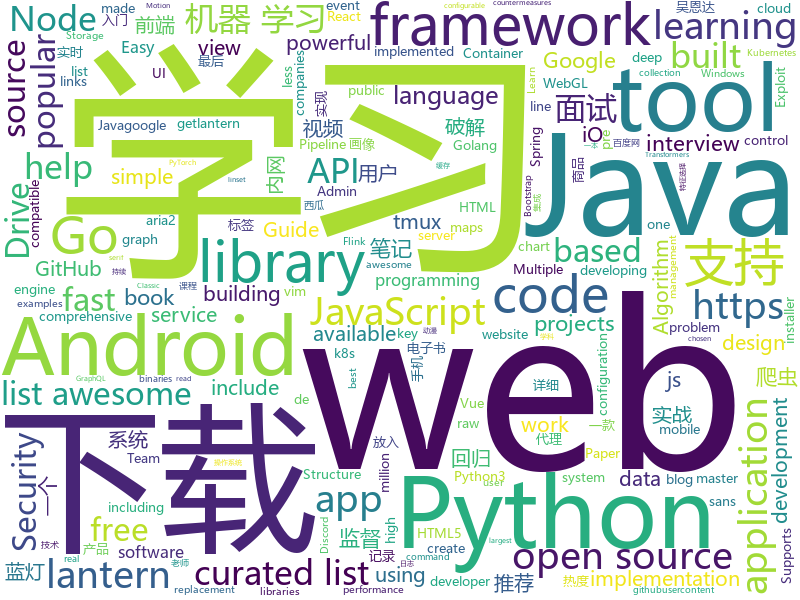

# 2019-09-30
See what the GitHub community is most excited about today.

## python
* [ipwndfu](https://github.com/axi0mX/ipwndfu)(**804 stars today**): open-source jailbreaking tool for many iOS devices
* [Python](https://github.com/geekcomputers/Python)(**387 stars today**): My Python Examples
* [impersonator](https://github.com/svip-lab/impersonator)(**304 stars today**): PyTorch implementation of our ICCV 2019 paper: Liquid Warping GAN: A Unified Framework for Human Motion Imitation, Appearance Transfer and Novel View Synthesis
* [electricitymap-contrib](https://github.com/tmrowco/electricitymap-contrib)(**131 stars today**): A real-time visualisation of the CO2 emissions of electricity consumption
* [transformers](https://github.com/huggingface/transformers)(**407 stars today**): 🤗Transformers: State-of-the-art Natural Language Processing for TensorFlow 2.0 and PyTorch.
* [thefuck](https://github.com/nvbn/thefuck)(**723 stars today**): Magnificent app which corrects your previous console command.
* [fav-up](https://github.com/pielco11/fav-up)(**170 stars today**): IP lookup from favicon using Shodan
* [albert_zh](https://github.com/brightmart/albert_zh)(**120 stars today**): 海量中文预训练ALBERT模型, A LITE BERT FOR SELF-SUPERVISED LEARNING OF LANGUAGE REPRESENTATIONS
* [100-Days-Of-ML-Code](https://github.com/Avik-Jain/100-Days-Of-ML-Code)(**93 stars today**): 100 Days of ML Coding
* [JiaGuoMeng](https://github.com/SQRPI/JiaGuoMeng)(**29 stars today**): 家国梦建筑摆放计算
* [system-design-primer](https://github.com/donnemartin/system-design-primer)(**142 stars today**): Learn how to design large-scale systems. Prep for the system design interview. Includes Anki flashcards.
* [unlocker](https://github.com/DrDonk/unlocker)(**29 stars today**): VMware Workstation macOS
* [numpy-ml](https://github.com/ddbourgin/numpy-ml)(**27 stars today**): Machine learning, in numpy
* [awesome-python](https://github.com/vinta/awesome-python)(**84 stars today**): A curated list of awesome Python frameworks, libraries, software and resources
* [manim](https://github.com/3b1b/manim)(**48 stars today**): Animation engine for explanatory math videos
* [AutoRCCar](https://github.com/hamuchiwa/AutoRCCar)(**7 stars today**): OpenCV Python Neural Network Autonomous RC Car
* [YouCompleteMe](https://github.com/ycm-core/YouCompleteMe)(**23 stars today**): A code-completion engine for Vim
* [python-spider](https://github.com/Jack-Cherish/python-spider)(**49 stars today**): 🌈Python3网络爬虫实战：VIP视频破解助手；GEETEST验证码破解；小说、动漫下载；手机APP爬取；财务报表入库；火车票抢票；抖音APP视频下载；百万英雄辅助；网易云音乐下载；B站视频和弹幕下载；京东晒单图下载
* [RsaCtfTool](https://github.com/Ganapati/RsaCtfTool)(**6 stars today**): RSA attack tool (mainly for ctf) - retreive private key from weak public key and/or uncipher data
* [gym](https://github.com/openai/gym)(**29 stars today**): A toolkit for developing and comparing reinforcement learning algorithms.
* [Nyspider](https://github.com/Nyloner/Nyspider)(**41 stars today**): 各种爬虫
* [Cura](https://github.com/Ultimaker/Cura)(**5 stars today**): 3D printer / slicing GUI built on top of the Uranium framework
* [peda](https://github.com/longld/peda)(**10 stars today**): PEDA - Python Exploit Development Assistance for GDB
* [Mask_RCNN](https://github.com/matterport/Mask_RCNN)(**25 stars today**): Mask R-CNN for object detection and instance segmentation on Keras and TensorFlow
* [uiautomator2](https://github.com/openatx/uiautomator2)(**21 stars today**): Android Uiautomator2 Python Wrapper

## java
* [Mindustry](https://github.com/Anuken/Mindustry)(**42 stars today**): A sandbox tower defense game
* [MPAndroidChart](https://github.com/PhilJay/MPAndroidChart)(**13 stars today**): A powerful🚀Android chart view / graph view library, supporting line- bar- pie- radar- bubble- and candlestick charts as well as scaling, dragging and animations.
* [Java](https://github.com/TheAlgorithms/Java)(**22 stars today**): All Algorithms implemented in Java
* [vhr](https://github.com/lenve/vhr)(**79 stars today**): 微人事是一个前后端分离的人力资源管理系统，项目采用SpringBoot+Vue开发。
* [CS-Notes](https://github.com/CyC2018/CS-Notes)(**77 stars today**): 📚Tech Interview Guide 技术面试必备基础知识、Leetcode 题解、Java、C++、Python、后端面试、操作系统、计算机网络、系统设计
* [JavaGuide](https://github.com/Snailclimb/JavaGuide)(**79 stars today**): 【Java学习+面试指南】 一份涵盖大部分Java程序员所需要掌握的核心知识。
* [spring-security-jwt-guide](https://github.com/Snailclimb/spring-security-jwt-guide)(**12 stars today**): 从零入门 ！Spring Security With JWT（含权限验证）后端部分代码。
* [cim](https://github.com/crossoverJie/cim)(**18 stars today**): 📲cim(cross IM) 适用于开发者的分布式即时通讯系统
* [data-structures](https://github.com/williamfiset/data-structures)(**12 stars today**): A collection of powerful data structures
* [fucking-java-concurrency](https://github.com/oldratlee/fucking-java-concurrency)(**16 stars today**): 🎏Simple show cases of java concurrency problems, seeing is believing.
* [EhViewer](https://github.com/seven332/EhViewer)(**0 stars today**): [DEPRECATED] An Unofficial E-Hentai Application for Android
* [spring-boot](https://github.com/spring-projects/spring-boot)(**34 stars today**): Spring Boot
* [openaudible](https://github.com/openaudible/openaudible)(**1 stars today**): Open Source Audible Manager
* [libgdx](https://github.com/libgdx/libgdx)(**6 stars today**): Desktop/Android/HTML5/iOS Java game development framework
* [flink-recommandSystem-demo](https://github.com/CheckChe0803/flink-recommandSystem-demo)(**16 stars today**): 🚁🚀基于Flink实现的商品实时推荐系统。flink统计商品热度，放入redis缓存，分析日志信息，将画像标签和实时记录放入Hbase。在用户发起推荐请求后，根据用户画像重排序热度榜，并结合协同过滤和标签两个推荐模块为新生成的榜单的每一个产品添加关联产品，最后返回新的用户列表。
* [NewPipe](https://github.com/TeamNewPipe/NewPipe)(**11 stars today**): A libre lightweight streaming front-end for Android.
* [hadoop](https://github.com/apache/hadoop)(**7 stars today**): Apache Hadoop
* [java-design-patterns](https://github.com/iluwatar/java-design-patterns)(**24 stars today**): Design patterns implemented in Java
* [guava](https://github.com/google/guava)(**24 stars today**): Google core libraries for Java
* [baritone](https://github.com/cabaletta/baritone)(**2 stars today**): google maps for block game
* [Interview-Questions](https://github.com/rishabh115/Interview-Questions)(**1 stars today**): Most comprehensive list📋of interview questions📘of companies scraped from Geeksforgeeks, CareerCup and Glassdoor.
* [JDA](https://github.com/DV8FromTheWorld/JDA)(**0 stars today**): Java wrapper for the popular chat & VOIP service: Discord https://discordapp.com
* [Gadgetbridge](https://github.com/Freeyourgadget/Gadgetbridge)(**3 stars today**): Github mirror of Gadgetbridge - A free and cloudless replacement for your gadget vendors' closed source Android applications. Supports Pebble, Mi Band, Liveview, HPlus and more.
* [MifareClassicTool](https://github.com/ikarus23/MifareClassicTool)(**1 stars today**): An Android NFC app for reading, writing, analyzing, etc. MIFARE Classic RFID tags.
* [igniter](https://github.com/trojan-gfw/igniter)(**2 stars today**): A trojan client for Android (UNDER CONSTRUCTION).

## unknown
* [Machine-learning-learning-notes](https://github.com/Vay-keen/Machine-learning-learning-notes)(**81 stars today**): 周志华《机器学习》又称西瓜书是一本较为全面的书籍，书中详细介绍了机器学习领域不同类型的算法(例如：监督学习、无监督学习、半监督学习、强化学习、集成降维、特征选择等)，记录了本人在学习过程中的理解思路与扩展知识点，希望对新人阅读西瓜书有所帮助！
* [PLMpapers](https://github.com/thunlp/PLMpapers)(**100 stars today**): Must-read Papers on pre-trained language models.
* [how-to-exit-vim](https://github.com/hakluke/how-to-exit-vim)(**85 stars today**): Below are some simple methods for exiting vim.
* [coding-interview-university](https://github.com/jwasham/coding-interview-university)(**64 stars today**): A complete computer science study plan to become a software engineer.
* [.tmux](https://github.com/gpakosz/.tmux)(**13 stars today**): 🇫🇷Oh My Tmux! Pretty & versatile tmux configuration made with❤️(imho the best tmux configuration that just works)
* [fancyss_history_package](https://github.com/hq450/fancyss_history_package)(**8 stars today**): 科学上网插件的离线安装包储存在这里
* [Awesome-Hacking](https://github.com/Hack-with-Github/Awesome-Hacking)(**15 stars today**): A collection of various awesome lists for hackers, pentesters and security researchers
* [free-programming-books](https://github.com/EbookFoundation/free-programming-books)(**53 stars today**): 📚Freely available programming books
* [alloc8](https://github.com/axi0mX/alloc8)(**11 stars today**): Write-up for alloc8 untethered bootrom exploit for iPhone 3GS
* [deepdream](https://github.com/google/deepdream)(**6 stars today**): 
* [ECMAScript-new-features-list](https://github.com/daumann/ECMAScript-new-features-list)(**34 stars today**): A comprehensive list of new ES features, including ES2015 (ES6), ES2016, ES2017, ES2018, ES2019
* [trackerslist](https://github.com/ngosang/trackerslist)(**27 stars today**): Updated list of public BitTorrent trackers
* [developer-roadmap](https://github.com/kamranahmedse/developer-roadmap)(**56 stars today**): Roadmap to becoming a web developer in 2019
* [weekly](https://github.com/ruanyf/weekly)(**25 stars today**): 科技爱好者周刊，每周五发布
* [awesome-spider](https://github.com/facert/awesome-spider)(**42 stars today**): 爬虫集合
* [lantern](https://github.com/ntkernel/lantern)(**2 stars today**): Shadowsocks配置文件，蓝灯(Lantern)破解，手机版+win版
* [books](https://github.com/programthink/books)(**10 stars today**): 【编程随想】收藏的电子书清单（多个学科，含下载链接）
* [API-Security-Checklist](https://github.com/shieldfy/API-Security-Checklist)(**36 stars today**): Checklist of the most important security countermeasures when designing, testing, and releasing your API
* [reverse-interview-zh](https://github.com/yifeikong/reverse-interview-zh)(**112 stars today**): 技术面试最后反问面试官的话
* [You-Dont-Know-JS](https://github.com/getify/You-Dont-Know-JS)(**36 stars today**): A book series on JavaScript. @YDKJS on twitter.
* [First-steps-towards-Deep-Learning](https://github.com/vaibhawvipul/First-steps-towards-Deep-Learning)(**6 stars today**): This is an open sourced book on deep learning.
* [Ender3](https://github.com/sn4k3/Ender3)(**0 stars today**): Supercharge your Ender3 with Guides, Mods and Addons
* [Flutter-Course-Resources](https://github.com/londonappbrewery/Flutter-Course-Resources)(**5 stars today**): 
* [awesome-deep-learning](https://github.com/ChristosChristofidis/awesome-deep-learning)(**5 stars today**): A curated list of awesome Deep Learning tutorials, projects and communities.
* [Fuck-XueXiQiangGuo](https://github.com/fuck-xuexiqiangguo/Fuck-XueXiQiangGuo)(**7 stars today**): 学习强国 懒人刷分工具 自动学习

## javascript
* [tabler](https://github.com/tabler/tabler)(**51 stars today**): Tabler is free and open-source HTML Dashboard UI Kit built on Bootstrap
* [gatsby](https://github.com/gatsbyjs/gatsby)(**85 stars today**): Build blazing fast, modern apps and websites with React
* [openlayers](https://github.com/openlayers/openlayers)(**35 stars today**): OpenLayers
* [Web](https://github.com/qianguyihao/Web)(**214 stars today**): 前端入门和进阶学习笔记，超详细的Web前端学习图文教程。从零开始学前端，做一个Web全栈工程师。持续更新...
* [ogl](https://github.com/oframe/ogl)(**108 stars today**): Minimal WebGL framework
* [iptv](https://github.com/iptv-org/iptv)(**53 stars today**): Collection of 8000+ publicly available IPTV channels from all over the world
* [freeCodeCamp](https://github.com/freeCodeCamp/freeCodeCamp)(**85 stars today**): The https://www.freeCodeCamp.org open source codebase and curriculum. Learn to code for free together with millions of people.
* [BaiduExporter](https://github.com/acgotaku/BaiduExporter)(**5 stars today**): Assistant for Baidu to export download links to aria2/aria2-rpc
* [baidu-netdisk-downloaderx](https://github.com/b3log/baidu-netdisk-downloaderx)(**30 stars today**): ⚡️一款图形界面的百度网盘不限速下载器，支持 Windows、Linux 和 Mac。
* [react-redux-realworld-example-app](https://github.com/gothinkster/react-redux-realworld-example-app)(**13 stars today**): Exemplary real world application built with React + Redux
* [graphql-engine](https://github.com/hasura/graphql-engine)(**26 stars today**): Blazing fast, instant realtime GraphQL APIs on Postgres with fine grained access control, also trigger webhooks on database events.
* [etcher](https://github.com/balena-io/etcher)(**13 stars today**): Flash OS images to SD cards & USB drives, safely and easily.
* [react](https://github.com/facebook/react)(**114 stars today**): A declarative, efficient, and flexible JavaScript library for building user interfaces.
* [nodebestpractices](https://github.com/goldbergyoni/nodebestpractices)(**181 stars today**): ✅The largest Node.js best practices list (September 2019)
* [discord.js](https://github.com/discordjs/discord.js)(**6 stars today**): A powerful JavaScript library for interacting with the Discord API
* [mapbox-gl-js](https://github.com/mapbox/mapbox-gl-js)(**8 stars today**): Interactive, thoroughly customizable maps in the browser, powered by vector tiles and WebGL
* [awesome-cheatsheets](https://github.com/LeCoupa/awesome-cheatsheets)(**11 stars today**): 👩‍💻👨‍💻Awesome cheatsheets for popular programming languages, frameworks and development tools. They include everything you should know in one single file.
* [bootstrap](https://github.com/twbs/bootstrap)(**16 stars today**): The most popular HTML, CSS, and JavaScript framework for developing responsive, mobile first projects on the web.
* [codelf](https://github.com/unbug/codelf)(**57 stars today**): A search tool helps dev to solve the naming things problem.
* [tampermonkey](https://github.com/Tampermonkey/tampermonkey)(**11 stars today**): Tampermonkey is the most popular userscript manager, with over 10 million users. It's available for Chrome, Microsoft Edge, Safari, Opera Next, and Firefox.
* [vue](https://github.com/vuejs/vue)(**128 stars today**): 🖖Vue.js is a progressive, incrementally-adoptable JavaScript framework for building UI on the web.
* [quicklink](https://github.com/GoogleChromeLabs/quicklink)(**41 stars today**): ⚡️Faster subsequent page-loads by prefetching in-viewport links during idle time
* [typescript-tutorial](https://github.com/xcatliu/typescript-tutorial)(**27 stars today**): TypeScript 入门教程
* [leonsans](https://github.com/cmiscm/leonsans)(**55 stars today**): Leon Sans is a geometric sans-serif typeface made with code in 2019 by Jongmin Kim.
* [hyper](https://github.com/zeit/hyper)(**17 stars today**): A terminal built on web technologies

## html
* [Coursera-ML-AndrewNg-Notes](https://github.com/fengdu78/Coursera-ML-AndrewNg-Notes)(**271 stars today**): 吴恩达老师的机器学习课程个人笔记
* [hacktoberfest-swag-list](https://github.com/crweiner/hacktoberfest-swag-list)(**12 stars today**): Multiple companies give out swag for Hacktoberfest, and this repo tries to list them all.
* [AdminLTE](https://github.com/ColorlibHQ/AdminLTE)(**32 stars today**): AdminLTE - Free Premium Admin control Panel Theme Based On Bootstrap 3.x
* [awesome-piracy](https://github.com/Igglybuff/awesome-piracy)(**4 stars today**): A curated list of awesome warez and piracy links
* [gentelella](https://github.com/ColorlibHQ/gentelella)(**15 stars today**): Free Bootstrap 3 Admin Template
* [deeplearning_ai_books](https://github.com/fengdu78/deeplearning_ai_books)(**57 stars today**): deeplearning.ai（吴恩达老师的深度学习课程笔记及资源）
* [hyperblog](https://github.com/freddier/hyperblog)(**2 stars today**): Un blog increíble para el curso de Git y Github de Platzi
* [styleguide](https://github.com/google/styleguide)(**18 stars today**): Style guides for Google-originated open-source projects
* [facebook360_dep](https://github.com/facebook/facebook360_dep)(**6 stars today**): Facebook360 Depth Estimation Pipeline - https://facebook.github.io/facebook360_dep
* [speedtest](https://github.com/librespeed/speedtest)(**7 stars today**): Self-hosted Speedtest for HTML5 and more. Easy setup, examples, configurable, mobile friendly. Supports PHP, Node, Multiple servers, and more
* [Machine-Learning](https://github.com/Jack-Cherish/Machine-Learning)(**9 stars today**): ⚡️机器学习实战（Python3）：kNN、决策树、贝叶斯、逻辑回归、SVM、线性回归、树回归
* [wpt](https://github.com/web-platform-tests/wpt)(**1 stars today**): Test suites for Web platform specs — including WHATWG, W3C, and others
* [MatBlazor](https://github.com/SamProf/MatBlazor)(**2 stars today**): Material Design components for Blazor and Razor Components
* [fluxion](https://github.com/FluxionNetwork/fluxion)(**1 stars today**): Fluxion is a remake of linset by vk496 with less bugs and enhanced functionality.
* [flutter-in-action](https://github.com/flutterchina/flutter-in-action)(**6 stars today**): 《Flutter实战》电子书
* [AzureDevOpsDemoGenerator](https://github.com/microsoft/AzureDevOpsDemoGenerator)(**3 stars today**): Azure DevOps Demo Generator helps teams create projects on their Team Services account with pre-populated sample content that includes source code, work items, iterations, service endpoints, build and release definitions based on a chosen template
* [Django-CRM](https://github.com/MicroPyramid/Django-CRM)(**1 stars today**): Open Source Python CRM based on Django aimed to salesforce compatible for migrating to
* [web-api-auth-examples](https://github.com/spotify/web-api-auth-examples)(**0 stars today**): Basic examples to authenticate and fetch data using the Spotify Web API
* [awesome-competitive-programming](https://github.com/lnishan/awesome-competitive-programming)(**7 stars today**): 💎A curated list of awesome Competitive Programming, Algorithm and Data Structure resources
* [dirtycow.github.io](https://github.com/dirtycow/dirtycow.github.io)(**0 stars today**): Dirty COW
* [electron-api-demos](https://github.com/electron/electron-api-demos)(**7 stars today**): Explore the Electron APIs
* [dragon-book-exercise-answers](https://github.com/fool2fish/dragon-book-exercise-answers)(**3 stars today**): Compilers Principles, Techniques, & Tools (purple dragon book) second edition exercise answers. 编译原理（紫龙书）第2版习题答案。
* [qiubaiying.github.io](https://github.com/qiubaiying/qiubaiying.github.io)(**2 stars today**): BY Blog ->
* [personal-website](https://github.com/github/personal-website)(**2 stars today**): Code that'll help you kickstart a personal website that showcases your work as a software developer.
* [zenbot](https://github.com/DeviaVir/zenbot)(**1 stars today**): Zenbot is a command-line cryptocurrency trading bot using Node.js and MongoDB.

## go
* [rudder-server](https://github.com/rudderlabs/rudder-server)(**634 stars today**): Privacy and Security focused Segment-alternative, in Golang and React
* [go-spring](https://github.com/didi/go-spring)(**199 stars today**): 模仿 Java 的 Spring 全家桶实现的一套 GoLang 的应用程序框架🚀
* [watermill](https://github.com/ThreeDotsLabs/watermill)(**220 stars today**): Building event-driven applications easy way in Go.
* [annie](https://github.com/iawia002/annie)(**22 stars today**): 👾Fast, simple and clean video downloader
* [go-filecoin](https://github.com/filecoin-project/go-filecoin)(**5 stars today**): Filecoin Full Node Implementation in Go
* [libpod](https://github.com/containers/libpod)(**20 stars today**): libpod is a library used to create container pods. Home of Podman.
* [lantern](https://github.com/getlantern/lantern)(**33 stars today**): 蓝灯Windows下载 https://raw.githubusercontent.com/getlantern/lantern-binaries/master/lantern-installer.exe 蓝灯安卓下载 https://raw.githubusercontent.com/getlantern/lantern-binaries/master/lantern-installer.apk
* [linkchain](https://github.com/lianxiangcloud/linkchain)(**13 stars today**): 享云链-郑和版本
* [kubesphere](https://github.com/kubesphere/kubesphere)(**30 stars today**): Easy-to-use Production Ready Container Management Platform
* [k3s](https://github.com/rancher/k3s)(**28 stars today**): Lightweight Kubernetes. 5 less than k8s.
* [go-ipfs](https://github.com/ipfs/go-ipfs)(**3 stars today**): IPFS implementation in Go
* [frp](https://github.com/fatedier/frp)(**32 stars today**): A fast reverse proxy to help you expose a local server behind a NAT or firewall to the internet.
* [kit](https://github.com/go-kit/kit)(**94 stars today**): A standard library for microservices.
* [ants](https://github.com/panjf2000/ants)(**66 stars today**): 🐜⚡️A high-performance goroutine pool in Go, inspired by fasthttp.
* [BaiduPCS-Go](https://github.com/iikira/BaiduPCS-Go)(**25 stars today**): 百度网盘客户端 - Go语言编写
* [go](https://github.com/json-iterator/go)(**6 stars today**): A high-performance 100% compatible drop-in replacement of "encoding/json"
* [go-github](https://github.com/google/go-github)(**14 stars today**): Go library for accessing the GitHub API
* [rclone](https://github.com/rclone/rclone)(**19 stars today**): "rsync for cloud storage" - Google Drive, Amazon Drive, S3, Dropbox, Backblaze B2, One Drive, Swift, Hubic, Cloudfiles, Google Cloud Storage, Yandex Files
* [aquatone](https://github.com/michenriksen/aquatone)(**13 stars today**): A Tool for Domain Flyovers
* [clash](https://github.com/Dreamacro/clash)(**31 stars today**): A rule-based tunnel in Go.
* [ignite](https://github.com/weaveworks/ignite)(**4 stars today**): Ignite a Firecracker microVM
* [cayley](https://github.com/cayleygraph/cayley)(**4 stars today**): An open-source graph database
* [kruise](https://github.com/openkruise/kruise)(**6 stars today**): Automate application workloads management on Kubernetes
* [nps](https://github.com/cnlh/nps)(**29 stars today**): 一款轻量级、功能强大的内网穿透代理服务器。支持tcp、udp流量转发，支持内网http代理、内网socks5代理，同时支持snappy压缩、站点保护、加密传输、多路复用、header修改等。支持web图形化管理，集成多用户模式。
* [pipeline](https://github.com/tektoncd/pipeline)(**14 stars today**): A K8s-native Pipeline resource.

## WordCloud

