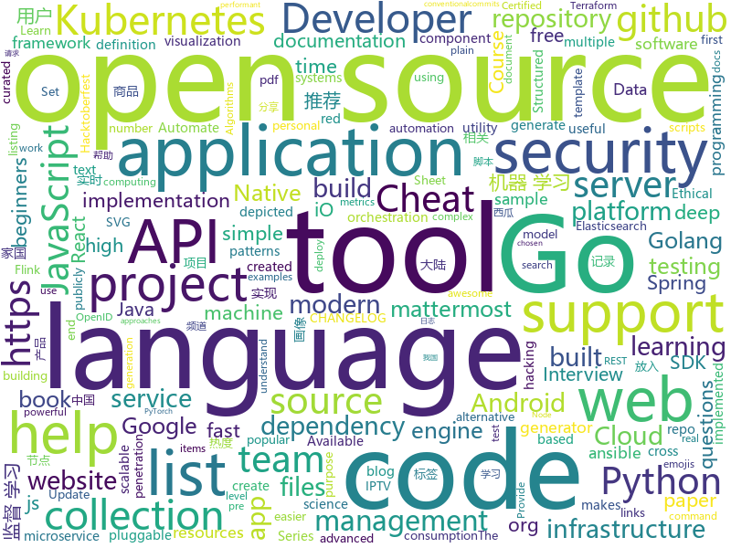

# 2019-10-02
See what the GitHub community is most excited about today.

## python
* [ansible](https://github.com/ansible/ansible)(**21 stars today**): Ansible is a radically simple IT automation platform that makes your applications and systems easier to deploy. Avoid writing scripts or custom code to deploy and update your applications — automate in a language that approaches plain English, using SSH, with no agents to install on remote systems. https://docs.ansible.com/ansible/
* [impersonator](https://github.com/svip-lab/impersonator)(**127 stars today**): PyTorch implementation of our ICCV 2019 paper: Liquid Warping GAN: A Unified Framework for Human Motion Imitation, Appearance Transfer and Novel View Synthesis
* [Python](https://github.com/geekcomputers/Python)(**144 stars today**): My Python Examples
* [ipwndfu](https://github.com/axi0mX/ipwndfu)(**407 stars today**): open-source jailbreaking tool for many iOS devices
* [thefuck](https://github.com/nvbn/thefuck)(**202 stars today**): Magnificent app which corrects your previous console command.
* [CheatSheetSeries](https://github.com/OWASP/CheatSheetSeries)(**74 stars today**): The OWASP Cheat Sheet Series was created to provide a concise collection of high value information on specific application security topics.
* [albert_zh](https://github.com/brightmart/albert_zh)(**52 stars today**): A LITE BERT FOR SELF-SUPERVISED LEARNING OF LANGUAGE REPRESENTATIONS, 海量中文预训练ALBERT模型
* [HelloGitHub](https://github.com/521xueweihan/HelloGitHub)(**33 stars today**): Find pearls on open-source seashore 分享 GitHub 上有趣、入门级的开源项目
* [keras](https://github.com/keras-team/keras)(**21 stars today**): Deep Learning for humans
* [luigi](https://github.com/spotify/luigi)(**6 stars today**): Luigi is a Python module that helps you build complex pipelines of batch jobs. It handles dependency resolution, workflow management, visualization etc. It also comes with Hadoop support built in.
* [ctrl](https://github.com/salesforce/ctrl)(**8 stars today**): Conditional Transformer Language Model for Controllable Generation
* [jupyter](https://github.com/jupyter/jupyter)(**16 stars today**): Jupyter metapackage for installation, docs and chat
* [imgaug](https://github.com/aleju/imgaug)(**36 stars today**): Image augmentation for machine learning experiments.
* [algorithms](https://github.com/keon/algorithms)(**12 stars today**): Minimal examples of data structures and algorithms in Python
* [JiaGuoMeng](https://github.com/SQRPI/JiaGuoMeng)(**13 stars today**): 家国梦建筑摆放计算
* [electricitymap-contrib](https://github.com/tmrowco/electricitymap-contrib)(**23 stars today**): A real-time visualisation of the CO2 emissions of electricity consumption
* [pytest](https://github.com/pytest-dev/pytest)(**7 stars today**): The pytest framework makes it easy to write small tests, yet scales to support complex functional testing
* [udemy-dl](https://github.com/r0oth3x49/udemy-dl)(**27 stars today**): A cross-platform python based utility to download courses from udemy for personal offline use.
* [30-seconds-of-python](https://github.com/30-seconds/30-seconds-of-python)(**42 stars today**): A curated collection of useful Python snippets that you can understand in 30 seconds or less.
* [dask](https://github.com/dask/dask)(**8 stars today**): Parallel computing with task scheduling
* [JGM-Automator](https://github.com/Jiahonzheng/JGM-Automator)(**6 stars today**): 《家国梦》游戏自动化脚本。
* [iptv-m3u-maker](https://github.com/EvilCult/iptv-m3u-maker)(**4 stars today**): IPTV 国内+国外 电视台直播源m3u文件, 收集&汇总脚本,目前状况: 收录频道总数:2269, 优质频道数:563
* [neural-style](https://github.com/anishathalye/neural-style)(**7 stars today**): Neural style in TensorFlow!🎨
* [networkx](https://github.com/networkx/networkx)(**4 stars today**): Official NetworkX source code repository.
* [chainer](https://github.com/chainer/chainer)(**3 stars today**): A flexible framework of neural networks for deep learning

## java
* [Mindustry](https://github.com/Anuken/Mindustry)(**79 stars today**): A sandbox tower defense game
* [Java](https://github.com/TheAlgorithms/Java)(**25 stars today**): All Algorithms implemented in Java
* [tech-weekly](https://github.com/mercyblitz/tech-weekly)(**10 stars today**): 「小马哥技术周报」
* [antlr4](https://github.com/antlr/antlr4)(**6 stars today**): ANTLR (ANother Tool for Language Recognition) is a powerful parser generator for reading, processing, executing, or translating structured text or binary files.
* [tutorials](https://github.com/eugenp/tutorials)(**19 stars today**): The "REST With Spring" Course:
* [elasticsearch](https://github.com/elastic/elasticsearch)(**19 stars today**): Open Source, Distributed, RESTful Search Engine
* [conductor](https://github.com/Netflix/conductor)(**2 stars today**): Conductor is a microservices orchestration engine - https://netflix.github.io/conductor/
* [springfox](https://github.com/springfox/springfox)(**4 stars today**): Automated JSON API documentation for API's built with Spring
* [bazel](https://github.com/bazelbuild/bazel)(**10 stars today**): a fast, scalable, multi-language and extensible build system
* [spring-boot](https://github.com/spring-projects/spring-boot)(**17 stars today**): Spring Boot
* [android-interview-questions](https://github.com/MindorksOpenSource/android-interview-questions)(**3 stars today**): Your Cheat Sheet For Android Interview - Android Interview Questions
* [java-design-patterns](https://github.com/iluwatar/java-design-patterns)(**19 stars today**): Design patterns implemented in Java
* [JDA](https://github.com/DV8FromTheWorld/JDA)(**3 stars today**): Java wrapper for the popular chat & VOIP service: Discord https://discordapp.com
* [spring-security-jwt-guide](https://github.com/Snailclimb/spring-security-jwt-guide)(**3 stars today**): 从零入门 ！Spring Security With JWT（含权限验证）后端部分代码。
* [armeria](https://github.com/line/armeria)(**2 stars today**): Asynchronous RPC/REST library built on top of Java 8, Netty, HTTP/2, Thrift and gRPC
* [elasticsearch-hadoop](https://github.com/elastic/elasticsearch-hadoop)(**0 stars today**): 🐘Elasticsearch real-time search and analytics natively integrated with Hadoop
* [DependencyCheck](https://github.com/jeremylong/DependencyCheck)(**1 stars today**): OWASP dependency-check is a software composition analysis utility that detects publicly disclosed vulnerabilities in application dependencies.
* [jmx_exporter](https://github.com/prometheus/jmx_exporter)(**1 stars today**): A process for exposing JMX Beans via HTTP for Prometheus consumption
* [clojure](https://github.com/clojure/clojure)(**4 stars today**): The Clojure programming language
* [ftgo-application](https://github.com/microservices-patterns/ftgo-application)(**1 stars today**): Example code for the book Microservice patterns
* [micrometer](https://github.com/micrometer-metrics/micrometer)(**2 stars today**): An application metrics facade for the most popular monitoring tools. Think SLF4J, but for metrics.
* [flink-recommandSystem-demo](https://github.com/CheckChe0803/flink-recommandSystem-demo)(**5 stars today**): 🚁🚀基于Flink实现的商品实时推荐系统。flink统计商品热度，放入redis缓存，分析日志信息，将画像标签和实时记录放入Hbase。在用户发起推荐请求后，根据用户画像重排序热度榜，并结合协同过滤和标签两个推荐模块为新生成的榜单的每一个产品添加关联产品，最后返回新的用户列表。
* [phonegap-plugin-push](https://github.com/phonegap/phonegap-plugin-push)(**1 stars today**): Register and receive push notifications
* [junit5](https://github.com/junit-team/junit5)(**2 stars today**): The next generation of JUnit.
* [jenkins](https://github.com/jenkinsci/jenkins)(**11 stars today**): Jenkins automation server

## unknown
* [You-Dont-Know-JS](https://github.com/getify/You-Dont-Know-JS)(**47 stars today**): A book series on JavaScript. @YDKJS on twitter.
* [awesome-for-beginners](https://github.com/MunGell/awesome-for-beginners)(**56 stars today**): A list of awesome beginners-friendly projects.
* [Data-Science--Cheat-Sheet](https://github.com/abhat222/Data-Science--Cheat-Sheet)(**46 stars today**): Cheat Sheets
* [javascript-questions](https://github.com/lydiahallie/javascript-questions)(**18 stars today**): A long list of (advanced) JavaScript questions, and their explanations✨
* [how-to-exit-vim](https://github.com/hakluke/how-to-exit-vim)(**67 stars today**): Below are some simple methods for exiting vim.
* [rust-book-summary](https://github.com/psibi/rust-book-summary)(**18 stars today**): Summary of the Rust book
* [HEAD](https://github.com/joshbuchea/HEAD)(**240 stars today**): 🗿A list of everything that *could* go in the head of your document
* [Machine-learning-learning-notes](https://github.com/Vay-keen/Machine-learning-learning-notes)(**14 stars today**): 周志华《机器学习》又称西瓜书是一本较为全面的书籍，书中详细介绍了机器学习领域不同类型的算法(例如：监督学习、无监督学习、半监督学习、强化学习、集成降维、特征选择等)，记录了本人在学习过程中的理解思路与扩展知识点，希望对新人阅读西瓜书有所帮助！
* [Privilege-Escalation](https://github.com/Ignitetechnologies/Privilege-Escalation)(**21 stars today**): This cheasheet is aimed at the CTF Players and Beginners to help them understand the fundamentals of Privilege Escalation with examples.
* [CNC-Machine-V3](https://github.com/leonvandenbeukel/CNC-Machine-V3)(**0 stars today**): Homemade 3D Printed CNC Machine V3
* [Red-Teaming-Toolkit](https://github.com/infosecn1nja/Red-Teaming-Toolkit)(**10 stars today**): A collection of open source and commercial tools that aid in red team operations.
* [first-contributions](https://github.com/firstcontributions/first-contributions)(**33 stars today**): 🚀✨Help beginners to contribute to open source projects
* [PLMpapers](https://github.com/thunlp/PLMpapers)(**15 stars today**): Must-read Papers on pre-trained language models.
* [google-cloud-4-words](https://github.com/gregsramblings/google-cloud-4-words)(**12 stars today**): The Google Cloud Developer's Cheat Sheet
* [OSCP-Human-Guide](https://github.com/six2dez/OSCP-Human-Guide)(**2 stars today**): My own OSCP guide
* [kubernetes-the-hard-way](https://github.com/kelseyhightower/kubernetes-the-hard-way)(**13 stars today**): Bootstrap Kubernetes the hard way on Google Cloud Platform. No scripts.
* [Deep-Learning-for-Tracking-and-Detection](https://github.com/abhineet123/Deep-Learning-for-Tracking-and-Detection)(**0 stars today**): Collection of papers, datasets, code and other resources for object tracking and detection using deep learning
* [Crawler_Illegal_Cases_In_China](https://github.com/HiddenStrawberry/Crawler_Illegal_Cases_In_China)(**3 stars today**): Collection of China illegal cases about web crawler 本项目用来整理所有中国大陆涉诉与违规相关的新闻、资料与法律法规。致力于帮助在中国大陆工作的爬虫行业从业者了解我国相关法律，避免触碰数据合规红线。
* [arXivTimes](https://github.com/arXivTimes/arXivTimes)(**2 stars today**): repository to research & share the machine learning articles
* [FreeShare](https://github.com/Steve-ShadowsocksR/FreeShare)(**8 stars today**): 欢迎来到小飞机免费节点分享,本站优点:让您无需翻墙便能获取到最新的可用节点!
* [deepdream](https://github.com/google/deepdream)(**6 stars today**): 
* [docker-compose-elasticsearch-kibana](https://github.com/maxyermayank/docker-compose-elasticsearch-kibana)(**4 stars today**): Docker Compose for Elasticsearch and Kibana
* [jest-cheat-sheet](https://github.com/sapegin/jest-cheat-sheet)(**1 stars today**): Jest cheat sheet
* [PENTESTING-BIBLE](https://github.com/blaCCkHatHacEEkr/PENTESTING-BIBLE)(**1 stars today**): This repository was created and developed by Ammar Amer @cry__pto Only. Updates to this repository will continue to arrive until the number of links reaches 10000 links & 10000 pdf files .Learn Ethical Hacking and penetration testing .hundreds of ethical hacking & penetration testing & red team & cyber security & computer science resources.
* [CKAD-exercises](https://github.com/dgkanatsios/CKAD-exercises)(**6 stars today**): A set of exercises to prepare for Certified Kubernetes Application Developer exam by Cloud Native Computing Foundation

## javascript
* [iptv](https://github.com/iptv-org/iptv)(**347 stars today**): Collection of 8000+ publicly available IPTV channels from all over the world
* [APT_CyberCriminal_Campagin_Collections](https://github.com/CyberMonitor/APT_CyberCriminal_Campagin_Collections)(**19 stars today**): APT & CyberCriminal Campaign Collection
* [introduccion-a-js](https://github.com/r-argentina-programa/introduccion-a-js)(**11 stars today**): 
* [freeCodeCamp](https://github.com/freeCodeCamp/freeCodeCamp)(**40 stars today**): The https://www.freeCodeCamp.org open source codebase and curriculum. Learn to code for free together with millions of people.
* [baidu-netdisk-downloaderx](https://github.com/b3log/baidu-netdisk-downloaderx)(**18 stars today**): ⚡️一款图形界面的百度网盘不限速下载器，支持 Windows、Linux 和 Mac。
* [tabler](https://github.com/tabler/tabler)(**43 stars today**): Tabler is free and open-source HTML Dashboard UI Kit built on Bootstrap
* [gatsby](https://github.com/gatsbyjs/gatsby)(**34 stars today**): Build blazing fast, modern apps and websites with React
* [nodebestpractices](https://github.com/goldbergyoni/nodebestpractices)(**100 stars today**): ✅The largest Node.js best practices list (September 2019)
* [clean-code-javascript](https://github.com/ryanmcdermott/clean-code-javascript)(**17 stars today**): 🛁Clean Code concepts adapted for JavaScript
* [node](https://github.com/nodejs/node)(**29 stars today**): Node.js JavaScript runtime✨🐢🚀✨
* [create-react-app](https://github.com/facebook/create-react-app)(**36 stars today**): Set up a modern web app by running one command.
* [incubator-superset](https://github.com/apache/incubator-superset)(**12 stars today**): Apache Superset (incubating) is a modern, enterprise-ready business intelligence web application
* [gitfolio](https://github.com/imfunniee/gitfolio)(**20 stars today**): personal website + blog for every github user
* [caligator](https://github.com/sarthology/caligator)(**48 stars today**): 🐊An open source kickass cross platform Calculator with power of alligator
* [emojibops](https://github.com/brittanyrw/emojibops)(**8 stars today**): EmojiBops is a listing of songs depicted through emojis.
* [eslint](https://github.com/eslint/eslint)(**12 stars today**): A fully pluggable tool for identifying and reporting on patterns in JavaScript
* [nuxt.js](https://github.com/nuxt/nuxt.js)(**29 stars today**): The Vue.js Framework
* [react-native-snap-carousel](https://github.com/archriss/react-native-snap-carousel)(**6 stars today**): Swiper/carousel component for React Native with previews, multiple layouts, parallax images, performant handling of huge numbers of items, and RTL support. Compatible with Android & iOS.
* [svelte](https://github.com/sveltejs/svelte)(**38 stars today**): Cybernetically enhanced web apps
* [mattermost-webapp](https://github.com/mattermost/mattermost-webapp)(**2 stars today**): Webapp of Mattermost server: https://github.com/mattermost/mattermost-server
* [mobx](https://github.com/mobxjs/mobx)(**11 stars today**): Simple, scalable state management.
* [jest](https://github.com/facebook/jest)(**13 stars today**): Delightful JavaScript Testing.
* [yarn](https://github.com/yarnpkg/yarn)(**12 stars today**): 📦🐈Fast, reliable, and secure dependency management.
* [emojiscreen](https://github.com/brittanyrw/emojiscreen)(**11 stars today**): EmojiScreen is a listing of movies, TV shows and musicals depicted through emojis.
* [standard-version](https://github.com/conventional-changelog/standard-version)(**13 stars today**): 🏆Automate versioning and CHANGELOG generation, with semver.org and conventionalcommits.org

## html
* [Coursera-ML-AndrewNg-Notes](https://github.com/fengdu78/Coursera-ML-AndrewNg-Notes)(**42 stars today**): 吴恩达老师的机器学习课程个人笔记
* [hacktoberfest-swag-list](https://github.com/crweiner/hacktoberfest-swag-list)(**34 stars today**): Multiple companies give out swag for Hacktoberfest, and this repo tries to list them all.
* [hacktoberfest](https://github.com/AliceWonderland/hacktoberfest)(**7 stars today**): Participate in Hacktoberfest by contributing to any Open Source project on GitHub! Here is a starter project for first time contributors. #hacktoberfest
* [hugo-book](https://github.com/alex-shpak/hugo-book)(**2 stars today**): Hugo documentation theme as simple as plain book
* [keep-a-changelog](https://github.com/olivierlacan/keep-a-changelog)(**11 stars today**): If you build software, keep a changelog.
* [awesome-creative-coding](https://github.com/terkelg/awesome-creative-coding)(**4 stars today**): Creative Coding: Generative Art, Data visualization, Interaction Design, Resources.
* [Front-end-Developer-Interview-Questions](https://github.com/h5bp/Front-end-Developer-Interview-Questions)(**15 stars today**): A list of helpful front-end related questions you can use to interview potential candidates, test yourself or completely ignore.
* [webdevbootcamp](https://github.com/nax3t/webdevbootcamp)(**3 stars today**): All source code for back-end projects from the Web Developer Bootcamp
* [RDR2CollectorsMap](https://github.com/jeanropke/RDR2CollectorsMap)(**4 stars today**): 
* [quickstart-js](https://github.com/firebase/quickstart-js)(**4 stars today**): Firebase Quickstart Samples for Web
* [flag-icon-css](https://github.com/lipis/flag-icon-css)(**3 stars today**): 🎏A collection of all country flags in SVG — plus the CSS for easier integration
* [csswg-drafts](https://github.com/w3c/csswg-drafts)(**2 stars today**): CSS Working Group Editor Drafts
* [SuperTinyIcons](https://github.com/edent/SuperTinyIcons)(**9 stars today**): Under 1KB each! Super Tiny Icons are miniscule SVG versions of your favourite website and app logos
* [swagger-codegen](https://github.com/swagger-api/swagger-codegen)(**14 stars today**): swagger-codegen contains a template-driven engine to generate documentation, API clients and server stubs in different languages by parsing your OpenAPI / Swagger definition.
* [AzureDevOpsDemoGenerator](https://github.com/microsoft/AzureDevOpsDemoGenerator)(**4 stars today**): Azure DevOps Demo Generator helps teams create projects on their Team Services account with pre-populated sample content that includes source code, work items, iterations, service endpoints, build and release definitions based on a chosen template
* [blog_os](https://github.com/phil-opp/blog_os)(**9 stars today**): Writing an OS in Rust
* [webcomponents](https://github.com/w3c/webcomponents)(**5 stars today**): Web Components specifications
* [personal-website](https://github.com/github/personal-website)(**4 stars today**): Code that'll help you kickstart a personal website that showcases your work as a software developer.
* [server-ux](https://github.com/OCA/server-ux)(**0 stars today**): 
* [awesome-piracy](https://github.com/Igglybuff/awesome-piracy)(**19 stars today**): A curated list of awesome warez and piracy links
* [django-DefectDojo](https://github.com/DefectDojo/django-DefectDojo)(**1 stars today**): DefectDojo is an open-source application vulnerability correlation and security orchestration tool.
* [HiddenEye](https://github.com/DarkSecDevelopers/HiddenEye)(**4 stars today**): Modern Phishing Tool With Advanced Functionality [ Android-Support-Available ]
* [tiny-slider](https://github.com/ganlanyuan/tiny-slider)(**10 stars today**): Vanilla javascript slider for all purposes.
* [Dev-Folio](https://github.com/JABedford/Dev-Folio)(**3 stars today**): 🔥A collection of Free Portfolio templates for developers.
* [datasciencecoursera](https://github.com/mGalarnyk/datasciencecoursera)(**0 stars today**): Data Science Repo and blog for John Hopkins Coursera Courses. Please let me know if you have any questions.

## go
* [gofpdf](https://github.com/jung-kurt/gofpdf)(**19 stars today**): A PDF document generator with high level support for text, drawing and images
* [go-swagger](https://github.com/go-swagger/go-swagger)(**3 stars today**): Swagger 2.0 implementation for go
* [dep](https://github.com/golang/dep)(**8 stars today**): Go dependency management tool
* [rudder-server](https://github.com/rudderlabs/rudder-server)(**93 stars today**): Privacy and Security focused Segment-alternative, in Golang and React
* [mattermost-server](https://github.com/mattermost/mattermost-server)(**12 stars today**): Open source Slack-alternative in Golang and React - Mattermost
* [go](https://github.com/golang/go)(**42 stars today**): The Go programming language
* [charts](https://github.com/helm/charts)(**15 stars today**): Curated applications for Kubernetes
* [aws-sdk-go](https://github.com/aws/aws-sdk-go)(**1 stars today**): AWS SDK for the Go programming language.
* [coredns](https://github.com/coredns/coredns)(**6 stars today**): CoreDNS is a DNS server that chains plugins
* [hydra](https://github.com/ory/hydra)(**7 stars today**): OAuth2 Server and OpenID Certified™ OpenID Connect Provider written in Go - cloud native, security-first, open source API security for your infrastructure. SDKs for any language.
* [community](https://github.com/kubernetes/community)(**3 stars today**): Kubernetes community content
* [helm](https://github.com/helm/helm)(**17 stars today**): The Kubernetes Package Manager
* [go-spring](https://github.com/didi/go-spring)(**38 stars today**): 模仿 Java 的 Spring 全家桶实现的一套 GoLang 的应用程序框架🚀
* [vault](https://github.com/hashicorp/vault)(**9 stars today**): A tool for secrets management, encryption as a service, and privileged access management
* [yaml](https://github.com/go-yaml/yaml)(**8 stars today**): YAML support for the Go language.
* [mux](https://github.com/gorilla/mux)(**14 stars today**): A powerful HTTP router and URL matcher for building Go web servers with🦍
* [operator-sdk](https://github.com/operator-framework/operator-sdk)(**9 stars today**): SDK for building Kubernetes applications. Provides high level APIs, useful abstractions, and project scaffolding.
* [logrus](https://github.com/sirupsen/logrus)(**8 stars today**): Structured, pluggable logging for Go.
* [flux](https://github.com/fluxcd/flux)(**7 stars today**): The GitOps Kubernetes operator
* [terraform](https://github.com/hashicorp/terraform)(**16 stars today**): Terraform enables you to safely and predictably create, change, and improve infrastructure. It is an open source tool that codifies APIs into declarative configuration files that can be shared amongst team members, treated as code, edited, reviewed, and versioned.
* [terraformer](https://github.com/GoogleCloudPlatform/terraformer)(**7 stars today**): CLI tool to generate terraform files from existing infrastructure (reverse Terraform). Infrastructure to Code
* [opa](https://github.com/open-policy-agent/opa)(**4 stars today**): An open source, general-purpose policy engine.
* [aws-lambda-go](https://github.com/aws/aws-lambda-go)(**0 stars today**): Libraries, samples and tools to help Go developers develop AWS Lambda functions.
* [go-ipfs](https://github.com/ipfs/go-ipfs)(**4 stars today**): IPFS implementation in Go
* [google-api-go-client](https://github.com/googleapis/google-api-go-client)(**4 stars today**): Auto-generated Google APIs for Go.

## WordCloud

