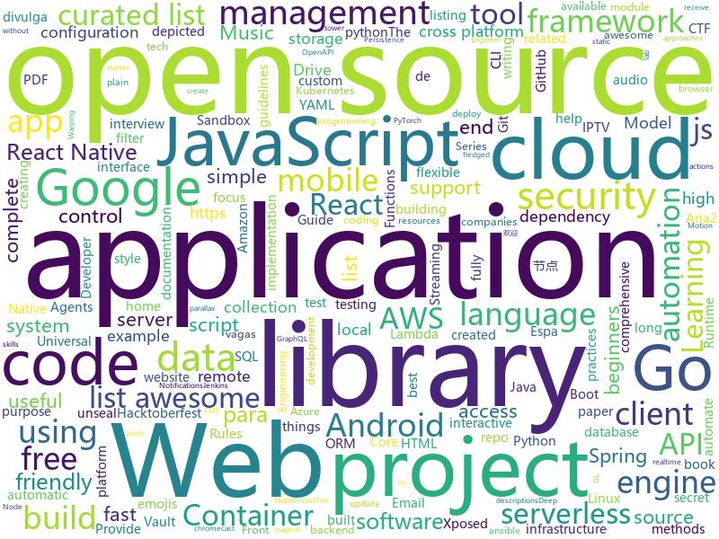

# 2019-10-03
See what the GitHub community is most excited about today.

## python
* [pandas](https://github.com/pandas-dev/pandas)(**17 stars today**): Flexible and powerful data analysis / manipulation library for Python, providing labeled data structures similar to R data.frame objects, statistical functions, and much more
* [home-assistant](https://github.com/home-assistant/home-assistant)(**23 stars today**): 🏡Open source home automation that puts local control and privacy first
* [dnsgen](https://github.com/ProjectAnte/dnsgen)(**18 stars today**): Generates combination of domain names from the provided input.
* [impersonator](https://github.com/svip-lab/impersonator)(**89 stars today**): PyTorch implementation of our ICCV 2019 paper: Liquid Warping GAN: A Unified Framework for Human Motion Imitation, Appearance Transfer and Novel View Synthesis
* [PayloadsAllTheThings](https://github.com/swisskyrepo/PayloadsAllTheThings)(**31 stars today**): A list of useful payloads and bypass for Web Application Security and Pentest/CTF
* [localstack](https://github.com/localstack/localstack)(**16 stars today**): 💻A fully functional local AWS cloud stack. Develop and test your cloud & Serverless apps offline!
* [models](https://github.com/tensorflow/models)(**32 stars today**): Models and examples built with TensorFlow
* [gpt-2](https://github.com/openai/gpt-2)(**39 stars today**): Code for the paper "Language Models are Unsupervised Multitask Learners"
* [addons](https://github.com/tensorflow/addons)(**5 stars today**): Useful extra functionality for TensorFlow 2.0 maintained by SIG-addons
* [ansible](https://github.com/ansible/ansible)(**59 stars today**): Ansible is a radically simple IT automation platform that makes your applications and systems easier to deploy. Avoid writing scripts or custom code to deploy and update your applications — automate in a language that approaches plain English, using SSH, with no agents to install on remote systems. https://docs.ansible.com/ansible/
* [public-apis](https://github.com/public-apis/public-apis)(**82 stars today**): A collective list of free APIs for use in software and web development.
* [troposphere](https://github.com/cloudtools/troposphere)(**2 stars today**): troposphere - Python library to create AWS CloudFormation descriptions
* [keras](https://github.com/keras-team/keras)(**18 stars today**): Deep Learning for humans
* [Zappa](https://github.com/Miserlou/Zappa)(**10 stars today**): Serverless Python
* [CheatSheetSeries](https://github.com/OWASP/CheatSheetSeries)(**78 stars today**): The OWASP Cheat Sheet Series was created to provide a concise collection of high value information on specific application security topics.
* [ml-agents](https://github.com/Unity-Technologies/ml-agents)(**7 stars today**): Unity Machine Learning Agents Toolkit
* [dask](https://github.com/dask/dask)(**9 stars today**): Parallel computing with task scheduling
* [serverless-application-model](https://github.com/awslabs/serverless-application-model)(**12 stars today**): AWS Serverless Application Model (SAM) is an open-source framework for building serverless applications
* [CppCoreGuidelines](https://github.com/isocpp/CppCoreGuidelines)(**17 stars today**): The C++ Core Guidelines are a set of tried-and-true guidelines, rules, and best practices about coding in C++
* [JiaGuoMeng-AutoClicker](https://github.com/woshica/JiaGuoMeng-AutoClicker)(**5 stars today**): 《家国梦》自动化脚本生成，可以自动收集金币、升级、运货等。
* [sentry](https://github.com/getsentry/sentry)(**10 stars today**): Sentry is cross-platform application monitoring, with a focus on error reporting.
* [cloud-custodian](https://github.com/cloud-custodian/cloud-custodian)(**1 stars today**): Rules engine for cloud security, cost optimization, and governance, DSL in yaml for policies to query, filter, and take actions on resources
* [salt](https://github.com/saltstack/salt)(**5 stars today**): Software to automate the management and configuration of any infrastructure or application at scale. Get access to the Salt software package repository here:
* [code_snippets](https://github.com/CoreyMSchafer/code_snippets)(**4 stars today**): 
* [oppia](https://github.com/oppia/oppia)(**6 stars today**): Tool for collaboratively building interactive lessons.

## java
* [Mindustry](https://github.com/Anuken/Mindustry)(**59 stars today**): A sandbox tower defense game
* [tutorials](https://github.com/eugenp/tutorials)(**20 stars today**): The "REST With Spring" Course:
* [maps](https://github.com/react-native-mapbox-gl/maps)(**2 stars today**): A Mapbox GL react native module for creating custom maps
* [react-native-google-signin](https://github.com/react-native-community/react-native-google-signin)(**4 stars today**): Google Signin for your React Native applications
* [UnblockMusicPro_Xposed](https://github.com/nining377/UnblockMusicPro_Xposed)(**10 stars today**): Unblock Netease Cloud Music with Xposed
* [EhViewer](https://github.com/seven332/EhViewer)(**2 stars today**): [DEPRECATED] An Unofficial E-Hentai Application for Android
* [ksql](https://github.com/confluentinc/ksql)(**7 stars today**): KSQL - the Streaming SQL Engine for Apache Kafka
* [aws-serverless-java-container](https://github.com/awslabs/aws-serverless-java-container)(**3 stars today**): A Java wrapper to run Spring, Jersey, Spark, and other apps inside AWS Lambda.
* [quarkus](https://github.com/quarkusio/quarkus)(**12 stars today**): Quarkus: Supersonic Subatomic Java.
* [Unblock163MusicClient-Xposed](https://github.com/bin456789/Unblock163MusicClient-Xposed)(**4 stars today**): Unblock 163 Cloud Music Android client through Xposed.
* [Signal-Android](https://github.com/signalapp/Signal-Android)(**7 stars today**): A private messenger for Android.
* [Terasology](https://github.com/MovingBlocks/Terasology)(**3 stars today**): Terasology - open source voxel world
* [react-native-push-notification](https://github.com/zo0r/react-native-push-notification)(**3 stars today**): React Native Local and Remote Notifications
* [configuration-as-code-plugin](https://github.com/jenkinsci/configuration-as-code-plugin)(**1 stars today**): Jenkins Configuration as Code Plugin
* [react-native-webview](https://github.com/react-native-community/react-native-webview)(**13 stars today**): React Native Cross-Platform WebView
* [react-native-svg](https://github.com/react-native-community/react-native-svg)(**2 stars today**): SVG library for React Native, React Native Web, and plain React web projects.
* [phonegap-plugin-push](https://github.com/phonegap/phonegap-plugin-push)(**0 stars today**): Register and receive push notifications
* [dbeaver](https://github.com/dbeaver/dbeaver)(**16 stars today**): Free universal database tool and SQL client
* [selenium](https://github.com/SeleniumHQ/selenium)(**6 stars today**): A browser automation framework and ecosystem.
* [Android-Image-Cropper](https://github.com/ArthurHub/Android-Image-Cropper)(**5 stars today**): Image Cropping Library for Android, optimized for Camera / Gallery.
* [Interview-Questions](https://github.com/rishabh115/Interview-Questions)(**13 stars today**): Most comprehensive list📋of tech interview questions📘of companies scraped from Geeksforgeeks, CareerCup and Glassdoor.
* [mit-deep-learning-book-pdf](https://github.com/janishar/mit-deep-learning-book-pdf)(**10 stars today**): MIT Deep Learning Book in PDF format (complete and parts) by Ian Goodfellow, Yoshua Bengio and Aaron Courville
* [mockito](https://github.com/mockito/mockito)(**4 stars today**): Most popular Mocking framework for unit tests written in Java
* [spring-boot-react-oauth2-social-login-demo](https://github.com/callicoder/spring-boot-react-oauth2-social-login-demo)(**0 stars today**): Spring Boot React OAuth2 Social Login with Google, Facebook, and Github
* [react-native-track-player](https://github.com/react-native-kit/react-native-track-player)(**3 stars today**): A fully fledged audio module created for music apps. Provides audio playback, external media controls, chromecast support, background mode and more!

## unknown
* [You-Dont-Know-JS](https://github.com/getify/You-Dont-Know-JS)(**123 stars today**): A book series on JavaScript. @YDKJS on twitter.
* [Interview-Preparation](https://github.com/yashasvigirdhar/Interview-Preparation)(**65 stars today**): Interview Preparation material for Senior Software Engineer - Android role
* [Data-Science--Cheat-Sheet](https://github.com/abhat222/Data-Science--Cheat-Sheet)(**91 stars today**): Cheat Sheets
* [app-ideas](https://github.com/florinpop17/app-ideas)(**27 stars today**): A Collection of application ideas which can be used to improve your coding skills.
* [awesome-for-beginners](https://github.com/MunGell/awesome-for-beginners)(**187 stars today**): A list of awesome beginners-friendly projects.
* [programmers-guide-slovenia](https://github.com/mihanovak1024/programmers-guide-slovenia)(**5 stars today**): Basic guide for new programmers in Slovenia🇸🇮
* [AZ-103-MicrosoftAzureAdministrator](https://github.com/MicrosoftLearning/AZ-103-MicrosoftAzureAdministrator)(**3 stars today**): AZ-103: Microsoft Azure Administrator
* [how-to-exit-vim](https://github.com/hakluke/how-to-exit-vim)(**28 stars today**): Below are some simple methods for exiting vim.
* [proposals](https://github.com/tc39/proposals)(**8 stars today**): Tracking ECMAScript Proposals
* [awesome-remote-job](https://github.com/lukasz-madon/awesome-remote-job)(**10 stars today**): A curated list of awesome remote jobs and resources. Inspired by https://github.com/vinta/awesome-python
* [Cookbook](https://github.com/andkret/Cookbook)(**16 stars today**): The Data Engineering Cookbook
* [HEAD](https://github.com/joshbuchea/HEAD)(**49 stars today**): 🗿A list of everything that *could* go in the head of your document
* [awesome-macos-command-line](https://github.com/herrbischoff/awesome-macos-command-line)(**25 stars today**): Use your macOS terminal shell to do awesome things.
* [first-contributions](https://github.com/firstcontributions/first-contributions)(**22 stars today**): 🚀✨Help beginners to contribute to open source projects
* [gitignore](https://github.com/github/gitignore)(**27 stars today**): A collection of useful .gitignore templates
* [awesome-iptv](https://github.com/iptv-org/awesome-iptv)(**29 stars today**): A curated list of resources related to IPTV.
* [Privilege-Escalation](https://github.com/Ignitetechnologies/Privilege-Escalation)(**8 stars today**): This cheasheet is aimed at the CTF Players and Beginners to help them understand the fundamentals of Privilege Escalation with examples.
* [PodstawowePoleceniaLinux](https://github.com/qarmin/PodstawowePoleceniaLinux)(**3 stars today**): To repozytorium zawiera informację o podstawowych komendach używanych w systemie GNU/Linux wraz z krótkimi przykładami.
* [vagas](https://github.com/backend-br/vagas)(**3 stars today**): ✌️Espaço para divulgação de vagas para backenders
* [awesome-open-climate-science](https://github.com/pangeo-data/awesome-open-climate-science)(**2 stars today**): Awesome Open Atmospheric, Ocean, and Climate Science
* [desktop](https://github.com/PureWriter/desktop)(**6 stars today**): 
* [awesome-flask](https://github.com/mjhea0/awesome-flask)(**5 stars today**): A curated list of awesome things related to Flask
* [FreeShare](https://github.com/Steve-ShadowsocksR/FreeShare)(**2 stars today**): 欢迎来到小飞机纯公益节点分享,本站优点:让您无需翻墙便能获取到最新的可用节点!
* [vagas](https://github.com/frontendbr/vagas)(**4 stars today**): 🔬Espaço para divulgação de vagas para front-enders.
* [blog](https://github.com/aszx87410/blog)(**0 stars today**): A tech blog about Front-end and JavaScript

## javascript
* [iptv](https://github.com/iptv-org/iptv)(**535 stars today**): Collection of 8000+ publicly available IPTV channels from all over the world
* [react-bootstrap](https://github.com/react-bootstrap/react-bootstrap)(**9 stars today**): Bootstrap components built with React
* [appwrite](https://github.com/appwrite/appwrite)(**12 stars today**): End to end backend server for frontend and mobile developers.👩‍💻👨‍💻
* [emojibops](https://github.com/brittanyrw/emojibops)(**8 stars today**): EmojiBops is a listing of songs depicted through emojis.
* [prettier](https://github.com/prettier/prettier)(**22 stars today**): Prettier is an opinionated code formatter.
* [introduccion-a-js](https://github.com/r-argentina-programa/introduccion-a-js)(**15 stars today**): 
* [caligator](https://github.com/sarthology/caligator)(**12 stars today**): 🐊An open source kickass cross platform Calculator with power of alligator
* [mapbox-gl-js](https://github.com/mapbox/mapbox-gl-js)(**4 stars today**): Interactive, thoroughly customizable maps in the browser, powered by vector tiles and WebGL
* [node](https://github.com/nodejs/node)(**35 stars today**): Node.js JavaScript runtime✨🐢🚀✨
* [Leaflet](https://github.com/Leaflet/Leaflet)(**8 stars today**): 🍃JavaScript library for mobile-friendly interactive maps
* [nuxt.js](https://github.com/nuxt/nuxt.js)(**30 stars today**): The Vue.js Framework
* [serverless](https://github.com/serverless/serverless)(**16 stars today**): Serverless Framework – Build web, mobile and IoT applications with serverless architectures using AWS Lambda, Azure Functions, Google CloudFunctions & more! –
* [mesh](https://github.com/chrispsn/mesh)(**25 stars today**): Visualise data and edit JavaScript code using a spreadsheet interface.
* [gulp](https://github.com/gulpjs/gulp)(**5 stars today**): The streaming build system
* [strapi](https://github.com/strapi/strapi)(**27 stars today**): 🚀Open source Node.js Headless CMS to easily build customisable APIs
* [freeCodeCamp](https://github.com/freeCodeCamp/freeCodeCamp)(**42 stars today**): The https://www.freeCodeCamp.org open source codebase and curriculum. Learn to code for free together with millions of people.
* [javascript](https://github.com/airbnb/javascript)(**27 stars today**): JavaScript Style Guide
* [emojiscreen](https://github.com/brittanyrw/emojiscreen)(**12 stars today**): EmojiScreen is a listing of movies, TV shows and musicals depicted through emojis.
* [yarn](https://github.com/yarnpkg/yarn)(**18 stars today**): 📦🐈Fast, reliable, and secure dependency management.
* [renovate](https://github.com/renovatebot/renovate)(**8 stars today**): Universal dependency update automation tool that fits into your workflows.
* [Rocket.Chat](https://github.com/RocketChat/Rocket.Chat)(**14 stars today**): The ultimate Free Open Source Solution for team communications.
* [emotion](https://github.com/emotion-js/emotion)(**4 stars today**): 👩‍🎤CSS-in-JS library designed for high performance style composition
* [generator-jhipster](https://github.com/jhipster/generator-jhipster)(**8 stars today**): Open Source application platform for creating Spring Boot + Angular/React projects in seconds!
* [graphql-engine](https://github.com/hasura/graphql-engine)(**18 stars today**): Blazing fast, instant realtime GraphQL APIs on Postgres with fine grained access control, also trigger webhooks on database events.
* [jstree](https://github.com/vakata/jstree)(**2 stars today**): jquery tree plugin

## html
* [hacktoberfest-swag-list](https://github.com/crweiner/hacktoberfest-swag-list)(**35 stars today**): Multiple companies give out swag for Hacktoberfest, and this repo tries to list them all.
* [DetectionLab](https://github.com/clong/DetectionLab)(**3 stars today**): Vagrant & Packer scripts to build a lab environment complete with security tooling and logging best practices
* [home-assistant.io](https://github.com/home-assistant/home-assistant.io)(**0 stars today**): 📘Home Assistant User documentation
* [yourfirstpr.github.io](https://github.com/yourfirstpr/yourfirstpr.github.io)(**5 stars today**): ✨the homepage of @yourfirstpr
* [hacktoberfest](https://github.com/AliceWonderland/hacktoberfest)(**10 stars today**): Participate in Hacktoberfest by contributing to any Open Source project on GitHub! Here is a starter project for first time contributors. #hacktoberfest
* [tiny-slider](https://github.com/ganlanyuan/tiny-slider)(**8 stars today**): Vanilla javascript slider for all purposes.
* [awesome-piracy](https://github.com/Igglybuff/awesome-piracy)(**12 stars today**): A curated list of awesome warez and piracy links
* [rellax](https://github.com/dixonandmoe/rellax)(**2 stars today**): Lightweight, vanilla javascript parallax library
* [free-for-dev](https://github.com/ripienaar/free-for-dev)(**16 stars today**): A list of SaaS, PaaS and IaaS offerings that have free tiers of interest to devops and infradev
* [tools](https://github.com/googlecodelabs/tools)(**1 stars today**): Codelabs management & hosting tools
* [swagger-codegen](https://github.com/swagger-api/swagger-codegen)(**6 stars today**): swagger-codegen contains a template-driven engine to generate documentation, API clients and server stubs in different languages by parsing your OpenAPI / Swagger definition.
* [yall.js](https://github.com/malchata/yall.js)(**2 stars today**): A fast, flexible, and small SEO-friendly lazy loader.
* [keep-a-changelog](https://github.com/olivierlacan/keep-a-changelog)(**7 stars today**): If you build software, keep a changelog.
* [responsive-html-email-template](https://github.com/leemunroe/responsive-html-email-template)(**6 stars today**): A free simple responsive HTML email template
* [chosen](https://github.com/harvesthq/chosen)(**0 stars today**): Chosen is a library for making long, unwieldy select boxes more friendly.
* [git-it-electron](https://github.com/jlord/git-it-electron)(**1 stars today**): 💻🎓Git-it is a (Mac, Win, Linux) Desktop App for Learning Git and GitHub
* [webdevbootcamp](https://github.com/nax3t/webdevbootcamp)(**1 stars today**): All source code for back-end projects from the Web Developer Bootcamp
* [quickstart-js](https://github.com/firebase/quickstart-js)(**5 stars today**): Firebase Quickstart Samples for Web
* [web-moderno](https://github.com/cod3rcursos/web-moderno)(**4 stars today**): 
* [isotope](https://github.com/metafizzy/isotope)(**0 stars today**): 💞Filter & sort magical layouts
* [owasp-mstg](https://github.com/OWASP/owasp-mstg)(**3 stars today**): The Mobile Security Testing Guide (MSTG) is a comprehensive manual for mobile app security development, testing and reverse engineering.
* [learn-to-send-email-via-google-script-html-no-server](https://github.com/dwyl/learn-to-send-email-via-google-script-html-no-server)(**3 stars today**): ✉️An Example of using an HTML form (e.g: "Contact Us" on a website) to send Email without a Backend Server (using a Google Script) perfect for static websites that need to collect data.
* [blog_os](https://github.com/phil-opp/blog_os)(**8 stars today**): Writing an OS in Rust
* [aria-ng-gui-android](https://github.com/Xmader/aria-ng-gui-android)(**2 stars today**): 一个 Aria2 图形界面安卓客户端 | An Aria2 GUI Android App
* [notika](https://github.com/puikinsh/notika)(**0 stars today**): Free Bootstrap admin dashboard

## go
* [linkerd2](https://github.com/linkerd/linkerd2)(**8 stars today**): A service mesh for Kubernetes and beyond. Main repo for Linkerd 2.x.
* [rain](https://github.com/cenkalti/rain)(**28 stars today**): 🌧BitTorrent client and library in Go
* [gofpdf](https://github.com/jung-kurt/gofpdf)(**78 stars today**): A PDF document generator with high level support for text, drawing and images
* [opa](https://github.com/open-policy-agent/opa)(**4 stars today**): An open source, general-purpose policy engine.
* [opentelemetry-specification](https://github.com/open-telemetry/opentelemetry-specification)(**4 stars today**): Specifications for OpenTelemetry
* [gorp](https://github.com/go-gorp/gorp)(**7 stars today**): Go Relational Persistence - an ORM-ish library for Go
* [eksctl](https://github.com/weaveworks/eksctl)(**4 stars today**): The official CLI for Amazon EKS
* [teleport](https://github.com/gravitational/teleport)(**5 stars today**): Privileged access management for elastic infrastructure.
* [bank-vaults](https://github.com/banzaicloud/bank-vaults)(**1 stars today**): A Vault swiss-army knife: a K8s operator, Go client with automatic token renewal, automatic configuration, multiple unseal options and more. A CLI tool to init, unseal and configure Vault (auth methods, secret engines). Direct secret injection into Pods.
* [syncthing](https://github.com/syncthing/syncthing)(**17 stars today**): Open Source Continuous File Synchronization
* [mattermost-server](https://github.com/mattermost/mattermost-server)(**13 stars today**): Open source Slack-alternative in Golang and React - Mattermost
* [go](https://github.com/golang/go)(**41 stars today**): The Go programming language
* [aws-sdk-go](https://github.com/aws/aws-sdk-go)(**2 stars today**): AWS SDK for the Go programming language.
* [yaml](https://github.com/go-yaml/yaml)(**5 stars today**): YAML support for the Go language.
* [rclone](https://github.com/rclone/rclone)(**14 stars today**): "rsync for cloud storage" - Google Drive, Amazon Drive, S3, Dropbox, Backblaze B2, One Drive, Swift, Hubic, Cloudfiles, Google Cloud Storage, Yandex Files
* [testify](https://github.com/stretchr/testify)(**10 stars today**): A toolkit with common assertions and mocks that plays nicely with the standard library
* [kubernetes](https://github.com/kubernetes/kubernetes)(**35 stars today**): Production-Grade Container Scheduling and Management
* [cri-o](https://github.com/cri-o/cri-o)(**3 stars today**): Open Container Initiative-based implementation of Kubernetes Container Runtime Interface
* [tendermint](https://github.com/tendermint/tendermint)(**7 stars today**): ⟁ Tendermint Core (BFT Consensus) in Go
* [google-api-go-client](https://github.com/googleapis/google-api-go-client)(**5 stars today**): Auto-generated Google APIs for Go.
* [rancher](https://github.com/rancher/rancher)(**5 stars today**): Complete container management platform
* [dep](https://github.com/golang/dep)(**6 stars today**): Go dependency management tool
* [jira](https://github.com/go-jira/jira)(**5 stars today**): simple jira command line client in Go
* [pg](https://github.com/go-pg/pg)(**3 stars today**): Golang ORM with focus on PostgreSQL features and performance
* [thanos](https://github.com/thanos-io/thanos)(**7 stars today**): Highly available Prometheus setup with long term storage capabilities. CNCF Sandbox project.

## WordCloud

