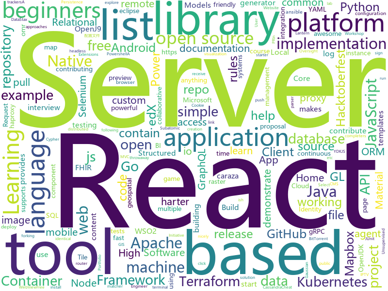

# 2019-10-04
See what the GitHub community is most excited about today.

## python
* [buildbot](https://github.com/buildbot/buildbot)(**2 stars today**): Python-based continuous integration testing framework; your pull requests are more than welcome!
* [integrations-core](https://github.com/DataDog/integrations-core)(**7 stars today**): Core integrations of the Datadog Agent
* [streamlit](https://github.com/streamlit/streamlit)(**233 stars today**): Streamlit — The fastest way to build custom ML tools
* [wemake-python-styleguide](https://github.com/wemake-services/wemake-python-styleguide)(**50 stars today**): The strictest and most opinionated python linter ever!
* [pwnagotchi](https://github.com/evilsocket/pwnagotchi)(**35 stars today**): (⌐■_■) - Deep Reinforcement Learning instrumenting bettercap for WiFI pwning.
* [WebWhatsapp-Wrapper](https://github.com/mukulhase/WebWhatsapp-Wrapper)(**2 stars today**): An API for sending and receiving messages over web.whatsapp [Working as of 18th May 2018]
* [RAdam](https://github.com/LiyuanLucasLiu/RAdam)(**3 stars today**): On the Variance of the Adaptive Learning Rate and Beyond
* [synapse](https://github.com/matrix-org/synapse)(**5 stars today**): Synapse: Matrix reference homeserver
* [gpt-2](https://github.com/openai/gpt-2)(**27 stars today**): Code for the paper "Language Models are Unsupervised Multitask Learners"
* [gpytorch](https://github.com/cornellius-gp/gpytorch)(**0 stars today**): A highly efficient and modular implementation of Gaussian Processes in PyTorch
* [mne-python](https://github.com/mne-tools/mne-python)(**8 stars today**): MNE : Magnetoencephalography (MEG) and Electroencephalography (EEG) in Python
* [scikit-learn](https://github.com/scikit-learn/scikit-learn)(**14 stars today**): scikit-learn: machine learning in Python
* [Mask_RCNN](https://github.com/matterport/Mask_RCNN)(**5 stars today**): Mask R-CNN for object detection and instance segmentation on Keras and TensorFlow
* [ansible](https://github.com/ansible/ansible)(**21 stars today**): Ansible is a radically simple IT automation platform that makes your applications and systems easier to deploy. Avoid writing scripts or custom code to deploy and update your applications — automate in a language that approaches plain English, using SSH, with no agents to install on remote systems. https://docs.ansible.com/ansible/
* [hub](https://github.com/tensorflow/hub)(**2 stars today**): A library for transfer learning by reusing parts of TensorFlow models.
* [matplotlib](https://github.com/matplotlib/matplotlib)(**4 stars today**): matplotlib: plotting with Python
* [eeeeeeeeeeeeeeeeeeeeeeeeeeeeeeeeeeeeeeeeeeeeeeeeeeeeeeeeeeeeeeeeeeeeeeeeeeeeeeeeeeeeeeeeeeeeeeeeeeee](https://github.com/eeeeeeeeeeeeeeeeeeeeeeeeeeeeeeee/eeeeeeeeeeeeeeeeeeeeeeeeeeeeeeeeeeeeeeeeeeeeeeeeeeeeeeeeeeeeeeeeeeeeeeeeeeeeeeeeeeeeeeeeeeeeeeeeeeee)(**3 stars today**): eeeeeeeeeeeeeeeeeeeeeeeeeeeeeeeeeeeeeeeeeeeeeeeeeeeeeeeeeeeeeeeeeeeee
* [geonode](https://github.com/GeoNode/geonode)(**0 stars today**): GeoNode is an open source platform that facilitates the creation, sharing, and collaborative use of geospatial data.
* [rasterio](https://github.com/mapbox/rasterio)(**1 stars today**): Rasterio reads and writes geospatial raster datasets
* [rules_go](https://github.com/bazelbuild/rules_go)(**0 stars today**): Go rules for Bazel
* [content](https://github.com/demisto/content)(**3 stars today**): This repository contains all Demisto content and from here we share content updates
* [ignite](https://github.com/pytorch/ignite)(**7 stars today**): High-level library to help with training neural networks in PyTorch
* [botorch](https://github.com/pytorch/botorch)(**3 stars today**): Bayesian optimization in PyTorch
* [edx-platform](https://github.com/edx/edx-platform)(**1 stars today**): The Open edX platform, the software that powers edX!
* [aioredis](https://github.com/aio-libs/aioredis)(**1 stars today**): asyncio (PEP 3156) Redis support

## java
* [testcontainers-java](https://github.com/testcontainers/testcontainers-java)(**2 stars today**): Testcontainers is a Java library that supports JUnit tests, providing lightweight, throwaway instances of common databases, Selenium web browsers, or anything else that can run in a Docker container.
* [react-native-push-notification](https://github.com/zo0r/react-native-push-notification)(**3 stars today**): React Native Local and Remote Notifications
* [Teaching-HEIGVD-AMT-MVC-simple-example](https://github.com/SoftEng-HEIGVD/Teaching-HEIGVD-AMT-MVC-simple-example)(**1 stars today**): A very simple example to demonstrate the MVC pattern with servlets and JSPs
* [nifi](https://github.com/apache/nifi)(**1 stars today**): Mirror of Apache NiFi
* [spring-boot](https://github.com/spring-projects/spring-boot)(**16 stars today**): Spring Boot
* [antlr4](https://github.com/antlr/antlr4)(**3 stars today**): ANTLR (ANother Tool for Language Recognition) is a powerful parser generator for reading, processing, executing, or translating structured text or binary files.
* [ksql](https://github.com/confluentinc/ksql)(**5 stars today**): KSQL - the Streaming SQL Engine for Apache Kafka
* [openj9](https://github.com/eclipse/openj9)(**0 stars today**): Eclipse OpenJ9: A Java Virtual Machine for OpenJDK that's optimized for small footprint, fast start-up, and high throughput. Builds on Eclipse OMR (https://github.com/eclipse/omr) and combines with the Extensions for OpenJDK for OpenJ9 repo.
* [hapi-fhir](https://github.com/jamesagnew/hapi-fhir)(**2 stars today**): HAPI FHIR - Java API for HL7 FHIR Clients and Servers
* [quarkus](https://github.com/quarkusio/quarkus)(**11 stars today**): Quarkus: Supersonic Subatomic Java.
* [react-native-webview](https://github.com/react-native-community/react-native-webview)(**0 stars today**): React Native Cross-Platform WebView
* [keycloak-documentation](https://github.com/keycloak/keycloak-documentation)(**0 stars today**): 
* [graylog2-server](https://github.com/Graylog2/graylog2-server)(**2 stars today**): Free and open source log management
* [product-is](https://github.com/wso2/product-is)(**0 stars today**): Welcome to the WSO2 Identity Server source code! For info on working with the WSO2 Identity Server repository and contributing code, click the link below.
* [PacketProxy](https://github.com/DeNA/PacketProxy)(**14 stars today**): Local proxy tool in Java
* [dd-trace-java](https://github.com/DataDog/dd-trace-java)(**0 stars today**): Datadog APM client for Java
* [kareldb](https://github.com/rayokota/kareldb)(**19 stars today**): A Relational Database Backed by Apache Kafka
* [crate](https://github.com/crate/crate)(**0 stars today**): CrateDB is a distributed SQL database that makes it simple to store and analyze massive amounts of machine data in real-time.
* [phonegap-plugin-push](https://github.com/phonegap/phonegap-plugin-push)(**2 stars today**): Register and receive push notifications
* [react-native-ble-manager](https://github.com/innoveit/react-native-ble-manager)(**0 stars today**): React Native BLE communication module
* [neo4j-apoc-procedures](https://github.com/neo4j-contrib/neo4j-apoc-procedures)(**0 stars today**): Awesome Procedures On Cypher for Neo4j 3.x - codenamed "apoc"                     If you like it, please ★ above ⇧
* [EhViewer](https://github.com/seven332/EhViewer)(**2 stars today**): [DEPRECATED] An Unofficial E-Hentai Application for Android
* [zalenium](https://github.com/zalando/zalenium)(**0 stars today**): A flexible and scalable container based Selenium Grid with video recording, live preview, basic auth & dashboard.
* [android-samples](https://github.com/gsuitedevs/android-samples)(**0 stars today**): Android samples for G Suite products.
* [java-driver](https://github.com/datastax/java-driver)(**1 stars today**): DataStax Java Driver for Apache Cassandra

## unknown
* [Data-Science--Cheat-Sheet](https://github.com/abhat222/Data-Science--Cheat-Sheet)(**181 stars today**): Cheat Sheets
* [first-contributions](https://github.com/firstcontributions/first-contributions)(**93 stars today**): 🚀✨Help beginners to contribute to open source projects
* [awesome-for-beginners](https://github.com/MunGell/awesome-for-beginners)(**105 stars today**): A list of awesome beginners-friendly projects.
* [trackerslist](https://github.com/ngosang/trackerslist)(**18 stars today**): Updated list of public BitTorrent trackers
* [awesome-hacktoberfest-2019](https://github.com/OtacilioN/awesome-hacktoberfest-2019)(**11 stars today**): A curated list of awesome Hacktoberfest 2019 repositories
* [azure-pipelines-yaml](https://github.com/microsoft/azure-pipelines-yaml)(**1 stars today**): Azure Pipelines YAML examples, templates, and community interaction
* [checkm8gui](https://github.com/emeryferrari/checkm8gui)(**2 stars today**): A GUI version of axi0mX's ipwndfu exploit
* [Analyzing-Visualizing-Data-PowerBI](https://github.com/MicrosoftLearning/Analyzing-Visualizing-Data-PowerBI)(**3 stars today**): This repository contains the lab files and other resources for the free Microsoft course DAT207x: Analyzing and Visualizing Data with Power BI. To learn how to connect, explore, and visualize data with Power BI, sign up for this course on edX.
* [Interview-Preparation](https://github.com/yashasvigirdhar/Interview-Preparation)(**66 stars today**): Interview Preparation material for Senior Software Engineer - Android role
* [Free-Algorithm-Books-1](https://github.com/790013438/Free-Algorithm-Books-1)(**3 stars today**): 
* [fig-standards](https://github.com/php-fig/fig-standards)(**2 stars today**): Standards either proposed or approved by the Framework Interop Group
* [proposal-record-tuple](https://github.com/tc39/proposal-record-tuple)(**17 stars today**): ECMAScript proposal for the Record and Tuple value types. | Stage 1: it will change!
* [Share-SSR-V2ray](https://github.com/selierlin/Share-SSR-V2ray)(**13 stars today**): 🃏Free SS/SSR/V2ray 免费分享节点账号信息网站
* [docs](https://github.com/nuxt/docs)(**0 stars today**): Documentation of Nuxt.js
* [blog](https://github.com/aszx87410/blog)(**2 stars today**): A tech blog about Front-end and JavaScript
* [toc](https://github.com/cncf/toc)(**1 stars today**): ⚖️Technical Oversight Committee (TOC)
* [FamilyDream_Script](https://github.com/1061700625/FamilyDream_Script)(**2 stars today**): 家国梦自动收取金币、货物、升级建筑、拆红包等脚本
* [dumb-password-rules](https://github.com/dumb-password-rules/dumb-password-rules)(**19 stars today**): Shaming sites with dumb password rules.
* [Privilege-Escalation](https://github.com/Ignitetechnologies/Privilege-Escalation)(**21 stars today**): This cheasheet is aimed at the CTF Players and Beginners to help them understand the fundamentals of Privilege Escalation with examples.
* [naming-convention](https://github.com/ktaranov/naming-convention)(**1 stars today**): Templates for naming convention - TSQL, JavaScript, C#, R, Python, Powershell
* [You-Dont-Know-JS](https://github.com/getify/You-Dont-Know-JS)(**87 stars today**): A book series on JavaScript. @YDKJS on twitter.
* [lantern](https://github.com/ntkernel/lantern)(**0 stars today**): Shadowsocks配置文件，蓝灯(Lantern)破解，手机版+win版
* [vector-tile-spec](https://github.com/mapbox/vector-tile-spec)(**0 stars today**): Mapbox Vector Tile specification
* [system-design-interview](https://github.com/checkcheckzz/system-design-interview)(**4 stars today**): System design interview for IT companies
* [tasks](https://github.com/rolling-scopes-school/tasks)(**2 stars today**): 

## javascript
* [iptv](https://github.com/iptv-org/iptv)(**589 stars today**): Collection of 8000+ publicly available IPTV channels from all over the world
* [svelte](https://github.com/sveltejs/svelte)(**32 stars today**): Cybernetically enhanced web apps
* [open-pixel-art](https://github.com/twilio-labs/open-pixel-art)(**26 stars today**): A collaborative pixel art project to teach people how to contribute to open-source
* [node-oidc-provider](https://github.com/panva/node-oidc-provider)(**25 stars today**): OpenID Certified™ OAuth 2.0 Authorization Server implementation for Node.js
* [js-edu](https://github.com/davojta/js-edu)(**1 stars today**): 
* [Ghost](https://github.com/TryGhost/Ghost)(**5 stars today**): 👻The #1 headless Node.js CMS for professional publishing
* [flow-typed](https://github.com/flow-typed/flow-typed)(**1 stars today**): A central repository for Flow library definitions
* [introduccion-a-js](https://github.com/r-argentina-programa/introduccion-a-js)(**6 stars today**): 
* [guessing-game](https://github.com/rolling-scopes-school/guessing-game)(**3 stars today**): Guessing game tests
* [ramda](https://github.com/ramda/ramda)(**14 stars today**): 🐏Practical functional Javascript
* [dropzone](https://github.com/enyo/dropzone)(**3 stars today**): Dropzone is an easy to use drag'n'drop library. It supports image previews and shows nice progress bars.
* [cookieconsent](https://github.com/osano/cookieconsent)(**11 stars today**): A free solution to the EU, GDPR, and California Cookie Laws
* [react-native-swipe-list-view](https://github.com/jemise111/react-native-swipe-list-view)(**0 stars today**): A React Native ListView component with rows that swipe open and closed
* [react-admin](https://github.com/marmelab/react-admin)(**17 stars today**): A frontend Framework for building admin applications running in the browser on top of REST/GraphQL APIs, using ES6, React and Material Design
* [graphql-engine](https://github.com/hasura/graphql-engine)(**21 stars today**): Blazing fast, instant realtime GraphQL APIs on Postgres with fine grained access control, also trigger webhooks on database events.
* [grommet](https://github.com/grommet/grommet)(**4 stars today**): a react-based framework that provides accessibility, modularity, responsiveness, and theming in a tidy package
* [meteor](https://github.com/meteor/meteor)(**5 stars today**): Meteor, the JavaScript App Platform
* [react-select](https://github.com/JedWatson/react-select)(**10 stars today**): The Select Component for React.js
* [react-final-form](https://github.com/final-form/react-final-form)(**2 stars today**): 🏁High performance subscription-based form state management for React
* [Leaflet](https://github.com/Leaflet/Leaflet)(**9 stars today**): 🍃JavaScript library for mobile-friendly interactive maps
* [howoldisit](https://github.com/jsrn/howoldisit)(**0 stars today**): A tool for recruiters to check how old a technology is.
* [swiper](https://github.com/nolimits4web/swiper)(**13 stars today**): Most modern mobile touch slider with hardware accelerated transitions
* [tileserver-gl](https://github.com/maptiler/tileserver-gl)(**2 stars today**): Vector and raster maps with GL styles. Server side rendering by Mapbox GL Native. Map tile server for Mapbox GL JS, Android, iOS, Leaflet, OpenLayers, GIS via WMTS, etc.
* [hyper](https://github.com/zeit/hyper)(**10 stars today**): A terminal built on web technologies
* [keystone-5](https://github.com/keystonejs/keystone-5)(**1 stars today**): 🚀The future of KeystoneJS

## html
* [patchwork](https://github.com/jlord/patchwork)(**1 stars today**): All the Git-it Workshop completers!
* [django-DefectDojo](https://github.com/DefectDojo/django-DefectDojo)(**0 stars today**): DefectDojo is an open-source application vulnerability correlation and security orchestration tool.
* [cypress-example-kitchensink](https://github.com/cypress-io/cypress-example-kitchensink)(**0 stars today**): This is an example app used to showcase Cypress.io testing.
* [hacktoberfest](https://github.com/AliceWonderland/hacktoberfest)(**11 stars today**): Participate in Hacktoberfest by contributing to any Open Source project on GitHub! Here is a starter project for first time contributors. #hacktoberfest
* [simple-icons](https://github.com/simple-icons/simple-icons)(**6 stars today**): SVG icons for popular brands
* [home-assistant.io](https://github.com/home-assistant/home-assistant.io)(**1 stars today**): 📘Home Assistant User documentation
* [yourfirstpr.github.io](https://github.com/yourfirstpr/yourfirstpr.github.io)(**2 stars today**): ✨the homepage of @yourfirstpr
* [hacktoberfest-swag-list](https://github.com/crweiner/hacktoberfest-swag-list)(**55 stars today**): Multiple companies give out swag for Hacktoberfest, and this repo tries to list them all.
* [learning-area](https://github.com/mdn/learning-area)(**4 stars today**): Github repo for the MDN Learning Area.
* [gci-winners](https://github.com/Albert221/gci-winners)(**1 stars today**): Website with a list of GCI winners.
* [UI-III-Flexbox](https://github.com/LambdaSchool/UI-III-Flexbox)(**0 stars today**): 
* [MSEdgeExplainers](https://github.com/MicrosoftEdge/MSEdgeExplainers)(**3 stars today**): Home for explainer documents originated by the Microsoft Edge team
* [caraza-harter-com](https://github.com/tylerharter/caraza-harter-com)(**0 stars today**): For www.caraza-harter.com and tyler.caraza-harter.com
* [gcpcrashcourse](https://github.com/GDGVIT/gcpcrashcourse)(**0 stars today**): Landing page for #GCPCrashCourse
* [proposal-optional-chaining](https://github.com/tc39/proposal-optional-chaining)(**9 stars today**): 
* [HACKTOBERFEST2019](https://github.com/Ishaan28malik/HACKTOBERFEST2019)(**20 stars today**): for beginners who are going to start with therefirst PR
* [guidehud](https://github.com/Skordy/guidehud)(**0 stars today**): In-game menu to contain rules, hotkeys, server announcements, and pretty much anything you desire.
* [proposal-nullish-coalescing](https://github.com/tc39/proposal-nullish-coalescing)(**2 stars today**): Nullish coalescing proposal x ?? y
* [haproxy-boshrelease](https://github.com/cloudfoundry-incubator/haproxy-boshrelease)(**0 stars today**): A BOSH release for haproxy (based on cf-release's haproxy job)
* [portfolioPractice](https://github.com/dsciitpatna/portfolioPractice)(**0 stars today**): Individual Portfolio Page of Beginners in Web
* [capi-release](https://github.com/cloudfoundry/capi-release)(**0 stars today**): Bosh Release for Cloud Controller and friends
* [free-for-dev](https://github.com/ripienaar/free-for-dev)(**7 stars today**): A list of SaaS, PaaS and IaaS offerings that have free tiers of interest to devops and infradev
* [Home](https://github.com/NuGet/Home)(**0 stars today**): Repo for NuGet Client issues
* [ntmswebdb](https://github.com/ntmsstudents/ntmswebdb)(****): 
* [hello-world](https://github.com/moringaschool/hello-world)(****): Created for Moringa Prep, to demonstrate forking repositories.

## go
* [logrus](https://github.com/sirupsen/logrus)(**13 stars today**): Structured, pluggable logging for Go.
* [hcl](https://github.com/hashicorp/hcl)(**5 stars today**): HCL is the HashiCorp configuration language.
* [aws-sdk-go](https://github.com/aws/aws-sdk-go)(**1 stars today**): AWS SDK for the Go programming language.
* [argo-cd](https://github.com/argoproj/argo-cd)(**2 stars today**): Declarative continuous deployment for Kubernetes.
* [spark-on-k8s-operator](https://github.com/GoogleCloudPlatform/spark-on-k8s-operator)(**2 stars today**): Kubernetes operator for managing the lifecycle of Apache Spark applications on Kubernetes.
* [teleport](https://github.com/gravitational/teleport)(**2 stars today**): Privileged access management for elastic infrastructure.
* [cri-o](https://github.com/cri-o/cri-o)(**8 stars today**): Open Container Initiative-based implementation of Kubernetes Container Runtime Interface
* [telegraf](https://github.com/influxdata/telegraf)(**7 stars today**): The plugin-driven server agent for collecting & reporting metrics.
* [atlantis](https://github.com/runatlantis/atlantis)(**4 stars today**): Terraform Pull Request Automation
* [go-swagger](https://github.com/go-swagger/go-swagger)(**4 stars today**): Swagger 2.0 implementation for go
* [pg](https://github.com/go-pg/pg)(**7 stars today**): Golang ORM with focus on PostgreSQL features and performance
* [gorp](https://github.com/go-gorp/gorp)(**3 stars today**): Go Relational Persistence - an ORM-ish library for Go
* [testify](https://github.com/stretchr/testify)(**5 stars today**): A toolkit with common assertions and mocks that plays nicely with the standard library
* [mux](https://github.com/gorilla/mux)(**6 stars today**): A powerful HTTP router and URL matcher for building Go web servers with🦍
* [grpc-go](https://github.com/grpc/grpc-go)(**10 stars today**): The Go language implementation of gRPC. HTTP/2 based RPC
* [node_exporter](https://github.com/prometheus/node_exporter)(**6 stars today**): Exporter for machine metrics
* [mattermost-server](https://github.com/mattermost/mattermost-server)(**15 stars today**): Open source Slack-alternative in Golang and React - Mattermost
* [tendermint](https://github.com/tendermint/tendermint)(**5 stars today**): ⟁ Tendermint Core (BFT Consensus) in Go
* [packer](https://github.com/hashicorp/packer)(**5 stars today**): Packer is a tool for creating identical machine images for multiple platforms from a single source configuration.
* [loki](https://github.com/grafana/loki)(**12 stars today**): Like Prometheus, but for logs.
* [terraform-provider-google](https://github.com/terraform-providers/terraform-provider-google)(**2 stars today**): Terraform Google Cloud Platform provider
* [eksctl](https://github.com/weaveworks/eksctl)(**7 stars today**): The official CLI for Amazon EKS
* [grpc-gateway](https://github.com/grpc-ecosystem/grpc-gateway)(**3 stars today**): gRPC to JSON proxy generator following the gRPC HTTP spec
* [sampler](https://github.com/sqshq/sampler)(**50 stars today**): A tool for shell commands execution, visualization and alerting. Configured with a simple YAML file.
* [terragrunt](https://github.com/gruntwork-io/terragrunt)(**4 stars today**): Terragrunt is a thin wrapper for Terraform that provides extra tools for working with multiple Terraform modules.

## WordCloud

