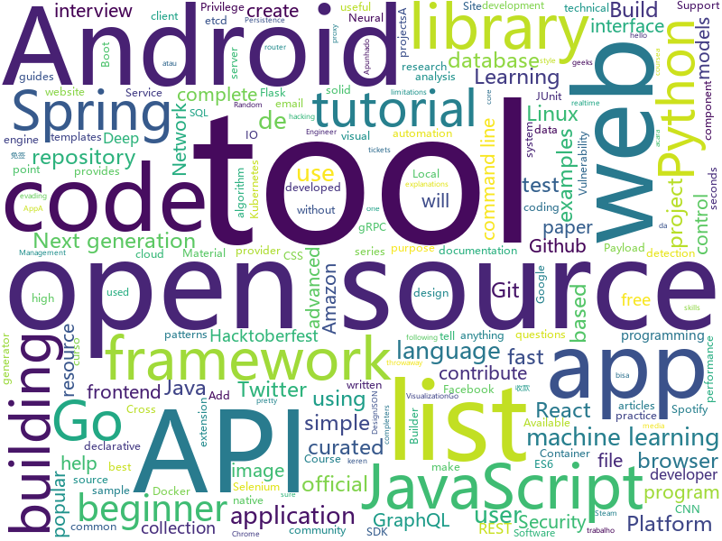

# 2019-10-05
See what the GitHub community is most excited about today.

## python
* [streamlit](https://github.com/streamlit/streamlit)(**291 stars today**): Streamlit — The fastest way to build custom ML tools
* [JiaGuoMengCalculator](https://github.com/WANGPeisheng1997/JiaGuoMengCalculator)(**15 stars today**): 家国梦建筑最优化计算器
* [httpx](https://github.com/encode/httpx)(**9 stars today**): A next generation HTTP client for Python.🦋
* [home-assistant](https://github.com/home-assistant/home-assistant)(**33 stars today**): 🏡Open source home automation that puts local control and privacy first
* [machine_learning_examples](https://github.com/lazyprogrammer/machine_learning_examples)(**4 stars today**): A collection of machine learning examples and tutorials.
* [system-design-primer](https://github.com/donnemartin/system-design-primer)(**92 stars today**): Learn how to design large-scale systems. Prep for the system design interview. Includes Anki flashcards.
* [django-rest-framework](https://github.com/encode/django-rest-framework)(**17 stars today**): Web APIs for Django.⚡️
* [PayloadsAllTheThings](https://github.com/swisskyrepo/PayloadsAllTheThings)(**21 stars today**): A list of useful payloads and bypass for Web Application Security and Pentest/CTF
* [Detectron](https://github.com/facebookresearch/Detectron)(**10 stars today**): FAIR's research platform for object detection research, implementing popular algorithms like Mask R-CNN and RetinaNet.
* [sagemaker-python-sdk](https://github.com/aws/sagemaker-python-sdk)(**2 stars today**): A library for training and deploying machine learning models on Amazon SageMaker
* [odoo](https://github.com/odoo/odoo)(**14 stars today**): Odoo. Open Source Apps To Grow Your Business.
* [PynamoDB](https://github.com/pynamodb/PynamoDB)(**5 stars today**): A pythonic interface to Amazon's DynamoDB
* [elasticsearch-py](https://github.com/elastic/elasticsearch-py)(**2 stars today**): Official Python low-level client for Elasticsearch.
* [kedro](https://github.com/quantumblacklabs/kedro)(**7 stars today**): A Python library for building robust production-ready data and analytics pipelines.
* [tiler](https://github.com/nuno-faria/tiler)(**26 stars today**): 👷Build images with images
* [pwnagotchi](https://github.com/evilsocket/pwnagotchi)(**53 stars today**): (⌐■_■) - Deep Reinforcement Learning instrumenting bettercap for WiFI pwning.
* [gpt-2](https://github.com/openai/gpt-2)(**30 stars today**): Code for the paper "Language Models are Unsupervised Multitask Learners"
* [kornia](https://github.com/arraiyopensource/kornia)(**45 stars today**): Open Source Differentiable Computer Vision Library for PyTorch
* [bcc](https://github.com/iovisor/bcc)(**8 stars today**): BCC - Tools for BPF-based Linux IO analysis, networking, monitoring, and more
* [generative_inpainting](https://github.com/JiahuiYu/generative_inpainting)(**4 stars today**): DeepFill v1/v2, Contextual Attention and Gated Convolution, CVPR 2018, and ICCV 2019 Oral
* [microblog](https://github.com/miguelgrinberg/microblog)(**1 stars today**): A microblogging web application written in Python and Flask that I developed as part of my Flask Mega-Tutorial series.
* [cheat.sh](https://github.com/chubin/cheat.sh)(**8 stars today**): the only cheat sheet you need
* [deep-learning-models](https://github.com/fchollet/deep-learning-models)(**4 stars today**): Keras code and weights files for popular deep learning models.
* [urgent11-detector](https://github.com/ArmisSecurity/urgent11-detector)(**2 stars today**): URGENT/11 detection tool by Armis
* [twint](https://github.com/twintproject/twint)(**46 stars today**): An advanced Twitter scraping & OSINT tool written in Python that doesn't use Twitter's API, allowing you to scrape a user's followers, following, Tweets and more while evading most API limitations.

## java
* [user-interface-samples](https://github.com/android/user-interface-samples)(**6 stars today**): Multiple samples showing the best practices in user-interface on Android.
* [dbeaver](https://github.com/dbeaver/dbeaver)(**17 stars today**): Free universal database tool and SQL client
* [h2o-3](https://github.com/h2oai/h2o-3)(**5 stars today**): Open Source Fast Scalable Machine Learning Platform For Smarter Applications: Deep Learning, Gradient Boosting & XGBoost, Random Forest, Generalized Linear Modeling (Logistic Regression, Elastic Net), K-Means, PCA, Stacked Ensembles, Automatic Machine Learning (AutoML), etc.
* [react-native-push-notification](https://github.com/zo0r/react-native-push-notification)(**4 stars today**): React Native Local and Remote Notifications
* [ksql](https://github.com/confluentinc/ksql)(**4 stars today**): KSQL - the Streaming SQL Engine for Apache Kafka
* [zerocode](https://github.com/authorjapps/zerocode)(**1 stars today**): A community-developed, free, open source, declarative API automation and load testing framework built using Java JUnit core runners for Http REST, SOAP, Security, Database, Kafka and much more. It enables to create and maintain test-cases with absolute ease.
* [springboot-guide](https://github.com/Snailclimb/springboot-guide)(**8 stars today**): Summary of key points of SpringBoot。 Based on Spring Boot 2.19+。
* [interview-techdev-guide](https://github.com/fnplus/interview-techdev-guide)(**5 stars today**): This repository contains curated technical interview questions by fn+geeks community
* [react-native-navigation](https://github.com/wix/react-native-navigation)(**2 stars today**): A complete native navigation solution for React Native
* [java-design-patterns](https://github.com/iluwatar/java-design-patterns)(**27 stars today**): Design patterns implemented in Java
* [HikariCP](https://github.com/brettwooldridge/HikariCP)(**5 stars today**): 光 HikariCP・A solid, high-performance, JDBC connection pool at last.
* [fix-counting-hashset](https://github.com/hcsp/fix-counting-hashset)(**0 stars today**): Java basic practice for beginners: inheritance
* [testcontainers-java](https://github.com/testcontainers/testcontainers-java)(**37 stars today**): Testcontainers is a Java library that supports JUnit tests, providing lightweight, throwaway instances of common databases, Selenium web browsers, or anything else that can run in a Docker container.
* [facebook-android-sdk](https://github.com/facebook/facebook-android-sdk)(**3 stars today**): Used to integrate Android apps with Facebook Platform.
* [glide](https://github.com/bumptech/glide)(**8 stars today**): An image loading and caching library for Android focused on smooth scrolling
* [termux-app](https://github.com/termux/termux-app)(**8 stars today**): Android terminal and Linux environment - app repository.
* [gravitee-gateway](https://github.com/gravitee-io/gravitee-gateway)(**2 stars today**): Gravitee.io - API Management - OpenSource API Gateway
* [tutorials](https://github.com/eugenp/tutorials)(**16 stars today**): The "REST With Spring" Course:
* [aws-doc-sdk-examples](https://github.com/awsdocs/aws-doc-sdk-examples)(**3 stars today**): Code examples used in the official AWS SDK documentation.
* [spring-boot-tutorial](https://github.com/RameshMF/spring-boot-tutorial)(**2 stars today**): 100+ Spring Boot Articles, Tutorials, Video tutorials, Projects, Guides, Source code examples etc
* [AndroidTutorialForBeginners](https://github.com/hussien89aa/AndroidTutorialForBeginners)(**1 stars today**): Step by step to build Android apps using Android Studio
* [spring-petclinic](https://github.com/spring-projects/spring-petclinic)(**6 stars today**): A sample Spring-based application
* [interviews](https://github.com/kdn251/interviews)(**29 stars today**): Everything you need to know to get the job.
* [start.spring.io](https://github.com/spring-io/start.spring.io)(**3 stars today**): https://start.spring.io
* [checkm8gui](https://github.com/emeryferrari/checkm8gui)(**3 stars today**): A GUI version of axi0mX's ipwndfu exploit

## unknown
* [Data-Science--Cheat-Sheet](https://github.com/abhat222/Data-Science--Cheat-Sheet)(**197 stars today**): Cheat Sheets
* [awesome-automl-papers](https://github.com/hibayesian/awesome-automl-papers)(**7 stars today**): A curated list of automated machine learning papers, articles, tutorials, slides and projects
* [You-Dont-Know-JS](https://github.com/getify/You-Dont-Know-JS)(**59 stars today**): A book series on JavaScript. @YDKJS on twitter.
* [gitignore](https://github.com/github/gitignore)(**40 stars today**): A collection of useful .gitignore templates
* [trackerslist](https://github.com/ngosang/trackerslist)(**67 stars today**): Updated list of public BitTorrent trackers
* [remote-jobs-brazil](https://github.com/lerrua/remote-jobs-brazil)(**6 stars today**): Lista de empresas com trabalho remoto no Brasil
* [Privilege-Escalation](https://github.com/Ignitetechnologies/Privilege-Escalation)(**13 stars today**): This cheasheet is aimed at the CTF Players and Beginners to help them understand the fundamentals of Privilege Escalation with examples.
* [Interview-Preparation](https://github.com/yashasvigirdhar/Interview-Preparation)(**29 stars today**): Interview Preparation material for Senior Software Engineer - Android role
* [dumb-password-rules](https://github.com/dumb-password-rules/dumb-password-rules)(**9 stars today**): Shaming sites with dumb password rules.
* [OpenAPI-Specification](https://github.com/OAI/OpenAPI-Specification)(**5 stars today**): The OpenAPI Specification Repository
* [awesome-speakers-id](https://github.com/rizafahmi/awesome-speakers-id)(**16 stars today**): Para developer keren asal Indonesia yang bisa diundang ke acara komunitas dan konferensi sebagai pembicara atau narasumber
* [awesome-applied-category-theory](https://github.com/statebox/awesome-applied-category-theory)(**22 stars today**): ACT community resources
* [first-contributions](https://github.com/firstcontributions/first-contributions)(**142 stars today**): 🚀✨Help beginners to contribute to open source projects
* [AndroidCourse101](https://github.com/Koducation/AndroidCourse101)(**1 stars today**): Complete Android Development Course 101: Spotify Clone App
* [Hacktoberfest2019](https://github.com/wajahatkarim3/Hacktoberfest2019)(**4 stars today**): A repository to contribute to Hacktoberfest 2019
* [apostila-fj33](https://github.com/alexandreaquiles/apostila-fj33)(**1 stars today**): Apostila do curso de Microservices com Spring Cloud da Caelum.
* [awesome-point-cloud-analysis](https://github.com/Yochengliu/awesome-point-cloud-analysis)(**7 stars today**): A list of papers and datasets about point cloud analysis (processing)
* [Links-uteis](https://github.com/OfficialMarinho/Links-uteis)(**2 stars today**): 📎Apunhado de links úteis para o desenvolvimento de projetos de programação e design
* [CentOS-Control-Web-Panel-CVE](https://github.com/i3umi3iei3ii/CentOS-Control-Web-Panel-CVE)(**7 stars today**): CentOS Control Web Panel, Root Privilege Escalation
* [stockpredictionai](https://github.com/borisbanushev/stockpredictionai)(**3 stars today**): In this noteboook I will create a complete process for predicting stock price movements. Follow along and we will achieve some pretty good results. For that purpose we will use a Generative Adversarial Network (GAN) with LSTM, a type of Recurrent Neural Network, as generator, and a Convolutional Neural Network, CNN, as a discriminator. We use L…
* [awesome-docker](https://github.com/veggiemonk/awesome-docker)(**9 stars today**): 🐳A curated list of Docker resources and projects
* [javascript-questions](https://github.com/lydiahallie/javascript-questions)(**16 stars today**): A long list of (advanced) JavaScript questions, and their explanations✨
* [every-programmer-should-know](https://github.com/mtdvio/every-programmer-should-know)(**13 stars today**): A collection of (mostly) technical things every software developer should know
* [awesome-hacktoberfest-2019](https://github.com/OtacilioN/awesome-hacktoberfest-2019)(**5 stars today**): A curated list of awesome Hacktoberfest 2019 repositories
* [summer2020internships](https://github.com/elaine-zheng/summer2020internships)(**10 stars today**): Keep track of internships for Summer 2020 for undergraduates interested in tech./SWE/related fields

## javascript
* [iptv](https://github.com/iptv-org/iptv)(**579 stars today**): Collection of 8000+ publicly available IPTV channels from all over the world
* [react](https://github.com/facebook/react)(**73 stars today**): A declarative, efficient, and flexible JavaScript library for building user interfaces.
* [curso-javascript-ninja](https://github.com/da2k/curso-javascript-ninja)(**4 stars today**): Curso Javascript Ninja
* [babel](https://github.com/babel/babel)(**15 stars today**): 🐠Babel is a compiler for writing next generation JavaScript.
* [styled-components](https://github.com/styled-components/styled-components)(**17 stars today**): Visual primitives for the component age. Use the best bits of ES6 and CSS to style your apps without stress💅
* [complete-javascript-course](https://github.com/jonasschmedtmann/complete-javascript-course)(**7 stars today**): Starter files, final projects and FAQ for my Complete JavaScript course
* [grommet](https://github.com/grommet/grommet)(**14 stars today**): a react-based framework that provides accessibility, modularity, responsiveness, and theming in a tidy package
* [react-admin](https://github.com/marmelab/react-admin)(**17 stars today**): A frontend Framework for building admin applications running in the browser on top of REST/GraphQL APIs, using ES6, React and Material Design
* [JSON-js](https://github.com/douglascrockford/JSON-js)(**1 stars today**): JSON in JavaScript
* [nuxt.js](https://github.com/nuxt/nuxt.js)(**28 stars today**): The Vue.js Framework
* [codesandbox-client](https://github.com/codesandbox/codesandbox-client)(**5 stars today**): An online code editor tailored for web application development🏖️
* [brave-browser](https://github.com/brave/brave-browser)(**9 stars today**): Next generation Brave browser for macOS, Windows, Linux, and eventually Android
* [appwrite](https://github.com/appwrite/appwrite)(**64 stars today**): End to end backend server for frontend and mobile developers.👩‍💻👨‍💻
* [open-pixel-art](https://github.com/twilio-labs/open-pixel-art)(**40 stars today**): A collaborative pixel art project to teach people how to contribute to open-source
* [grapesjs](https://github.com/artf/grapesjs)(**11 stars today**): Free and Open source Web Builder Framework. Next generation tool for building templates without coding
* [markdown-here](https://github.com/adam-p/markdown-here)(**37 stars today**): Google Chrome, Firefox, and Thunderbird extension that lets you write email in Markdown and render it before sending.
* [lbry-desktop](https://github.com/lbryio/lbry-desktop)(**3 stars today**): A browser and wallet for LBRY, the decentralized, user-controlled content marketplace.
* [10secondsofcode](https://github.com/10secondsofcode/10secondsofcode)(**7 stars today**): The team behind 10-seconds-of-code and official 10-seconds projects.
* [vscode-elixir-test](https://github.com/samuelpordeus/vscode-elixir-test)(**2 stars today**): visual studio code extension that helps interaction with elixir tests
* [junior-recruit-scheduler](https://github.com/jojoldu/junior-recruit-scheduler)(**5 stars today**): 주니어 개발자 채용 정보
* [insomnia](https://github.com/getinsomnia/insomnia)(**12 stars today**): Cross-platform HTTP and GraphQL Client
* [Hacktoberfest](https://github.com/acmbvp/Hacktoberfest)(**39 stars today**): Make your first PR! ~ A beginner friendly repository made specifically for open source beginners. Add any program under any language (it can be anything from a hello-world program to a complex data structure algorithm to a blog!) or update the existing one. Just make sure you add the program under the correct language directory. Happy coding!
* [teachcode](https://github.com/madlabsinc/teachcode)(**5 stars today**): A tool to develop and improve a student’s programming skills by introducing the earliest lessons of coding.
* [graphql-engine](https://github.com/hasura/graphql-engine)(**27 stars today**): Blazing fast, instant realtime GraphQL APIs on Postgres with fine grained access control, also trigger webhooks on database events.

## html
* [patchwork](https://github.com/jlord/patchwork)(**11 stars today**): All the Git-it Workshop completers!
* [Santafied](https://github.com/zero-to-mastery/Santafied)(**3 stars today**): A ZTM Challenge for Hacktoberfest 2019
* [HiddenEye](https://github.com/DarkSecDevelopers/HiddenEye)(**6 stars today**): Modern Phishing Tool With Advanced Functionality [ Android-Support-Available ]
* [ServiceWorker](https://github.com/w3c/ServiceWorker)(**3 stars today**): Service Workers
* [Hacktoberfest2019](https://github.com/EnigmaVSSUT/Hacktoberfest2019)(**2 stars today**): Get a free Tee, dive into open source and get hacking ! <3
* [glastoselenium](https://github.com/thomasms/glastoselenium)(**6 stars today**): A bot for booking Glastonbury tickets using selenium
* [hugo-academic](https://github.com/gcushen/hugo-academic)(**6 stars today**): 📝The website builder for Hugo. Build and deploy a beautiful website in minutes!
* [en.javascript.info](https://github.com/javascript-tutorial/en.javascript.info)(**14 stars today**): Modern JavaScript Tutorial
* [tailwindcss](https://github.com/laravel-frontend-presets/tailwindcss)(**3 stars today**): A Tailwind CSS frontend preset for the Laravel Framework
* [yourfirstpr.github.io](https://github.com/yourfirstpr/yourfirstpr.github.io)(**1 stars today**): ✨the homepage of @yourfirstpr
* [shellphish](https://github.com/thelinuxchoice/shellphish)(**5 stars today**): Phishing Tool for 18 social media: Instagram, Facebook, Snapchat, Github, Twitter, Yahoo, Protonmail, Spotify, Netflix, Linkedin, Wordpress, Origin, Steam, Microsoft, InstaFollowers, Gitlab, Pinterest
* [Cerberus](https://github.com/TedGoas/Cerberus)(**2 stars today**): A few simple, but solid patterns for responsive HTML email templates and newsletters. Even in Outlook and Gmail.
* [simple-icons](https://github.com/simple-icons/simple-icons)(**8 stars today**): SVG icons for popular brands
* [xss-payload-list](https://github.com/payloadbox/xss-payload-list)(**4 stars today**): 🎯Cross Site Scripting ( XSS ) Vulnerability Payload List
* [git-it-electron](https://github.com/jlord/git-it-electron)(**7 stars today**): 💻🎓Git-it is a (Mac, Win, Linux) Desktop App for Learning Git and GitHub
* [styleguide](https://github.com/google/styleguide)(**16 stars today**): Style guides for Google-originated open-source projects
* [hippocratic-license](https://github.com/ContributorCovenant/hippocratic-license)(**6 stars today**): An ethical open source license alternative.
* [How-to-be-a-good-programmer](https://github.com/niudai/How-to-be-a-good-programmer)(**4 stars today**): I'm here to tell you some amazing stuff which teacher would never tell you.
* [phantomjs](https://github.com/ariya/phantomjs)(**4 stars today**): Scriptable Headless Browser
* [web-moderno](https://github.com/cod3rcursos/web-moderno)(**1 stars today**): 
* [openshift-docs](https://github.com/openshift/openshift-docs)(**0 stars today**): OpenShift Documentation
* [fastText](https://github.com/facebookresearch/fastText)(**9 stars today**): Library for fast text representation and classification.
* [nodejs_wx_aipay_api](https://github.com/yioMe/nodejs_wx_aipay_api)(**2 stars today**): 微信支付宝个人免签收款Api系统，有了它对接再也不用担心我的业务不能支付了
* [docs](https://github.com/knative/docs)(**1 stars today**): User documentation for Knative components
* [nginxconfig.io](https://github.com/digitalocean/nginxconfig.io)(**11 stars today**): ⚙️NGiИX config generator on steroids💉

## go
* [huskyCI](https://github.com/globocom/huskyCI)(**10 stars today**): Performing security tests inside your CI
* [eksctl](https://github.com/weaveworks/eksctl)(**4 stars today**): The official CLI for Amazon EKS
* [linkerd2](https://github.com/linkerd/linkerd2)(**13 stars today**): A service mesh for Kubernetes and beyond. Main repo for Linkerd 2.x.
* [hub](https://github.com/github/hub)(**19 stars today**): A command-line tool that makes git easier to use with GitHub.
* [trivy](https://github.com/aquasecurity/trivy)(**5 stars today**): A Simple and Comprehensive Vulnerability Scanner for Containers, Suitable for CI
* [cli](https://github.com/urfave/cli)(**6 stars today**): A simple, fast, and fun package for building command line apps in Go
* [sampler](https://github.com/sqshq/sampler)(**33 stars today**): A tool for shell commands execution, visualization and alerting. Configured with a simple YAML file.
* [mock](https://github.com/golang/mock)(**5 stars today**): GoMock is a mocking framework for the Go programming language.
* [testify](https://github.com/stretchr/testify)(**7 stars today**): A toolkit with common assertions and mocks that plays nicely with the standard library
* [oauth2_proxy](https://github.com/pusher/oauth2_proxy)(**3 stars today**): A reverse proxy that provides authentication with Google, Github or other providers. #Hacktoberfest
* [opa](https://github.com/open-policy-agent/opa)(**2 stars today**): An open source, general-purpose policy engine.
* [ent](https://github.com/facebookincubator/ent)(**147 stars today**): An entity framework for Go
* [logrus](https://github.com/sirupsen/logrus)(**40 stars today**): Structured, pluggable logging for Go.
* [inb-go](https://github.com/insight-chain/inb-go)(**25 stars today**): Official Go implementation of the Insight Chain(INB)
* [mux](https://github.com/gorilla/mux)(**3 stars today**): A powerful HTTP router and URL matcher for building Go web servers with🦍
* [sloop](https://github.com/salesforce/sloop)(**50 stars today**): Kubernetes History Visualization
* [paho.mqtt.golang](https://github.com/eclipse/paho.mqtt.golang)(**1 stars today**): 
* [gorp](https://github.com/go-gorp/gorp)(**6 stars today**): Go Relational Persistence - an ORM-ish library for Go
* [terraform-provider-azurerm](https://github.com/terraform-providers/terraform-provider-azurerm)(**2 stars today**): Terraform provider for Azure Resource Manager
* [atlantis](https://github.com/runatlantis/atlantis)(**10 stars today**): Terraform Pull Request Automation
* [grpcurl](https://github.com/fullstorydev/grpcurl)(**6 stars today**): Like cURL, but for gRPC: Command-line tool for interacting with gRPC servers
* [aws-sdk-go](https://github.com/aws/aws-sdk-go)(**4 stars today**): AWS SDK for the Go programming language.
* [linkchain](https://github.com/lianxiangcloud/linkchain)(**1 stars today**): 享云链-郑和版本
* [etcd-operator](https://github.com/coreos/etcd-operator)(**1 stars today**): etcd operator creates/configures/manages etcd clusters atop Kubernetes
* [ledisdb](https://github.com/siddontang/ledisdb)(**3 stars today**): a high performance NoSQL powered by Go

## WordCloud

