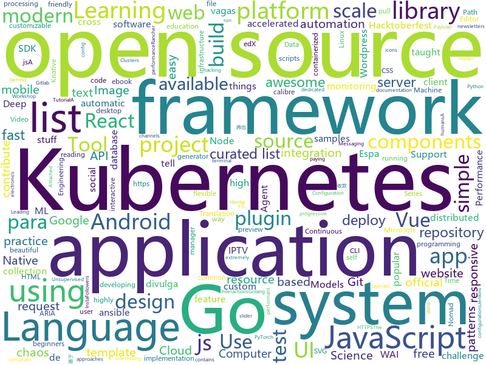

# 2019-10-06
See what the GitHub community is most excited about today.

## python
* [streamlit](https://github.com/streamlit/streamlit)(**316 stars today**): Streamlit — The fastest way to build custom ML tools
* [hydra](https://github.com/facebookresearch/hydra)(**101 stars today**): Hydra is a framework for elegantly configuring complex applications
* [kornia](https://github.com/arraiyopensource/kornia)(**45 stars today**): Open Source Differentiable Computer Vision Library for PyTorch
* [integrations-core](https://github.com/DataDog/integrations-core)(**0 stars today**): Core integrations of the Datadog Agent
* [home-assistant](https://github.com/home-assistant/home-assistant)(**45 stars today**): 🏡Open source home automation that puts local control and privacy first
* [gpt-2](https://github.com/openai/gpt-2)(**22 stars today**): Code for the paper "Language Models are Unsupervised Multitask Learners"
* [cupy](https://github.com/cupy/cupy)(**5 stars today**): NumPy-like API accelerated with CUDA
* [calibre](https://github.com/kovidgoyal/calibre)(**44 stars today**): The official source code repository for the calibre ebook manager
* [pwnagotchi](https://github.com/evilsocket/pwnagotchi)(**28 stars today**): (⌐■_■) - Deep Reinforcement Learning instrumenting bettercap for WiFI pwning.
* [pytorch-lightning](https://github.com/williamFalcon/pytorch-lightning)(**10 stars today**): The lightweight PyTorch wrapper for ML researchers. Scale your models. Write less boilerplate
* [system-design-primer](https://github.com/donnemartin/system-design-primer)(**55 stars today**): Learn how to design large-scale systems. Prep for the system design interview. Includes Anki flashcards.
* [JiaGuoMengCalculator](https://github.com/WANGPeisheng1997/JiaGuoMengCalculator)(**25 stars today**): 家国梦建筑最优化计算器
* [odoo](https://github.com/odoo/odoo)(**16 stars today**): Odoo. Open Source Apps To Grow Your Business.
* [buildbot](https://github.com/buildbot/buildbot)(**13 stars today**): Python-based continuous integration testing framework; your pull requests are more than welcome!
* [calibre-web](https://github.com/janeczku/calibre-web)(**39 stars today**): 📚Web app for browsing, reading and downloading eBooks stored in a Calibre database
* [temporal-shift-module](https://github.com/mit-han-lab/temporal-shift-module)(**5 stars today**): [ICCV 2019] TSM: Temporal Shift Module for Efficient Video Understanding.
* [pytorch-CycleGAN-and-pix2pix](https://github.com/junyanz/pytorch-CycleGAN-and-pix2pix)(**16 stars today**): Image-to-Image Translation in PyTorch
* [Mask_RCNN](https://github.com/matterport/Mask_RCNN)(**14 stars today**): Mask R-CNN for object detection and instance segmentation on Keras and TensorFlow
* [openshift-ansible](https://github.com/openshift/openshift-ansible)(**0 stars today**): OpenShift Installation and Configuration Management
* [ansible](https://github.com/ansible/ansible)(**14 stars today**): Ansible is a radically simple IT automation platform that makes your applications and systems easier to deploy. Avoid writing scripts or custom code to deploy and update your applications — automate in a language that approaches plain English, using SSH, with no agents to install on remote systems. https://docs.ansible.com/ansible/
* [edx-platform](https://github.com/edx/edx-platform)(**4 stars today**): The Open edX platform, the software that powers edX!
* [litmus](https://github.com/litmuschaos/litmus)(**10 stars today**): Litmus is the toolset for Kubernetes SREs to practice chaos engineering. Use the pre-defined chaos charts, run chaos, find weaknesses in your Kubernetes systems.
* [bcc](https://github.com/iovisor/bcc)(**4 stars today**): BCC - Tools for BPF-based Linux IO analysis, networking, monitoring, and more
* [google-research](https://github.com/google-research/google-research)(**11 stars today**): Google AI Research
* [keras](https://github.com/keras-team/keras)(**21 stars today**): Deep Learning for humans

## java
* [Anime4K](https://github.com/bloc97/Anime4K)(**198 stars today**): A High-Quality Real Time Upscaler for Anime Video
* [java-design-patterns](https://github.com/iluwatar/java-design-patterns)(**21 stars today**): Design patterns implemented in Java
* [netbeans](https://github.com/apache/netbeans)(**4 stars today**): Apache NetBeans
* [interview](https://github.com/mission-peace/interview)(**8 stars today**): Interview questions
* [strongbox](https://github.com/strongbox/strongbox)(**3 stars today**): Strongbox is an artifact repository manager.
* [user-interface-samples](https://github.com/android/user-interface-samples)(**20 stars today**): Multiple samples showing the best practices in user-interface on Android.
* [Telegram](https://github.com/DrKLO/Telegram)(**8 stars today**): Telegram for Android source
* [SkyStone](https://github.com/FIRST-Tech-Challenge/SkyStone)(**1 stars today**): FTC SDK
* [JAViewer](https://github.com/SplashCodes/JAViewer)(**2 stars today**): 更优雅的驾车体验
* [Arduino](https://github.com/arduino/Arduino)(**7 stars today**): open-source electronics prototyping platform
* [EhViewer](https://github.com/seven332/EhViewer)(**6 stars today**): [DEPRECATED] An Unofficial E-Hentai Application for Android
* [storm](https://github.com/apache/storm)(**1 stars today**): Mirror of Apache Storm
* [disruptor](https://github.com/LMAX-Exchange/disruptor)(**9 stars today**): High Performance Inter-Thread Messaging Library
* [SmartYouTubeTV](https://github.com/yuliskov/SmartYouTubeTV)(**3 stars today**): Watch YouTube videos on your TV and set-top-box with comfort
* [Algorithms](https://github.com/williamfiset/Algorithms)(**1 stars today**): A collection of algorithms
* [AndroidTutorialForBeginners](https://github.com/hussien89aa/AndroidTutorialForBeginners)(**3 stars today**): Step by step to build Android apps using Android Studio
* [material-components-android](https://github.com/material-components/material-components-android)(**12 stars today**): Modular and customizable Material Design UI components for Android
* [h2o-3](https://github.com/h2oai/h2o-3)(**5 stars today**): Open Source Fast Scalable Machine Learning Platform For Smarter Applications: Deep Learning, Gradient Boosting & XGBoost, Random Forest, Generalized Linear Modeling (Logistic Regression, Elastic Net), K-Means, PCA, Stacked Ensembles, Automatic Machine Learning (AutoML), etc.
* [fabric-carpet](https://github.com/gnembon/fabric-carpet)(**4 stars today**): Fabric Carpet
* [antlr4](https://github.com/antlr/antlr4)(**7 stars today**): ANTLR (ANother Tool for Language Recognition) is a powerful parser generator for reading, processing, executing, or translating structured text or binary files.
* [proxyee-down](https://github.com/proxyee-down-org/proxyee-down)(**6 stars today**): http下载工具，基于http代理，支持多连接分块下载
* [lc](https://github.com/SeanPrashad/lc)(**11 stars today**): A list of 160+ leetcode questions sorted by their common patterns
* [FirebaseUI-Android](https://github.com/firebase/FirebaseUI-Android)(**3 stars today**): Optimized UI components for Firebase
* [bitcoinj](https://github.com/bitcoinj/bitcoinj)(**2 stars today**): A library for working with Bitcoin
* [Skript](https://github.com/SkriptLang/Skript)(**0 stars today**): Skript is a Bukkit plugin which allows server admins to customize their server easily, but without the hassle of programming a plugin or asking/paying someone to program a plugin for them.

## unknown
* [expo-common-issues](https://github.com/Rocketseat/expo-common-issues)(**30 stars today**): Common issues while developing with Expo
* [Data-Science--Cheat-Sheet](https://github.com/abhat222/Data-Science--Cheat-Sheet)(**99 stars today**): Cheat Sheets
* [computer-science](https://github.com/ossu/computer-science)(**96 stars today**): 🎓Path to a free self-taught education in Computer Science!
* [data-science](https://github.com/ossu/data-science)(**6 stars today**): 📊Path to a free self-taught education in Data Science!
* [awesome-macos-command-line](https://github.com/herrbischoff/awesome-macos-command-line)(**14 stars today**): Use your macOS terminal shell to do awesome things.
* [awesome-nlp](https://github.com/keon/awesome-nlp)(**12 stars today**): 📖A curated list of resources dedicated to Natural Language Processing (NLP)
* [first-contributions](https://github.com/firstcontributions/first-contributions)(**54 stars today**): 🚀✨Help beginners to contribute to open source projects
* [awesome-for-beginners](https://github.com/MunGell/awesome-for-beginners)(**76 stars today**): A list of awesome beginners-friendly projects.
* [awesome-react-components](https://github.com/brillout/awesome-react-components)(**19 stars today**): Curated List of React Components & Libraries.
* [trackerslist](https://github.com/ngosang/trackerslist)(**32 stars today**): Updated list of public BitTorrent trackers
* [vagas](https://github.com/frontendbr/vagas)(**4 stars today**): 🔬Espaço para divulgação de vagas para front-enders.
* [react-redux-links](https://github.com/markerikson/react-redux-links)(**7 stars today**): Curated tutorial and resource links I've collected on React, Redux, ES6, and more
* [Hacktoberfest2019](https://github.com/wajahatkarim3/Hacktoberfest2019)(**0 stars today**): A repository to contribute to Hacktoberfest 2019
* [vagas](https://github.com/backend-br/vagas)(**3 stars today**): ✌️Espaço para divulgação de vagas para backenders
* [Windows-classic-samples](https://github.com/microsoft/Windows-classic-samples)(**3 stars today**): This repo contains samples that demonstrate the API used in Windows classic desktop applications.
* [openebs](https://github.com/openebs/openebs)(**7 stars today**): Leading Open Source Container Attached Storage, built using Cloud Native Architecture, simplifies running Stateful Applications on Kubernetes.
* [eng-practices](https://github.com/google/eng-practices)(**68 stars today**): Google's Engineering Practices documentation
* [rfcs](https://github.com/vuejs/rfcs)(**5 stars today**): RFCs for substantial changes / feature additions to Vue core
* [coding-interview-university](https://github.com/jwasham/coding-interview-university)(**59 stars today**): A complete computer science study plan to become a software engineer.
* [kubernetes-the-hard-way](https://github.com/kelseyhightower/kubernetes-the-hard-way)(**14 stars today**): Bootstrap Kubernetes the hard way on Google Cloud Platform. No scripts.
* [awesome](https://github.com/sindresorhus/awesome)(**77 stars today**): 😎Awesome lists about all kinds of interesting topics
* [awesome-wasm-runtimes](https://github.com/appcypher/awesome-wasm-runtimes)(**8 stars today**): A list of webassemby runtimes
* [awesome-iptv](https://github.com/iptv-org/awesome-iptv)(**19 stars today**): A curated list of resources related to IPTV.
* [awesome-react](https://github.com/enaqx/awesome-react)(**19 stars today**): A collection of awesome things regarding React ecosystem
* [frontend-challenges](https://github.com/felipefialho/frontend-challenges)(**0 stars today**): 💥Listing some playful open-source's challenges of jobs to test your knowledge

## javascript
* [gatsby](https://github.com/gatsbyjs/gatsby)(**41 stars today**): Build blazing fast, modern apps and websites with React
* [iptv](https://github.com/iptv-org/iptv)(**734 stars today**): Collection of 8000+ publicly available IPTV channels from all over the world
* [create-social-network](https://github.com/udilia/create-social-network)(**15 stars today**): Create Social Network by running one command. Demo: https://worldexplorer.netlify.com/
* [microsoft-authentication-library-for-js](https://github.com/AzureAD/microsoft-authentication-library-for-js)(**2 stars today**): Microsoft Authentication Library (MSAL) for JS
* [android-emulator-container-scripts](https://github.com/google/android-emulator-container-scripts)(**17 stars today**): 
* [open-pixel-art](https://github.com/twilio-labs/open-pixel-art)(**28 stars today**): A collaborative pixel art project to teach people how to contribute to open-source
* [vue](https://github.com/vuejs/vue)(**89 stars today**): 🖖Vue.js is a progressive, incrementally-adoptable JavaScript framework for building UI on the web.
* [swiper](https://github.com/nolimits4web/swiper)(**14 stars today**): Most modern mobile touch slider with hardware accelerated transitions
* [node-oidc-provider](https://github.com/panva/node-oidc-provider)(**4 stars today**): OpenID Certified™ OAuth 2.0 Authorization Server implementation for Node.js
* [keystone-5](https://github.com/keystonejs/keystone-5)(**2 stars today**): 🚀The future of KeystoneJS
* [d2-admin](https://github.com/d2-projects/d2-admin)(**50 stars today**): 🌈An elegant dashboard
* [noVNC](https://github.com/novnc/noVNC)(**11 stars today**): VNC client using HTML5 (WebSockets, Canvas)
* [webdriverio](https://github.com/webdriverio/webdriverio)(**0 stars today**): Next-gen WebDriver test automation framework for Node.js
* [apexcharts.js](https://github.com/apexcharts/apexcharts.js)(**4 stars today**): 📊Interactive SVG Charts
* [bootstrap](https://github.com/twbs/bootstrap)(**24 stars today**): The most popular HTML, CSS, and JavaScript framework for developing responsive, mobile first projects on the web.
* [gutenberg](https://github.com/WordPress/gutenberg)(**2 stars today**): The Block Editor project for WordPress and beyond. Plugin is available from the official repository.
* [dropzone](https://github.com/enyo/dropzone)(**4 stars today**): Dropzone is an easy to use drag'n'drop library. It supports image previews and shows nice progress bars.
* [Fomantic-UI](https://github.com/fomantic/Fomantic-UI)(**5 stars today**): Fomantic-UI is a community fork of Semantic-UI
* [downshift](https://github.com/downshift-js/downshift)(**7 stars today**): 🏎Primitive to build simple, flexible, WAI-ARIA compliant enhanced input React components
* [tiptap](https://github.com/scrumpy/tiptap)(**15 stars today**): A rich-text editor for Vue.js
* [sweetalert2](https://github.com/sweetalert2/sweetalert2)(**29 stars today**): A beautiful, responsive, highly customizable and accessible (WAI-ARIA) replacement for JavaScript's popup boxes. Zero dependencies.
* [nuxt.js](https://github.com/nuxt/nuxt.js)(**28 stars today**): The Vue.js Framework
* [Leaflet](https://github.com/Leaflet/Leaflet)(**18 stars today**): 🍃JavaScript library for mobile-friendly interactive maps
* [plotly.js](https://github.com/plotly/plotly.js)(**4 stars today**): Open-source JavaScript charting library behind Plotly and Dash
* [You-Dont-Know-JS](https://github.com/cezaraugusto/You-Dont-Know-JS)(**8 stars today**): 📗📒(PT-BR translation) JS Book Series.

## html
* [patchwork](https://github.com/jlord/patchwork)(**4 stars today**): All the Git-it Workshop completers!
* [Santafied](https://github.com/zero-to-mastery/Santafied)(**2 stars today**): A ZTM Challenge for Hacktoberfest 2019
* [HiddenEye](https://github.com/DarkSecDevelopers/HiddenEye)(**5 stars today**): Modern Phishing Tool With Advanced Functionality [ Android-Support-Available ]
* [ServiceWorker](https://github.com/w3c/ServiceWorker)(**2 stars today**): Service Workers
* [Hacktoberfest2019](https://github.com/EnigmaVSSUT/Hacktoberfest2019)(**2 stars today**): Get a free Tee, dive into open source and get hacking ! <3
* [glastoselenium](https://github.com/thomasms/glastoselenium)(**3 stars today**): A bot for booking Glastonbury tickets using selenium
* [hugo-academic](https://github.com/gcushen/hugo-academic)(**5 stars today**): 📝The website builder for Hugo. Build and deploy a beautiful website in minutes!
* [en.javascript.info](https://github.com/javascript-tutorial/en.javascript.info)(**13 stars today**): Modern JavaScript Tutorial
* [tailwindcss](https://github.com/laravel-frontend-presets/tailwindcss)(**2 stars today**): A Tailwind CSS frontend preset for the Laravel Framework
* [yourfirstpr.github.io](https://github.com/yourfirstpr/yourfirstpr.github.io)(**0 stars today**): ✨the homepage of @yourfirstpr
* [shellphish](https://github.com/thelinuxchoice/shellphish)(**6 stars today**): Phishing Tool for 18 social media: Instagram, Facebook, Snapchat, Github, Twitter, Yahoo, Protonmail, Spotify, Netflix, Linkedin, Wordpress, Origin, Steam, Microsoft, InstaFollowers, Gitlab, Pinterest
* [Cerberus](https://github.com/TedGoas/Cerberus)(**2 stars today**): A few simple, but solid patterns for responsive HTML email templates and newsletters. Even in Outlook and Gmail.
* [simple-icons](https://github.com/simple-icons/simple-icons)(**6 stars today**): SVG icons for popular brands
* [xss-payload-list](https://github.com/payloadbox/xss-payload-list)(**4 stars today**): 🎯Cross Site Scripting ( XSS ) Vulnerability Payload List
* [git-it-electron](https://github.com/jlord/git-it-electron)(**4 stars today**): 💻🎓Git-it is a (Mac, Win, Linux) Desktop App for Learning Git and GitHub
* [styleguide](https://github.com/google/styleguide)(**4 stars today**): Style guides for Google-originated open-source projects
* [hippocratic-license](https://github.com/ContributorCovenant/hippocratic-license)(**9 stars today**): An ethical open source license alternative.
* [How-to-be-a-good-programmer](https://github.com/niudai/How-to-be-a-good-programmer)(**1 stars today**): I'm here to tell you some amazing stuff which teacher would never tell you.
* [phantomjs](https://github.com/ariya/phantomjs)(**4 stars today**): Scriptable Headless Browser
* [web-moderno](https://github.com/cod3rcursos/web-moderno)(**2 stars today**): 
* [openshift-docs](https://github.com/openshift/openshift-docs)(**0 stars today**): OpenShift Documentation
* [fastText](https://github.com/facebookresearch/fastText)(**12 stars today**): Library for fast text representation and classification.
* [nodejs_wx_aipay_api](https://github.com/yioMe/nodejs_wx_aipay_api)(**2 stars today**): 微信支付宝个人免签收款Api系统，有了它对接再也不用担心我的业务不能支付了
* [docs](https://github.com/knative/docs)(**1 stars today**): User documentation for Knative components
* [nginxconfig.io](https://github.com/digitalocean/nginxconfig.io)(**7 stars today**): ⚙️NGiИX config generator on steroids💉

## go
* [ent](https://github.com/facebookincubator/ent)(**152 stars today**): An entity framework for Go
* [caddy](https://github.com/caddyserver/caddy)(**110 stars today**): Fast, cross-platform HTTP/2 web server with automatic HTTPS
* [prometheus](https://github.com/prometheus/prometheus)(**16 stars today**): The Prometheus monitoring system and time series database.
* [nomad](https://github.com/hashicorp/nomad)(**2 stars today**): Nomad is an easy-to-use, flexible, and performant workload orchestrator that can deploy a mix of microservice, batch, containerized, and non-containerized applications. Nomad is easy to operate and scale and has native Consul and Vault integrations.
* [go-patterns](https://github.com/tmrts/go-patterns)(**21 stars today**): Curated list of Go design patterns, recipes and idioms
* [traefik](https://github.com/containous/traefik)(**24 stars today**): The Cloud Native Edge Router
* [sprig](https://github.com/Masterminds/sprig)(**36 stars today**): Useful template functions for Go templates.
* [httprouter](https://github.com/julienschmidt/httprouter)(**28 stars today**): A high performance HTTP request router that scales well
* [grpc-go](https://github.com/grpc/grpc-go)(**3 stars today**): The Go language implementation of gRPC. HTTP/2 based RPC
* [logrus](https://github.com/sirupsen/logrus)(**25 stars today**): Structured, pluggable logging for Go.
* [cobra](https://github.com/spf13/cobra)(**12 stars today**): A Commander for modern Go CLI interactions
* [pg](https://github.com/go-pg/pg)(**4 stars today**): Golang ORM with focus on PostgreSQL features and performance
* [rke](https://github.com/rancher/rke)(**2 stars today**): Rancher Kubernetes Engine, an extremely simple, lightning fast Kubernetes installer that works everywhere.
* [test-infra](https://github.com/kubernetes/test-infra)(**0 stars today**): Test infrastructure for the Kubernetes project.
* [k9s](https://github.com/derailed/k9s)(**15 stars today**): 🐶Kubernetes CLI To Manage Your Clusters In Style!
* [aws-sdk-go](https://github.com/aws/aws-sdk-go)(**4 stars today**): AWS SDK for the Go programming language.
* [argo](https://github.com/argoproj/argo)(**3 stars today**): Argo Workflows: Get stuff done with Kubernetes.
* [kustomize](https://github.com/kubernetes-sigs/kustomize)(**9 stars today**): Customization of kubernetes YAML configurations
* [jx](https://github.com/jenkins-x/jx)(**4 stars today**): Jenkins X provides automated CI+CD for Kubernetes with Preview Environments on Pull Requests using Jenkins, Tekton, Knative, Prow, Skaffold and Helm
* [Modlishka](https://github.com/drk1wi/Modlishka)(**5 stars today**): Modlishka. Reverse Proxy.
* [syncthing](https://github.com/syncthing/syncthing)(**16 stars today**): Open Source Continuous File Synchronization
* [alertmanager](https://github.com/prometheus/alertmanager)(**3 stars today**): Prometheus Alertmanager
* [huskyCI](https://github.com/globocom/huskyCI)(**31 stars today**): Performing security tests inside your CI
* [consul](https://github.com/hashicorp/consul)(**4 stars today**): Consul is a distributed, highly available, and data center aware solution to connect and configure applications across dynamic, distributed infrastructure.
* [go-elasticsearch](https://github.com/elastic/go-elasticsearch)(**13 stars today**): The official Go client for Elasticsearch

## WordCloud

