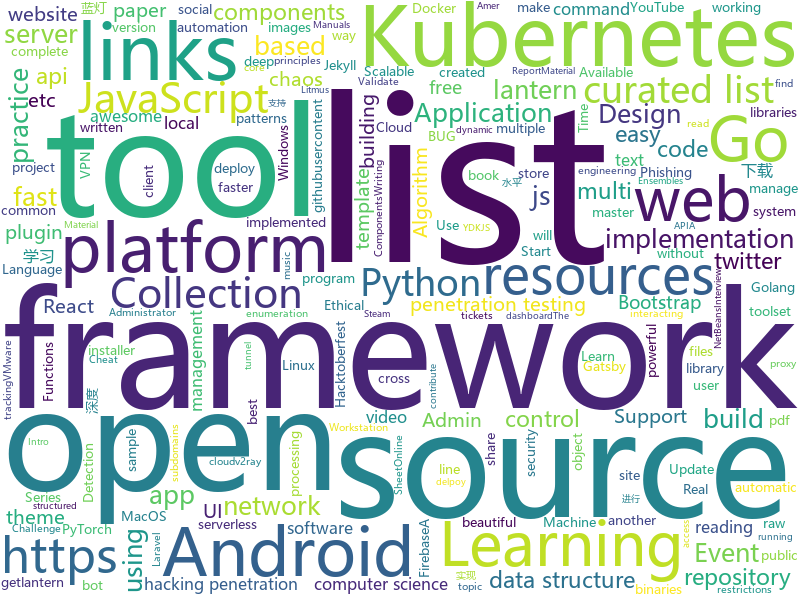

# 2019-10-07
See what the GitHub community is most excited about today.

## python
* [streamlit](https://github.com/streamlit/streamlit)(**509 stars today**): Streamlit — The fastest way to build custom ML tools
* [home-assistant](https://github.com/home-assistant/home-assistant)(**57 stars today**): 🏡Open source home automation that puts local control and privacy first
* [imagededup](https://github.com/idealo/imagededup)(**85 stars today**): 😎Finding duplicate images made easy!
* [AutoRecon](https://github.com/Tib3rius/AutoRecon)(**61 stars today**): AutoRecon is a multi-threaded network reconnaissance tool which performs automated enumeration of services.
* [litmus](https://github.com/litmuschaos/litmus)(**11 stars today**): Litmus is the toolset for Kubernetes SREs to practice chaos engineering. Use the pre-defined chaos charts, run chaos, find weaknesses in your Kubernetes systems.
* [youtube-dl](https://github.com/ytdl-org/youtube-dl)(**65 stars today**): Command-line program to download videos from YouTube.com and other video sites
* [calibre-web](https://github.com/janeczku/calibre-web)(**22 stars today**): 📚Web app for browsing, reading and downloading eBooks stored in a Calibre database
* [theHarvester](https://github.com/laramies/theHarvester)(**7 stars today**): E-mails, subdomains and names Harvester - OSINT
* [algo](https://github.com/wangzheng0822/algo)(**19 stars today**): 数据结构和算法必知必会的50个代码实现
* [rlpyt](https://github.com/astooke/rlpyt)(**31 stars today**): Reinforcement Learning in PyTorch
* [faceswap](https://github.com/deepfakes/faceswap)(**38 stars today**): Deepfakes Software For All
* [hydra](https://github.com/facebookresearch/hydra)(**114 stars today**): Hydra is a framework for elegantly configuring complex applications
* [algo](https://github.com/trailofbits/algo)(**32 stars today**): Set up a personal VPN in the cloud
* [shadowsocks](https://github.com/shadowsocks/shadowsocks)(**18 stars today**): 
* [multi-v2ray](https://github.com/Jrohy/multi-v2ray)(**32 stars today**): v2ray easy delpoy & manage tool， support multiple user & protocol manage
* [manim](https://github.com/3b1b/manim)(**17 stars today**): Animation engine for explanatory math videos
* [Towards-Realtime-MOT](https://github.com/Zhongdao/Towards-Realtime-MOT)(**30 stars today**): Joint Detection and Embedding for fast multi-object tracking
* [unlocker](https://github.com/DrDonk/unlocker)(**7 stars today**): VMware Workstation macOS
* [idapython-cheatsheet](https://github.com/inforion/idapython-cheatsheet)(**22 stars today**): Scripts and cheatsheets for IDAPython
* [JARVIS-on-Messenger](https://github.com/swapagarwal/JARVIS-on-Messenger)(**5 stars today**): 💬A community-driven python bot that aims to be as simple as possible to serve humans with their everyday tasks
* [awesome-python](https://github.com/vinta/awesome-python)(**37 stars today**): A curated list of awesome Python frameworks, libraries, software and resources
* [faster-rcnn.pytorch](https://github.com/jwyang/faster-rcnn.pytorch)(**6 stars today**): A faster pytorch implementation of faster r-cnn
* [open-event-server](https://github.com/fossasia/open-event-server)(**2 stars today**): The Open Event Organizer Server to Manage Events https://api.eventyay.com | http://open-event-api.herokuapp.com
* [Real-Time-Voice-Cloning](https://github.com/CorentinJ/Real-Time-Voice-Cloning)(**26 stars today**): Clone a voice in 5 seconds to generate arbitrary speech in real-time
* [EfficientNet-PyTorch](https://github.com/lukemelas/EfficientNet-PyTorch)(**8 stars today**): A PyTorch implementation of EfficientNet

## java
* [Anime4K](https://github.com/bloc97/Anime4K)(**372 stars today**): A High-Quality Real Time Upscaler for Anime Video
* [java-design-patterns](https://github.com/iluwatar/java-design-patterns)(**24 stars today**): Design patterns implemented in Java
* [netbeans](https://github.com/apache/netbeans)(**0 stars today**): Apache NetBeans
* [interview](https://github.com/mission-peace/interview)(**7 stars today**): Interview questions
* [strongbox](https://github.com/strongbox/strongbox)(**4 stars today**): Strongbox is an artifact repository manager.
* [user-interface-samples](https://github.com/android/user-interface-samples)(**21 stars today**): Multiple samples showing the best practices in user-interface on Android.
* [Telegram](https://github.com/DrKLO/Telegram)(**4 stars today**): Telegram for Android source
* [SkyStone](https://github.com/FIRST-Tech-Challenge/SkyStone)(**1 stars today**): FTC SDK
* [JAViewer](https://github.com/SplashCodes/JAViewer)(**3 stars today**): 更优雅的驾车体验
* [Arduino](https://github.com/arduino/Arduino)(**7 stars today**): open-source electronics prototyping platform
* [EhViewer](https://github.com/seven332/EhViewer)(**10 stars today**): [DEPRECATED] An Unofficial E-Hentai Application for Android
* [storm](https://github.com/apache/storm)(**5 stars today**): Mirror of Apache Storm
* [disruptor](https://github.com/LMAX-Exchange/disruptor)(**11 stars today**): High Performance Inter-Thread Messaging Library
* [SmartYouTubeTV](https://github.com/yuliskov/SmartYouTubeTV)(**5 stars today**): Watch YouTube videos on your TV and set-top-box with comfort
* [Algorithms](https://github.com/williamfiset/Algorithms)(**11 stars today**): A collection of algorithms
* [AndroidTutorialForBeginners](https://github.com/hussien89aa/AndroidTutorialForBeginners)(**3 stars today**): Step by step to build Android apps using Android Studio
* [material-components-android](https://github.com/material-components/material-components-android)(**16 stars today**): Modular and customizable Material Design UI components for Android
* [h2o-3](https://github.com/h2oai/h2o-3)(**5 stars today**): Open Source Fast Scalable Machine Learning Platform For Smarter Applications: Deep Learning, Gradient Boosting & XGBoost, Random Forest, Generalized Linear Modeling (Logistic Regression, Elastic Net), K-Means, PCA, Stacked Ensembles, Automatic Machine Learning (AutoML), etc.
* [fabric-carpet](https://github.com/gnembon/fabric-carpet)(**5 stars today**): Fabric Carpet
* [antlr4](https://github.com/antlr/antlr4)(**3 stars today**): ANTLR (ANother Tool for Language Recognition) is a powerful parser generator for reading, processing, executing, or translating structured text or binary files.
* [proxyee-down](https://github.com/proxyee-down-org/proxyee-down)(**7 stars today**): http下载工具，基于http代理，支持多连接分块下载
* [lc](https://github.com/SeanPrashad/lc)(**11 stars today**): A list of 160+ leetcode questions sorted by their common patterns
* [FirebaseUI-Android](https://github.com/firebase/FirebaseUI-Android)(**4 stars today**): Optimized UI components for Firebase
* [bitcoinj](https://github.com/bitcoinj/bitcoinj)(**4 stars today**): A library for working with Bitcoin
* [Skript](https://github.com/SkriptLang/Skript)(**0 stars today**): Skript is a Bukkit plugin which allows server admins to customize their server easily, but without the hassle of programming a plugin or asking/paying someone to program a plugin for them.

## unknown
* [PENTESTING-BIBLE](https://github.com/blaCCkHatHacEEkr/PENTESTING-BIBLE)(**27 stars today**): This repository was created and developed by Ammar Amer @cry__pto Only. Updates to this repository will continue to arrive until the number of links reaches 10000 links & 10000 pdf files .Learn Ethical Hacking and penetration testing .hundreds of ethical hacking & penetration testing & red team & cyber security & computer science resources.
* [linux-kernel-exploitation](https://github.com/xairy/linux-kernel-exploitation)(**24 stars today**): A bunch of links related to Linux kernel exploitation
* [expo-common-issues](https://github.com/Rocketseat/expo-common-issues)(**38 stars today**): Common issues while developing with Expo
* [computer-science](https://github.com/ossu/computer-science)(**129 stars today**): 🎓Path to a free self-taught education in Computer Science!
* [You-Dont-Know-JS](https://github.com/getify/You-Dont-Know-JS)(**114 stars today**): A book series on JavaScript. @YDKJS on twitter.
* [trackerslist](https://github.com/ngosang/trackerslist)(**38 stars today**): Updated list of public BitTorrent trackers
* [AMD_Vanilla](https://github.com/AMD-OSX/AMD_Vanilla)(**4 stars today**): Native AMD macOS via Clover KernelToPatch
* [reverse-interview](https://github.com/viraptor/reverse-interview)(**102 stars today**): Questions to ask the company during your interview
* [download](https://github.com/getlantern/download)(**11 stars today**): 蓝灯Windows下载 https://raw.githubusercontent.com/getlantern/lantern-binaries/master/lantern-installer.exe 蓝灯安卓下载 https://raw.githubusercontent.com/getlantern/lantern-binaries/master/lantern-installer.apk
* [Flexbox30](https://github.com/samanthaming/Flexbox30)(**108 stars today**): Learn Flexbox in 30 days with 30 code tidbits✨
* [coding-interview-university](https://github.com/jwasham/coding-interview-university)(**72 stars today**): A complete computer science study plan to become a software engineer.
* [deep_learning_object_detection](https://github.com/hoya012/deep_learning_object_detection)(**24 stars today**): A paper list of object detection using deep learning.
* [jgm_auto_load](https://github.com/LSC527/jgm_auto_load)(**9 stars today**): 家国梦自动卸货
* [cpp-cheat-sheet](https://github.com/gibsjose/cpp-cheat-sheet)(**22 stars today**): C++ Syntax, Data Structures, and Algorithms Cheat Sheet
* [Kubernetes-Certified-Administrator](https://github.com/walidshaari/Kubernetes-Certified-Administrator)(**2 stars today**): Online resources that will help you prepare for taking the CNCF CKA "Kubernetes Certified Administrator" Certification exam. with time, This is not likely the comprehensive up to date list - please make a pull request if there something that should be added here.
* [Machine-Learning-Session](https://github.com/shuhuai007/Machine-Learning-Session)(**17 stars today**): 
* [Awesome-Hacking-Resources](https://github.com/vitalysim/Awesome-Hacking-Resources)(**6 stars today**): A collection of hacking / penetration testing resources to make you better!
* [fancyss_history_package](https://github.com/hq450/fancyss_history_package)(**12 stars today**): 科学上网插件的离线安装包储存在这里
* [everyone-can-use-english](https://github.com/xiaolai/everyone-can-use-english)(**6 stars today**): 人人都能用英语
* [Resources-for-Beginner-Bug-Bounty-Hunters](https://github.com/nahamsec/Resources-for-Beginner-Bug-Bounty-Hunters)(**3 stars today**): A list of resources for those interested in getting started in bug bounties
* [Flutter-Course-Resources](https://github.com/londonappbrewery/Flutter-Course-Resources)(**6 stars today**): 
* [awesome-public-datasets](https://github.com/awesomedata/awesome-public-datasets)(**25 stars today**): A topic-centric list of HQ open datasets. PR ☛☛☛
* [DeepLearning-500-questions](https://github.com/scutan90/DeepLearning-500-questions)(**25 stars today**): 深度学习500问，以问答形式对常用的概率知识、线性代数、机器学习、深度学习、计算机视觉等热点问题进行阐述，以帮助自己及有需要的读者。 全书分为18个章节，50余万字。由于水平有限，书中不妥之处恳请广大读者批评指正。 未完待续............ 如有意合作，联系scutjy2015@163.com 版权所有，违权必究 Tan 2018.06
* [system_design](https://github.com/shashank88/system_design)(**5 stars today**): Preparation links and resources for system design questions
* [GNNPapers](https://github.com/thunlp/GNNPapers)(**12 stars today**): Must-read papers on graph neural networks (GNN)

## javascript
* [iptv](https://github.com/iptv-org/iptv)(**950 stars today**): Collection of 8000+ publicly available IPTV channels from all over the world
* [create-social-network](https://github.com/udilia/create-social-network)(**75 stars today**): Create Social Network by running one command. Demo: https://worldexplorer.netlify.com/
* [UnblockNeteaseMusic](https://github.com/nondanee/UnblockNeteaseMusic)(**29 stars today**): Revive unavailable songs for Netease Cloud Music
* [open-pixel-art](https://github.com/twilio-labs/open-pixel-art)(**15 stars today**): A collaborative pixel art project to teach people how to contribute to open-source
* [p5.js](https://github.com/processing/p5.js)(**12 stars today**): p5.js is a client-side JS platform that empowers artists, designers, students, and anyone to learn to code and express themselves creatively on the web. It is based on the core principles of Processing. http://twitter.com/p5xjs —
* [carbon](https://github.com/carbon-app/carbon)(**40 stars today**): 🎨Create and share beautiful images of your source code
* [nuclear](https://github.com/nukeop/nuclear)(**8 stars today**): Desktop music player for streaming from free sources
* [complete-intro-to-react-v5](https://github.com/btholt/complete-intro-to-react-v5)(**10 stars today**): The Complete Intro to React, the fifth version
* [awesome-vscode](https://github.com/viatsko/awesome-vscode)(**7 stars today**): 🎨A curated list of delightful VS Code packages and resources.
* [vue](https://github.com/vuejs/vue)(**127 stars today**): 🖖Vue.js is a progressive, incrementally-adoptable JavaScript framework for building UI on the web.
* [proposal-uuid](https://github.com/tc39/proposal-uuid)(**40 stars today**): UUID proposal for ECMAScript (Stage 1)
* [react-native](https://github.com/facebook/react-native)(**29 stars today**): A framework for building native apps with React.
* [d2-admin](https://github.com/d2-projects/d2-admin)(**32 stars today**): 🌈An elegant dashboard
* [store.gatsbyjs.org](https://github.com/gatsbyjs/store.gatsbyjs.org)(**3 stars today**): The Gatsby store for swag and other Gatsby goodies.
* [discord.js](https://github.com/discordjs/discord.js)(**6 stars today**): A powerful JavaScript library for interacting with the Discord API
* [hacktober-race](https://github.com/LukeGarrigan/hacktober-race)(**3 stars today**): A type-racing game for and about Hacktoberfest!
* [components](https://github.com/serverless/components)(**4 stars today**): An easier way to build and share serverless applications w/ the Serverless Framework -
* [javascript-algorithms](https://github.com/trekhleb/javascript-algorithms)(**39 stars today**): 📝Algorithms and data structures implemented in JavaScript with explanations and links to further readings
* [RSSHub](https://github.com/DIYgod/RSSHub)(**17 stars today**): 🍰万物皆可 RSS
* [mobx](https://github.com/mobxjs/mobx)(**15 stars today**): Simple, scalable state management.
* [graphql-engine](https://github.com/hasura/graphql-engine)(**30 stars today**): Blazing fast, instant realtime GraphQL APIs on Postgres with fine grained access control, also trigger webhooks on database events.
* [You-Dont-Know-JS](https://github.com/cezaraugusto/You-Dont-Know-JS)(**4 stars today**): 📗📒(PT-BR translation) JS Book Series.
* [renovate](https://github.com/renovatebot/renovate)(**8 stars today**): Universal dependency update automation tool that fits into your workflows.
* [awesomo](https://github.com/lk-geimfari/awesomo)(**6 stars today**): An extensive list of cool open source projects written in С, C++, Clojure, Lisp, Elixir, Erlang, Elm, Golang, Haskell, JavaScript, Lua, OCaml, Python, R, Ruby, Rust, Scala etc.
* [functions-samples](https://github.com/firebase/functions-samples)(**8 stars today**): Collection of sample apps showcasing popular use cases using Cloud Functions for Firebase

## html
* [glastoselenium](https://github.com/thomasms/glastoselenium)(**6 stars today**): A bot for booking Glastonbury tickets using selenium
* [RDR2CollectorsMap](https://github.com/jeanropke/RDR2CollectorsMap)(**5 stars today**): 
* [awesome-piracy](https://github.com/Igglybuff/awesome-piracy)(**23 stars today**): A curated list of awesome warez and piracy links
* [hugo-academic](https://github.com/gcushen/hugo-academic)(**6 stars today**): 📝The website builder for Hugo. Build and deploy a beautiful website in minutes!
* [shellphish](https://github.com/thelinuxchoice/shellphish)(**5 stars today**): Phishing Tool for 18 social media: Instagram, Facebook, Snapchat, Github, Twitter, Yahoo, Protonmail, Spotify, Netflix, Linkedin, Wordpress, Origin, Steam, Microsoft, InstaFollowers, Gitlab, Pinterest
* [fastText](https://github.com/facebookresearch/fastText)(**15 stars today**): Library for fast text representation and classification.
* [py4e](https://github.com/csev/py4e)(**4 stars today**): Web site for www.py4e.com and source to the Python 3.0 textbook
* [indigo](https://github.com/sergiokopplin/indigo)(**6 stars today**): 🍜Minimalist Jekyll Template
* [stisla](https://github.com/stisla/stisla)(**3 stars today**): Free Bootstrap Admin Template
* [ru.javascript.info](https://github.com/javascript-tutorial/ru.javascript.info)(**6 stars today**): Современный учебник JavaScript
* [HiddenEye](https://github.com/DarkSecDevelopers/HiddenEye)(**2 stars today**): Modern Phishing Tool With Advanced Functionality [ Android-Support-Available ]
* [startbootstrap-resume](https://github.com/BlackrockDigital/startbootstrap-resume)(**0 stars today**): A Bootstrap 4 resume/CV theme created by Start Bootstrap
* [open-learning-exchange.github.io](https://github.com/open-learning-exchange/open-learning-exchange.github.io)(**0 stars today**): 
* [AdminLTE](https://github.com/ColorlibHQ/AdminLTE)(**30 stars today**): AdminLTE - Free Premium Admin control Panel Theme Based On Bootstrap 3.x
* [tailwindcss](https://github.com/laravel-frontend-presets/tailwindcss)(**3 stars today**): A Tailwind CSS frontend preset for the Laravel Framework
* [pdfs](https://github.com/tpn/pdfs)(**3 stars today**): Technically-oriented PDF Collection (Papers, Specs, Decks, Manuals, etc)
* [startbootstrap-clean-blog-jekyll](https://github.com/BlackrockDigital/startbootstrap-clean-blog-jekyll)(**1 stars today**): A Jekyll version of the Clean Blog theme by Start Bootstrap
* [portainer](https://github.com/portainer/portainer)(**14 stars today**): Making Docker management easy.
* [Dism-Multi-language](https://github.com/Chuyu-Team/Dism-Multi-language)(**3 stars today**): Dism++ Multi-language Support & BUG Report
* [MatBlazor](https://github.com/SamProf/MatBlazor)(**5 stars today**): Material Design components for Blazor and Razor Components
* [blog_os](https://github.com/phil-opp/blog_os)(**9 stars today**): Writing an OS in Rust
* [computer-science-flash-cards](https://github.com/jwasham/computer-science-flash-cards)(**4 stars today**): Mini website for testing both general CS knowledge and enforce coding practice and common algorithm/data structure memorization.
* [WebFundamentals](https://github.com/google/WebFundamentals)(**13 stars today**): Best practices for modern web development
* [Santafied](https://github.com/zero-to-mastery/Santafied)(**0 stars today**): A ZTM Challenge for Hacktoberfest 2019
* [learning-area](https://github.com/mdn/learning-area)(**4 stars today**): Github repo for the MDN Learning Area.

## go
* [huskyCI](https://github.com/globocom/huskyCI)(**27 stars today**): Performing security tests inside your CI
* [clash](https://github.com/Dreamacro/clash)(**30 stars today**): A rule-based tunnel in Go.
* [sprig](https://github.com/Masterminds/sprig)(**29 stars today**): Useful template functions for Go templates.
* [ent](https://github.com/facebookincubator/ent)(**254 stars today**): An entity framework for Go
* [yay](https://github.com/Jguer/yay)(**11 stars today**): Yet another Yogurt - An AUR Helper written in Go
* [mattermost-server](https://github.com/mattermost/mattermost-server)(**17 stars today**): Open source Slack-alternative in Golang and React - Mattermost
* [inlets](https://github.com/alexellis/inlets)(**14 stars today**): Expose your local endpoints to the Internet
* [quorum](https://github.com/jpmorganchase/quorum)(**5 stars today**): A permissioned implementation of Ethereum supporting data privacy
* [go-elasticsearch](https://github.com/elastic/go-elasticsearch)(**8 stars today**): The official Go client for Elasticsearch
* [httprobe](https://github.com/tomnomnom/httprobe)(**5 stars today**): Take a list of domains and probe for working HTTP and HTTPS servers
* [caddy](https://github.com/caddyserver/caddy)(**108 stars today**): Fast, cross-platform HTTP/2 web server with automatic HTTPS
* [awesome-go](https://github.com/avelino/awesome-go)(**33 stars today**): A curated list of awesome Go frameworks, libraries and software
* [glide](https://github.com/Masterminds/glide)(**3 stars today**): Package Management for Golang
* [go-patterns](https://github.com/tmrts/go-patterns)(**12 stars today**): Curated list of Go design patterns, recipes and idioms
* [inlets-operator](https://github.com/alexellis/inlets-operator)(**34 stars today**): Get a public Kubernetes LoadBalancer for your local cluster
* [v2ray-core](https://github.com/v2ray/v2ray-core)(**46 stars today**): A platform for building proxies to bypass network restrictions.
* [cue](https://github.com/cuelang/cue)(**8 stars today**): Validate and define text-based and dynamic configuration
* [inb-go](https://github.com/insight-chain/inb-go)(**6 stars today**): Official Go implementation of the Insight Chain(INB)
* [arduino-cli](https://github.com/arduino/arduino-cli)(**3 stars today**): Arduino command line interface
* [brook](https://github.com/txthinking/brook)(**23 stars today**): Brook is a cross-platform(Linux/MacOS/Windows/Android/iOS) proxy/vpn software
* [isopod](https://github.com/cruise-automation/isopod)(**15 stars today**): An expressive DSL framework for Kubernetes configuration without YAML
* [singularity](https://github.com/sylabs/singularity)(**2 stars today**): Singularity: Application containers for Linux
* [k3s](https://github.com/rancher/k3s)(**10 stars today**): Lightweight Kubernetes. 5 less than k8s.
* [helmfile](https://github.com/roboll/helmfile)(**2 stars today**): Deploy Kubernetes Helm Charts
* [distribution](https://github.com/docker/distribution)(**3 stars today**): The Docker toolset to pack, ship, store, and deliver content

## WordCloud

