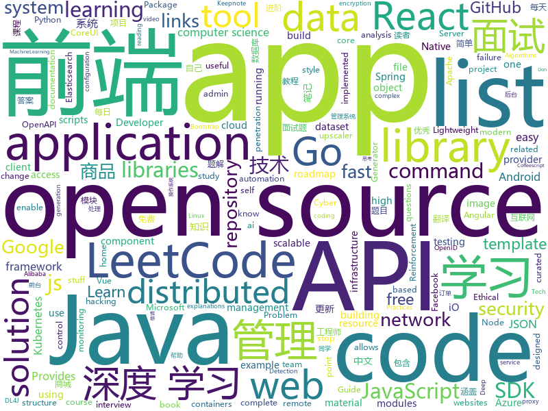

# 2019-10-09
See what the GitHub community is most excited about today.

## python
* [imagededup](https://github.com/idealo/imagededup)(**428 stars today**): 😎Finding duplicate images made easy!
* [GitHub-Chinese-Top-Charts](https://github.com/kon9chunkit/GitHub-Chinese-Top-Charts)(**493 stars today**): 🇨🇳GitHub中文排行榜，帮助你发现高分优秀中文项目、更高效地吸收国人的优秀经验成果；榜单每周更新一次，敬请关注！（最近更新于10月1日，国庆节快乐🎉）
* [python-ds](https://github.com/prabhupant/python-ds)(**86 stars today**): Repository for data structure and algorithms in Python
* [interview_internal_reference](https://github.com/0voice/interview_internal_reference)(**69 stars today**): 2019年最新总结，阿里，腾讯，百度，美团，头条等技术面试题目，以及答案，专家出题人分析汇总。
* [home-assistant](https://github.com/home-assistant/home-assistant)(**67 stars today**): 🏡Open source home automation that puts local control and privacy first
* [hydra](https://github.com/facebookresearch/hydra)(**81 stars today**): Hydra is a framework for elegantly configuring complex applications
* [demo-self-driving](https://github.com/streamlit/demo-self-driving)(**45 stars today**): Streamlit app demonstrating an image browser for the Udacity self-driving-car dataset with realtime object detection using YOLO.
* [odoo](https://github.com/odoo/odoo)(**40 stars today**): Odoo. Open Source Apps To Grow Your Business.
* [bcc](https://github.com/iovisor/bcc)(**50 stars today**): BCC - Tools for BPF-based Linux IO analysis, networking, monitoring, and more
* [pwnagotchi](https://github.com/evilsocket/pwnagotchi)(**44 stars today**): (⌐■_■) - Deep Reinforcement Learning instrumenting bettercap for WiFi pwning.
* [idapython-cheatsheet](https://github.com/inforion/idapython-cheatsheet)(**29 stars today**): Scripts and cheatsheets for IDAPython
* [video2x](https://github.com/k4yt3x/video2x)(**36 stars today**): A lossless video enlarger/video upscaler achieved with waifu2x and Anime4K.
* [Towards-Realtime-MOT](https://github.com/Zhongdao/Towards-Realtime-MOT)(**42 stars today**): Joint Detection and Embedding for fast multi-object tracking
* [d2l-zh](https://github.com/d2l-ai/d2l-zh)(**113 stars today**): 《动手学深度学习》：面向中文读者、能运行、可讨论。英文版即伯克利“深度学习导论”教材。
* [TensorNetwork](https://github.com/google/TensorNetwork)(**7 stars today**): A library for easy and efficient manipulation of tensor networks.
* [netbox](https://github.com/netbox-community/netbox)(**6 stars today**): IP address management (IPAM) and data center infrastructure management (DCIM) tool.
* [OUCML](https://github.com/OUCMachineLearning/OUCML)(**37 stars today**): 
* [meson](https://github.com/mesonbuild/meson)(**3 stars today**): The Meson Build System
* [sqlmap](https://github.com/sqlmapproject/sqlmap)(**33 stars today**): Automatic SQL injection and database takeover tool
* [googleapis](https://github.com/googleapis/googleapis)(**3 stars today**): Public interface definitions of Google APIs.
* [whapa](https://github.com/B16f00t/whapa)(**7 stars today**): WhatsApp Parser Toolset v1.14
* [gensim](https://github.com/RaRe-Technologies/gensim)(**7 stars today**): Topic Modelling for Humans
* [google-research](https://github.com/google-research/google-research)(**18 stars today**): Google AI Research
* [AiLearning](https://github.com/apachecn/AiLearning)(**45 stars today**): AiLearning: 机器学习 - MachineLearning - ML、深度学习 - DeepLearning - DL、自然语言处理 NLP
* [ray](https://github.com/ray-project/ray)(**8 stars today**): A fast and simple framework for building and running distributed applications. Ray is packaged with RLlib, a scalable reinforcement learning library, and Tune, a scalable hyperparameter tuning library.

## java
* [Anime4K](https://github.com/bloc97/Anime4K)(**702 stars today**): A High-Quality Real Time Upscaler for Anime Video
* [java-design-patterns](https://github.com/iluwatar/java-design-patterns)(**56 stars today**): Design patterns implemented in Java
* [kafka-streams-examples](https://github.com/confluentinc/kafka-streams-examples)(**3 stars today**): Demo applications and code examples for Apache Kafka's Streams API.
* [JavaGuide](https://github.com/Snailclimb/JavaGuide)(**152 stars today**): 【Java学习+面试指南】 一份涵盖大部分Java程序员所需要掌握的核心知识。
* [CS-Notes](https://github.com/CyC2018/CS-Notes)(**229 stars today**): 📚Tech Interview Guide 技术面试必备基础知识、Leetcode 题解、Java、C++、Python、后端面试、操作系统、计算机网络、系统设计
* [openapi-generator](https://github.com/OpenAPITools/openapi-generator)(**21 stars today**): OpenAPI Generator allows generation of API client libraries (SDK generation), server stubs, documentation and configuration automatically given an OpenAPI Spec (v2, v3)
* [guava](https://github.com/google/guava)(**23 stars today**): Google core libraries for Java
* [Hystrix](https://github.com/Netflix/Hystrix)(**12 stars today**): Hystrix is a latency and fault tolerance library designed to isolate points of access to remote systems, services and 3rd party libraries, stop cascading failure and enable resilience in complex distributed systems where failure is inevitable.
* [advanced-java](https://github.com/doocs/advanced-java)(**95 stars today**): 😮互联网 Java 工程师进阶知识完全扫盲：涵盖高并发、分布式、高可用、微服务等领域知识，后端同学必看，前端同学也可学习
* [react-native-fbsdk](https://github.com/facebook/react-native-fbsdk)(**2 stars today**): A React Native wrapper around the Facebook SDKs for Android and iOS. Provides access to Facebook login, sharing, graph requests, app events etc.
* [tutorials](https://github.com/eugenp/tutorials)(**29 stars today**): The "REST With Spring" Course:
* [seata](https://github.com/seata/seata)(**20 stars today**): 🔥Seata is an easy-to-use, high-performance, open source distributed transaction solution.
* [cassandra](https://github.com/apache/cassandra)(**8 stars today**): Mirror of Apache Cassandra
* [mall](https://github.com/macrozheng/mall)(**86 stars today**): mall项目是一套电商系统，包括前台商城系统及后台管理系统，基于SpringBoot+MyBatis实现。 前台商城系统包含首页门户、商品推荐、商品搜索、商品展示、购物车、订单流程、会员中心、客户服务、帮助中心等模块。 后台管理系统包含商品管理、订单管理、会员管理、促销管理、运营管理、内容管理、统计报表、财务管理、权限管理、设置等模块。
* [android-developer-roadmap](https://github.com/MindorksOpenSource/android-developer-roadmap)(**6 stars today**): Android Developer Roadmap - A complete roadmap to learn Android App Development
* [strongbox](https://github.com/strongbox/strongbox)(**6 stars today**): Strongbox is an artifact repository manager.
* [spring-in-action-5-samples](https://github.com/habuma/spring-in-action-5-samples)(**6 stars today**): Home for example code from Spring in Action 5.
* [azure-sdk-for-java](https://github.com/Azure/azure-sdk-for-java)(**1 stars today**): Microsoft Azure SDK for Java
* [spring-cloud-alibaba](https://github.com/alibaba/spring-cloud-alibaba)(**29 stars today**): Spring Cloud Alibaba provides a one-stop solution for application development for the distributed solutions of Alibaba middleware.
* [easyexcel](https://github.com/alibaba/easyexcel)(**66 stars today**): 快速、简单避免OOM的java处理Excel工具
* [LeetCodeAnimation](https://github.com/MisterBooo/LeetCodeAnimation)(**106 stars today**): Demonstrate all the questions on LeetCode in the form of animation.（用动画的形式呈现解LeetCode题目的思路）
* [Sentinel](https://github.com/alibaba/Sentinel)(**16 stars today**): A lightweight powerful flow control component enabling reliability and monitoring for microservices. (轻量级的流量控制、熔断降级 Java 库)
* [spring-boot](https://github.com/spring-projects/spring-boot)(**27 stars today**): Spring Boot
* [pulsar](https://github.com/apache/pulsar)(**9 stars today**): Apache Pulsar - distributed pub-sub messaging system
* [deeplearning4j-examples](https://github.com/eclipse/deeplearning4j-examples)(**1 stars today**): Deeplearning4j Examples (DL4J, DL4J Spark, DataVec)

## unknown
* [PENTESTING-BIBLE](https://github.com/blaCCkHatHacEEkr/PENTESTING-BIBLE)(**113 stars today**): This repository was created and developed by Ammar Amer @cry__pto Only. Updates to this repository will continue to arrive until the number of links reaches 10000 links & 10000 pdf files .Learn Ethical Hacking and penetration testing .hundreds of ethical hacking & penetration testing & red team & cyber security & computer science resources.
* [coding-interview-university](https://github.com/jwasham/coding-interview-university)(**112 stars today**): A complete computer science study plan to become a software engineer.
* [nlp-roadmap](https://github.com/graykode/nlp-roadmap)(**58 stars today**): ROADMAP(Mind Map) and KEYWORD for students those who have interest in learning NLP
* [computer-science](https://github.com/ossu/computer-science)(**552 stars today**): 🎓Path to a free self-taught education in Computer Science!
* [Flexbox30](https://github.com/samanthaming/Flexbox30)(**61 stars today**): Learn Flexbox in 30 days with 30 code tidbits✨
* [new-pac](https://github.com/Alvin9999/new-pac)(**79 stars today**): 科学/自由上网，免费ss/ssr/v2ray/goflyway账号，搭建教程
* [awesome-public-datasets](https://github.com/awesomedata/awesome-public-datasets)(**17 stars today**): A topic-centric list of HQ open datasets. PR ☛☛☛
* [OnJava8](https://github.com/LingCoder/OnJava8)(**61 stars today**): 《On Java 8》中文版，又名《Java编程思想》 第5版
* [docker-compose-elasticsearch-kibana](https://github.com/maxyermayank/docker-compose-elasticsearch-kibana)(**0 stars today**): Docker Compose for Elasticsearch and Kibana
* [eng-practices](https://github.com/google/eng-practices)(**111 stars today**): Google's Engineering Practices documentation
* [learn-regex](https://github.com/ziishaned/learn-regex)(**130 stars today**): Learn regex the easy way
* [new-grads-2020](https://github.com/cmackenzie1/new-grads-2020)(**11 stars today**): A collection of new grad roles for 2020
* [awesome-react-components](https://github.com/brillout/awesome-react-components)(**28 stars today**): Curated List of React Components & Libraries.
* [linux-kernel-exploitation](https://github.com/xairy/linux-kernel-exploitation)(**41 stars today**): A bunch of links related to Linux kernel exploitation
* [AZ-103-MicrosoftAzureAdministrator](https://github.com/MicrosoftLearning/AZ-103-MicrosoftAzureAdministrator)(**2 stars today**): AZ-103: Microsoft Azure Administrator
* [leetcode](https://github.com/grandyang/leetcode)(**6 stars today**): Provide all my solutions and explanations in Chinese for all the Leetcode coding problems.
* [ruby-style-guide](https://github.com/rubocop-hq/ruby-style-guide)(**2 stars today**): A community-driven Ruby coding style guide
* [Java-Interview](https://github.com/gzc426/Java-Interview)(**46 stars today**): Java 面试必会 直通BAT
* [rfcs](https://github.com/vuejs/rfcs)(**5 stars today**): RFCs for substantial changes / feature additions to Vue core
* [Best-websites-a-programmer-should-visit](https://github.com/sdmg15/Best-websites-a-programmer-should-visit)(**21 stars today**): 🔗Some useful websites for programmers.
* [gold-miner](https://github.com/xitu/gold-miner)(**31 stars today**): 🥇掘金翻译计划，可能是世界最大最好的英译中技术社区，最懂读者和译者的翻译平台：
* [awesome-point-cloud-analysis](https://github.com/Yochengliu/awesome-point-cloud-analysis)(**7 stars today**): A list of papers and datasets about point cloud analysis (processing)
* [shadowsocks](https://github.com/Shadowsocks-Wiki/shadowsocks)(**8 stars today**): shadowsocks.wiki
* [you-dont-know-js-ru](https://github.com/azat-io/you-dont-know-js-ru)(**1 stars today**): 📚Russian translation of "You Don't Know JS" book series
* [industry-machine-learning](https://github.com/firmai/industry-machine-learning)(**3 stars today**): A curated list of applied machine learning and data science notebooks and libraries across different industries.

## javascript
* [bustag](https://github.com/gxtrobot/bustag)(**287 stars today**): a tag and recommend system for old bus driver
* [create-social-network](https://github.com/udilia/create-social-network)(**109 stars today**): Create Social Network by running one command. Demo: https://worldexplorer.netlify.com/
* [three.js](https://github.com/mrdoob/three.js)(**44 stars today**): JavaScript 3D library.
* [javascript-algorithms](https://github.com/trekhleb/javascript-algorithms)(**55 stars today**): 📝Algorithms and data structures implemented in JavaScript with explanations and links to further readings
* [vue](https://github.com/vuejs/vue)(**168 stars today**): 🖖Vue.js is a progressive, incrementally-adoptable JavaScript framework for building UI on the web.
* [CyberChef](https://github.com/gchq/CyberChef)(**53 stars today**): The Cyber Swiss Army Knife - a web app for encryption, encoding, compression and data analysis
* [puppeteer](https://github.com/GoogleChrome/puppeteer)(**34 stars today**): Headless Chrome Node.js API
* [appium](https://github.com/appium/appium)(**6 stars today**): 📱Automation for iOS, Android, and Windows Apps.
* [strapi](https://github.com/strapi/strapi)(**60 stars today**): 🚀Open source Node.js Headless CMS to easily build customisable APIs
* [gatsby](https://github.com/gatsbyjs/gatsby)(**116 stars today**): Build blazing fast, modern apps and websites with React
* [d2-admin](https://github.com/d2-projects/d2-admin)(**102 stars today**): 🌈An elegant dashboard
* [node-mongodb-native](https://github.com/mongodb/node-mongodb-native)(**7 stars today**): Mongo DB Native NodeJS Driver
* [d3](https://github.com/d3/d3)(**27 stars today**): Bring data to life with SVG, Canvas and HTML.📊📈🎉
* [webpack](https://github.com/webpack/webpack)(**27 stars today**): A bundler for javascript and friends. Packs many modules into a few bundled assets. Code Splitting allows for loading parts of the application on demand. Through "loaders", modules can be CommonJs, AMD, ES6 modules, CSS, Images, JSON, Coffeescript, LESS, ... and your custom stuff.
* [create-react-app](https://github.com/facebook/create-react-app)(**39 stars today**): Set up a modern web app by running one command.
* [next.js](https://github.com/zeit/next.js)(**36 stars today**): The React Framework
* [bpmn-js](https://github.com/bpmn-io/bpmn-js)(**49 stars today**): A BPMN 2.0 rendering toolkit and web modeler.
* [fe-interview](https://github.com/haizlin/fe-interview)(**37 stars today**): 前端面试每日 3+1，以面试题来驱动学习，提倡每日学习与思考，每天进步一点！每天早上5点纯手工发布面试题（死磕自己，愉悦大家）
* [33-js-concepts](https://github.com/leonardomso/33-js-concepts)(**20 stars today**): 📜33 concepts every JavaScript developer should know.
* [leetcode](https://github.com/azl397985856/leetcode)(**95 stars today**): LeetCode Solutions: A Record of My Problem Solving Journey.( leetcode题解，记录自己的leetcode解题之路。)
* [Web](https://github.com/qianguyihao/Web)(**98 stars today**): 前端入门和进阶学习笔记，超详细的Web前端学习图文教程。从零开始学前端，做一名精致的前端工程师。持续更新...
* [remote-jobs](https://github.com/remoteintech/remote-jobs)(**8 stars today**): A list of semi to fully remote-friendly companies in tech.
* [500lines](https://github.com/aosabook/500lines)(**15 stars today**): 500 Lines or Less
* [react-grid-layout](https://github.com/STRML/react-grid-layout)(**8 stars today**): A draggable and resizable grid layout with responsive breakpoints, for React.
* [chinese-poetry](https://github.com/chinese-poetry/chinese-poetry)(**29 stars today**): 最全中华古诗词数据库, 唐宋两朝近一万四千古诗人, 接近5.5万首唐诗加26万宋诗. 两宋时期1564位词人，21050首词。

## html
* [livestreamer_project_ideas](https://github.com/bradtraversy/livestreamer_project_ideas)(**27 stars today**): App for viewers to suggest ideas to livestreamer in realtime
* [glastoselenium](https://github.com/thomasms/glastoselenium)(**23 stars today**): A bot for booking Glastonbury tickets using selenium
* [dragon-book-exercise-answers](https://github.com/fool2fish/dragon-book-exercise-answers)(**5 stars today**): Compilers Principles, Techniques, & Tools (purple dragon book) second edition exercise answers. 编译原理（紫龙书）第2版习题答案。
* [learning-area](https://github.com/mdn/learning-area)(**3 stars today**): Github repo for the MDN Learning Area.
* [coreui-free-bootstrap-admin-template](https://github.com/coreui/coreui-free-bootstrap-admin-template)(**7 stars today**): CoreUI is free bootstrap admin template
* [REKCARC-TSC-UHT](https://github.com/PKUanonym/REKCARC-TSC-UHT)(**15 stars today**): 清华大学计算机系课程攻略 Guidance for courses in Department of Computer Science and Technology, Tsinghua University
* [openshift-docs](https://github.com/openshift/openshift-docs)(**0 stars today**): OpenShift Documentation
* [TheHive](https://github.com/TheHive-Project/TheHive)(**7 stars today**): TheHive: a Scalable, Open Source and Free Security Incident Response Platform
* [aws-well-architected-labs](https://github.com/awslabs/aws-well-architected-labs)(**3 stars today**): Hands on labs and code to help you learn, measure, and build using architectural best practices.
* [18.06-linalg-notes](https://github.com/apachecn/18.06-linalg-notes)(**6 stars today**): MIT-18.06-线性代数-完整笔记
* [technical-books](https://github.com/doocs/technical-books)(**9 stars today**): 😆国内外互联网技术大牛们都写了哪些书籍：计算机基础、网络、前端、后端、数据库、架构、大数据、深度学习...
* [devdocs](https://github.com/magento/devdocs)(**0 stars today**): Magento Developer Documentation
* [nndl.github.io](https://github.com/nndl/nndl.github.io)(**6 stars today**): 《神经网络与深度学习》 Neural Network and Deep Learning
* [OSCPRepo](https://github.com/rewardone/OSCPRepo)(**4 stars today**): A list of commands, scripts, resources, and more that I have gathered and attempted to consolidate for use as OSCP (and more) study material. Commands in 'Usefulcommands' Keepnote. Bookmarks and reading material in 'BookmarkList' Keepnote. Reconscan in scripts folder.
* [web-moderno](https://github.com/cod3rcursos/web-moderno)(**0 stars today**): 
* [blog](https://github.com/biaochenxuying/blog)(**51 stars today**): 大前端技术为主，读书笔记、随笔、理财为辅，做个终身学习者。
* [react-naive-book](https://github.com/huzidaha/react-naive-book)(**2 stars today**): 开源、免费、专业、简单的 React.js 在线教程
* [python](https://github.com/Show-Me-the-Code/python)(**3 stars today**): Show Me the Code Python version.
* [MatBlazor](https://github.com/SamProf/MatBlazor)(**8 stars today**): Material Design components for Blazor and Razor Components
* [deeplearning_ai_books](https://github.com/fengdu78/deeplearning_ai_books)(**41 stars today**): deeplearning.ai（吴恩达老师的深度学习课程笔记及资源）
* [fastText](https://github.com/facebookresearch/fastText)(**7 stars today**): Library for fast text representation and classification.
* [styleguide](https://github.com/google/styleguide)(**31 stars today**): Style guides for Google-originated open-source projects
* [flutter-in-action](https://github.com/flutterchina/flutter-in-action)(**13 stars today**): 《Flutter实战》电子书
* [Front-end-Developer-Interview-Questions](https://github.com/h5bp/Front-end-Developer-Interview-Questions)(**12 stars today**): A list of helpful front-end related questions you can use to interview potential candidates, test yourself or completely ignore.
* [coreui-free-angular-admin-template](https://github.com/coreui/coreui-free-angular-admin-template)(**0 stars today**): CoreUI Angular is free Angular 2+ admin template based on Bootstrap 4

## go
* [env](https://github.com/caarlos0/env)(**80 stars today**): Simple lib to parse environment variables to structs
* [sprig](https://github.com/Masterminds/sprig)(**18 stars today**): Useful template functions for Go templates.
* [beats](https://github.com/elastic/beats)(**6 stars today**): 🐠Beats - Lightweight shippers for Elasticsearch & Logstash
* [mc](https://github.com/minio/mc)(**8 stars today**): MinIO Client is a replacement for ls, cp, mkdir, diff and rsync commands for filesystems and object storage.
* [argo](https://github.com/argoproj/argo)(**7 stars today**): Argo Workflows: Get stuff done with Kubernetes.
* [charts](https://github.com/helm/charts)(**17 stars today**): Curated applications for Kubernetes
* [flagger](https://github.com/weaveworks/flagger)(**6 stars today**): Progressive delivery Kubernetes operator (Canary, A/B Testing and Blue/Green deployments)
* [oauth2_proxy](https://github.com/pusher/oauth2_proxy)(**21 stars today**): A reverse proxy that provides authentication with Google, Github or other providers. #Hacktoberfest
* [terraform](https://github.com/hashicorp/terraform)(**18 stars today**): Terraform enables you to safely and predictably create, change, and improve infrastructure. It is an open source tool that codifies APIs into declarative configuration files that can be shared amongst team members, treated as code, edited, reviewed, and versioned.
* [flannel](https://github.com/coreos/flannel)(**5 stars today**): flannel is a network fabric for containers, designed for Kubernetes
* [go-elasticsearch](https://github.com/elastic/go-elasticsearch)(**15 stars today**): The official Go client for Elasticsearch
* [zerolog](https://github.com/rs/zerolog)(**8 stars today**): Zero Allocation JSON Logger
* [govalidator](https://github.com/asaskevich/govalidator)(**9 stars today**): [Go] Package of validators and sanitizers for strings, numerics, slices and structs
* [helm](https://github.com/helm/helm)(**24 stars today**): The Kubernetes Package Manager
* [hydra](https://github.com/ory/hydra)(**12 stars today**): OAuth2 Server and OpenID Certified™ OpenID Connect Provider written in Go - cloud native, security-first, open source API security for your infrastructure. SDKs for any language.
* [go-github](https://github.com/google/go-github)(**7 stars today**): Go library for accessing the GitHub API
* [terraform-provider-azurerm](https://github.com/terraform-providers/terraform-provider-azurerm)(**7 stars today**): Terraform provider for Azure Resource Manager
* [fsnotify](https://github.com/fsnotify/fsnotify)(**1 stars today**): Cross-platform file system notifications for Go.
* [operator-sdk](https://github.com/operator-framework/operator-sdk)(**6 stars today**): SDK for building Kubernetes applications. Provides high level APIs, useful abstractions, and project scaffolding.
* [ent](https://github.com/facebookincubator/ent)(**339 stars today**): An entity framework for Go
* [opentracing-go](https://github.com/opentracing/opentracing-go)(**7 stars today**): OpenTracing API for Go
* [vault](https://github.com/hashicorp/vault)(**5 stars today**): A tool for secrets management, encryption as a service, and privileged access management
* [singularity](https://github.com/sylabs/singularity)(**4 stars today**): Singularity: Application containers for Linux
* [grpc-gateway](https://github.com/grpc-ecosystem/grpc-gateway)(**13 stars today**): gRPC to JSON proxy generator following the gRPC HTTP spec
* [jwt-go](https://github.com/dgrijalva/jwt-go)(**4 stars today**): Golang implementation of JSON Web Tokens (JWT)

## WordCloud

