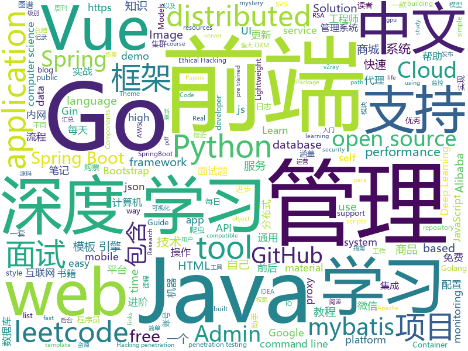

# 2019-10-10
See what the GitHub community is most excited about today.

## python
* [imagededup](https://github.com/idealo/imagededup)(**336 stars today**): 😎Finding duplicate images made easy!
* [GitHub-Chinese-Top-Charts](https://github.com/kon9chunkit/GitHub-Chinese-Top-Charts)(**1,252 stars today**): 🇨🇳GitHub中文排行榜，帮助你发现高分优秀中文项目、更高效地吸收国人的优秀经验成果；榜单每周更新一次，敬请关注！（最近更新于10月9日，上班快乐🎉）
* [interview_internal_reference](https://github.com/0voice/interview_internal_reference)(**210 stars today**): 2019年最新总结，阿里，腾讯，百度，美团，头条等技术面试题目，以及答案，专家出题人分析汇总。
* [pytorch-CycleGAN-and-pix2pix](https://github.com/junyanz/pytorch-CycleGAN-and-pix2pix)(**13 stars today**): Image-to-Image Translation in PyTorch
* [12306](https://github.com/testerSunshine/12306)(**105 stars today**): 12306智能刷票，订票
* [data-science-ipython-notebooks](https://github.com/donnemartin/data-science-ipython-notebooks)(**25 stars today**): Data science Python notebooks: Deep learning (TensorFlow, Theano, Caffe, Keras), scikit-learn, Kaggle, big data (Spark, Hadoop MapReduce, HDFS), matplotlib, pandas, NumPy, SciPy, Python essentials, AWS, and various command lines.
* [OUCML](https://github.com/OUCMachineLearning/OUCML)(**35 stars today**): 
* [Python-100-Days](https://github.com/ZiniuLu/Python-100-Days)(**20 stars today**): 出处：https://github.com/jackfrued/Python-100-Days.git
* [DeepFaceLab](https://github.com/iperov/DeepFaceLab)(**26 stars today**): DeepFaceLab is a tool that utilizes machine learning to replace faces in videos. Includes prebuilt ready to work standalone Windows 7,8,10 binary (look readme.md).
* [tvm](https://github.com/dmlc/tvm)(**9 stars today**): Open deep learning compiler stack for cpu, gpu and specialized accelerators
* [albert_zh](https://github.com/brightmart/albert_zh)(**42 stars today**): A LITE BERT FOR SELF-SUPERVISED LEARNING OF LANGUAGE REPRESENTATIONS, 海量中文预训练ALBERT模型
* [bigchaindb](https://github.com/bigchaindb/bigchaindb)(**18 stars today**): Meet BigchainDB. The blockchain database.
* [pysot](https://github.com/STVIR/pysot)(**8 stars today**): SenseTime Research platform for single object tracking, implementing algorithms like SiamRPN and SiamMask.
* [uiautomator2](https://github.com/openatx/uiautomator2)(**12 stars today**): Android Uiautomator2 Python Wrapper
* [XX-Net](https://github.com/XX-net/XX-Net)(**10 stars today**): a web proxy tool
* [mmdetection](https://github.com/open-mmlab/mmdetection)(**24 stars today**): Open MMLab Detection Toolbox and Benchmark
* [demo-self-driving](https://github.com/streamlit/demo-self-driving)(**8 stars today**): Streamlit app demonstrating an image browser for the Udacity self-driving-car dataset with realtime object detection using YOLO.
* [HelloGitHub](https://github.com/521xueweihan/HelloGitHub)(**35 stars today**): Find pearls on open-source seashore 分享 GitHub 上有趣、入门级的开源项目
* [d2l-zh](https://github.com/d2l-ai/d2l-zh)(**85 stars today**): 《动手学深度学习》：面向中文读者、能运行、可讨论。英文版即伯克利“深度学习导论”教材。
* [py12306](https://github.com/pjialin/py12306)(**51 stars today**): 🚂12306 购票助手，支持集群，多账号，多任务购票以及 Web 页面管理
* [bcc](https://github.com/iovisor/bcc)(**23 stars today**): BCC - Tools for BPF-based Linux IO analysis, networking, monitoring, and more
* [macadmin-scripts](https://github.com/munki/macadmin-scripts)(**5 stars today**): Scripts of possible interest to macOS admins
* [proxy_pool](https://github.com/jhao104/proxy_pool)(**24 stars today**): Python爬虫代理IP池(proxy pool)
* [models](https://github.com/PaddlePaddle/models)(**15 stars today**): Pre-trained and Reproduced Deep Learning Models （『飞桨』官方模型库，包含多种学术前沿和工业场景验证的深度学习模型）
* [skillbox-chat](https://github.com/manchenkoff/skillbox-chat)(**7 stars today**): Skillbox demo application for the Python course

## java
* [JavaGuide](https://github.com/Snailclimb/JavaGuide)(**165 stars today**): 【Java学习+面试指南】 一份涵盖大部分Java程序员所需要掌握的核心知识。
* [Anime4K](https://github.com/bloc97/Anime4K)(**776 stars today**): A High-Quality Real Time Upscaler for Anime Video
* [skywalking](https://github.com/apache/skywalking)(**18 stars today**): APM, Application Performance Monitoring System
* [CS-Notes](https://github.com/CyC2018/CS-Notes)(**167 stars today**): 📚Tech Interview Guide 技术面试必备基础知识、Leetcode 题解、Java、C++、Python、后端面试、操作系统、计算机网络、系统设计
* [mall](https://github.com/macrozheng/mall)(**88 stars today**): mall项目是一套电商系统，包括前台商城系统及后台管理系统，基于SpringBoot+MyBatis实现。 前台商城系统包含首页门户、商品推荐、商品搜索、商品展示、购物车、订单流程、会员中心、客户服务、帮助中心等模块。 后台管理系统包含商品管理、订单管理、会员管理、促销管理、运营管理、内容管理、统计报表、财务管理、权限管理、设置等模块。
* [easyexcel](https://github.com/alibaba/easyexcel)(**48 stars today**): 快速、简单避免OOM的java处理Excel工具
* [spring-analysis](https://github.com/seaswalker/spring-analysis)(**47 stars today**): Spring源码阅读
* [LeetCodeAnimation](https://github.com/MisterBooo/LeetCodeAnimation)(**110 stars today**): Demonstrate all the questions on LeetCode in the form of animation.（用动画的形式呈现解LeetCode题目的思路）
* [xxl-job](https://github.com/xuxueli/xxl-job)(**21 stars today**): A lightweight distributed task scheduling framework.（分布式任务调度平台XXL-JOB）
* [apollo](https://github.com/ctripcorp/apollo)(**28 stars today**): Apollo（阿波罗）是携程框架部门研发的分布式配置中心，能够集中化管理应用不同环境、不同集群的配置，配置修改后能够实时推送到应用端，并且具备规范的权限、流程治理等特性，适用于微服务配置管理场景。
* [spring-cloud-alibaba](https://github.com/alibaba/spring-cloud-alibaba)(**53 stars today**): Spring Cloud Alibaba provides a one-stop solution for application development for the distributed solutions of Alibaba middleware.
* [toBeTopJavaer](https://github.com/hollischuang/toBeTopJavaer)(**24 stars today**): To Be Top Javaer - Java工程师成神之路
* [SpringCloudLearning](https://github.com/forezp/SpringCloudLearning)(**26 stars today**): 《史上最简单的Spring Cloud教程源码》
* [vhr](https://github.com/lenve/vhr)(**51 stars today**): 微人事是一个前后端分离的人力资源管理系统，项目采用SpringBoot+Vue开发。
* [halo](https://github.com/halo-dev/halo)(**29 stars today**): ✍ Halo 一款现代化的个人独立博客系统
* [advanced-java](https://github.com/doocs/advanced-java)(**91 stars today**): 😮互联网 Java 工程师进阶知识完全扫盲：涵盖高并发、分布式、高可用、微服务等领域知识，后端同学必看，前端同学也可学习
* [arthas](https://github.com/alibaba/arthas)(**27 stars today**): Alibaba Java Diagnostic Tool Arthas/Alibaba Java诊断利器Arthas
* [nacos](https://github.com/alibaba/nacos)(**18 stars today**): an easy-to-use dynamic service discovery, configuration and service management platform for building cloud native applications.
* [tutorials](https://github.com/eugenp/tutorials)(**39 stars today**): The "REST With Spring" Course:
* [flink](https://github.com/apache/flink)(**12 stars today**): Apache Flink
* [spring-boot-demo](https://github.com/xkcoding/spring-boot-demo)(**42 stars today**): spring boot demo 是一个用来深度学习并实战 spring boot 的项目，目前总共包含 63 个集成demo，已经完成 52 个。 该项目已成功集成 actuator(监控)、admin(可视化监控)、logback(日志)、aopLog(通过AOP记录web请求日志)、统一异常处理(json级别和页面级别)、freemarker(模板引擎)、thymeleaf(模板引擎)、Beetl(模板引擎)、Enjoy(模板引擎)、JdbcTemplate(通用JDBC操作数据库)、JPA(强大的ORM框架)、mybatis(强大的ORM框架)、通用Mapper(快速操作Mybatis)、PageHelper(通用的Mybatis分页插件)、mybatis-plus(快速操作M…
* [dubbo-spring-boot-project](https://github.com/apache/dubbo-spring-boot-project)(**7 stars today**): Spring Boot Project for Apache Dubbo
* [litemall](https://github.com/linlinjava/litemall)(**24 stars today**): 又一个小商城。litemall = Spring Boot后端 + Vue管理员前端 + 微信小程序用户前端 + Vue用户移动端
* [paascloud-master](https://github.com/paascloud/paascloud-master)(**35 stars today**): spring cloud + vue + oAuth2.0全家桶实战，前后端分离模拟商城，完整的购物流程、后端运营平台，可以实现快速搭建企业级微服务项目。支持微信登录等三方登录。
* [incubator-shardingsphere](https://github.com/apache/incubator-shardingsphere)(**12 stars today**): Distributed database middleware

## unknown
* [DeepLearning-500-questions](https://github.com/scutan90/DeepLearning-500-questions)(**86 stars today**): 深度学习500问，以问答形式对常用的概率知识、线性代数、机器学习、深度学习、计算机视觉等热点问题进行阐述，以帮助自己及有需要的读者。 全书分为18个章节，50余万字。由于水平有限，书中不妥之处恳请广大读者批评指正。 未完待续............ 如有意合作，联系scutjy2015@163.com 版权所有，违权必究 Tan 2018.06
* [computer-science](https://github.com/ossu/computer-science)(**554 stars today**): 🎓Path to a free self-taught education in Computer Science!
* [PLMpapers](https://github.com/thunlp/PLMpapers)(**130 stars today**): Must-read Papers on pre-trained language models.
* [awesome-wechat-weapp](https://github.com/justjavac/awesome-wechat-weapp)(**104 stars today**): 微信小程序开发资源汇总💯
* [PENTESTING-BIBLE](https://github.com/blaCCkHatHacEEkr/PENTESTING-BIBLE)(**142 stars today**): This repository was created and developed by Ammar Amer @cry__pto Only. Updates to this repository will continue to arrive until the number of links reaches 10000 links & 10000 pdf files .Learn Ethical Hacking and penetration testing .hundreds of ethical hacking & penetration testing & red team & cyber security & computer science resources.
* [IntelliJ-IDEA-Tutorial](https://github.com/judasn/IntelliJ-IDEA-Tutorial)(**32 stars today**): IntelliJ IDEA 简体中文专题教程
* [free-programming-books-zh_CN](https://github.com/justjavac/free-programming-books-zh_CN)(**91 stars today**): 📚免费的计算机编程类中文书籍，欢迎投稿
* [awesome-spider](https://github.com/facert/awesome-spider)(**37 stars today**): 爬虫集合
* [resilience-engineering](https://github.com/lorin/resilience-engineering)(**72 stars today**): Resilience engineering papers
* [OnJava8](https://github.com/LingCoder/OnJava8)(**39 stars today**): 《On Java 8》中文版，又名《Java编程思想》 第5版
* [new-pac](https://github.com/Alvin9999/new-pac)(**82 stars today**): 科学/自由上网，免费ss/ssr/v2ray/goflyway账号，搭建教程
* [SpringBoot-Learning](https://github.com/dyc87112/SpringBoot-Learning)(**18 stars today**): Spring Boot基础教程，Spring Boot 2.x版本连载中！！！
* [free-books](https://github.com/ruanyf/free-books)(**38 stars today**): 互联网上的免费书籍
* [awesome](https://github.com/sindresorhus/awesome)(**85 stars today**): 😎Awesome lists about all kinds of interesting topics
* [955.WLB](https://github.com/formulahendry/955.WLB)(**20 stars today**): 955 不加班的公司名单 - 工作 955，work–life balance (工作与生活的平衡)
* [learn-regex](https://github.com/ziishaned/learn-regex)(**121 stars today**): Learn regex the easy way
* [architect-awesome](https://github.com/xingshaocheng/architect-awesome)(**61 stars today**): 后端架构师技术图谱
* [nrol-39-logo](https://github.com/palewire/nrol-39-logo)(**41 stars today**): A vector PDF of the official mission logo of NROL-39
* [sql-mysteries](https://github.com/NUKnightLab/sql-mysteries)(**61 stars today**): Inspired by @veltman's command-line mystery, use SQL to research clues and find out whodunit!
* [clmystery](https://github.com/veltman/clmystery)(**34 stars today**): A command-line murder mystery
* [weekly](https://github.com/ruanyf/weekly)(**26 stars today**): 科技爱好者周刊，每周五发布
* [weekly](https://github.com/dt-fe/weekly)(**14 stars today**): 前端精读周刊
* [pumpkin-book](https://github.com/datawhalechina/pumpkin-book)(**52 stars today**): 《机器学习》（西瓜书）公式推导解析，在线阅读地址：https://datawhalechina.github.io/pumpkin-book
* [coding-interview-university](https://github.com/jwasham/coding-interview-university)(**124 stars today**): A complete computer science study plan to become a software engineer.
* [vagas](https://github.com/frontendbr/vagas)(**10 stars today**): 🔬Espaço para divulgação de vagas para front-enders.

## javascript
* [bustag](https://github.com/gxtrobot/bustag)(**154 stars today**): a tag and recommend system for old bus driver
* [vue](https://github.com/vuejs/vue)(**129 stars today**): 🖖Vue.js is a progressive, incrementally-adoptable JavaScript framework for building UI on the web.
* [XtreamUI](https://github.com/xtreamui/XtreamUI)(**9 stars today**): Xtream Codes 2.93 - Admin Interface
* [d2-admin](https://github.com/d2-projects/d2-admin)(**55 stars today**): 🌈An elegant dashboard
* [leetcode](https://github.com/azl397985856/leetcode)(**100 stars today**): LeetCode Solutions: A Record of My Problem Solving Journey.( leetcode题解，记录自己的leetcode解题之路。)
* [Daily-Interview-Question](https://github.com/Advanced-Frontend/Daily-Interview-Question)(**36 stars today**): 我是木易杨，公众号「高级前端进阶」作者，每天搞定一道前端大厂面试题，祝大家天天进步，一年后会看到不一样的自己。
* [UnblockNeteaseMusic](https://github.com/nondanee/UnblockNeteaseMusic)(**38 stars today**): Revive unavailable songs for Netease Cloud Music
* [fe-interview](https://github.com/haizlin/fe-interview)(**39 stars today**): 前端面试每日 3+1，以面试题来驱动学习，提倡每日学习与思考，每天进步一点！每天早上5点纯手工发布面试题（死磕自己，愉悦大家）
* [google-access-helper](https://github.com/haotian-wang/google-access-helper)(**35 stars today**): 谷歌访问助手破解版
* [vuepress](https://github.com/vuejs/vuepress)(**12 stars today**): 📝Minimalistic Vue-powered static site generator
* [tech-interview-handbook](https://github.com/yangshun/tech-interview-handbook)(**57 stars today**): 💯Materials to help you rock your next coding interview
* [serverless](https://github.com/serverless/serverless)(**11 stars today**): Serverless Framework – Build web, mobile and IoT applications with serverless architectures using AWS Lambda, Azure Functions, Google CloudFunctions & more! –
* [Web](https://github.com/qianguyihao/Web)(**81 stars today**): 前端入门和进阶学习笔记，超详细的Web前端学习图文教程。从零开始学前端，做一名精致的前端工程师。持续更新...
* [NeteaseCloudMusicApi](https://github.com/Binaryify/NeteaseCloudMusicApi)(**26 stars today**): 网易云音乐 Node.js API service
* [vue-cli](https://github.com/vuejs/vue-cli)(**19 stars today**): 🛠️Standard Tooling for Vue.js Development
* [mini-tokyo-3d](https://github.com/nagix/mini-tokyo-3d)(**210 stars today**): A real-time 3D digital map of Tokyo's public transport system
* [appwrite](https://github.com/appwrite/appwrite)(**32 stars today**): End to end backend server for frontend and mobile developers.👩‍💻👨‍💻
* [yapi](https://github.com/YMFE/yapi)(**19 stars today**): YApi 是一个可本地部署的、打通前后端及QA的、可视化的接口管理平台
* [d3](https://github.com/d3/d3)(**38 stars today**): Bring data to life with SVG, Canvas and HTML.📊📈🎉
* [chinese-poetry](https://github.com/chinese-poetry/chinese-poetry)(**47 stars today**): 最全中华古诗词数据库, 唐宋两朝近一万四千古诗人, 接近5.5万首唐诗加26万宋诗. 两宋时期1564位词人，21050首词。
* [vant](https://github.com/youzan/vant)(**21 stars today**): Lightweight Mobile UI Components built on Vue
* [mui](https://github.com/dcloudio/mui)(**7 stars today**): 最接近原生APP体验的高性能框架
* [Face-Detection-JavaScript](https://github.com/WebDevSimplified/Face-Detection-JavaScript)(**14 stars today**): 
* [tabler](https://github.com/tabler/tabler)(**34 stars today**): Tabler is free and open-source HTML Dashboard UI Kit built on Bootstrap
* [reveal.js](https://github.com/hakimel/reveal.js)(**29 stars today**): The HTML Presentation Framework

## html
* [AdminLTE](https://github.com/ColorlibHQ/AdminLTE)(**51 stars today**): AdminLTE - Free Premium Admin control Panel Theme Based On Bootstrap 3.x
* [deeplearning_ai_books](https://github.com/fengdu78/deeplearning_ai_books)(**26 stars today**): deeplearning.ai（吴恩达老师的深度学习课程笔记及资源）
* [django-DefectDojo](https://github.com/DefectDojo/django-DefectDojo)(**1 stars today**): DefectDojo is an open-source application vulnerability correlation and security orchestration tool.
* [qiubaiying.github.io](https://github.com/qiubaiying/qiubaiying.github.io)(**2 stars today**): BY Blog ->
* [nndl.github.io](https://github.com/nndl/nndl.github.io)(**14 stars today**): 《神经网络与深度学习》 Neural Network and Deep Learning
* [coreui-free-bootstrap-admin-template](https://github.com/coreui/coreui-free-bootstrap-admin-template)(**4 stars today**): CoreUI is free bootstrap admin template
* [docs](https://github.com/knative/docs)(**4 stars today**): User documentation for Knative components
* [CLRS](https://github.com/walkccc/CLRS)(**4 stars today**): 📚Solutions to Introduction to Algorithms Third Edition
* [gentelella](https://github.com/ColorlibHQ/gentelella)(**19 stars today**): Free Bootstrap 3 Admin Template
* [blog](https://github.com/biaochenxuying/blog)(**23 stars today**): 大前端技术为主，读书笔记、随笔、理财为辅，做个终身学习者。
* [SuperTinyIcons](https://github.com/edent/SuperTinyIcons)(**1 stars today**): Under 1KB each! Super Tiny Icons are miniscule SVG versions of your favourite website and app logos
* [livestreamer_project_ideas](https://github.com/bradtraversy/livestreamer_project_ideas)(**5 stars today**): App for viewers to suggest ideas to livestreamer in realtime
* [OSCPRepo](https://github.com/rewardone/OSCPRepo)(**13 stars today**): A list of commands, scripts, resources, and more that I have gathered and attempted to consolidate for use as OSCP (and more) study material. Commands in 'Usefulcommands' Keepnote. Bookmarks and reading material in 'BookmarkList' Keepnote. Reconscan in scripts folder.
* [webKnowledge](https://github.com/huyaocode/webKnowledge)(**15 stars today**): 前端面试知识点总结
* [styleguide](https://github.com/google/styleguide)(**16 stars today**): Style guides for Google-originated open-source projects
* [blog_os](https://github.com/phil-opp/blog_os)(**4 stars today**): Writing an OS in Rust
* [flutter-in-action](https://github.com/flutterchina/flutter-in-action)(**12 stars today**): 《Flutter实战》电子书
* [Coursera-ML-AndrewNg-Notes](https://github.com/fengdu78/Coursera-ML-AndrewNg-Notes)(**56 stars today**): 吴恩达老师的机器学习课程个人笔记
* [jsrsasign](https://github.com/kjur/jsrsasign)(**1 stars today**): The 'jsrsasign' (RSA-Sign JavaScript Library) is an opensource free cryptography library supporting RSA/RSAPSS/ECDSA/DSA signing/validation, ASN.1, PKCS#1/5/8 private/public key, X.509 certificate, CRL, OCSP, CMS SignedData, TimeStamp, CAdES JSON Web Signature/Token in pure JavaScript.
* [skill-map](https://github.com/TeamStuQ/skill-map)(**26 stars today**): 程序员技能图谱
* [hugo-coder](https://github.com/luizdepra/hugo-coder)(**5 stars today**): A minimalist blog theme for hugo.
* [manual](https://github.com/v2ray/manual)(**5 stars today**): Source code for https://www.v2ray.com/
* [technical-books](https://github.com/doocs/technical-books)(**13 stars today**): 😆国内外互联网技术大牛们都写了哪些书籍：计算机基础、网络、前端、后端、数据库、架构、大数据、深度学习...
* [github-markdown-css](https://github.com/sindresorhus/github-markdown-css)(**2 stars today**): The minimal amount of CSS to replicate the GitHub Markdown style
* [Cerberus](https://github.com/TedGoas/Cerberus)(**3 stars today**): A few simple, but solid patterns for responsive HTML email templates and newsletters. Even in Outlook and Gmail.

## go
* [muon](https://github.com/ImVexed/muon)(**200 stars today**): GPU based Electron on a diet
* [go-admin](https://github.com/chenhg5/go-admin)(**76 stars today**): a dataviz tool for golang developer which supports most framework
* [env](https://github.com/caarlos0/env)(**100 stars today**): Simple lib to parse environment variables to structs
* [rancher](https://github.com/rancher/rancher)(**12 stars today**): Complete container management platform
* [go](https://github.com/json-iterator/go)(**9 stars today**): A high-performance 100% compatible drop-in replacement of "encoding/json"
* [frp](https://github.com/fatedier/frp)(**36 stars today**): A fast reverse proxy to help you expose a local server behind a NAT or firewall to the internet.
* [tidb](https://github.com/pingcap/tidb)(**20 stars today**): TiDB is an open source distributed HTAP database compatible with the MySQL protocol
* [datadog-agent](https://github.com/DataDog/datadog-agent)(**1 stars today**): Datadog Agent
* [go](https://github.com/golang/go)(**72 stars today**): The Go programming language
* [age](https://github.com/FiloSottile/age)(**28 stars today**): [ALPHA STATE] A simple, secure and modern encryption tool with small explicit keys, no config options, and UNIX-style composability.
* [BaiduPCS-Go](https://github.com/iikira/BaiduPCS-Go)(**72 stars today**): 百度网盘客户端 - Go语言编写
* [grpc-go](https://github.com/grpc/grpc-go)(**10 stars today**): The Go language implementation of gRPC. HTTP/2 based RPC
* [dgraph](https://github.com/dgraph-io/dgraph)(**9 stars today**): Fast, Distributed Graph DB
* [kubesphere](https://github.com/kubesphere/kubesphere)(**19 stars today**): Easy-to-use Production Ready Container Platform
* [nps](https://github.com/cnlh/nps)(**30 stars today**): 一款轻量级、功能强大的内网穿透代理服务器。支持tcp、udp流量转发，支持内网http代理、内网socks5代理，同时支持snappy压缩、站点保护、加密传输、多路复用、header修改等。支持web图形化管理，集成多用户模式。
* [the-way-to-go_ZH_CN](https://github.com/unknwon/the-way-to-go_ZH_CN)(**31 stars today**): 《The Way to Go》中文译本，中文正式名《Go 入门指南》
* [protobuf](https://github.com/golang/protobuf)(**11 stars today**): Go support for Google's protocol buffers
* [kratos](https://github.com/bilibili/kratos)(**16 stars today**): Kratos是bilibili开源的一套Go微服务框架，包含大量微服务相关框架及工具。
* [go-gin-example](https://github.com/EDDYCJY/go-gin-example)(**7 stars today**): An example of gin
* [govalidator](https://github.com/asaskevich/govalidator)(**9 stars today**): [Go] Package of validators and sanitizers for strings, numerics, slices and structs
* [opentracing-go](https://github.com/opentracing/opentracing-go)(**7 stars today**): OpenTracing API for Go
* [prometheus](https://github.com/prometheus/prometheus)(**25 stars today**): The Prometheus monitoring system and time series database.
* [gin](https://github.com/gin-gonic/gin)(**31 stars today**): Gin is a HTTP web framework written in Go (Golang). It features a Martini-like API with much better performance -- up to 40 times faster. If you need smashing performance, get yourself some Gin.
* [fasthttp](https://github.com/valyala/fasthttp)(**18 stars today**): Fast HTTP package for Go. Tuned for high performance. Zero memory allocations in hot paths. Up to 10x faster than net/http
* [protobuf](https://github.com/gogo/protobuf)(**5 stars today**): Protocol Buffers for Go with Gadgets

## WordCloud

