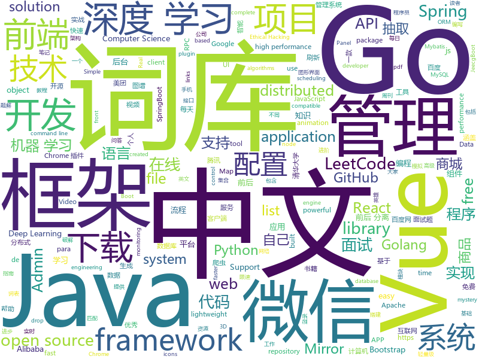

# 2019-10-11
See what the GitHub community is most excited about today.

## python
* [interview_internal_reference](https://github.com/0voice/interview_internal_reference)(**331 stars today**): 2019年最新总结，阿里，腾讯，百度，美团，头条等技术面试题目，以及答案，专家出题人分析汇总。
* [GitHub-Chinese-Top-Charts](https://github.com/kon9chunkit/GitHub-Chinese-Top-Charts)(**1,630 stars today**): 🇨🇳GitHub中文排行榜，帮助你发现高分优秀中文项目、更高效地吸收国人的优秀经验成果；榜单每周更新一次，敬请关注！（最近更新于10月9日，上班快乐🎉）
* [12306](https://github.com/testerSunshine/12306)(**218 stars today**): 12306智能刷票，订票
* [d2l-zh](https://github.com/d2l-ai/d2l-zh)(**108 stars today**): 《动手学深度学习》：面向中文读者、能运行、可讨论。英文版即伯克利“深度学习导论”教材。
* [python-ds](https://github.com/prabhupant/python-ds)(**100 stars today**): Repository for data structure and algorithms in Python
* [dgl](https://github.com/dmlc/dgl)(**23 stars today**): Python package built to ease deep learning on graph, on top of existing DL frameworks.
* [funNLP](https://github.com/fighting41love/funNLP)(**66 stars today**): 中英文敏感词、语言检测、中外手机/电话归属地/运营商查询、名字推断性别、手机号抽取、身份证抽取、邮箱抽取、中日文人名库、中文缩写库、拆字词典、词汇情感值、停用词、反动词表、暴恐词表、繁简体转换、英文模拟中文发音、汪峰歌词生成器、职业名称词库、同义词库、反义词库、否定词库、汽车品牌词库、汽车零件词库、连续英文切割、各种中文词向量、公司名字大全、古诗词库、IT词库、财经词库、成语词库、地名词库、历史名人词库、诗词词库、医学词库、饮食词库、法律词库、汽车词库、动物词库、中文聊天语料、中文谣言数据、百度中文问答数据集、句子相似度匹配算法集合、bert资源、文本生成&摘要相关工具、cocoNLP信息抽取工具、国内电话号码正则匹配、清华大学XLORE:中英文跨语言百科知识图谱、清华大学人工智能技术…
* [tvm](https://github.com/dmlc/tvm)(**14 stars today**): Open deep learning compiler stack for cpu, gpu and specialized accelerators
* [imagededup](https://github.com/idealo/imagededup)(**243 stars today**): 😎Finding duplicate images made easy!
* [google-research](https://github.com/google-research/google-research)(**20 stars today**): Google AI Research
* [proxy_pool](https://github.com/jhao104/proxy_pool)(**15 stars today**): Python爬虫代理IP池(proxy pool)
* [python-spider](https://github.com/Jack-Cherish/python-spider)(**28 stars today**): 🌈Python3网络爬虫实战：VIP视频破解助手；GEETEST验证码破解；小说、动漫下载；手机APP爬取；财务报表入库；火车票抢票；抖音APP视频下载；百万英雄辅助；网易云音乐下载；B站视频和弹幕下载；京东晒单图下载
* [manim](https://github.com/3b1b/manim)(**36 stars today**): Animation engine for explanatory math videos
* [Algorithm_Interview_Notes-Chinese](https://github.com/imhuay/Algorithm_Interview_Notes-Chinese)(**69 stars today**): 2018/2019/校招/春招/秋招/算法/机器学习(Machine Learning)/深度学习(Deep Learning)/自然语言处理(NLP)/C/C++/Python/面试笔记
* [ChromeAppHeroes](https://github.com/zhaoolee/ChromeAppHeroes)(**33 stars today**): 🌈谷粒-Chrome插件英雄榜, 为优秀的Chrome插件写一本中文说明书, 让Chrome插件英雄们造福人类~ ChromePluginHeroes, Write a Chinese manual for the excellent Chrome plugin, let the Chrome plugin heroes benefit the human~
* [30-seconds-of-python](https://github.com/30-seconds/30-seconds-of-python)(**64 stars today**): A curated collection of useful Python snippets that you can understand in 30 seconds or less.
* [unlocker](https://github.com/DrDonk/unlocker)(**18 stars today**): VMware Workstation macOS
* [AiLearning](https://github.com/apachecn/AiLearning)(**67 stars today**): AiLearning: 机器学习 - MachineLearning - ML、深度学习 - DeepLearning - DL、自然语言处理 NLP
* [HelloGitHub](https://github.com/521xueweihan/HelloGitHub)(**31 stars today**): Find pearls on open-source seashore 分享 GitHub 上有趣、入门级的开源项目
* [Towards-Realtime-MOT](https://github.com/Zhongdao/Towards-Realtime-MOT)(**35 stars today**): Joint Detection and Embedding for fast multi-object tracking
* [maskrcnn-benchmark](https://github.com/facebookresearch/maskrcnn-benchmark)(**20 stars today**): Fast, modular reference implementation of Instance Segmentation and Object Detection algorithms in PyTorch.
* [pytorch_geometric](https://github.com/rusty1s/pytorch_geometric)(**15 stars today**): Geometric Deep Learning Extension Library for PyTorch
* [ItChat](https://github.com/littlecodersh/ItChat)(**14 stars today**): A complete and graceful API for Wechat. 微信个人号接口、微信机器人及命令行微信，三十行即可自定义个人号机器人。
* [aiohttp](https://github.com/aio-libs/aiohttp)(**9 stars today**): Asynchronous HTTP client/server framework for asyncio and Python
* [models](https://github.com/tensorflow/models)(**43 stars today**): Models and examples built with TensorFlow

## java
* [JavaGuide](https://github.com/Snailclimb/JavaGuide)(**306 stars today**): 【Java学习+面试指南】 一份涵盖大部分Java程序员所需要掌握的核心知识。
* [advanced-java](https://github.com/doocs/advanced-java)(**92 stars today**): 😮互联网 Java 工程师进阶知识完全扫盲：涵盖高并发、分布式、高可用、微服务等领域知识，后端同学必看，前端同学也可学习
* [Anime4K](https://github.com/bloc97/Anime4K)(**742 stars today**): A High-Quality Real Time Upscaler for Anime Video
* [jeecg-boot](https://github.com/zhangdaiscott/jeecg-boot)(**26 stars today**): 一款基于代码生成器的JAVA快速开发平台！采用最新技术，前后端分离架构：SpringBoot 2.x，Ant Design&Vue，Mybatis，Shiro，JWT。强大的代码生成器让前后端代码一键生成，无需写任何代码，绝对是全栈开发福音！！ JeecgBoot的宗旨是提高UI能力的同时,降低前后分离的开发成本，JeecgBoot还独创在线开发模式，No代码概念，一系列在线智能开发：在线配置表单、在线配置报表、在线设计流程等等。
* [mall](https://github.com/macrozheng/mall)(**134 stars today**): mall项目是一套电商系统，包括前台商城系统及后台管理系统，基于SpringBoot+MyBatis实现。 前台商城系统包含首页门户、商品推荐、商品搜索、商品展示、购物车、订单流程、会员中心、客户服务、帮助中心等模块。 后台管理系统包含商品管理、订单管理、会员管理、促销管理、运营管理、内容管理、统计报表、财务管理、权限管理、设置等模块。
* [CS-Notes](https://github.com/CyC2018/CS-Notes)(**218 stars today**): 📚Tech Interview Guide 技术面试必备基础知识、Leetcode 题解、Java、C++、Python、后端面试、操作系统、计算机网络、系统设计
* [skywalking](https://github.com/apache/skywalking)(**48 stars today**): APM, Application Performance Monitoring System
* [LeetCodeAnimation](https://github.com/MisterBooo/LeetCodeAnimation)(**162 stars today**): Demonstrate all the questions on LeetCode in the form of animation.（用动画的形式呈现解LeetCode题目的思路）
* [spring-cloud-alibaba](https://github.com/alibaba/spring-cloud-alibaba)(**31 stars today**): Spring Cloud Alibaba provides a one-stop solution for application development for the distributed solutions of Alibaba middleware.
* [rocketmq-externals](https://github.com/apache/rocketmq-externals)(**6 stars today**): Mirror of Apache RocketMQ (Incubating)
* [spring-analysis](https://github.com/seaswalker/spring-analysis)(**51 stars today**): Spring源码阅读
* [Sentinel](https://github.com/alibaba/Sentinel)(**17 stars today**): A lightweight powerful flow control component enabling reliability and monitoring for microservices. (轻量级的流量控制、熔断降级 Java 库)
* [nifi](https://github.com/apache/nifi)(**4 stars today**): Mirror of Apache NiFi
* [redisson](https://github.com/redisson/redisson)(**9 stars today**): Redisson - Redis Java client with features of In-Memory Data Grid. Supports over 30 objects and services: Set, Multimap, SortedSet, Map, List, Queue, Deque, Semaphore, Lock, AtomicLong, Map Reduce, Publish / Subscribe, Bloom filter, Spring Cache, Tomcat, Scheduler, JCache API, Hibernate, RPC.
* [flink](https://github.com/apache/flink)(**26 stars today**): Apache Flink
* [vhr](https://github.com/lenve/vhr)(**39 stars today**): 微人事是一个前后端分离的人力资源管理系统，项目采用SpringBoot+Vue开发。
* [paascloud-master](https://github.com/paascloud/paascloud-master)(**28 stars today**): spring cloud + vue + oAuth2.0全家桶实战，前后端分离模拟商城，完整的购物流程、后端运营平台，可以实现快速搭建企业级微服务项目。支持微信登录等三方登录。
* [apollo](https://github.com/ctripcorp/apollo)(**37 stars today**): Apollo（阿波罗）是携程框架部门研发的分布式配置中心，能够集中化管理应用不同环境、不同集群的配置，配置修改后能够实时推送到应用端，并且具备规范的权限、流程治理等特性，适用于微服务配置管理场景。
* [arthas](https://github.com/alibaba/arthas)(**32 stars today**): Alibaba Java Diagnostic Tool Arthas/Alibaba Java诊断利器Arthas
* [elasticsearch](https://github.com/elastic/elasticsearch)(**31 stars today**): Open Source, Distributed, RESTful Search Engine
* [canal](https://github.com/alibaba/canal)(**24 stars today**): 阿里巴巴 MySQL binlog 增量订阅&消费组件
* [SmartRefreshLayout](https://github.com/scwang90/SmartRefreshLayout)(**13 stars today**): 🔥下拉刷新、上拉加载、二级刷新、淘宝二楼、RefreshLayout、OverScroll，Android智能下拉刷新框架，支持越界回弹、越界拖动，具有极强的扩展性，集成了几十种炫酷的Header和 Footer。
* [seata](https://github.com/seata/seata)(**19 stars today**): 🔥Seata is an easy-to-use, high-performance, open source distributed transaction solution.
* [xxl-job](https://github.com/xuxueli/xxl-job)(**21 stars today**): A lightweight distributed task scheduling framework.（分布式任务调度平台XXL-JOB）
* [cat](https://github.com/dianping/cat)(**13 stars today**): CAT 作为服务端项目基础组件，提供了 Java, C/C++, Node.js, Python, Go 等多语言客户端，已经在美团点评的基础架构中间件框架（MVC框架，RPC框架，数据库框架，缓存框架等，消息队列，配置系统等）深度集成，为美团点评各业务线提供系统丰富的性能指标、健康状况、实时告警等。

## unknown
* [DeepLearning-500-questions](https://github.com/scutan90/DeepLearning-500-questions)(**104 stars today**): 深度学习500问，以问答形式对常用的概率知识、线性代数、机器学习、深度学习、计算机视觉等热点问题进行阐述，以帮助自己及有需要的读者。 全书分为18个章节，50余万字。由于水平有限，书中不妥之处恳请广大读者批评指正。 未完待续............ 如有意合作，联系scutjy2015@163.com 版权所有，违权必究 Tan 2018.06
* [computer-science](https://github.com/ossu/computer-science)(**346 stars today**): 🎓Path to a free self-taught education in Computer Science!
* [PLMpapers](https://github.com/thunlp/PLMpapers)(**77 stars today**): Must-read Papers on pre-trained language models.
* [awesome-wechat-weapp](https://github.com/justjavac/awesome-wechat-weapp)(**98 stars today**): 微信小程序开发资源汇总💯
* [PENTESTING-BIBLE](https://github.com/blaCCkHatHacEEkr/PENTESTING-BIBLE)(**117 stars today**): This repository was created and developed by Ammar Amer @cry__pto Only. Updates to this repository will continue to arrive until the number of links reaches 10000 links & 10000 pdf files .Learn Ethical Hacking and penetration testing .hundreds of ethical hacking & penetration testing & red team & cyber security & computer science resources.
* [IntelliJ-IDEA-Tutorial](https://github.com/judasn/IntelliJ-IDEA-Tutorial)(**14 stars today**): IntelliJ IDEA 简体中文专题教程
* [free-programming-books-zh_CN](https://github.com/justjavac/free-programming-books-zh_CN)(**93 stars today**): 📚免费的计算机编程类中文书籍，欢迎投稿
* [awesome-spider](https://github.com/facert/awesome-spider)(**31 stars today**): 爬虫集合
* [resilience-engineering](https://github.com/lorin/resilience-engineering)(**16 stars today**): Resilience engineering papers
* [OnJava8](https://github.com/LingCoder/OnJava8)(**23 stars today**): 《On Java 8》中文版，又名《Java编程思想》 第5版
* [new-pac](https://github.com/Alvin9999/new-pac)(**70 stars today**): 科学/自由上网，免费ss/ssr/v2ray/goflyway账号，搭建教程
* [SpringBoot-Learning](https://github.com/dyc87112/SpringBoot-Learning)(**13 stars today**): Spring Boot基础教程，Spring Boot 2.x版本连载中！！！
* [free-books](https://github.com/ruanyf/free-books)(**27 stars today**): 互联网上的免费书籍
* [awesome](https://github.com/sindresorhus/awesome)(**85 stars today**): 😎Awesome lists about all kinds of interesting topics
* [955.WLB](https://github.com/formulahendry/955.WLB)(**16 stars today**): 955 不加班的公司名单 - 工作 955，work–life balance (工作与生活的平衡)
* [learn-regex](https://github.com/ziishaned/learn-regex)(**111 stars today**): Learn regex the easy way
* [architect-awesome](https://github.com/xingshaocheng/architect-awesome)(**62 stars today**): 后端架构师技术图谱
* [nrol-39-logo](https://github.com/palewire/nrol-39-logo)(**179 stars today**): A vector PDF of the official mission logo of NROL-39
* [sql-mysteries](https://github.com/NUKnightLab/sql-mysteries)(**44 stars today**): Inspired by @veltman's command-line mystery, use SQL to research clues and find out whodunit!
* [clmystery](https://github.com/veltman/clmystery)(**16 stars today**): A command-line murder mystery
* [weekly](https://github.com/ruanyf/weekly)(**38 stars today**): 科技爱好者周刊，每周五发布
* [weekly](https://github.com/dt-fe/weekly)(**19 stars today**): 前端精读周刊
* [pumpkin-book](https://github.com/datawhalechina/pumpkin-book)(**30 stars today**): 《机器学习》（西瓜书）公式推导解析，在线阅读地址：https://datawhalechina.github.io/pumpkin-book
* [coding-interview-university](https://github.com/jwasham/coding-interview-university)(**62 stars today**): A complete computer science study plan to become a software engineer.
* [vagas](https://github.com/frontendbr/vagas)(**7 stars today**): 🔬Espaço para divulgação de vagas para front-enders.

## javascript
* [fe-interview](https://github.com/haizlin/fe-interview)(**63 stars today**): 前端面试每日 3+1，以面试题来驱动学习，提倡每日学习与思考，每天进步一点！每天早上5点纯手工发布面试题（死磕自己，愉悦大家）
* [Daily-Interview-Question](https://github.com/Advanced-Frontend/Daily-Interview-Question)(**70 stars today**): 我是木易杨，公众号「高级前端进阶」作者，每天搞定一道前端大厂面试题，祝大家天天进步，一年后会看到不一样的自己。
* [mini-tokyo-3d](https://github.com/nagix/mini-tokyo-3d)(**80 stars today**): A real-time 3D digital map of Tokyo's public transport system
* [vue](https://github.com/vuejs/vue)(**130 stars today**): 🖖Vue.js is a progressive, incrementally-adoptable JavaScript framework for building UI on the web.
* [leetcode](https://github.com/azl397985856/leetcode)(**98 stars today**): LeetCode Solutions: A Record of My Problem Solving Journey.( leetcode题解，记录自己的leetcode解题之路。)
* [XtreamUI](https://github.com/xtreamui/XtreamUI)(**7 stars today**): Xtream Codes 2.93 - Admin Interface
* [wangEditor](https://github.com/wangfupeng1988/wangEditor)(**10 stars today**): wangEditor —— 轻量级web富文本框
* [miniprogram-demo](https://github.com/wechat-miniprogram/miniprogram-demo)(**12 stars today**): 微信小程序组件 / API / 云开发示例
* [wechat-app-mall](https://github.com/EastWorld/wechat-app-mall)(**8 stars today**): 微信小程序商城，微信小程序微店
* [Sortable](https://github.com/SortableJS/Sortable)(**12 stars today**): Sortable — is a JavaScript library for reorderable drag-and-drop lists on modern browsers and touch devices. No jQuery required. Supports Meteor, AngularJS, React, Polymer, Vue, Ember, Knockout and any CSS library, e.g. Bootstrap.
* [taro](https://github.com/NervJS/taro)(**30 stars today**): 多端统一开发框架，支持用 React 的开发方式编写一次代码，生成能运行在微信/百度/支付宝/字节跳动/ QQ 小程序、快应用、H5、React Native 等的应用。 https://taro.jd.com/
* [bustag](https://github.com/gxtrobot/bustag)(**72 stars today**): a tag and recommend system for old bus driver
* [TIMSDK](https://github.com/tencentyun/TIMSDK)(**6 stars today**): 腾讯云即时通信 IM 服务，国内下载镜像：
* [chinese-poetry](https://github.com/chinese-poetry/chinese-poetry)(**61 stars today**): 最全中华古诗词数据库, 唐宋两朝近一万四千古诗人, 接近5.5万首唐诗加26万宋诗. 两宋时期1564位词人，21050首词。
* [handsontable](https://github.com/handsontable/handsontable)(**10 stars today**): Handsontable - JavaScript/HTML5 Data Grid Component with Spreadsheet Look & Feel. Available for React, Vue and Angular.
* [video.js](https://github.com/videojs/video.js)(**12 stars today**): Video.js - open source HTML5 & Flash video player
* [semana-omnistack-9](https://github.com/Rocketseat/semana-omnistack-9)(**10 stars today**): Código do projeto produzido durante a Semana OmniStack 9.0
* [baidu-netdisk-downloaderx](https://github.com/b3log/baidu-netdisk-downloaderx)(**119 stars today**): ⚡️一款图形界面的百度网盘不限速下载器，支持 Windows、Linux 和 Mac。
* [Vue.NetCore](https://github.com/cq-panda/Vue.NetCore)(**45 stars today**): .NetCore+Vue，前后端后离，支持前后端业务代码扩展的快速开发框架，Vol.Vue为前端项目，Vue.Net后台项目
* [yapi](https://github.com/YMFE/yapi)(**26 stars today**): YApi 是一个可本地部署的、打通前后端及QA的、可视化的接口管理平台
* [Face-Detection-JavaScript](https://github.com/WebDevSimplified/Face-Detection-JavaScript)(**16 stars today**): 
* [incubator-echarts](https://github.com/apache/incubator-echarts)(**27 stars today**): A powerful, interactive charting and visualization library for browser
* [vant-weapp](https://github.com/youzan/vant-weapp)(**13 stars today**): 轻量、可靠的小程序 UI 组件库
* [umi](https://github.com/umijs/umi)(**12 stars today**): 🌋Pluggable enterprise-level react application framework.
* [node-elm](https://github.com/bailicangdu/node-elm)(**15 stars today**): 基于 node.js + Mongodb 构建的后台系统

## html
* [free-for-dev](https://github.com/ripienaar/free-for-dev)(**22 stars today**): A list of SaaS, PaaS and IaaS offerings that have free tiers of interest to devops and infradev
* [Coursera-ML-AndrewNg-Notes](https://github.com/fengdu78/Coursera-ML-AndrewNg-Notes)(**53 stars today**): 吴恩达老师的机器学习课程个人笔记
* [gentelella](https://github.com/ColorlibHQ/gentelella)(**12 stars today**): Free Bootstrap 3 Admin Template
* [AdminLTE](https://github.com/ColorlibHQ/AdminLTE)(**31 stars today**): AdminLTE - Free Premium Admin control Panel Theme Based On Bootstrap 3.x
* [WebFundamentals](https://github.com/google/WebFundamentals)(**20 stars today**): Best practices for modern web development
* [flutter-in-action](https://github.com/flutterchina/flutter-in-action)(**8 stars today**): 《Flutter实战》电子书
* [glTF](https://github.com/KhronosGroup/glTF)(**4 stars today**): glTF – Runtime 3D Asset Delivery
* [REKCARC-TSC-UHT](https://github.com/PKUanonym/REKCARC-TSC-UHT)(**13 stars today**): 清华大学计算机系课程攻略 Guidance for courses in Department of Computer Science and Technology, Tsinghua University
* [ng-alain](https://github.com/ng-alain/ng-alain)(**1 stars today**): NG-ZORRO admin panel front-end framework (netlify mirror https://netlify.ng-alain.com/)
* [books](https://github.com/Thinkgamer/books)(**3 stars today**): 技术资料分享
* [skill-map](https://github.com/TeamStuQ/skill-map)(**16 stars today**): 程序员技能图谱
* [jsdom-dom-challenge](https://github.com/learn-co-curriculum/jsdom-dom-challenge)(**0 stars today**): 
* [coexisting-vue-microfrontends](https://github.com/joeldenning/coexisting-vue-microfrontends)(**1 stars today**): A repo showing separate vue apps coexisting as microfrontends with single-spa
* [qcloud-documents](https://github.com/tencentyun/qcloud-documents)(**1 stars today**): 腾讯云官方文档 使用Markdown自动构建
* [web-moderno](https://github.com/cod3rcursos/web-moderno)(**2 stars today**): 
* [nndl.github.io](https://github.com/nndl/nndl.github.io)(**8 stars today**): 《神经网络与深度学习》 Neural Network and Deep Learning
* [simple-icons](https://github.com/simple-icons/simple-icons)(**14 stars today**): SVG icons for popular brands
* [technical-books](https://github.com/doocs/technical-books)(**9 stars today**): 😆国内外互联网技术大牛们都写了哪些书籍：计算机基础、网络、前端、后端、数据库、架构、大数据、深度学习...
* [coding-interview](https://github.com/doocs/coding-interview)(**4 stars today**): 😀代码面试题集，包括剑指 Offer、编程之美等
* [hyperblog](https://github.com/freddier/hyperblog)(**4 stars today**): Un blog increíble para el curso de Git y Github de Platzi
* [styleguide](https://github.com/google/styleguide)(**19 stars today**): Style guides for Google-originated open-source projects
* [startbootstrap-sb-admin-2](https://github.com/BlackrockDigital/startbootstrap-sb-admin-2)(**6 stars today**): A free, open source, Bootstrap admin theme created by Start Bootstrap
* [kryo](https://github.com/EsotericSoftware/kryo)(**0 stars today**): Java binary serialization and cloning: fast, efficient, automatic
* [django-DefectDojo](https://github.com/DefectDojo/django-DefectDojo)(**0 stars today**): DefectDojo is an open-source application vulnerability correlation and security orchestration tool.
* [SVG-Loaders](https://github.com/SamHerbert/SVG-Loaders)(**8 stars today**): Loading icons and small animations built with pure SVG.

## go
* [beats](https://github.com/elastic/beats)(**11 stars today**): 🐠Beats - Lightweight shippers for Elasticsearch & Logstash
* [gin](https://github.com/gin-gonic/gin)(**36 stars today**): Gin is a HTTP web framework written in Go (Golang). It features a Martini-like API with much better performance -- up to 40 times faster. If you need smashing performance, get yourself some Gin.
* [pan-light](https://github.com/peterq/pan-light)(**48 stars today**): 百度网盘不限速客户端, golang + qt5, 跨平台图形界面
* [advanced-go-programming-book](https://github.com/chai2010/advanced-go-programming-book)(**17 stars today**): 📚《Go语言高级编程》开源图书，涵盖CGO、Go汇编语言、RPC实现、Protobuf插件实现、Web框架实现、分布式系统等高阶主题(完稿)
* [go-admin](https://github.com/chenhg5/go-admin)(**111 stars today**): a dataviz tool for golang developer which supports most framework
* [go](https://github.com/json-iterator/go)(**16 stars today**): A high-performance 100% compatible drop-in replacement of "encoding/json"
* [muon](https://github.com/ImVexed/muon)(**167 stars today**): GPU based Electron on a diet
* [go-elasticsearch](https://github.com/elastic/go-elasticsearch)(**9 stars today**): The official Go client for Elasticsearch
* [vitess](https://github.com/vitessio/vitess)(**13 stars today**): Vitess is a database clustering system for horizontal scaling of MySQL.
* [go](https://github.com/golang/go)(**50 stars today**): The Go programming language
* [gorm](https://github.com/jinzhu/gorm)(**17 stars today**): The fantastic ORM library for Golang, aims to be developer friendly
* [sqlboiler](https://github.com/volatiletech/sqlboiler)(**10 stars today**): Generate a Go ORM tailored to your database schema.
* [env](https://github.com/caarlos0/env)(**30 stars today**): Simple lib to parse environment variables to structs
* [fasthttp](https://github.com/valyala/fasthttp)(**14 stars today**): Fast HTTP package for Go. Tuned for high performance. Zero memory allocations in hot paths. Up to 10x faster than net/http
* [protobuf](https://github.com/golang/protobuf)(**17 stars today**): Go support for Google's protocol buffers
* [excelize](https://github.com/360EntSecGroup-Skylar/excelize)(**32 stars today**): Golang library for reading and writing Microsoft Excel™ (XLSX) files.
* [kubernetes](https://github.com/kubernetes/kubernetes)(**42 stars today**): Production-Grade Container Scheduling and Management
* [the-way-to-go_ZH_CN](https://github.com/unknwon/the-way-to-go_ZH_CN)(**38 stars today**): 《The Way to Go》中文译本，中文正式名《Go 入门指南》
* [seaweedfs](https://github.com/chrislusf/seaweedfs)(**6 stars today**): SeaweedFS is a simple and highly scalable distributed file system. There are two objectives: to store billions of files! to serve the files fast! SeaweedFS implements an object store with O(1) disk seek and an optional Filer with POSIX interface, supporting S3 API, Rack-Aware Erasure Coding for warm storage, FUSE mount, Hadoop compatible, WebDAV.
* [govalidator](https://github.com/asaskevich/govalidator)(**9 stars today**): [Go] Package of validators and sanitizers for strings, numerics, slices and structs
* [BaiduPCS-Go](https://github.com/iikira/BaiduPCS-Go)(**55 stars today**): 百度网盘客户端 - Go语言编写
* [cert-manager](https://github.com/jetstack/cert-manager)(**15 stars today**): Automatically provision and manage TLS certificates in Kubernetes
* [crypto](https://github.com/golang/crypto)(**4 stars today**): [mirror] Go supplementary cryptography libraries
* [charts](https://github.com/helm/charts)(**20 stars today**): Curated applications for Kubernetes
* [chaosblade](https://github.com/chaosblade-io/chaosblade)(**6 stars today**): An easy to use and powerful chaos engineering experiment toolkit.（阿里巴巴开源的一款简单易用、功能强大的混沌实验注入工具）

## WordCloud

