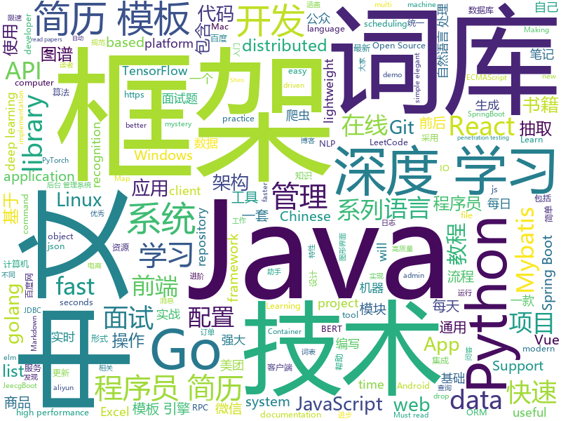

# 2019-10-12
See what the GitHub community is most excited about today.

## python
* [GitHub-Chinese-Top-Charts](https://github.com/kon9chunkit/GitHub-Chinese-Top-Charts)(**1,188 stars today**): 🇨🇳GitHub中文排行榜，帮助你发现高分优秀中文项目、更高效地吸收国人的优秀经验成果；榜单每周更新一次，敬请关注！（最近更新于10月9日，上班快乐🎉）
* [face_recognition](https://github.com/ageitgey/face_recognition)(**39 stars today**): The world's simplest facial recognition api for Python and the command line
* [seq2seq-couplet](https://github.com/wb14123/seq2seq-couplet)(**101 stars today**): Play couplet with seq2seq model. 用深度学习对对联。
* [interview_internal_reference](https://github.com/0voice/interview_internal_reference)(**404 stars today**): 2019年最新总结，阿里，腾讯，百度，美团，头条等技术面试题目，以及答案，专家出题人分析汇总。
* [torchbeast](https://github.com/facebookresearch/torchbeast)(**16 stars today**): A PyTorch Platform for Distributed RL
* [30-seconds-of-python](https://github.com/30-seconds/30-seconds-of-python)(**31 stars today**): A curated collection of useful Python snippets that you can understand in 30 seconds or less.
* [12306](https://github.com/testerSunshine/12306)(**77 stars today**): 12306智能刷票，订票
* [Towards-Realtime-MOT](https://github.com/Zhongdao/Towards-Realtime-MOT)(**26 stars today**): Joint Detection and Embedding for fast multi-object tracking
* [d2l-zh](https://github.com/d2l-ai/d2l-zh)(**73 stars today**): 《动手学深度学习》：面向中文读者、能运行、可讨论。英文版即伯克利“深度学习导论”教材。
* [tensorflow-handbook](https://github.com/snowkylin/tensorflow-handbook)(**165 stars today**): 简单粗暴 TensorFlow 2.0 | A Concise Handbook of TensorFlow 2.0
* [tvm](https://github.com/dmlc/tvm)(**9 stars today**): Open deep learning compiler stack for cpu, gpu and specialized accelerators
* [Algorithm_Interview_Notes-Chinese](https://github.com/imhuay/Algorithm_Interview_Notes-Chinese)(**44 stars today**): 2018/2019/校招/春招/秋招/算法/机器学习(Machine Learning)/深度学习(Deep Learning)/自然语言处理(NLP)/C/C++/Python/面试笔记
* [AiLearning](https://github.com/apachecn/AiLearning)(**47 stars today**): AiLearning: 机器学习 - MachineLearning - ML、深度学习 - DeepLearning - DL、自然语言处理 NLP
* [funNLP](https://github.com/fighting41love/funNLP)(**50 stars today**): 中英文敏感词、语言检测、中外手机/电话归属地/运营商查询、名字推断性别、手机号抽取、身份证抽取、邮箱抽取、中日文人名库、中文缩写库、拆字词典、词汇情感值、停用词、反动词表、暴恐词表、繁简体转换、英文模拟中文发音、汪峰歌词生成器、职业名称词库、同义词库、反义词库、否定词库、汽车品牌词库、汽车零件词库、连续英文切割、各种中文词向量、公司名字大全、古诗词库、IT词库、财经词库、成语词库、地名词库、历史名人词库、诗词词库、医学词库、饮食词库、法律词库、汽车词库、动物词库、中文聊天语料、中文谣言数据、百度中文问答数据集、句子相似度匹配算法集合、bert资源、文本生成&摘要相关工具、cocoNLP信息抽取工具、国内电话号码正则匹配、清华大学XLORE:中英文跨语言百科知识图谱、清华大学人工智能技术…
* [CornerNet](https://github.com/princeton-vl/CornerNet)(**1 stars today**): 
* [Python](https://github.com/injetlee/Python)(**10 stars today**): Python脚本。模拟登录知乎， 爬虫，操作excel，微信公众号，远程开机
* [tensorflow_practice](https://github.com/princewen/tensorflow_practice)(**9 stars today**): tensorflow实战练习，包括强化学习、推荐系统、nlp等
* [deep-text-recognition-benchmark](https://github.com/clovaai/deep-text-recognition-benchmark)(**10 stars today**): Text recognition (optical character recognition) with deep learning methods.
* [maskrcnn-benchmark](https://github.com/facebookresearch/maskrcnn-benchmark)(**14 stars today**): Fast, modular reference implementation of Instance Segmentation and Object Detection algorithms in PyTorch.
* [EverydayWechat](https://github.com/sfyc23/EverydayWechat)(**13 stars today**): 微信助手：1.每日定时给好友发送定制消息。2.机器人自动回复好友。3.群助手功能（例如：查询垃圾分类、天气、日历、电影实时票房、快递物流、PM2.5等）
* [camelot](https://github.com/camelot-dev/camelot)(**25 stars today**): A Python library to extract tabular data from PDFs
* [Chinese-BERT-wwm](https://github.com/ymcui/Chinese-BERT-wwm)(**12 stars today**): Pre-Training with Whole Word Masking for Chinese BERT（中文BERT-wwm预训练模型）
* [amazon-redshift-utils](https://github.com/awslabs/amazon-redshift-utils)(**0 stars today**): Amazon Redshift Utils contains utilities, scripts and view which are useful in a Redshift environment
* [proxy_pool](https://github.com/jhao104/proxy_pool)(**20 stars today**): Python爬虫代理IP池(proxy pool)
* [bcc](https://github.com/iovisor/bcc)(**25 stars today**): BCC - Tools for BPF-based Linux IO analysis, networking, monitoring, and more

## java
* [JavaGuide](https://github.com/Snailclimb/JavaGuide)(**204 stars today**): 【Java学习+面试指南】 一份涵盖大部分Java程序员所需要掌握的核心知识。
* [apollo](https://github.com/ctripcorp/apollo)(**28 stars today**): Apollo（阿波罗）是携程框架部门研发的分布式配置中心，能够集中化管理应用不同环境、不同集群的配置，配置修改后能够实时推送到应用端，并且具备规范的权限、流程治理等特性，适用于微服务配置管理场景。
* [easyexcel](https://github.com/alibaba/easyexcel)(**44 stars today**): 快速、简单避免OOM的java处理Excel工具
* [spring-boot-examples](https://github.com/ityouknow/spring-boot-examples)(**30 stars today**): about learning Spring Boot via examples. Spring Boot 教程、技术栈示例代码，快速简单上手教程。
* [netty](https://github.com/netty/netty)(**30 stars today**): Netty project - an event-driven asynchronous network application framework
* [mall](https://github.com/macrozheng/mall)(**148 stars today**): mall项目是一套电商系统，包括前台商城系统及后台管理系统，基于SpringBoot+MyBatis实现。 前台商城系统包含首页门户、商品推荐、商品搜索、商品展示、购物车、订单流程、会员中心、客户服务、帮助中心等模块。 后台管理系统包含商品管理、订单管理、会员管理、促销管理、运营管理、内容管理、统计报表、财务管理、权限管理、设置等模块。
* [CS-Notes](https://github.com/CyC2018/CS-Notes)(**148 stars today**): 📚Tech Interview Guide 技术面试必备基础知识、Leetcode 题解、Java、C++、Python、后端面试、操作系统、计算机网络、系统设计
* [HanLP](https://github.com/hankcs/HanLP)(**27 stars today**): 自然语言处理 中文分词 词性标注 命名实体识别 依存句法分析 新词发现 关键词短语提取 自动摘要 文本分类聚类 拼音简繁
* [fastjson](https://github.com/alibaba/fastjson)(**15 stars today**): 🚄A fast JSON parser/generator for Java. (Aliyun Data Lake Analytics https://www.aliyun.com/product/datalakeanalytics powered by fastjson )
* [incubator-dolphinscheduler](https://github.com/apache/incubator-dolphinscheduler)(**18 stars today**): Dolphin Scheduler is a distributed and easy-to-expand visual DAG workflow scheduling system, dedicated to solving the complex dependencies in data processing, making the scheduling system out of the box for data processing.
* [dubbo](https://github.com/apache/dubbo)(**24 stars today**): Apache Dubbo is a high-performance, java based, open source RPC framework.
* [spring-boot](https://github.com/spring-projects/spring-boot)(**39 stars today**): Spring Boot
* [spring-boot-demo](https://github.com/xkcoding/spring-boot-demo)(**25 stars today**): spring boot demo 是一个用来深度学习并实战 spring boot 的项目，目前总共包含 63 个集成demo，已经完成 52 个。 该项目已成功集成 actuator(监控)、admin(可视化监控)、logback(日志)、aopLog(通过AOP记录web请求日志)、统一异常处理(json级别和页面级别)、freemarker(模板引擎)、thymeleaf(模板引擎)、Beetl(模板引擎)、Enjoy(模板引擎)、JdbcTemplate(通用JDBC操作数据库)、JPA(强大的ORM框架)、mybatis(强大的ORM框架)、通用Mapper(快速操作Mybatis)、PageHelper(通用的Mybatis分页插件)、mybatis-plus(快速操作M…
* [elasticsearch](https://github.com/elastic/elasticsearch)(**38 stars today**): Open Source, Distributed, RESTful Search Engine
* [toBeTopJavaer](https://github.com/hollischuang/toBeTopJavaer)(**21 stars today**): To Be Top Javaer - Java工程师成神之路
* [HikariCP](https://github.com/brettwooldridge/HikariCP)(**14 stars today**): 光 HikariCP・A solid, high-performance, JDBC connection pool at last.
* [cat](https://github.com/dianping/cat)(**19 stars today**): CAT 作为服务端项目基础组件，提供了 Java, C/C++, Node.js, Python, Go 等多语言客户端，已经在美团点评的基础架构中间件框架（MVC框架，RPC框架，数据库框架，缓存框架等，消息队列，配置系统等）深度集成，为美团点评各业务线提供系统丰富的性能指标、健康状况、实时告警等。
* [solo](https://github.com/b3log/solo)(**57 stars today**): 🎸一款小而美的博客系统，专为程序员设计。
* [redisson](https://github.com/redisson/redisson)(**11 stars today**): Redisson - Redis Java client with features of In-Memory Data Grid. Supports over 30 objects and services: Set, Multimap, SortedSet, Map, List, Queue, Deque, Semaphore, Lock, AtomicLong, Map Reduce, Publish / Subscribe, Bloom filter, Spring Cache, Tomcat, Scheduler, JCache API, Hibernate, RPC.
* [LeetCodeAnimation](https://github.com/MisterBooo/LeetCodeAnimation)(**102 stars today**): Demonstrate all the questions on LeetCode in the form of animation.（用动画的形式呈现解LeetCode题目的思路）
* [jeecg-boot](https://github.com/zhangdaiscott/jeecg-boot)(**103 stars today**): 一款基于代码生成器的JAVA快速开发平台！采用最新技术，前后端分离架构：SpringBoot 2.x，Ant Design&Vue，Mybatis，Shiro，JWT。强大的代码生成器让前后端代码一键生成，无需写任何代码，绝对是全栈开发福音！！ JeecgBoot的宗旨是提高UI能力的同时,降低前后分离的开发成本，JeecgBoot还独创在线开发模式，No代码概念，一系列在线智能开发：在线配置表单、在线配置报表、在线设计流程等等。
* [bazel](https://github.com/bazelbuild/bazel)(**33 stars today**): a fast, scalable, multi-language and extensible build system
* [mall-learning](https://github.com/macrozheng/mall-learning)(**18 stars today**): mall学习教程，架构、业务、技术要点全方位解析。mall项目（20k+star）是一套电商系统，使用现阶段主流技术实现。 涵盖了SpringBoot2.1.3、MyBatis3.4.6、Elasticsearch6.2.2、RabbitMQ3.7.15、Redis3.2、Mongodb3.2、Mysql5.7等技术，采用Docker容器化部署。
* [views-widgets-samples](https://github.com/android/views-widgets-samples)(**7 stars today**): Multiple samples showing the best practices in views-widgets on Android.
* [MVVMHabit](https://github.com/goldze/MVVMHabit)(**7 stars today**): 👕基于谷歌最新AAC架构，MVVM设计模式的一套快速开发库，整合Okhttp+RxJava+Retrofit+Glide等主流模块，满足日常开发需求。使用该框架可以快速开发一个高质量、易维护的Android应用。

## unknown
* [nrol-39-logo](https://github.com/palewire/nrol-39-logo)(**137 stars today**): A vector PDF of the official mission logo of NROL-39
* [free-programming-books-zh_CN](https://github.com/justjavac/free-programming-books-zh_CN)(**87 stars today**): 📚免费的计算机编程类中文书籍，欢迎投稿
* [awesome-wechat-weapp](https://github.com/justjavac/awesome-wechat-weapp)(**171 stars today**): 微信小程序开发资源汇总💯
* [computer-science](https://github.com/ossu/computer-science)(**421 stars today**): 🎓Path to a free self-taught education in Computer Science!
* [architect-awesome](https://github.com/xingshaocheng/architect-awesome)(**50 stars today**): 后端架构师技术图谱
* [learn-regex](https://github.com/ziishaned/learn-regex)(**98 stars today**): Learn regex the easy way
* [955.WLB](https://github.com/formulahendry/955.WLB)(**10 stars today**): 955 不加班的公司名单 - 工作 955，work–life balance (工作与生活的平衡)
* [PENTESTING-BIBLE](https://github.com/blaCCkHatHacEEkr/PENTESTING-BIBLE)(**78 stars today**): This repository was created and developed by Ammar Amer @cry__pto Only. Updates to this repository will continue to arrive until the number of links reaches 10000 links & 10000 pdf files .Learn Ethical Hacking and penetration testing .hundreds of ethical hacking & penetration testing & red team & cyber security & computer science resources.
* [Blog](https://github.com/mqyqingfeng/Blog)(**20 stars today**): 冴羽写博客的地方，预计写四个系列：JavaScript深入系列、JavaScript专题系列、ES6系列、React系列。
* [DeepLearning-500-questions](https://github.com/scutan90/DeepLearning-500-questions)(**181 stars today**): 深度学习500问，以问答形式对常用的概率知识、线性代数、机器学习、深度学习、计算机视觉等热点问题进行阐述，以帮助自己及有需要的读者。 全书分为18个章节，50余万字。由于水平有限，书中不妥之处恳请广大读者批评指正。 未完待续............ 如有意合作，联系scutjy2015@163.com 版权所有，违权必究 Tan 2018.06
* [git-recipes](https://github.com/geeeeeeeeek/git-recipes)(**17 stars today**): 🥡 Git recipes in Chinese by Zhongyi Tong. 高质量的Git中文教程.
* [PLMpapers](https://github.com/thunlp/PLMpapers)(**75 stars today**): Must-read Papers on pre-trained language models.
* [clmystery](https://github.com/veltman/clmystery)(**12 stars today**): A command-line murder mystery
* [TrackersListCollection](https://github.com/XIU2/TrackersListCollection)(**17 stars today**): 🎈Updated daily! A list of popular public BitTorrent trackers. / 每天更新！全网热门公共 BitTorrent Tracker 列表！
* [book](https://github.com/qyuhen/book)(**12 stars today**): 学习笔记
* [vagas](https://github.com/frontendbr/vagas)(**5 stars today**): 🔬Espaço para divulgação de vagas para front-enders.
* [KnowledgeGraphCourse](https://github.com/npubird/KnowledgeGraphCourse)(**5 stars today**): 东南大学《知识图谱》研究生课程
* [cascadia-code](https://github.com/microsoft/cascadia-code)(**78 stars today**): This is a fun, new monospaced font that includes programming ligatures and is designed to enhance the modern look and feel of the Windows Terminal.
* [awesome-algorithms](https://github.com/tayllan/awesome-algorithms)(**4 stars today**): A curated list of awesome places to learn and/or practice algorithms.
* [awesome-spider](https://github.com/facert/awesome-spider)(**22 stars today**): 爬虫集合
* [Python](https://github.com/TwoWater/Python)(**8 stars today**): Python 入门教程：【草根学 Python （基于Python3.6）】
* [GNNPapers](https://github.com/thunlp/GNNPapers)(**19 stars today**): Must-read papers on graph neural networks (GNN)
* [howto-make-more-money](https://github.com/easychen/howto-make-more-money)(**13 stars today**): 程序员如何优雅的挣零花钱
* [ResumeSample](https://github.com/geekcompany/ResumeSample)(**16 stars today**): Resume template for Chinese programmers . 程序员简历模板系列。包括PHP程序员简历模板、iOS程序员简历模板、Android程序员简历模板、Web前端程序员简历模板、Java程序员简历模板、C/C++程序员简历模板、NodeJS程序员简历模板、架构师简历模板以及通用程序员简历模板
* [awesome-java-books](https://github.com/sorenduan/awesome-java-books)(**15 stars today**): Java开发者技术书籍大全 - Java入门书籍，Java基础及进阶书籍，框架与中间件，架构设计，设计模式，数学与算法，JVM周边语言，项目管理&领导力&流程，职业素养与个人成长，格局与视野，面试参考书等。

## javascript
* [fe-interview](https://github.com/haizlin/fe-interview)(**150 stars today**): 前端面试每日 3+1，以面试题来驱动学习，提倡每日学习与思考，每天进步一点！每天早上5点纯手工发布面试题（死磕自己，愉悦大家）
* [sql-mysteries](https://github.com/NUKnightLab/sql-mysteries)(**32 stars today**): Inspired by @veltman's command-line mystery, use SQL to research clues and find out whodunit!
* [baidu-netdisk-downloaderx](https://github.com/b3log/baidu-netdisk-downloaderx)(**118 stars today**): ⚡️一款图形界面的百度网盘不限速下载器，支持 Windows、Linux 和 Mac。
* [Sortable](https://github.com/SortableJS/Sortable)(**31 stars today**): Sortable — is a JavaScript library for reorderable drag-and-drop lists on modern browsers and touch devices. No jQuery required. Supports Meteor, AngularJS, React, Polymer, Vue, Ember, Knockout and any CSS library, e.g. Bootstrap.
* [typescript-tutorial](https://github.com/xcatliu/typescript-tutorial)(**29 stars today**): TypeScript 入门教程
* [marktext](https://github.com/marktext/marktext)(**27 stars today**): 📝A simple and elegant markdown editor, available for Linux, macOS and Windows.
* [uni-app](https://github.com/dcloudio/uni-app)(**53 stars today**): uni-app 是使用 Vue 语法开发小程序、H5、App的统一框架
* [qs](https://github.com/ljharb/qs)(**7 stars today**): A querystring parser with nesting support
* [AutoPiano](https://github.com/WarpPrism/AutoPiano)(**68 stars today**): 自由钢琴🎹AutoPiano ( https://www.autopiano.cn ) Simple & Elegant Piano Online
* [Daily-Interview-Question](https://github.com/Advanced-Frontend/Daily-Interview-Question)(**100 stars today**): 我是木易杨，公众号「高级前端进阶」作者，每天搞定一道前端大厂面试题，祝大家天天进步，一年后会看到不一样的自己。
* [composition-api-demos](https://github.com/LinusBorg/composition-api-demos)(**20 stars today**): A Vue.js app demonstarting various use cases for the new composition API
* [layui](https://github.com/sentsin/layui)(**13 stars today**): 采用自身模块规范编写的前端 UI 框架，遵循原生 HTML/CSS/JS 的书写形式，极低门槛，拿来即用。
* [validator.js](https://github.com/validatorjs/validator.js)(**10 stars today**): String validation
* [vConsole](https://github.com/Tencent/vConsole)(**11 stars today**): A lightweight, extendable front-end developer tool for mobile web page.
* [draft-js](https://github.com/facebook/draft-js)(**15 stars today**): A React framework for building text editors.
* [dva](https://github.com/dvajs/dva)(**5 stars today**): 🌱React and redux based, lightweight and elm-style framework. (Inspired by elm and choo)
* [yapi](https://github.com/YMFE/yapi)(**27 stars today**): YApi 是一个可本地部署的、打通前后端及QA的、可视化的接口管理平台
* [mui](https://github.com/dcloudio/mui)(**5 stars today**): 最接近原生APP体验的高性能框架
* [taro](https://github.com/NervJS/taro)(**22 stars today**): 多端统一开发框架，支持用 React 的开发方式编写一次代码，生成能运行在微信/百度/支付宝/字节跳动/ QQ 小程序、快应用、H5、React Native 等的应用。 https://taro.jd.com/
* [themostdangerouswritingapp](https://github.com/maebert/themostdangerouswritingapp)(**18 stars today**): If you stop typing for more than five seconds, all progress will be lost.
* [Mock](https://github.com/nuysoft/Mock)(**13 stars today**): A simulation data generator
* [plotly.js](https://github.com/plotly/plotly.js)(**8 stars today**): Open-source JavaScript charting library behind Plotly and Dash
* [AnotherRedisDesktopManager](https://github.com/qishibo/AnotherRedisDesktopManager)(**17 stars today**): 🚀🚀🚀A faster, better and more stable redis desktop manager, compatible with Linux, windows, mac. What's more, it won't crash when loading a large number of keys.
* [generator-jhipster](https://github.com/jhipster/generator-jhipster)(**8 stars today**): Open Source application platform for creating Spring Boot + Angular/React projects in seconds!
* [es6tutorial](https://github.com/ruanyf/es6tutorial)(**14 stars today**): 《ECMAScript 6入门》是一本开源的 JavaScript 语言教程，全面介绍 ECMAScript 6 新增的语法特性。

## html
* [bandinchina](https://github.com/caffeine-overload/bandinchina)(**374 stars today**): Naming and shaming companies who kowtow to Chinese censorship requests
* [nginxconfig.io](https://github.com/digitalocean/nginxconfig.io)(**28 stars today**): ⚙️NGiИX config generator on steroids💉
* [skill-map](https://github.com/TeamStuQ/skill-map)(**10 stars today**): 程序员技能图谱
* [portainer](https://github.com/portainer/portainer)(**12 stars today**): Making Docker management easy.
* [blog_os](https://github.com/phil-opp/blog_os)(**3 stars today**): Writing an OS in Rust
* [WebFundamentals](https://github.com/google/WebFundamentals)(**7 stars today**): Best practices for modern web development
* [swagger-codegen](https://github.com/swagger-api/swagger-codegen)(**2 stars today**): swagger-codegen contains a template-driven engine to generate documentation, API clients and server stubs in different languages by parsing your OpenAPI / Swagger definition.
* [uPlot](https://github.com/leeoniya/uPlot)(**100 stars today**): An exceptionally fast, tiny time series chart
* [treehouses.github.io](https://github.com/treehouses/treehouses.github.io)(**19 stars today**): A Markdown Wiki for treehouses🏡
* [git-it-electron](https://github.com/jlord/git-it-electron)(**1 stars today**): 💻🎓Git-it is a (Mac, Win, Linux) Desktop App for Learning Git and GitHub
* [qiubaiying.github.io](https://github.com/qiubaiying/qiubaiying.github.io)(**3 stars today**): BY Blog ->
* [patchwork](https://github.com/jlord/patchwork)(**0 stars today**): All the Git-it Workshop completers!
* [quaternion](https://github.com/Krasjet/quaternion)(**1 stars today**): A brief introduction to the quaternions and its applications to computer graphics.
* [HacktoberFest_19](https://github.com/helios1101/HacktoberFest_19)(**2 stars today**): This repository aims to cater to all users from beginners to advanced in this Hacktober'19. Everyone will surely have a take away form this. Happy Hacktober !!
* [shiro-example](https://github.com/zhangkaitao/shiro-example)(**3 stars today**): 跟我学Shiro（我的公众号：kaitao-1234567，我的新书：《亿级流量网站架构核心技术》）
* [JiaGuoMengCalculator](https://github.com/euyuil/JiaGuoMengCalculator)(**2 stars today**): 《家国梦》建筑摆放加成计算器（在线版免安装）。浏览器中直接使用，并能记住参数。
* [python](https://github.com/Show-Me-the-Code/python)(**1 stars today**): Show Me the Code Python version.
* [flutter-in-action](https://github.com/flutterchina/flutter-in-action)(**9 stars today**): 《Flutter实战》电子书
* [technical-books](https://github.com/doocs/technical-books)(**8 stars today**): 😆国内外互联网技术大牛们都写了哪些书籍：计算机基础、网络、前端、后端、数据库、架构、大数据、深度学习...
* [ecma262](https://github.com/tc39/ecma262)(**10 stars today**): Status, process, and documents for ECMA-262
* [mkdocs-material](https://github.com/squidfunk/mkdocs-material)(**3 stars today**): A Material Design theme for MkDocs
* [moveit_tutorials](https://github.com/ros-planning/moveit_tutorials)(**0 stars today**): A sphinx-based centralized documentation repo for MoveIt
* [docs](https://github.com/knative/docs)(**4 stars today**): User documentation for Knative components
* [istio.io](https://github.com/istio/istio.io)(**0 stars today**): Source for the istio.io site
* [deeplearning_ai_books](https://github.com/fengdu78/deeplearning_ai_books)(**28 stars today**): deeplearning.ai（吴恩达老师的深度学习课程笔记及资源）

## go
* [beats](https://github.com/elastic/beats)(**64 stars today**): 🐠Beats - Lightweight shippers for Elasticsearch & Logstash
* [gorm](https://github.com/jinzhu/gorm)(**19 stars today**): The fantastic ORM library for Golang, aims to be developer friendly
* [excelize](https://github.com/360EntSecGroup-Skylar/excelize)(**17 stars today**): Golang library for reading and writing Microsoft Excel™ (XLSX) files.
* [kubernetes](https://github.com/kubernetes/kubernetes)(**49 stars today**): Production-Grade Container Scheduling and Management
* [influxdb](https://github.com/influxdata/influxdb)(**4 stars today**): Scalable datastore for metrics, events, and real-time analytics
* [websocket](https://github.com/gorilla/websocket)(**14 stars today**): A fast, well-tested and widely used WebSocket implementation for Go.
* [go-micro](https://github.com/micro/go-micro)(**25 stars today**): A Go microservices development framework
* [node_exporter](https://github.com/prometheus/node_exporter)(**6 stars today**): Exporter for machine metrics
* [viper](https://github.com/spf13/viper)(**14 stars today**): Go configuration with fangs
* [containerd](https://github.com/containerd/containerd)(**9 stars today**): An open and reliable container runtime
* [go](https://github.com/json-iterator/go)(**20 stars today**): A high-performance 100% compatible drop-in replacement of "encoding/json"
* [datadog-agent](https://github.com/DataDog/datadog-agent)(**0 stars today**): Datadog Agent
* [music-get](https://github.com/winterssy/music-get)(**62 stars today**): 只需一步，下载你喜欢的音乐到本地
* [protobuf](https://github.com/golang/protobuf)(**11 stars today**): Go support for Google's protocol buffers
* [BaiduPCS-Go](https://github.com/iikira/BaiduPCS-Go)(**57 stars today**): 百度网盘客户端 - Go语言编写
* [go-admin](https://github.com/chenhg5/go-admin)(**41 stars today**): a dataviz tool for golang developer to build admin panel
* [gin](https://github.com/gin-gonic/gin)(**52 stars today**): Gin is a HTTP web framework written in Go (Golang). It features a Martini-like API with much better performance -- up to 40 times faster. If you need smashing performance, get yourself some Gin.
* [kratos](https://github.com/bilibili/kratos)(**16 stars today**): Kratos是bilibili开源的一套Go微服务框架，包含大量微服务相关框架及工具。
* [fsnotify](https://github.com/fsnotify/fsnotify)(**4 stars today**): Cross-platform file system notifications for Go.
* [operator-sdk](https://github.com/operator-framework/operator-sdk)(**5 stars today**): SDK for building Kubernetes applications. Provides high level APIs, useful abstractions, and project scaffolding.
* [mysql](https://github.com/go-sql-driver/mysql)(**11 stars today**): Go MySQL Driver is a MySQL driver for Go's (golang) database/sql package
* [client-go](https://github.com/kubernetes/client-go)(**7 stars today**): Go client for Kubernetes.
* [cron](https://github.com/robfig/cron)(**11 stars today**): a cron library for go
* [etcd](https://github.com/etcd-io/etcd)(**31 stars today**): Distributed reliable key-value store for the most critical data of a distributed system
* [pan-light](https://github.com/peterq/pan-light)(**46 stars today**): 百度网盘不限速客户端, golang + qt5, 跨平台图形界面

## WordCloud

