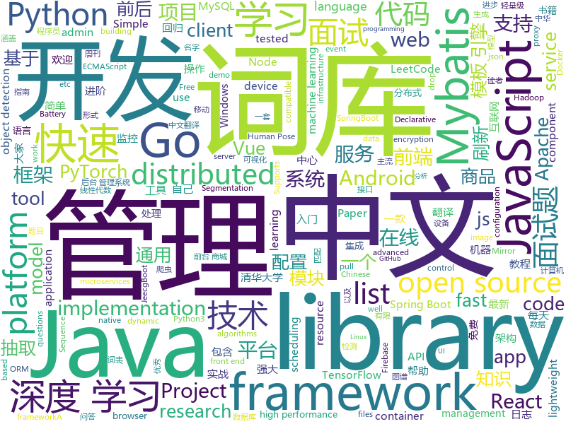

# 2019-10-13
See what the GitHub community is most excited about today.

## python
* [detectron2](https://github.com/facebookresearch/detectron2)(**1,324 stars today**): Detectron2 is FAIR's next-generation research platform for object detection and segmentation.
* [GitHub-Chinese-Top-Charts](https://github.com/kon9chunkit/GitHub-Chinese-Top-Charts)(**1,715 stars today**): 🇨🇳GitHub中文排行榜，帮助你发现高分优秀中文项目、更高效地吸收国人的优秀经验成果；榜单每周更新一次，敬请关注！（最近更新于10月9日，上班快乐🎉）
* [interview_internal_reference](https://github.com/0voice/interview_internal_reference)(**394 stars today**): 2019年最新总结，阿里，腾讯，百度，美团，头条等技术面试题目，以及答案，专家出题人分析汇总。
* [wtfpython-cn](https://github.com/leisurelicht/wtfpython-cn)(**38 stars today**): wtfpython的中文翻译/施工结束/ 能力有限，欢迎帮我改进翻译
* [insightface](https://github.com/deepinsight/insightface)(**5 stars today**): Face Analysis Project on MXNet
* [fairseq](https://github.com/pytorch/fairseq)(**18 stars today**): Facebook AI Research Sequence-to-Sequence Toolkit written in Python.
* [black](https://github.com/psf/black)(**18 stars today**): The uncompromising Python code formatter
* [Detectron](https://github.com/facebookresearch/Detectron)(**27 stars today**): FAIR's research platform for object detection research, implementing popular algorithms like Mask R-CNN and RetinaNet.
* [transformers](https://github.com/huggingface/transformers)(**56 stars today**): 🤗Transformers: State-of-the-art Natural Language Processing for TensorFlow 2.0 and PyTorch.
* [thefuck](https://github.com/nvbn/thefuck)(**38 stars today**): Magnificent app which corrects your previous console command.
* [HASS-sonoff-ewelink](https://github.com/peterbuga/HASS-sonoff-ewelink)(**0 stars today**): Simple Home Assistant component to control Sonoff/eWeLink smart devices
* [tensorflow-handbook](https://github.com/snowkylin/tensorflow-handbook)(**113 stars today**): 简单粗暴 TensorFlow 2.0 | A Concise Handbook of TensorFlow 2.0
* [funNLP](https://github.com/fighting41love/funNLP)(**54 stars today**): 中英文敏感词、语言检测、中外手机/电话归属地/运营商查询、名字推断性别、手机号抽取、身份证抽取、邮箱抽取、中日文人名库、中文缩写库、拆字词典、词汇情感值、停用词、反动词表、暴恐词表、繁简体转换、英文模拟中文发音、汪峰歌词生成器、职业名称词库、同义词库、反义词库、否定词库、汽车品牌词库、汽车零件词库、连续英文切割、各种中文词向量、公司名字大全、古诗词库、IT词库、财经词库、成语词库、地名词库、历史名人词库、诗词词库、医学词库、饮食词库、法律词库、汽车词库、动物词库、中文聊天语料、中文谣言数据、百度中文问答数据集、句子相似度匹配算法集合、bert资源、文本生成&摘要相关工具、cocoNLP信息抽取工具、国内电话号码正则匹配、清华大学XLORE:中英文跨语言百科知识图谱、清华大学人工智能技术…
* [seq2seq-couplet](https://github.com/wb14123/seq2seq-couplet)(**32 stars today**): Play couplet with seq2seq model. 用深度学习对对联。
* [proxy_pool](https://github.com/jhao104/proxy_pool)(**25 stars today**): Python爬虫代理IP池(proxy pool)
* [AiLearning](https://github.com/apachecn/AiLearning)(**43 stars today**): AiLearning: 机器学习 - MachineLearning - ML、深度学习 - DeepLearning - DL、自然语言处理 NLP
* [pytorch_geometric](https://github.com/rusty1s/pytorch_geometric)(**5 stars today**): Geometric Deep Learning Extension Library for PyTorch
* [learnable-triangulation-pytorch](https://github.com/karfly/learnable-triangulation-pytorch)(**23 stars today**): This repository is an official PyTorch implementation of the paper "Learnable Triangulation of Human Pose" (ICCV 2019, oral). Proposed method archives state-of-the-art results in multi-view 3D human pose estimation!
* [Ultra-Light-Fast-Generic-Face-Detector-1MB](https://github.com/Linzaer/Ultra-Light-Fast-Generic-Face-Detector-1MB)(**207 stars today**): 一款超轻量级通用人脸检测模型（模型文件大小仅1MB，320x240输入下计算量仅90MFlops）适用于边缘计算设备、移动端设备以及PC
* [sagemaker-python-sdk](https://github.com/aws/sagemaker-python-sdk)(**0 stars today**): A library for training and deploying machine learning models on Amazon SageMaker
* [mlflow](https://github.com/mlflow/mlflow)(**8 stars today**): Open source platform for the machine learning lifecycle
* [unlocker](https://github.com/DrDonk/unlocker)(**25 stars today**): VMware Workstation macOS
* [Airtest](https://github.com/AirtestProject/Airtest)(**8 stars today**): UI Automation Framework for Games and Apps
* [maskrcnn-benchmark](https://github.com/facebookresearch/maskrcnn-benchmark)(**19 stars today**): Fast, modular reference implementation of Instance Segmentation and Object Detection algorithms in PyTorch.
* [camelot](https://github.com/camelot-dev/camelot)(**23 stars today**): A Python library to extract tabular data from PDFs

## java
* [mall](https://github.com/macrozheng/mall)(**177 stars today**): mall项目是一套电商系统，包括前台商城系统及后台管理系统，基于SpringBoot+MyBatis实现。 前台商城系统包含首页门户、商品推荐、商品搜索、商品展示、购物车、订单流程、会员中心、客户服务、帮助中心等模块。 后台管理系统包含商品管理、订单管理、会员管理、促销管理、运营管理、内容管理、统计报表、财务管理、权限管理、设置等模块。
* [advanced-java](https://github.com/doocs/advanced-java)(**82 stars today**): 😮互联网 Java 工程师进阶知识完全扫盲：涵盖高并发、分布式、高可用、微服务等领域知识，后端同学必看，前端同学也可学习
* [JavaGuide](https://github.com/Snailclimb/JavaGuide)(**236 stars today**): 【Java学习+面试指南】 一份涵盖大部分Java程序员所需要掌握的核心知识。
* [xxl-job](https://github.com/xuxueli/xxl-job)(**24 stars today**): A lightweight distributed task scheduling framework.（分布式任务调度平台XXL-JOB）
* [nacos](https://github.com/alibaba/nacos)(**18 stars today**): an easy-to-use dynamic service discovery, configuration and service management platform for building cloud native applications.
* [zheng](https://github.com/shuzheng/zheng)(**16 stars today**): 基于Spring+SpringMVC+Mybatis分布式敏捷开发系统架构，提供整套公共微服务服务模块：集中权限管理（单点登录）、内容管理、支付中心、用户管理（支持第三方登录）、微信平台、存储系统、配置中心、日志分析、任务和通知等，支持服务治理、监控和追踪，努力为中小型企业打造全方位J2EE企业级开发解决方案。
* [canal](https://github.com/alibaba/canal)(**15 stars today**): 阿里巴巴 MySQL binlog 增量订阅&消费组件
* [elasticsearch](https://github.com/elastic/elasticsearch)(**22 stars today**): Open Source, Distributed, RESTful Search Engine
* [hbase](https://github.com/apache/hbase)(**4 stars today**): Mirror of Apache HBase
* [CS-Notes](https://github.com/CyC2018/CS-Notes)(**159 stars today**): 📚Tech Interview Guide 技术面试必备基础知识、Leetcode 题解、Java、C++、Python、后端面试、操作系统、计算机网络、系统设计
* [netty](https://github.com/netty/netty)(**37 stars today**): Netty project - an event-driven asynchronous network application framework
* [Sentinel](https://github.com/alibaba/Sentinel)(**14 stars today**): A lightweight powerful flow control component enabling reliability and monitoring for microservices. (轻量级的流量控制、熔断降级 Java 库)
* [SmartRefreshLayout](https://github.com/scwang90/SmartRefreshLayout)(**15 stars today**): 🔥下拉刷新、上拉加载、二级刷新、淘宝二楼、RefreshLayout、OverScroll，Android智能下拉刷新框架，支持越界回弹、越界拖动，具有极强的扩展性，集成了几十种炫酷的Header和 Footer。
* [spring-boot-examples](https://github.com/ityouknow/spring-boot-examples)(**51 stars today**): about learning Spring Boot via examples. Spring Boot 教程、技术栈示例代码，快速简单上手教程。
* [LeetCodeAnimation](https://github.com/MisterBooo/LeetCodeAnimation)(**109 stars today**): Demonstrate all the questions on LeetCode in the form of animation.（用动画的形式呈现解LeetCode题目的思路）
* [dubbo](https://github.com/apache/dubbo)(**18 stars today**): Apache Dubbo is a high-performance, java based, open source RPC framework.
* [hadoop](https://github.com/apache/hadoop)(**8 stars today**): Apache Hadoop
* [jeecg-boot](https://github.com/zhangdaiscott/jeecg-boot)(**21 stars today**): 一款基于代码生成器的JAVA快速开发平台！采用最新技术，前后端分离架构：SpringBoot 2.x，Ant Design&Vue，Mybatis，Shiro，JWT。强大的代码生成器让前后端代码一键生成，无需写任何代码，绝对是全栈开发福音！！ JeecgBoot的宗旨是提高UI能力的同时,降低前后分离的开发成本，JeecgBoot还独创在线开发模式，No代码概念，一系列在线智能开发：在线配置表单、在线配置报表、在线设计流程等等。
* [zipkin](https://github.com/openzipkin/zipkin)(**11 stars today**): Zipkin is a distributed tracing system
* [DataX](https://github.com/alibaba/DataX)(**5 stars today**): 
* [spring-boot-demo](https://github.com/xkcoding/spring-boot-demo)(**30 stars today**): spring boot demo 是一个用来深度学习并实战 spring boot 的项目，目前总共包含 63 个集成demo，已经完成 52 个。 该项目已成功集成 actuator(监控)、admin(可视化监控)、logback(日志)、aopLog(通过AOP记录web请求日志)、统一异常处理(json级别和页面级别)、freemarker(模板引擎)、thymeleaf(模板引擎)、Beetl(模板引擎)、Enjoy(模板引擎)、JdbcTemplate(通用JDBC操作数据库)、JPA(强大的ORM框架)、mybatis(强大的ORM框架)、通用Mapper(快速操作Mybatis)、PageHelper(通用的Mybatis分页插件)、mybatis-plus(快速操作M…
* [easyexcel](https://github.com/alibaba/easyexcel)(**114 stars today**): 快速、简单避免OOM的java处理Excel工具
* [VirtualXposed](https://github.com/android-hacker/VirtualXposed)(**20 stars today**): A simple app to use Xposed without root, unlock the bootloader or modify system image, etc.
* [MVVMHabit](https://github.com/goldze/MVVMHabit)(**14 stars today**): 👕基于谷歌最新AAC架构，MVVM设计模式的一套快速开发库，整合Okhttp+RxJava+Retrofit+Glide等主流模块，满足日常开发需求。使用该框架可以快速开发一个高质量、易维护的Android应用。
* [zookeeper](https://github.com/apache/zookeeper)(**8 stars today**): Mirror of Apache Hadoop ZooKeeper

## unknown
* [DeepLearning-500-questions](https://github.com/scutan90/DeepLearning-500-questions)(**78 stars today**): 深度学习500问，以问答形式对常用的概率知识、线性代数、机器学习、深度学习、计算机视觉等热点问题进行阐述，以帮助自己及有需要的读者。 全书分为18个章节，50余万字。由于水平有限，书中不妥之处恳请广大读者批评指正。 未完待续............ 如有意合作，联系scutjy2015@163.com 版权所有，违权必究 Tan 2018.06
* [nrol-39-logo](https://github.com/palewire/nrol-39-logo)(**102 stars today**): A vector PDF of the official mission logo of NROL-39
* [free-api](https://github.com/fangzesheng/free-api)(**224 stars today**): 收集免费的接口服务,做一个api的搬运工
* [awesome-wechat-weapp](https://github.com/justjavac/awesome-wechat-weapp)(**160 stars today**): 微信小程序开发资源汇总💯
* [pwc](https://github.com/zziz/pwc)(**21 stars today**): Papers with code. Sorted by stars. Updated weekly.
* [TeachYourselfCS-CN](https://github.com/keithnull/TeachYourselfCS-CN)(**14 stars today**): TeachYourselfCS 的中文翻译 | A Chinese translation of TeachYourselfCS
* [Specs](https://github.com/CocoaPods/Specs)(**8 stars today**): The CocoaPods Master Repo
* [free-programming-books-zh_CN](https://github.com/justjavac/free-programming-books-zh_CN)(**190 stars today**): 📚免费的计算机编程类中文书籍，欢迎投稿
* [Become-A-Full-Stack-Web-Developer](https://github.com/bmorelli25/Become-A-Full-Stack-Web-Developer)(**10 stars today**): Free resources for learning Full Stack Web Development
* [computer-science](https://github.com/ossu/computer-science)(**226 stars today**): 🎓Path to a free self-taught education in Computer Science!
* [Awesome-pytorch-list](https://github.com/bharathgs/Awesome-pytorch-list)(**33 stars today**): A comprehensive list of pytorch related content on github,such as different models,implementations,helper libraries,tutorials etc.
* [weekly](https://github.com/ruanyf/weekly)(**32 stars today**): 科技爱好者周刊，每周五发布
* [gold-miner](https://github.com/xitu/gold-miner)(**19 stars today**): 🥇掘金翻译计划，可能是世界最大最好的英译中技术社区，最懂读者和译者的翻译平台：
* [PLMpapers](https://github.com/thunlp/PLMpapers)(**55 stars today**): Must-read Papers on pre-trained language models.
* [android-open-project](https://github.com/Trinea/android-open-project)(**3 stars today**): A categorized collection of Android Open Source Projects, More powerful web version:
* [weekly](https://github.com/dt-fe/weekly)(**6 stars today**): 前端精读周刊
* [free-books](https://github.com/ruanyf/free-books)(**41 stars today**): 互联网上的免费书籍
* [cv-interview](https://github.com/donnyyou/cv-interview)(**12 stars today**): CV岗常见面试题(欢迎大家补充！！！)
* [python_interview_question](https://github.com/kenwoodjw/python_interview_question)(**6 stars today**): 关于python的面试题
* [free-programming-books](https://github.com/EbookFoundation/free-programming-books)(**50 stars today**): 📚Freely available programming books
* [machine-learning-for-software-engineers](https://github.com/ZuzooVn/machine-learning-for-software-engineers)(**9 stars today**): A complete daily plan for studying to become a machine learning engineer.
* [Data-Science--Cheat-Sheet](https://github.com/abhat222/Data-Science--Cheat-Sheet)(**41 stars today**): Cheat Sheets
* [awesome-cpp](https://github.com/fffaraz/awesome-cpp)(**32 stars today**): A curated list of awesome C++ (or C) frameworks, libraries, resources, and shiny things. Inspired by awesome-... stuff.
* [Behinder](https://github.com/rebeyond/Behinder)(**12 stars today**): “冰蝎”动态二进制加密网站管理客户端
* [javascript-questions](https://github.com/lydiahallie/javascript-questions)(**21 stars today**): A long list of (advanced) JavaScript questions, and their explanations✨

## javascript
* [fe-interview](https://github.com/haizlin/fe-interview)(**218 stars today**): 前端面试每日 3+1，以面试题来驱动学习，提倡每日学习与思考，每天进步一点！每天早上5点纯手工发布面试题（死磕自己，愉悦大家）
* [roughViz](https://github.com/jwilber/roughViz)(**169 stars today**): Reusable JavaScript library for creating sketchy/hand-drawn styled charts in the browser.
* [Daily-Interview-Question](https://github.com/Advanced-Frontend/Daily-Interview-Question)(**38 stars today**): 我是木易杨，公众号「高级前端进阶」作者，每天搞定一道前端大厂面试题，祝大家天天进步，一年后会看到不一样的自己。
* [ws](https://github.com/websockets/ws)(**4 stars today**): Simple to use, blazing fast and thoroughly tested WebSocket client and server for Node.js
* [keeweb](https://github.com/keeweb/keeweb)(**9 stars today**): Free cross-platform password manager compatible with KeePass
* [chinese-poetry](https://github.com/chinese-poetry/chinese-poetry)(**34 stars today**): 最全中华古诗词数据库, 唐宋两朝近一万四千古诗人, 接近5.5万首唐诗加26万宋诗. 两宋时期1564位词人，21050首词。
* [is-website-vulnerable](https://github.com/lirantal/is-website-vulnerable)(**71 stars today**): finds publicly known security vulnerabilities in a website's frontend JavaScript libraries
* [jsencrypt](https://github.com/travist/jsencrypt)(**6 stars today**): A Javascript library to perform OpenSSL RSA Encryption, Decryption, and Key Generation.
* [plotly.js](https://github.com/plotly/plotly.js)(**11 stars today**): Open-source JavaScript charting library behind Plotly and Dash
* [egg](https://github.com/eggjs/egg)(**14 stars today**): 🥚Born to build better enterprise frameworks and apps with Node.js & Koa
* [yapi](https://github.com/YMFE/yapi)(**26 stars today**): YApi 是一个可本地部署的、打通前后端及QA的、可视化的接口管理平台
* [Profiles](https://github.com/ConnersHua/Profiles)(**48 stars today**): Clash、Kitsunebi、Quantumult(X)、Shadowrocket、Pepi(ShadowRay)、Surge 的配置规则文件
* [vue2-happyfri](https://github.com/bailicangdu/vue2-happyfri)(**7 stars today**): vue2 + vue-router + vuex 入门项目
* [Face-Detection-JavaScript](https://github.com/WebDevSimplified/Face-Detection-JavaScript)(**5 stars today**): 
* [js13k-2019](https://github.com/bencoder/js13k-2019)(**7 stars today**): xx142-b2.exe. An entry for js13kgames 2019
* [WebGL-Fluid-Simulation](https://github.com/PavelDoGreat/WebGL-Fluid-Simulation)(**8 stars today**): Play with fluids in your browser (works even on mobile)
* [draft-js](https://github.com/facebook/draft-js)(**13 stars today**): A React framework for building text editors.
* [NeteaseCloudMusicApi](https://github.com/Binaryify/NeteaseCloudMusicApi)(**25 stars today**): 网易云音乐 Node.js API service
* [reach-ui](https://github.com/reach/reach-ui)(**12 stars today**): The Accessible Foundation for React Apps and Design Systems.
* [riot-web](https://github.com/vector-im/riot-web)(**52 stars today**): A glossy Matrix collaboration client for the web.
* [baidu-netdisk-downloaderx](https://github.com/b3log/baidu-netdisk-downloaderx)(**98 stars today**): ⚡️一款图形界面的百度网盘不限速下载器，支持 Windows、Linux 和 Mac。
* [es6tutorial](https://github.com/ruanyf/es6tutorial)(**23 stars today**): 《ECMAScript 6入门》是一本开源的 JavaScript 语言教程，全面介绍 ECMAScript 6 新增的语法特性。
* [Sortable](https://github.com/SortableJS/Sortable)(**24 stars today**): Sortable — is a JavaScript library for reorderable drag-and-drop lists on modern browsers and touch devices. No jQuery required. Supports Meteor, AngularJS, React, Polymer, Vue, Ember, Knockout and any CSS library, e.g. Bootstrap.
* [react-native-firebase](https://github.com/invertase/react-native-firebase)(**14 stars today**): 🔥A well-tested feature-rich modular Firebase implementation for React Native. Supports both iOS & Android platforms for all Firebase services.
* [wouter](https://github.com/molefrog/wouter)(**13 stars today**): ⛸A minimalistic ~1.2KB routing for React and Preact. Nothing else but HOOKS.

## html
* [bandinchina](https://github.com/caffeine-overload/bandinchina)(**396 stars today**): Naming and shaming companies who kowtow to Chinese censorship requests
* [treehouses.github.io](https://github.com/treehouses/treehouses.github.io)(**3 stars today**): A Markdown Wiki for treehouses🏡
* [nndl.github.io](https://github.com/nndl/nndl.github.io)(**6 stars today**): 《神经网络与深度学习》 Neural Network and Deep Learning
* [gentelella](https://github.com/ColorlibHQ/gentelella)(**15 stars today**): Free Bootstrap 3 Admin Template
* [ng-alain](https://github.com/ng-alain/ng-alain)(**1 stars today**): NG-ZORRO admin panel front-end framework (netlify mirror https://netlify.ng-alain.com/)
* [skill-map](https://github.com/TeamStuQ/skill-map)(**22 stars today**): 程序员技能图谱
* [Java-Interview-Advanced](https://github.com/shishan100/Java-Interview-Advanced)(**10 stars today**): 中华石杉--互联网Java进阶面试训练营
* [18.06-linalg-notes](https://github.com/apachecn/18.06-linalg-notes)(**4 stars today**): MIT-18.06-线性代数-完整笔记
* [Machine-Learning](https://github.com/Jack-Cherish/Machine-Learning)(**4 stars today**): ⚡️机器学习实战（Python3）：kNN、决策树、贝叶斯、逻辑回归、SVM、线性回归、树回归
* [foundation-sites](https://github.com/foundation/foundation-sites)(**1 stars today**): The most advanced responsive front-end framework in the world. Quickly create prototypes and production code for sites that work on any kind of device.
* [docs](https://github.com/knative/docs)(**0 stars today**): User documentation for Knative components
* [REKCARC-TSC-UHT](https://github.com/PKUanonym/REKCARC-TSC-UHT)(**18 stars today**): 清华大学计算机系课程攻略 Guidance for courses in Department of Computer Science and Technology, Tsinghua University
* [antispider](https://github.com/asyncins/antispider)(**21 stars today**): 书籍《Python3 反爬虫原理与绕过实战》配套代码
* [fastText](https://github.com/facebookresearch/fastText)(**6 stars today**): Library for fast text representation and classification.
* [ecma262](https://github.com/tc39/ecma262)(**10 stars today**): Status, process, and documents for ECMA-262
* [portainer](https://github.com/portainer/portainer)(**12 stars today**): Making Docker management easy.
* [serverless-graphql-workshop](https://github.com/simonaco/serverless-graphql-workshop)(**2 stars today**): GraphQL and Serverless workshop
* [electron-api-demos](https://github.com/electron/electron-api-demos)(**5 stars today**): Explore the Electron APIs
* [luaforwindows](https://github.com/rjpcomputing/luaforwindows)(**3 stars today**): Lua for Windows is a 'batteries included environment' for the Lua scripting language on Windows. NOTICE: Looking for maintainer.
* [mxgraph](https://github.com/jgraph/mxgraph)(**6 stars today**): mxGraph is a fully client side JavaScript diagramming library
* [frontend-tech-list](https://github.com/alienzhou/frontend-tech-list)(**2 stars today**): 📝Frontend Tech List for Developers💡
* [csswg-drafts](https://github.com/w3c/csswg-drafts)(**2 stars today**): CSS Working Group Editor Drafts
* [openjdk-docker](https://github.com/AdoptOpenJDK/openjdk-docker)(**0 stars today**): Scripts for creating Docker images of OpenJDK binaries.
* [mescroll](https://github.com/mescroll/mescroll)(**3 stars today**): 精致的下拉刷新和上拉加载 js框架.支持vue,完美运行于移动端和主流PC浏览器 (JS framework for pull-refresh and pull-up-loading)
* [patchwork](https://github.com/jlord/patchwork)(**1 stars today**): All the Git-it Workshop completers!

## go
* [go-micro](https://github.com/micro/go-micro)(**36 stars today**): A Go microservices development framework
* [vault](https://github.com/hashicorp/vault)(**15 stars today**): A tool for secrets management, encryption as a service, and privileged access management
* [kubernetes](https://github.com/kubernetes/kubernetes)(**71 stars today**): Production-Grade Container Scheduling and Management
* [docx2md](https://github.com/mattn/docx2md)(**24 stars today**): Convert Microsoft Word Document to Markdown
* [fasthttp](https://github.com/valyala/fasthttp)(**8 stars today**): Fast HTTP package for Go. Tuned for high performance. Zero memory allocations in hot paths. Up to 10x faster than net/http
* [terraform](https://github.com/hashicorp/terraform)(**10 stars today**): Terraform enables you to safely and predictably create, change, and improve infrastructure. It is an open source tool that codifies APIs into declarative configuration files that can be shared amongst team members, treated as code, edited, reviewed, and versioned.
* [dashboard](https://github.com/kubernetes/dashboard)(**10 stars today**): General-purpose web UI for Kubernetes clusters
* [mysql](https://github.com/go-sql-driver/mysql)(**7 stars today**): Go MySQL Driver is a MySQL driver for Go's (golang) database/sql package
* [frp](https://github.com/fatedier/frp)(**51 stars today**): A fast reverse proxy to help you expose a local server behind a NAT or firewall to the internet.
* [beats](https://github.com/elastic/beats)(**40 stars today**): 🐠Beats - Lightweight shippers for Elasticsearch & Logstash
* [moby](https://github.com/moby/moby)(**15 stars today**): Moby Project - a collaborative project for the container ecosystem to assemble container-based systems
* [go](https://github.com/json-iterator/go)(**8 stars today**): A high-performance 100% compatible drop-in replacement of "encoding/json"
* [terraform-provider-azurerm](https://github.com/terraform-providers/terraform-provider-azurerm)(**1 stars today**): Terraform provider for Azure Resource Manager
* [cert-manager](https://github.com/jetstack/cert-manager)(**8 stars today**): Automatically provision and manage TLS certificates in Kubernetes
* [schedviz](https://github.com/google/schedviz)(**16 stars today**): A tool for gathering and visualizing kernel scheduling traces on Linux machines
* [elastic](https://github.com/olivere/elastic)(**2 stars today**): Elasticsearch client for Go.
* [influxdb](https://github.com/influxdata/influxdb)(**8 stars today**): Scalable datastore for metrics, events, and real-time analytics
* [websocket](https://github.com/gorilla/websocket)(**17 stars today**): A fast, well-tested and widely used WebSocket implementation for Go.
* [the-way-to-go_ZH_CN](https://github.com/unknwon/the-way-to-go_ZH_CN)(**39 stars today**): 《The Way to Go》中文译本，中文正式名《Go 入门指南》
* [cron](https://github.com/robfig/cron)(**15 stars today**): a cron library for go
* [blackbox_exporter](https://github.com/prometheus/blackbox_exporter)(**2 stars today**): Blackbox prober exporter
* [consul](https://github.com/hashicorp/consul)(**10 stars today**): Consul is a distributed, highly available, and data center aware solution to connect and configure applications across dynamic, distributed infrastructure.
* [argo-cd](https://github.com/argoproj/argo-cd)(**3 stars today**): Declarative continuous deployment for Kubernetes.
* [battery-historian](https://github.com/google/battery-historian)(**2 stars today**): Battery Historian is a tool to analyze battery consumers using Android "bugreport" files.
* [delve](https://github.com/go-delve/delve)(**9 stars today**): Delve is a debugger for the Go programming language.

## WordCloud

