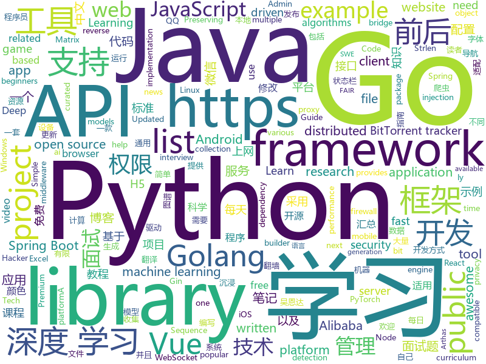

# 2019-10-14
See what the GitHub community is most excited about today.

## python
* [detectron2](https://github.com/facebookresearch/detectron2)(**563 stars today**): Detectron2 is FAIR's next-generation research platform for object detection and segmentation.
* [fairseq](https://github.com/pytorch/fairseq)(**19 stars today**): Facebook AI Research Sequence-to-Sequence Toolkit written in Python.
* [CrypTen](https://github.com/facebookresearch/CrypTen)(**33 stars today**): A framework for Privacy Preserving Machine Learning
* [Ultra-Light-Fast-Generic-Face-Detector-1MB](https://github.com/Linzaer/Ultra-Light-Fast-Generic-Face-Detector-1MB)(**126 stars today**): 💎一款超轻量级通用人脸检测模型（模型文件大小仅1MB，320x240输入下计算量仅90MFlops）适用于边缘计算设备、移动端设备以及PC
* [torch2trt](https://github.com/NVIDIA-AI-IOT/torch2trt)(**35 stars today**): An easy to use PyTorch to TensorRT converter
* [hydra](https://github.com/facebookresearch/hydra)(**170 stars today**): Hydra is a framework for elegantly configuring complex applications
* [captum](https://github.com/pytorch/captum)(**57 stars today**): Model interpretability and understanding for PyTorch
* [synapse](https://github.com/matrix-org/synapse)(**8 stars today**): Synapse: Matrix reference homeserver
* [face_recognition](https://github.com/ageitgey/face_recognition)(**19 stars today**): The world's simplest facial recognition api for Python and the command line
* [d2l-zh](https://github.com/d2l-ai/d2l-zh)(**45 stars today**): 《动手学深度学习》：面向中文读者、能运行、可讨论。英文版即伯克利“深度学习导论”教材。
* [pythonic-news](https://github.com/sebst/pythonic-news)(**17 stars today**): A Hacker News lookalike written in Python/Django, powering https://news.python.sc
* [segmentation_models.pytorch](https://github.com/qubvel/segmentation_models.pytorch)(**6 stars today**): Segmentation models with pretrained backbones. PyTorch.
* [wtfpython-cn](https://github.com/leisurelicht/wtfpython-cn)(**13 stars today**): wtfpython的中文翻译/施工结束/ 能力有限，欢迎帮我改进翻译
* [Detectron](https://github.com/facebookresearch/Detectron)(**11 stars today**): FAIR's research platform for object detection research, implementing popular algorithms like Mask R-CNN and RetinaNet.
* [ml-agents](https://github.com/Unity-Technologies/ml-agents)(**7 stars today**): Unity Machine Learning Agents Toolkit
* [chromego](https://github.com/killgcd/chromego)(**4 stars today**): ChromeGo 翻墙工具包
* [deep-learning-from-scratch](https://github.com/oreilly-japan/deep-learning-from-scratch)(**1 stars today**): 『ゼロから作る Deep Learning』のリポジトリ
* [examples-of-web-crawlers](https://github.com/shengqiangzhang/examples-of-web-crawlers)(**9 stars today**): 一些非常有趣的python爬虫例子,对新手比较友好,主要爬取淘宝、天猫、微信、豆瓣、QQ等网站。(Some interesting examples of python crawlers that are friendly to beginners. )
* [manim](https://github.com/3b1b/manim)(**45 stars today**): Animation engine for explanatory math videos
* [PySyft](https://github.com/OpenMined/PySyft)(**3 stars today**): A library for encrypted, privacy preserving deep learning
* [proxy_pool](https://github.com/jhao104/proxy_pool)(**22 stars today**): Python爬虫代理IP池(proxy pool)
* [DjangoBlog](https://github.com/liangliangyy/DjangoBlog)(**4 stars today**): 🍺基于Django的博客系统
* [scikit-learn](https://github.com/scikit-learn/scikit-learn)(**16 stars today**): scikit-learn: machine learning in Python
* [sotabench-eval](https://github.com/paperswithcode/sotabench-eval)(**15 stars today**): Easily evaluate machine learning models on public benchmarks
* [Awesome-WAF](https://github.com/0xInfection/Awesome-WAF)(**26 stars today**): 🔥Everything awesome about web-application firewalls (WAF).

## java
* [apollo](https://github.com/ctripcorp/apollo)(**58 stars today**): Apollo（阿波罗）是携程框架部门研发的分布式配置中心，能够集中化管理应用不同环境、不同集群的配置，配置修改后能够实时推送到应用端，并且具备规范的权限、流程治理等特性，适用于微服务配置管理场景。
* [JavaGuide](https://github.com/Snailclimb/JavaGuide)(**99 stars today**): 【Java学习+面试指南】 一份涵盖大部分Java程序员所需要掌握的核心知识。
* [arthas](https://github.com/alibaba/arthas)(**9 stars today**): Alibaba Java Diagnostic Tool Arthas/Alibaba Java诊断利器Arthas
* [easyexcel](https://github.com/alibaba/easyexcel)(**15 stars today**): 快速、简单避免OOM的java处理Excel工具
* [spring-analysis](https://github.com/seaswalker/spring-analysis)(**16 stars today**): Spring源码阅读
* [eladmin](https://github.com/elunez/eladmin)(**15 stars today**): 项目基于 Spring Boot 2.1.0 、 Jpa、 Spring Security、redis、Vue的前后端分离的后台管理系统，项目采用分模块开发方式， 权限控制采用 RBAC，支持数据字典与数据权限管理，支持一键生成前后端代码，支持动态路由
* [netty](https://github.com/netty/netty)(**10 stars today**): Netty project - an event-driven asynchronous network application framework
* [spring-boot-examples](https://github.com/ityouknow/spring-boot-examples)(**17 stars today**): about learning Spring Boot via examples. Spring Boot 教程、技术栈示例代码，快速简单上手教程。
* [vhr](https://github.com/lenve/vhr)(**19 stars today**): 微人事是一个前后端分离的人力资源管理系统，项目采用SpringBoot+Vue开发。
* [ImmersionBar](https://github.com/gyf-dev/ImmersionBar)(**4 stars today**): android 4.4以上沉浸式状态栏和沉浸式导航栏管理，适配横竖屏切换、刘海屏、软键盘弹出等问题，可以修改状态栏字体颜色和导航栏图标颜色，以及不可修改字体颜色手机的适配，适用于Activity、Fragment、DialogFragment、Dialog，PopupWindow，一句代码轻松实现，以及对bar的其他设置，详见README。简书请参考：http://www.jianshu.com/p/2a884e211a62
* [spring-boot](https://github.com/spring-projects/spring-boot)(**16 stars today**): Spring Boot
* [zookeeper](https://github.com/apache/zookeeper)(**4 stars today**): Mirror of Apache Hadoop ZooKeeper
* [Arduino](https://github.com/arduino/Arduino)(**3 stars today**): open-source electronics prototyping platform
* [Algorithms](https://github.com/williamfiset/Algorithms)(**15 stars today**): A collection of algorithms and data structures
* [xxl-job](https://github.com/xuxueli/xxl-job)(**7 stars today**): A lightweight distributed task scheduling framework.（分布式任务调度平台XXL-JOB）
* [CS-Notes](https://github.com/CyC2018/CS-Notes)(**81 stars today**): 📚Tech Interview Guide 技术面试必备基础知识、Leetcode 题解、Java、C++、Python、后端面试、操作系统、计算机网络、系统设计
* [AntennaPod](https://github.com/AntennaPod/AntennaPod)(**1 stars today**): A podcast manager for Android
* [SmartYouTubeTV](https://github.com/yuliskov/SmartYouTubeTV)(**4 stars today**): Watch YouTube videos on your TV and set-top-box with comfort
* [backtobackswe](https://github.com/bephrem1/backtobackswe)(**4 stars today**): Code Examples For Back To Back SWE Lessons
* [insetter](https://github.com/chrisbanes/insetter)(**28 stars today**): Insetter is a library to help apps handle WindowInsets more easily
* [spring-cloud-alibaba](https://github.com/alibaba/spring-cloud-alibaba)(**9 stars today**): Spring Cloud Alibaba provides a one-stop solution for application development for the distributed solutions of Alibaba middleware.
* [Auto.js](https://github.com/hyb1996/Auto.js)(**4 stars today**): A UiAutomator on android, does not need root access(安卓平台上的JavaScript自动化工具)
* [Mybatis-PageHelper](https://github.com/pagehelper/Mybatis-PageHelper)(**5 stars today**): Mybatis通用分页插件
* [Java](https://github.com/TheAlgorithms/Java)(**17 stars today**): All Algorithms implemented in Java
* [SpringBoot-Shiro-Vue](https://github.com/Heeexy/SpringBoot-Shiro-Vue)(**0 stars today**): 提供一套基于Spring Boot-Shiro-Vue的权限管理思路.前后端都加以控制,做到按钮/接口级别的权限

## unknown
* [guide](https://github.com/uber-go/guide)(**1,174 stars today**): The Uber Go Style Guide.
* [free-api](https://github.com/fangzesheng/free-api)(**217 stars today**): 收集免费的接口服务,做一个api的搬运工
* [free-programming-books-zh_CN](https://github.com/justjavac/free-programming-books-zh_CN)(**142 stars today**): 📚免费的计算机编程类中文书籍，欢迎投稿
* [guido_blog_translation](https://github.com/chinesehuazhou/guido_blog_translation)(**16 stars today**): 翻译 Guido 的解析器系列文章
* [DMG-CPU-Inside](https://github.com/furrtek/DMG-CPU-Inside)(**8 stars today**): Reverse-engineered schematics for DMG-CPU-B
* [hosts](https://github.com/googlehosts/hosts)(**25 stars today**): 镜像：https://coding.net/u/scaffrey/p/hosts/git
* [weekly](https://github.com/ruanyf/weekly)(**22 stars today**): 科技爱好者周刊，每周五发布
* [open-source-cs](https://github.com/ForrestKnight/open-source-cs)(**4 stars today**): Video discussing this curriculum:
* [trackerslist](https://github.com/ngosang/trackerslist)(**41 stars today**): Updated list of public BitTorrent trackers
* [fancyss_history_package](https://github.com/hq450/fancyss_history_package)(**16 stars today**): 科学上网插件的离线安装包储存在这里
* [awesome-wechat-weapp](https://github.com/justjavac/awesome-wechat-weapp)(**66 stars today**): 微信小程序开发资源汇总💯
* [architect-awesome](https://github.com/xingshaocheng/architect-awesome)(**35 stars today**): 后端架构师技术图谱
* [free-programming-books](https://github.com/EbookFoundation/free-programming-books)(**36 stars today**): 📚Freely available programming books
* [DeepLearning-500-questions](https://github.com/scutan90/DeepLearning-500-questions)(**81 stars today**): 深度学习500问，以问答形式对常用的概率知识、线性代数、机器学习、深度学习、计算机视觉等热点问题进行阐述，以帮助自己及有需要的读者。 全书分为18个章节，50余万字。由于水平有限，书中不妥之处恳请广大读者批评指正。 未完待续............ 如有意合作，联系scutjy2015@163.com 版权所有，违权必究 Tan 2018.06
* [Fuck-XueXiQiangGuo](https://github.com/fuck-xuexiqiangguo/Fuck-XueXiQiangGuo)(**10 stars today**): 学习强国 懒人刷分工具 自动学习
* [python_interview_question](https://github.com/kenwoodjw/python_interview_question)(**2 stars today**): 关于python的面试题
* [Awesome-Hacking](https://github.com/Hack-with-Github/Awesome-Hacking)(**26 stars today**): A collection of various awesome lists for hackers, pentesters and security researchers
* [awesome-vue](https://github.com/vuejs/awesome-vue)(**22 stars today**): 🎉A curated list of awesome things related to Vue.js
* [golang-developer-roadmap](https://github.com/Alikhll/golang-developer-roadmap)(**5 stars today**): Roadmap to becoming a Go developer in 2019
* [YCBlogs](https://github.com/yangchong211/YCBlogs)(**4 stars today**): 技术博客笔记大汇总【15年10月到至今】，包括Java基础及深入知识点，Android技术博客，Python，Go学习笔记等等，还包括平时开发中遇到的bug汇总，当然也在工作之余收集了大量的面试题，长期更新维护并且修正，持续完善……开源的文件是markdown格式的！同时也开源了生活博客，从12年起，积累共计N篇[近100万字]，转载请注明出处，谢谢！
* [android](https://github.com/LineageOS/android)(**1 stars today**): 
* [KnowledgeGraphCourse](https://github.com/npubird/KnowledgeGraphCourse)(**5 stars today**): 东南大学《知识图谱》研究生课程
* [changelog-v5](https://github.com/webpack/changelog-v5)(**3 stars today**): Temporary repo for the changelog for webpack 5
* [new-pac](https://github.com/Alvin9999/new-pac)(**45 stars today**): 科学/自由上网，免费ss/ssr/v2ray/goflyway账号，搭建教程
* [summer2020internships](https://github.com/elaine-zheng/summer2020internships)(**3 stars today**): Keep track of internships for Summer 2020 for undergraduates interested in tech./SWE/related fields

## javascript
* [three.js](https://github.com/mrdoob/three.js)(**35 stars today**): JavaScript 3D library.
* [luban-h5](https://github.com/ly525/luban-h5)(**26 stars today**): en: A mobile page builder/editor, similar with amolink. zh: 类似易企秀的H5制作、建站工具.
* [Profiles](https://github.com/ConnersHua/Profiles)(**60 stars today**): Clash、Kitsunebi、Quantumult(X)、Shadowrocket、Pepi(ShadowRay)、Surge 的配置规则文件
* [is-website-vulnerable](https://github.com/lirantal/is-website-vulnerable)(**36 stars today**): finds publicly known security vulnerabilities in a website's frontend JavaScript libraries
* [freeCodeCamp](https://github.com/freeCodeCamp/freeCodeCamp)(**37 stars today**): The https://www.freeCodeCamp.org open source codebase and curriculum. Learn to code for free together with millions of people.
* [taro](https://github.com/NervJS/taro)(**6 stars today**): 多端统一开发框架，支持用 React 的开发方式编写一次代码，生成能运行在微信/百度/支付宝/字节跳动/ QQ 小程序、快应用、H5、React Native 等的应用。 https://taro.jd.com/
* [baidu-netdisk-downloaderx](https://github.com/b3log/baidu-netdisk-downloaderx)(**44 stars today**): ⚡️一款图形界面的百度网盘不限速下载器，支持 Windows、Linux 和 Mac。
* [zigbee2mqtt](https://github.com/Koenkk/zigbee2mqtt)(**0 stars today**): Zigbee🐝to MQTT bridge🌉, get rid of your proprietary Zigbee bridges🔨
* [awesome-mac](https://github.com/jaywcjlove/awesome-mac)(**21 stars today**):  Now we have become very big, Different from the original idea. Collect premium software in various categories.
* [roughViz](https://github.com/jwilber/roughViz)(**86 stars today**): Reusable JavaScript library for creating sketchy/hand-drawn styled charts in the browser.
* [uni-app](https://github.com/dcloudio/uni-app)(**65 stars today**): uni-app 是使用 Vue 语法开发小程序、H5、App的统一框架
* [brave-browser](https://github.com/brave/brave-browser)(**4 stars today**): Next generation Brave browser for macOS, Windows, Linux, and eventually Android
* [yapi](https://github.com/YMFE/yapi)(**9 stars today**): YApi 是一个可本地部署的、打通前后端及QA的、可视化的接口管理平台
* [website](https://github.com/CodingTrain/website)(**1 stars today**): Coding Train website
* [fe-interview](https://github.com/haizlin/fe-interview)(**42 stars today**): 前端面试每日 3+1，以面试题来驱动学习，提倡每日学习与思考，每天进步一点！每天早上5点纯手工发布面试题（死磕自己，愉悦大家）
* [fanqiang](https://github.com/bannedbook/fanqiang)(**32 stars today**): 翻墙-科学上网
* [riot-web](https://github.com/vector-im/riot-web)(**13 stars today**): A glossy Matrix collaboration client for the web.
* [miniprogram-demo](https://github.com/wechat-miniprogram/miniprogram-demo)(**6 stars today**): 微信小程序组件 / API / 云开发示例
* [discord.js](https://github.com/discordjs/discord.js)(**10 stars today**): A powerful JavaScript library for interacting with the Discord API
* [engine](https://github.com/cocos-creator/engine)(**0 stars today**): Cocos Creator is a complete package of game development tools and workflow, including a game engine, resource management, scene editing, game preview, debug and publish one project to multiple platforms.
* [shields](https://github.com/badges/shields)(**10 stars today**): Concise, consistent, and legible badges in SVG and raster format
* [expression-calculator](https://github.com/romacher/expression-calculator)(**0 stars today**): 
* [skillcrucial-react-redux-boilerplate](https://github.com/ovasylenko/skillcrucial-react-redux-boilerplate)(**0 stars today**): React

## html
* [Coursera-ML-AndrewNg-Notes](https://github.com/fengdu78/Coursera-ML-AndrewNg-Notes)(**58 stars today**): 吴恩达老师的机器学习课程个人笔记
* [deeplearning_ai_books](https://github.com/fengdu78/deeplearning_ai_books)(**19 stars today**): deeplearning.ai（吴恩达老师的深度学习课程笔记及资源）
* [Java-Interview-Advanced](https://github.com/shishan100/Java-Interview-Advanced)(**6 stars today**): 中华石杉--互联网Java进阶面试训练营
* [hugo-academic](https://github.com/gcushen/hugo-academic)(**7 stars today**): 📝The website builder for Hugo. Build and deploy a beautiful website in minutes!
* [Hacktoberfest2019](https://github.com/Ishaan28malik/Hacktoberfest2019)(**7 stars today**): for beginners who are going to start with therefirst PR
* [awesome-piracy](https://github.com/Igglybuff/awesome-piracy)(**9 stars today**): A curated list of awesome warez and piracy links
* [gentelella](https://github.com/ColorlibHQ/gentelella)(**12 stars today**): Free Bootstrap 3 Admin Template
* [AdminLTE](https://github.com/ColorlibHQ/AdminLTE)(**13 stars today**): AdminLTE - Free Premium Admin control Panel Theme Based On Bootstrap 3.x
* [boost](https://github.com/boostorg/boost)(**3 stars today**): Super-project for modularized Boost
* [portable-strlen](https://github.com/DeBos99/portable-strlen)(**0 stars today**): Portable Strlen is an chrome browser extension that provides simple strlen function.
* [hacktoberfest](https://github.com/AliceWonderland/hacktoberfest)(**4 stars today**): Participate in Hacktoberfest by contributing to any Open Source project on GitHub! Here is a starter project for first time contributors. #hacktoberfest
* [fonts](https://github.com/google/fonts)(**5 stars today**): Font files available from Google Fonts
* [TrackersListCollection](https://github.com/XIU2/TrackersListCollection)(**11 stars today**): 🎈Updated daily! A list of popular public BitTorrent trackers. / 每天更新！全网热门公共 BitTorrent Tracker 列表！
* [Flaskex](https://github.com/anfederico/Flaskex)(**2 stars today**): Simple flask example for quick prototypes and small applications
* [python](https://github.com/Show-Me-the-Code/python)(**1 stars today**): Show Me the Code Python version.
* [bandinchina](https://github.com/caffeine-overload/bandinchina)(**67 stars today**): Naming and shaming companies who kowtow to Chinese censorship requests
* [node-ytdl-core](https://github.com/fent/node-ytdl-core)(**1 stars today**): YouTube video downloader in javascript.
* [qiubaiying.github.io](https://github.com/qiubaiying/qiubaiying.github.io)(**1 stars today**): BY Blog ->
* [ctf-wiki](https://github.com/ctf-wiki/ctf-wiki)(**4 stars today**): CTF Wiki Online. Come and join us, we need you!
* [book](https://github.com/PaddlePaddle/book)(**1 stars today**): Deep Learning 101 with PaddlePaddle （『飞桨』深度学习框架入门教程）
* [Introduction-to-Web-Development](https://github.com/WebDevSimplified/Introduction-to-Web-Development)(**1 stars today**): 
* [speedtest](https://github.com/librespeed/speedtest)(**5 stars today**): Self-hosted Speedtest for HTML5 and more. Easy setup, examples, configurable, mobile friendly. Supports PHP, Node, Multiple servers, and more
* [weibo_ios_sdk](https://github.com/sinaweibosdk/weibo_ios_sdk)(**0 stars today**): 新浪微博 IOS SDK
* [Front-end-Developer-Interview-Questions](https://github.com/h5bp/Front-end-Developer-Interview-Questions)(**10 stars today**): A list of helpful front-end related questions you can use to interview potential candidates, test yourself or completely ignore.
* [DnDAppFiles](https://github.com/ceryliae/DnDAppFiles)(**0 stars today**): Files for the Fifth Edition apps by Lion's Den

## go
* [the-way-to-go_ZH_CN](https://github.com/unknwon/the-way-to-go_ZH_CN)(**45 stars today**): 《The Way to Go》中文译本，中文正式名《Go 入门指南》
* [clash](https://github.com/Dreamacro/clash)(**15 stars today**): A rule-based tunnel in Go.
* [gin](https://github.com/gin-gonic/gin)(**25 stars today**): Gin is a HTTP web framework written in Go (Golang). It features a Martini-like API with much better performance -- up to 40 times faster. If you need smashing performance, get yourself some Gin.
* [nsq](https://github.com/nsqio/nsq)(**6 stars today**): A realtime distributed messaging platform
* [v2ray-core](https://github.com/v2ray/v2ray-core)(**39 stars today**): A platform for building proxies to bypass network restrictions.
* [vulcain](https://github.com/dunglas/vulcain)(**320 stars today**): Use HTTP/2 Server Push to create fast and idiomatic client-driven REST APIs
* [music-get](https://github.com/winterssy/music-get)(**15 stars today**): 只需一步，下载你喜欢的音乐到本地
* [BaiduPCS-Go](https://github.com/iikira/BaiduPCS-Go)(**24 stars today**): 百度网盘客户端 - Go语言编写
* [tidb](https://github.com/pingcap/tidb)(**7 stars today**): TiDB is an open source distributed HTAP database compatible with the MySQL protocol
* [redigo](https://github.com/gomodule/redigo)(**3 stars today**): Go client for Redis
* [frp](https://github.com/fatedier/frp)(**18 stars today**): A fast reverse proxy to help you expose a local server behind a NAT or firewall to the internet.
* [go-filecoin](https://github.com/filecoin-project/go-filecoin)(**4 stars today**): Filecoin Full Node Implementation in Go
* [gobuster](https://github.com/OJ/gobuster)(**5 stars today**): Directory/File, DNS and VHost busting tool written in Go
* [kratos](https://github.com/bilibili/kratos)(**10 stars today**): Kratos是bilibili开源的一套Go微服务框架，包含大量微服务相关框架及工具。
* [The-Golang-Standard-Library-by-Example](https://github.com/polaris1119/The-Golang-Standard-Library-by-Example)(**8 stars today**): Golang标准库。对于程序员而言，标准库与语言本身同样重要，它好比一个百宝箱，能为各种常见的任务提供完美的解决方案。以示例驱动的方式讲解Golang的标准库。
* [iris](https://github.com/kataras/iris)(**9 stars today**): The fastest community-driven web framework for Go. Webassembly, Automatic HTTPS with Public Domain, MVC, Routing on its bests, Sessions, Caching, Versioning API, Problem API, Websocket, Dependency Injection and more. Fully compatible with the standard library and 3rd-party middleware packages. https://bit.ly/再次感谢您的支持 | https://bit.ly/iriscandothat1
* [websocket](https://github.com/gorilla/websocket)(**4 stars today**): A fast, well-tested and widely used WebSocket implementation for Go.
* [docker_practice](https://github.com/yeasy/docker_practice)(**8 stars today**): Learn and understand Docker technologies, with real DevOps practice!
* [cosmos-sdk](https://github.com/cosmos/cosmos-sdk)(**3 stars today**): ⛓A Framework for Building High Value Public Blockchains✨
* [xray](https://github.com/chaitin/xray)(**8 stars today**): xray 安全评估工具
* [client](https://github.com/keybase/client)(**6 stars today**): Keybase Go Library, Client, Service, OS X, iOS, Android, Electron
* [onionscan](https://github.com/s-rah/onionscan)(**6 stars today**): OnionScan is a free and open source tool for investigating the Dark Web.
* [fx](https://github.com/uber-go/fx)(**3 stars today**): A dependency injection based application framework for Go.
* [excelize](https://github.com/360EntSecGroup-Skylar/excelize)(**22 stars today**): Golang library for reading and writing Microsoft Excel™ (XLSX) files.
* [GolangTraining](https://github.com/GoesToEleven/GolangTraining)(**3 stars today**): Training for Golang (go language)

## WordCloud

