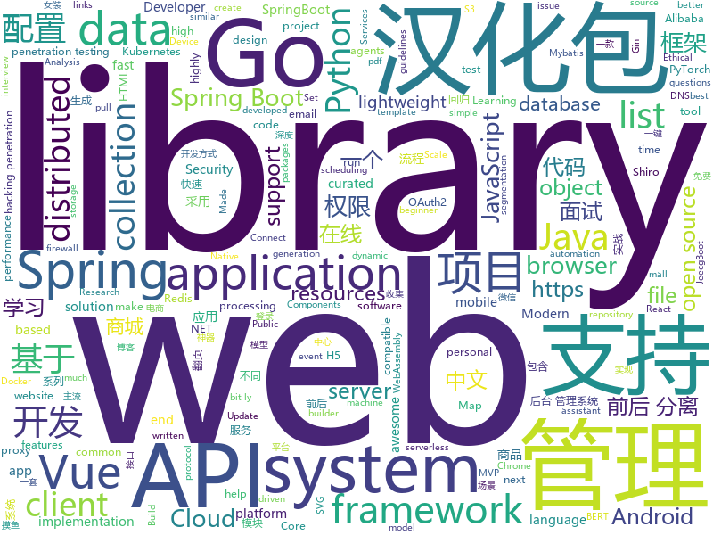

# 2019-10-16
See what the GitHub community is most excited about today.

## python
* [detectron2](https://github.com/facebookresearch/detectron2)(**483 stars today**): Detectron2 is FAIR's next-generation research platform for object detection and segmentation.
* [Ultra-Light-Fast-Generic-Face-Detector-1MB](https://github.com/Linzaer/Ultra-Light-Fast-Generic-Face-Detector-1MB)(**416 stars today**): 💎1MB轻量级通用人脸检测模型
* [python-cheatsheet](https://github.com/gto76/python-cheatsheet)(**50 stars today**): Comprehensive Python Cheatsheet
* [Awesome-WAF](https://github.com/0xInfection/Awesome-WAF)(**30 stars today**): 🔥Everything awesome about web-application firewalls (WAF).
* [system-design-primer](https://github.com/donnemartin/system-design-primer)(**78 stars today**): Learn how to design large-scale systems. Prep for the system design interview. Includes Anki flashcards.
* [hydra](https://github.com/facebookresearch/hydra)(**47 stars today**): Hydra is a framework for elegantly configuring complex applications
* [ansible](https://github.com/ansible/ansible)(**14 stars today**): Ansible is a radically simple IT automation platform that makes your applications and systems easier to deploy. Avoid writing scripts or custom code to deploy and update your applications — automate in a language that approaches plain English, using SSH, with no agents to install on remote systems. https://docs.ansible.com/ansible/
* [CppCoreGuidelines](https://github.com/isocpp/CppCoreGuidelines)(**84 stars today**): The C++ Core Guidelines are a set of tried-and-true guidelines, rules, and best practices about coding in C++
* [Pytorch-UNet](https://github.com/milesial/Pytorch-UNet)(**6 stars today**): Pytorch implementation of the U-Net for image semantic segmentation, with dense CRF post-processing
* [insightface](https://github.com/deepinsight/insightface)(**16 stars today**): Face Analysis Project on MXNet
* [Chinese-Text-Classification-Pytorch](https://github.com/649453932/Chinese-Text-Classification-Pytorch)(**11 stars today**): 中文文本分类，TextCNN，TextRNN，FastText，TextRCNN，BiLSTM_Attention，DPCNN，Transformer，基于pytorch，开箱即用。
* [masonite](https://github.com/MasoniteFramework/masonite)(**7 stars today**): The Modern And Developer Centric Python Web Framework. Be sure to read the documentation and join the Slack channel questions: http://slack.masoniteproject.com
* [serverless-application-model](https://github.com/awslabs/serverless-application-model)(**7 stars today**): AWS Serverless Application Model (SAM) is an open-source framework for building serverless applications
* [Chinese-BERT-wwm](https://github.com/ymcui/Chinese-BERT-wwm)(**17 stars today**): Pre-Training with Whole Word Masking for Chinese BERT（中文BERT-wwm系列模型）
* [manim](https://github.com/3b1b/manim)(**136 stars today**): Animation engine for explanatory math videos
* [pipelines](https://github.com/kubeflow/pipelines)(**3 stars today**): Machine Learning Pipelines for Kubeflow
* [fairseq](https://github.com/pytorch/fairseq)(**12 stars today**): Facebook AI Research Sequence-to-Sequence Toolkit written in Python.
* [ml-agents](https://github.com/Unity-Technologies/ml-agents)(**12 stars today**): Unity Machine Learning Agents Toolkit
* [pandas](https://github.com/pandas-dev/pandas)(**20 stars today**): Flexible and powerful data analysis / manipulation library for Python, providing labeled data structures similar to R data.frame objects, statistical functions, and much more
* [pytorch-lightning](https://github.com/williamFalcon/pytorch-lightning)(**19 stars today**): The lightweight PyTorch wrapper for ML researchers. Scale your models. Write less boilerplate
* [loguru](https://github.com/Delgan/loguru)(**15 stars today**): Python logging made (stupidly) simple
* [LaZagne](https://github.com/AlessandroZ/LaZagne)(**5 stars today**): Credentials recovery project
* [wemake-python-styleguide](https://github.com/wemake-services/wemake-python-styleguide)(**8 stars today**): The strictest and most opinionated python linter ever!
* [demiguise](https://github.com/nccgroup/demiguise)(**14 stars today**): HTA encryption tool for RedTeams
* [aws-cloudformation-templates](https://github.com/awslabs/aws-cloudformation-templates)(**4 stars today**): A collection of useful CloudFormation templates

## java
* [NewPipe](https://github.com/TeamNewPipe/NewPipe)(**81 stars today**): A libre lightweight streaming front-end for Android.
* [eladmin](https://github.com/elunez/eladmin)(**43 stars today**): 项目基于 Spring Boot 2.1.0 、 Jpa、 Spring Security、redis、Vue的前后端分离的后台管理系统，项目采用分模块开发方式， 权限控制采用 RBAC，支持数据字典与数据权限管理，支持一键生成前后端代码，支持动态路由
* [incubator-shardingsphere-example](https://github.com/apache/incubator-shardingsphere-example)(**3 stars today**): Sharding-Sphere examples
* [apollo](https://github.com/ctripcorp/apollo)(**41 stars today**): Apollo（阿波罗）是携程框架部门研发的分布式配置中心，能够集中化管理应用不同环境、不同集群的配置，配置修改后能够实时推送到应用端，并且具备规范的权限、流程治理等特性，适用于微服务配置管理场景。
* [vhr](https://github.com/lenve/vhr)(**73 stars today**): 微人事是一个前后端分离的人力资源管理系统，项目采用SpringBoot+Vue开发。
* [mall](https://github.com/macrozheng/mall)(**115 stars today**): mall项目是一套电商系统，包括前台商城系统及后台管理系统，基于SpringBoot+MyBatis实现。 前台商城系统包含首页门户、商品推荐、商品搜索、商品展示、购物车、订单流程、会员中心、客户服务、帮助中心等模块。 后台管理系统包含商品管理、订单管理、会员管理、促销管理、运营管理、内容管理、统计报表、财务管理、权限管理、设置等模块。
* [onemall](https://github.com/YunaiV/onemall)(**25 stars today**): mall 商城，基于微服务的思想，构建在 B2C 电商场景下的项目实战。核心技术栈，是 Spring Boot + Dubbo 。未来，会重构成 Spring Cloud Alibaba 。
* [JavaGuide](https://github.com/Snailclimb/JavaGuide)(**163 stars today**): 【Java学习+面试指南】 一份涵盖大部分Java程序员所需要掌握的核心知识。
* [incubator-dolphinscheduler](https://github.com/apache/incubator-dolphinscheduler)(**19 stars today**): Dolphin Scheduler is a distributed and easy-to-expand visual DAG workflow scheduling system, dedicated to solving the complex dependencies in data processing, making the scheduling system out of the box for data processing.
* [karate](https://github.com/intuit/karate)(**7 stars today**): Test Automation Made Simple
* [spring-cloud-alibaba](https://github.com/alibaba/spring-cloud-alibaba)(**26 stars today**): Spring Cloud Alibaba provides a one-stop solution for application development for the distributed solutions of Alibaba middleware.
* [paascloud-master](https://github.com/paascloud/paascloud-master)(**39 stars today**): spring cloud + vue + oAuth2.0全家桶实战，前后端分离模拟商城，完整的购物流程、后端运营平台，可以实现快速搭建企业级微服务项目。支持微信登录等三方登录。
* [thingsboard](https://github.com/thingsboard/thingsboard)(**8 stars today**): Open-source IoT Platform - Device management, data collection, processing and visualization.
* [JCSprout](https://github.com/crossoverJie/JCSprout)(**19 stars today**): 👨‍🎓Java Core Sprout : basic, concurrent, algorithm
* [janusgraph](https://github.com/JanusGraph/janusgraph)(**3 stars today**): JanusGraph: an open-source, distributed graph database
* [SpringBoot-Shiro-Vue](https://github.com/Heeexy/SpringBoot-Shiro-Vue)(**20 stars today**): 提供一套基于Spring Boot-Shiro-Vue的权限管理思路.前后端都加以控制,做到按钮/接口级别的权限
* [DataX](https://github.com/alibaba/DataX)(**13 stars today**): 
* [jeecg-boot](https://github.com/zhangdaiscott/jeecg-boot)(**33 stars today**): 一款基于代码生成器的JAVA快速开发平台！采用最新技术，前后端分离架构：SpringBoot 2.x，Ant Design&Vue，Mybatis，Shiro，JWT。强大的代码生成器让前后端代码一键生成，无需写任何代码，绝对是全栈开发福音！！ JeecgBoot的宗旨是提高UI能力的同时,降低前后分离的开发成本，JeecgBoot还独创在线开发模式，No代码概念，一系列在线智能开发：在线配置表单、在线配置报表、在线设计流程等等。
* [testcontainers-java](https://github.com/testcontainers/testcontainers-java)(**5 stars today**): Testcontainers is a Java library that supports JUnit tests, providing lightweight, throwaway instances of common databases, Selenium web browsers, or anything else that can run in a Docker container.
* [redisson](https://github.com/redisson/redisson)(**17 stars today**): Redisson - Redis Java client with features of In-Memory Data Grid. Supports over 30 objects and services: Set, Multimap, SortedSet, Map, List, Queue, Deque, Semaphore, Lock, AtomicLong, Map Reduce, Publish / Subscribe, Bloom filter, Spring Cache, Tomcat, Scheduler, JCache API, Hibernate, RPC.
* [springboot-guide](https://github.com/Snailclimb/springboot-guide)(**22 stars today**): Summary of key points of SpringBoot。 Based on Spring Boot 2.19+。
* [kubernetes-plugin](https://github.com/jenkinsci/kubernetes-plugin)(**4 stars today**): Jenkins plugin to run dynamic agents in a Kubernetes/Docker environment
* [SpringAll](https://github.com/wuyouzhuguli/SpringAll)(**22 stars today**): 循序渐进，学习Spring Boot、Spring Boot & Shiro、Spring Cloud、Spring Security & Spring Security OAuth2，博客Spring系列源码
* [MVPArms](https://github.com/JessYanCoding/MVPArms)(**9 stars today**): ⚔️A common architecture for Android applications developing based on MVP, integrates many open source projects, to make your developing quicker and easier (一个整合了大量主流开源项目高度可配置化的 Android MVP 快速集成框架).
* [insetter](https://github.com/chrisbanes/insetter)(**31 stars today**): Insetter is a library to help apps handle WindowInsets more easily

## unknown
* [You-Dont-Know-JS](https://github.com/getify/You-Dont-Know-JS)(**54 stars today**): A book series on JavaScript. @YDKJS on twitter.
* [PENTESTING-BIBLE](https://github.com/blaCCkHatHacEEkr/PENTESTING-BIBLE)(**158 stars today**): This repository was created and developed by Ammar Amer @cry__pto Only. Updates to this repository will continue to arrive until the number of links reaches 10000 links & 10000 pdf files .Learn Ethical Hacking and penetration testing .hundreds of ethical hacking & penetration testing & red team & cyber security & computer science resources.
* [guide](https://github.com/uber-go/guide)(**610 stars today**): The Uber Go Style Guide.
* [free-api](https://github.com/fangzesheng/free-api)(**777 stars today**): 收集免费的接口服务,做一个api的搬运工
* [The-Open-Book](https://github.com/joeycastillo/The-Open-Book)(**264 stars today**): 
* [Data-Science--Cheat-Sheet](https://github.com/abhat222/Data-Science--Cheat-Sheet)(**65 stars today**): Cheat Sheets
* [build-your-own-x](https://github.com/danistefanovic/build-your-own-x)(**200 stars today**): 🤓Build your own (insert technology here)
* [Beginner-Network-Pentesting](https://github.com/hmaverickadams/Beginner-Network-Pentesting)(**100 stars today**): Notes for Beginner Network Pentesting Course
* [awesome-interview-questions](https://github.com/MaximAbramchuck/awesome-interview-questions)(**12 stars today**): A curated awesome list of lists of interview questions. Feel free to contribute!🎓
* [free-programming-books-zh_CN](https://github.com/justjavac/free-programming-books-zh_CN)(**99 stars today**): 📚免费的计算机编程类中文书籍，欢迎投稿
* [awesome-laravel](https://github.com/chiraggude/awesome-laravel)(**4 stars today**): A curated list of bookmarks, packages, tutorials, videos and other cool resources from the Laravel ecosystem
* [blog](https://github.com/brickspert/blog)(**44 stars today**): 个人技术博客，博文写在 Issues 里。
* [Awesome-Hacking-Resources](https://github.com/vitalysim/Awesome-Hacking-Resources)(**5 stars today**): A collection of hacking / penetration testing resources to make you better!
* [git-flight-rules](https://github.com/k88hudson/git-flight-rules)(**36 stars today**): Flight rules for git
* [Flutter-Course-Resources](https://github.com/londonappbrewery/Flutter-Course-Resources)(**1 stars today**): 
* [home-assistant-config](https://github.com/allanpersson/home-assistant-config)(**9 stars today**): This is my Home Assistant configuration for inspiration
* [GirlDress](https://github.com/greenaway07/GirlDress)(**22 stars today**): 看到女装的项目的issue建议妹子建一个男装的项目，但是考虑到github的女性用户 数量貌似并不能达到女装的效果2333总之先建一个。
* [awesome-blazor](https://github.com/AdrienTorris/awesome-blazor)(**11 stars today**): Resources for Blazor, a .NET web framework using C#/Razor and HTML that runs in the browser with WebAssembly.
* [announcements](https://github.com/dotnet/announcements)(**16 stars today**): Subscribe to this repo to be notified of Announcements and changes in .NET Core.
* [AZ-103-MicrosoftAzureAdministrator](https://github.com/MicrosoftLearning/AZ-103-MicrosoftAzureAdministrator)(**3 stars today**): AZ-103: Microsoft Azure Administrator
* [bank_interview](https://github.com/sty945/bank_interview)(**24 stars today**): 银行笔试面试经验分享及资料分享
* [gitignore](https://github.com/github/gitignore)(**45 stars today**): A collection of useful .gitignore templates
* [sysmon-config](https://github.com/SwiftOnSecurity/sysmon-config)(**2 stars today**): Sysmon configuration file template with default high-quality event tracing
* [modern-cpp-features](https://github.com/AnthonyCalandra/modern-cpp-features)(**14 stars today**): A cheatsheet of modern C++ language and library features.
* [awesome-vue](https://github.com/vuejs/awesome-vue)(**49 stars today**): 🎉A curated list of awesome things related to Vue.js

## javascript
* [mapbox-gl-js](https://github.com/mapbox/mapbox-gl-js)(**8 stars today**): Interactive, thoroughly customizable maps in the browser, powered by vector tiles and WebGL
* [ccxt](https://github.com/ccxt/ccxt)(**13 stars today**): A JavaScript / Python / PHP cryptocurrency trading API with support for more than 120 bitcoin/altcoin exchanges
* [luban-h5](https://github.com/ly525/luban-h5)(**68 stars today**): en: A mobile page builder/editor, similar with amolink. zh: 类似易企秀的H5制作、建站工具.
* [brave-browser](https://github.com/brave/brave-browser)(**30 stars today**): Next generation Brave browser for macOS, Windows, Linux, and eventually Android
* [three.js](https://github.com/mrdoob/three.js)(**34 stars today**): JavaScript 3D library.
* [vant](https://github.com/youzan/vant)(**35 stars today**): Lightweight Mobile UI Components built on Vue
* [incubator-superset](https://github.com/apache/incubator-superset)(**25 stars today**): Apache Superset (incubating) is a modern, enterprise-ready business intelligence web application
* [taro](https://github.com/NervJS/taro)(**28 stars today**): 多端统一开发框架，支持用 React 的开发方式编写一次代码，生成能运行在微信/百度/支付宝/字节跳动/ QQ 小程序、快应用、H5、React Native 等的应用。 https://taro.jd.com/
* [appwrite](https://github.com/appwrite/appwrite)(**170 stars today**): End to end backend server for frontend and mobile developers.👩‍💻👨‍💻
* [drawio-desktop](https://github.com/jgraph/drawio-desktop)(**24 stars today**): Official electron build of draw.io
* [react-dates](https://github.com/airbnb/react-dates)(**14 stars today**): An easily internationalizable, mobile-friendly datepicker library for the web
* [Thief-Book](https://github.com/cteamx/Thief-Book)(**13 stars today**): 一款可以在任务栏、桌面、TouchBar上进行摸鱼的最强的跨平台摸鱼神器，支持小说、股票、按键翻页、鼠标翻页、自动翻页让你体验不同的工作 996，上班族必备神器
* [lwc-recipes](https://github.com/trailheadapps/lwc-recipes)(**1 stars today**): A collection of easy-to-digest code examples for Lightning Web Components on Salesforce Platform
* [samples](https://github.com/webrtc/samples)(**8 stars today**): WebRTC Web demos and samples
* [awesome-mac](https://github.com/jaywcjlove/awesome-mac)(**19 stars today**):  Now we have become very big, Different from the original idea. Collect premium software in various categories.
* [oidc-client-js](https://github.com/IdentityModel/oidc-client-js)(**6 stars today**): OpenID Connect (OIDC) and OAuth2 protocol support for browser-based JavaScript applications
* [uni-app](https://github.com/dcloudio/uni-app)(**53 stars today**): uni-app 是使用 Vue 语法开发小程序、H5、App的统一框架
* [shields](https://github.com/badges/shields)(**15 stars today**): Concise, consistent, and legible badges in SVG and raster format
* [VvvebJs](https://github.com/givanz/VvvebJs)(**14 stars today**): Drag and drop website builder javascript library.
* [MagicMirror](https://github.com/MichMich/MagicMirror)(**13 stars today**): MagicMirror² is an open source modular smart mirror platform. With a growing list of installable modules, the MagicMirror² allows you to convert your hallway or bathroom mirror into your personal assistant.
* [drawio](https://github.com/jgraph/drawio)(**13 stars today**): Source to www.draw.io
* [roughViz](https://github.com/jwilber/roughViz)(**131 stars today**): Reusable JavaScript library for creating sketchy/hand-drawn styled charts in the browser.
* [chrome-extension-cli](https://github.com/dutiyesh/chrome-extension-cli)(**44 stars today**): 🚀The CLI for your next Chrome Extension
* [Face-Recognition-JavaScript](https://github.com/WebDevSimplified/Face-Recognition-JavaScript)(**3 stars today**): 
* [bypass-paywalls-chrome](https://github.com/iamadamdev/bypass-paywalls-chrome)(**10 stars today**): Bypass Paywalls for Chrome

## html
* [Java-Interview-Advanced](https://github.com/shishan100/Java-Interview-Advanced)(**15 stars today**): 中华石杉--互联网Java进阶面试训练营
* [Front-end-Web-Development-Interview-Question](https://github.com/paddingme/Front-end-Web-Development-Interview-Question)(**7 stars today**): 前端开发面试题大收集，前端面试集锦❤️💝💘
* [deeplearning_ai_books](https://github.com/fengdu78/deeplearning_ai_books)(**42 stars today**): deeplearning.ai（吴恩达老师的深度学习课程笔记及资源）
* [SuperTinyIcons](https://github.com/edent/SuperTinyIcons)(**4 stars today**): Under 1KB each! Super Tiny Icons are miniscule SVG versions of your favourite website and app logos
* [phantomjs](https://github.com/ariya/phantomjs)(**5 stars today**): Scriptable Headless Browser
* [RDR2CollectorsMap](https://github.com/jeanropke/RDR2CollectorsMap)(**1 stars today**): 
* [personal-website](https://github.com/github/personal-website)(**9 stars today**): Code that'll help you kickstart a personal website that showcases your work as a software developer.
* [webKnowledge](https://github.com/huyaocode/webKnowledge)(**10 stars today**): 前端面试知识点总结
* [professional-services](https://github.com/GoogleCloudPlatform/professional-services)(**4 stars today**): Common solutions and tools developed by Google Cloud's Professional Services team
* [awesome-resume](https://github.com/resumejob/awesome-resume)(**4 stars today**): 包含简历常用例句
* [TranslatorX](https://github.com/pingfangx/TranslatorX)(**11 stars today**): JetBrains 系列软件汉化包 关键字: Android Studio 3.5 汉化包 CLion 2019.2 汉化包 DataGrip 2019.2 汉化包 GoLand 2019.2 汉化包 IntelliJ IDEA 2019.2 汉化包 PhpStorm 2019.2 汉化包 PyCharm 2019.2 汉化包 Rider 2019.2 汉化包 RubyMine 2019.2 汉化包 WebStorm 2019.2 汉化包
* [beginners-week-one](https://github.com/CodeFirstGirls/beginners-week-one)(**2 stars today**): Tasks for beginners course, week one
* [mu](https://github.com/akkartik/mu)(**3 stars today**): Soul of a tiny new machine. More thorough tests → More comprehensible and rewrite-friendly software → More resilient society.
* [webdevbootcamp](https://github.com/nax3t/webdevbootcamp)(**0 stars today**): All source code for back-end projects from the Web Developer Bootcamp
* [dev-tips](https://github.com/HomoEfficio/dev-tips)(**2 stars today**): 개발하다 마주쳤던 작은 문제들과 해결 방법 정리
* [mescroll](https://github.com/mescroll/mescroll)(**3 stars today**): 精致的下拉刷新和上拉加载 js框架.支持vue,完美运行于移动端和主流PC浏览器 (JS framework for pull-refresh and pull-up-loading)
* [awesome-angular](https://github.com/PatrickJS/awesome-angular)(**5 stars today**): 📄A curated list of awesome Angular resources
* [Machine-Learning](https://github.com/Jack-Cherish/Machine-Learning)(**7 stars today**): ⚡️机器学习实战（Python3）：kNN、决策树、贝叶斯、逻辑回归、SVM、线性回归、树回归
* [en.javascript.info](https://github.com/javascript-tutorial/en.javascript.info)(**11 stars today**): Modern JavaScript Tutorial
* [pdfs](https://github.com/tpn/pdfs)(**2 stars today**): Technically-oriented PDF Collection (Papers, Specs, Decks, Manuals, etc)
* [indigo](https://github.com/sergiokopplin/indigo)(**0 stars today**): 🍜Minimalist Jekyll Template
* [email-templates](https://github.com/ColorlibHQ/email-templates)(**2 stars today**): Free HTML email templates for Mailchimp and other emails services
* [book](https://github.com/PaddlePaddle/book)(**2 stars today**): Deep Learning 101 with PaddlePaddle （『飞桨』深度学习框架入门教程）
* [fastText](https://github.com/facebookresearch/fastText)(**16 stars today**): Library for fast text representation and classification.
* [foundation-emails](https://github.com/foundation/foundation-emails)(**3 stars today**): Quickly create responsive HTML emails that work on any device and client. Even Outlook.

## go
* [vulcain](https://github.com/dunglas/vulcain)(**212 stars today**): Use HTTP/2 Server Push to create fast and idiomatic client-driven REST APIs
* [the-way-to-go_ZH_CN](https://github.com/unknwon/the-way-to-go_ZH_CN)(**45 stars today**): 《The Way to Go》中文译本，中文正式名《Go 入门指南》
* [gin](https://github.com/gin-gonic/gin)(**30 stars today**): Gin is a HTTP web framework written in Go (Golang). It features a Martini-like API with much better performance -- up to 40 times faster. If you need smashing performance, get yourself some Gin.
* [go-filecoin](https://github.com/filecoin-project/go-filecoin)(**6 stars today**): Filecoin Full Node Implementation in Go
* [wtf](https://github.com/wtfutil/wtf)(**16 stars today**): The personal information dashboard for your terminal.
* [aws-sdk-go](https://github.com/aws/aws-sdk-go)(**1 stars today**): AWS SDK for the Go programming language.
* [iris](https://github.com/kataras/iris)(**12 stars today**): The fastest community-driven web framework for Go. Webassembly, Automatic HTTPS with Public Domain, MVC, Routing on its bests, Sessions, Caching, Versioning API, Problem API, Websocket, Dependency Injection and more. Fully compatible with the standard library and 3rd-party middleware packages. https://bit.ly/再次感谢您的支持 | https://bit.ly/iriscandothat1
* [dnscrypt-proxy](https://github.com/DNSCrypt/dnscrypt-proxy)(**22 stars today**): dnscrypt-proxy 2 - A flexible DNS proxy, with support for encrypted DNS protocols.
* [minio](https://github.com/minio/minio)(**17 stars today**): MinIO is a high performance object storage server compatible with Amazon S3 APIs
* [influxdb](https://github.com/influxdata/influxdb)(**11 stars today**): Scalable datastore for metrics, events, and real-time analytics
* [chat](https://github.com/tinode/chat)(**7 stars today**): Instant messaging server; backend in Go; iOS, Android, web, command line clients; chatbots
* [consul](https://github.com/hashicorp/consul)(**10 stars today**): Consul is a distributed, highly available, and data center aware solution to connect and configure applications across dynamic, distributed infrastructure.
* [origin](https://github.com/openshift/origin)(**2 stars today**): The self-managing, auto-upgrading, Kubernetes distribution for everyone
* [redis](https://github.com/go-redis/redis)(**9 stars today**): Type-safe Redis client for Golang
* [seaweedfs](https://github.com/chrislusf/seaweedfs)(**14 stars today**): SeaweedFS is a simple and highly scalable distributed file system. There are two objectives: to store billions of files! to serve the files fast! SeaweedFS implements an object store with O(1) disk seek and an optional Filer with POSIX interface, supporting S3 API, Rack-Aware Erasure Coding for warm storage, FUSE mount, Hadoop compatible, WebDAV.
* [prometheus](https://github.com/prometheus/prometheus)(**34 stars today**): The Prometheus monitoring system and time series database.
* [go-git](https://github.com/src-d/go-git)(**4 stars today**): A highly extensible Git implementation in pure Go.
* [kafka-go](https://github.com/segmentio/kafka-go)(**4 stars today**): Kafka library in Go
* [vegeta](https://github.com/tsenart/vegeta)(**9 stars today**): HTTP load testing tool and library. It's over 9000!
* [cosmos-sdk](https://github.com/cosmos/cosmos-sdk)(**3 stars today**): ⛓A Framework for Building High Value Public Blockchains✨
* [traefik](https://github.com/containous/traefik)(**26 stars today**): The Cloud Native Edge Router
* [client-go](https://github.com/kubernetes/client-go)(**10 stars today**): Go client for Kubernetes.
* [sqlx](https://github.com/jmoiron/sqlx)(**4 stars today**): general purpose extensions to golang's database/sql
* [frp](https://github.com/fatedier/frp)(**43 stars today**): A fast reverse proxy to help you expose a local server behind a NAT or firewall to the internet.
* [grpc-go](https://github.com/grpc/grpc-go)(**11 stars today**): The Go language implementation of gRPC. HTTP/2 based RPC

## WordCloud

