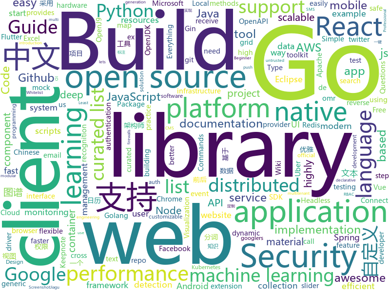

# 2019-10-18
See what the GitHub community is most excited about today.

## python
* [KnowledgeGraphData](https://github.com/ownthink/KnowledgeGraphData)(**193 stars today**): 史上最大规模1.4亿中文知识图谱开源下载
* [100-Days-of-ML-Code-Chinese-Version](https://github.com/Avik-Jain/100-Days-of-ML-Code-Chinese-Version)(**126 stars today**): Chinese Translation for Machine Learning Infographics
* [python-cheatsheet](https://github.com/gto76/python-cheatsheet)(**57 stars today**): Comprehensive Python Cheatsheet
* [pkuseg-python](https://github.com/lancopku/pkuseg-python)(**46 stars today**): pkuseg多领域中文分词工具; The pkuseg toolkit for multi-domain Chinese word segmentation
* [botorch](https://github.com/pytorch/botorch)(**102 stars today**): Bayesian optimization in PyTorch
* [onionshare](https://github.com/micahflee/onionshare)(**25 stars today**): Securely and anonymously send and receive files, and publish onion sites
* [gpytorch](https://github.com/cornellius-gp/gpytorch)(**8 stars today**): A highly efficient and modular implementation of Gaussian Processes in PyTorch
* [policy_sentry](https://github.com/salesforce/policy_sentry)(**29 stars today**): IAM Least Privilege Policy Generator
* [cpython](https://github.com/python/cpython)(**26 stars today**): The Python programming language
* [Chinese-Text-Classification-Pytorch](https://github.com/649453932/Chinese-Text-Classification-Pytorch)(**95 stars today**): 中文文本分类，TextCNN，TextRNN，FastText，TextRCNN，BiLSTM_Attention，DPCNN，Transformer，基于pytorch，开箱即用。
* [tvm](https://github.com/dmlc/tvm)(**13 stars today**): Open deep learning compiler stack for cpu, gpu and specialized accelerators
* [GetTogether](https://github.com/GetTogetherComm/GetTogether)(**6 stars today**): Event manager for local community events
* [Ultra-Light-Fast-Generic-Face-Detector-1MB](https://github.com/Linzaer/Ultra-Light-Fast-Generic-Face-Detector-1MB)(**515 stars today**): 💎1MB轻量级人脸检测模型
* [aws-cdk-examples](https://github.com/aws-samples/aws-cdk-examples)(**4 stars today**): Example projects using the AWS CDK
* [poetry](https://github.com/sdispater/poetry)(**70 stars today**): Python dependency management and packaging made easy.
* [awx](https://github.com/ansible/awx)(**5 stars today**): AWX Project
* [Awesome-WAF](https://github.com/0xInfection/Awesome-WAF)(**13 stars today**): 🔥Everything awesome about web-application firewalls (WAF).
* [ml-road](https://github.com/yanshengjia/ml-road)(**18 stars today**): Machine Learning Resources, Practice and Research
* [awesome-honeypots](https://github.com/paralax/awesome-honeypots)(**35 stars today**): an awesome list of honeypot resources
* [detectron2](https://github.com/facebookresearch/detectron2)(**160 stars today**): Detectron2 is FAIR's next-generation research platform for object detection and segmentation.
* [ReAgent](https://github.com/facebookresearch/ReAgent)(**13 stars today**): A platform for Reasoning systems (Reinforcement Learning, Contextual Bandits, etc.)
* [moto](https://github.com/spulec/moto)(**5 stars today**): A library that allows you to easily mock out tests based on AWS infrastructure.
* [sigma](https://github.com/Neo23x0/sigma)(**5 stars today**): Generic Signature Format for SIEM Systems
* [pix2code](https://github.com/tonybeltramelli/pix2code)(**4 stars today**): pix2code: Generating Code from a Graphical User Interface Screenshot
* [Jiagu](https://github.com/ownthink/Jiagu)(**18 stars today**): Jiagu深度学习自然语言处理工具 知识图谱关系抽取 中文分词 词性标注 命名实体识别 情感分析 新词发现 关键词 文本摘要 文本聚类

## java
* [eladmin](https://github.com/elunez/eladmin)(**25 stars today**): 项目基于 Spring Boot 2.1.0 、 Jpa、 Spring Security、redis、Vue的前后端分离的后台管理系统，项目采用分模块开发方式， 权限控制采用 RBAC，支持数据字典与数据权限管理，支持一键生成前后端代码，支持动态路由
* [openj9](https://github.com/eclipse/openj9)(**9 stars today**): Eclipse OpenJ9: A Java Virtual Machine for OpenJDK that's optimized for small footprint, fast start-up, and high throughput. Builds on Eclipse OMR (https://github.com/eclipse/omr) and combines with the Extensions for OpenJDK for OpenJ9 repo.
* [tutorials](https://github.com/eugenp/tutorials)(**20 stars today**): The "REST With Spring" Course:
* [react-native-camera](https://github.com/react-native-community/react-native-camera)(**41 stars today**): A Camera component for React Native. Also supports barcode scanning!
* [retrofit](https://github.com/square/retrofit)(**17 stars today**): Type-safe HTTP client for Android and Java by Square, Inc.
* [nifi](https://github.com/apache/nifi)(**4 stars today**): Mirror of Apache NiFi
* [hbase](https://github.com/apache/hbase)(**4 stars today**): Mirror of Apache HBase
* [jib](https://github.com/GoogleContainerTools/jib)(**10 stars today**): 🏗Build container images for your Java applications.
* [quarkus](https://github.com/quarkusio/quarkus)(**11 stars today**): Quarkus: Supersonic Subatomic Java.
* [flutter_boost](https://github.com/alibaba/flutter_boost)(**22 stars today**): FlutterBoost is a Flutter plugin which enables hybrid integration of Flutter for your existing native apps with minimum efforts
* [react-native-push-notification](https://github.com/zo0r/react-native-push-notification)(**1 stars today**): React Native Local and Remote Notifications
* [CalendarView](https://github.com/huanghaibin-dev/CalendarView)(**1 stars today**): Android上一个优雅、万能自定义UI、支持周视图、自定义周起始、性能高效的日历控件，支持热插拔实现的UI定制！支持标记、自定义颜色、农历、自定义月视图各种显示模式等。Canvas绘制，速度快、占用内存低，你真的想不到日历居然还可以如此优雅！An elegant, highly customized and high-performance Calendar Widget on Android.
* [NewPipe](https://github.com/TeamNewPipe/NewPipe)(**4 stars today**): A libre lightweight streaming front-end for Android.
* [zuul](https://github.com/Netflix/zuul)(**5 stars today**): Zuul is a gateway service that provides dynamic routing, monitoring, resiliency, security, and more.
* [aws-doc-sdk-examples](https://github.com/awsdocs/aws-doc-sdk-examples)(**0 stars today**): Code examples used in the official AWS SDK documentation.
* [javamelody](https://github.com/javamelody/javamelody)(**2 stars today**): JavaMelody : monitoring of JavaEE applications
* [jmeter](https://github.com/apache/jmeter)(**7 stars today**): Apache JMeter
* [alluxio](https://github.com/Alluxio/alluxio)(**2 stars today**): Alluxio, data orchestration for analytics and machine learning in the cloud
* [RIBs](https://github.com/uber/RIBs)(**6 stars today**): Uber's cross-platform mobile architecture framework.
* [zalenium](https://github.com/zalando/zalenium)(**2 stars today**): A flexible and scalable container based Selenium Grid with video recording, live preview, basic auth & dashboard.
* [phonegap-plugin-push](https://github.com/phonegap/phonegap-plugin-push)(**0 stars today**): Register and receive push notifications
* [spring-security](https://github.com/spring-projects/spring-security)(**5 stars today**): Spring Security
* [spring-framework](https://github.com/spring-projects/spring-framework)(**43 stars today**): Spring Framework
* [elasticsearch](https://github.com/elastic/elasticsearch)(**30 stars today**): Open Source, Distributed, RESTful Search Engine
* [disruptor](https://github.com/LMAX-Exchange/disruptor)(**6 stars today**): High Performance Inter-Thread Messaging Library

## unknown
* [chapter](https://github.com/freeCodeCamp/chapter)(**135 stars today**): A self-hosted event management tool for nonprofits
* [xg2xg](https://github.com/jhuangtw-dev/xg2xg)(**195 stars today**): by ex-googlers, for ex-googlers - a lookup table of similar tech & services
* [free-api](https://github.com/fangzesheng/free-api)(**754 stars today**): 收集免费的接口服务,做一个api的搬运工
* [awesome-architecture](https://github.com/toutiaoio/awesome-architecture)(**35 stars today**): 架构师技术图谱，助你早日成为架构师
* [notamazon](https://github.com/jacobian/notamazon)(**7 stars today**): Turns out The Everything Store is actually kinda full of crap
* [You-Dont-Know-JS](https://github.com/getify/You-Dont-Know-JS)(**69 stars today**): A book series on JavaScript. @YDKJS on twitter.
* [react-typescript-cheatsheet](https://github.com/typescript-cheatsheets/react-typescript-cheatsheet)(**20 stars today**): Cheatsheets for experienced React developers getting started with TypeScript
* [every-programmer-should-know](https://github.com/mtdvio/every-programmer-should-know)(**12 stars today**): A collection of (mostly) technical things every software developer should know
* [awesome-webpack-perf](https://github.com/iamakulov/awesome-webpack-perf)(**29 stars today**): A curated list of webpack tools for web performance
* [fanhaodaquan](https://github.com/imfht/fanhaodaquan)(**15 stars today**): 番号大全。
* [rust-for-js-people](https://github.com/yoshuawuyts/rust-for-js-people)(**52 stars today**): Know JS, want to try Rust, but not sure where to start? This is for you!
* [how-to-exit-vim](https://github.com/hakluke/how-to-exit-vim)(**9 stars today**): Below are some simple methods for exiting vim.
* [awesome-libra](https://github.com/reed-hong/awesome-libra)(**138 stars today**): A Curated List of Awesome Facebook Libra Resources
* [awesome-production-machine-learning](https://github.com/EthicalML/awesome-production-machine-learning)(**9 stars today**): A curated list of awesome open source libraries to deploy, monitor, version and scale your machine learning
* [build-your-own-x](https://github.com/danistefanovic/build-your-own-x)(**85 stars today**): 🤓Build your own (insert technology here)
* [kubernetes-the-hard-way](https://github.com/kelseyhightower/kubernetes-the-hard-way)(**24 stars today**): Bootstrap Kubernetes the hard way on Google Cloud Platform. No scripts.
* [uber_go_guide_cn](https://github.com/xxjwxc/uber_go_guide_cn)(**19 stars today**): The Uber Go Style Guide . Uber Go 语言编码规范中文版
* [OpenAPI-Specification](https://github.com/OAI/OpenAPI-Specification)(**14 stars today**): The OpenAPI Specification Repository
* [bootcamp-gostack-desafio-02](https://github.com/Rocketseat/bootcamp-gostack-desafio-02)(**2 stars today**): Desafio do segundo módulo do Bootcamp GoStack🚀👨🏻‍🚀
* [awesome-deep-text-detection-recognition](https://github.com/hwalsuklee/awesome-deep-text-detection-recognition)(**4 stars today**): A curated list of resources for text detection/recognition (optical character recognition ) with deep learning methods.
* [git-flight-rules](https://github.com/k88hudson/git-flight-rules)(**22 stars today**): Flight rules for git
* [OI-wiki](https://github.com/OI-wiki/OI-wiki)(**7 stars today**): 🌟Wiki for OI / ICPC. （某大型游戏线上攻略，内含炫酷算术魔法）
* [deleting_facebook](https://github.com/AmeliaMN/deleting_facebook)(**5 stars today**): Documentation of what I'm doing to prepare to delete my Facebook account
* [reactjs-interview-questions](https://github.com/sudheerj/reactjs-interview-questions)(**6 stars today**): List of top 500 ReactJS Interview Questions & Answers....Coding exercise questions are coming soon!!
* [Beginner-Network-Pentesting](https://github.com/hmaverickadams/Beginner-Network-Pentesting)(**12 stars today**): Notes for Beginner Network Pentesting Course

## javascript
* [mapbox-gl-js](https://github.com/mapbox/mapbox-gl-js)(**83 stars today**): Interactive, thoroughly customizable maps in the browser, powered by vector tiles and WebGL
* [30-seconds-of-code](https://github.com/30-seconds/30-seconds-of-code)(**66 stars today**): A curated collection of useful JavaScript snippets that you can understand in 30 seconds or less.
* [puppeteer](https://github.com/GoogleChrome/puppeteer)(**32 stars today**): Headless Chrome Node.js API
* [axios](https://github.com/axios/axios)(**62 stars today**): Promise based HTTP client for the browser and node.js
* [material-ui](https://github.com/mui-org/material-ui)(**35 stars today**): React components for faster and easier web development. Build your own design system, or start with Material Design.
* [vue-cli](https://github.com/vuejs/vue-cli)(**58 stars today**): 🛠️Standard Tooling for Vue.js Development
* [lwc-recipes](https://github.com/trailheadapps/lwc-recipes)(**2 stars today**): A collection of easy-to-digest code examples for Lightning Web Components on Salesforce Platform
* [drawio-desktop](https://github.com/jgraph/drawio-desktop)(**34 stars today**): Official electron build of draw.io
* [react](https://github.com/facebook/react)(**66 stars today**): A declarative, efficient, and flexible JavaScript library for building user interfaces.
* [docusaurus](https://github.com/facebook/docusaurus)(**56 stars today**): Easy to maintain open source documentation websites.
* [strapi](https://github.com/strapi/strapi)(**104 stars today**): 🚀Open source Node.js Headless CMS to easily build customisable APIs
* [incubator-echarts](https://github.com/apache/incubator-echarts)(**32 stars today**): A powerful, interactive charting and visualization library for browser
* [swiper](https://github.com/nolimits4web/swiper)(**14 stars today**): Most modern mobile touch slider with hardware accelerated transitions
* [react-native](https://github.com/facebook/react-native)(**48 stars today**): A framework for building native apps with React.
* [react-vis](https://github.com/uber/react-vis)(**88 stars today**): Data Visualization Components
* [markdown-here](https://github.com/adam-p/markdown-here)(**26 stars today**): Google Chrome, Firefox, and Thunderbird extension that lets you write email in Markdown and render it before sending.
* [react-shopping-cart](https://github.com/jeffersonRibeiro/react-shopping-cart)(**3 stars today**): 🛍️Simple ecommerce cart application built with React Redux
* [react-beautiful-dnd](https://github.com/atlassian/react-beautiful-dnd)(**14 stars today**): Beautiful and accessible drag and drop for lists with React
* [incubator-superset](https://github.com/apache/incubator-superset)(**23 stars today**): Apache Superset (incubating) is a modern, enterprise-ready business intelligence web application
* [gatsby](https://github.com/gatsbyjs/gatsby)(**29 stars today**): Build blazing fast, modern apps and websites with React
* [edex-ui](https://github.com/GitSquared/edex-ui)(**24 stars today**): A cross-platform, customizable science fiction terminal emulator with advanced monitoring & touchscreen support.
* [microsoft-authentication-library-for-js](https://github.com/AzureAD/microsoft-authentication-library-for-js)(**0 stars today**): Microsoft Authentication Library (MSAL) for JS
* [Semantic-UI-React](https://github.com/Semantic-Org/Semantic-UI-React)(**57 stars today**): The official Semantic-UI-React integration
* [hacker-scripts](https://github.com/NARKOZ/hacker-scripts)(**7 stars today**): Based on a true story
* [keystone-5](https://github.com/keystonejs/keystone-5)(**48 stars today**): 🚀The future of KeystoneJS

## html
* [csswg-drafts](https://github.com/w3c/csswg-drafts)(**0 stars today**): CSS Working Group Editor Drafts
* [aws-well-architected-labs](https://github.com/awslabs/aws-well-architected-labs)(**6 stars today**): Hands on labs and code to help you learn, measure, and build using architectural best practices.
* [OSCPRepo](https://github.com/rewardone/OSCPRepo)(**5 stars today**): A list of commands, scripts, resources, and more that I have gathered and attempted to consolidate for use as OSCP (and more) study material. Commands in 'Usefulcommands' Keepnote. Bookmarks and reading material in 'BookmarkList' Keepnote. Reconscan in scripts folder.
* [ctf-wiki](https://github.com/ctf-wiki/ctf-wiki)(**6 stars today**): CTF Wiki Online. Come and join us, we need you!
* [masonry](https://github.com/desandro/masonry)(**4 stars today**): 🏩Cascading grid layout plugin
* [styleguide](https://github.com/google/styleguide)(**17 stars today**): Style guides for Google-originated open-source projects
* [js-xss](https://github.com/leizongmin/js-xss)(**7 stars today**): Sanitize untrusted HTML (to prevent XSS) with a configuration specified by a Whitelist
* [ru.javascript.info](https://github.com/javascript-tutorial/ru.javascript.info)(**4 stars today**): Современный учебник JavaScript
* [twofactorauth](https://github.com/2factorauth/twofactorauth)(**2 stars today**): List of sites with two factor auth support which includes SMS, email, phone calls, hardware, and software.
* [intro.js](https://github.com/usablica/intro.js)(**2 stars today**): A better way for new feature introduction and step-by-step users guide for your website and project.
* [xlwings](https://github.com/xlwings/xlwings)(**1 stars today**): xlwings is a BSD-licensed Python library that makes it easy to call Python from Excel and vice versa. It works with Microsoft Excel on Windows and Mac. Sign up for the newsletter or follow us on twitter via
* [tiny-slider](https://github.com/ganlanyuan/tiny-slider)(**4 stars today**): Vanilla javascript slider for all purposes.
* [ASVS](https://github.com/OWASP/ASVS)(**0 stars today**): Application Security Verification Standard
* [professional-services](https://github.com/GoogleCloudPlatform/professional-services)(**3 stars today**): Common solutions and tools developed by Google Cloud's Professional Services team
* [free-for-dev](https://github.com/ripienaar/free-for-dev)(**103 stars today**): A list of SaaS, PaaS and IaaS offerings that have free tiers of interest to devops and infradev
* [owasp-mstg](https://github.com/OWASP/owasp-mstg)(**10 stars today**): The Mobile Security Testing Guide (MSTG) is a comprehensive manual for mobile app security development, testing and reverse engineering.
* [learning-area](https://github.com/mdn/learning-area)(**5 stars today**): Github repo for the MDN Learning Area.
* [ecma262](https://github.com/tc39/ecma262)(**3 stars today**): Status, process, and documents for ECMA-262
* [OpenClash](https://github.com/vernesong/OpenClash)(**1 stars today**): A Clash Client For OpenWrt
* [swagger-codegen](https://github.com/swagger-api/swagger-codegen)(**7 stars today**): swagger-codegen contains a template-driven engine to generate documentation, API clients and server stubs in different languages by parsing your OpenAPI / Swagger definition.
* [TheHive](https://github.com/TheHive-Project/TheHive)(**0 stars today**): TheHive: a Scalable, Open Source and Free Security Incident Response Platform
* [hyperblog](https://github.com/freddier/hyperblog)(**3 stars today**): Un blog increíble para el curso de Git y Github de Platzi
* [polyfills](https://github.com/webcomponents/polyfills)(**3 stars today**): Webcomponents polyfills monorepo
* [html](https://github.com/whatwg/html)(**1 stars today**): HTML Standard
* [fastText](https://github.com/facebookresearch/fastText)(**12 stars today**): Library for fast text representation and classification.

## go
* [aws-sdk-go](https://github.com/aws/aws-sdk-go)(**9 stars today**): AWS SDK for the Go programming language.
* [grpc-go](https://github.com/grpc/grpc-go)(**12 stars today**): The Go language implementation of gRPC. HTTP/2 based RPC
* [the-way-to-go_ZH_CN](https://github.com/unknwon/the-way-to-go_ZH_CN)(**45 stars today**): 《The Way to Go》中文译本，中文正式名《Go 入门指南》
* [charts](https://github.com/helm/charts)(**21 stars today**): Curated applications for Kubernetes
* [kubernetes](https://github.com/kubernetes/kubernetes)(**58 stars today**): Production-Grade Container Scheduling and Management
* [vault](https://github.com/hashicorp/vault)(**11 stars today**): A tool for secrets management, encryption as a service, and privileged access management
* [consul](https://github.com/hashicorp/consul)(**13 stars today**): Consul is a distributed, highly available, and data center aware solution to connect and configure applications across dynamic, distributed infrastructure.
* [gin](https://github.com/gin-gonic/gin)(**30 stars today**): Gin is a HTTP web framework written in Go (Golang). It features a Martini-like API with much better performance -- up to 40 times faster. If you need smashing performance, get yourself some Gin.
* [redis](https://github.com/go-redis/redis)(**9 stars today**): Type-safe Redis client for Golang
* [pigo](https://github.com/esimov/pigo)(**19 stars today**): Go implementation of Pico face detection library.
* [ingress-nginx](https://github.com/kubernetes/ingress-nginx)(**13 stars today**): NGINX Ingress Controller for Kubernetes
* [cayley](https://github.com/cayleygraph/cayley)(**7 stars today**): An open-source graph database
* [client_golang](https://github.com/prometheus/client_golang)(**7 stars today**): Prometheus instrumentation library for Go applications
* [pgx](https://github.com/jackc/pgx)(**2 stars today**): PostgreSQL driver and toolkit for Go
* [vearch](https://github.com/vearch/vearch)(**9 stars today**): A distributed system for efficient similarity search of deep learning vectors
* [yaml](https://github.com/go-yaml/yaml)(**6 stars today**): YAML support for the Go language.
* [go.uuid](https://github.com/satori/go.uuid)(**8 stars today**): UUID package for Go
* [helm](https://github.com/helm/helm)(**22 stars today**): The Kubernetes Package Manager
* [jwt-go](https://github.com/dgrijalva/jwt-go)(**13 stars today**): Golang implementation of JSON Web Tokens (JWT)
* [mapstructure](https://github.com/mitchellh/mapstructure)(**6 stars today**): Go library for decoding generic map values into native Go structures.
* [go-sqlmock](https://github.com/DATA-DOG/go-sqlmock)(**5 stars today**): Sql mock driver for golang to test database interactions
* [cortex](https://github.com/cortexproject/cortex)(**4 stars today**): A multitenant, horizontally scalable Prometheus as a Service
* [elastic](https://github.com/olivere/elastic)(**11 stars today**): Elasticsearch client for Go.
* [dex](https://github.com/dexidp/dex)(**5 stars today**): OpenID Connect Identity (OIDC) and OAuth 2.0 Provider with Pluggable Connectors
* [oauth2_proxy](https://github.com/pusher/oauth2_proxy)(**6 stars today**): A reverse proxy that provides authentication with Google, Github or other providers. #Hacktoberfest

## WordCloud

