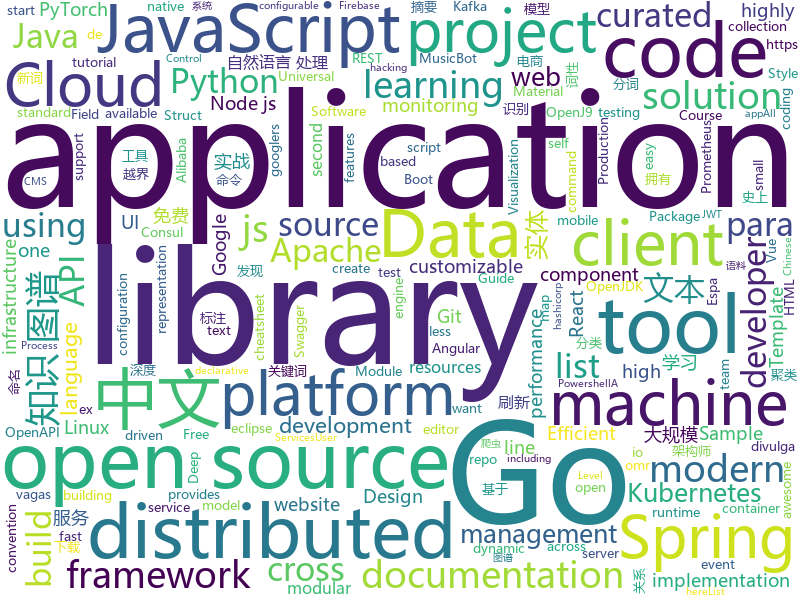

# 2019-10-19
See what the GitHub community is most excited about today.

## python
* [KnowledgeGraphData](https://github.com/ownthink/KnowledgeGraphData)(**441 stars today**): 史上最大规模1.4亿中文知识图谱开源下载
* [Ultra-Light-Fast-Generic-Face-Detector-1MB](https://github.com/Linzaer/Ultra-Light-Fast-Generic-Face-Detector-1MB)(**248 stars today**): 💎1MB轻量级人脸检测模型
* [albert_zh](https://github.com/brightmart/albert_zh)(**44 stars today**): A LITE BERT FOR SELF-SUPERVISED LEARNING OF LANGUAGE REPRESENTATIONS, 海量中文预训练ALBERT模型
* [botorch](https://github.com/pytorch/botorch)(**47 stars today**): Bayesian optimization in PyTorch
* [gpytorch](https://github.com/cornellius-gp/gpytorch)(**12 stars today**): A highly efficient and modular implementation of Gaussian Processes in PyTorch
* [100-Days-of-ML-Code-Chinese-Version](https://github.com/Avik-Jain/100-Days-of-ML-Code-Chinese-Version)(**124 stars today**): Chinese Translation for Machine Learning Infographics
* [sagemaker-python-sdk](https://github.com/aws/sagemaker-python-sdk)(**1 stars today**): A library for training and deploying machine learning models on Amazon SageMaker
* [mlflow](https://github.com/mlflow/mlflow)(**20 stars today**): Open source platform for the machine learning lifecycle
* [wait-for-it](https://github.com/vishnubob/wait-for-it)(**8 stars today**): Pure bash script to test and wait on the availability of a TCP host and port
* [sentry](https://github.com/getsentry/sentry)(**13 stars today**): Sentry is cross-platform application monitoring, with a focus on error reporting.
* [temporal-shift-module](https://github.com/mit-han-lab/temporal-shift-module)(**5 stars today**): [ICCV 2019] TSM: Temporal Shift Module for Efficient Video Understanding.
* [facenet](https://github.com/davidsandberg/facenet)(**11 stars today**): Face recognition using Tensorflow
* [centerface](https://github.com/Star-Clouds/centerface)(**42 stars today**): 
* [awesome-honeypots](https://github.com/paralax/awesome-honeypots)(**15 stars today**): an awesome list of honeypot resources
* [confluent-kafka-python](https://github.com/confluentinc/confluent-kafka-python)(**2 stars today**): Confluent's Apache Kafka Python client
* [Chinese-Text-Classification-Pytorch](https://github.com/649453932/Chinese-Text-Classification-Pytorch)(**20 stars today**): 中文文本分类，TextCNN，TextRNN，FastText，TextRCNN，BiLSTM_Attention，DPCNN，Transformer，基于pytorch，开箱即用。
* [poetry](https://github.com/sdispater/poetry)(**17 stars today**): Python dependency management and packaging made easy.
* [PhoneSploit](https://github.com/metachar/PhoneSploit)(**19 stars today**): Using open Adb ports we can exploit a Andriod Device
* [KnowledgeGraph](https://github.com/ownthink/KnowledgeGraph)(**12 stars today**): 史上最大规模1.4亿知识图谱数据免费下载，知识图谱，通用知识图谱，融合了两千五百多万的实体，拥有亿级别的实体属性关系。
* [Jiagu](https://github.com/ownthink/Jiagu)(**41 stars today**): Jiagu深度学习自然语言处理工具 知识图谱关系抽取 中文分词 词性标注 命名实体识别 情感分析 新词发现 关键词 文本摘要 文本聚类
* [FATE](https://github.com/FederatedAI/FATE)(**31 stars today**): An Industrial Level Federated Learning Framework
* [Mask_RCNN](https://github.com/matterport/Mask_RCNN)(**16 stars today**): Mask R-CNN for object detection and instance segmentation on Keras and TensorFlow
* [dvc](https://github.com/iterative/dvc)(**13 stars today**): 🦉Data Version Control | Git for Data & Models
* [robotframework](https://github.com/robotframework/robotframework)(**7 stars today**): Generic automation framework for acceptance testing and RPA
* [MusicBot](https://github.com/Just-Some-Bots/MusicBot)(**1 stars today**): 🎵The original MusicBot for Discord (formerly SexualRhinoceros/MusicBot)

## java
* [tutorials](https://github.com/eugenp/tutorials)(**25 stars today**): The "REST With Spring" Course:
* [gpmall](https://github.com/2227324689/gpmall)(**13 stars today**): 【咕泡学院实战项目】-基于SpringBoot+Dubbo构建的电商平台-微服务架构、商城、电商、微服务、高并发、kafka、Elasticsearch
* [zuul](https://github.com/Netflix/zuul)(**6 stars today**): Zuul is a gateway service that provides dynamic routing, monitoring, resiliency, security, and more.
* [hutool](https://github.com/looly/hutool)(**26 stars today**): A set of tools that keep Java sweet.
* [spring-cloud-alibaba](https://github.com/alibaba/spring-cloud-alibaba)(**46 stars today**): Spring Cloud Alibaba provides a one-stop solution for application development for the distributed solutions of Alibaba middleware.
* [nifi](https://github.com/apache/nifi)(**4 stars today**): Mirror of Apache NiFi
* [rabbitmq-tutorials](https://github.com/rabbitmq/rabbitmq-tutorials)(**3 stars today**): Tutorials for using RabbitMQ in various ways
* [google-cloud-java](https://github.com/googleapis/google-cloud-java)(**2 stars today**): Google Cloud Client Library for Java
* [wiremock](https://github.com/tomakehurst/wiremock)(**3 stars today**): A tool for mocking HTTP services
* [geoserver](https://github.com/geoserver/geoserver)(**4 stars today**): Official GeoServer repository
* [dbeaver](https://github.com/dbeaver/dbeaver)(**16 stars today**): Free universal database tool and SQL client
* [pmd](https://github.com/pmd/pmd)(**2 stars today**): An extensible multilanguage static code analyzer.
* [SmartRefreshLayout](https://github.com/scwang90/SmartRefreshLayout)(**20 stars today**): 🔥下拉刷新、上拉加载、二级刷新、淘宝二楼、RefreshLayout、OverScroll，Android智能下拉刷新框架，支持越界回弹、越界拖动，具有极强的扩展性，集成了几十种炫酷的Header和 Footer。
* [jmeter](https://github.com/apache/jmeter)(**14 stars today**): Apache JMeter
* [checkstyle](https://github.com/checkstyle/checkstyle)(**3 stars today**): Checkstyle is a development tool to help programmers write Java code that adheres to a coding standard. By default it supports the Google Java Style Guide and Sun Code Conventions, but is highly configurable. It can be invoked with an ANT task and a command line program.
* [dropwizard](https://github.com/dropwizard/dropwizard)(**2 stars today**): A damn simple library for building production-ready RESTful web services.
* [micronaut-core](https://github.com/micronaut-projects/micronaut-core)(**6 stars today**): Micronaut Application Framework
* [rocketmq](https://github.com/apache/rocketmq)(**8 stars today**): Mirror of Apache RocketMQ
* [openj9](https://github.com/eclipse/openj9)(**1 stars today**): Eclipse OpenJ9: A Java Virtual Machine for OpenJDK that's optimized for small footprint, fast start-up, and high throughput. Builds on Eclipse OMR (https://github.com/eclipse/omr) and combines with the Extensions for OpenJDK for OpenJ9 repo.
* [spring-boot](https://github.com/spring-projects/spring-boot)(**30 stars today**): Spring Boot
* [seata](https://github.com/seata/seata)(**20 stars today**): 🔥Seata is an easy-to-use, high-performance, open source distributed transaction solution.
* [HanLP](https://github.com/hankcs/HanLP)(**11 stars today**): 自然语言处理 中文分词 词性标注 命名实体识别 依存句法分析 新词发现 关键词短语提取 自动摘要 文本分类聚类 拼音简繁
* [spring-security](https://github.com/spring-projects/spring-security)(**10 stars today**): Spring Security
* [material-components-android](https://github.com/material-components/material-components-android)(**14 stars today**): Modular and customizable Material Design UI components for Android
* [keycloak](https://github.com/keycloak/keycloak)(**11 stars today**): Open Source Identity and Access Management For Modern Applications and Services

## unknown
* [docs](https://github.com/dapr/docs)(**44 stars today**): User documentation for Dapr
* [spec](https://github.com/oam-dev/spec)(**109 stars today**): The Open Application Model specification
* [the-incredible-pytorch](https://github.com/ritchieng/the-incredible-pytorch)(**30 stars today**): The Incredible PyTorch: a curated list of tutorials, papers, projects, communities and more relating to PyTorch.
* [xg2xg](https://github.com/jhuangtw-dev/xg2xg)(**314 stars today**): by ex-googlers, for ex-googlers - a lookup table of similar tech & services
* [chapter](https://github.com/freeCodeCamp/chapter)(**170 stars today**): A self-hosted event management tool for nonprofits
* [free-api](https://github.com/fangzesheng/free-api)(**296 stars today**): 收集免费的接口服务,做一个api的搬运工
* [awesome-nodejs](https://github.com/sindresorhus/awesome-nodejs)(**13 stars today**): ⚡️Delightful Node.js packages and resources
* [rust-for-js-people](https://github.com/yoshuawuyts/rust-for-js-people)(**32 stars today**): Know JS, want to try Rust, but not sure where to start? This is for you!
* [awesome-libra](https://github.com/reed-hong/awesome-libra)(**144 stars today**): A Curated List of Awesome Facebook Libra Resources
* [YubiKey-Guide](https://github.com/drduh/YubiKey-Guide)(**2 stars today**): Guide to using YubiKey for GPG and SSH
* [vagas](https://github.com/frontendbr/vagas)(**5 stars today**): 🔬Espaço para divulgação de vagas para front-enders.
* [OpenAPI-Specification](https://github.com/OAI/OpenAPI-Specification)(**10 stars today**): The OpenAPI Specification Repository
* [gfwlist](https://github.com/gfwlist/gfwlist)(**12 stars today**): The one and only one gfwlist here
* [angular-interview-questions](https://github.com/sudheerj/angular-interview-questions)(**0 stars today**): List of 300 Angular Interview Questions and answers[WIP]
* [nlp_chinese_corpus](https://github.com/brightmart/nlp_chinese_corpus)(**12 stars today**): 大规模中文自然语言处理语料 Large Scale Chinese Corpus for NLP
* [modern-cpp-features](https://github.com/AnthonyCalandra/modern-cpp-features)(**10 stars today**): A cheatsheet of modern C++ language and library features.
* [kubernetes-the-hard-way](https://github.com/kelseyhightower/kubernetes-the-hard-way)(**11 stars today**): Bootstrap Kubernetes the hard way on Google Cloud Platform. No scripts.
* [awesome-architecture](https://github.com/toutiaoio/awesome-architecture)(**137 stars today**): 架构师技术图谱，助你早日成为架构师
* [bootcamp-gostack-desafio-02](https://github.com/Rocketseat/bootcamp-gostack-desafio-02)(**2 stars today**): Desafio do segundo módulo do Bootcamp GoStack🚀👨🏻‍🚀
* [vagas](https://github.com/backend-br/vagas)(**5 stars today**): ✌️Espaço para divulgação de vagas para backenders
* [AZ-103-MicrosoftAzureAdministrator](https://github.com/MicrosoftLearning/AZ-103-MicrosoftAzureAdministrator)(**1 stars today**): AZ-103: Microsoft Azure Administrator
* [stanford-cs-230-deep-learning](https://github.com/afshinea/stanford-cs-230-deep-learning)(**7 stars today**): VIP cheatsheets for Stanford's CS 230 Deep Learning
* [aws-modern-application-workshop](https://github.com/aws-samples/aws-modern-application-workshop)(**1 stars today**): A tutorial for developers that want to learn about how to build modern applications on top of AWS. You will build a sample website that leverages infrastructure as code, containers, serverless code functions, CI/CD, and more.
* [naming-convention](https://github.com/ktaranov/naming-convention)(**3 stars today**): Templates for naming convention - TSQL, JavaScript, C#, R, Python, Powershell
* [Awesome-Hacking-Resources](https://github.com/vitalysim/Awesome-Hacking-Resources)(**5 stars today**): A collection of hacking / penetration testing resources to make you better!

## javascript
* [strapi](https://github.com/strapi/strapi)(**72 stars today**): 🚀Open source Node.js Headless CMS to easily build customisable APIs
* [generator-jhipster](https://github.com/jhipster/generator-jhipster)(**21 stars today**): Open Source application platform for creating Spring Boot + Angular/React projects in seconds!
* [Rocket.Chat](https://github.com/RocketChat/Rocket.Chat)(**12 stars today**): The ultimate Free Open Source Solution for team communications.
* [vue-cli](https://github.com/vuejs/vue-cli)(**33 stars today**): 🛠️Standard Tooling for Vue.js Development
* [30-seconds-of-code](https://github.com/30-seconds/30-seconds-of-code)(**142 stars today**): A curated collection of useful JavaScript snippets that you can understand in 30 seconds or less.
* [next.js](https://github.com/zeit/next.js)(**35 stars today**): The React Framework
* [react-native-website](https://github.com/facebook/react-native-website)(**3 stars today**): The site and docs for React Native
* [samples](https://github.com/dapr/samples)(**20 stars today**): Dapr Samples Repository
* [docusaurus](https://github.com/facebook/docusaurus)(**30 stars today**): Easy to maintain open source documentation websites.
* [react-vis](https://github.com/uber/react-vis)(**10 stars today**): Data Visualization Components
* [dotenv](https://github.com/motdotla/dotenv)(**2 stars today**): Loads environment variables from .env for nodejs projects.
* [rest-api-nodejs-mongodb](https://github.com/maitraysuthar/rest-api-nodejs-mongodb)(**34 stars today**): A boilerplate for REST API Development with Node.js, Express, and MongoDB
* [lodash](https://github.com/lodash/lodash)(**24 stars today**): A modern JavaScript utility library delivering modularity, performance, & extras.
* [ckeditor5](https://github.com/ckeditor/ckeditor5)(**7 stars today**): Powerful rich text editor framework with a modular architecture, modern integrations and features like collaborative editing.
* [33-js-concepts](https://github.com/leonardomso/33-js-concepts)(**118 stars today**): 📜33 concepts every JavaScript developer should know.
* [vue-multiselect](https://github.com/shentao/vue-multiselect)(**7 stars today**): Universal select/multiselect/tagging component for Vue.js
* [node](https://github.com/nodejs/node)(**37 stars today**): Node.js JavaScript runtime✨🐢🚀✨
* [aos](https://github.com/michalsnik/aos)(**18 stars today**): Animate on scroll library
* [Boostnote](https://github.com/BoostIO/Boostnote)(**22 stars today**): A markdown editor for developers on Mac, Windows and Linux.
* [material-components-web](https://github.com/material-components/material-components-web)(**8 stars today**): Modular and customizable Material Design UI components for the web
* [bootstrap](https://github.com/twbs/bootstrap)(**24 stars today**): The most popular HTML, CSS, and JavaScript framework for developing responsive, mobile first projects on the web.
* [flow-typed](https://github.com/flow-typed/flow-typed)(**0 stars today**): A central repository for Flow library definitions
* [pm2](https://github.com/Unitech/pm2)(**10 stars today**): Node.js Production Process Manager with a built-in Load Balancer.
* [edex-ui](https://github.com/GitSquared/edex-ui)(**14 stars today**): A cross-platform, customizable science fiction terminal emulator with advanced monitoring & touchscreen support.
* [eui](https://github.com/elastic/eui)(**4 stars today**): Elastic UI Framework🙌

## html
* [free-for-dev](https://github.com/ripienaar/free-for-dev)(**184 stars today**): A list of SaaS, PaaS and IaaS offerings that have free tiers of interest to devops and infradev
* [linux-command](https://github.com/jaywcjlove/linux-command)(**75 stars today**): Linux命令大全搜索工具，内容包含Linux命令手册、详解、学习、搜集。https://git.io/linux
* [nndl.github.io](https://github.com/nndl/nndl.github.io)(**23 stars today**): 《神经网络与深度学习》 Neural Network and Deep Learning
* [JavaScript30](https://github.com/wesbos/JavaScript30)(**14 stars today**): 30 Day Vanilla JS Challenge
* [website](https://github.com/kubernetes/website)(**3 stars today**): Kubernetes website and documentation repo:
* [swagger-codegen](https://github.com/swagger-api/swagger-codegen)(**7 stars today**): swagger-codegen contains a template-driven engine to generate documentation, API clients and server stubs in different languages by parsing your OpenAPI / Swagger definition.
* [AR.js](https://github.com/jeromeetienne/AR.js)(**6 stars today**): Efficient Augmented Reality for the Web - 60fps on mobile!
* [data_analysis](https://github.com/zhouwei713/data_analysis)(**9 stars today**): 一些爬虫和数据分析相关实战练习
* [quickstart-js](https://github.com/firebase/quickstart-js)(**3 stars today**): Firebase Quickstart Samples for Web
* [awesome-creative-coding](https://github.com/terkelg/awesome-creative-coding)(**10 stars today**): Creative Coding: Generative Art, Data visualization, Interaction Design, Resources.
* [mu](https://github.com/akkartik/mu)(**31 stars today**): Soul of a tiny new machine. More thorough tests → More comprehensible and rewrite-friendly software → More resilient society.
* [fastText](https://github.com/facebookresearch/fastText)(**14 stars today**): Library for fast text representation and classification.
* [js-xss](https://github.com/leizongmin/js-xss)(**9 stars today**): Sanitize untrusted HTML (to prevent XSS) with a configuration specified by a Whitelist
* [styleguide](https://github.com/google/styleguide)(**16 stars today**): Style guides for Google-originated open-source projects
* [embeddedsw](https://github.com/Xilinx/embeddedsw)(**0 stars today**): Xilinx Embedded Software (embeddedsw) Development
* [flutter-in-action](https://github.com/flutterchina/flutter-in-action)(**22 stars today**): 《Flutter实战》电子书
* [web-moderno](https://github.com/cod3rcursos/web-moderno)(**4 stars today**): 
* [istio.io](https://github.com/istio/istio.io)(**0 stars today**): Source for the istio.io site
* [devcamper-api](https://github.com/bradtraversy/devcamper-api)(**5 stars today**): Backend for devcamper app
* [patchwork](https://github.com/jlord/patchwork)(**0 stars today**): All the Git-it Workshop completers!
* [pcc_2e](https://github.com/ehmatthes/pcc_2e)(**5 stars today**): Online resources for Python Crash Course (Second Edition), from No Starch Press
* [zfaka](https://github.com/zlkbdotnet/zfaka)(**5 stars today**): 免费、安全、稳定、高效的发卡系统，值得拥有!
* [docs](https://github.com/knative/docs)(**2 stars today**): User documentation for Knative components
* [devdocs](https://github.com/magento/devdocs)(**1 stars today**): Magento Developer Documentation
* [500LineorLess_CN](https://github.com/HT524/500LineorLess_CN)(**5 stars today**): 500 line or less 中文翻译计划。

## go
* [dapr](https://github.com/dapr/dapr)(**557 stars today**): Dapr is a portable, event-driven, runtime for building distributed applications across cloud and edge.
* [libpod](https://github.com/containers/libpod)(**19 stars today**): libpod is a library used to create container pods. Home of Podman.
* [nats-server](https://github.com/nats-io/nats-server)(**5 stars today**): High-Performance server for NATS, the cloud native messaging system.
* [client_golang](https://github.com/prometheus/client_golang)(**5 stars today**): Prometheus instrumentation library for Go applications
* [redis](https://github.com/go-redis/redis)(**15 stars today**): Type-safe Redis client for Golang
* [mapstructure](https://github.com/mitchellh/mapstructure)(**8 stars today**): Go library for decoding generic map values into native Go structures.
* [pacgo](https://github.com/danicat/pacgo)(**51 stars today**): A Pac Man clone written in Go (with emojis!)
* [grpc-go](https://github.com/grpc/grpc-go)(**53 stars today**): The Go language implementation of gRPC. HTTP/2 based RPC
* [validator](https://github.com/go-playground/validator)(**7 stars today**): 💯Go Struct and Field validation, including Cross Field, Cross Struct, Map, Slice and Array diving
* [terraform](https://github.com/hashicorp/terraform)(**20 stars today**): Terraform enables you to safely and predictably create, change, and improve infrastructure. It is an open source tool that codifies APIs into declarative configuration files that can be shared amongst team members, treated as code, edited, reviewed, and versioned.
* [consul](https://github.com/hashicorp/consul)(**11 stars today**): Consul is a distributed, highly available, and data center aware solution to connect and configure applications across dynamic, distributed infrastructure.
* [helm](https://github.com/helm/helm)(**27 stars today**): The Kubernetes Package Manager
* [athens](https://github.com/gomods/athens)(**2 stars today**): A Go module datastore and proxy
* [jaeger](https://github.com/jaegertracing/jaeger)(**13 stars today**): CNCF Jaeger, a Distributed Tracing Platform
* [opa](https://github.com/open-policy-agent/opa)(**1 stars today**): An open source, general-purpose policy engine.
* [inlets](https://github.com/inlets/inlets)(**17 stars today**): Expose your local endpoints to the Internet
* [community](https://github.com/kubernetes/community)(**5 stars today**): Kubernetes community content
* [thanos](https://github.com/thanos-io/thanos)(**9 stars today**): Highly available Prometheus setup with long term storage capabilities. CNCF Sandbox project.
* [elastic](https://github.com/olivere/elastic)(**6 stars today**): Elasticsearch client for Go.
* [consul-template](https://github.com/hashicorp/consul-template)(**1 stars today**): Template rendering, notifier, and supervisor for @hashicorp Consul and Vault data.
* [tinygo](https://github.com/tinygo-org/tinygo)(**45 stars today**): Go compiler for small places. Microcontrollers, WebAssembly, and command-line tools. Based on LLVM.
* [k9s](https://github.com/derailed/k9s)(**9 stars today**): 🐶Kubernetes CLI To Manage Your Clusters In Style!
* [jwt-go](https://github.com/dgrijalva/jwt-go)(**12 stars today**): Golang implementation of JSON Web Tokens (JWT)
* [charts](https://github.com/helm/charts)(**19 stars today**): Curated applications for Kubernetes
* [operator-lifecycle-manager](https://github.com/operator-framework/operator-lifecycle-manager)(**2 stars today**): A management framework for extending Kubernetes with Operators

## WordCloud

