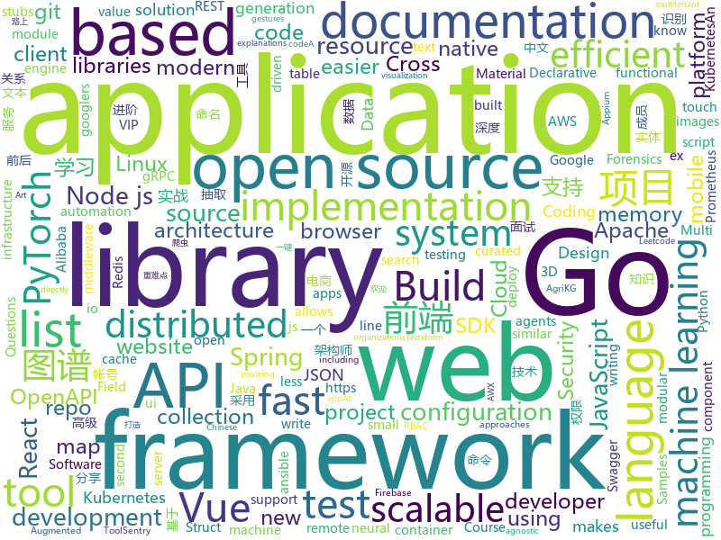

# 2019-10-20
See what the GitHub community is most excited about today.

## python
* [KnowledgeGraphData](https://github.com/ownthink/KnowledgeGraphData)(**431 stars today**): 史上最大规模1.4亿中文知识图谱开源下载
* [python-cheatsheet](https://github.com/gto76/python-cheatsheet)(**98 stars today**): Comprehensive Python Cheatsheet
* [helm-charts](https://github.com/elastic/helm-charts)(**2 stars today**): You know, for Kubernetes
* [tensortrade](https://github.com/notadamking/tensortrade)(**25 stars today**): An open source reinforcement learning framework for training, evaluating, and deploying robust trading agents.
* [botorch](https://github.com/pytorch/botorch)(**56 stars today**): Bayesian optimization in PyTorch
* [100-Days-of-ML-Code-Chinese-Version](https://github.com/Avik-Jain/100-Days-of-ML-Code-Chinese-Version)(**82 stars today**): Chinese Translation for Machine Learning Infographics
* [volatility](https://github.com/volatilityfoundation/volatility)(**6 stars today**): An advanced memory forensics framework
* [Jiagu](https://github.com/ownthink/Jiagu)(**45 stars today**): Jiagu深度学习自然语言处理工具 知识图谱关系抽取 中文分词 词性标注 命名实体识别 情感分析 新词发现 关键词 文本摘要 文本聚类
* [Agriculture_KnowledgeGraph](https://github.com/qq547276542/Agriculture_KnowledgeGraph)(**8 stars today**): 农业知识图谱(AgriKG)：农业领域的信息检索，命名实体识别，关系抽取，智能问答，辅助决策
* [PhoneSploit](https://github.com/metachar/PhoneSploit)(**16 stars today**): Using open Adb ports we can exploit a Andriod Device
* [mlflow](https://github.com/mlflow/mlflow)(**21 stars today**): Open source platform for the machine learning lifecycle
* [gpytorch](https://github.com/cornellius-gp/gpytorch)(**7 stars today**): A highly efficient and modular implementation of Gaussian Processes in PyTorch
* [scikit-learn](https://github.com/scikit-learn/scikit-learn)(**34 stars today**): scikit-learn: machine learning in Python
* [PayloadsAllTheThings](https://github.com/swisskyrepo/PayloadsAllTheThings)(**52 stars today**): A list of useful payloads and bypass for Web Application Security and Pentest/CTF
* [PyTorch-YOLOv3](https://github.com/eriklindernoren/PyTorch-YOLOv3)(**15 stars today**): Minimal PyTorch implementation of YOLOv3
* [centerface](https://github.com/Star-Clouds/centerface)(**29 stars today**): face detection
* [allennlp](https://github.com/allenai/allennlp)(**13 stars today**): An open-source NLP research library, built on PyTorch.
* [ScoutSuite](https://github.com/nccgroup/ScoutSuite)(**11 stars today**): Multi-Cloud Security Auditing Tool
* [sentry](https://github.com/getsentry/sentry)(**17 stars today**): Sentry is cross-platform application monitoring, with a focus on error reporting.
* [awx](https://github.com/ansible/awx)(**10 stars today**): AWX Project
* [nni](https://github.com/microsoft/nni)(**9 stars today**): An open source AutoML toolkit for neural architecture search and hyper-parameter tuning.
* [tiler](https://github.com/nuno-faria/tiler)(**68 stars today**): 👷Build images with images
* [wait-for-it](https://github.com/vishnubob/wait-for-it)(**13 stars today**): Pure bash script to test and wait on the availability of a TCP host and port
* [pytest](https://github.com/pytest-dev/pytest)(**7 stars today**): The pytest framework makes it easy to write small tests, yet scales to support complex functional testing
* [ansible](https://github.com/ansible/ansible)(**33 stars today**): Ansible is a radically simple IT automation platform that makes your applications and systems easier to deploy. Avoid writing scripts or custom code to deploy and update your applications — automate in a language that approaches plain English, using SSH, with no agents to install on remote systems. https://docs.ansible.com/ansible/

## java
* [bazel](https://github.com/bazelbuild/bazel)(**70 stars today**): a fast, scalable, multi-language and extensible build system
* [eladmin](https://github.com/elunez/eladmin)(**70 stars today**): 项目基于 Spring Boot 2.1.0 、 Jpa、 Spring Security、redis、Vue的前后端分离的后台管理系统，项目采用分模块开发方式， 权限控制采用 RBAC，支持数据字典与数据权限管理，支持一键生成前后端代码，支持动态路由
* [openapi-generator](https://github.com/OpenAPITools/openapi-generator)(**16 stars today**): OpenAPI Generator allows generation of API client libraries (SDK generation), server stubs, documentation and configuration automatically given an OpenAPI Spec (v2, v3)
* [grpc-java](https://github.com/grpc/grpc-java)(**8 stars today**): The Java gRPC implementation. HTTP/2 based RPC
* [kafka](https://github.com/apache/kafka)(**19 stars today**): Mirror of Apache Kafka
* [spring-cloud-alibaba](https://github.com/alibaba/spring-cloud-alibaba)(**41 stars today**): Spring Cloud Alibaba provides a one-stop solution for application development for the distributed solutions of Alibaba middleware.
* [tutorials](https://github.com/eugenp/tutorials)(**36 stars today**): The "REST With Spring" Course:
* [spring-framework](https://github.com/spring-projects/spring-framework)(**35 stars today**): Spring Framework
* [jib](https://github.com/GoogleContainerTools/jib)(**30 stars today**): 🏗Build container images for your Java applications.
* [ignite](https://github.com/apache/ignite)(**4 stars today**): Mirror of Apache Ignite
* [cassandra](https://github.com/apache/cassandra)(**8 stars today**): Mirror of Apache Cassandra
* [java-client](https://github.com/appium/java-client)(**0 stars today**): Java language binding for writing Appium Tests, conforms to Mobile JSON Wire & W3C Webdriver Protocol
* [gpmall](https://github.com/2227324689/gpmall)(**32 stars today**): 【咕泡学院实战项目】-基于SpringBoot+Dubbo构建的电商平台-微服务架构、商城、电商、微服务、高并发、kafka、Elasticsearch
* [selenium](https://github.com/SeleniumHQ/selenium)(**15 stars today**): A browser automation framework and ecosystem.
* [janusgraph](https://github.com/JanusGraph/janusgraph)(**5 stars today**): JanusGraph: an open-source, distributed graph database
* [elasticsearch](https://github.com/elastic/elasticsearch)(**37 stars today**): Open Source, Distributed, RESTful Search Engine
* [avro](https://github.com/apache/avro)(**7 stars today**): Apache Avro
* [react-native-image-picker](https://github.com/react-native-community/react-native-image-picker)(**9 stars today**): 🌄A React Native module that allows you to use native UI to select media from the device library or directly from the camera.
* [PhotoView](https://github.com/chrisbanes/PhotoView)(**13 stars today**): Implementation of ImageView for Android that supports zooming, by various touch gestures.
* [guava](https://github.com/google/guava)(**27 stars today**): Google core libraries for Java
* [springfox](https://github.com/springfox/springfox)(**4 stars today**): Automated JSON API documentation for API's built with Spring
* [wildfly](https://github.com/wildfly/wildfly)(**0 stars today**): WildFly Application Server
* [resilience4j](https://github.com/resilience4j/resilience4j)(**9 stars today**): Resilience4j is a fault tolerance library designed for Java8 and functional programming
* [hazelcast](https://github.com/hazelcast/hazelcast)(**8 stars today**): Open Source In-Memory Data Grid
* [zalenium](https://github.com/zalando/zalenium)(**5 stars today**): A flexible and scalable container based Selenium Grid with video recording, live preview, basic auth & dashboard.

## unknown
* [reverse-interview-zh](https://github.com/yifeikong/reverse-interview-zh)(**287 stars today**): 技术面试最后反问面试官的话
* [awesome-architecture](https://github.com/toutiaoio/awesome-architecture)(**157 stars today**): 架构师技术图谱，助你早日成为架构师
* [xg2xg](https://github.com/jhuangtw-dev/xg2xg)(**327 stars today**): by ex-googlers, for ex-googlers - a lookup table of similar tech & services
* [docs](https://github.com/dapr/docs)(**54 stars today**): User documentation for Dapr
* [spec](https://github.com/oam-dev/spec)(**115 stars today**): The Open Application Model specification
* [the-incredible-pytorch](https://github.com/ritchieng/the-incredible-pytorch)(**29 stars today**): The Incredible PyTorch: a curated list of tutorials, papers, projects, communities and more relating to PyTorch.
* [Kimera](https://github.com/MIT-SPARK/Kimera)(**26 stars today**): Index repo for Kimera code
* [You-Dont-Know-JS](https://github.com/getify/You-Dont-Know-JS)(**56 stars today**): A book series on JavaScript. @YDKJS on twitter.
* [vagas](https://github.com/react-brasil/vagas)(**5 stars today**): Espaço para divulgação de vagas relacionadas com React
* [wildcat-vip-account](https://github.com/wuxingsanren/wildcat-vip-account)(**11 stars today**): 野猫VIP帐号 - 每天分享最新的百度网盘svip、迅雷超级会员、苹果id等等各类vip帐号，随取随用，完全免费，绝无套路，欢迎推荐分享给好友！
* [free-programming-books](https://github.com/EbookFoundation/free-programming-books)(**70 stars today**): 📚Freely available programming books
* [leetcode](https://github.com/grandyang/leetcode)(**21 stars today**): Provide all my solutions and explanations in Chinese for all the Leetcode coding problems.
* [LinuxForensics](https://github.com/ashemery/LinuxForensics)(**10 stars today**): Everything related to Linux Forensics
* [blog](https://github.com/yygmind/blog)(**15 stars today**): 我是木易杨，公众号「高级前端进阶」作者，跟着我每周重点攻克一个前端面试重难点。接下来让我带你走进高级前端的世界，在进阶的路上，共勉！
* [developer-roadmap](https://github.com/kamranahmedse/developer-roadmap)(**27 stars today**): Roadmap to becoming a web developer in 2019
* [project-based-learning](https://github.com/tuvtran/project-based-learning)(**57 stars today**): Curated list of project-based tutorials
* [for-linux](https://github.com/docker/for-linux)(**0 stars today**): Docker for Linux
* [bootcamp-gostack-desafio-02](https://github.com/Rocketseat/bootcamp-gostack-desafio-02)(**5 stars today**): Desafio do segundo módulo do Bootcamp GoStack🚀👨🏻‍🚀
* [reactjs-interview-questions](https://github.com/sudheerj/reactjs-interview-questions)(**16 stars today**): List of top 500 ReactJS Interview Questions & Answers....Coding exercise questions are coming soon!!
* [new-grads-2020](https://github.com/cmackenzie1/new-grads-2020)(**4 stars today**): A collection of new grad roles for 2020
* [awesome-dotnet](https://github.com/quozd/awesome-dotnet)(**13 stars today**): A collection of awesome .NET libraries, tools, frameworks and software
* [docker-compose-elasticsearch-kibana](https://github.com/maxyermayank/docker-compose-elasticsearch-kibana)(**2 stars today**): Docker Compose for Elasticsearch and Kibana
* [php-communities](https://github.com/skyeng/php-communities)(**0 stars today**): 
* [established-remote](https://github.com/yanirs/established-remote)(**13 stars today**): A list of established remote companies
* [3D-Machine-Learning](https://github.com/timzhang642/3D-Machine-Learning)(**1 stars today**): A resource repository for 3D machine learning

## javascript
* [33-js-concepts](https://github.com/leonardomso/33-js-concepts)(**106 stars today**): 📜33 concepts every JavaScript developer should know.
* [30-seconds-of-code](https://github.com/30-seconds/30-seconds-of-code)(**121 stars today**): A curated collection of useful JavaScript snippets that you can understand in 30 seconds or less.
* [rest-api-nodejs-mongodb](https://github.com/maitraysuthar/rest-api-nodejs-mongodb)(**38 stars today**): A boilerplate for REST API Development with Node.js, Express, and MongoDB
* [material-ui](https://github.com/mui-org/material-ui)(**44 stars today**): React components for faster and easier web development. Build your own design system, or start with Material Design.
* [vue-cli](https://github.com/vuejs/vue-cli)(**37 stars today**): 🛠️Standard Tooling for Vue.js Development
* [samples](https://github.com/dapr/samples)(**25 stars today**): Dapr Samples Repository
* [vue-enterprise-boilerplate](https://github.com/chrisvfritz/vue-enterprise-boilerplate)(**50 stars today**): An ever-evolving, very opinionated architecture and dev environment for new Vue SPA projects using Vue CLI 3.
* [rollup](https://github.com/rollup/rollup)(**20 stars today**): Next-generation ES module bundler
* [cypress-example-recipes](https://github.com/cypress-io/cypress-example-recipes)(**5 stars today**): Various recipes for testing common scenarios with Cypress
* [mobx](https://github.com/mobxjs/mobx)(**16 stars today**): Simple, scalable state management.
* [fastify](https://github.com/fastify/fastify)(**15 stars today**): Fast and low overhead web framework, for Node.js
* [gridsome](https://github.com/gridsome/gridsome)(**136 stars today**): ⚡️Build lightning fast websites and apps with Vue.js
* [faker.js](https://github.com/Marak/faker.js)(**7 stars today**): generate massive amounts of realistic fake data in Node.js and the browser
* [mapbox-gl-js](https://github.com/mapbox/mapbox-gl-js)(**70 stars today**): Interactive, thoroughly customizable maps in the browser, powered by vector tiles and WebGL
* [Desktop-TikTok](https://github.com/JinJieTan/Desktop-TikTok)(**18 stars today**): 这是一个开源项目，励志打造桌面端的抖音项目，开发成员为SegmentFault前端交流群成员
* [WebWorldWind](https://github.com/NASAWorldWind/WebWorldWind)(**5 stars today**): The NASA WorldWind Javascript SDK (WebWW) includes the library and examples for creating geo-browser web applications and for embedding a 3D globe in HTML5 web pages.
* [swiper](https://github.com/nolimits4web/swiper)(**61 stars today**): Most modern mobile touch slider with hardware accelerated transitions
* [desktop](https://github.com/mattermost/desktop)(**2 stars today**): Mattermost Desktop application for Windows, Mac and Linux
* [gatsby](https://github.com/gatsbyjs/gatsby)(**54 stars today**): Build blazing fast, modern apps and websites with React
* [cvat](https://github.com/opencv/cvat)(**14 stars today**): Powerful and efficient Computer Vision Annotation Tool (CVAT)
* [material-table](https://github.com/mbrn/material-table)(**7 stars today**): Datatable for React based on material-ui's table with additional features
* [ckeditor5](https://github.com/ckeditor/ckeditor5)(**8 stars today**): Powerful rich text editor framework with a modular architecture, modern integrations and features like collaborative editing.
* [next.js](https://github.com/zeit/next.js)(**40 stars today**): The React Framework
* [amphtml](https://github.com/ampproject/amphtml)(**5 stars today**): The AMP web component framework.
* [middy](https://github.com/middyjs/middy)(**19 stars today**): 🛵The stylish Node.js middleware engine for AWS Lambda

## html
* [free-for-dev](https://github.com/ripienaar/free-for-dev)(**490 stars today**): A list of SaaS, PaaS and IaaS offerings that have free tiers of interest to devops and infradev
* [linux-command](https://github.com/jaywcjlove/linux-command)(**100 stars today**): Linux命令大全搜索工具，内容包含Linux命令手册、详解、学习、搜集。https://git.io/linux
* [nndl.github.io](https://github.com/nndl/nndl.github.io)(**24 stars today**): 《神经网络与深度学习》 Neural Network and Deep Learning
* [JavaScript30](https://github.com/wesbos/JavaScript30)(**15 stars today**): 30 Day Vanilla JS Challenge
* [website](https://github.com/kubernetes/website)(**3 stars today**): Kubernetes website and documentation repo:
* [swagger-codegen](https://github.com/swagger-api/swagger-codegen)(**8 stars today**): swagger-codegen contains a template-driven engine to generate documentation, API clients and server stubs in different languages by parsing your OpenAPI / Swagger definition.
* [AR.js](https://github.com/jeromeetienne/AR.js)(**11 stars today**): Efficient Augmented Reality for the Web - 60fps on mobile!
* [data_analysis](https://github.com/zhouwei713/data_analysis)(**8 stars today**): 一些爬虫和数据分析相关实战练习
* [quickstart-js](https://github.com/firebase/quickstart-js)(**5 stars today**): Firebase Quickstart Samples for Web
* [awesome-creative-coding](https://github.com/terkelg/awesome-creative-coding)(**12 stars today**): Creative Coding: Generative Art, Data visualization, Interaction Design, Resources.
* [mu](https://github.com/akkartik/mu)(**34 stars today**): Soul of a tiny new machine. More thorough tests → More comprehensible and rewrite-friendly software → More resilient society.
* [fastText](https://github.com/facebookresearch/fastText)(**20 stars today**): Library for fast text representation and classification.
* [js-xss](https://github.com/leizongmin/js-xss)(**9 stars today**): Sanitize untrusted HTML (to prevent XSS) with a configuration specified by a Whitelist
* [styleguide](https://github.com/google/styleguide)(**22 stars today**): Style guides for Google-originated open-source projects
* [embeddedsw](https://github.com/Xilinx/embeddedsw)(**0 stars today**): Xilinx Embedded Software (embeddedsw) Development
* [flutter-in-action](https://github.com/flutterchina/flutter-in-action)(**17 stars today**): 《Flutter实战》电子书
* [web-moderno](https://github.com/cod3rcursos/web-moderno)(**6 stars today**): 
* [istio.io](https://github.com/istio/istio.io)(**0 stars today**): Source for the istio.io site
* [devcamper-api](https://github.com/bradtraversy/devcamper-api)(**10 stars today**): Backend for devcamper app
* [patchwork](https://github.com/jlord/patchwork)(**1 stars today**): All the Git-it Workshop completers!
* [pcc_2e](https://github.com/ehmatthes/pcc_2e)(**9 stars today**): Online resources for Python Crash Course (Second Edition), from No Starch Press
* [zfaka](https://github.com/zlkbdotnet/zfaka)(**8 stars today**): 免费、安全、稳定、高效的发卡系统，值得拥有!
* [docs](https://github.com/knative/docs)(**3 stars today**): User documentation for Knative components
* [devdocs](https://github.com/magento/devdocs)(**1 stars today**): Magento Developer Documentation
* [500LineorLess_CN](https://github.com/HT524/500LineorLess_CN)(**6 stars today**): 500 line or less 中文翻译计划。

## go
* [dapr](https://github.com/dapr/dapr)(**591 stars today**): Dapr is a portable, event-driven, runtime for building distributed applications across cloud and edge.
* [grpc-go](https://github.com/grpc/grpc-go)(**43 stars today**): The Go language implementation of gRPC. HTTP/2 based RPC
* [helm](https://github.com/helm/helm)(**37 stars today**): The Kubernetes Package Manager
* [charts](https://github.com/helm/charts)(**19 stars today**): Curated applications for Kubernetes
* [terratest](https://github.com/gruntwork-io/terratest)(**5 stars today**): Terratest is a Go library that makes it easier to write automated tests for your infrastructure code.
* [aws-sdk-go](https://github.com/aws/aws-sdk-go)(**22 stars today**): AWS SDK for the Go programming language.
* [go](https://github.com/golang/go)(**67 stars today**): The Go programming language
* [mapstructure](https://github.com/mitchellh/mapstructure)(**7 stars today**): Go library for decoding generic map values into native Go structures.
* [go](https://github.com/json-iterator/go)(**32 stars today**): A high-performance 100% compatible drop-in replacement of "encoding/json"
* [terraform](https://github.com/hashicorp/terraform)(**25 stars today**): Terraform enables you to safely and predictably create, change, and improve infrastructure. It is an open source tool that codifies APIs into declarative configuration files that can be shared amongst team members, treated as code, edited, reviewed, and versioned.
* [tinygo](https://github.com/tinygo-org/tinygo)(**52 stars today**): Go compiler for small places. Microcontrollers, WebAssembly, and command-line tools. Based on LLVM.
* [kudo](https://github.com/kudobuilder/kudo)(**4 stars today**): Kubernetes Universal Declarative Operator (KUDO)
* [client_golang](https://github.com/prometheus/client_golang)(**9 stars today**): Prometheus instrumentation library for Go applications
* [cortex](https://github.com/cortexproject/cortex)(**1 stars today**): A multitenant, horizontally scalable Prometheus as a Service
* [validator](https://github.com/go-playground/validator)(**13 stars today**): 💯Go Struct and Field validation, including Cross Field, Cross Struct, Map, Slice and Array diving
* [buildkit](https://github.com/moby/buildkit)(**6 stars today**): concurrent, cache-efficient, and Dockerfile-agnostic builder toolkit
* [viper](https://github.com/spf13/viper)(**25 stars today**): Go configuration with fangs
* [minikube](https://github.com/kubernetes/minikube)(**24 stars today**): Run Kubernetes locally
* [kind](https://github.com/kubernetes-sigs/kind)(**16 stars today**): Kubernetes IN Docker - local clusters for testing Kubernetes
* [go-cache](https://github.com/patrickmn/go-cache)(**9 stars today**): An in-memory key:value store/cache (similar to Memcached) library for Go, suitable for single-machine applications.
* [gitleaks](https://github.com/zricethezav/gitleaks)(**9 stars today**): Audit git repos for secrets🔑
* [redis](https://github.com/go-redis/redis)(**14 stars today**): Type-safe Redis client for Golang
* [logrus](https://github.com/sirupsen/logrus)(**22 stars today**): Structured, pluggable logging for Go.
* [gitrob](https://github.com/michenriksen/gitrob)(**10 stars today**): Reconnaissance tool for GitHub organizations
* [terraform-provider-azurerm](https://github.com/terraform-providers/terraform-provider-azurerm)(**3 stars today**): Terraform provider for Azure Resource Manager

## WordCloud

