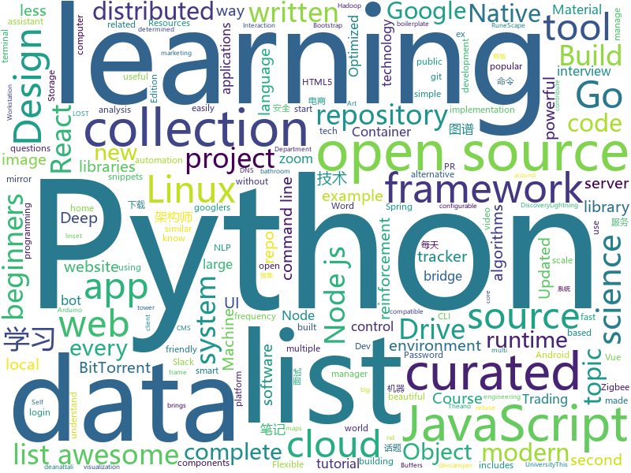

# 2019-10-21
See what the GitHub community is most excited about today.

## python
* [thefuck](https://github.com/nvbn/thefuck)(**78 stars today**): Magnificent app which corrects your previous console command.
* [data-science-ipython-notebooks](https://github.com/donnemartin/data-science-ipython-notebooks)(**40 stars today**): Data science Python notebooks: Deep learning (TensorFlow, Theano, Caffe, Keras), scikit-learn, Kaggle, big data (Spark, Hadoop MapReduce, HDFS), matplotlib, pandas, NumPy, SciPy, Python essentials, AWS, and various command lines.
* [KnowledgeGraphData](https://github.com/ownthink/KnowledgeGraphData)(**211 stars today**): 史上最大规模1.4亿中文知识图谱开源下载
* [home-assistant](https://github.com/home-assistant/home-assistant)(**27 stars today**): 🏡Open source home automation that puts local control and privacy first
* [zipline](https://github.com/quantopian/zipline)(**7 stars today**): Zipline, a Pythonic Algorithmic Trading Library
* [gym](https://github.com/openai/gym)(**18 stars today**): A toolkit for developing and comparing reinforcement learning algorithms.
* [mlcourse.ai](https://github.com/Yorko/mlcourse.ai)(**12 stars today**): Open Machine Learning Course
* [code_snippets](https://github.com/CoreyMSchafer/code_snippets)(**9 stars today**): 
* [Algorithm_Interview_Notes-Chinese](https://github.com/imhuay/Algorithm_Interview_Notes-Chinese)(**53 stars today**): 2018/2019/校招/春招/秋招/算法/机器学习(Machine Learning)/深度学习(Deep Learning)/自然语言处理(NLP)/C/C++/Python/面试笔记
* [tensortrade](https://github.com/notadamking/tensortrade)(**56 stars today**): An open source reinforcement learning framework for training, evaluating, and deploying robust trading agents.
* [pwnagotchi](https://github.com/evilsocket/pwnagotchi)(**116 stars today**): (⌐■_■) - Deep Reinforcement Learning instrumenting bettercap for WiFi pwning.
* [python-telegram-bot](https://github.com/python-telegram-bot/python-telegram-bot)(**14 stars today**): We have made you a wrapper you can't refuse
* [spaCy](https://github.com/explosion/spaCy)(**12 stars today**): 💫Industrial-strength Natural Language Processing (NLP) with Python and Cython
* [you-get](https://github.com/soimort/you-get)(**32 stars today**): ⏬Dumb downloader that scrapes the web
* [botorch](https://github.com/pytorch/botorch)(**27 stars today**): Bayesian optimization in PyTorch
* [unlocker](https://github.com/DrDonk/unlocker)(**13 stars today**): VMware Workstation macOS
* [pwntools](https://github.com/Gallopsled/pwntools)(**12 stars today**): CTF framework and exploit development library
* [youtube-dl](https://github.com/ytdl-org/youtube-dl)(**52 stars today**): Command-line program to download videos from YouTube.com and other video sites
* [kivy](https://github.com/kivy/kivy)(**10 stars today**): Open source UI framework written in Python, running on Windows, Linux, macOS, Android and iOS
* [system-design-primer](https://github.com/donnemartin/system-design-primer)(**73 stars today**): Learn how to design large-scale systems. Prep for the system design interview. Includes Anki flashcards.
* [lost](https://github.com/l3p-cv/lost)(**31 stars today**): Label Objects and Save Time (LOST) - Design your own smart Image Annotation process in a web-based environment.
* [pandas](https://github.com/pandas-dev/pandas)(**23 stars today**): Flexible and powerful data analysis / manipulation library for Python, providing labeled data structures similar to R data.frame objects, statistical functions, and much more
* [awesome-python](https://github.com/vinta/awesome-python)(**104 stars today**): A curated list of awesome Python frameworks, libraries, software and resources
* [instabot.py](https://github.com/instabot-py/instabot.py)(**6 stars today**): Instagram bot. It works without instagram api, need only login and password. Write on python.
* [30-seconds-of-python](https://github.com/30-seconds/30-seconds-of-python)(**37 stars today**): A curated collection of useful Python snippets that you can understand in 30 seconds or less.

## java
* [gpmall](https://github.com/2227324689/gpmall)(**24 stars today**): 【咕泡学院实战项目】-基于SpringBoot+Dubbo构建的电商平台-微服务架构、商城、电商、微服务、高并发、kafka、Elasticsearch
* [Mindustry](https://github.com/Anuken/Mindustry)(**77 stars today**): A sandbox tower defense game
* [Algorithms](https://github.com/williamfiset/Algorithms)(**34 stars today**): A collection of algorithms and data structures
* [guava](https://github.com/google/guava)(**25 stars today**): Google core libraries for Java
* [angel](https://github.com/Angel-ML/angel)(**8 stars today**): A Flexible and Powerful Parameter Server for large-scale machine learning
* [ghidra](https://github.com/NationalSecurityAgency/ghidra)(**24 stars today**): Ghidra is a software reverse engineering (SRE) framework
* [algs4](https://github.com/kevin-wayne/algs4)(**13 stars today**): Algorithms, 4th edition textbook code and libraries
* [data-structures](https://github.com/williamfiset/data-structures)(**10 stars today**): A collection of powerful data structures
* [Interview-Questions](https://github.com/rishabh115/Interview-Questions)(**2 stars today**): Most comprehensive list📋of tech interview questions📘of companies scraped from Geeksforgeeks, CareerCup and Glassdoor.
* [FirebaseUI-Android](https://github.com/firebase/FirebaseUI-Android)(**2 stars today**): Optimized UI components for Firebase
* [strongbox](https://github.com/strongbox/strongbox)(**2 stars today**): Strongbox is an artifact repository manager.
* [Java](https://github.com/TheAlgorithms/Java)(**34 stars today**): All Algorithms implemented in Java
* [jenkins](https://github.com/jenkinsci/jenkins)(**14 stars today**): Jenkins automation server
* [termux-app](https://github.com/termux/termux-app)(**9 stars today**): Android terminal and Linux environment - app repository.
* [keepass2android](https://github.com/PhilippC/keepass2android)(**2 stars today**): Password manager app for Android
* [bazel](https://github.com/bazelbuild/bazel)(**71 stars today**): a fast, scalable, multi-language and extensible build system
* [runelite](https://github.com/runelite/runelite)(**2 stars today**): Open source Old School RuneScape client
* [storm](https://github.com/apache/storm)(**2 stars today**): Mirror of Apache Storm
* [spring-in-action-5-samples](https://github.com/habuma/spring-in-action-5-samples)(**4 stars today**): Home for example code from Spring in Action 5.
* [spring-framework](https://github.com/spring-projects/spring-framework)(**27 stars today**): Spring Framework
* [baritone](https://github.com/cabaletta/baritone)(**3 stars today**): google maps for block game
* [elasticsearch](https://github.com/elastic/elasticsearch)(**19 stars today**): Open Source, Distributed, RESTful Search Engine
* [design-patterns](https://github.com/ZoranPandovski/design-patterns)(**6 stars today**): 💼Design patterns written in different programming languages📐
* [VirtualXposed](https://github.com/android-hacker/VirtualXposed)(**12 stars today**): A simple app to use Xposed without root, unlock the bootloader or modify system image, etc.
* [Telegram](https://github.com/DrKLO/Telegram)(**10 stars today**): Telegram for Android source

## unknown
* [reverse-interview-zh](https://github.com/yifeikong/reverse-interview-zh)(**315 stars today**): 技术面试最后反问面试官的话
* [awesome-libra](https://github.com/reed-hong/awesome-libra)(**70 stars today**): A Curated List of Awesome Facebook Libra Resources
* [coding-interview-university](https://github.com/jwasham/coding-interview-university)(**59 stars today**): A complete computer science study plan to become a software engineer.
* [xg2xg](https://github.com/jhuangtw-dev/xg2xg)(**88 stars today**): by ex-googlers, for ex-googlers - a lookup table of similar tech & services
* [email-marketing-regulations](https://github.com/threeheartsdigital/email-marketing-regulations)(**13 stars today**): A repository of email marketing legislation around the World, compiled by EmailOctopus.
* [interpretability-literature](https://github.com/amarasovic/interpretability-literature)(**14 stars today**): 
* [trackerslist](https://github.com/ngosang/trackerslist)(**19 stars today**): Updated list of public BitTorrent trackers
* [android](https://github.com/LineageOS/android)(**0 stars today**): 
* [docs](https://github.com/dapr/docs)(**10 stars today**): User documentation for Dapr
* [p1xt-guides](https://github.com/P1xt/p1xt-guides)(**5 stars today**): Programming curricula
* [fancyss_history_package](https://github.com/hq450/fancyss_history_package)(**13 stars today**): 科学上网插件的离线安装包储存在这里
* [awesome-dotnet](https://github.com/quozd/awesome-dotnet)(**2 stars today**): A collection of awesome .NET libraries, tools, frameworks and software
* [bootcamp-gostack-desafio-02](https://github.com/Rocketseat/bootcamp-gostack-desafio-02)(**2 stars today**): Desafio do segundo módulo do Bootcamp GoStack🚀👨🏻‍🚀
* [LinuxForensics](https://github.com/ashemery/LinuxForensics)(**9 stars today**): Everything related to Linux Forensics
* [google-10000-english](https://github.com/first20hours/google-10000-english)(**10 stars today**): This repo contains a list of the 10,000 most common English words in order of frequency, as determined by n-gram frequency analysis of the Google's Trillion Word Corpus.
* [awesome-public-datasets](https://github.com/awesomedata/awesome-public-datasets)(**96 stars today**): A topic-centric list of HQ open datasets. PR ☛☛☛
* [Machine-Learning-Notes](https://github.com/Sophia-11/Machine-Learning-Notes)(**11 stars today**): 周志华《机器学习》手推笔记
* [first-contributions](https://github.com/firstcontributions/first-contributions)(**6 stars today**): 🚀✨Help beginners to contribute to open source projects
* [sec-chart](https://github.com/SecWiki/sec-chart)(**20 stars today**): 安全思维导图集合
* [xinmaomi](https://github.com/liqingdi518888/xinmaomi)(**1 stars today**): 新版猫咪官网地址
* [project-based-learning](https://github.com/tuvtran/project-based-learning)(**37 stars today**): Curated list of project-based tutorials
* [awesome-architecture](https://github.com/toutiaoio/awesome-architecture)(**74 stars today**): 架构师技术图谱，助你早日成为架构师
* [pwc](https://github.com/zziz/pwc)(**8 stars today**): Papers with code. Sorted by stars. Updated weekly.
* [awesome-for-beginners](https://github.com/MunGell/awesome-for-beginners)(**19 stars today**): A list of awesome beginners-friendly projects.
* [products](https://github.com/Embdefire/products)(**9 stars today**): 野火所有产品资料的下载链接

## javascript
* [zigbee2mqtt](https://github.com/Koenkk/zigbee2mqtt)(**11 stars today**): Zigbee🐝to MQTT bridge🌉, get rid of your proprietary Zigbee bridges🔨
* [30-seconds-of-code](https://github.com/30-seconds/30-seconds-of-code)(**109 stars today**): A curated collection of useful JavaScript snippets that you can understand in 30 seconds or less.
* [UnblockNeteaseMusic](https://github.com/nondanee/UnblockNeteaseMusic)(**27 stars today**): Revive unavailable songs for Netease Cloud Music
* [switchblade](https://github.com/SwitchbladeBot/switchblade)(**3 stars today**): The open source Discord bot that solves all of your problems.
* [node](https://github.com/nodejs/node)(**39 stars today**): Node.js JavaScript runtime✨🐢🚀✨
* [etcher](https://github.com/balena-io/etcher)(**12 stars today**): Flash OS images to SD cards & USB drives, safely and easily.
* [WebWorldWind](https://github.com/NASAWorldWind/WebWorldWind)(**6 stars today**): The NASA WorldWind Javascript SDK (WebWW) includes the library and examples for creating geo-browser web applications and for embedding a 3D globe in HTML5 web pages.
* [strapi](https://github.com/strapi/strapi)(**80 stars today**): 🚀Open source Node.js Headless CMS to easily build customisable APIs
* [MagicMirror](https://github.com/MichMich/MagicMirror)(**14 stars today**): MagicMirror² is an open source modular smart mirror platform. With a growing list of installable modules, the MagicMirror² allows you to convert your hallway or bathroom mirror into your personal assistant.
* [training](https://github.com/cloud-annotations/training)(**17 stars today**): 🐝Custom Object Detection and Classification Training
* [complete-intro-to-react-v5](https://github.com/btholt/complete-intro-to-react-v5)(**10 stars today**): The Complete Intro to React, the fifth version
* [hyper](https://github.com/zeit/hyper)(**16 stars today**): A terminal built on web technologies
* [priority-queue](https://github.com/rolling-scopes-school/priority-queue)(**0 stars today**): Priority queue task
* [hackathon-starter](https://github.com/sahat/hackathon-starter)(**13 stars today**): A boilerplate for Node.js web applications
* [betaflight-configurator](https://github.com/betaflight/betaflight-configurator)(**2 stars today**): Cross platform configuration tool for the Betaflight firmware
* [gatsby](https://github.com/gatsbyjs/gatsby)(**38 stars today**): Build blazing fast, modern apps and websites with React
* [33-js-concepts](https://github.com/leonardomso/33-js-concepts)(**88 stars today**): 📜33 concepts every JavaScript developer should know.
* [progressbar.js](https://github.com/kimmobrunfeldt/progressbar.js)(**4 stars today**): Responsive and slick progress bars
* [next.js](https://github.com/zeit/next.js)(**28 stars today**): The React Framework
* [Learn-JavaScript](https://github.com/Swap76/Learn-JavaScript)(**7 stars today**): This repository is for beginners to start learning JavaScript from Scratch
* [g2plot](https://github.com/antvis/g2plot)(**3 stars today**): A collection of charts made with the Grammar of Graphics
* [webtorrent](https://github.com/webtorrent/webtorrent)(**9 stars today**): ⚡️Streaming torrent client for the web
* [awesome-react-native](https://github.com/jondot/awesome-react-native)(**11 stars today**): Awesome React Native components, news, tools, and learning material!
* [node_passport_login](https://github.com/bradtraversy/node_passport_login)(**3 stars today**): Node.js login, registration and access control using Express and Passport
* [vue-enterprise-boilerplate](https://github.com/chrisvfritz/vue-enterprise-boilerplate)(**22 stars today**): An ever-evolving, very opinionated architecture and dev environment for new Vue SPA projects using Vue CLI 3.

## html
* [free-for-dev](https://github.com/ripienaar/free-for-dev)(**361 stars today**): A list of SaaS, PaaS and IaaS offerings that have free tiers of interest to devops and infradev
* [pcc_2e](https://github.com/ehmatthes/pcc_2e)(**0 stars today**): Online resources for Python Crash Course (Second Edition), from No Starch Press
* [simple-icons](https://github.com/simple-icons/simple-icons)(**3 stars today**): SVG icons for popular brands
* [REKCARC-TSC-UHT](https://github.com/PKUanonym/REKCARC-TSC-UHT)(**9 stars today**): 清华大学计算机系课程攻略 Guidance for courses in Department of Computer Science and Technology, Tsinghua University
* [tsunamidemocratic.github.io](https://github.com/tsunamidemocratic/tsunamidemocratic.github.io)(**3 stars today**): 
* [Spoon-Knife](https://github.com/octocat/Spoon-Knife)(**1 stars today**): This repo is for demonstration purposes only.
* [bn.javascript.info](https://github.com/javascript-tutorial/bn.javascript.info)(**2 stars today**): Modern JavaScript Tutorial in Bengali
* [beautiful-jekyll](https://github.com/daattali/beautiful-jekyll)(**0 stars today**): ✨Build a beautiful and simple website in literally minutes. Demo at http://deanattali.com/beautiful-jekyll
* [home-assistant.io](https://github.com/home-assistant/home-assistant.io)(**3 stars today**): 📘Home Assistant User documentation
* [stisla](https://github.com/stisla/stisla)(**2 stars today**): Free Bootstrap Admin Template
* [RDR2CollectorsMap](https://github.com/jeanropke/RDR2CollectorsMap)(**0 stars today**): 
* [Hacktoberfest2019](https://github.com/Ishaan28malik/Hacktoberfest2019)(**3 stars today**): for beginners who are going to start with there first PR
* [TrackersListCollection](https://github.com/XIU2/TrackersListCollection)(**17 stars today**): 🎈Updated daily! A list of popular public BitTorrent trackers. / 每天更新！全网热门公共 BitTorrent Tracker 列表！
* [linux-command](https://github.com/jaywcjlove/linux-command)(**90 stars today**): Linux命令大全搜索工具，内容包含Linux命令手册、详解、学习、搜集。https://git.io/linux
* [event-loop](https://github.com/atotic/event-loop)(**11 stars today**): event loop docs
* [awesome-piracy](https://github.com/Igglybuff/awesome-piracy)(**13 stars today**): A curated list of awesome warez and piracy links
* [datasciencecoursera](https://github.com/mGalarnyk/datasciencecoursera)(**2 stars today**): Data Science Repo and blog for John Hopkins Coursera Courses. Please let me know if you have any questions.
* [awesome-creative-coding](https://github.com/terkelg/awesome-creative-coding)(**14 stars today**): Creative Coding: Generative Art, Data visualization, Interaction Design, Resources.
* [devcamper-api](https://github.com/bradtraversy/devcamper-api)(**2 stars today**): Backend for devcamper app
* [bulma-templates](https://github.com/BulmaTemplates/bulma-templates)(**0 stars today**): free flexbox templates built with the bulma css framework
* [fluxion](https://github.com/FluxionNetwork/fluxion)(**2 stars today**): Fluxion is a remake of linset by vk496 with less bugs and enhanced functionality.
* [zfaka](https://github.com/zlkbdotnet/zfaka)(**2 stars today**): 免费、安全、稳定、高效的发卡系统，值得拥有!
* [speedtest](https://github.com/librespeed/speedtest)(**3 stars today**): Self-hosted Speedtest for HTML5 and more. Easy setup, examples, configurable, mobile friendly. Supports PHP, Node, Multiple servers, and more
* [sicp](https://github.com/sarabander/sicp)(**3 stars today**): HTML5/EPUB3 version of SICP
* [svelte-material-ui](https://github.com/hperrin/svelte-material-ui)(**3 stars today**): Svelte Material UI Components

## go
* [dapr](https://github.com/dapr/dapr)(**349 stars today**): Dapr is a portable, event-driven, runtime for building distributed applications across cloud and edge.
* [nats-server](https://github.com/nats-io/nats-server)(**12 stars today**): High-Performance server for NATS, the cloud native messaging system.
* [Amass](https://github.com/OWASP/Amass)(**27 stars today**): In-depth Attack Surface Mapping and Asset Discovery
* [lnd](https://github.com/lightningnetwork/lnd)(**5 stars today**): Lightning Network Daemon⚡️
* [arduino-cli](https://github.com/arduino/arduino-cli)(**3 stars today**): Arduino command line interface
* [hub](https://github.com/github/hub)(**12 stars today**): A command-line tool that makes git easier to use with GitHub.
* [inlets](https://github.com/inlets/inlets)(**24 stars today**): Expose your local endpoints to the Internet
* [dirstalk](https://github.com/stefanoj3/dirstalk)(**7 stars today**): Modern alternative to dirbuster/dirb
* [rclone](https://github.com/rclone/rclone)(**21 stars today**): "rsync for cloud storage" - Google Drive, Amazon Drive, S3, Dropbox, Backblaze B2, One Drive, Swift, Hubic, Cloudfiles, Google Cloud Storage, Yandex Files
* [cobra](https://github.com/spf13/cobra)(**17 stars today**): A Commander for modern Go CLI interactions
* [night-reading-go](https://github.com/developer-learning/night-reading-go)(**8 stars today**): Go 夜读 > Share the related technical topics of Go every week through zoom online live broadcast, every day on the WeChat/Slack to communicate programming technology topics. 每周通过 zoom 在线直播的方式分享 Go 相关的技术话题，每天大家在微信/Slack 上及时沟通交流编程技术话题。
* [helm](https://github.com/helm/helm)(**21 stars today**): The Kubernetes Package Manager
* [tidb](https://github.com/pingcap/tidb)(**16 stars today**): TiDB is an open source distributed HTAP database compatible with the MySQL protocol
* [go-ipfs](https://github.com/ipfs/go-ipfs)(**9 stars today**): IPFS implementation in Go
* [yay](https://github.com/Jguer/yay)(**9 stars today**): Yet another Yogurt - An AUR Helper written in Go
* [syncthing](https://github.com/syncthing/syncthing)(**23 stars today**): Open Source Continuous File Synchronization
* [crc](https://github.com/code-ready/crc)(**3 stars today**): CodeReady Containers is a tool that manages a local OpenShift 4.x cluster optimized for testing and development purposes
* [btcd](https://github.com/btcsuite/btcd)(**3 stars today**): An alternative full node bitcoin implementation written in Go (golang)
* [gocache](https://github.com/eko/gocache)(**46 stars today**): ☔️A complete Go cache library that brings you multiple ways of managing your caches
* [gvisor](https://github.com/google/gvisor)(**8 stars today**): Container Runtime Sandbox
* [AdGuardHome](https://github.com/AdguardTeam/AdGuardHome)(**13 stars today**): Network-wide ads & trackers blocking DNS server
* [kpack](https://github.com/pivotal/kpack)(**5 stars today**): Kubernetes Native Container Build Service
* [buf](https://github.com/bufbuild/buf)(**60 stars today**): A new way of working with Protocol Buffers.
* [koding](https://github.com/koding/koding)(**7 stars today**): The Simplest Way to Manage Your Entire Dev Infrastructure!
* [hugo](https://github.com/gohugoio/hugo)(**36 stars today**): The world’s fastest framework for building websites.

## WordCloud

