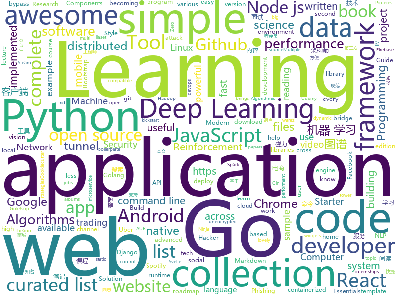

# 2019-10-22
See what the GitHub community is most excited about today.

## python
* [pwnagotchi](https://github.com/evilsocket/pwnagotchi)(**90 stars today**): (⌐■_■) - Deep Reinforcement Learning instrumenting bettercap for WiFi pwning.
* [KnowledgeGraphData](https://github.com/ownthink/KnowledgeGraphData)(**277 stars today**): 史上最大规模1.4亿中文知识图谱开源下载
* [zipline](https://github.com/quantopian/zipline)(**83 stars today**): Zipline, a Pythonic Algorithmic Trading Library
* [tensortrade](https://github.com/notadamking/tensortrade)(**59 stars today**): An open source reinforcement learning framework for training, evaluating, and deploying robust trading agents.
* [awesome-python](https://github.com/vinta/awesome-python)(**127 stars today**): A curated list of awesome Python frameworks, libraries, software and resources
* [chrome_password_grabber](https://github.com/x899/chrome_password_grabber)(**31 stars today**): Get unencrypted 'Saved Password' from Google Chrome
* [home-assistant](https://github.com/home-assistant/home-assistant)(**91 stars today**): 🏡Open source home automation that puts local control and privacy first
* [data-science-ipython-notebooks](https://github.com/donnemartin/data-science-ipython-notebooks)(**45 stars today**): Data science Python notebooks: Deep learning (TensorFlow, Theano, Caffe, Keras), scikit-learn, Kaggle, big data (Spark, Hadoop MapReduce, HDFS), matplotlib, pandas, NumPy, SciPy, Python essentials, AWS, and various command lines.
* [machine_learning_examples](https://github.com/lazyprogrammer/machine_learning_examples)(**5 stars today**): A collection of machine learning examples and tutorials.
* [sherlock](https://github.com/sherlock-project/sherlock)(**38 stars today**): 🔎Find usernames across social networks
* [kubectl-aliases](https://github.com/ahmetb/kubectl-aliases)(**17 stars today**): Programmatically generated handy kubectl aliases.
* [Deep-Learning-Papers-Reading-Roadmap](https://github.com/floodsung/Deep-Learning-Papers-Reading-Roadmap)(**11 stars today**): Deep Learning papers reading roadmap for anyone who are eager to learn this amazing tech!
* [neural-networks-and-deep-learning](https://github.com/mnielsen/neural-networks-and-deep-learning)(**6 stars today**): Code samples for my book "Neural Networks and Deep Learning"
* [keras](https://github.com/keras-team/keras)(**23 stars today**): Deep Learning for humans
* [backtrader](https://github.com/backtrader/backtrader)(**6 stars today**): Python Backtesting library for trading strategies
* [cookiecutter-django](https://github.com/pydanny/cookiecutter-django)(**4 stars today**): Cookiecutter Django is a framework for jumpstarting production-ready Django projects quickly.
* [Algorithm_Interview_Notes-Chinese](https://github.com/imhuay/Algorithm_Interview_Notes-Chinese)(**42 stars today**): 2018/2019/校招/春招/秋招/算法/机器学习(Machine Learning)/深度学习(Deep Learning)/自然语言处理(NLP)/C/C++/Python/面试笔记
* [c9-python-getting-started](https://github.com/microsoft/c9-python-getting-started)(**49 stars today**): Sample code for Channel 9 Python for Beginners course
* [YouCompleteMe](https://github.com/ycm-core/YouCompleteMe)(**10 stars today**): A code-completion engine for Vim
* [nanovna-saver](https://github.com/mihtjel/nanovna-saver)(**4 stars today**): A tool for reading, displaying and saving data from the NanoVNA
* [PayloadsAllTheThings](https://github.com/swisskyrepo/PayloadsAllTheThings)(**22 stars today**): A list of useful payloads and bypass for Web Application Security and Pentest/CTF
* [youtube-dl](https://github.com/ytdl-org/youtube-dl)(**37 stars today**): Command-line program to download videos from YouTube.com and other video sites
* [flask](https://github.com/pallets/flask)(**25 stars today**): The Python micro framework for building web applications.
* [mypy](https://github.com/python/mypy)(**36 stars today**): Optional static typing for Python 3 and 2 (PEP 484)
* [pythia](https://github.com/facebookresearch/pythia)(**4 stars today**): A modular framework for vision & language multimodal research from Facebook AI Research (FAIR)

## java
* [Java](https://github.com/TheAlgorithms/Java)(**40 stars today**): All Algorithms implemented in Java
* [Algorithms](https://github.com/williamfiset/Algorithms)(**30 stars today**): A collection of algorithms and data structures
* [Mindustry](https://github.com/Anuken/Mindustry)(**39 stars today**): A sandbox tower defense game
* [gpmall](https://github.com/2227324689/gpmall)(**114 stars today**): 【咕泡学院实战项目】-基于SpringBoot+Dubbo构建的电商平台-微服务架构、商城、电商、微服务、高并发、kafka、Elasticsearch
* [bazel](https://github.com/bazelbuild/bazel)(**24 stars today**): a fast, scalable, multi-language and extensible build system
* [magnetW](https://github.com/dengyuhan/magnetW)(**10 stars today**): 磁力搜网页版 - 磁力链接聚合搜索 - https://bt.lansou.pw
* [CtCI-6th-Edition](https://github.com/careercup/CtCI-6th-Edition)(**8 stars today**): Cracking the Coding Interview 6th Ed. Solutions
* [data-structures](https://github.com/williamfiset/data-structures)(**15 stars today**): A collection of powerful data structures
* [algs4](https://github.com/kevin-wayne/algs4)(**9 stars today**): Algorithms, 4th edition textbook code and libraries
* [Pix-EzViewer](https://github.com/Notsfsssf/Pix-EzViewer)(**11 stars today**): 一个支持免代理直连及查看动图的第三方Pixiv android客户端
* [cim](https://github.com/crossoverJie/cim)(**12 stars today**): 📲cim(cross IM) 适用于开发者的分布式即时通讯系统
* [processing](https://github.com/processing/processing)(**2 stars today**): Source code for the Processing Core and Development Environment (PDE)
* [Telegram](https://github.com/DrKLO/Telegram)(**10 stars today**): Telegram for Android source
* [views-widgets-samples](https://github.com/android/views-widgets-samples)(**5 stars today**): Multiple samples showing the best practices in views-widgets on Android.
* [ripme](https://github.com/RipMeApp/ripme)(**1 stars today**): Downloads albums in bulk
* [spring-in-action-5-samples](https://github.com/habuma/spring-in-action-5-samples)(**3 stars today**): Home for example code from Spring in Action 5.
* [Signal-Android](https://github.com/signalapp/Signal-Android)(**8 stars today**): A private messenger for Android.
* [VirtualXposed](https://github.com/android-hacker/VirtualXposed)(**17 stars today**): A simple app to use Xposed without root, unlock the bootloader or modify system image, etc.
* [mit-deep-learning-book-pdf](https://github.com/janishar/mit-deep-learning-book-pdf)(**7 stars today**): MIT Deep Learning Book in PDF format (complete and parts) by Ian Goodfellow, Yoshua Bengio and Aaron Courville
* [MyBookshelf](https://github.com/gedoor/MyBookshelf)(**11 stars today**): 阅读是一款可以自定义来源阅读网络内容的工具，为广大网络文学爱好者提供一种方便、快捷舒适的试读体验。
* [booksource](https://github.com/guolindev/booksource)(**4 stars today**): 《第一行代码 第2版》全书源代码
* [Anki-Android](https://github.com/ankidroid/Anki-Android)(**4 stars today**): AnkiDroid: Anki on Android
* [spring-framework](https://github.com/spring-projects/spring-framework)(**33 stars today**): Spring Framework
* [termux-app](https://github.com/termux/termux-app)(**6 stars today**): Android terminal and Linux environment - app repository.
* [Essentials](https://github.com/EssentialsX/Essentials)(**1 stars today**): EssentialsX: A maintained fork of Essentials 2.x.

## unknown
* [p1xt-guides](https://github.com/P1xt/p1xt-guides)(**5 stars today**): Programming curricula
* [reverse-interview-zh](https://github.com/yifeikong/reverse-interview-zh)(**412 stars today**): 技术面试最后反问面试官的话
* [deep-learning-drizzle](https://github.com/kmario23/deep-learning-drizzle)(**31 stars today**): Drench yourself in Deep Learning, Reinforcement Learning, Machine Learning, Computer Vision, and NLP by learning from these exciting lectures!!
* [uber_go_guide_cn](https://github.com/xxjwxc/uber_go_guide_cn)(**55 stars today**): The Uber Go Style Guide . Uber Go 语言编码规范中文版
* [summer2020internships](https://github.com/elaine-zheng/summer2020internships)(**16 stars today**): Keep track of internships for Summer 2020 for undergraduates interested in tech./SWE/related fields
* [Machine-Learning-Yearning-Vietnamese-Translation](https://github.com/aivivn/Machine-Learning-Yearning-Vietnamese-Translation)(**15 stars today**): 
* [awesome-architecture](https://github.com/toutiaoio/awesome-architecture)(**47 stars today**): 架构师技术图谱，助你早日成为架构师
* [coding-interview-university](https://github.com/jwasham/coding-interview-university)(**65 stars today**): A complete computer science study plan to become a software engineer.
* [awesome-cli-apps](https://github.com/agarrharr/awesome-cli-apps)(**21 stars today**): 🖥📊🕹🛠A curated list of command line apps
* [awesome](https://github.com/sindresorhus/awesome)(**73 stars today**): 😎Awesome lists about all kinds of interesting topics
* [developer-roadmap](https://github.com/kamranahmedse/developer-roadmap)(**43 stars today**): Roadmap to becoming a web developer in 2019
* [arduino-pro-ide](https://github.com/arduino/arduino-pro-ide)(**35 stars today**): The Arduino IDE for advanced users and developers. Experimental alpha version.
* [free-programming-books](https://github.com/EbookFoundation/free-programming-books)(**71 stars today**): 📚Freely available programming books
* [every-programmer-should-know](https://github.com/mtdvio/every-programmer-should-know)(**10 stars today**): A collection of (mostly) technical things every software developer should know
* [1024app-android](https://github.com/yuuwill/1024app-android)(**7 stars today**): 草榴官方客户端，小草客户端，Android
* [sec-chart](https://github.com/SecWiki/sec-chart)(**15 stars today**): 安全思维导图集合
* [awesome-remote-job](https://github.com/lukasz-madon/awesome-remote-job)(**8 stars today**): A curated list of awesome remote jobs and resources. Inspired by https://github.com/vinta/awesome-python
* [interpretability-literature](https://github.com/amarasovic/interpretability-literature)(**14 stars today**): 
* [Xiaomi_Kernel_OpenSource](https://github.com/MiCode/Xiaomi_Kernel_OpenSource)(**4 stars today**): Xiaomi Mobile Phone Kernel OpenSource
* [Awesome-Hacking](https://github.com/Hack-with-Github/Awesome-Hacking)(**14 stars today**): A collection of various awesome lists for hackers, pentesters and security researchers
* [awesome-public-datasets](https://github.com/awesomedata/awesome-public-datasets)(**40 stars today**): A topic-centric list of HQ open datasets. PR ☛☛☛
* [gans-awesome-applications](https://github.com/nashory/gans-awesome-applications)(**3 stars today**): Curated list of awesome GAN applications and demo
* [svelte-handbook](https://github.com/flaviocopes/svelte-handbook)(**17 stars today**): The Svelte Handbook - HELP ME PROOFREAD THIS DRAFT
* [AMD_Vanilla](https://github.com/AMD-OSX/AMD_Vanilla)(**0 stars today**): Native AMD macOS via Clover KernelToPatch
* [modern-javascript](https://github.com/iamshaunjp/modern-javascript)(**0 stars today**): All lecture files from the Modern JavaScript (Novice to Ninja) course on Udemy.

## javascript
* [33-js-concepts](https://github.com/leonardomso/33-js-concepts)(**46 stars today**): 📜33 concepts every JavaScript developer should know.
* [30-seconds-of-code](https://github.com/30-seconds/30-seconds-of-code)(**214 stars today**): A curated collection of useful JavaScript snippets that you can understand in 30 seconds or less.
* [react-developer-roadmap](https://github.com/adam-golab/react-developer-roadmap)(**18 stars today**): Roadmap to becoming a React developer in 2019
* [WebGL-Fluid-Simulation](https://github.com/PavelDoGreat/WebGL-Fluid-Simulation)(**10 stars today**): Play with fluids in your browser (works even on mobile)
* [bypass-paywalls-chrome](https://github.com/iamadamdev/bypass-paywalls-chrome)(**10 stars today**): Bypass Paywalls for Chrome
* [javascript-algorithms](https://github.com/trekhleb/javascript-algorithms)(**44 stars today**): 📝Algorithms and data structures implemented in JavaScript with explanations and links to further readings
* [33-js-concepts](https://github.com/stephentian/33-js-concepts)(**10 stars today**): 📜每个 JavaScript 工程师都应懂的33个概念 @leonardomso
* [react-redux-firebase](https://github.com/prescottprue/react-redux-firebase)(**4 stars today**): Redux bindings for Firebase. Includes React Hooks and Higher Order Components.
* [markdown-here](https://github.com/adam-p/markdown-here)(**31 stars today**): Google Chrome, Firefox, and Thunderbird extension that lets you write email in Markdown and render it before sending.
* [reactstrap](https://github.com/reactstrap/reactstrap)(**5 stars today**): Simple React Bootstrap 4 components
* [react-native-starter](https://github.com/flatlogic/react-native-starter)(**7 stars today**): 🚀A powerful react native starter template that bootstraps development of your mobile application
* [zigbee2mqtt](https://github.com/Koenkk/zigbee2mqtt)(**59 stars today**): Zigbee🐝to MQTT bridge🌉, get rid of your proprietary Zigbee bridges🔨
* [Advanced-React](https://github.com/wesbos/Advanced-React)(**2 stars today**): Starter Files and Solutions for Full Stack Advanced React and GraphQL
* [hexo](https://github.com/hexojs/hexo)(**17 stars today**): A fast, simple & powerful blog framework, powered by Node.js.
* [WebGoat](https://github.com/WebGoat/WebGoat)(**5 stars today**): WebGoat 8.0
* [complete-node-bootcamp](https://github.com/jonasschmedtmann/complete-node-bootcamp)(**2 stars today**): Starter files, final projects and FAQ for my Complete Node.js Bootcamp
* [matter-js](https://github.com/liabru/matter-js)(**7 stars today**): a 2D rigid body physics engine for the web ▲● ■
* [hackathon-starter](https://github.com/sahat/hackathon-starter)(**11 stars today**): A boilerplate for Node.js web applications
* [Villain](https://github.com/btzr-io/Villain)(**2 stars today**): An open source web-based comic book reader.
* [DPlayer](https://github.com/MoePlayer/DPlayer)(**8 stars today**): 🍭Wow, such a lovely HTML5 danmaku video player
* [gatsby](https://github.com/gatsbyjs/gatsby)(**34 stars today**): Build blazing fast, modern apps and websites with React
* [How-To-Ask-Questions-The-Smart-Way](https://github.com/ryanhanwu/How-To-Ask-Questions-The-Smart-Way)(**18 stars today**): 本文原文由知名 Hacker Eric S. Raymond 所撰寫，教你如何正確的提出技術問題並獲得你滿意的答案。
* [Script](https://github.com/NobyDa/Script)(**12 stars today**): 
* [node](https://github.com/nodejs/node)(**36 stars today**): Node.js JavaScript runtime✨🐢🚀✨
* [iptv](https://github.com/iptv-org/iptv)(**46 stars today**): Collection of 8000+ publicly available IPTV channels from all over the world

## html
* [free-for-dev](https://github.com/ripienaar/free-for-dev)(**540 stars today**): A list of SaaS, PaaS and IaaS offerings that have free tiers of interest to devops and infradev
* [linux-command](https://github.com/jaywcjlove/linux-command)(**68 stars today**): Linux命令大全搜索工具，内容包含Linux命令手册、详解、学习、搜集。https://git.io/linux
* [algorithm004-04](https://github.com/algorithm004-04/algorithm004-04)(**1 stars today**): 
* [hugo-academic](https://github.com/gcushen/hugo-academic)(**4 stars today**): 📝The website builder for Hugo. Build and deploy a beautiful website in minutes!
* [awesome-piracy](https://github.com/Igglybuff/awesome-piracy)(**14 stars today**): A curated list of awesome warez and piracy links
* [dragon-book-exercise-answers](https://github.com/fool2fish/dragon-book-exercise-answers)(**9 stars today**): Compilers Principles, Techniques, & Tools (purple dragon book) second edition exercise answers. 编译原理（紫龙书）第2版习题答案。
* [personal-website](https://github.com/github/personal-website)(**10 stars today**): Code that'll help you kickstart a personal website that showcases your work as a software developer.
* [web-api-auth-examples](https://github.com/spotify/web-api-auth-examples)(**2 stars today**): Basic examples to authenticate and fetch data using the Spotify Web API
* [blog_os](https://github.com/phil-opp/blog_os)(**5 stars today**): Writing an OS in Rust
* [REKCARC-TSC-UHT](https://github.com/PKUanonym/REKCARC-TSC-UHT)(**13 stars today**): 清华大学计算机系课程攻略 Guidance for courses in Department of Computer Science and Technology, Tsinghua University
* [skill-map](https://github.com/TeamStuQ/skill-map)(**5 stars today**): 程序员技能图谱
* [learning-area](https://github.com/mdn/learning-area)(**2 stars today**): Github repo for the MDN Learning Area.
* [Coursera-ML-AndrewNg-Notes](https://github.com/fengdu78/Coursera-ML-AndrewNg-Notes)(**41 stars today**): 吴恩达老师的机器学习课程个人笔记
* [styleguide](https://github.com/google/styleguide)(**15 stars today**): Style guides for Google-originated open-source projects
* [sicp](https://github.com/sarabander/sicp)(**5 stars today**): HTML5/EPUB3 version of SICP
* [fluxion](https://github.com/FluxionNetwork/fluxion)(**3 stars today**): Fluxion is a remake of linset by vk496 with less bugs and enhanced functionality.
* [shellphish](https://github.com/thelinuxchoice/shellphish)(**2 stars today**): Phishing Tool for 18 social media: Instagram, Facebook, Snapchat, Github, Twitter, Yahoo, Protonmail, Spotify, Netflix, Linkedin, Wordpress, Origin, Steam, Microsoft, InstaFollowers, Gitlab, Pinterest
* [home-assistant.io](https://github.com/home-assistant/home-assistant.io)(**2 stars today**): 📘Home Assistant User documentation
* [Web-Security-Learning](https://github.com/CHYbeta/Web-Security-Learning)(**5 stars today**): Web-Security-Learning
* [blackeye](https://github.com/thelinuxchoice/blackeye)(**3 stars today**): The most complete Phishing Tool, with 32 templates +1 customizable
* [fe4ml-zh](https://github.com/apachecn/fe4ml-zh)(**3 stars today**): 📖[译] 面向机器学习的特征工程
* [JavaScript30](https://github.com/wesbos/JavaScript30)(**3 stars today**): 30 Day Vanilla JS Challenge
* [tsunamidemocratic.github.io](https://github.com/tsunamidemocratic/tsunamidemocratic.github.io)(**0 stars today**): 
* [cs231n.github.io](https://github.com/cs231n/cs231n.github.io)(**5 stars today**): Public facing notes page
* [Markdown-Resume](https://github.com/CyC2018/Markdown-Resume)(**1 stars today**): ⭐️Markdown 简历模版

## go
* [dapr](https://github.com/dapr/dapr)(**452 stars today**): Dapr is a portable, event-driven, runtime for building distributed applications across cloud and edge.
* [bettercap](https://github.com/bettercap/bettercap)(**20 stars today**): The Swiss Army knife for 802.11, BLE and Ethernet networks reconnaissance and MITM attacks.
* [gocache](https://github.com/eko/gocache)(**38 stars today**): ☔️A complete Go cache library that brings you multiple ways of managing your caches
* [nats-server](https://github.com/nats-io/nats-server)(**51 stars today**): High-Performance server for NATS, the cloud native messaging system.
* [Amass](https://github.com/OWASP/Amass)(**27 stars today**): In-depth Attack Surface Mapping and Asset Discovery
* [gin](https://github.com/gin-gonic/gin)(**30 stars today**): Gin is a HTTP web framework written in Go (Golang). It features a Martini-like API with much better performance -- up to 40 times faster. If you need smashing performance, get yourself some Gin.
* [serf](https://github.com/hashicorp/serf)(**2 stars today**): Service orchestration and management tool.
* [lnd](https://github.com/lightningnetwork/lnd)(**9 stars today**): Lightning Network Daemon⚡️
* [cli](https://github.com/docker/cli)(**5 stars today**): The Docker CLI
* [yay](https://github.com/Jguer/yay)(**8 stars today**): Yet another Yogurt - An AUR Helper written in Go
* [trivy](https://github.com/aquasecurity/trivy)(**8 stars today**): A Simple and Comprehensive Vulnerability Scanner for Containers, Suitable for CI
* [inlets](https://github.com/inlets/inlets)(**13 stars today**): Expose your local endpoints to the Internet
* [consul](https://github.com/hashicorp/consul)(**9 stars today**): Consul is a distributed, highly available, and data center aware solution to connect and configure applications across dynamic, distributed infrastructure.
* [gost](https://github.com/ginuerzh/gost)(**3 stars today**): GO Simple Tunnel - a simple tunnel written in golang
* [clash](https://github.com/Dreamacro/clash)(**22 stars today**): A rule-based tunnel in Go.
* [go-ipfs](https://github.com/ipfs/go-ipfs)(**8 stars today**): IPFS implementation in Go
* [k3sup](https://github.com/alexellis/k3sup)(**17 stars today**): k3sup: from Zero to KUBECONFIG in < 1 min
* [nomad](https://github.com/hashicorp/nomad)(**4 stars today**): Nomad is an easy-to-use, flexible, and performant workload orchestrator that can deploy a mix of microservice, batch, containerized, and non-containerized applications. Nomad is easy to operate and scale and has native Consul and Vault integrations.
* [Go](https://github.com/TheAlgorithms/Go)(**13 stars today**): Algorithms Implemented in GoLang
* [gopl.io](https://github.com/adonovan/gopl.io)(**6 stars today**): Example programs from "The Go Programming Language"
* [hub](https://github.com/github/hub)(**18 stars today**): A command-line tool that makes git easier to use with GitHub.
* [operator-sdk](https://github.com/operator-framework/operator-sdk)(**6 stars today**): SDK for building Kubernetes applications. Provides high level APIs, useful abstractions, and project scaffolding.
* [gox](https://github.com/mitchellh/gox)(**9 stars today**): A dead simple, no frills Go cross compile tool
* [golang-gin-realworld-example-app](https://github.com/gothinkster/golang-gin-realworld-example-app)(**1 stars today**): Exemplary real world application built with Golang + Gin
* [go](https://github.com/json-iterator/go)(**48 stars today**): A high-performance 100% compatible drop-in replacement of "encoding/json"

## WordCloud

