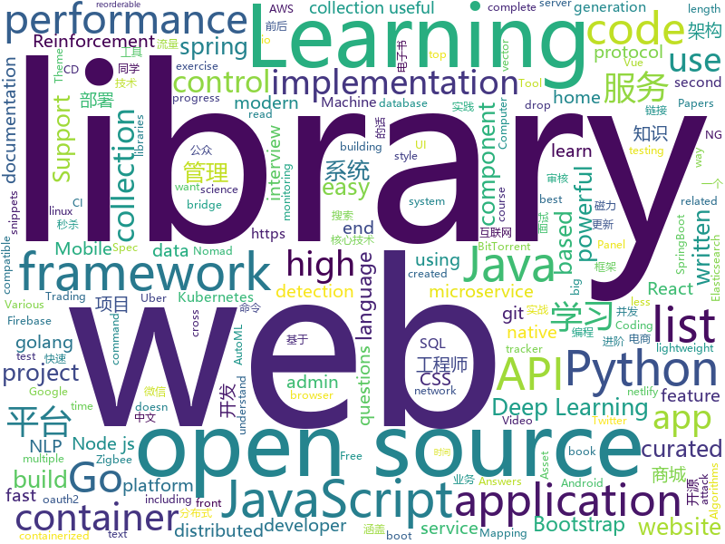

# 2019-10-23
See what the GitHub community is most excited about today.

## python
* [zipline](https://github.com/quantopian/zipline)(**76 stars today**): Zipline, a Pythonic Algorithmic Trading Library
* [data-science-ipython-notebooks](https://github.com/donnemartin/data-science-ipython-notebooks)(**20 stars today**): Data science Python notebooks: Deep learning (TensorFlow, Theano, Caffe, Keras), scikit-learn, Kaggle, big data (Spark, Hadoop MapReduce, HDFS), matplotlib, pandas, NumPy, SciPy, Python essentials, AWS, and various command lines.
* [thefuck](https://github.com/nvbn/thefuck)(**178 stars today**): Magnificent app which corrects your previous console command.
* [awesome-python](https://github.com/vinta/awesome-python)(**139 stars today**): A curated list of awesome Python frameworks, libraries, software and resources
* [pwnagotchi](https://github.com/evilsocket/pwnagotchi)(**219 stars today**): (⌐■_■) - Deep Reinforcement Learning instrumenting bettercap for WiFi pwning.
* [tensortrade](https://github.com/notadamking/tensortrade)(**107 stars today**): An open source reinforcement learning framework for training, evaluating, and deploying robust trading agents.
* [sherlock](https://github.com/sherlock-project/sherlock)(**18 stars today**): 🔎Find usernames across social networks
* [c9-python-getting-started](https://github.com/microsoft/c9-python-getting-started)(**55 stars today**): Sample code for Channel 9 Python for Beginners course
* [NLP-progress](https://github.com/sebastianruder/NLP-progress)(**18 stars today**): Repository to track the progress in Natural Language Processing (NLP), including the datasets and the current state-of-the-art for the most common NLP tasks.
* [nni](https://github.com/microsoft/nni)(**7 stars today**): An open source AutoML toolkit for neural architecture search and hyper-parameter tuning.
* [KubeOperator](https://github.com/KubeOperator/KubeOperator)(**23 stars today**): KubeOperator 是一个开源项目，通过 Web UI 在 VMware、OpenStack、物理机上一键部署和管理生产级别的 Kubernetes 集群。
* [anomaly-detection-resources](https://github.com/yzhao062/anomaly-detection-resources)(**7 stars today**): Anomaly detection related books, papers, videos, and toolboxes
* [mypy](https://github.com/python/mypy)(**9 stars today**): Optional static typing for Python 3 and 2 (PEP 484)
* [twint](https://github.com/twintproject/twint)(**14 stars today**): An advanced Twitter scraping & OSINT tool written in Python that doesn't use Twitter's API, allowing you to scrape a user's followers, following, Tweets and more while evading most API limitations.
* [Chinese-Word-Vectors](https://github.com/Embedding/Chinese-Word-Vectors)(**8 stars today**): 100+ Chinese Word Vectors 上百种预训练中文词向量
* [bert-as-service](https://github.com/hanxiao/bert-as-service)(**14 stars today**): Mapping a variable-length sentence to a fixed-length vector using BERT model
* [Towards-Realtime-MOT](https://github.com/Zhongdao/Towards-Realtime-MOT)(**3 stars today**): Joint Detection and Embedding for fast multi-object tracking
* [OpsManage](https://github.com/welliamcao/OpsManage)(**7 stars today**): 自动化运维平台: 代码及应用部署CI/CD、资产管理CMDB、计划任务管理平台、SQL审核|回滚、任务调度、站内WIKI
* [cfn-python-lint](https://github.com/aws-cloudformation/cfn-python-lint)(**3 stars today**): CloudFormation Linter
* [30-seconds-of-python](https://github.com/30-seconds/30-seconds-of-python)(**74 stars today**): A curated collection of useful Python snippets that you can understand in 30 seconds or less.
* [diff-match-patch](https://github.com/google/diff-match-patch)(**14 stars today**): Diff Match Patch is a high-performance library in multiple languages that manipulates plain text.
* [ancient-text-restoration](https://github.com/sommerschield/ancient-text-restoration)(**7 stars today**): Restoring ancient text using deep learning: a case study on Greek epigraphy.
* [home-assistant](https://github.com/home-assistant/home-assistant)(**47 stars today**): 🏡Open source home automation that puts local control and privacy first
* [MobileNet-SSD](https://github.com/chuanqi305/MobileNet-SSD)(**4 stars today**): Caffe implementation of Google MobileNet SSD detection network, with pretrained weights on VOC0712 and mAP=0.727.
* [Archery](https://github.com/hhyo/Archery)(**6 stars today**): SQL 审核查询平台

## java
* [gpmall](https://github.com/2227324689/gpmall)(**63 stars today**): 【咕泡学院实战项目】-基于SpringBoot+Dubbo构建的电商平台-微服务架构、商城、电商、微服务、高并发、kafka、Elasticsearch
* [magnetW](https://github.com/dengyuhan/magnetW)(**41 stars today**): 磁力搜网页版 - 磁力链接聚合搜索 - https://bt.lansou.pw
* [spring-boot](https://github.com/spring-projects/spring-boot)(**40 stars today**): Spring Boot
* [Java](https://github.com/TheAlgorithms/Java)(**155 stars today**): All Algorithms implemented in Java
* [easyexcel](https://github.com/alibaba/easyexcel)(**61 stars today**): 快速、简单避免OOM的java处理Excel工具
* [Sentinel](https://github.com/alibaba/Sentinel)(**22 stars today**): A lightweight powerful flow control component enabling reliability and monitoring for microservices. (轻量级的流量控制、熔断降级 Java 库)
* [h2o-3](https://github.com/h2oai/h2o-3)(**4 stars today**): Open Source Fast Scalable Machine Learning Platform For Smarter Applications: Deep Learning, Gradient Boosting & XGBoost, Random Forest, Generalized Linear Modeling (Logistic Regression, Elastic Net), K-Means, PCA, Stacked Ensembles, Automatic Machine Learning (AutoML), etc.
* [Mindustry](https://github.com/Anuken/Mindustry)(**18 stars today**): A sandbox tower defense game
* [spring-framework](https://github.com/spring-projects/spring-framework)(**29 stars today**): Spring Framework
* [JavaGuide](https://github.com/Snailclimb/JavaGuide)(**99 stars today**): 【Java学习+面试指南】 一份涵盖大部分Java程序员所需要掌握的核心知识。
* [SpringCloud](https://github.com/zhoutaoo/SpringCloud)(**8 stars today**): 基于SpringCloud2.1的微服务开发脚手架，整合了spring-security-oauth2、nacos、feign、sentinel、springcloud-gateway等。服务治理方面引入elasticsearch、skywalking、springboot-admin、zipkin等，让项目开发快速进入业务开发，而不需过多时间花费在架构搭建上。持续更新中
* [p3c](https://github.com/alibaba/p3c)(**23 stars today**): Alibaba Java Coding Guidelines pmd implements and IDE plugin
* [openapi-generator](https://github.com/OpenAPITools/openapi-generator)(**10 stars today**): OpenAPI Generator allows generation of API client libraries (SDK generation), server stubs, documentation and configuration automatically given an OpenAPI Spec (v2, v3)
* [seata](https://github.com/seata/seata)(**16 stars today**): 🔥Seata is an easy-to-use, high-performance, open source distributed transaction solution.
* [spring-security-oauth](https://github.com/spring-projects/spring-security-oauth)(**3 stars today**): Support for adding OAuth1(a) and OAuth2 features (consumer and provider) for Spring web applications.
* [tutorials](https://github.com/eugenp/tutorials)(**24 stars today**): The "REST With Spring" Course:
* [miaosha](https://github.com/qiurunze123/miaosha)(**10 stars today**): ⭐⭐⭐⭐秒杀系统设计与实现.互联网工程师进阶与分析🙋🐓
* [advanced-java](https://github.com/doocs/advanced-java)(**59 stars today**): 😮互联网 Java 工程师进阶知识完全扫盲：涵盖高并发、分布式、高可用、微服务等领域知识，后端同学必看，前端同学也可学习
* [cim](https://github.com/crossoverJie/cim)(**20 stars today**): 📲cim(cross IM) 适用于开发者的分布式即时通讯系统
* [resilience4j](https://github.com/resilience4j/resilience4j)(**10 stars today**): Resilience4j is a fault tolerance library designed for Java8 and functional programming
* [springboot-learning-example](https://github.com/JeffLi1993/springboot-learning-example)(**17 stars today**): spring boot 实践学习案例，是 spring boot 初学者及核心技术巩固的最佳实践。另外写博客，用 OpenWrite。
* [presto](https://github.com/prestodb/presto)(**9 stars today**): The official home of the Presto distributed SQL query engine for big data
* [data-structures](https://github.com/williamfiset/data-structures)(**5 stars today**): A collection of powerful data structures
* [Algorithms](https://github.com/williamfiset/Algorithms)(**30 stars today**): A collection of algorithms and data structures
* [spring-cloud-netflix](https://github.com/spring-cloud/spring-cloud-netflix)(**3 stars today**): Integration with Netflix OSS components

## unknown
* [deep-learning-drizzle](https://github.com/kmario23/deep-learning-drizzle)(**54 stars today**): Drench yourself in Deep Learning, Reinforcement Learning, Machine Learning, Computer Vision, and NLP by learning from these exciting lectures!!
* [Machine-Learning-Yearning-Vietnamese-Translation](https://github.com/aivivn/Machine-Learning-Yearning-Vietnamese-Translation)(**25 stars today**): 
* [p1xt-guides](https://github.com/P1xt/p1xt-guides)(**16 stars today**): Programming curricula
* [PLMpapers](https://github.com/thunlp/PLMpapers)(**60 stars today**): Must-read Papers on pre-trained language models.
* [AZ-103-MicrosoftAzureAdministrator](https://github.com/MicrosoftLearning/AZ-103-MicrosoftAzureAdministrator)(**3 stars today**): AZ-103: Microsoft Azure Administrator
* [reverse-interview-zh](https://github.com/yifeikong/reverse-interview-zh)(**281 stars today**): 技术面试最后反问面试官的话
* [open-source-cs](https://github.com/ForrestKnight/open-source-cs)(**9 stars today**): Video discussing this curriculum:
* [reactjs-interview-questions](https://github.com/sudheerj/reactjs-interview-questions)(**16 stars today**): List of top 500 ReactJS Interview Questions & Answers....Coding exercise questions are coming soon!!
* [free-programming-books-zh_CN](https://github.com/justjavac/free-programming-books-zh_CN)(**66 stars today**): 📚免费的计算机编程类中文书籍，欢迎投稿
* [javascript-testing-best-practices](https://github.com/goldbergyoni/javascript-testing-best-practices)(**48 stars today**): 📗🌐🚢Comprehensive and exhaustive JavaScript & Node.js testing best practices (August 2019)
* [learn-regex](https://github.com/ziishaned/learn-regex)(**67 stars today**): Learn regex the easy way
* [reverse-interview](https://github.com/viraptor/reverse-interview)(**70 stars today**): Questions to ask the company during your interview
* [aws-modern-application-workshop](https://github.com/aws-samples/aws-modern-application-workshop)(**7 stars today**): A tutorial for developers that want to learn about how to build modern applications on top of AWS. You will build a sample website that leverages infrastructure as code, containers, serverless code functions, CI/CD, and more.
* [MobileApp-Pentest-Cheatsheet](https://github.com/tanprathan/MobileApp-Pentest-Cheatsheet)(**7 stars today**): The Mobile App Pentest cheat sheet was created to provide concise collection of high value information on specific mobile application penetration testing topics.
* [books](https://github.com/programthink/books)(**44 stars today**): 【编程随想】收藏的电子书清单（多个学科，含下载链接）
* [android-open-project](https://github.com/Trinea/android-open-project)(**9 stars today**): A categorized collection of Android Open Source Projects, More powerful web version:
* [The-Documentation-Compendium](https://github.com/kylelobo/The-Documentation-Compendium)(**39 stars today**): 📢Various README templates & tips on writing high-quality documentation that people want to read.
* [notable](https://github.com/notable/notable)(**17 stars today**): The Markdown-based note-taking app that doesn't suck.
* [awesome-macos-screensavers](https://github.com/agarrharr/awesome-macos-screensavers)(**35 stars today**): 🍎🖥🎆A curated list of screensavers for Mac OS X
* [new-pac](https://github.com/Alvin9999/new-pac)(**39 stars today**): 
* [interpretability-literature](https://github.com/amarasovic/interpretability-literature)(**38 stars today**): 
* [blog](https://github.com/fouber/blog)(**8 stars today**): 没事写写文章，喜欢的话请点star，想订阅点watch，千万别fork！
* [architect-awesome](https://github.com/xingshaocheng/architect-awesome)(**34 stars today**): 后端架构师技术图谱
* [gitignore](https://github.com/github/gitignore)(**59 stars today**): A collection of useful .gitignore templates
* [uber_go_guide_cn](https://github.com/xxjwxc/uber_go_guide_cn)(**57 stars today**): The Uber Go Style Guide . Uber Go 语言编码规范中文版

## javascript
* [incubator-echarts](https://github.com/apache/incubator-echarts)(**34 stars today**): A powerful, interactive charting and visualization library for browser
* [hyper](https://github.com/zeit/hyper)(**54 stars today**): A terminal built on web technologies
* [protractor](https://github.com/angular/protractor)(**6 stars today**): E2E test framework for Angular apps
* [puppeteer](https://github.com/GoogleChrome/puppeteer)(**53 stars today**): Headless Chrome Node.js API
* [react-native-firebase](https://github.com/invertase/react-native-firebase)(**9 stars today**): 🔥A well-tested feature-rich modular Firebase implementation for React Native. Supports both iOS & Android platforms for all Firebase services.
* [30-seconds-of-code](https://github.com/30-seconds/30-seconds-of-code)(**194 stars today**): A curated collection of useful JavaScript snippets that you can understand in 30 seconds or less.
* [33-js-concepts](https://github.com/stephentian/33-js-concepts)(**53 stars today**): 📜每个 JavaScript 工程师都应懂的33个概念 @leonardomso
* [react-developer-roadmap](https://github.com/adam-golab/react-developer-roadmap)(**56 stars today**): Roadmap to becoming a React developer in 2019
* [Sortable](https://github.com/SortableJS/Sortable)(**21 stars today**): Sortable — is a JavaScript library for reorderable drag-and-drop lists on modern browsers and touch devices. No jQuery required. Supports Meteor, AngularJS, React, Polymer, Vue, Ember, Knockout and any CSS library, e.g. Bootstrap.
* [salgode-mobile](https://github.com/salgode/salgode-mobile)(**6 stars today**): Salgo De Mobile App
* [styled-components](https://github.com/styled-components/styled-components)(**19 stars today**): Visual primitives for the component age. Use the best bits of ES6 and CSS to style your apps without stress💅
* [gatsby](https://github.com/gatsbyjs/gatsby)(**32 stars today**): Build blazing fast, modern apps and websites with React
* [domdig](https://github.com/fcavallarin/domdig)(**13 stars today**): DOM XSS scanner for Single Page Applications
* [Script](https://github.com/NobyDa/Script)(**14 stars today**): 
* [jsencrypt](https://github.com/travist/jsencrypt)(**9 stars today**): A Javascript library to perform OpenSSL RSA Encryption, Decryption, and Key Generation.
* [vue](https://github.com/vuejs/vue)(**92 stars today**): 🖖Vue.js is a progressive, incrementally-adoptable JavaScript framework for building UI on the web.
* [zigbee2mqtt](https://github.com/Koenkk/zigbee2mqtt)(**8 stars today**): Zigbee🐝to MQTT bridge🌉, get rid of your proprietary Zigbee bridges🔨
* [yapi](https://github.com/YMFE/yapi)(**61 stars today**): YApi 是一个可本地部署的、打通前后端及QA的、可视化的接口管理平台
* [openlayers](https://github.com/openlayers/openlayers)(**8 stars today**): OpenLayers
* [docusaurus](https://github.com/facebook/docusaurus)(**27 stars today**): Easy to maintain open source documentation websites.
* [CRMEB](https://github.com/crmeb/CRMEB)(**23 stars today**): 开源微信公众号商城 小程序商城系统，带分销、拼团、秒杀、砍价、优惠券、积分等功能，前后端全部开源，更是一套方便二次开发的框架
* [progressbar.js](https://github.com/kimmobrunfeldt/progressbar.js)(**4 stars today**): Responsive and slick progress bars
* [Inputmask](https://github.com/RobinHerbots/Inputmask)(**6 stars today**): Input Mask plugin
* [Iosevka](https://github.com/be5invis/Iosevka)(**10 stars today**): Slender typeface for code, from code.
* [zrender](https://github.com/ecomfe/zrender)(**7 stars today**): A lightweight canvas library which providing 2d draw for ECharts

## html
* [free-for-dev](https://github.com/ripienaar/free-for-dev)(**474 stars today**): A list of SaaS, PaaS and IaaS offerings that have free tiers of interest to devops and infradev
* [3d-force-graph](https://github.com/vasturiano/3d-force-graph)(**2 stars today**): 3D force-directed graph component using ThreeJS/WebGL
* [AdminLTE](https://github.com/ColorlibHQ/AdminLTE)(**23 stars today**): AdminLTE - Free Premium Admin control Panel Theme Based On Bootstrap 3.x
* [screenfull.js](https://github.com/sindresorhus/screenfull.js)(**4 stars today**): Simple wrapper for cross-browser usage of the JavaScript Fullscreen API
* [wpt](https://github.com/web-platform-tests/wpt)(**1 stars today**): Test suites for Web platform specs — including WHATWG, W3C, and others
* [linux-command](https://github.com/jaywcjlove/linux-command)(**29 stars today**): Linux命令大全搜索工具，内容包含Linux命令手册、详解、学习、搜集。https://git.io/linux
* [shiro-example](https://github.com/zhangkaitao/shiro-example)(**3 stars today**): 跟我学Shiro（我的公众号：kaitao-1234567，我的新书：《亿级流量网站架构核心技术》）
* [tiny-slider](https://github.com/ganlanyuan/tiny-slider)(**9 stars today**): Vanilla javascript slider for all purposes.
* [ng-alain](https://github.com/ng-alain/ng-alain)(**2 stars today**): NG-ZORRO admin panel front-end framework (netlify mirror https://netlify.ng-alain.com/)
* [node-interview](https://github.com/ElemeFE/node-interview)(**6 stars today**): How to pass the Node.js interview of ElemeFE.
* [flutter-in-action](https://github.com/flutterchina/flutter-in-action)(**9 stars today**): 《Flutter实战》电子书
* [dragon-book-exercise-answers](https://github.com/fool2fish/dragon-book-exercise-answers)(**12 stars today**): Compilers Principles, Techniques, & Tools (purple dragon book) second edition exercise answers. 编译原理（紫龙书）第2版习题答案。
* [polyfills](https://github.com/webcomponents/polyfills)(**0 stars today**): Webcomponents polyfills monorepo
* [EIPs](https://github.com/ethereum/EIPs)(**2 stars today**): The Ethereum Improvement Proposal repository
* [compat-table](https://github.com/kangax/compat-table)(**1 stars today**): ECMAScript 5/6/7 compatibility tables
* [material-design-lite](https://github.com/google/material-design-lite)(**4 stars today**): Material Design Components in HTML/CSS/JS
* [qiubaiying.github.io](https://github.com/qiubaiying/qiubaiying.github.io)(**5 stars today**): BY Blog ->
* [REKCARC-TSC-UHT](https://github.com/PKUanonym/REKCARC-TSC-UHT)(**17 stars today**): 清华大学计算机系课程攻略 Guidance for courses in Department of Computer Science and Technology, Tsinghua University
* [book](https://github.com/PaddlePaddle/book)(**2 stars today**): Deep Learning 101 with PaddlePaddle （『飞桨』深度学习框架入门教程）
* [startbootstrap-resume](https://github.com/BlackrockDigital/startbootstrap-resume)(**1 stars today**): A Bootstrap 4 resume/CV theme created by Start Bootstrap
* [TrackersListCollection](https://github.com/XIU2/TrackersListCollection)(**11 stars today**): 🎈Updated daily! A list of popular public BitTorrent trackers. / 每天更新！全网热门公共 BitTorrent Tracker 列表！
* [webdevbootcamp](https://github.com/nax3t/webdevbootcamp)(**2 stars today**): All source code for back-end projects from the Web Developer Bootcamp
* [nodejs_wx_aipay_api](https://github.com/yioMe/nodejs_wx_aipay_api)(**3 stars today**): 微信支付宝个人免签收款Api系统，有了它对接再也不用担心我的业务不能支付了
* [glTF](https://github.com/KhronosGroup/glTF)(**2 stars today**): glTF – Runtime 3D Asset Delivery
* [Front-end-Developer-Interview-Questions](https://github.com/h5bp/Front-end-Developer-Interview-Questions)(**14 stars today**): A list of helpful front-end related questions you can use to interview potential candidates, test yourself or completely ignore.

## go
* [go](https://github.com/json-iterator/go)(**46 stars today**): A high-performance 100% compatible drop-in replacement of "encoding/json"
* [rancher](https://github.com/rancher/rancher)(**23 stars today**): Complete container management platform
* [moby](https://github.com/moby/moby)(**13 stars today**): Moby Project - a collaborative project for the container ecosystem to assemble container-based systems
* [gin](https://github.com/gin-gonic/gin)(**31 stars today**): Gin is a HTTP web framework written in Go (Golang). It features a Martini-like API with much better performance -- up to 40 times faster. If you need smashing performance, get yourself some Gin.
* [nomad](https://github.com/hashicorp/nomad)(**10 stars today**): Nomad is an easy-to-use, flexible, and performant workload orchestrator that can deploy a mix of microservice, batch, containerized, and non-containerized applications. Nomad is easy to operate and scale and has native Consul and Vault integrations.
* [btcd](https://github.com/btcsuite/btcd)(**2 stars today**): An alternative full node bitcoin implementation written in Go (golang)
* [tidb](https://github.com/pingcap/tidb)(**17 stars today**): TiDB is an open source distributed HTAP database compatible with the MySQL protocol
* [protobuf](https://github.com/golang/protobuf)(**4 stars today**): Go support for Google's protocol buffers
* [charts](https://github.com/helm/charts)(**18 stars today**): Curated applications for Kubernetes
* [gocache](https://github.com/eko/gocache)(**29 stars today**): ☔️A complete Go cache library that brings you multiple ways of managing your caches
* [helm](https://github.com/helm/helm)(**22 stars today**): The Kubernetes Package Manager
* [go-plugins](https://github.com/micro/go-plugins)(**3 stars today**): Community maintained plugins for micro
* [bettercap](https://github.com/bettercap/bettercap)(**29 stars today**): The Swiss Army knife for 802.11, BLE and Ethernet networks reconnaissance and MITM attacks.
* [istio](https://github.com/istio/istio)(**29 stars today**): Connect, secure, control, and observe services.
* [Amass](https://github.com/OWASP/Amass)(**16 stars today**): In-depth Attack Surface Mapping and Asset Discovery
* [buf](https://github.com/bufbuild/buf)(**56 stars today**): A new way of working with Protocol Buffers.
* [hugo](https://github.com/gohugoio/hugo)(**30 stars today**): The world’s fastest framework for building websites.
* [prometheus](https://github.com/prometheus/prometheus)(**28 stars today**): The Prometheus monitoring system and time series database.
* [build-web-application-with-golang](https://github.com/astaxie/build-web-application-with-golang)(**22 stars today**): A golang ebook intro how to build a web with golang
* [kit](https://github.com/go-kit/kit)(**13 stars today**): A standard library for microservices.
* [grpc-go](https://github.com/grpc/grpc-go)(**5 stars today**): The Go language implementation of gRPC. HTTP/2 based RPC
* [nats-server](https://github.com/nats-io/nats-server)(**12 stars today**): High-Performance server for NATS, the cloud native messaging system.
* [lotus](https://github.com/filecoin-project/lotus)(**6 stars today**): Implementation of the Filecoin protocol, written in Go
* [libpod](https://github.com/containers/libpod)(**32 stars today**): libpod is a library used to create container pods. Home of Podman.
* [gitea](https://github.com/go-gitea/gitea)(**31 stars today**): Git with a cup of tea, painless self-hosted git service

## WordCloud

