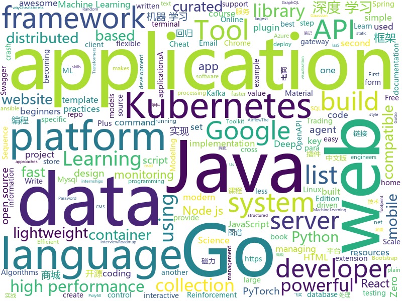

# 2019-10-24
See what the GitHub community is most excited about today.

## python
* [keras](https://github.com/keras-team/keras)(**35 stars today**): Deep Learning for humans
* [zipline](https://github.com/quantopian/zipline)(**124 stars today**): Zipline, a Pythonic Algorithmic Trading Library
* [chrome_password_grabber](https://github.com/x899/chrome_password_grabber)(**33 stars today**): Get unencrypted 'Saved Password' from Google Chrome
* [pwnagotchi](https://github.com/evilsocket/pwnagotchi)(**97 stars today**): (⌐■_■) - Deep Reinforcement Learning instrumenting bettercap for WiFi pwning.
* [AiLearning](https://github.com/apachecn/AiLearning)(**85 stars today**): AiLearning: 机器学习 - MachineLearning - ML、深度学习 - DeepLearning - DL、自然语言处理 NLP
* [awesome-python](https://github.com/vinta/awesome-python)(**129 stars today**): A curated list of awesome Python frameworks, libraries, software and resources
* [algo](https://github.com/trailofbits/algo)(**130 stars today**): Set up a personal VPN in the cloud
* [tensortrade](https://github.com/notadamking/tensortrade)(**113 stars today**): An open source reinforcement learning framework for training, evaluating, and deploying robust trading agents.
* [bcc](https://github.com/iovisor/bcc)(**12 stars today**): BCC - Tools for BPF-based Linux IO analysis, networking, monitoring, and more
* [summer2020internships](https://github.com/elaine-zheng/summer2020internships)(**20 stars today**): Keep track of internships for Summer 2020 for undergraduates interested in tech./SWE/related fields
* [dbt](https://github.com/fishtown-analytics/dbt)(**1 stars today**): dbt (data build tool) enables data analysts and engineers to transform their data using the same practices that software engineers use to build applications.
* [gpytorch](https://github.com/cornellius-gp/gpytorch)(**15 stars today**): A highly efficient and modular implementation of Gaussian Processes in PyTorch
* [transformers](https://github.com/huggingface/transformers)(**67 stars today**): 🤗Transformers: State-of-the-art Natural Language Processing for TensorFlow 2.0 and PyTorch.
* [causalml](https://github.com/uber/causalml)(**9 stars today**): Uplift modeling and causal inference with machine learning algorithms
* [models](https://github.com/tensorflow/models)(**41 stars today**): Models and examples built with TensorFlow
* [airflow](https://github.com/apache/airflow)(**16 stars today**): Apache Airflow
* [pytorch-lightning](https://github.com/williamFalcon/pytorch-lightning)(**22 stars today**): The lightweight PyTorch wrapper for ML researchers. Scale your models. Write less boilerplate
* [ansible](https://github.com/ansible/ansible)(**26 stars today**): Ansible is a radically simple IT automation platform that makes your applications and systems easier to deploy. Avoid writing scripts or custom code to deploy and update your applications — automate in a language that approaches plain English, using SSH, with no agents to install on remote systems. https://docs.ansible.com/ansible/
* [30-seconds-of-python](https://github.com/30-seconds/30-seconds-of-python)(**84 stars today**): A curated collection of useful Python snippets that you can understand in 30 seconds or less.
* [system-design-primer](https://github.com/donnemartin/system-design-primer)(**73 stars today**): Learn how to design large-scale systems. Prep for the system design interview. Includes Anki flashcards.
* [OUCML](https://github.com/OUCMachineLearning/OUCML)(**49 stars today**): 
* [thefuck](https://github.com/nvbn/thefuck)(**205 stars today**): Magnificent app which corrects your previous console command.
* [diff-match-patch](https://github.com/google/diff-match-patch)(**31 stars today**): Diff Match Patch is a high-performance library in multiple languages that manipulates plain text.
* [fairseq](https://github.com/pytorch/fairseq)(**19 stars today**): Facebook AI Research Sequence-to-Sequence Toolkit written in Python.
* [d2l-zh](https://github.com/d2l-ai/d2l-zh)(**58 stars today**): 《动手学深度学习》：面向中文读者、能运行、可讨论。英文版即伯克利“深度学习导论”教材。

## java
* [Java](https://github.com/TheAlgorithms/Java)(**75 stars today**): All Algorithms implemented in Java
* [mantis](https://github.com/Netflix/mantis)(**37 stars today**): A platform that makes it easy for developers to build realtime, cost-effective, operations-focused applications
* [Sentinel](https://github.com/alibaba/Sentinel)(**30 stars today**): A lightweight powerful flow control component enabling reliability and monitoring for microservices. (轻量级的流量控制、熔断降级 Java 库)
* [gpmall](https://github.com/2227324689/gpmall)(**98 stars today**): 【咕泡学院实战项目】-基于SpringBoot+Dubbo构建的电商平台-微服务架构、商城、电商、微服务、高并发、kafka、Elasticsearch
* [grpc-java](https://github.com/grpc/grpc-java)(**5 stars today**): The Java gRPC implementation. HTTP/2 based RPC
* [skywalking](https://github.com/apache/skywalking)(**22 stars today**): APM, Application Performance Monitoring System
* [easyexcel](https://github.com/alibaba/easyexcel)(**60 stars today**): 快速、简单避免OOM的java处理Excel工具
* [dbeaver](https://github.com/dbeaver/dbeaver)(**19 stars today**): Free universal database tool and SQL client
* [elasticsearch](https://github.com/elastic/elasticsearch)(**32 stars today**): Open Source, Distributed, RESTful Search Engine
* [h2o-3](https://github.com/h2oai/h2o-3)(**7 stars today**): Open Source Fast Scalable Machine Learning Platform For Smarter Applications: Deep Learning, Gradient Boosting & XGBoost, Random Forest, Generalized Linear Modeling (Logistic Regression, Elastic Net), K-Means, PCA, Stacked Ensembles, Automatic Machine Learning (AutoML), etc.
* [Algorithms](https://github.com/williamfiset/Algorithms)(**10 stars today**): A collection of algorithms and data structures
* [antlr4](https://github.com/antlr/antlr4)(**12 stars today**): ANTLR (ANother Tool for Language Recognition) is a powerful parser generator for reading, processing, executing, or translating structured text or binary files.
* [quarkus](https://github.com/quarkusio/quarkus)(**4 stars today**): Quarkus: Supersonic Subatomic Java.
* [guice](https://github.com/google/guice)(**7 stars today**): Guice (pronounced 'juice') is a lightweight dependency injection framework for Java 6 and above, brought to you by Google.
* [BaseRecyclerViewAdapterHelper](https://github.com/CymChad/BaseRecyclerViewAdapterHelper)(**10 stars today**): BRVAH:Powerful and flexible RecyclerAdapter
* [magnetW](https://github.com/dengyuhan/magnetW)(**72 stars today**): 磁力搜网页版 - 磁力链接聚合搜索 - https://bt.lansou.pw
* [mybatis-plus-samples](https://github.com/baomidou/mybatis-plus-samples)(**3 stars today**): MyBatis-Plus Samples
* [Head-First-Design-Patterns](https://github.com/bethrobson/Head-First-Design-Patterns)(**6 stars today**): Code for Head First Design Patterns book (2014)
* [p3c](https://github.com/alibaba/p3c)(**28 stars today**): Alibaba Java Coding Guidelines pmd implements and IDE plugin
* [spring-boot](https://github.com/spring-projects/spring-boot)(**37 stars today**): Spring Boot
* [mybatis-plus](https://github.com/baomidou/mybatis-plus)(**11 stars today**): An powerful enhanced toolkit of MyBatis for simplify development
* [Shadow](https://github.com/Tencent/Shadow)(**14 stars today**): 零反射全动态Android插件框架
* [spring-cloud-gateway](https://github.com/spring-cloud/spring-cloud-gateway)(**5 stars today**): A Gateway built on Spring Framework 5.x and Spring Boot 2.x providing routing and more.
* [react-native-webview](https://github.com/react-native-community/react-native-webview)(**6 stars today**): React Native Cross-Platform WebView
* [incubator-druid](https://github.com/apache/incubator-druid)(**6 stars today**): Apache Druid (Incubating) - Column oriented distributed data store ideal for powering interactive applications

## unknown
* [app-ideas](https://github.com/florinpop17/app-ideas)(**43 stars today**): A Collection of application ideas which can be used to improve your coding skills.
* [awesome-web-security](https://github.com/qazbnm456/awesome-web-security)(**174 stars today**): 🐶A curated list of Web Security materials and resources.
* [PLMpapers](https://github.com/thunlp/PLMpapers)(**26 stars today**): Must-read Papers on pre-trained language models.
* [best-practices-checklist](https://github.com/palash25/best-practices-checklist)(**41 stars today**): A list of awesome idiomatic code resources. Rust, Go, Erlang, Ruby, Pony and more
* [architect-awesome](https://github.com/xingshaocheng/architect-awesome)(**44 stars today**): 后端架构师技术图谱
* [javascript-testing-best-practices](https://github.com/goldbergyoni/javascript-testing-best-practices)(**20 stars today**): 📗🌐🚢Comprehensive and exhaustive JavaScript & Node.js testing best practices (August 2019)
* [kubernetes-the-hard-way](https://github.com/kelseyhightower/kubernetes-the-hard-way)(**40 stars today**): Bootstrap Kubernetes the hard way on Google Cloud Platform. No scripts.
* [books](https://github.com/programthink/books)(**22 stars today**): 【编程随想】收藏的电子书清单（多个学科，含下载链接）
* [reverse-interview](https://github.com/viraptor/reverse-interview)(**44 stars today**): Questions to ask the company during your interview
* [developer-roadmap](https://github.com/kamranahmedse/developer-roadmap)(**68 stars today**): Roadmap to becoming a web developer in 2019
* [Flutter-Course-Resources](https://github.com/londonappbrewery/Flutter-Course-Resources)(**4 stars today**): 
* [AKS](https://github.com/Azure/AKS)(**3 stars today**): Azure Kubernetes Service
* [OpenAPI-Specification](https://github.com/OAI/OpenAPI-Specification)(**23 stars today**): The OpenAPI Specification Repository
* [ds-cheatsheets](https://github.com/FavioVazquez/ds-cheatsheets)(**22 stars today**): List of Data Science Cheatsheets to rule the world
* [the-art-of-command-line](https://github.com/jlevy/the-art-of-command-line)(**67 stars today**): Master the command line, in one page
* [Best-README-Template](https://github.com/othneildrew/Best-README-Template)(**3 stars today**): An awesome README template to jumpstart your projects!
* [docker-cheat-sheet](https://github.com/wsargent/docker-cheat-sheet)(**10 stars today**): Docker Cheat Sheet
* [Specs](https://github.com/CocoaPods/Specs)(**2 stars today**): The CocoaPods Master Repo
* [styleguides](https://github.com/SAP/styleguides)(**4 stars today**): This repository provides SAP style guides for coding.
* [OnJava8](https://github.com/LingCoder/OnJava8)(**26 stars today**): 《On Java 8》中文版，又名《Java编程思想》 第5版
* [Java-Interview](https://github.com/gzc426/Java-Interview)(**24 stars today**): Java 面试必会 直通BAT
* [MobileApp-Pentest-Cheatsheet](https://github.com/tanprathan/MobileApp-Pentest-Cheatsheet)(**4 stars today**): The Mobile App Pentest cheat sheet was created to provide concise collection of high value information on specific mobile application penetration testing topics.
* [learn-regex](https://github.com/ziishaned/learn-regex)(**78 stars today**): Learn regex the easy way
* [react-typescript-cheatsheet](https://github.com/typescript-cheatsheets/react-typescript-cheatsheet)(**32 stars today**): Cheatsheets for experienced React developers getting started with TypeScript
* [vagas](https://github.com/frontendbr/vagas)(**5 stars today**): 🔬Espaço para divulgação de vagas para front-enders.

## javascript
* [hyper](https://github.com/zeit/hyper)(**104 stars today**): A terminal built on web technologies
* [kubernetes-basicLearning](https://github.com/knrt10/kubernetes-basicLearning)(**142 stars today**): Understand kubernetes step by step. A simple repo for beginners🔥
* [Script](https://github.com/NobyDa/Script)(**10 stars today**): 
* [nodebestpractices](https://github.com/goldbergyoni/nodebestpractices)(**101 stars today**): ✅The largest Node.js best practices list (September 2019)
* [swiper](https://github.com/nolimits4web/swiper)(**31 stars today**): Most modern mobile touch slider with hardware accelerated transitions
* [node](https://github.com/nodejs/node)(**64 stars today**): Node.js JavaScript runtime✨🐢🚀✨
* [create-react-app](https://github.com/facebook/create-react-app)(**39 stars today**): Set up a modern web app by running one command.
* [gatsby](https://github.com/gatsbyjs/gatsby)(**36 stars today**): Build blazing fast, modern apps and websites with React
* [gulp](https://github.com/gulpjs/gulp)(**6 stars today**): The streaming build system
* [aws-serverless-workshops](https://github.com/aws-samples/aws-serverless-workshops)(**5 stars today**): Code and walkthrough labs to set up serverless applications for Wild Rydes workshops
* [Ghost](https://github.com/TryGhost/Ghost)(**59 stars today**): 👻The #1 headless Node.js CMS for professional publishing
* [Viewers](https://github.com/OHIF/Viewers)(**3 stars today**): OHIF zero-footprint DICOM viewer and oncology specific Lesion Tracker, plus shared extension packages
* [gatekeeper](https://github.com/didi/gatekeeper)(**13 stars today**): A non-dependent, online configuration, GO-developed, API gateway
* [AnotherRedisDesktopManager](https://github.com/qishibo/AnotherRedisDesktopManager)(**22 stars today**): 🚀🚀🚀A faster, better and more stable redis desktop manager, compatible with Linux, windows, mac. What's more, it won't crash when loading a large number of keys.
* [edex-ui](https://github.com/GitSquared/edex-ui)(**22 stars today**): A cross-platform, customizable science fiction terminal emulator with advanced monitoring & touchscreen support.
* [incubator-echarts](https://github.com/apache/incubator-echarts)(**91 stars today**): A powerful, interactive charting and visualization library for browser
* [react-admin](https://github.com/marmelab/react-admin)(**19 stars today**): A frontend Framework for building admin applications running in the browser on top of REST/GraphQL APIs, using ES6, React and Material Design
* [react-developer-roadmap](https://github.com/adam-golab/react-developer-roadmap)(**22 stars today**): Roadmap to becoming a React developer in 2019
* [puppeteer](https://github.com/GoogleChrome/puppeteer)(**37 stars today**): Headless Chrome Node.js API
* [d3](https://github.com/d3/d3)(**37 stars today**): Bring data to life with SVG, Canvas and HTML.📊📈🎉
* [credit-card-form](https://github.com/muhammederdem/credit-card-form)(**159 stars today**): Credit card form with smooth and sweet micro-interactions
* [Inputmask](https://github.com/RobinHerbots/Inputmask)(**11 stars today**): Input Mask plugin
* [33-js-concepts](https://github.com/stephentian/33-js-concepts)(**57 stars today**): 📜每个 JavaScript 工程师都应懂的33个概念 @leonardomso
* [CRMEB](https://github.com/crmeb/CRMEB)(**35 stars today**): 开源微信公众号商城 小程序商城系统，带分销、拼团、秒杀、砍价、优惠券、积分等功能，前后端全部开源，更是一套方便二次开发的框架
* [iptv](https://github.com/iptv-org/iptv)(**87 stars today**): Collection of 8000+ publicly available IPTV channels from all over the world

## html
* [free-for-dev](https://github.com/ripienaar/free-for-dev)(**245 stars today**): A list of SaaS, PaaS and IaaS offerings that have free tiers of interest to devops and infradev
* [dragon-book-exercise-answers](https://github.com/fool2fish/dragon-book-exercise-answers)(**4 stars today**): Compilers Principles, Techniques, & Tools (purple dragon book) second edition exercise answers. 编译原理（紫龙书）第2版习题答案。
* [hackergame2019-writeups](https://github.com/ustclug/hackergame2019-writeups)(**23 stars today**): Write-ups for hackergame 2019
* [foundation-emails](https://github.com/foundation/foundation-emails)(**2 stars today**): Quickly create responsive HTML emails that work on any device and client. Even Outlook.
* [Coursera-ML-AndrewNg-Notes](https://github.com/fengdu78/Coursera-ML-AndrewNg-Notes)(**62 stars today**): 吴恩达老师的机器学习课程个人笔记
* [website](https://github.com/kubernetes/website)(**3 stars today**): Kubernetes website and documentation repo:
* [AR.js](https://github.com/jeromeetienne/AR.js)(**15 stars today**): Efficient Augmented Reality for the Web - 60fps on mobile!
* [Machine-Learning](https://github.com/Jack-Cherish/Machine-Learning)(**8 stars today**): ⚡️机器学习实战（Python3）：kNN、决策树、贝叶斯、逻辑回归、SVM、线性回归、树回归
* [skill-map](https://github.com/TeamStuQ/skill-map)(**31 stars today**): 程序员技能图谱
* [swagger-codegen](https://github.com/swagger-api/swagger-codegen)(**11 stars today**): swagger-codegen contains a template-driven engine to generate documentation, API clients and server stubs in different languages by parsing your OpenAPI / Swagger definition.
* [policy-templates](https://github.com/mozilla/policy-templates)(**3 stars today**): Policy Templates for Firefox
* [REKCARC-TSC-UHT](https://github.com/PKUanonym/REKCARC-TSC-UHT)(**6 stars today**): 清华大学计算机系课程攻略 Guidance for courses in Department of Computer Science and Technology, Tsinghua University
* [book](https://github.com/PaddlePaddle/book)(**1 stars today**): Deep Learning 101 with PaddlePaddle （『飞桨』深度学习框架入门教程）
* [beginners-week-one](https://github.com/CodeFirstGirls/beginners-week-one)(**2 stars today**): Tasks for beginners course, week one
* [blog](https://github.com/gwuhaolin/blog)(**3 stars today**): 浩麟的技术博客
* [snakemake](https://github.com/snakemake/snakemake)(**3 stars today**): This is the development home of the workflow management system Snakemake. For general information, see
* [AzureMapsCodeSamples](https://github.com/Azure-Samples/AzureMapsCodeSamples)(**0 stars today**): A set of code samples for the Azure Maps web control.
* [stickyfill](https://github.com/wilddeer/stickyfill)(**1 stars today**): Polyfill for CSS `position: sticky`
* [cornerstone](https://github.com/bigcommerce/cornerstone)(**0 stars today**): The BigCommerce Cornerstone theme
* [Hacktoberfest2019](https://github.com/Ishaan28malik/Hacktoberfest2019)(**4 stars today**): For beginners who are going to start with there first PR
* [spark-doc-zh](https://github.com/apachecn/spark-doc-zh)(**4 stars today**): Apache Spark 官方文档中文版
* [bootstrap-multiselect](https://github.com/davidstutz/bootstrap-multiselect)(**0 stars today**): JQuery multiselect plugin based on Twitter Bootstrap.
* [webauthn](https://github.com/w3c/webauthn)(**2 stars today**): Web Authentication: An API for accessing Public Key Credentials
* [learn-to-send-email-via-google-script-html-no-server](https://github.com/dwyl/learn-to-send-email-via-google-script-html-no-server)(**1 stars today**): ✉️An Example of using an HTML form (e.g: "Contact Us" on a website) to send Email without a Backend Server (using a Google Script) perfect for static websites that need to collect data.
* [pcc_2e](https://github.com/ehmatthes/pcc_2e)(**3 stars today**): Online resources for Python Crash Course (Second Edition), from No Starch Press

## go
* [rancher](https://github.com/rancher/rancher)(**69 stars today**): Complete container management platform
* [Yearning](https://github.com/cookieY/Yearning)(**39 stars today**): 受欢迎的 Mysql sql审核平台
* [go](https://github.com/json-iterator/go)(**89 stars today**): A high-performance 100% compatible drop-in replacement of "encoding/json"
* [moby](https://github.com/moby/moby)(**43 stars today**): Moby Project - a collaborative project for the container ecosystem to assemble container-based systems
* [tidb](https://github.com/pingcap/tidb)(**14 stars today**): TiDB is an open source distributed HTAP database compatible with the MySQL protocol
* [origin](https://github.com/openshift/origin)(**2 stars today**): The self-managing, auto-upgrading, Kubernetes distribution for everyone
* [etcd](https://github.com/etcd-io/etcd)(**27 stars today**): Distributed reliable key-value store for the most critical data of a distributed system
* [minio](https://github.com/minio/minio)(**23 stars today**): MinIO is a high performance object storage server compatible with Amazon S3 APIs
* [advanced-go-programming-book](https://github.com/chai2010/advanced-go-programming-book)(**15 stars today**): 📚《Go语言高级编程》开源图书，涵盖CGO、Go汇编语言、RPC实现、Protobuf插件实现、Web框架实现、分布式系统等高阶主题(完稿)
* [charts](https://github.com/helm/charts)(**22 stars today**): Curated applications for Kubernetes
* [sarama](https://github.com/Shopify/sarama)(**8 stars today**): Sarama is a Go library for Apache Kafka 0.8, and up.
* [sops](https://github.com/mozilla/sops)(**6 stars today**): Simple and flexible tool for managing secrets
* [beats](https://github.com/elastic/beats)(**7 stars today**): 🐠Beats - Lightweight shippers for Elasticsearch & Logstash
* [telegraf](https://github.com/influxdata/telegraf)(**6 stars today**): The plugin-driven server agent for collecting & reporting metrics.
* [beego](https://github.com/astaxie/beego)(**19 stars today**): beego is an open-source, high-performance web framework for the Go programming language.
* [libpod](https://github.com/containers/libpod)(**18 stars today**): libpod is a library used to create container pods. Home of Podman.
* [gorm](https://github.com/jinzhu/gorm)(**16 stars today**): The fantastic ORM library for Golang, aims to be developer friendly
* [websocket](https://github.com/gorilla/websocket)(**17 stars today**): A fast, well-tested and widely used WebSocket implementation for Go.
* [gardener](https://github.com/gardener/gardener)(**8 stars today**): Kubernetes API server extension and controller managing the full lifecycle of conformant Kubernetes clusters as a service on Alicloud, AWS, Azure, GCP, OpenStack, and Packet with minimal TCO.
* [fasthttp](https://github.com/valyala/fasthttp)(**12 stars today**): Fast HTTP package for Go. Tuned for high performance. Zero memory allocations in hot paths. Up to 10x faster than net/http
* [yay](https://github.com/Jguer/yay)(**30 stars today**): Yet another Yogurt - An AUR Helper written in Go
* [protobuf](https://github.com/golang/protobuf)(**9 stars today**): Go support for Google's protocol buffers
* [k3sup](https://github.com/alexellis/k3sup)(**6 stars today**): k3sup: from Zero to KUBECONFIG in < 1 min
* [alertmanager](https://github.com/prometheus/alertmanager)(**4 stars today**): Prometheus Alertmanager
* [mock](https://github.com/golang/mock)(**9 stars today**): GoMock is a mocking framework for the Go programming language.

## WordCloud

