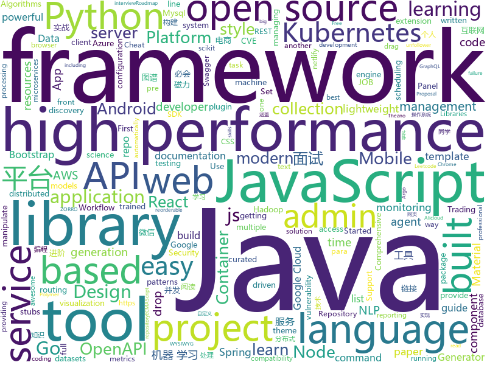

# 2019-10-25
See what the GitHub community is most excited about today.

## python
* [zipline](https://github.com/quantopian/zipline)(**84 stars today**): Zipline, a Pythonic Algorithmic Trading Library
* [chineseGLUE](https://github.com/chineseGLUE/chineseGLUE)(**50 stars today**): Language Understanding Evaluation benchmark for Chinese: datasets, baselines, pre-trained models,corpus and leaderboard
* [wxpy](https://github.com/youfou/wxpy)(**26 stars today**): 微信机器人 / 可能是最优雅的微信个人号 API✨✨
* [algo](https://github.com/trailofbits/algo)(**83 stars today**): Set up a personal VPN in the cloud
* [AiLearning](https://github.com/apachecn/AiLearning)(**154 stars today**): AiLearning: 机器学习 - MachineLearning - ML、深度学习 - DeepLearning - DL、自然语言处理 NLP
* [google-research](https://github.com/google-research/google-research)(**57 stars today**): Google AI Research
* [jet-bridge](https://github.com/jet-admin/jet-bridge)(**17 stars today**): Jet Bridge (Universal) for Jet Admin – API-based Admin Panel Framework for your application
* [30-seconds-of-python](https://github.com/30-seconds/30-seconds-of-python)(**34 stars today**): A curated collection of useful Python snippets that you can understand in 30 seconds or less.
* [algo](https://github.com/wangzheng0822/algo)(**21 stars today**): 数据结构和算法必知必会的50个代码实现
* [Arjun](https://github.com/s0md3v/Arjun)(**12 stars today**): HTTP parameter discovery suite.
* [OUCML](https://github.com/OUCMachineLearning/OUCML)(**23 stars today**): 
* [Cirq](https://github.com/quantumlib/Cirq)(**22 stars today**): A python framework for creating, editing, and invoking Noisy Intermediate Scale Quantum (NISQ) circuits.
* [fast-bert](https://github.com/kaushaltrivedi/fast-bert)(**6 stars today**): Super easy library for BERT based NLP models
* [Osmedeus](https://github.com/j3ssie/Osmedeus)(**15 stars today**): Fully automated offensive security framework for reconnaissance and vulnerability scanning
* [luigi](https://github.com/spotify/luigi)(**8 stars today**): Luigi is a Python module that helps you build complex pipelines of batch jobs. It handles dependency resolution, workflow management, visualization etc. It also comes with Hadoop support built in.
* [data-science-ipython-notebooks](https://github.com/donnemartin/data-science-ipython-notebooks)(**24 stars today**): Data science Python notebooks: Deep learning (TensorFlow, Theano, Caffe, Keras), scikit-learn, Kaggle, big data (Spark, Hadoop MapReduce, HDFS), matplotlib, pandas, NumPy, SciPy, Python essentials, AWS, and various command lines.
* [scikit-learn](https://github.com/scikit-learn/scikit-learn)(**19 stars today**): scikit-learn: machine learning in Python
* [CVE-2019-7609](https://github.com/LandGrey/CVE-2019-7609)(**4 stars today**): exploit CVE-2019-7609(kibana RCE) on right way by python2 scripts
* [diff-match-patch](https://github.com/google/diff-match-patch)(**23 stars today**): Diff Match Patch is a high-performance library in multiple languages that manipulates plain text.
* [multi-agent-emergence-environments](https://github.com/openai/multi-agent-emergence-environments)(**9 stars today**): Environment generation code for the paper "Emergent Tool Use From Multi-Agent Autocurricula"
* [fastapi](https://github.com/tiangolo/fastapi)(**60 stars today**): FastAPI framework, high performance, easy to learn, fast to code, ready for production
* [tensortrade](https://github.com/notadamking/tensortrade)(**42 stars today**): An open source reinforcement learning framework for training, evaluating, and deploying robust trading agents.
* [NLP-progress](https://github.com/sebastianruder/NLP-progress)(**11 stars today**): Repository to track the progress in Natural Language Processing (NLP), including the datasets and the current state-of-the-art for the most common NLP tasks.
* [mlflow](https://github.com/mlflow/mlflow)(**15 stars today**): Open source platform for the machine learning lifecycle
* [pointer-generator](https://github.com/abisee/pointer-generator)(**2 stars today**): Code for the ACL 2017 paper "Get To The Point: Summarization with Pointer-Generator Networks"

## java
* [tablesaw](https://github.com/jtablesaw/tablesaw)(**25 stars today**): Java dataframe and visualization library
* [gpmall](https://github.com/2227324689/gpmall)(**47 stars today**): 【咕泡学院实战项目】-基于SpringBoot+Dubbo构建的电商平台-微服务架构、商城、电商、微服务、高并发、kafka、Elasticsearch
* [Java](https://github.com/TheAlgorithms/Java)(**235 stars today**): All Algorithms implemented in Java
* [Head-First-Design-Patterns](https://github.com/bethrobson/Head-First-Design-Patterns)(**5 stars today**): Code for Head First Design Patterns book (2014)
* [xxl-job](https://github.com/xuxueli/xxl-job)(**19 stars today**): A lightweight distributed task scheduling framework.（分布式任务调度平台XXL-JOB）
* [tutorials](https://github.com/eugenp/tutorials)(**26 stars today**): The "REST With Spring" Course:
* [easyexcel](https://github.com/alibaba/easyexcel)(**56 stars today**): 快速、简单避免OOM的java处理Excel工具
* [mantis](https://github.com/Netflix/mantis)(**93 stars today**): A platform that makes it easy for developers to build realtime, cost-effective, operations-focused applications
* [seata](https://github.com/seata/seata)(**25 stars today**): 🔥Seata is an easy-to-use, high-performance, open source distributed transaction solution.
* [Auto.js](https://github.com/hyb1996/Auto.js)(**52 stars today**): A UiAutomator on android, does not need root access(安卓平台上的JavaScript自动化工具)
* [advanced-java](https://github.com/doocs/advanced-java)(**63 stars today**): 😮互联网 Java 工程师进阶知识完全扫盲：涵盖高并发、分布式、高可用、微服务等领域知识，后端同学必看，前端同学也可学习
* [skywalking](https://github.com/apache/skywalking)(**23 stars today**): APM, Application Performance Monitoring System
* [flink](https://github.com/apache/flink)(**15 stars today**): Apache Flink
* [Sentinel](https://github.com/alibaba/Sentinel)(**32 stars today**): A lightweight powerful flow control component enabling reliability and monitoring for microservices. (轻量级的流量控制、熔断降级 Java 库)
* [JCSprout](https://github.com/crossoverJie/JCSprout)(**26 stars today**): 👨‍🎓Java Core Sprout : basic, concurrent, algorithm
* [scene](https://github.com/bytedance/scene)(**10 stars today**): Bytedance Scene is a lightweight Android library of navigation and page segmentation based on view.
* [MyBookshelf](https://github.com/gedoor/MyBookshelf)(**9 stars today**): 阅读是一款可以自定义来源阅读网络内容的工具，为广大网络文学爱好者提供一种方便、快捷舒适的试读体验。
* [FlowLayout](https://github.com/hongyangAndroid/FlowLayout)(**3 stars today**): [不再维护]Android流式布局，支持单选、多选等，适合用于产品标签等。
* [openapi-generator](https://github.com/OpenAPITools/openapi-generator)(**6 stars today**): OpenAPI Generator allows generation of API client libraries (SDK generation), server stubs, documentation and configuration automatically given an OpenAPI Spec (v2, v3)
* [magnetW](https://github.com/dengyuhan/magnetW)(**28 stars today**): 磁力搜网页版 - 磁力链接聚合搜索 - https://bt.lansou.pw
* [incubator-shardingsphere](https://github.com/apache/incubator-shardingsphere)(**20 stars today**): Distributed database middleware
* [antlr4](https://github.com/antlr/antlr4)(**14 stars today**): ANTLR (ANother Tool for Language Recognition) is a powerful parser generator for reading, processing, executing, or translating structured text or binary files.
* [spring-cloud-gateway](https://github.com/spring-cloud/spring-cloud-gateway)(**3 stars today**): A Gateway built on Spring Framework 5.x and Spring Boot 2.x providing routing and more.
* [servicecomb-java-chassis](https://github.com/apache/servicecomb-java-chassis)(**1 stars today**): ServiceComb Java Chassis is a Software Development Kit (SDK) for rapid development of microservices in Java, providing service registration, service discovery, dynamic routing, and service management features
* [CS-Notes](https://github.com/CyC2018/CS-Notes)(**95 stars today**): 📚Tech Interview Guide 技术面试必备基础知识、Leetcode 题解、Java、C++、Python、后端面试、操作系统、计算机网络、系统设计

## unknown
* [app-ideas](https://github.com/florinpop17/app-ideas)(**29 stars today**): A Collection of application ideas which can be used to improve your coding skills.
* [awesome-web-security](https://github.com/qazbnm456/awesome-web-security)(**58 stars today**): 🐶A curated list of Web Security materials and resources.
* [PLMpapers](https://github.com/thunlp/PLMpapers)(**14 stars today**): Must-read Papers on pre-trained language models.
* [best-practices-checklist](https://github.com/palash25/best-practices-checklist)(**13 stars today**): A list of awesome idiomatic code resources. Rust, Go, Erlang, Ruby, Pony and more
* [architect-awesome](https://github.com/xingshaocheng/architect-awesome)(**30 stars today**): 后端架构师技术图谱
* [javascript-testing-best-practices](https://github.com/goldbergyoni/javascript-testing-best-practices)(**14 stars today**): 📗🌐🚢Comprehensive and exhaustive JavaScript & Node.js testing best practices (August 2019)
* [kubernetes-the-hard-way](https://github.com/kelseyhightower/kubernetes-the-hard-way)(**16 stars today**): Bootstrap Kubernetes the hard way on Google Cloud Platform. No scripts.
* [books](https://github.com/programthink/books)(**19 stars today**): 【编程随想】收藏的电子书清单（多个学科，含下载链接）
* [reverse-interview](https://github.com/viraptor/reverse-interview)(**31 stars today**): Questions to ask the company during your interview
* [developer-roadmap](https://github.com/kamranahmedse/developer-roadmap)(**45 stars today**): Roadmap to becoming a web developer in 2019
* [Flutter-Course-Resources](https://github.com/londonappbrewery/Flutter-Course-Resources)(**3 stars today**): 
* [AKS](https://github.com/Azure/AKS)(**0 stars today**): Azure Kubernetes Service
* [OpenAPI-Specification](https://github.com/OAI/OpenAPI-Specification)(**7 stars today**): The OpenAPI Specification Repository
* [ds-cheatsheets](https://github.com/FavioVazquez/ds-cheatsheets)(**5 stars today**): List of Data Science Cheatsheets to rule the world
* [the-art-of-command-line](https://github.com/jlevy/the-art-of-command-line)(**39 stars today**): Master the command line, in one page
* [Best-README-Template](https://github.com/othneildrew/Best-README-Template)(**0 stars today**): An awesome README template to jumpstart your projects!
* [docker-cheat-sheet](https://github.com/wsargent/docker-cheat-sheet)(**10 stars today**): Docker Cheat Sheet
* [Specs](https://github.com/CocoaPods/Specs)(**4 stars today**): The CocoaPods Master Repo
* [styleguides](https://github.com/SAP/styleguides)(**1 stars today**): This repository provides SAP style guides for coding.
* [OnJava8](https://github.com/LingCoder/OnJava8)(**23 stars today**): 《On Java 8》中文版，又名《Java编程思想》 第5版
* [Java-Interview](https://github.com/gzc426/Java-Interview)(**17 stars today**): Java 面试必会 直通BAT
* [MobileApp-Pentest-Cheatsheet](https://github.com/tanprathan/MobileApp-Pentest-Cheatsheet)(**5 stars today**): The Mobile App Pentest cheat sheet was created to provide concise collection of high value information on specific mobile application penetration testing topics.
* [learn-regex](https://github.com/ziishaned/learn-regex)(**59 stars today**): Learn regex the easy way
* [react-typescript-cheatsheet](https://github.com/typescript-cheatsheets/react-typescript-cheatsheet)(**40 stars today**): Cheatsheets for experienced React developers getting started with TypeScript
* [vagas](https://github.com/frontendbr/vagas)(**1 stars today**): 🔬Espaço para divulgação de vagas para front-enders.

## javascript
* [Awesome-Design-Tools](https://github.com/LisaDziuba/Awesome-Design-Tools)(**117 stars today**): The best design tools and plugins for everything👉
* [credit-card-form](https://github.com/muhammederdem/credit-card-form)(**123 stars today**): Credit card form with smooth and sweet micro-interactions
* [node](https://github.com/nodejs/node)(**36 stars today**): Node.js JavaScript runtime✨🐢🚀✨
* [next.js](https://github.com/zeit/next.js)(**46 stars today**): The React Framework
* [Vue.Draggable](https://github.com/SortableJS/Vue.Draggable)(**22 stars today**): Vue drag-and-drop component based on Sortable.js
* [lerna](https://github.com/lerna/lerna)(**30 stars today**): 🐉A tool for managing JavaScript projects with multiple packages.
* [FileSaver.js](https://github.com/eligrey/FileSaver.js)(**6 stars today**): An HTML5 saveAs() FileSaver implementation
* [gulp](https://github.com/gulpjs/gulp)(**11 stars today**): The streaming build system
* [carbon](https://github.com/carbon-design-system/carbon)(**6 stars today**): A design system built by IBM
* [vant](https://github.com/youzan/vant)(**28 stars today**): Lightweight Mobile UI Components built on Vue
* [iptv](https://github.com/iptv-org/iptv)(**97 stars today**): Collection of 8000+ publicly available IPTV channels from all over the world
* [emotion](https://github.com/emotion-js/emotion)(**14 stars today**): 👩‍🎤CSS-in-JS library designed for high performance style composition
* [yapi](https://github.com/YMFE/yapi)(**39 stars today**): YApi 是一个可本地部署的、打通前后端及QA的、可视化的接口管理平台
* [eslint](https://github.com/eslint/eslint)(**14 stars today**): A fully pluggable tool for identifying and reporting on patterns in JavaScript
* [Sortable](https://github.com/SortableJS/Sortable)(**19 stars today**): Sortable — is a JavaScript library for reorderable drag-and-drop lists on modern browsers and touch devices. No jQuery required. Supports Meteor, AngularJS, React, Polymer, Vue, Ember, Knockout and any CSS library, e.g. Bootstrap.
* [Ghost](https://github.com/TryGhost/Ghost)(**45 stars today**): 👻The #1 headless Node.js CMS for professional publishing
* [spectrum](https://github.com/withspectrum/spectrum)(**17 stars today**): Simple, powerful online communities.
* [create-react-app](https://github.com/facebook/create-react-app)(**46 stars today**): Set up a modern web app by running one command.
* [quill](https://github.com/quilljs/quill)(**15 stars today**): Quill is a modern WYSIWYG editor built for compatibility and extensibility.
* [twitter-unfollower](https://github.com/wesbos/twitter-unfollower)(**9 stars today**): A twitter unfollower for stale accounts
* [moment](https://github.com/moment/moment)(**14 stars today**): Parse, validate, manipulate, and display dates in javascript.
* [javascript](https://github.com/airbnb/javascript)(**31 stars today**): JavaScript Style Guide
* [react-admin](https://github.com/marmelab/react-admin)(**20 stars today**): A frontend Framework for building admin applications running in the browser on top of REST/GraphQL APIs, using ES6, React and Material Design
* [appium](https://github.com/appium/appium)(**10 stars today**): 📱Automation for iOS, Android, and Windows Apps.
* [hyper](https://github.com/zeit/hyper)(**94 stars today**): A terminal built on web technologies

## html
* [learning-area](https://github.com/mdn/learning-area)(**5 stars today**): Github repo for the MDN Learning Area.
* [Coursera-ML-AndrewNg-Notes](https://github.com/fengdu78/Coursera-ML-AndrewNg-Notes)(**27 stars today**): 吴恩达老师的机器学习课程个人笔记
* [awesome-modern-cpp](https://github.com/rigtorp/awesome-modern-cpp)(**5 stars today**): A collection of resources on modern C++
* [skill-map](https://github.com/TeamStuQ/skill-map)(**38 stars today**): 程序员技能图谱
* [swagger-codegen](https://github.com/swagger-api/swagger-codegen)(**7 stars today**): swagger-codegen contains a template-driven engine to generate documentation, API clients and server stubs in different languages by parsing your OpenAPI / Swagger definition.
* [hugo-coder](https://github.com/luizdepra/hugo-coder)(**4 stars today**): A minimalist blog theme for hugo.
* [hackergame2019-writeups](https://github.com/ustclug/hackergame2019-writeups)(**6 stars today**): Write-ups for hackergame 2019
* [Machine-Learning-in-Action-Python3](https://github.com/wzy6642/Machine-Learning-in-Action-Python3)(**10 stars today**): 《机器学习实战》python3源码
* [hacktoberfest](https://github.com/AliceWonderland/hacktoberfest)(**4 stars today**): Participate in Hacktoberfest by contributing to any Open Source project on GitHub! Here is a starter project for first time contributors. #hacktoberfest
* [ng-alain](https://github.com/ng-alain/ng-alain)(**1 stars today**): NG-ZORRO admin panel front-end framework (netlify mirror https://netlify.ng-alain.com/)
* [AR.js](https://github.com/jeromeetienne/AR.js)(**12 stars today**): Efficient Augmented Reality for the Web - 60fps on mobile!
* [COMP9021_19T3](https://github.com/marey/COMP9021_19T3)(**1 stars today**): 
* [styleguide](https://github.com/google/styleguide)(**11 stars today**): Style guides for Google-originated open-source projects
* [EIPs](https://github.com/ethereum/EIPs)(**4 stars today**): The Ethereum Improvement Proposal repository
* [compat-table](https://github.com/kangax/compat-table)(**1 stars today**): ECMAScript 5/6/7 compatibility tables
* [website](https://github.com/kubernetes/website)(**0 stars today**): Kubernetes website and documentation repo:
* [CoolAdmin](https://github.com/puikinsh/CoolAdmin)(**2 stars today**): Free Bootstrap 4.1 based admin dashboard template
* [Java-Interview-Advanced](https://github.com/shishan100/Java-Interview-Advanced)(**9 stars today**): 中华石杉--互联网Java进阶面试训练营
* [ru.javascript.info](https://github.com/javascript-tutorial/ru.javascript.info)(**3 stars today**): Современный учебник JavaScript
* [professional-services](https://github.com/GoogleCloudPlatform/professional-services)(**2 stars today**): Common solutions and tools developed by Google Cloud's Professional Services team
* [mkdocs-material](https://github.com/squidfunk/mkdocs-material)(**3 stars today**): A Material Design theme for MkDocs
* [qcloud-documents](https://github.com/tencentyun/qcloud-documents)(**0 stars today**): 腾讯云官方文档 使用Markdown自动构建
* [kubernetes-failure-stories](https://github.com/hjacobs/kubernetes-failure-stories)(**4 stars today**): Compilation of public failure/horror stories related to Kubernetes
* [samples](https://github.com/GoogleChrome/samples)(**1 stars today**): A repo containing samples tied to new functionality in each release of Google Chrome.
* [node-js-getting-started](https://github.com/heroku/node-js-getting-started)(**0 stars today**): Getting Started with Node on Heroku

## go
* [phuip-fpizdam](https://github.com/neex/phuip-fpizdam)(**172 stars today**): Exploit for CVE-2019-11043
* [yay](https://github.com/Jguer/yay)(**24 stars today**): Yet another Yogurt - An AUR Helper written in Go
* [Yearning](https://github.com/cookieY/Yearning)(**155 stars today**): 受欢迎的 Mysql sql审核平台
* [go](https://github.com/json-iterator/go)(**54 stars today**): A high-performance 100% compatible drop-in replacement of "encoding/json"
* [moby](https://github.com/moby/moby)(**36 stars today**): Moby Project - a collaborative project for the container ecosystem to assemble container-based systems
* [alertmanager](https://github.com/prometheus/alertmanager)(**7 stars today**): Prometheus Alertmanager
* [fasthttp](https://github.com/valyala/fasthttp)(**12 stars today**): Fast HTTP package for Go. Tuned for high performance. Zero memory allocations in hot paths. Up to 10x faster than net/http
* [btcd](https://github.com/btcsuite/btcd)(**3 stars today**): An alternative full node bitcoin implementation written in Go (golang)
* [argo](https://github.com/argoproj/argo)(**10 stars today**): Argo Workflows: Get stuff done with Kubernetes.
* [terraform-provider-aws](https://github.com/terraform-providers/terraform-provider-aws)(**6 stars today**): Terraform AWS provider
* [vault](https://github.com/hashicorp/vault)(**5 stars today**): A tool for secrets management, encryption as a service, and privileged access management
* [terraform-provider-google](https://github.com/terraform-providers/terraform-provider-google)(**3 stars today**): Terraform Google Cloud Platform provider
* [git-lfs](https://github.com/git-lfs/git-lfs)(**4 stars today**): Git extension for versioning large files
* [prometheus](https://github.com/prometheus/prometheus)(**18 stars today**): The Prometheus monitoring system and time series database.
* [influxdb](https://github.com/influxdata/influxdb)(**15 stars today**): Scalable datastore for metrics, events, and real-time analytics
* [trivy](https://github.com/aquasecurity/trivy)(**6 stars today**): A Simple and Comprehensive Vulnerability Scanner for Containers, Suitable for CI
* [hcl](https://github.com/hashicorp/hcl)(**4 stars today**): HCL is the HashiCorp configuration language.
* [aks-engine](https://github.com/Azure/aks-engine)(**3 stars today**): AKS Engine: Units of Kubernetes on Azure!
* [orchestrator](https://github.com/github/orchestrator)(**3 stars today**): MySQL replication topology management and HA
* [algorithms](https://github.com/x899/algorithms)(**8 stars today**): Data Structure Libraries and Algorithms implementation
* [kubernetes](https://github.com/kubernetes/kubernetes)(**62 stars today**): Production-Grade Container Scheduling and Management
* [beego](https://github.com/astaxie/beego)(**16 stars today**): beego is an open-source, high-performance web framework for the Go programming language.
* [cert-manager](https://github.com/jetstack/cert-manager)(**10 stars today**): Automatically provision and manage TLS certificates in Kubernetes
* [gardener](https://github.com/gardener/gardener)(**7 stars today**): Kubernetes API server extension and controller managing the full lifecycle of conformant Kubernetes clusters as a service on Alicloud, AWS, Azure, GCP, OpenStack, and Packet with minimal TCO.
* [telegraf](https://github.com/influxdata/telegraf)(**8 stars today**): The plugin-driven server agent for collecting & reporting metrics.

## WordCloud

