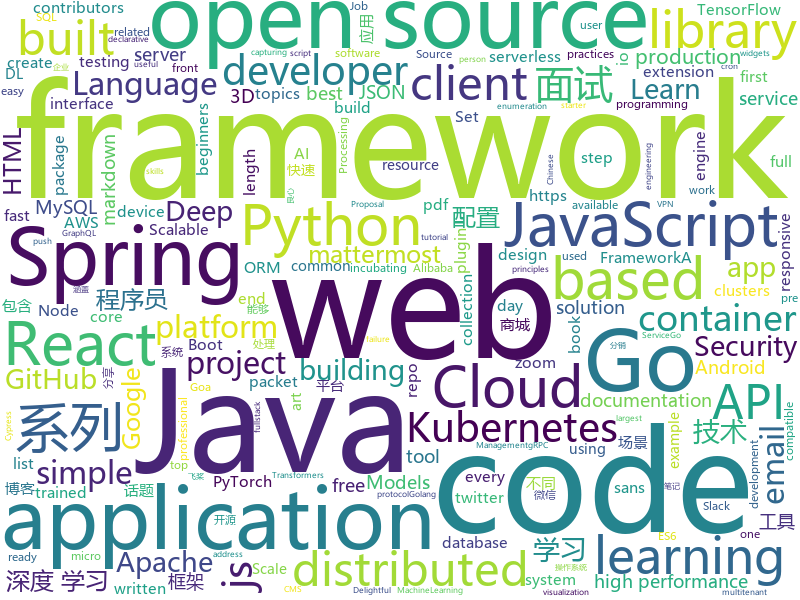

# 2019-10-26
See what the GitHub community is most excited about today.

## python
* [UhOh365](https://github.com/Raikia/UhOh365)(**28 stars today**): A script that can see if an email address is valid in Office365 (user/email enumeration). This does not perform any login attempts, is unthrottled, and is incredibly useful for social engineering assessments to find which emails exist and which don't.
* [AiLearning](https://github.com/apachecn/AiLearning)(**114 stars today**): AiLearning: 机器学习 - MachineLearning - ML、深度学习 - DeepLearning - DL、自然语言处理 NLP
* [google-research](https://github.com/google-research/google-research)(**126 stars today**): Google AI Research
* [trip-planner](https://github.com/adl1995/trip-planner)(**20 stars today**): A CLI tool for planning trip itinerary.
* [chineseGLUE](https://github.com/chineseGLUE/chineseGLUE)(**70 stars today**): Language Understanding Evaluation benchmark for Chinese: datasets, baselines, pre-trained models,corpus and leaderboard
* [fastapi](https://github.com/tiangolo/fastapi)(**34 stars today**): FastAPI framework, high performance, easy to learn, fast to code, ready for production
* [transformers](https://github.com/huggingface/transformers)(**58 stars today**): 🤗Transformers: State-of-the-art Natural Language Processing for TensorFlow 2.0 and PyTorch.
* [text-to-text-transfer-transformer](https://github.com/google-research/text-to-text-transfer-transformer)(**310 stars today**): 
* [models](https://github.com/PaddlePaddle/models)(**12 stars today**): Pre-trained and Reproduced Deep Learning Models （『飞桨』官方模型库，包含多种学术前沿和工业场景验证的深度学习模型）
* [flask](https://github.com/pallets/flask)(**25 stars today**): The Python micro framework for building web applications.
* [Cirq](https://github.com/quantumlib/Cirq)(**12 stars today**): A python framework for creating, editing, and invoking Noisy Intermediate Scale Quantum (NISQ) circuits.
* [algo](https://github.com/trailofbits/algo)(**114 stars today**): Set up a personal VPN in the cloud
* [aws-cli](https://github.com/aws/aws-cli)(**13 stars today**): Universal Command Line Interface for Amazon Web Services
* [sigma](https://github.com/Neo23x0/sigma)(**4 stars today**): Generic Signature Format for SIEM Systems
* [dgl](https://github.com/dmlc/dgl)(**14 stars today**): Python package built to ease deep learning on graph, on top of existing DL frameworks.
* [django](https://github.com/django/django)(**34 stars today**): The Web framework for perfectionists with deadlines.
* [models](https://github.com/tensorflow/models)(**39 stars today**): Models and examples built with TensorFlow
* [localstack](https://github.com/localstack/localstack)(**22 stars today**): 💻A fully functional local AWS cloud stack. Develop and test your cloud & Serverless apps offline!
* [DeepLearningExamples](https://github.com/NVIDIA/DeepLearningExamples)(**8 stars today**): Deep Learning Examples
* [bert-as-service](https://github.com/hanxiao/bert-as-service)(**19 stars today**): Mapping a variable-length sentence to a fixed-length vector using BERT model
* [Osmedeus](https://github.com/j3ssie/Osmedeus)(**15 stars today**): Fully automated offensive security framework for reconnaissance and vulnerability scanning
* [deep-person-reid](https://github.com/KaiyangZhou/deep-person-reid)(**16 stars today**): Deep learning person re-identification in PyTorch.
* [kafka-python](https://github.com/dpkp/kafka-python)(**2 stars today**): Python client for Apache Kafka
* [tensorflow-vgg](https://github.com/machrisaa/tensorflow-vgg)(**3 stars today**): VGG19 and VGG16 on Tensorflow
* [WeasyPrint](https://github.com/Kozea/WeasyPrint)(**2 stars today**): WeasyPrint converts web documents (HTML with CSS, SVG, …) to PDF.

## java
* [Java](https://github.com/TheAlgorithms/Java)(**101 stars today**): All Algorithms implemented in Java
* [easyexcel](https://github.com/alibaba/easyexcel)(**52 stars today**): 快速、简单避免OOM的java处理Excel工具
* [spring-framework](https://github.com/spring-projects/spring-framework)(**26 stars today**): Spring Framework
* [mantis](https://github.com/Netflix/mantis)(**19 stars today**): A platform that makes it easy for developers to build realtime, cost-effective, operations-focused applications
* [CS-Notes](https://github.com/CyC2018/CS-Notes)(**91 stars today**): 📚Tech Interview Guide 技术面试必备基础知识、Leetcode 题解、Java、C++、Python、后端面试、操作系统、计算机网络、系统设计
* [canal](https://github.com/alibaba/canal)(**17 stars today**): 阿里巴巴 MySQL binlog 增量订阅&消费组件
* [tablesaw](https://github.com/jtablesaw/tablesaw)(**69 stars today**): Java dataframe and visualization library
* [Auto.js](https://github.com/hyb1996/Auto.js)(**91 stars today**): A UiAutomator on android, does not need root access(安卓平台上的JavaScript自动化工具)
* [JavaGuide](https://github.com/Snailclimb/JavaGuide)(**94 stars today**): 【Java学习+面试指南】 一份涵盖大部分Java程序员所需要掌握的核心知识。
* [DataX](https://github.com/alibaba/DataX)(**9 stars today**): 
* [elasticsearch](https://github.com/elastic/elasticsearch)(**23 stars today**): Open Source, Distributed, RESTful Search Engine
* [JCSprout](https://github.com/crossoverJie/JCSprout)(**19 stars today**): 👨‍🎓Java Core Sprout : basic, concurrent, algorithm
* [calcite](https://github.com/apache/calcite)(**3 stars today**): Mirror of Apache Calcite
* [elastic-job-lite](https://github.com/elasticjob/elastic-job-lite)(**10 stars today**): Elastic-Job is a distributed scheduled job framework, based on Quartz and Zookeeper.
* [Sentinel](https://github.com/alibaba/Sentinel)(**27 stars today**): A lightweight powerful flow control component enabling reliability and monitoring for microservices. (轻量级的流量控制、熔断降级 Java 库)
* [fullstack-tutorial](https://github.com/frank-lam/fullstack-tutorial)(**21 stars today**): 🚀fullstack tutorial 2019，后台技术栈/架构师之路/全栈开发社区，春招/秋招/校招/面试
* [apollo](https://github.com/ctripcorp/apollo)(**23 stars today**): Apollo（阿波罗）是携程框架部门研发的分布式配置中心，能够集中化管理应用不同环境、不同集群的配置，配置修改后能够实时推送到应用端，并且具备规范的权限、流程治理等特性，适用于微服务配置管理场景。
* [flink](https://github.com/apache/flink)(**18 stars today**): Apache Flink
* [incubator-druid](https://github.com/apache/incubator-druid)(**8 stars today**): Apache Druid (Incubating) - Column oriented distributed data store ideal for powering interactive applications
* [springfox](https://github.com/springfox/springfox)(**4 stars today**): Automated JSON API documentation for API's built with Spring
* [spring-cloud-alibaba](https://github.com/alibaba/spring-cloud-alibaba)(**34 stars today**): Spring Cloud Alibaba provides a one-stop solution for application development for the distributed solutions of Alibaba middleware.
* [views-widgets-samples](https://github.com/android/views-widgets-samples)(**16 stars today**): Multiple samples showing the best practices in views-widgets on Android.
* [lottie-android](https://github.com/airbnb/lottie-android)(**20 stars today**): Render After Effects animations natively on Android and iOS, Web, and React Native
* [java](https://github.com/kubernetes-client/java)(**3 stars today**): Official Java client library for kubernetes
* [SpringAll](https://github.com/wuyouzhuguli/SpringAll)(**25 stars today**): 循序渐进，学习Spring Boot、Spring Boot & Shiro、Spring Cloud、Spring Security & Spring Security OAuth2，博客Spring系列源码

## unknown
* [USA-Constitution](https://github.com/JesseKPhillips/USA-Constitution)(**445 stars today**): A history of edits to the US Constitution as it has been amended. Written in markdown to match original formatting.
* [free-books](https://github.com/ruanyf/free-books)(**90 stars today**): 互联网上的免费书籍
* [LearningNotes](https://github.com/francistao/LearningNotes)(**13 stars today**): Enjoy Learning.
* [chromium](https://github.com/chromium/chromium)(**11 stars today**): The official GitHub mirror of the Chromium source
* [A-to-Z-Resources-for-Students](https://github.com/dipakkr/A-to-Z-Resources-for-Students)(**7 stars today**): ✅Curated list of resources for college students
* [knowledge](https://github.com/nikitavoloboev/knowledge)(**15 stars today**): Everything I know
* [Data-Science--Cheat-Sheet](https://github.com/abhat222/Data-Science--Cheat-Sheet)(**28 stars today**): Cheat Sheets
* [from_coder_to_expert](https://github.com/0voice/from_coder_to_expert)(**17 stars today**): 2019年最新总结，从程序员到CTO，从专业走向卓越，分享大牛企业内部pdf与PPT
* [app-ideas](https://github.com/florinpop17/app-ideas)(**121 stars today**): A Collection of application ideas which can be used to improve your coding skills.
* [cordova-support-google-services](https://github.com/chemerisuk/cordova-support-google-services)(**0 stars today**): Cordova plugin to add google service support
* [Specs](https://github.com/CocoaPods/Specs)(**2 stars today**): The CocoaPods Master Repo
* [3D-Machine-Learning](https://github.com/timzhang642/3D-Machine-Learning)(**10 stars today**): A resource repository for 3D machine learning
* [python_for_data_analysis_2nd_chinese_version](https://github.com/iamseancheney/python_for_data_analysis_2nd_chinese_version)(**5 stars today**): 《利用Python进行数据分析·第2版》
* [You-Dont-Know-JS](https://github.com/getify/You-Dont-Know-JS)(**38 stars today**): A book series on JavaScript. @YDKJS on twitter.
* [coding-interview-university](https://github.com/jwasham/coding-interview-university)(**50 stars today**): A complete computer science study plan to become a software engineer.
* [Micro8](https://github.com/Micropoor/Micro8)(**6 stars today**): Gitbook
* [Java-Interview](https://github.com/gzc426/Java-Interview)(**22 stars today**): Java 面试必会 直通BAT
* [Blog](https://github.com/mqyqingfeng/Blog)(**18 stars today**): 冴羽写博客的地方，预计写四个系列：JavaScript深入系列、JavaScript专题系列、ES6系列、React系列。
* [Flexbox30](https://github.com/samanthaming/Flexbox30)(**21 stars today**): Learn Flexbox in 30 days with 30 code tidbits✨
* [book](https://github.com/qyuhen/book)(**14 stars today**): 学习笔记
* [notable](https://github.com/notable/notable)(**17 stars today**): The Markdown-based note-taking app that doesn't suck.
* [awesome-go-cn](https://github.com/yinggaozhen/awesome-go-cn)(**7 stars today**): 一个很棒的Go框架、库和软件的中文收录大全。⏰脚本定期与英文文档同步，包含了各工程star数/最近更新时间，助您快速发现优质项目。Awesome Go~
* [Python](https://github.com/TwoWater/Python)(**16 stars today**): 最良心的 Python 教程：
* [developer-roadmap](https://github.com/kamranahmedse/developer-roadmap)(**55 stars today**): Roadmap to becoming a web developer in 2019
* [react-typescript-cheatsheet](https://github.com/typescript-cheatsheets/react-typescript-cheatsheet)(**27 stars today**): Cheatsheets for experienced React developers getting started with TypeScript

## javascript
* [cube.js](https://github.com/cube-js/cube.js)(**62 stars today**): 📊Cube.js - Open Source Analytics Framework
* [kubernetes-basicLearning](https://github.com/knrt10/kubernetes-basicLearning)(**96 stars today**): Understand kubernetes step by step. A simple repo for beginners🔥
* [react](https://github.com/facebook/react)(**75 stars today**): A declarative, efficient, and flexible JavaScript library for building user interfaces.
* [stealing-ur-feelings](https://github.com/noahlevenson/stealing-ur-feelings)(**62 stars today**): Winner of Mozilla's $50,000 award for art and advocacy exploring AI
* [Ghost](https://github.com/TryGhost/Ghost)(**27 stars today**): 👻The #1 headless Node.js CMS for professional publishing
* [iptv](https://github.com/iptv-org/iptv)(**77 stars today**): Collection of 8000+ publicly available IPTV channels from all over the world
* [p5.js](https://github.com/processing/p5.js)(**17 stars today**): p5.js is a client-side JS platform that empowers artists, designers, students, and anyone to learn to code and express themselves creatively on the web. It is based on the core principles of Processing. http://twitter.com/p5xjs —
* [next.js](https://github.com/zeit/next.js)(**29 stars today**): The React Framework
* [react-native](https://github.com/facebook/react-native)(**26 stars today**): A framework for building native apps with React.
* [Awesome-Design-Tools](https://github.com/LisaDziuba/Awesome-Design-Tools)(**166 stars today**): The best design tools and plugins for everything👉
* [credit-card-form](https://github.com/muhammederdem/credit-card-form)(**165 stars today**): Credit card form with smooth and sweet micro-interactions
* [marktext](https://github.com/marktext/marktext)(**26 stars today**): 📝A simple and elegant markdown editor, available for Linux, macOS and Windows.
* [leonsans](https://github.com/cmiscm/leonsans)(**180 stars today**): Leon Sans is a geometric sans-serif typeface made with code in 2019 by Jongmin Kim.
* [jest](https://github.com/facebook/jest)(**14 stars today**): Delightful JavaScript Testing.
* [incubator-superset](https://github.com/apache/incubator-superset)(**12 stars today**): Apache Superset (incubating) is a modern, enterprise-ready business intelligence web application
* [nodebestpractices](https://github.com/goldbergyoni/nodebestpractices)(**73 stars today**): ✅The largest Node.js best practices list (September 2019)
* [aws-serverless-workshops](https://github.com/aws-samples/aws-serverless-workshops)(**5 stars today**): Code and walkthrough labs to set up serverless applications for Wild Rydes workshops
* [three.js](https://github.com/mrdoob/three.js)(**45 stars today**): JavaScript 3D library.
* [webpack-demos](https://github.com/ruanyf/webpack-demos)(**7 stars today**): a collection of simple demos of Webpack
* [mattermost-webapp](https://github.com/mattermost/mattermost-webapp)(**3 stars today**): Webapp of Mattermost server: https://github.com/mattermost/mattermost-server
* [carbon](https://github.com/carbon-design-system/carbon)(**15 stars today**): A design system built by IBM
* [freeCodeCamp](https://github.com/freeCodeCamp/freeCodeCamp)(**42 stars today**): The https://www.freeCodeCamp.org open source codebase and curriculum. Learn to code for free together with millions of people.
* [react-admin](https://github.com/marmelab/react-admin)(**20 stars today**): A frontend Framework for building admin applications running in the browser on top of REST/GraphQL APIs, using ES6, React and Material Design
* [moloch](https://github.com/aol/moloch)(**6 stars today**): Moloch is an open source, large scale, full packet capturing, indexing, and database system.
* [CRMEB](https://github.com/crmeb/CRMEB)(**5 stars today**): 开源微信公众号商城 小程序商城系统，带分销、拼团、秒杀、砍价、优惠券、积分等功能，前后端全部开源，更是一套方便二次开发的框架

## html
* [skill-map](https://github.com/TeamStuQ/skill-map)(**21 stars today**): 程序员技能图谱
* [react-typical](https://github.com/catalinmiron/react-typical)(**23 stars today**): React Animated typing in ~400 bytes🐡of JavaScript.
* [meu-primeiro-jogo-multiplayer](https://github.com/filipedeschamps/meu-primeiro-jogo-multiplayer)(**6 stars today**): Um jogo multiplayer bastante simples para testarmos o Socket.io
* [kubernetes-failure-stories](https://github.com/hjacobs/kubernetes-failure-stories)(**9 stars today**): Compilation of public failure/horror stories related to Kubernetes
* [keep-a-changelog](https://github.com/olivierlacan/keep-a-changelog)(**4 stars today**): If you build software, keep a changelog.
* [front-end-handbook-2019](https://github.com/FrontendMasters/front-end-handbook-2019)(**5 stars today**): [Book] 2019 edition of our front-end development handbook
* [solar-vue](https://github.com/atJiangBei/solar-vue)(**57 stars today**): 
* [hacktoberfest](https://github.com/AliceWonderland/hacktoberfest)(**1 stars today**): Participate in Hacktoberfest by contributing to any Open Source project on GitHub! Here is a starter project for first time contributors. #hacktoberfest
* [glTF](https://github.com/KhronosGroup/glTF)(**4 stars today**): glTF – Runtime 3D Asset Delivery
* [blog](https://github.com/biaochenxuying/blog)(**8 stars today**): 大前端技术为主，读书笔记、随笔、理财为辅，做个终身学习者。
* [foundation-sites](https://github.com/foundation/foundation-sites)(**1 stars today**): The most advanced responsive front-end framework in the world. Quickly create prototypes and production code for sites that work on any kind of device.
* [professional-services](https://github.com/GoogleCloudPlatform/professional-services)(**3 stars today**): Common solutions and tools developed by Google Cloud's Professional Services team
* [electron-api-demos](https://github.com/electron/electron-api-demos)(**6 stars today**): Explore the Electron APIs
* [swagger-codegen](https://github.com/swagger-api/swagger-codegen)(**4 stars today**): swagger-codegen contains a template-driven engine to generate documentation, API clients and server stubs in different languages by parsing your OpenAPI / Swagger definition.
* [nndl.github.io](https://github.com/nndl/nndl.github.io)(**19 stars today**): 《神经网络与深度学习》 邱锡鹏著 Neural Network and Deep Learning
* [Hacktoberfest2019](https://github.com/Ishaan28malik/Hacktoberfest2019)(**9 stars today**): For beginners who are going to start with there first PR
* [AR.js](https://github.com/jeromeetienne/AR.js)(**8 stars today**): Efficient Augmented Reality for the Web - 60fps on mobile!
* [moveit_tutorials](https://github.com/ros-planning/moveit_tutorials)(**1 stars today**): A sphinx-based centralized documentation repo for MoveIt
* [EIPs](https://github.com/ethereum/EIPs)(**1 stars today**): The Ethereum Improvement Proposal repository
* [TheHive](https://github.com/TheHive-Project/TheHive)(**2 stars today**): TheHive: a Scalable, Open Source and Free Security Incident Response Platform
* [RestApiTutorial.com](https://github.com/tfredrich/RestApiTutorial.com)(**2 stars today**): HTML Source code for www.RestApiTutorial.com
* [all-contributors](https://github.com/all-contributors/all-contributors)(**2 stars today**): ✨Recognize all contributors, not just the ones who push code✨
* [cypress-example-kitchensink](https://github.com/cypress-io/cypress-example-kitchensink)(**1 stars today**): This is an example app used to showcase Cypress.io testing.
* [tabler](https://github.com/tabler/tabler)(**17 stars today**): Tabler is free and open-source HTML Dashboard UI Kit built on Bootstrap
* [foundation-emails](https://github.com/foundation/foundation-emails)(**0 stars today**): Quickly create responsive HTML emails that work on any device and client. Even Outlook.

## go
* [phuip-fpizdam](https://github.com/neex/phuip-fpizdam)(**96 stars today**): Exploit for CVE-2019-11043
* [Yearning](https://github.com/cookieY/Yearning)(**80 stars today**): 受欢迎的 Mysql sql审核平台
* [moby](https://github.com/moby/moby)(**26 stars today**): Moby Project - a collaborative project for the container ecosystem to assemble container-based systems
* [testify](https://github.com/stretchr/testify)(**11 stars today**): A toolkit with common assertions and mocks that plays nicely with the standard library
* [logrus](https://github.com/sirupsen/logrus)(**9 stars today**): Structured, pluggable logging for Go.
* [kubernetes](https://github.com/kubernetes/kubernetes)(**43 stars today**): Production-Grade Container Scheduling and Management
* [grpc-gateway](https://github.com/grpc-ecosystem/grpc-gateway)(**5 stars today**): gRPC to JSON proxy generator following the gRPC HTTP spec
* [tidb](https://github.com/pingcap/tidb)(**21 stars today**): TiDB is an open source distributed HTAP database compatible with the MySQL protocol
* [pg](https://github.com/go-pg/pg)(**0 stars today**): Golang ORM with focus on PostgreSQL features and performance
* [yay](https://github.com/Jguer/yay)(**50 stars today**): Yet another Yogurt - An AUR Helper written in Go
* [cron](https://github.com/robfig/cron)(**5 stars today**): a cron library for go
* [go](https://github.com/json-iterator/go)(**26 stars today**): A high-performance 100% compatible drop-in replacement of "encoding/json"
* [gardener](https://github.com/gardener/gardener)(**6 stars today**): Kubernetes API server extension and controller managing the full lifecycle of conformant Kubernetes clusters as a service on Alicloud, AWS, Azure, GCP, OpenStack, and Packet with minimal TCO.
* [octant](https://github.com/vmware-tanzu/octant)(**9 stars today**): A web-based, highly extensible platform for developers to better understand the complexity of Kubernetes clusters.
* [gorm](https://github.com/jinzhu/gorm)(**11 stars today**): The fantastic ORM library for Golang, aims to be developer friendly
* [charts](https://github.com/helm/charts)(**12 stars today**): Curated applications for Kubernetes
* [rancher](https://github.com/rancher/rancher)(**21 stars today**): Complete container management platform
* [go-sx](https://github.com/travelaudience/go-sx)(**25 stars today**): Simple SQL extensions for Go
* [xray](https://github.com/chaitin/xray)(**13 stars today**): xray 安全评估工具
* [terraform-provider-google](https://github.com/terraform-providers/terraform-provider-google)(**5 stars today**): Terraform Google Cloud Platform provider
* [cortex](https://github.com/cortexproject/cortex)(**5 stars today**): A multitenant, horizontally scalable Prometheus as a Service
* [go-github](https://github.com/google/go-github)(**5 stars today**): Go library for accessing the GitHub API
* [mock](https://github.com/golang/mock)(**3 stars today**): GoMock is a mocking framework for the Go programming language.
* [night-reading-go](https://github.com/developer-learning/night-reading-go)(**9 stars today**): Go 夜读 > Share the related technical topics of Go every week through zoom online live broadcast, every day on the WeChat/Slack to communicate programming technology topics. 每周通过 zoom 在线直播的方式分享 Go 相关的技术话题，每天大家在微信/Slack 上及时沟通交流编程技术话题。
* [fasthttp](https://github.com/valyala/fasthttp)(**22 stars today**): Fast HTTP package for Go. Tuned for high performance. Zero memory allocations in hot paths. Up to 10x faster than net/http

## WordCloud

