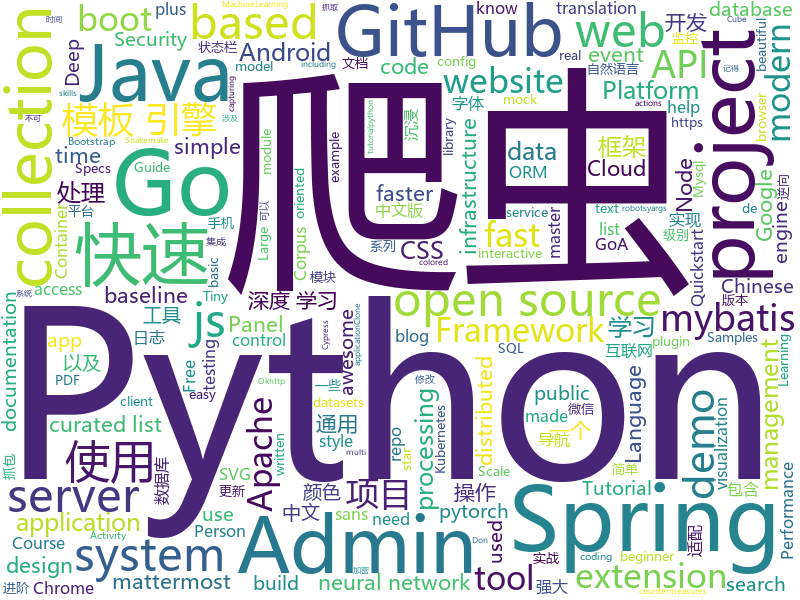

# 2019-10-27
See what the GitHub community is most excited about today.

## python
* [google-research](https://github.com/google-research/google-research)(**148 stars today**): Google AI Research
* [pytorch_geometric](https://github.com/rusty1s/pytorch_geometric)(**8 stars today**): Geometric Deep Learning Extension Library for PyTorch
* [text-to-text-transfer-transformer](https://github.com/google-research/text-to-text-transfer-transformer)(**111 stars today**): 
* [AiLearning](https://github.com/apachecn/AiLearning)(**96 stars today**): AiLearning: 机器学习 - MachineLearning - ML、深度学习 - DeepLearning - DL、自然语言处理 NLP
* [zulip](https://github.com/zulip/zulip)(**10 stars today**): Zulip server - powerful open source team chat
* [apex](https://github.com/NVIDIA/apex)(**16 stars today**): A PyTorch Extension: Tools for easy mixed precision and distributed training in Pytorch
* [chainer](https://github.com/chainer/chainer)(**3 stars today**): A flexible framework of neural networks for deep learning
* [napari](https://github.com/napari/napari)(**30 stars today**): napari: a fast, interactive, multi-dimensional image viewer for python
* [jet-bridge](https://github.com/jet-admin/jet-bridge)(**7 stars today**): Jet Bridge (Universal) for Jet Admin – API-based Admin Panel Framework for your application
* [Real-Time-Voice-Cloning](https://github.com/CorentinJ/Real-Time-Voice-Cloning)(**21 stars today**): Clone a voice in 5 seconds to generate arbitrary speech in real-time
* [matplotlib-tutorial](https://github.com/rougier/matplotlib-tutorial)(**19 stars today**): Matplotlib tutorial for beginner
* [interpy-zh](https://github.com/eastlakeside/interpy-zh)(**6 stars today**): 📘《Python进阶》（Intermediate Python 中文版）
* [awesome-python-login-model](https://github.com/Kr1s77/awesome-python-login-model)(**5 stars today**): 😮python模拟登陆一些大型网站，还有一些简单的爬虫，希望对你们有所帮助❤️，如果喜欢记得给个star哦🌟
* [wxpy](https://github.com/youfou/wxpy)(**24 stars today**): 微信机器人 / 可能是最优雅的微信个人号 API✨✨
* [Person_reID_baseline_pytorch](https://github.com/layumi/Person_reID_baseline_pytorch)(**6 stars today**): A tiny, friendly, strong pytorch implement of person re-identification baseline. Tutorial👉https://github.com/layumi/Person_reID_baseline_pytorch/tree/master/tutorial
* [learn_python3_spider](https://github.com/wistbean/learn_python3_spider)(**10 stars today**): python爬虫教程系列、从0到1学习python爬虫，包括浏览器抓包，手机APP抓包，如 fiddler、mitmproxy，各种爬虫涉及的模块的使用，如：requests、beautifulSoup、selenium、appium、scrapy等，以及IP代理，验证码识别，Mysql，MongoDB数据库的python使用，多线程多进程爬虫的使用，css 爬虫加密逆向破解，JS爬虫逆向，爬虫项目实战实例等
* [poetry](https://github.com/sdispater/poetry)(**8 stars today**): Python dependency management and packaging made easy.
* [uiautomator2](https://github.com/openatx/uiautomator2)(**4 stars today**): Android Uiautomator2 Python Wrapper
* [Mask_Guided_Portrait_Editing](https://github.com/cientgu/Mask_Guided_Portrait_Editing)(**5 stars today**): pytorch implementation of "Mask-Guided Portrait Editing with Conditional GANs"
* [mne-python](https://github.com/mne-tools/mne-python)(**3 stars today**): MNE : Magnetoencephalography (MEG) and Electroencephalography (EEG) in Python
* [yolact](https://github.com/dbolya/yolact)(**39 stars today**): A simple, fully convolutional model for real-time instance segmentation.
* [chineseGLUE](https://github.com/chineseGLUE/chineseGLUE)(**33 stars today**): Language Understanding Evaluation benchmark for Chinese: datasets, baselines, pre-trained models,corpus and leaderboard
* [AV_Data_Capture](https://github.com/yoshiko2/AV_Data_Capture)(**12 stars today**): 日本电影元数据抓取工具，配合kodi,emby等本地媒体管理工具使用
* [audio](https://github.com/pytorch/audio)(**0 stars today**): Data manipulation and transformation for audio signal processing, powered by PyTorch
* [mlcourse.ai](https://github.com/Yorko/mlcourse.ai)(**9 stars today**): Open Machine Learning Course

## java
* [algorithm004-01](https://github.com/algorithm004-01/algorithm004-01)(**92 stars today**): 
* [Auto.js](https://github.com/hyb1996/Auto.js)(**35 stars today**): A UiAutomator on android, does not need root access(安卓平台上的JavaScript自动化工具)
* [lucene-solr](https://github.com/apache/lucene-solr)(**2 stars today**): Apache Lucene and Solr open-source search software
* [flink](https://github.com/apache/flink)(**7 stars today**): Apache Flink
* [hbase](https://github.com/apache/hbase)(**3 stars today**): Mirror of Apache HBase
* [thingsboard](https://github.com/thingsboard/thingsboard)(**2 stars today**): Open-source IoT Platform - Device management, data collection, processing and visualization.
* [pulsar](https://github.com/apache/pulsar)(**8 stars today**): Apache Pulsar - distributed pub-sub messaging system
* [Android-CandyCodedApplication](https://github.com/pluralsight-projects/Android-CandyCodedApplication)(**3 stars today**): 
* [quarkus](https://github.com/quarkusio/quarkus)(**14 stars today**): Quarkus: Supersonic Subatomic Java.
* [netty](https://github.com/netty/netty)(**10 stars today**): Netty project - an event-driven asynchronous network application framework
* [quickstart-android](https://github.com/firebase/quickstart-android)(**7 stars today**): Firebase Quickstart Samples for Android
* [tablesaw](https://github.com/jtablesaw/tablesaw)(**8 stars today**): Java dataframe and visualization library
* [drools](https://github.com/kiegroup/drools)(**2 stars today**): Drools is a rule engine, DMN engine and complex event processing (CEP) engine for Java.
* [miaosha](https://github.com/qiurunze123/miaosha)(**6 stars today**): ⭐⭐⭐⭐秒杀系统设计与实现.互联网工程师进阶与分析🙋🐓
* [easyexcel](https://github.com/alibaba/easyexcel)(**44 stars today**): 快速、简单避免OOM的java处理Excel工具
* [SpringAll](https://github.com/wuyouzhuguli/SpringAll)(**17 stars today**): 循序渐进，学习Spring Boot、Spring Boot & Shiro、Spring Cloud、Spring Security & Spring Security OAuth2，博客Spring系列源码
* [spring-cloud-gcp](https://github.com/spring-cloud/spring-cloud-gcp)(**1 stars today**): Integration for Google Cloud Platform APIs with Spring
* [spring-boot-demo](https://github.com/xkcoding/spring-boot-demo)(**7 stars today**): spring boot demo 是一个用来深度学习并实战 spring boot 的项目，目前总共包含 63 个集成demo，已经完成 52 个。 该项目已成功集成 actuator(监控)、admin(可视化监控)、logback(日志)、aopLog(通过AOP记录web请求日志)、统一异常处理(json级别和页面级别)、freemarker(模板引擎)、thymeleaf(模板引擎)、Beetl(模板引擎)、Enjoy(模板引擎)、JdbcTemplate(通用JDBC操作数据库)、JPA(强大的ORM框架)、mybatis(强大的ORM框架)、通用Mapper(快速操作Mybatis)、PageHelper(通用的Mybatis分页插件)、mybatis-plus(快速操作M…
* [ImmersionBar](https://github.com/gyf-dev/ImmersionBar)(**7 stars today**): android 4.4以上沉浸式状态栏和沉浸式导航栏管理，适配横竖屏切换、刘海屏、软键盘弹出等问题，可以修改状态栏字体颜色和导航栏图标颜色，以及不可修改字体颜色手机的适配，适用于Activity、Fragment、DialogFragment、Dialog，PopupWindow，一句代码轻松实现，以及对bar的其他设置，详见README。简书请参考：http://www.jianshu.com/p/2a884e211a62
* [incubator-shardingsphere](https://github.com/apache/incubator-shardingsphere)(**14 stars today**): Distributed database middleware
* [JCSprout](https://github.com/crossoverJie/JCSprout)(**9 stars today**): 👨‍🎓Java Core Sprout : basic, concurrent, algorithm
* [aws-doc-sdk-examples](https://github.com/awsdocs/aws-doc-sdk-examples)(**1 stars today**): Code examples used in the official AWS SDK documentation.
* [MVVMHabit](https://github.com/goldze/MVVMHabit)(**4 stars today**): 👕基于谷歌最新AAC架构，MVVM设计模式的一套快速开发库，整合Okhttp+RxJava+Retrofit+Glide等主流模块，满足日常开发需求。使用该框架可以快速开发一个高质量、易维护的Android应用。
* [tutorials](https://github.com/eugenp/tutorials)(**14 stars today**): The "REST With Spring" Course:
* [incubator-druid](https://github.com/apache/incubator-druid)(**4 stars today**): Apache Druid (Incubating) - Column oriented distributed data store ideal for powering interactive applications

## unknown
* [free-books](https://github.com/ruanyf/free-books)(**176 stars today**): 互联网上的免费书籍
* [devmap](https://github.com/zualex/devmap)(**12 stars today**): Карта развития веб-разработчика
* [app-ideas](https://github.com/florinpop17/app-ideas)(**74 stars today**): A Collection of application ideas which can be used to improve your coding skills.
* [cordova-support-google-services](https://github.com/chemerisuk/cordova-support-google-services)(**0 stars today**): Cordova plugin to add google service support
* [trackerslist](https://github.com/ngosang/trackerslist)(**32 stars today**): Updated list of public BitTorrent trackers
* [MIT-Linear-Algebra-Notes](https://github.com/yizhen20133868/MIT-Linear-Algebra-Notes)(**19 stars today**): Notes for MIT-Linear-Algebra
* [Data-Science--Cheat-Sheet](https://github.com/abhat222/Data-Science--Cheat-Sheet)(**45 stars today**): Cheat Sheets
* [nlp-datasets](https://github.com/niderhoff/nlp-datasets)(**4 stars today**): Alphabetical list of free/public domain datasets with text data for use in Natural Language Processing (NLP)
* [awesome-haskell](https://github.com/albohlabs/awesome-haskell)(**10 stars today**): A curated list of amazingly awesome Haskell articles and talks for beginners.
* [weekly](https://github.com/ruanyf/weekly)(**7 stars today**): 科技爱好者周刊，每周五发布
* [awesome-gsoc-roadmap](https://github.com/realabbas/awesome-gsoc-roadmap)(**5 stars today**): A comprehensive curated list of available GSOC Guides, Write-ups and Tutorials🤠🏆
* [translations](https://github.com/oldratlee/translations)(**9 stars today**): 🐼Chinese translations for classic IT resources
* [OnJava8](https://github.com/LingCoder/OnJava8)(**8 stars today**): 《On Java 8》中文版，又名《Java编程思想》 第5版
* [CVE-2019-11043](https://github.com/jas502n/CVE-2019-11043)(**2 stars today**): php-fpm+Nginx RCE
* [CLK2019](https://github.com/ChinaLinuxKernel/CLK2019)(**2 stars today**): slides of CLK 2019 Hangzhou
* [you-dont-know-js-ru](https://github.com/azat-io/you-dont-know-js-ru)(**1 stars today**): 📚Russian translation of "You Don't Know JS" book series
* [sequelize-docs-Zh-CN](https://github.com/demopark/sequelize-docs-Zh-CN)(**2 stars today**): Sequelize 文档的中文版本 , 更新至 v5.21.1 版本.
* [awesome-go-cn](https://github.com/yinggaozhen/awesome-go-cn)(**6 stars today**): 一个很棒的Go框架、库和软件的中文收录大全。⏰脚本定期与英文文档同步，包含了各工程star数/最近更新时间，助您快速发现优质项目。Awesome Go~
* [appdocs](https://github.com/sjtuhjh/appdocs)(**2 stars today**): Application Performance Optimization Summary
* [jgm_auto_load](https://github.com/LSC527/jgm_auto_load)(**4 stars today**): 家国梦自动卸货
* [nlp_chinese_corpus](https://github.com/brightmart/nlp_chinese_corpus)(**5 stars today**): 大规模中文自然语言处理语料 Large Scale Chinese Corpus for NLP
* [awesome-actions](https://github.com/sdras/awesome-actions)(**22 stars today**): A curated list of awesome actions to use on GitHub
* [API-Security-Checklist](https://github.com/shieldfy/API-Security-Checklist)(**3 stars today**): Checklist of the most important security countermeasures when designing, testing, and releasing your API
* [book](https://github.com/qyuhen/book)(**0 stars today**): 学习笔记
* [Specs](https://github.com/CocoaPods/Specs)(**1 stars today**): The CocoaPods Master Repo

## javascript
* [folio-2019](https://github.com/brunosimon/folio-2019)(**276 stars today**): 
* [Awesome-Design-Tools](https://github.com/LisaDziuba/Awesome-Design-Tools)(**82 stars today**): The best design tools and plugins for everything👉
* [axios](https://github.com/axios/axios)(**35 stars today**): Promise based HTTP client for the browser and node.js
* [mattermost-webapp](https://github.com/mattermost/mattermost-webapp)(**2 stars today**): Webapp of Mattermost server: https://github.com/mattermost/mattermost-server
* [mitt](https://github.com/developit/mitt)(**63 stars today**): 🥊Tiny 200 byte functional event emitter / pubsub.
* [cube.js](https://github.com/cube-js/cube.js)(**86 stars today**): 📊Cube.js - Open Source Analytics Framework
* [reactjs.org](https://github.com/reactjs/reactjs.org)(**6 stars today**): The React documentation website
* [three.js](https://github.com/mrdoob/three.js)(**35 stars today**): JavaScript 3D library.
* [aimAndShoot](https://github.com/victorqribeiro/aimAndShoot)(**41 stars today**): A neuroevolution game experiment.
* [carbon](https://github.com/carbon-design-system/carbon)(**7 stars today**): A design system built by IBM
* [gatsby](https://github.com/gatsbyjs/gatsby)(**34 stars today**): Build blazing fast, modern apps and websites with React
* [pdfmake](https://github.com/bpampuch/pdfmake)(**4 stars today**): Client/server side PDF printing in pure JavaScript
* [credit-card-form](https://github.com/muhammederdem/credit-card-form)(**310 stars today**): Credit card form with smooth and sweet micro-interactions
* [send](https://github.com/mozilla/send)(**13 stars today**): Simple, private file sharing from the makers of Firefox
* [moloch](https://github.com/aol/moloch)(**2 stars today**): Moloch is an open source, large scale, full packet capturing, indexing, and database system.
* [tech-interview-handbook](https://github.com/yangshun/tech-interview-handbook)(**23 stars today**): 💯Materials to help you rock your next coding interview
* [leonsans](https://github.com/cmiscm/leonsans)(**43 stars today**): Leon Sans is a geometric sans-serif typeface made with code in 2019 by Jongmin Kim.
* [stylelint](https://github.com/stylelint/stylelint)(**5 stars today**): A mighty, modern style linter
* [juice-shop](https://github.com/bkimminich/juice-shop)(**7 stars today**): OWASP Juice Shop: Probably the most modern and sophisticated insecure web application
* [github-search](https://github.com/gwen001/github-search)(**9 stars today**): Tools to perform basic search on GitHub.
* [webpack-demos](https://github.com/ruanyf/webpack-demos)(**6 stars today**): a collection of simple demos of Webpack
* [puppeteer](https://github.com/GoogleChrome/puppeteer)(**47 stars today**): Headless Chrome Node.js API
* [keystone](https://github.com/keystonejs/keystone)(**10 stars today**): A scalable platform and CMS to build Node.js applications
* [Valetudo](https://github.com/Hypfer/Valetudo)(**15 stars today**): Self-contained control webinterface for xiaomi vacuum robots
* [yargs](https://github.com/yargs/yargs)(**3 stars today**): yargs the modern, pirate-themed successor to optimist.

## html
* [kubernetes-failure-stories](https://github.com/hjacobs/kubernetes-failure-stories)(**3 stars today**): Compilation of public failure/horror stories related to Kubernetes
* [pybluez](https://github.com/pybluez/pybluez)(**2 stars today**): Bluetooth Python extension module
* [nndl.github.io](https://github.com/nndl/nndl.github.io)(**20 stars today**): 《神经网络与深度学习》 邱锡鹏著 Neural Network and Deep Learning
* [fastText](https://github.com/facebookresearch/fastText)(**7 stars today**): Library for fast text representation and classification.
* [github-markdown-css](https://github.com/sindresorhus/github-markdown-css)(**2 stars today**): The minimal amount of CSS to replicate the GitHub Markdown style
* [flag-icon-css](https://github.com/lipis/flag-icon-css)(**0 stars today**): 🎏A collection of all country flags in SVG — plus the CSS for easier integration
* [quickstart-js](https://github.com/firebase/quickstart-js)(**7 stars today**): Firebase Quickstart Samples for Web
* [hyperblog](https://github.com/freddier/hyperblog)(**2 stars today**): Un blog increíble para el curso de Git y Github de Platzi
* [pure](https://github.com/pure-css/pure)(**3 stars today**): A set of small, responsive CSS modules that you can use in every web project.
* [embeddedsw](https://github.com/Xilinx/embeddedsw)(**0 stars today**): Xilinx Embedded Software (embeddedsw) Development
* [pdfs](https://github.com/tpn/pdfs)(**4 stars today**): Technically-oriented PDF Collection (Papers, Specs, Decks, Manuals, etc)
* [AR.js](https://github.com/jeromeetienne/AR.js)(**4 stars today**): Efficient Augmented Reality for the Web - 60fps on mobile!
* [simple-icons](https://github.com/simple-icons/simple-icons)(**5 stars today**): SVG icons for popular brands
* [gentelella](https://github.com/ColorlibHQ/gentelella)(**10 stars today**): Free Bootstrap 4 Admin Dashboard Template
* [snakemake](https://github.com/snakemake/snakemake)(**3 stars today**): This is the development home of the workflow management system Snakemake. For general information, see
* [website](https://github.com/kubernetes/website)(**4 stars today**): Kubernetes website and documentation repo:
* [cypress-example-kitchensink](https://github.com/cypress-io/cypress-example-kitchensink)(**1 stars today**): This is an example app used to showcase Cypress.io testing.
* [hacktoberfest](https://github.com/AliceWonderland/hacktoberfest)(**0 stars today**): Participate in Hacktoberfest by contributing to any Open Source project on GitHub! Here is a starter project for first time contributors. #hacktoberfest
* [wpt](https://github.com/web-platform-tests/wpt)(**3 stars today**): Test suites for Web platform specs — including WHATWG, W3C, and others
* [datasciencecoursera](https://github.com/mGalarnyk/datasciencecoursera)(**2 stars today**): Data Science Repo and blog for John Hopkins Coursera Courses. Please let me know if you have any questions.
* [beautiful-jekyll](https://github.com/daattali/beautiful-jekyll)(**2 stars today**): ✨Build a beautiful and simple website in literally minutes. Demo at http://deanattali.com/beautiful-jekyll
* [Screenshot-to-code](https://github.com/emilwallner/Screenshot-to-code)(**2 stars today**): A neural network that transforms a design mock-up into a static website.
* [nginxconfig.io](https://github.com/digitalocean/nginxconfig.io)(**16 stars today**): ⚙️NGiИX config generator on steroids💉
* [AdminLTE](https://github.com/ColorlibHQ/AdminLTE)(**17 stars today**): AdminLTE - Free Premium Admin control Panel Theme Based On Bootstrap 3.x
* [ctf-wiki](https://github.com/ctf-wiki/ctf-wiki)(**7 stars today**): CTF Wiki Online. Come and join us, we need you!

## go
* [fasthttp](https://github.com/valyala/fasthttp)(**16 stars today**): Fast HTTP package for Go. Tuned for high performance. Zero memory allocations in hot paths. Up to 10x faster than net/http
* [phuip-fpizdam](https://github.com/neex/phuip-fpizdam)(**69 stars today**): Exploit for CVE-2019-11043
* [vault](https://github.com/hashicorp/vault)(**8 stars today**): A tool for secrets management, encryption as a service, and privileged access management
* [protobuf](https://github.com/gogo/protobuf)(**7 stars today**): Protocol Buffers for Go with Gadgets
* [sourcegraph](https://github.com/sourcegraph/sourcegraph)(**6 stars today**): Code search and navigation tool (self-hosted)
* [go-admin](https://github.com/GoAdminGroup/go-admin)(**13 stars today**): A dataviz framework help gopher to build a admin panel in ten minutes
* [client-go](https://github.com/kubernetes/client-go)(**3 stars today**): Go client for Kubernetes.
* [yay](https://github.com/Jguer/yay)(**37 stars today**): Yet another Yogurt - An AUR Helper written in Go
* [chromedp](https://github.com/chromedp/chromedp)(**6 stars today**): A faster, simpler way to drive browsers supporting the Chrome DevTools Protocol.
* [test-infra](https://github.com/kubernetes/test-infra)(**1 stars today**): Test infrastructure for the Kubernetes project.
* [ultimate-go](https://github.com/hoanhan101/ultimate-go)(**498 stars today**): Ultimate Go study guide, with heavily documented code and programs analysis all in 1 place →
* [kubernetes](https://github.com/kubernetes/kubernetes)(**34 stars today**): Production-Grade Container Scheduling and Management
* [go-sx](https://github.com/travelaudience/go-sx)(**26 stars today**): Simple SQL extensions for Go
* [gotop](https://github.com/cjbassi/gotop)(**5 stars today**): A terminal based graphical activity monitor inspired by gtop and vtop
* [rook](https://github.com/rook/rook)(**6 stars today**): Storage Orchestration for Kubernetes
* [golangci-lint](https://github.com/golangci/golangci-lint)(**11 stars today**): Linters Runner for Go. 5x faster than gometalinter. Nice colored output. Can report only new issues. Fewer false-positives. Yaml/toml config.
* [prometheus](https://github.com/prometheus/prometheus)(**12 stars today**): The Prometheus monitoring system and time series database.
* [testify](https://github.com/stretchr/testify)(**10 stars today**): A toolkit with common assertions and mocks that plays nicely with the standard library
* [kubeedge](https://github.com/kubeedge/kubeedge)(**6 stars today**): Kubernetes Native Edge Computing Framework (project under CNCF)
* [nats-streaming-server](https://github.com/nats-io/nats-streaming-server)(**2 stars today**): NATS Streaming System Server
* [Yearning](https://github.com/cookieY/Yearning)(**47 stars today**): 受欢迎的 Mysql sql审核平台
* [viper](https://github.com/spf13/viper)(**11 stars today**): Go configuration with fangs
* [pulumi](https://github.com/pulumi/pulumi)(**11 stars today**): Modern Infrastructure as Code - Create, deploy, and manage infrastructure on any cloud using your favorite language.
* [beats](https://github.com/elastic/beats)(**5 stars today**): 🐠Beats - Lightweight shippers for Elasticsearch & Logstash
* [concourse](https://github.com/concourse/concourse)(**9 stars today**): Concourse is a container-based continuous thing-doer written in Go and Elm.

## WordCloud

