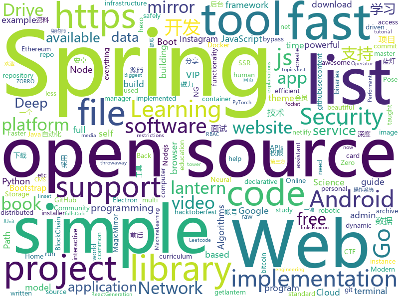

# 2019-10-28
See what the GitHub community is most excited about today.

## python
* [google-research](https://github.com/google-research/google-research)(**118 stars today**): Google AI Research
* [ML-From-Scratch](https://github.com/eriklindernoren/ML-From-Scratch)(**57 stars today**): Machine Learning From Scratch. Bare bones NumPy implementations of machine learning models and algorithms with a focus on accessibility. Aims to cover everything from linear regression to deep learning.
* [Python](https://github.com/geekcomputers/Python)(**97 stars today**): My Python Examples
* [youtube-dl](https://github.com/ytdl-org/youtube-dl)(**63 stars today**): Command-line program to download videos from YouTube.com and other video sites
* [kudeki-chain](https://github.com/seungwonpark/kudeki-chain)(**6 stars today**): Nth commit must have commit hash with N leading zeros - 진짜 구데기컵 2018
* [neural-networks-and-deep-learning](https://github.com/mnielsen/neural-networks-and-deep-learning)(**6 stars today**): Code samples for my book "Neural Networks and Deep Learning"
* [napari](https://github.com/napari/napari)(**12 stars today**): napari: a fast, interactive, multi-dimensional image viewer for python
* [faceswap](https://github.com/deepfakes/faceswap)(**19 stars today**): Deepfakes Software For All
* [gensim](https://github.com/RaRe-Technologies/gensim)(**12 stars today**): Topic Modelling for Humans
* [learnable-triangulation-pytorch](https://github.com/karfly/learnable-triangulation-pytorch)(**3 stars today**): This repository is an official PyTorch implementation of the paper "Learnable Triangulation of Human Pose" (ICCV 2019, oral). Proposed method archives state-of-the-art results in multi-view 3D human pose estimation!
* [docker-pi-hole](https://github.com/pi-hole/docker-pi-hole)(**6 stars today**): Pi-hole in a docker container
* [chromego](https://github.com/killgcd/chromego)(**5 stars today**): ChromeGo 翻墙工具包
* [yolact](https://github.com/dbolya/yolact)(**59 stars today**): A simple, fully convolutional model for real-time instance segmentation.
* [bert](https://github.com/google-research/bert)(**34 stars today**): TensorFlow code and pre-trained models for BERT
* [ColorPalette](https://github.com/rodartha/ColorPalette)(**18 stars today**): Find the dominant colors in any image
* [PayloadsAllTheThings](https://github.com/swisskyrepo/PayloadsAllTheThings)(**22 stars today**): A list of useful payloads and bypass for Web Application Security and Pentest/CTF
* [pwnagotchi](https://github.com/evilsocket/pwnagotchi)(**90 stars today**): (⌐■_■) - Deep Reinforcement Learning instrumenting bettercap for WiFi pwning.
* [AiLearning](https://github.com/apachecn/AiLearning)(**56 stars today**): AiLearning: 机器学习 - MachineLearning - ML、深度学习 - DeepLearning - DL、自然语言处理 NLP
* [AV_Data_Capture](https://github.com/yoshiko2/AV_Data_Capture)(**3 stars today**): 日本电影元数据抓取工具，配合kodi,emby等本地媒体管理工具使用
* [ArchiveBox](https://github.com/pirate/ArchiveBox)(**15 stars today**): 🗃The open source self-hosted web archive. Takes browser history/bookmarks/Pocket/Pinboard/etc., saves HTML, JS, PDFs, media, and more...
* [code_snippets](https://github.com/CoreyMSchafer/code_snippets)(**5 stars today**): 
* [InstaPy](https://github.com/timgrossmann/InstaPy)(**6 stars today**): 📷Instagram Bot - Tool for automated Instagram interactions
* [instaloader](https://github.com/instaloader/instaloader)(**9 stars today**): Download pictures (or videos) along with their captions and other metadata from Instagram.
* [bitcoinbook](https://github.com/bitcoinbook/bitcoinbook)(**16 stars today**): Mastering Bitcoin 2nd Edition - Programming the Open Blockchain
* [kitty](https://github.com/kovidgoyal/kitty)(**11 stars today**): A cross-platform, fast, feature full, GPU based terminal emulator

## java
* [algorithm004-01](https://github.com/algorithm004-01/algorithm004-01)(**99 stars today**): 
* [Mindustry](https://github.com/Anuken/Mindustry)(**15 stars today**): A sandbox tower defense game
* [fullstack-tutorial](https://github.com/frank-lam/fullstack-tutorial)(**13 stars today**): 🚀fullstack tutorial 2019，后台技术栈/架构师之路/全栈开发社区，春招/秋招/校招/面试
* [Auto.js](https://github.com/hyb1996/Auto.js)(**75 stars today**): A UiAutomator on android, does not need root access(安卓平台上的JavaScript自动化工具)
* [Java](https://github.com/TheAlgorithms/Java)(**35 stars today**): All Algorithms implemented in Java
* [runelite](https://github.com/runelite/runelite)(**2 stars today**): Open source Old School RuneScape client
* [clojure](https://github.com/clojure/clojure)(**10 stars today**): The Clojure programming language
* [testcontainers-java](https://github.com/testcontainers/testcontainers-java)(**9 stars today**): Testcontainers is a Java library that supports JUnit tests, providing lightweight, throwaway instances of common databases, Selenium web browsers, or anything else that can run in a Docker container.
* [libsvm](https://github.com/cjlin1/libsvm)(**1 stars today**): 
* [magnetW](https://github.com/dengyuhan/magnetW)(**39 stars today**): 磁力搜网页版 - 磁力链接聚合搜索 - https://bt.lansou.pw
* [backtobackswe](https://github.com/bephrem1/backtobackswe)(**8 stars today**): Code Examples For Back To Back SWE Lessons
* [CS-Notes](https://github.com/CyC2018/CS-Notes)(**85 stars today**): 📚Tech Interview Guide 技术面试必备基础知识、Leetcode、Java、C++、Python、后端面试、计算机操作系统、计算机网络、系统设计
* [spring-analysis](https://github.com/seaswalker/spring-analysis)(**15 stars today**): Spring源码阅读
* [eladmin](https://github.com/elunez/eladmin)(**45 stars today**): 项目基于 Spring Boot 2.1.0 、 Jpa、 Spring Security、redis、Vue的前后端分离的后台管理系统，项目采用分模块开发方式， 权限控制采用 RBAC，支持数据字典与数据权限管理，支持一键生成前后端代码，支持动态路由
* [keepass2android](https://github.com/PhilippC/keepass2android)(**5 stars today**): Password manager app for Android
* [dropwizard](https://github.com/dropwizard/dropwizard)(**4 stars today**): A damn simple library for building production-ready RESTful web services.
* [termux-app](https://github.com/termux/termux-app)(**12 stars today**): Android terminal and Linux environment - app repository.
* [calcite](https://github.com/apache/calcite)(**2 stars today**): Mirror of Apache Calcite
* [zuul](https://github.com/Netflix/zuul)(**11 stars today**): Zuul is a gateway service that provides dynamic routing, monitoring, resiliency, security, and more.
* [ghidra](https://github.com/NationalSecurityAgency/ghidra)(**23 stars today**): Ghidra is a software reverse engineering (SRE) framework
* [Pix-EzViewer](https://github.com/Notsfsssf/Pix-EzViewer)(**8 stars today**): 一个支持免代理直连及查看动图的第三方Pixiv android客户端
* [bitcoinj](https://github.com/bitcoinj/bitcoinj)(**4 stars today**): A library for working with Bitcoin
* [graal](https://github.com/oracle/graal)(**13 stars today**): GraalVM: Run Programs Faster Anywhere🚀
* [SpringAll](https://github.com/wuyouzhuguli/SpringAll)(**28 stars today**): 循序渐进，学习Spring Boot、Spring Boot & Shiro、Spring Cloud、Spring Security & Spring Security OAuth2，博客Spring系列源码

## unknown
* [free-books](https://github.com/ruanyf/free-books)(**126 stars today**): 互联网上的免费书籍
* [Data-Science--Cheat-Sheet](https://github.com/abhat222/Data-Science--Cheat-Sheet)(**55 stars today**): Cheat Sheets
* [project-based-learning](https://github.com/tuvtran/project-based-learning)(**20 stars today**): Curated list of project-based tutorials
* [open-source-cs](https://github.com/ForrestKnight/open-source-cs)(**15 stars today**): Video discussing this curriculum:
* [shadowsocks-rss](https://github.com/shadowsocksr-backup/shadowsocks-rss)(**5 stars today**): ShadowsocksR update rss, SSR organization
* [coding-interview-university](https://github.com/jwasham/coding-interview-university)(**63 stars today**): A complete computer science study plan to become a software engineer.
* [devmap](https://github.com/zualex/devmap)(**10 stars today**): Карта развития веб-разработчика
* [php-rfcs](https://github.com/php/php-rfcs)(**4 stars today**): Experimental repo for GitHub based RFC workflow. For now, please don't submit PRs.
* [mod](https://github.com/lavendnigth/mod)(**1 stars today**): 
* [gibl](https://github.com/bor0/gibl)(**4 stars today**): Book: Gentle Introduction to Blockchain with Lisp
* [Nodejs-Roadmap](https://github.com/Q-Angelo/Nodejs-Roadmap)(**10 stars today**): 【Nodejs-Roadmap】侧重于 Node.js 服务端的开发指南，公众号 “Nodejs技术栈”
* [ExampleMod](https://github.com/Anuken/ExampleMod)(**3 stars today**): An example of a simple mod for Mindustry.
* [data-science](https://github.com/ossu/data-science)(**5 stars today**): 📊Path to a free self-taught education in Data Science!
* [first-contributions](https://github.com/firstcontributions/first-contributions)(**11 stars today**): 🚀✨Help beginners to contribute to open source projects
* [Projects](https://github.com/karan/Projects)(**5 stars today**): 📃A list of practical projects that anyone can solve in any programming language.
* [electron-ssr-backup](https://github.com/qingshuisiyuan/electron-ssr-backup)(**24 stars today**): electron-ssr原作者删除了这个伟大的项目，故备份了下来，不继续开发,且用且珍惜
* [Cheatsheet-God](https://github.com/OlivierLaflamme/Cheatsheet-God)(**21 stars today**): Penetration Testing Biggest Reference Bank - OSCP / PTP & PTX Cheatsheet
* [computer-science](https://github.com/ossu/computer-science)(**35 stars today**): 🎓Path to a free self-taught education in Computer Science!
* [free-programming-books](https://github.com/EbookFoundation/free-programming-books)(**43 stars today**): 📚Freely available programming books
* [awesome](https://github.com/sindresorhus/awesome)(**39 stars today**): 😎Awesome lists about all kinds of interesting topics
* [awesome-robotic-tooling](https://github.com/Ly0n/awesome-robotic-tooling)(**16 stars today**): Just a bunch of powerful robotic resources and tools for professional robotic development with ROS in C++ and Python.
* [new-pac](https://github.com/Alvin9999/new-pac)(**13 stars today**): 
* [android](https://github.com/LineageOS/android)(**0 stars today**): 
* [hosts](https://github.com/googlehosts/hosts)(**16 stars today**): 镜像：https://coding.net/u/scaffrey/p/hosts/git
* [wildcat-vip-account](https://github.com/wuxingsanren/wildcat-vip-account)(**9 stars today**): 野猫VIP帐号 - 每天分享最新的百度网盘SVIP、迅雷超级会员、优酷VIP会员、苹果ID等等各类VIP帐号，随取随用，完全免费，绝无套路，欢迎推荐分享给好友！

## javascript
* [mobile-first-animation](https://github.com/aholachek/mobile-first-animation)(**308 stars today**): Performant gesture-driven animation on the mobile web
* [credit-card-form](https://github.com/muhammederdem/credit-card-form)(**669 stars today**): Credit card form with smooth and sweet micro-interactions
* [cube.js](https://github.com/cube-js/cube.js)(**39 stars today**): 📊Cube.js - Open Source Analytics Framework
* [folio-2019](https://github.com/brunosimon/folio-2019)(**173 stars today**): 
* [iptv](https://github.com/iptv-org/iptv)(**127 stars today**): Collection of 8000+ publicly available IPTV channels from all over the world
* [javascript-algorithms](https://github.com/trekhleb/javascript-algorithms)(**76 stars today**): 📝Algorithms and data structures implemented in JavaScript with explanations and links to further readings
* [gatsby](https://github.com/gatsbyjs/gatsby)(**31 stars today**): Build blazing fast, modern apps and websites with React
* [mermaid](https://github.com/knsv/mermaid)(**100 stars today**): Generation of diagram and flowchart from text in a similar manner as markdown
* [discord.js](https://github.com/discordjs/discord.js)(**4 stars today**): A powerful JavaScript library for interacting with the Discord API
* [axios-crash](https://github.com/bradtraversy/axios-crash)(**25 stars today**): Axios crash course files
* [awesome-blockchain-cn](https://github.com/chaozh/awesome-blockchain-cn)(**54 stars today**): 收集所有区块链(BlockChain)技术开发相关资料，包括Fabric和Ethereum开发资料
* [hexo-theme-yilia](https://github.com/litten/hexo-theme-yilia)(**4 stars today**): 一个简洁优雅的hexo主题 A simple and elegant theme for hexo.
* [freeCodeCamp](https://github.com/freeCodeCamp/freeCodeCamp)(**52 stars today**): The https://www.freeCodeCamp.org open source codebase and curriculum. Learn to code for free together with millions of people.
* [etcher](https://github.com/balena-io/etcher)(**10 stars today**): Flash OS images to SD cards & USB drives, safely and easily.
* [Motrix](https://github.com/agalwood/Motrix)(**18 stars today**): A full-featured download manager.
* [auto-task-helper](https://github.com/Dcatfly/auto-task-helper)(**10 stars today**): 依赖于Auto.js(Android)，自动化执行双十一电商们的任务
* [Fantasy-Map-Generator](https://github.com/Azgaar/Fantasy-Map-Generator)(**3 stars today**): Web application generating interactive and customizable maps
* [uBlock](https://github.com/gorhill/uBlock)(**17 stars today**): uBlock Origin - An efficient blocker for Chromium and Firefox. Fast and lean.
* [homebridge](https://github.com/nfarina/homebridge)(**11 stars today**): HomeKit support for the impatient
* [Awesome-Design-Tools](https://github.com/LisaDziuba/Awesome-Design-Tools)(**88 stars today**): The best design tools and plugins for everything👉
* [MagicMirror](https://github.com/MichMich/MagicMirror)(**12 stars today**): MagicMirror² is an open source modular smart mirror platform. With a growing list of installable modules, the MagicMirror² allows you to convert your hallway or bathroom mirror into your personal assistant.
* [keystone](https://github.com/keystonejs/keystone)(**16 stars today**): A scalable platform and CMS to build Node.js applications
* [opensource.guide](https://github.com/github/opensource.guide)(**5 stars today**): 📚Community guides for open source creators
* [plexis](https://github.com/plexis-js/plexis)(**3 stars today**): Lo-fi, powerful, community-driven string manipulation library.
* [Angular-AlbumStoreProductPage](https://github.com/pluralsight-projects/Angular-AlbumStoreProductPage)(**3 stars today**): 

## html
* [ctf-wiki](https://github.com/ctf-wiki/ctf-wiki)(**2 stars today**): CTF Wiki Online. Come and join us, we need you!
* [awesome-piracy](https://github.com/Igglybuff/awesome-piracy)(**15 stars today**): A curated list of awesome warez and piracy links
* [fluxion](https://github.com/FluxionNetwork/fluxion)(**5 stars today**): Fluxion is a remake of linset by vk496 with less bugs and enhanced functionality.
* [twofactorauth](https://github.com/2factorauth/twofactorauth)(**3 stars today**): List of sites with two factor auth support which includes SMS, email, phone calls, hardware, and software.
* [nndl.github.io](https://github.com/nndl/nndl.github.io)(**18 stars today**): 《神经网络与深度学习》 邱锡鹏著 Neural Network and Deep Learning
* [html](https://github.com/whatwg/html)(**2 stars today**): HTML Standard
* [coreui-free-bootstrap-admin-template](https://github.com/coreui/coreui-free-bootstrap-admin-template)(**8 stars today**): CoreUI is free bootstrap admin template
* [stisla](https://github.com/stisla/stisla)(**4 stars today**): Free Bootstrap Admin Template
* [uPlot](https://github.com/leeoniya/uPlot)(**23 stars today**): 📈An exceptionally fast, tiny time series chart
* [polynote](https://github.com/Netflix/polynote)(**5 stars today**): 
* [hacktoberfest](https://github.com/AliceWonderland/hacktoberfest)(**1 stars today**): Participate in Hacktoberfest by contributing to any Open Source project on GitHub! Here is a starter project for first time contributors. #hacktoberfest
* [beautiful-jekyll](https://github.com/daattali/beautiful-jekyll)(**4 stars today**): ✨Build a beautiful and simple website in literally minutes. Demo at http://deanattali.com/beautiful-jekyll
* [go101](https://github.com/go101/go101)(**6 stars today**): An online book focusing on Go syntax/semantics.
* [COMP9021_19T3](https://github.com/marey/COMP9021_19T3)(**1 stars today**): 
* [HiddenEye](https://github.com/DarkSecDevelopers/HiddenEye)(**3 stars today**): Modern Phishing Tool With Advanced Functionality And Multiple Tunnelling Services [ Android-Support-Available ]
* [hugo-coder](https://github.com/luizdepra/hugo-coder)(**2 stars today**): A minimalist blog theme for hugo.
* [electron-api-demos](https://github.com/electron/electron-api-demos)(**1 stars today**): Explore the Electron APIs
* [home-assistant.io](https://github.com/home-assistant/home-assistant.io)(**1 stars today**): 📘Home Assistant User documentation
* [repo-badges](https://github.com/dwyl/repo-badges)(**1 stars today**): ⭐️Use repo badges (build passing, coverage, etc) in your readme/markdown file to signal code quality in a project.
* [personal-website](https://github.com/github/personal-website)(**8 stars today**): Code that'll help you kickstart a personal website that showcases your work as a software developer.
* [Introduction-to-Web-Development](https://github.com/WebDevSimplified/Introduction-to-Web-Development)(**1 stars today**): 
* [ng-alain](https://github.com/ng-alain/ng-alain)(**4 stars today**): NG-ZORRO admin panel front-end framework (netlify mirror https://netlify.ng-alain.com/)
* [GLaDOS](https://github.com/glados-network/GLaDOS)(**10 stars today**): status of GLaDOS
* [web-api-auth-examples](https://github.com/spotify/web-api-auth-examples)(**1 stars today**): Basic examples to authenticate and fetch data using the Spotify Web API
* [startbootstrap-resume](https://github.com/BlackrockDigital/startbootstrap-resume)(**3 stars today**): A Bootstrap 4 resume/CV theme created by Start Bootstrap

## go
* [go-ethereum](https://github.com/ethereum/go-ethereum)(**13 stars today**): Official Go implementation of the Ethereum protocol
* [ultimate-go](https://github.com/hoanhan101/ultimate-go)(**152 stars today**): Ultimate Go study guide, with heavily documented code and programs analysis all in 1 place →
* [phuip-fpizdam](https://github.com/neex/phuip-fpizdam)(**124 stars today**): Exploit for CVE-2019-11043
* [rclone](https://github.com/rclone/rclone)(**23 stars today**): "rsync for cloud storage" - Google Drive, Amazon Drive, S3, Dropbox, Backblaze B2, One Drive, Swift, Hubic, Cloudfiles, Google Cloud Storage, Yandex Files
* [btcd](https://github.com/btcsuite/btcd)(**1 stars today**): An alternative full node bitcoin implementation written in Go (golang)
* [gobuster](https://github.com/OJ/gobuster)(**5 stars today**): Directory/File, DNS and VHost busting tool written in Go
* [syncthing](https://github.com/syncthing/syncthing)(**36 stars today**): Open Source Continuous File Synchronization
* [vault](https://github.com/hashicorp/vault)(**10 stars today**): A tool for secrets management, encryption as a service, and privileged access management
* [go-jose](https://github.com/square/go-jose)(**29 stars today**): An implementation of JOSE standards (JWE, JWS, JWT) in Go
* [fasthttp](https://github.com/valyala/fasthttp)(**44 stars today**): Fast HTTP package for Go. Tuned for high performance. Zero memory allocations in hot paths. Up to 10x faster than net/http
* [restic](https://github.com/restic/restic)(**22 stars today**): Fast, secure, efficient backup program
* [v2ray-core](https://github.com/v2ray/v2ray-core)(**56 stars today**): A platform for building proxies to bypass network restrictions.
* [gopeed](https://github.com/monkeyWie/gopeed)(**1 stars today**): A fast download client,support HTTP&P2P.
* [lazygit](https://github.com/jesseduffield/lazygit)(**8 stars today**): simple terminal UI for git commands
* [testify](https://github.com/stretchr/testify)(**10 stars today**): A toolkit with common assertions and mocks that plays nicely with the standard library
* [libpod](https://github.com/containers/libpod)(**25 stars today**): libpod is a library used to create container pods. Home of Podman.
* [consul](https://github.com/hashicorp/consul)(**2 stars today**): Consul is a distributed, highly available, and data center aware solution to connect and configure applications across dynamic, distributed infrastructure.
* [filebrowser](https://github.com/filebrowser/filebrowser)(**9 stars today**): 📂Web File Browser which can be used as a middleware or standalone app.
* [lantern](https://github.com/getlantern/lantern)(**23 stars today**): 蓝灯Windows下载 https://raw.githubusercontent.com/getlantern/lantern-binaries/master/lantern-installer.exe 蓝灯安卓下载 https://raw.githubusercontent.com/getlantern/lantern-binaries/master/lantern-installer.apk
* [k3s](https://github.com/rancher/k3s)(**17 stars today**): Lightweight Kubernetes. 5 less than k8s.
* [helm-operator](https://github.com/fluxcd/helm-operator)(**2 stars today**): The Flux Helm Operator, for declarative Helming
* [lnd](https://github.com/lightningnetwork/lnd)(**2 stars today**): Lightning Network Daemon⚡️
* [terraform](https://github.com/hashicorp/terraform)(**8 stars today**): Terraform enables you to safely and predictably create, change, and improve infrastructure. It is an open source tool that codifies APIs into declarative configuration files that can be shared amongst team members, treated as code, edited, reviewed, and versioned.
* [annie](https://github.com/iawia002/annie)(**10 stars today**): 👾Fast, simple and clean video downloader
* [hugo](https://github.com/gohugoio/hugo)(**18 stars today**): The world’s fastest framework for building websites.

## WordCloud

