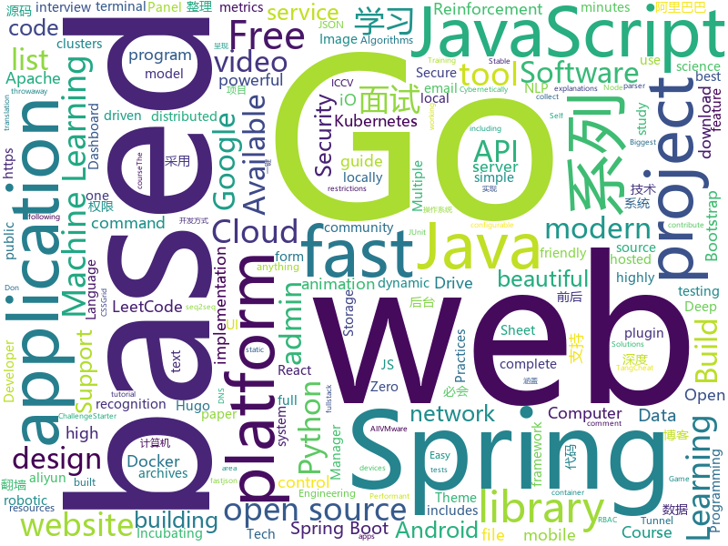

# 2019-10-29
See what the GitHub community is most excited about today.

## python
* [youtube-dl](https://github.com/ytdl-org/youtube-dl)(**99 stars today**): Command-line program to download videos from YouTube.com and other video sites
* [Python](https://github.com/geekcomputers/Python)(**110 stars today**): My Python Examples
* [face_recognition](https://github.com/ageitgey/face_recognition)(**36 stars today**): The world's simplest facial recognition api for Python and the command line
* [faceswap](https://github.com/deepfakes/faceswap)(**36 stars today**): Deepfakes Software For All
* [unlocker](https://github.com/DrDonk/unlocker)(**8 stars today**): VMware Workstation macOS
* [mlcourse.ai](https://github.com/Yorko/mlcourse.ai)(**9 stars today**): Open Machine Learning Course
* [scikit-learn](https://github.com/scikit-learn/scikit-learn)(**22 stars today**): scikit-learn: machine learning in Python
* [WatchAD](https://github.com/0Kee-Team/WatchAD)(**94 stars today**): AD Security Intrusion Detection System
* [google-research](https://github.com/google-research/google-research)(**183 stars today**): Google AI Research
* [chromego](https://github.com/killgcd/chromego)(**8 stars today**): ChromeGo 翻墙工具包
* [bert](https://github.com/google-research/bert)(**69 stars today**): TensorFlow code and pre-trained models for BERT
* [system-design-primer](https://github.com/donnemartin/system-design-primer)(**71 stars today**): Learn how to design large-scale systems. Prep for the system design interview. Includes Anki flashcards.
* [ipwndfu](https://github.com/axi0mX/ipwndfu)(**33 stars today**): open-source jailbreaking tool for many iOS devices
* [algo](https://github.com/wangzheng0822/algo)(**23 stars today**): 数据结构和算法必知必会的50个代码实现
* [DewarpNet](https://github.com/cvlab-stonybrook/DewarpNet)(**4 stars today**): Code for the paper "DewarpNet: Single-Image Document Unwarping With Stacked 3D and 2D Regression Networks" (ICCV '19)
* [kitty](https://github.com/kovidgoyal/kitty)(**17 stars today**): A cross-platform, fast, feature full, GPU based terminal emulator
* [docker-pi-hole](https://github.com/pi-hole/docker-pi-hole)(**7 stars today**): Pi-hole in a docker container
* [baselines](https://github.com/openai/baselines)(**9 stars today**): OpenAI Baselines: high-quality implementations of reinforcement learning algorithms
* [pwnagotchi](https://github.com/evilsocket/pwnagotchi)(**54 stars today**): (⌐■_■) - Deep Reinforcement Learning instrumenting bettercap for WiFi pwning.
* [manim](https://github.com/3b1b/manim)(**23 stars today**): Animation engine for explanatory math videos
* [home-assistant](https://github.com/home-assistant/home-assistant)(**34 stars today**): 🏡Open source home automation that puts local control and privacy first
* [yahoo-group-archiver](https://github.com/IgnoredAmbience/yahoo-group-archiver)(**3 stars today**): Scrapes and archives a Yahoo groups email archives, photo galleries and file contents using the non-public API
* [bitcoinbook](https://github.com/bitcoinbook/bitcoinbook)(**26 stars today**): Mastering Bitcoin 2nd Edition - Programming the Open Blockchain
* [seq2seq-couplet](https://github.com/wb14123/seq2seq-couplet)(**29 stars today**): Play couplet with seq2seq model. 用深度学习对对联。
* [instaloader](https://github.com/instaloader/instaloader)(**20 stars today**): Download pictures (or videos) along with their captions and other metadata from Instagram.

## java
* [fullstack-tutorial](https://github.com/frank-lam/fullstack-tutorial)(**65 stars today**): 🚀fullstack tutorial 2019，后台技术栈/架构师之路/全栈开发社区，春招/秋招/校招/面试
* [spring-analysis](https://github.com/seaswalker/spring-analysis)(**57 stars today**): Spring源码阅读
* [JavaGuide](https://github.com/Snailclimb/JavaGuide)(**126 stars today**): 【Java学习+面试指南】 一份涵盖大部分Java程序员所需要掌握的核心知识。
* [AndroidUtilCode](https://github.com/Blankj/AndroidUtilCode)(**20 stars today**): 🔥Android developers should collect the following utils(updating).
* [tutorials](https://github.com/eugenp/tutorials)(**33 stars today**): The "REST With Spring" Course:
* [canal](https://github.com/alibaba/canal)(**31 stars today**): 阿里巴巴 MySQL binlog 增量订阅&消费组件
* [springfox](https://github.com/springfox/springfox)(**8 stars today**): Automated JSON API documentation for API's built with Spring
* [nacos](https://github.com/alibaba/nacos)(**23 stars today**): an easy-to-use dynamic service discovery, configuration and service management platform for building cloud native applications.
* [Auto.js](https://github.com/hyb1996/Auto.js)(**76 stars today**): A UiAutomator on android, does not need root access(安卓平台上的JavaScript自动化工具)
* [SpringAll](https://github.com/wuyouzhuguli/SpringAll)(**46 stars today**): 循序渐进，学习Spring Boot、Spring Boot & Shiro、Spring Cloud、Spring Security & Spring Security OAuth2，博客Spring系列源码
* [eladmin](https://github.com/elunez/eladmin)(**55 stars today**): 项目基于 Spring Boot 2.1.0 、 Jpa、 Spring Security、redis、Vue的前后端分离的后台管理系统，项目采用分模块开发方式， 权限控制采用 RBAC，支持数据字典与数据权限管理，支持一键生成前后端代码，支持动态路由
* [otter](https://github.com/alibaba/otter)(**9 stars today**): 阿里巴巴分布式数据库同步系统(解决中美异地机房)
* [fastjson](https://github.com/alibaba/fastjson)(**18 stars today**): 🚄A fast JSON parser/generator for Java. (Aliyun Data Lake Analytics https://www.aliyun.com/product/datalakeanalytics powered by fastjson )
* [graylog2-server](https://github.com/Graylog2/graylog2-server)(**2 stars today**): Free and open source log management
* [rocketmq-externals](https://github.com/apache/rocketmq-externals)(**8 stars today**): Mirror of Apache RocketMQ (Incubating)
* [LeetCodeAnimation](https://github.com/MisterBooo/LeetCodeAnimation)(**84 stars today**): Demonstrate all the questions on LeetCode in the form of animation.（用动画的形式呈现解LeetCode题目的思路）
* [testcontainers-java](https://github.com/testcontainers/testcontainers-java)(**15 stars today**): Testcontainers is a Java library that supports JUnit tests, providing lightweight, throwaway instances of common databases, Selenium web browsers, or anything else that can run in a Docker container.
* [open-liberty](https://github.com/OpenLiberty/open-liberty)(**0 stars today**): Open Liberty is a highly composable, fast to start, dynamic application server runtime environment
* [CS-Notes](https://github.com/CyC2018/CS-Notes)(**95 stars today**): 📚Tech Interview Guide 技术面试必备基础知识、Leetcode、Java、C++、Python、后端面试、计算机操作系统、计算机网络、系统设计
* [micrometer](https://github.com/micrometer-metrics/micrometer)(**3 stars today**): An application metrics facade for the most popular monitoring tools. Think SLF4J, but for metrics.
* [PGM](https://github.com/Electroid/PGM)(**3 stars today**): The original PvP Game Manager for Minecraft
* [hbase](https://github.com/apache/hbase)(**2 stars today**): Mirror of Apache HBase
* [incubator-druid](https://github.com/apache/incubator-druid)(**3 stars today**): Apache Druid (Incubating) - Column oriented distributed data store ideal for powering interactive applications
* [bitcoinj](https://github.com/bitcoinj/bitcoinj)(**5 stars today**): A library for working with Bitcoin
* [kafka](https://github.com/apache/kafka)(**16 stars today**): Mirror of Apache Kafka

## unknown
* [deep-learning-drizzle](https://github.com/kmario23/deep-learning-drizzle)(**167 stars today**): Drench yourself in Deep Learning, Reinforcement Learning, Machine Learning, Computer Vision, and NLP by learning from these exciting lectures!!
* [free-books](https://github.com/ruanyf/free-books)(**301 stars today**): 互联网上的免费书籍
* [eng-practices](https://github.com/google/eng-practices)(**45 stars today**): Google's Engineering Practices documentation
* [trackerslist](https://github.com/ngosang/trackerslist)(**62 stars today**): Updated list of public BitTorrent trackers
* [Cookbook](https://github.com/andkret/Cookbook)(**17 stars today**): The Data Engineering Cookbook
* [kubernetes-the-hard-way](https://github.com/kelseyhightower/kubernetes-the-hard-way)(**30 stars today**): Bootstrap Kubernetes the hard way on Google Cloud Platform. No scripts.
* [modern-cpp-features](https://github.com/AnthonyCalandra/modern-cpp-features)(**16 stars today**): A cheatsheet of modern C++ language and library features.
* [coding-interview-university](https://github.com/jwasham/coding-interview-university)(**75 stars today**): A complete computer science study plan to become a software engineer.
* [Azure-Readiness-Checklist](https://github.com/ghostinthewires/Azure-Readiness-Checklist)(**41 stars today**): This checklist is your guide to the best practices for deploying secure, scalable, and highly available infrastructure in Azure. Before you go live, go through each item, and make sure you haven't missed anything important!
* [awesome-robotic-tooling](https://github.com/Ly0n/awesome-robotic-tooling)(**13 stars today**): Just a bunch of powerful robotic resources and tools for professional robotic development with ROS in C++ and Python.
* [few-shot-vid2vid](https://github.com/NVlabs/few-shot-vid2vid)(**61 stars today**): 
* [daily-paper-computer-vision](https://github.com/amusi/daily-paper-computer-vision)(**44 stars today**): 记录每天整理的计算机视觉/深度学习/机器学习相关方向的论文
* [iccv2019](https://github.com/extreme-assistant/iccv2019)(**38 stars today**): ICCV 2019 papers/new汇总帖，极市团队整理
* [blockchain](https://github.com/LiuBoyu/blockchain)(**46 stars today**): 区块链 - 中文资源
* [nlp-beginner](https://github.com/FudanNLP/nlp-beginner)(**24 stars today**): NLP上手教程
* [awesome-ml-for-cybersecurity](https://github.com/jivoi/awesome-ml-for-cybersecurity)(**7 stars today**): Machine Learning for Cyber Security
* [bioinformatics-one-liners](https://github.com/crazyhottommy/bioinformatics-one-liners)(**26 stars today**): Bioinformatics one liners from Ming Tang
* [Data-Science--Cheat-Sheet](https://github.com/abhat222/Data-Science--Cheat-Sheet)(**59 stars today**): Cheat Sheets
* [Blog](https://github.com/mqyqingfeng/Blog)(**24 stars today**): 冴羽写博客的地方，预计写四个系列：JavaScript深入系列、JavaScript专题系列、ES6系列、React系列。
* [rfcs](https://github.com/reactjs/rfcs)(**2 stars today**): RFCs for changes to React
* [Cheatsheet-God](https://github.com/OlivierLaflamme/Cheatsheet-God)(**40 stars today**): Penetration Testing Biggest Reference Bank - OSCP / PTP & PTX Cheatsheet
* [awesome-action-recognition](https://github.com/jinwchoi/awesome-action-recognition)(**5 stars today**): A curated list of action recognition and related area resources
* [products](https://github.com/Embdefire/products)(**3 stars today**): 野火所有产品资料的下载链接
* [Java-Interview](https://github.com/gzc426/Java-Interview)(**26 stars today**): Java 面试必会 直通BAT
* [you-dont-know-js-ru](https://github.com/azat-io/you-dont-know-js-ru)(**5 stars today**): 📚Russian translation of "You Don't Know JS" book series

## javascript
* [folio-2019](https://github.com/brunosimon/folio-2019)(**107 stars today**): 
* [vue-interactive-paycard](https://github.com/muhammederdem/vue-interactive-paycard)(**493 stars today**): Credit card form with smooth and sweet micro-interactions
* [javascript-algorithms](https://github.com/trekhleb/javascript-algorithms)(**112 stars today**): 📝Algorithms and data structures implemented in JavaScript with explanations and links to further readings
* [awesome-selfhosted](https://github.com/awesome-selfhosted/awesome-selfhosted)(**177 stars today**): This is a list of Free Software network services and web applications which can be hosted locally. Selfhosting is the process of locally hosting and managing applications instead of renting from SaaS providers.
* [slate](https://github.com/ianstormtaylor/slate)(**23 stars today**): A completely customizable framework for building rich text editors. (Currently in beta.)
* [svelte](https://github.com/sveltejs/svelte)(**70 stars today**): Cybernetically enhanced web apps
* [remote-jobs](https://github.com/remoteintech/remote-jobs)(**14 stars today**): A list of semi to fully remote-friendly companies in tech.
* [generator-jhipster](https://github.com/jhipster/generator-jhipster)(**8 stars today**): Open Source application platform for creating Spring Boot + Angular/React projects in seconds!
* [iptv](https://github.com/iptv-org/iptv)(**186 stars today**): Collection of 8000+ publicly available IPTV channels from all over the world
* [discord.js](https://github.com/discordjs/discord.js)(**8 stars today**): A powerful JavaScript library for interacting with the Discord API
* [gitalk](https://github.com/gitalk/gitalk)(**3 stars today**): Gitalk is a modern comment component based on Github Issue and Preact.
* [fanqiang](https://github.com/bannedbook/fanqiang)(**21 stars today**): 翻墙-科学上网
* [complete-javascript-course](https://github.com/jonasschmedtmann/complete-javascript-course)(**7 stars today**): Starter files, final projects and FAQ for my Complete JavaScript course
* [Awesome-Design-Tools](https://github.com/LisaDziuba/Awesome-Design-Tools)(**36 stars today**): The best design tools and plugins for everything👉
* [primary](https://github.com/javascriptteacher/primary)(**5 stars today**): 
* [mobile-first-animation](https://github.com/aholachek/mobile-first-animation)(**281 stars today**): Performant gesture-driven animation on the mobile web
* [comments-api](https://github.com/dev-mastery/comments-api)(**7 stars today**): 
* [open-pixel-art](https://github.com/twilio-labs/open-pixel-art)(**5 stars today**): A collaborative pixel art project to teach people how to contribute to open-source
* [gatsby](https://github.com/gatsbyjs/gatsby)(**43 stars today**): Build blazing fast, modern apps and websites with React
* [Motrix](https://github.com/agalwood/Motrix)(**22 stars today**): A full-featured download manager.
* [Valetudo](https://github.com/Hypfer/Valetudo)(**8 stars today**): Self-contained control webinterface for xiaomi vacuum robots
* [mermaid](https://github.com/knsv/mermaid)(**91 stars today**): Generation of diagram and flowchart from text in a similar manner as markdown
* [plexis](https://github.com/plexis-js/plexis)(**24 stars today**): Lo-fi, powerful, community-driven string manipulation library.
* [cgm-remote-monitor](https://github.com/nightscout/cgm-remote-monitor)(**1 stars today**): nightscout web monitor
* [carbon](https://github.com/carbon-app/carbon)(**17 stars today**): 🎨Create and share beautiful images of your source code

## html
* [AdminLTE](https://github.com/ColorlibHQ/AdminLTE)(**32 stars today**): AdminLTE - Free Premium Admin control Panel Theme Based On Bootstrap 3.x
* [tabler](https://github.com/tabler/tabler)(**13 stars today**): Tabler is free and open-source HTML Dashboard UI Kit built on Bootstrap
* [beautiful-jekyll](https://github.com/daattali/beautiful-jekyll)(**5 stars today**): ✨Build a beautiful and simple website in literally minutes. Demo at http://deanattali.com/beautiful-jekyll
* [twofactorauth](https://github.com/2factorauth/twofactorauth)(**2 stars today**): List of sites with two factor auth support which includes SMS, email, phone calls, hardware, and software.
* [JavaScript30](https://github.com/wesbos/JavaScript30)(**13 stars today**): 30 Day Vanilla JS Challenge
* [css-grid](https://github.com/wesbos/css-grid)(**0 stars today**): Starter Files + Solutions to my CSSGrid.io Course
* [COMP9021_19T3](https://github.com/marey/COMP9021_19T3)(**0 stars today**): 
* [REKCARC-TSC-UHT](https://github.com/PKUanonym/REKCARC-TSC-UHT)(**10 stars today**): 清华大学计算机系课程攻略 Guidance for courses in Department of Computer Science and Technology, Tsinghua University
* [polynote](https://github.com/Netflix/polynote)(**5 stars today**): 
* [OpenClash](https://github.com/vernesong/OpenClash)(**3 stars today**): A Clash Client For OpenWrt
* [roll20-character-sheets](https://github.com/Roll20/roll20-character-sheets)(**0 stars today**): Character sheet templates created by the community for use in Roll20.
* [GLaDOS](https://github.com/glados-network/GLaDOS)(**7 stars today**): status of GLaDOS
* [webdevbootcamp](https://github.com/nax3t/webdevbootcamp)(**3 stars today**): All source code for back-end projects from the Web Developer Bootcamp
* [python_ebook](https://github.com/shihyu/python_ebook)(**14 stars today**): 
* [xiaolai.github.io](https://github.com/xiaolai/xiaolai.github.io)(**3 stars today**): an ever-growing brain
* [speedtest](https://github.com/librespeed/speedtest)(**5 stars today**): Self-hosted Speedtest for HTML5 and more. Easy setup, examples, configurable, mobile friendly. Supports PHP, Node, Multiple servers, and more
* [gohugo-theme-ananke](https://github.com/budparr/gohugo-theme-ananke)(**0 stars today**): Ananke: A theme for Hugo Sites
* [blockchain-demo](https://github.com/anders94/blockchain-demo)(**2 stars today**): A web-based demonstration of blockchain concepts.
* [HiddenEye](https://github.com/DarkSecDevelopers/HiddenEye)(**4 stars today**): Modern Phishing Tool With Advanced Functionality And Multiple Tunnelling Services [ Android-Support-Available ]
* [skrollr](https://github.com/Prinzhorn/skrollr)(**1 stars today**): Stand-alone parallax scrolling library for mobile (Android + iOS) and desktop. No jQuery. Just plain JavaScript (and some love).
* [Screenshot-to-code](https://github.com/emilwallner/Screenshot-to-code)(**5 stars today**): A neural network that transforms a design mock-up into a static website.
* [uPlot](https://github.com/leeoniya/uPlot)(**93 stars today**): 📈An exceptionally fast, tiny time series chart
* [hugo-academic](https://github.com/gcushen/hugo-academic)(**5 stars today**): 📝The website builder for Hugo. Build and deploy a beautiful website in minutes!
* [gentelella](https://github.com/ColorlibHQ/gentelella)(**11 stars today**): Free Bootstrap 4 Admin Dashboard Template
* [wpt](https://github.com/web-platform-tests/wpt)(**2 stars today**): Test suites for Web platform specs — including WHATWG, W3C, and others

## go
* [phuip-fpizdam](https://github.com/neex/phuip-fpizdam)(**240 stars today**): Exploit for CVE-2019-11043
* [ultimate-go](https://github.com/hoanhan101/ultimate-go)(**323 stars today**): Ultimate Go study guide, with heavily documented code and programs analysis all in 1 place →
* [gotraining](https://github.com/ardanlabs/gotraining)(**47 stars today**): Go Training Class Material :
* [rclone](https://github.com/rclone/rclone)(**20 stars today**): "rsync for cloud storage" - Google Drive, Amazon Drive, S3, Dropbox, Backblaze B2, One Drive, Swift, Hubic, Cloudfiles, Google Cloud Storage, Yandex Files
* [v2ray-core](https://github.com/v2ray/v2ray-core)(**65 stars today**): A platform for building proxies to bypass network restrictions.
* [spikeSystem](https://github.com/GuoZhaoran/spikeSystem)(**50 stars today**): 
* [fasthttp](https://github.com/valyala/fasthttp)(**31 stars today**): Fast HTTP package for Go. Tuned for high performance. Zero memory allocations in hot paths. Up to 10x faster than net/http
* [go-ethereum](https://github.com/ethereum/go-ethereum)(**78 stars today**): Official Go implementation of the Ethereum protocol
* [kind](https://github.com/kubernetes-sigs/kind)(**13 stars today**): Kubernetes IN Docker - local clusters for testing Kubernetes
* [clash](https://github.com/Dreamacro/clash)(**17 stars today**): A rule-based tunnel in Go.
* [BaiduPCS-Go](https://github.com/iikira/BaiduPCS-Go)(**37 stars today**): 百度网盘客户端 - Go语言编写
* [KungFu](https://github.com/lsds/KungFu)(**17 stars today**): KungFu distributed machine learning framework
* [v2ray-plugin](https://github.com/shadowsocks/v2ray-plugin)(**2 stars today**): A SIP003 plugin based on v2ray
* [operator-sdk](https://github.com/operator-framework/operator-sdk)(**5 stars today**): SDK for building Kubernetes applications. Provides high level APIs, useful abstractions, and project scaffolding.
* [kcptun](https://github.com/xtaci/kcptun)(**6 stars today**): A Stable & Secure Tunnel based on KCP with N:M multiplexing and FEC. Available for ARM, MIPS, 386 and AMD64
* [AdGuardHome](https://github.com/AdguardTeam/AdGuardHome)(**5 stars today**): Network-wide ads & trackers blocking DNS server
* [ssh](https://github.com/gliderlabs/ssh)(**18 stars today**): Easy SSH servers in Golang
* [go-admin](https://github.com/GoAdminGroup/go-admin)(**57 stars today**): A dataviz framework help gopher to build a admin panel in ten minutes
* [gopl.io](https://github.com/adonovan/gopl.io)(**5 stars today**): Example programs from "The Go Programming Language"
* [fabric](https://github.com/hyperledger/fabric)(**15 stars today**): Read-only mirror of https://gerrit.hyperledger.org/r/#/admin/projects/fabric
* [websocket](https://github.com/gorilla/websocket)(**16 stars today**): A fast, well-tested and widely used WebSocket implementation for Go.
* [lazygit](https://github.com/jesseduffield/lazygit)(**12 stars today**): simple terminal UI for git commands
* [k9s](https://github.com/derailed/k9s)(**70 stars today**): 🐶Kubernetes CLI To Manage Your Clusters In Style!
* [build-web-application-with-golang](https://github.com/astaxie/build-web-application-with-golang)(**27 stars today**): A golang ebook intro how to build a web with golang
* [k3sup](https://github.com/alexellis/k3sup)(**8 stars today**): k3sup: from Zero to KUBECONFIG in < 1 min

## WordCloud

