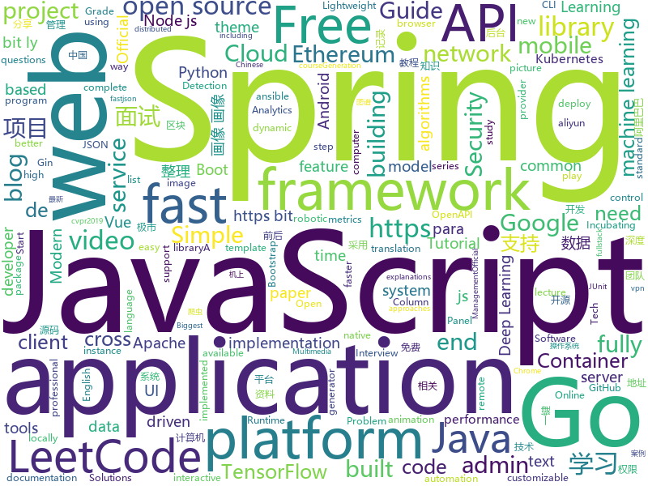

# 2019-10-30
See what the GitHub community is most excited about today.

## python
* [google-research](https://github.com/google-research/google-research)(**192 stars today**): Google AI Research
* [Python](https://github.com/geekcomputers/Python)(**110 stars today**): My Python Examples
* [bitcoinbook](https://github.com/bitcoinbook/bitcoinbook)(**33 stars today**): Mastering Bitcoin 2nd Edition - Programming the Open Blockchain
* [HelloGitHub](https://github.com/521xueweihan/HelloGitHub)(**31 stars today**): Find pearls on open-source seashore 分享 GitHub 上有趣、入门级的开源项目
* [bert](https://github.com/google-research/bert)(**52 stars today**): TensorFlow code and pre-trained models for BERT
* [yolact](https://github.com/dbolya/yolact)(**17 stars today**): A simple, fully convolutional model for real-time instance segmentation.
* [KubeOperator](https://github.com/KubeOperator/KubeOperator)(**90 stars today**): KubeOperator 是一个开源项目，通过 Web UI 在 VMware、OpenStack、物理机上一键部署和管理生产级别的 Kubernetes 集群。
* [home-assistant](https://github.com/home-assistant/home-assistant)(**37 stars today**): 🏡Open source home automation that puts local control and privacy first
* [ML-From-Scratch](https://github.com/eriklindernoren/ML-From-Scratch)(**20 stars today**): Machine Learning From Scratch. Bare bones NumPy implementations of machine learning models and algorithms with a focus on accessibility. Aims to cover everything from linear regression to deep learning.
* [kitty](https://github.com/kovidgoyal/kitty)(**14 stars today**): A cross-platform, fast, feature full, GPU based terminal emulator
* [scikit-learn](https://github.com/scikit-learn/scikit-learn)(**24 stars today**): scikit-learn: machine learning in Python
* [WatchAD](https://github.com/0Kee-Team/WatchAD)(**58 stars today**): AD Security Intrusion Detection System
* [CAIL2019](https://github.com/GuidoPaul/CAIL2019)(**13 stars today**): 中国法研杯司法人工智能挑战赛之相似案例匹配第一名解决方案
* [auto-tinder](https://github.com/joelbarmettlerUZH/auto-tinder)(**8 stars today**): 🖖Train an artificial intelligence to play tinder for you
* [vid2vid](https://github.com/NVIDIA/vid2vid)(**35 stars today**): Pytorch implementation of our method for high-resolution (e.g. 2048x1024) photorealistic video-to-video translation.
* [youtube-dl](https://github.com/ytdl-org/youtube-dl)(**92 stars today**): Command-line program to download videos from YouTube.com and other video sites
* [mmdetection](https://github.com/open-mmlab/mmdetection)(**18 stars today**): Open MMLab Detection Toolbox and Benchmark
* [Gasyori100knock](https://github.com/yoyoyo-yo/Gasyori100knock)(**17 stars today**): 画像処理100本ノックして画像処理を画像処理して画像処理するためのもの For Japanese, English and Chinese
* [chinese_ocr](https://github.com/YCG09/chinese_ocr)(**9 stars today**): CTPN + DenseNet + CTC based end-to-end Chinese OCR implemented using tensorflow and keras
* [models](https://github.com/tensorflow/models)(**50 stars today**): Models and examples built with TensorFlow
* [ansible](https://github.com/ansible/ansible)(**21 stars today**): Ansible is a radically simple IT automation platform that makes your applications and systems easier to deploy. Avoid writing scripts or custom code to deploy and update your applications — automate in a language that approaches plain English, using SSH, with no agents to install on remote systems. https://docs.ansible.com/ansible/
* [stylegan](https://github.com/NVlabs/stylegan)(**11 stars today**): StyleGAN - Official TensorFlow Implementation
* [pysot](https://github.com/STVIR/pysot)(**7 stars today**): SenseTime Research platform for single object tracking, implementing algorithms like SiamRPN and SiamMask.
* [melgan-neurips](https://github.com/descriptinc/melgan-neurips)(**15 stars today**): Official repository for the paper MelGAN: Generative Adversarial Networks for Conditional Waveform Synthesis
* [instaloader](https://github.com/instaloader/instaloader)(**3 stars today**): Download pictures (or videos) along with their captions and other metadata from Instagram.

## java
* [fullstack-tutorial](https://github.com/frank-lam/fullstack-tutorial)(**36 stars today**): 🚀fullstack tutorial 2019，后台技术栈/架构师之路/全栈开发社区，春招/秋招/校招/面试
* [spring-analysis](https://github.com/seaswalker/spring-analysis)(**42 stars today**): Spring源码阅读
* [JavaGuide](https://github.com/Snailclimb/JavaGuide)(**138 stars today**): 【Java学习+面试指南】 一份涵盖大部分Java程序员所需要掌握的核心知识。
* [AndroidUtilCode](https://github.com/Blankj/AndroidUtilCode)(**17 stars today**): 🔥Android developers should collect the following utils(updating).
* [tutorials](https://github.com/eugenp/tutorials)(**19 stars today**): The "REST With Spring" Course:
* [canal](https://github.com/alibaba/canal)(**30 stars today**): 阿里巴巴 MySQL binlog 增量订阅&消费组件
* [springfox](https://github.com/springfox/springfox)(**3 stars today**): Automated JSON API documentation for API's built with Spring
* [nacos](https://github.com/alibaba/nacos)(**21 stars today**): an easy-to-use dynamic service discovery, configuration and service management platform for building cloud native applications.
* [Auto.js](https://github.com/hyb1996/Auto.js)(**104 stars today**): A UiAutomator on android, does not need root access(安卓平台上的JavaScript自动化工具)
* [SpringAll](https://github.com/wuyouzhuguli/SpringAll)(**41 stars today**): 循序渐进，学习Spring Boot、Spring Boot & Shiro、Spring Cloud、Spring Security & Spring Security OAuth2，博客Spring系列源码
* [eladmin](https://github.com/elunez/eladmin)(**45 stars today**): 项目基于 Spring Boot 2.1.0 、 Jpa、 Spring Security、redis、Vue的前后端分离的后台管理系统，项目采用分模块开发方式， 权限控制采用 RBAC，支持数据字典与数据权限管理，支持一键生成前后端代码，支持动态路由
* [otter](https://github.com/alibaba/otter)(**8 stars today**): 阿里巴巴分布式数据库同步系统(解决中美异地机房)
* [fastjson](https://github.com/alibaba/fastjson)(**15 stars today**): 🚄A fast JSON parser/generator for Java. (Aliyun Data Lake Analytics https://www.aliyun.com/product/datalakeanalytics powered by fastjson )
* [graylog2-server](https://github.com/Graylog2/graylog2-server)(**1 stars today**): Free and open source log management
* [rocketmq-externals](https://github.com/apache/rocketmq-externals)(**5 stars today**): Mirror of Apache RocketMQ (Incubating)
* [LeetCodeAnimation](https://github.com/MisterBooo/LeetCodeAnimation)(**68 stars today**): Demonstrate all the questions on LeetCode in the form of animation.（用动画的形式呈现解LeetCode题目的思路）
* [testcontainers-java](https://github.com/testcontainers/testcontainers-java)(**10 stars today**): Testcontainers is a Java library that supports JUnit tests, providing lightweight, throwaway instances of common databases, Selenium web browsers, or anything else that can run in a Docker container.
* [open-liberty](https://github.com/OpenLiberty/open-liberty)(**0 stars today**): Open Liberty is a highly composable, fast to start, dynamic application server runtime environment
* [CS-Notes](https://github.com/CyC2018/CS-Notes)(**84 stars today**): 📚Tech Interview Guide 技术面试必备基础知识、Leetcode、Java、C++、Python、后端面试、计算机操作系统、计算机网络、系统设计
* [micrometer](https://github.com/micrometer-metrics/micrometer)(**2 stars today**): An application metrics facade for the most popular monitoring tools. Think SLF4J, but for metrics.
* [PGM](https://github.com/Electroid/PGM)(**1 stars today**): The original PvP Game Manager for Minecraft
* [hbase](https://github.com/apache/hbase)(**5 stars today**): Mirror of Apache HBase
* [incubator-druid](https://github.com/apache/incubator-druid)(**8 stars today**): Apache Druid (Incubating) - Column oriented distributed data store ideal for powering interactive applications
* [bitcoinj](https://github.com/bitcoinj/bitcoinj)(**3 stars today**): A library for working with Bitcoin
* [kafka](https://github.com/apache/kafka)(**17 stars today**): Mirror of Apache Kafka

## unknown
* [deep-learning-drizzle](https://github.com/kmario23/deep-learning-drizzle)(**193 stars today**): Drench yourself in Deep Learning, Reinforcement Learning, Machine Learning, Computer Vision, and NLP by learning from these exciting lectures!!
* [CKAD-exercises](https://github.com/dgkanatsios/CKAD-exercises)(**26 stars today**): A set of exercises to prepare for Certified Kubernetes Application Developer exam by Cloud Native Computing Foundation
* [free-books](https://github.com/ruanyf/free-books)(**254 stars today**): 互联网上的免费书籍
* [eng-practices](https://github.com/google/eng-practices)(**45 stars today**): Google's Engineering Practices documentation
* [learn-regex](https://github.com/ziishaned/learn-regex)(**147 stars today**): Learn regex the easy way
* [blockchain](https://github.com/LiuBoyu/blockchain)(**60 stars today**): 区块链 - 中文资源
* [Share-SSR-V2ray](https://github.com/selierlin/Share-SSR-V2ray)(**29 stars today**): 🃏Free SS/SSR/V2ray 免费分享节点账号信息网站
* [few-shot-vid2vid](https://github.com/NVlabs/few-shot-vid2vid)(**50 stars today**): 
* [iccv2019](https://github.com/extreme-assistant/iccv2019)(**40 stars today**): ICCV 2019 papers/new汇总帖，极市团队整理
* [Cheatsheet-God](https://github.com/OlivierLaflamme/Cheatsheet-God)(**77 stars today**): Penetration Testing Biggest Reference Bank - OSCP / PTP & PTX Cheatsheet
* [awesome-robotic-tooling](https://github.com/Ly0n/awesome-robotic-tooling)(**23 stars today**): Just a bunch of powerful robotic resources and tools for professional robotic development with ROS in C++ and Python.
* [new-pac](https://github.com/Alvin9999/new-pac)(**54 stars today**): 
* [daily-paper-computer-vision](https://github.com/amusi/daily-paper-computer-vision)(**28 stars today**): 记录每天整理的计算机视觉/深度学习/机器学习相关方向的论文
* [You-Dont-Know-JS](https://github.com/getify/You-Dont-Know-JS)(**56 stars today**): A book series on JavaScript. @YDKJS on twitter.
* [1](https://github.com/1jie/1)(**8 stars today**): 这里是直播平台永久回家页，有最新app下载地址。
* [OpenAPI-Specification](https://github.com/OAI/OpenAPI-Specification)(**19 stars today**): The OpenAPI Specification Repository
* [spellbook-of-modern-webdev](https://github.com/dexteryy/spellbook-of-modern-webdev)(**32 stars today**): A Big Picture, Thesaurus, and Taxonomy of Modern JavaScript Web Development
* [coding-interview-university](https://github.com/jwasham/coding-interview-university)(**86 stars today**): A complete computer science study plan to become a software engineer.
* [vagas](https://github.com/frontendbr/vagas)(**7 stars today**): 🔬Espaço para divulgação de vagas para front-enders.
* [KnowledgeGraphCourse](https://github.com/npubird/KnowledgeGraphCourse)(**19 stars today**): 东南大学《知识图谱》研究生课程
* [gatsby-pt-BR](https://github.com/gatsbyjs/gatsby-pt-BR)(**21 stars today**): Brazilian Portuguese translation of Gatsbyjs.org
* [cvpr2019](https://github.com/extreme-assistant/cvpr2019)(**18 stars today**): cvpr2019／cvpr2018/cvpr2019 papers，极市团队整理
* [AZ-103-MicrosoftAzureAdministrator](https://github.com/MicrosoftLearning/AZ-103-MicrosoftAzureAdministrator)(**4 stars today**): AZ-103: Microsoft Azure Administrator
* [blog](https://github.com/airuikun/blog)(**17 stars today**): 小蝌蚪的blog，中年前端屌丝的心路历程，欢迎star或者watch
* [The-Flask-Mega-Tutorial-zh](https://github.com/luhuisicnu/The-Flask-Mega-Tutorial-zh)(**5 stars today**): 翻译自Miguel Grinberg的blog https://blog.miguelgrinberg.com 的2017年新版The Flask Mega-Tutorial教程

## javascript
* [iptv](https://github.com/iptv-org/iptv)(**147 stars today**): Collection of 8000+ publicly available IPTV channels from all over the world
* [mobile-first-animation](https://github.com/aholachek/mobile-first-animation)(**162 stars today**): Performant gesture-driven animation on the mobile web
* [awesome-selfhosted](https://github.com/awesome-selfhosted/awesome-selfhosted)(**268 stars today**): This is a list of Free Software network services and web applications which can be hosted locally. Selfhosting is the process of locally hosting and managing applications instead of renting from SaaS providers.
* [leetcode](https://github.com/azl397985856/leetcode)(**82 stars today**): LeetCode Solutions: A Record of My Problem Solving Journey.( leetcode题解，记录自己的leetcode解题之路。)
* [slate](https://github.com/ianstormtaylor/slate)(**21 stars today**): A completely customizable framework for building rich text editors. (Currently in beta.)
* [nuxt.js](https://github.com/nuxt/nuxt.js)(**22 stars today**): The Vue.js Framework
* [awesome-blockchain-cn](https://github.com/chaozh/awesome-blockchain-cn)(**36 stars today**): 收集所有区块链(BlockChain)技术开发相关资料，包括Fabric和Ethereum开发资料
* [Fantasy-Map-Generator](https://github.com/Azgaar/Fantasy-Map-Generator)(**4 stars today**): Web application generating interactive and customizable maps
* [folio-2019](https://github.com/brunosimon/folio-2019)(**93 stars today**): 
* [puppeteer](https://github.com/GoogleChrome/puppeteer)(**39 stars today**): Headless Chrome Node.js API
* [vant](https://github.com/youzan/vant)(**33 stars today**): Lightweight Mobile UI Components built on Vue
* [Administrative-divisions-of-China](https://github.com/modood/Administrative-divisions-of-China)(**24 stars today**): 中华人民共和国行政区划：省级（省份直辖市自治区）、 地级（城市）、 县级（区县）、 乡级（乡镇街道）、 村级（村委会居委会） ，中国省市区镇村二级三级四级五级联动地址数据 Node.js 爬虫。
* [appwrite](https://github.com/appwrite/appwrite)(**40 stars today**): End to end backend server for frontend and mobile developers.👩‍💻👨‍💻
* [swiper](https://github.com/nolimits4web/swiper)(**24 stars today**): Most modern mobile touch slider with hardware accelerated transitions
* [remote-jobs](https://github.com/remoteintech/remote-jobs)(**25 stars today**): A list of semi to fully remote-friendly companies in tech.
* [cube.js](https://github.com/cube-js/cube.js)(**22 stars today**): 📊Cube.js - Open Source Analytics Framework
* [javascript-algorithms](https://github.com/trekhleb/javascript-algorithms)(**102 stars today**): 📝Algorithms and data structures implemented in JavaScript with explanations and links to further readings
* [complete-javascript-course](https://github.com/jonasschmedtmann/complete-javascript-course)(**3 stars today**): Starter files, final projects and FAQ for my Complete JavaScript course
* [mermaid](https://github.com/knsv/mermaid)(**63 stars today**): Generation of diagram and flowchart from text in a similar manner as markdown
* [ethereumbook](https://github.com/ethereumbook/ethereumbook)(**31 stars today**): Mastering Ethereum, by Andreas M. Antonopoulos, Gavin Wood
* [fastify](https://github.com/fastify/fastify)(**12 stars today**): Fast and low overhead web framework, for Node.js
* [carbon](https://github.com/carbon-app/carbon)(**21 stars today**): 🎨Create and share beautiful images of your source code
* [primary](https://github.com/javascriptteacher/primary)(**4 stars today**): 
* [cropperjs](https://github.com/fengyuanchen/cropperjs)(**26 stars today**): JavaScript image cropper.
* [react-table](https://github.com/tannerlinsley/react-table)(**11 stars today**): ⚛️Hooks for building fast and extendable tables and datagrids for React

## html
* [DevOps-Guide](https://github.com/Tikam02/DevOps-Guide)(**41 stars today**): DevOps Guide from basic to advanced with Interview Questions and Notes🔥
* [fastText](https://github.com/facebookresearch/fastText)(**12 stars today**): Library for fast text representation and classification.
* [uPlot](https://github.com/leeoniya/uPlot)(**31 stars today**): 📈An exceptionally fast, tiny time series chart
* [JavaScript30](https://github.com/wesbos/JavaScript30)(**8 stars today**): 30 Day Vanilla JS Challenge
* [hyperblog](https://github.com/freddier/hyperblog)(**4 stars today**): Un blog increíble para el curso de Git y Github de Platzi
* [swagger-codegen](https://github.com/swagger-api/swagger-codegen)(**7 stars today**): swagger-codegen contains a template-driven engine to generate documentation, API clients and server stubs in different languages by parsing your OpenAPI / Swagger definition.
* [xiaolai.github.io](https://github.com/xiaolai/xiaolai.github.io)(**2 stars today**): an ever-growing brain
* [svelte-material-ui](https://github.com/hperrin/svelte-material-ui)(**3 stars today**): Svelte Material UI Components
* [Moon](https://github.com/TaylanTatli/Moon)(**4 stars today**): Moon is a minimal, one column jekyll theme.
* [AdminLTE](https://github.com/ColorlibHQ/AdminLTE)(**24 stars today**): AdminLTE - Free Premium Admin control Panel Theme Based On Bootstrap 3.x
* [EIPs](https://github.com/ethereum/EIPs)(**5 stars today**): The Ethereum Improvement Proposal repository
* [mxgraph](https://github.com/jgraph/mxgraph)(**11 stars today**): mxGraph is a fully client side JavaScript diagramming library
* [intro.js](https://github.com/usablica/intro.js)(**4 stars today**): A better way for new feature introduction and step-by-step users guide for your website and project.
* [qcloud-documents](https://github.com/tencentyun/qcloud-documents)(**1 stars today**): 腾讯云官方文档 使用Markdown自动构建
* [screenfull.js](https://github.com/sindresorhus/screenfull.js)(**5 stars today**): Simple wrapper for cross-browser usage of the JavaScript Fullscreen API
* [glTF](https://github.com/KhronosGroup/glTF)(**4 stars today**): glTF – Runtime 3D Asset Delivery
* [nndl.github.io](https://github.com/nndl/nndl.github.io)(**17 stars today**): 《神经网络与深度学习》 邱锡鹏著 Neural Network and Deep Learning
* [zh.javascript.info](https://github.com/javascript-tutorial/zh.javascript.info)(**4 stars today**): 现代 JavaScript 教程（The Modern JavaScript Tutorial）
* [bulma-templates](https://github.com/BulmaTemplates/bulma-templates)(**4 stars today**): free flexbox templates built with the bulma css framework
* [COMP9021_19T3](https://github.com/marey/COMP9021_19T3)(**0 stars today**): 
* [startbootstrap-sb-admin-2](https://github.com/BlackrockDigital/startbootstrap-sb-admin-2)(**5 stars today**): A free, open source, Bootstrap admin theme created by Start Bootstrap
* [omm-ws1920](https://github.com/mimuc/omm-ws1920)(**0 stars today**): Resources for the Online Multimedia Lecture at LMU Munich
* [ctf-wiki](https://github.com/ctf-wiki/ctf-wiki)(**7 stars today**): CTF Wiki Online. Come and join us, we need you!
* [professional-services](https://github.com/GoogleCloudPlatform/professional-services)(**2 stars today**): Common solutions and tools developed by Google Cloud's Professional Services team
* [wpt](https://github.com/web-platform-tests/wpt)(**2 stars today**): Test suites for Web platform specs — including WHATWG, W3C, and others

## go
* [phuip-fpizdam](https://github.com/neex/phuip-fpizdam)(**154 stars today**): Exploit for CVE-2019-11043
* [ultimate-go](https://github.com/hoanhan101/ultimate-go)(**309 stars today**): Ultimate Go study guide, with heavily documented code and programs analysis all in 1 place →
* [gin](https://github.com/gin-gonic/gin)(**37 stars today**): Gin is a HTTP web framework written in Go (Golang). It features a Martini-like API with much better performance -- up to 40 times faster. If you need smashing performance, get yourself some Gin.
* [go-admin](https://github.com/GoAdminGroup/go-admin)(**52 stars today**): A dataviz framework help gopher to build a admin panel in ten minutes
* [spikeSystem](https://github.com/GuoZhaoran/spikeSystem)(**43 stars today**): 
* [kops](https://github.com/kubernetes/kops)(**18 stars today**): Kubernetes Operations (kops) - Production Grade K8s Installation, Upgrades, and Management
* [go-ethereum](https://github.com/ethereum/go-ethereum)(**27 stars today**): Official Go implementation of the Ethereum protocol
* [thanos](https://github.com/thanos-io/thanos)(**9 stars today**): Highly available Prometheus setup with long term storage capabilities. CNCF Sandbox project.
* [kafka-go](https://github.com/segmentio/kafka-go)(**5 stars today**): Kafka library in Go
* [testify](https://github.com/stretchr/testify)(**11 stars today**): A toolkit with common assertions and mocks that plays nicely with the standard library
* [v2ray-core](https://github.com/v2ray/v2ray-core)(**59 stars today**): A platform for building proxies to bypass network restrictions.
* [protobuf](https://github.com/golang/protobuf)(**8 stars today**): Go support for Google's protocol buffers
* [eksctl](https://github.com/weaveworks/eksctl)(**2 stars today**): The official CLI for Amazon EKS
* [kubernetes](https://github.com/kubernetes/kubernetes)(**51 stars today**): Production-Grade Container Scheduling and Management
* [fabric](https://github.com/hyperledger/fabric)(**15 stars today**): Read-only mirror of https://gerrit.hyperledger.org/r/#/admin/projects/fabric
* [pg_flame](https://github.com/mgartner/pg_flame)(**87 stars today**): A flamegraph generator for Postgres EXPLAIN ANALYZE output.
* [k9s](https://github.com/derailed/k9s)(**25 stars today**): 🐶Kubernetes CLI To Manage Your Clusters In Style!
* [mongo-go-driver](https://github.com/mongodb/mongo-go-driver)(**11 stars today**): The Go driver for MongoDB
* [iris](https://github.com/kataras/iris)(**17 stars today**): The fastest community-driven web framework for Go. Webassembly, Automatic HTTPS with Public Domain, MVC, Sessions, Caching, Versioning API, Problem API, Websocket, Dependency Injection and more. Fully compatible with the standard library and 3rd-party middleware packages. https://bit.ly/謝謝 | https://bit.ly/iriscandothat1 | https://bit.ly/iriscan…
* [brook](https://github.com/txthinking/brook)(**14 stars today**): Brook is a cross-platform(Linux/MacOS/Windows/Android/iOS) proxy/vpn software
* [elastic](https://github.com/olivere/elastic)(**4 stars today**): Elasticsearch client for Go.
* [beats](https://github.com/elastic/beats)(**7 stars today**): 🐠Beats - Lightweight shippers for Elasticsearch & Logstash
* [trivy](https://github.com/aquasecurity/trivy)(**13 stars today**): A Simple and Comprehensive Vulnerability Scanner for Containers, Suitable for CI
* [fasthttp](https://github.com/valyala/fasthttp)(**21 stars today**): Fast HTTP package for Go. Tuned for high performance. Zero memory allocations in hot paths. Up to 10x faster than net/http
* [terraform-provider-aws](https://github.com/terraform-providers/terraform-provider-aws)(**6 stars today**): Terraform AWS provider

## WordCloud

