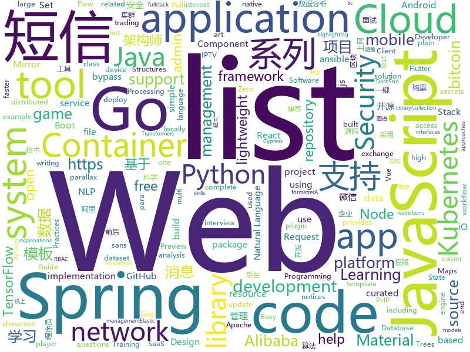

# 2019-10-31
See what the GitHub community is most excited about today.

## python
* [iOS-DeviceSupport](https://github.com/iGhibli/iOS-DeviceSupport)(**143 stars today**): This repository holds the device support files for the iOS, and I will update it regularly.
* [HelloGitHub](https://github.com/521xueweihan/HelloGitHub)(**144 stars today**): Find pearls on open-source seashore 分享 GitHub 上有趣、入门级的开源项目
* [KubeOperator](https://github.com/KubeOperator/KubeOperator)(**31 stars today**): KubeOperator 是一个开源项目，通过 Web UI 在 VMware、OpenStack、物理机上一键部署和管理生产级别的 Kubernetes 集群。
* [NLP-progress](https://github.com/sebastianruder/NLP-progress)(**43 stars today**): Repository to track the progress in Natural Language Processing (NLP), including the datasets and the current state-of-the-art for the most common NLP tasks.
* [SlowFast](https://github.com/facebookresearch/SlowFast)(**56 stars today**): Present SlowFast networks for video recognition.
* [cvxpylayers](https://github.com/cvxgrp/cvxpylayers)(**49 stars today**): Differentiable convex optimization layers
* [Python](https://github.com/geekcomputers/Python)(**123 stars today**): My Python Examples
* [compose](https://github.com/docker/compose)(**17 stars today**): Define and run multi-container applications with Docker
* [black](https://github.com/psf/black)(**45 stars today**): The uncompromising Python code formatter
* [the-gan-zoo](https://github.com/hindupuravinash/the-gan-zoo)(**35 stars today**): A list of all named GANs!
* [transformer-xl](https://github.com/kimiyoung/transformer-xl)(**4 stars today**): 
* [localstack](https://github.com/localstack/localstack)(**27 stars today**): 💻A fully functional local AWS cloud stack. Develop and test your cloud & Serverless apps offline!
* [bert](https://github.com/google-research/bert)(**73 stars today**): TensorFlow code and pre-trained models for BERT
* [PayloadsAllTheThings](https://github.com/swisskyrepo/PayloadsAllTheThings)(**40 stars today**): A list of useful payloads and bypass for Web Application Security and Pentest/CTF
* [bitcoinbook](https://github.com/bitcoinbook/bitcoinbook)(**103 stars today**): Mastering Bitcoin 2nd Edition - Programming the Open Blockchain
* [transformers](https://github.com/huggingface/transformers)(**87 stars today**): 🤗Transformers: State-of-the-art Natural Language Processing for TensorFlow 2.0 and PyTorch.
* [lihang_book_algorithm](https://github.com/WenDesi/lihang_book_algorithm)(**7 stars today**): 致力于将李航博士《统计学习方法》一书中所有算法实现一遍
* [waveglow](https://github.com/NVIDIA/waveglow)(**4 stars today**): A Flow-based Generative Network for Speech Synthesis
* [BrachioGraph](https://github.com/evildmp/BrachioGraph)(**9 stars today**): BrachioGraph is an ultra-cheap (total cost of materials: €14) plotter that can be built with minimal skills.
* [spinnaker](https://github.com/spinnaker/spinnaker)(**6 stars today**): Spinnaker is an open source, multi-cloud continuous delivery platform for releasing software changes with high velocity and confidence.
* [sigma](https://github.com/Neo23x0/sigma)(**9 stars today**): Generic Signature Format for SIEM Systems
* [macadmin-scripts](https://github.com/munki/macadmin-scripts)(**6 stars today**): Scripts of possible interest to macOS admins
* [py12306](https://github.com/pjialin/py12306)(**16 stars today**): 🚂12306 购票助手，支持集群，多账号，多任务购票以及 Web 页面管理
* [YOLOv3_TensorFlow](https://github.com/wizyoung/YOLOv3_TensorFlow)(**7 stars today**): Complete YOLO v3 TensorFlow implementation. Support training on your own dataset.
* [ansible](https://github.com/ansible/ansible)(**34 stars today**): Ansible is a radically simple IT automation platform that makes your applications and systems easier to deploy. Avoid writing scripts or custom code to deploy and update your applications — automate in a language that approaches plain English, using SSH, with no agents to install on remote systems. https://docs.ansible.com/ansible/

## java
* [spring-analysis](https://github.com/seaswalker/spring-analysis)(**67 stars today**): Spring源码阅读
* [JavaGuide](https://github.com/Snailclimb/JavaGuide)(**117 stars today**): 【Java学习+面试指南】 一份涵盖大部分Java程序员所需要掌握的核心知识。
* [hbase](https://github.com/apache/hbase)(**4 stars today**): Mirror of Apache HBase
* [Auto.js](https://github.com/hyb1996/Auto.js)(**71 stars today**): A UiAutomator on android, does not need root access(安卓平台上的JavaScript自动化工具)
* [fullstack-tutorial](https://github.com/frank-lam/fullstack-tutorial)(**180 stars today**): 🚀fullstack tutorial 2019，后台技术栈/架构师之路/全栈开发社区，春招/秋招/校招/面试
* [eladmin](https://github.com/elunez/eladmin)(**50 stars today**): 项目基于 Spring Boot 2.1.0 、 Jpa、 Spring Security、redis、Vue的前后端分离的后台管理系统，项目采用分模块开发方式， 权限控制采用 RBAC，支持数据字典与数据权限管理，支持一键生成前后端代码，支持动态路由
* [mlkit-material-android](https://github.com/firebase/mlkit-material-android)(**3 stars today**): ML Kit Showcase App with Material Design
* [jetty.project](https://github.com/eclipse/jetty.project)(**0 stars today**): Eclipse Jetty® - Web Container & Clients - supports HTTP/2, HTTP/1.1, HTTP/1.0, websocket, servlets, and more
* [SpringAll](https://github.com/wuyouzhuguli/SpringAll)(**43 stars today**): 循序渐进，学习Spring Boot、Spring Boot & Shiro、Spring Cloud、Spring Security & Spring Security OAuth2，博客Spring系列源码
* [kafka](https://github.com/apache/kafka)(**19 stars today**): Mirror of Apache Kafka
* [elasticsearch](https://github.com/elastic/elasticsearch)(**29 stars today**): Open Source, Distributed, RESTful Search Engine
* [flutter_boost](https://github.com/alibaba/flutter_boost)(**13 stars today**): FlutterBoost is a Flutter plugin which enables hybrid integration of Flutter for your existing native apps with minimum efforts
* [spring-boot](https://github.com/spring-projects/spring-boot)(**27 stars today**): Spring Boot
* [spring-cloud-alibaba](https://github.com/alibaba/spring-cloud-alibaba)(**25 stars today**): Spring Cloud Alibaba provides a one-stop solution for application development for the distributed solutions of Alibaba middleware.
* [easy-rules](https://github.com/j-easy/easy-rules)(**8 stars today**): The simple, stupid rules engine for Java
* [TicTacToeGame](https://github.com/ksheetal/TicTacToeGame)(**1 stars today**): Basic tic tac toe game [Hacktoberfest Pull Request 2019]
* [Mindustry](https://github.com/Anuken/Mindustry)(**16 stars today**): A sandbox tower defense game
* [VirtualAPK](https://github.com/didi/VirtualAPK)(**3 stars today**): A powerful and lightweight plugin framework for Android
* [tutorials](https://github.com/eugenp/tutorials)(**22 stars today**): The "REST With Spring" Course:
* [arthas](https://github.com/alibaba/arthas)(**28 stars today**): Alibaba Java Diagnostic Tool Arthas/Alibaba Java诊断利器Arthas
* [bisq](https://github.com/bisq-network/bisq)(**2 stars today**): The decentralized bitcoin exchange network
* [JsonPath](https://github.com/json-path/JsonPath)(**7 stars today**): Java JsonPath implementation
* [graphql-java](https://github.com/graphql-java/graphql-java)(**6 stars today**): GraphQL Java implementation
* [ExoPlayer](https://github.com/google/ExoPlayer)(**13 stars today**): An extensible media player for Android
* [WePush](https://github.com/rememberber/WePush)(**5 stars today**): 专注批量推送的小而美的工具，目前支持：模板消息-公众号、模板消息-小程序、微信客服消息、微信企业号/企业微信消息、阿里云短信、阿里大于模板短信 、腾讯云短信、云片网短信、E-Mail、HTTP请求、钉钉、华为云短信、百度云短信、又拍云短信、七牛云短信

## unknown
* [README-template.md](https://github.com/scottydocs/README-template.md)(**67 stars today**): A README template for anyone to copy and use.
* [free-books](https://github.com/ruanyf/free-books)(**301 stars today**): 互联网上的免费书籍
* [Data-Science--Cheat-Sheet](https://github.com/abhat222/Data-Science--Cheat-Sheet)(**70 stars today**): Cheat Sheets
* [python_for_data_analysis_2nd_chinese_version](https://github.com/iamseancheney/python_for_data_analysis_2nd_chinese_version)(**33 stars today**): 《利用Python进行数据分析·第2版》
* [blockchain](https://github.com/LiuBoyu/blockchain)(**68 stars today**): 区块链 - 中文资源
* [eng-practices](https://github.com/google/eng-practices)(**133 stars today**): Google's Engineering Practices documentation
* [gov-takedowns](https://github.com/github/gov-takedowns)(**256 stars today**): Text of government takedown notices as received. GitHub does not endorse or adopt any assertion contained in the following notices.
* [CKAD-exercises](https://github.com/dgkanatsios/CKAD-exercises)(**29 stars today**): A set of exercises to prepare for Certified Kubernetes Application Developer exam by Cloud Native Computing Foundation
* [deep-learning-drizzle](https://github.com/kmario23/deep-learning-drizzle)(**178 stars today**): Drench yourself in Deep Learning, Reinforcement Learning, Machine Learning, Computer Vision, and NLP by learning from these exciting lectures!!
* [gatsby-pt-BR](https://github.com/gatsbyjs/gatsby-pt-BR)(**14 stars today**): Brazilian Portuguese translation of Gatsbyjs.org
* [Books](https://github.com/MrAlex6204/Books)(**14 stars today**): Collection of Programming, Databases, Linux & Tools Books
* [awesome-iptv](https://github.com/iptv-org/awesome-iptv)(**20 stars today**): A curated list of resources related to IPTV.
* [Git-Commands](https://github.com/joshnh/Git-Commands)(**11 stars today**): A list of commonly used Git commands
* [AI-for-Security-Learning](https://github.com/404notf0und/AI-for-Security-Learning)(**39 stars today**): 安全场景、基于AI的安全算法和安全数据分析学习资料整理
* [new-pac](https://github.com/Alvin9999/new-pac)(**65 stars today**): 
* [Blog](https://github.com/mqyqingfeng/Blog)(**32 stars today**): 冴羽写博客的地方，预计写四个系列：JavaScript深入系列、JavaScript专题系列、ES6系列、React系列。
* [awesome-architecture](https://github.com/toutiaoio/awesome-architecture)(**66 stars today**): 架构师技术图谱，助你早日成为架构师
* [vagas](https://github.com/backend-br/vagas)(**5 stars today**): ✌️Espaço para divulgação de vagas para backenders
* [Specs](https://github.com/CocoaPods/Specs)(**5 stars today**): The CocoaPods Master Repo
* [amundsen](https://github.com/lyft/amundsen)(**31 stars today**): Repository for the Amundsen project
* [hosts](https://github.com/googlehosts/hosts)(**37 stars today**): 镜像：https://coding.net/u/scaffrey/p/hosts/git
* [Privilege-Escalation](https://github.com/Ignitetechnologies/Privilege-Escalation)(**12 stars today**): This cheasheet is aimed at the CTF Players and Beginners to help them understand the fundamentals of Privilege Escalation with examples.
* [fancyss_history_package](https://github.com/hq450/fancyss_history_package)(**39 stars today**): 科学上网插件的离线安装包储存在这里
* [awesome-malware-analysis](https://github.com/rshipp/awesome-malware-analysis)(**13 stars today**): A curated list of awesome malware analysis tools and resources.
* [vTemplate](https://github.com/KiriKira/vTemplate)(**7 stars today**): v2ray的模板们

## javascript
* [awesome-selfhosted](https://github.com/awesome-selfhosted/awesome-selfhosted)(**405 stars today**): This is a list of Free Software network services and web applications which can be hosted locally. Selfhosting is the process of locally hosting and managing applications instead of renting from SaaS providers.
* [smart-tracker](https://github.com/airuikun/smart-tracker)(**43 stars today**): smart-tracker简易型前端无痕埋点
* [leonsans](https://github.com/cmiscm/leonsans)(**204 stars today**): Leon Sans is a geometric sans-serif typeface made with code in 2019 by Jongmin Kim.
* [ccxt](https://github.com/ccxt/ccxt)(**14 stars today**): A JavaScript / Python / PHP cryptocurrency trading API with support for more than 120 bitcoin/altcoin exchanges
* [javascript-algorithms](https://github.com/trekhleb/javascript-algorithms)(**31 stars today**): 📝Algorithms and data structures implemented in JavaScript with explanations and links to further readings
* [nuxt.js](https://github.com/nuxt/nuxt.js)(**31 stars today**): The Vue.js Framework
* [workshop-webgl-glsl](https://github.com/mattdesl/workshop-webgl-glsl)(**89 stars today**): A workshop on WebGL and GLSL
* [plotly.js](https://github.com/plotly/plotly.js)(**8 stars today**): Open-source JavaScript charting library behind Plotly and Dash
* [appwrite](https://github.com/appwrite/appwrite)(**16 stars today**): End to end backend server for frontend and mobile developers.👩‍💻👨‍💻
* [material-ui](https://github.com/mui-org/material-ui)(**36 stars today**): React components for faster and easier web development. Build your own design system, or start with Material Design.
* [svgo](https://github.com/svg/svgo)(**22 stars today**): 🐯Node.js tool for optimizing SVG files
* [Administrative-divisions-of-China](https://github.com/modood/Administrative-divisions-of-China)(**50 stars today**): 中华人民共和国行政区划：省级（省份直辖市自治区）、 地级（城市）、 县级（区县）、 乡级（乡镇街道）、 村级（村委会居委会） ，中国省市区镇村二级三级四级五级联动地址数据 Node.js 爬虫。
* [svelte](https://github.com/sveltejs/svelte)(**70 stars today**): Cybernetically enhanced web apps
* [vis-network](https://github.com/visjs/vis-network)(**3 stars today**): 💫Display dynamic, automatically organised, customizable network views.
* [Leaflet](https://github.com/Leaflet/Leaflet)(**11 stars today**): 🍃JavaScript library for mobile-friendly interactive maps
* [reach-ui](https://github.com/reach/reach-ui)(**3 stars today**): The Accessible Foundation for React Apps and Design Systems
* [flow-typed](https://github.com/flow-typed/flow-typed)(**1 stars today**): A central repository for Flow library definitions
* [iDataV](https://github.com/yyhsong/iDataV)(**22 stars today**): 大屏数据可视化 Big screen data visualization demo
* [gekko](https://github.com/askmike/gekko)(**3 stars today**): A bitcoin trading bot written in node - https://gekko.wizb.it/
* [fanqiang](https://github.com/bannedbook/fanqiang)(**22 stars today**): 翻墙-科学上网
* [engine](https://github.com/cocos-creator/engine)(**2 stars today**): Cocos Creator is a complete package of game development tools and workflow, including a game engine, resource management, scene editing, game preview, debug and publish one project to multiple platforms.
* [BlockChain](https://github.com/itheima1/BlockChain)(**19 stars today**): 黑马程序员 120天全栈区块链开发 开源教程
* [ethereumbook](https://github.com/ethereumbook/ethereumbook)(**10 stars today**): Mastering Ethereum, by Andreas M. Antonopoulos, Gavin Wood
* [gif.js](https://github.com/jnordberg/gif.js)(**7 stars today**): JavaScript GIF encoding library
* [iptv](https://github.com/iptv-org/iptv)(**603 stars today**): Collection of 8000+ publicly available IPTV channels from all over the world

## html
* [Front-end-Developer-Interview-Questions](https://github.com/h5bp/Front-end-Developer-Interview-Questions)(**19 stars today**): A list of helpful front-end related questions you can use to interview potential candidates, test yourself or completely ignore.
* [AR.js](https://github.com/jeromeetienne/AR.js)(**17 stars today**): Efficient Augmented Reality for the Web - 60fps on mobile!
* [polymer](https://github.com/Polymer/polymer)(**2 stars today**): Our original Web Component library.
* [rellax](https://github.com/dixonandmoe/rellax)(**4 stars today**): Lightweight, vanilla javascript parallax library
* [DevOps-Guide](https://github.com/Tikam02/DevOps-Guide)(**165 stars today**): DevOps Guide from basic to advanced with Interview Questions and Notes🔥
* [GTFOBins.github.io](https://github.com/GTFOBins/GTFOBins.github.io)(**4 stars today**): Curated list of Unix binaries that can be exploited to bypass system security restrictions
* [colcade](https://github.com/desandro/colcade)(**5 stars today**): Lightweight masonry layout
* [CreditRiskPaper](https://github.com/brainy749/CreditRiskPaper)(**1 stars today**): Codes for replication and implementation of techniques in our credit risk article
* [proposal-nullish-coalescing](https://github.com/tc39/proposal-nullish-coalescing)(**2 stars today**): Nullish coalescing proposal x ?? y
* [fastText](https://github.com/facebookresearch/fastText)(**13 stars today**): Library for fast text representation and classification.
* [snakemake](https://github.com/snakemake/snakemake)(**4 stars today**): This is the development home of the workflow management system Snakemake. For general information, see
* [foundation-emails](https://github.com/foundation/foundation-emails)(**0 stars today**): Quickly create responsive HTML emails that work on any device and client. Even Outlook.
* [portainer](https://github.com/portainer/portainer)(**17 stars today**): Making Docker management easy.
* [skrollr](https://github.com/Prinzhorn/skrollr)(**2 stars today**): Stand-alone parallax scrolling library for mobile (Android + iOS) and desktop. No jQuery. Just plain JavaScript (and some love).
* [webcomponents](https://github.com/w3c/webcomponents)(**0 stars today**): Web Components specifications
* [free-for-dev](https://github.com/ripienaar/free-for-dev)(**118 stars today**): A list of SaaS, PaaS and IaaS offerings that have free tiers of interest to devops and infradev
* [WikiSQL](https://github.com/salesforce/WikiSQL)(**1 stars today**): A large annotated semantic parsing corpus for developing natural language interfaces.
* [python](https://github.com/Show-Me-the-Code/python)(**2 stars today**): Show Me the Code Python version.
* [bitcoin-whitepaper-chinese-translation](https://github.com/xiaolai/bitcoin-whitepaper-chinese-translation)(**10 stars today**): 
* [cypress-example-kitchensink](https://github.com/cypress-io/cypress-example-kitchensink)(**2 stars today**): This is an example app used to showcase Cypress.io testing.
* [aws-well-architected-labs](https://github.com/awslabs/aws-well-architected-labs)(**3 stars today**): Hands on labs and code to help you learn, measure, and build using architectural best practices.
* [screenfull.js](https://github.com/sindresorhus/screenfull.js)(**11 stars today**): Simple wrapper for cross-browser usage of the JavaScript Fullscreen API
* [sql-formatter](https://github.com/jdorn/sql-formatter)(**3 stars today**): A lightweight php class for formatting sql statements. Handles automatic indentation and syntax highlighting.
* [varharrie.github.io](https://github.com/varHarrie/varharrie.github.io)(**3 stars today**): 📘Personal blog.
* [bulma-templates](https://github.com/BulmaTemplates/bulma-templates)(**3 stars today**): free flexbox templates built with the bulma css framework

## go
* [shhgit](https://github.com/eth0izzle/shhgit)(**76 stars today**): Ah shhgit! Find GitHub secrets in real time
* [ultimate-go](https://github.com/hoanhan101/ultimate-go)(**378 stars today**): Ultimate Go study guide, with heavily documented code and programs analysis all in 1 place →
* [prometheus](https://github.com/prometheus/prometheus)(**31 stars today**): The Prometheus monitoring system and time series database.
* [grpc-go](https://github.com/grpc/grpc-go)(**13 stars today**): The Go language implementation of gRPC. HTTP/2 based RPC
* [mongo-go-driver](https://github.com/mongodb/mongo-go-driver)(**9 stars today**): The Go driver for MongoDB
* [vault](https://github.com/hashicorp/vault)(**12 stars today**): A tool for secrets management, encryption as a service, and privileged access management
* [cloud-on-k8s](https://github.com/elastic/cloud-on-k8s)(**4 stars today**): Elastic Cloud on Kubernetes
* [kubernetes](https://github.com/kubernetes/kubernetes)(**51 stars today**): Production-Grade Container Scheduling and Management
* [serving](https://github.com/knative/serving)(**9 stars today**): Kubernetes-based, scale-to-zero, request-driven compute
* [v2ray-core](https://github.com/v2ray/v2ray-core)(**66 stars today**): A platform for building proxies to bypass network restrictions.
* [go-micro](https://github.com/micro/go-micro)(**12 stars today**): A Go microservices development framework
* [b0pass](https://github.com/bitepeng/b0pass)(**34 stars today**): 百灵快传：基于Go语言的高性能 "手机电脑超大文件传输神器"、"局域网共享文件服务器"。LAN large file transfer tool。
* [gotraining](https://github.com/ardanlabs/gotraining)(**20 stars today**): Go Training Class Material :
* [spikeSystem](https://github.com/GuoZhaoran/spikeSystem)(**43 stars today**): 
* [fabric](https://github.com/hyperledger/fabric)(**12 stars today**): Read-only mirror of https://gerrit.hyperledger.org/r/#/admin/projects/fabric
* [go-admin](https://github.com/GoAdminGroup/go-admin)(**136 stars today**): A dataviz framework help gopher to build a admin panel in ten minutes
* [logrus](https://github.com/sirupsen/logrus)(**16 stars today**): Structured, pluggable logging for Go.
* [blackbox_exporter](https://github.com/prometheus/blackbox_exporter)(**2 stars today**): Blackbox prober exporter
* [jx](https://github.com/jenkins-x/jx)(**2 stars today**): Jenkins X provides automated CI+CD for Kubernetes with Preview Environments on Pull Requests using Jenkins, Tekton, Knative, Prow, Skaffold and Helm
* [helm](https://github.com/helm/helm)(**21 stars today**): The Kubernetes Package Manager
* [service](https://github.com/ardanlabs/service)(**8 stars today**): Starter code for writing web services in Go
* [gods](https://github.com/emirpasic/gods)(**13 stars today**): GoDS (Go Data Structures). Containers (Sets, Lists, Stacks, Maps, Trees), Sets (HashSet, TreeSet, LinkedHashSet), Lists (ArrayList, SinglyLinkedList, DoublyLinkedList), Stacks (LinkedListStack, ArrayStack), Maps (HashMap, TreeMap, HashBidiMap, TreeBidiMap, LinkedHashMap), Trees (RedBlackTree, AVLTree, BTree, BinaryHeap), Comparators, Iterators, …
* [kubesphere](https://github.com/kubesphere/kubesphere)(**28 stars today**): Easy-to-use Production Ready Container Platform
* [fasthttp](https://github.com/valyala/fasthttp)(**24 stars today**): Fast HTTP package for Go. Tuned for high performance. Zero memory allocations in hot paths. Up to 10x faster than net/http
* [flux](https://github.com/fluxcd/flux)(**6 stars today**): The GitOps Kubernetes operator

## WordCloud

