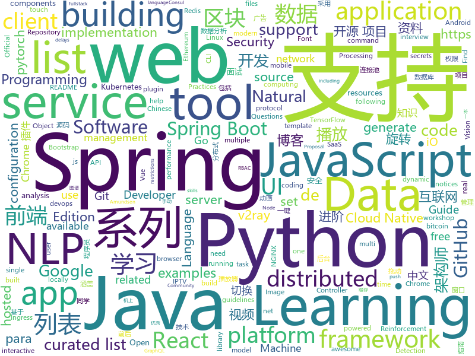

# 2019-11-01
See what the GitHub community is most excited about today.

## python
* [iOS-DeviceSupport](https://github.com/iGhibli/iOS-DeviceSupport)(**171 stars today**): This repository holds the device support files for the iOS, and I will update it regularly.
* [SinGAN](https://github.com/tamarott/SinGAN)(**124 stars today**): Official pytorch implementation of the paper: "SinGAN: Learning a Generative Model from a Single Natural Image"
* [HelloGitHub](https://github.com/521xueweihan/HelloGitHub)(**131 stars today**): Find pearls on open-source seashore 分享 GitHub 上有趣、入门级的开源项目
* [dash](https://github.com/plotly/dash)(**16 stars today**): Analytical Web Apps for Python & R. No JavaScript Required.
* [NLP-progress](https://github.com/sebastianruder/NLP-progress)(**75 stars today**): Repository to track the progress in Natural Language Processing (NLP), including the datasets and the current state-of-the-art for the most common NLP tasks.
* [bcc](https://github.com/iovisor/bcc)(**19 stars today**): BCC - Tools for BPF-based Linux IO analysis, networking, monitoring, and more
* [Real-Time-Voice-Cloning](https://github.com/CorentinJ/Real-Time-Voice-Cloning)(**21 stars today**): Clone a voice in 5 seconds to generate arbitrary speech in real-time
* [Python](https://github.com/geekcomputers/Python)(**56 stars today**): My Python Examples
* [CppCoreGuidelines](https://github.com/isocpp/CppCoreGuidelines)(**16 stars today**): The C++ Core Guidelines are a set of tried-and-true guidelines, rules, and best practices about coding in C++
* [bitcoinbook](https://github.com/bitcoinbook/bitcoinbook)(**33 stars today**): Mastering Bitcoin 2nd Edition - Programming the Open Blockchain
* [models](https://github.com/tensorflow/models)(**40 stars today**): Models and examples built with TensorFlow
* [tensorflow_practice](https://github.com/princewen/tensorflow_practice)(**17 stars today**): tensorflow实战练习，包括强化学习、推荐系统、nlp等
* [bokeh](https://github.com/bokeh/bokeh)(**17 stars today**): Interactive Data Visualization in the browser, from Python
* [KubeOperator](https://github.com/KubeOperator/KubeOperator)(**88 stars today**): KubeOperator 是一个开源项目，通过 Web UI 在 VMware、OpenStack、物理机上一键部署和管理生产级别的 Kubernetes 集群。
* [mypy](https://github.com/python/mypy)(**40 stars today**): Optional static typing for Python 3 and 2 (PEP 484)
* [addons](https://github.com/tensorflow/addons)(**3 stars today**): Useful extra functionality for TensorFlow 2.0 maintained by SIG-addons
* [TensorFlow-Object-Detection-API-Tutorial-Train-Multiple-Objects-Windows-10](https://github.com/EdjeElectronics/TensorFlow-Object-Detection-API-Tutorial-Train-Multiple-Objects-Windows-10)(**5 stars today**): How to train a TensorFlow Object Detection Classifier for multiple object detection on Windows
* [segmentation_models.pytorch](https://github.com/qubvel/segmentation_models.pytorch)(**9 stars today**): Segmentation models with pretrained backbones. PyTorch.
* [ChromeAppHeroes](https://github.com/zhaoolee/ChromeAppHeroes)(**42 stars today**): 🌈谷粒-Chrome插件英雄榜, 为优秀的Chrome插件写一本中文说明书, 让Chrome插件英雄们造福人类~ ChromePluginHeroes, Write a Chinese manual for the excellent Chrome plugin, let the Chrome plugin heroes benefit the human~
* [BrachioGraph](https://github.com/evildmp/BrachioGraph)(**19 stars today**): BrachioGraph is an ultra-cheap (total cost of materials: €14) plotter that can be built with minimal skills.
* [dask](https://github.com/dask/dask)(**7 stars today**): Parallel computing with task scheduling
* [spaCy](https://github.com/explosion/spaCy)(**13 stars today**): 💫Industrial-strength Natural Language Processing (NLP) with Python and Cython
* [jupyterhub](https://github.com/jupyterhub/jupyterhub)(**4 stars today**): Multi-user server for Jupyter notebooks
* [examples](https://github.com/pytorch/examples)(**25 stars today**): A set of examples around pytorch in Vision, Text, Reinforcement Learning, etc.
* [awesome-python](https://github.com/vinta/awesome-python)(**46 stars today**): A curated list of awesome Python frameworks, libraries, software and resources

## java
* [fullstack-tutorial](https://github.com/frank-lam/fullstack-tutorial)(**223 stars today**): 🚀fullstack tutorial 2019，后台技术栈/架构师之路/全栈开发社区，春招/秋招/校招/面试
* [GSYVideoPlayer](https://github.com/CarGuo/GSYVideoPlayer)(**17 stars today**): 视频播放器（IJKplayer、ExoPlayer、MediaPlayer），HTTPS，支持弹幕，支持滤镜、水印、gif截图，片头广告、中间广告，多个同时播放，支持基本的拖动，声音、亮度调节，支持边播边缓存，支持视频自带rotation的旋转（90,270之类），重力旋转与手动旋转的同步支持，支持列表播放 ，列表全屏动画，视频加载速度，列表小窗口支持拖动，动画效果，调整比例，多分辨率切换，支持切换播放器，进度条小窗口预览，列表切换详情页面无缝播放，rtsp、concat、mpeg。
* [BigData-Notes](https://github.com/heibaiying/BigData-Notes)(**49 stars today**): 大数据入门指南⭐️
* [JavaGuide](https://github.com/Snailclimb/JavaGuide)(**127 stars today**): 【Java学习+面试指南】 一份涵盖大部分Java程序员所需要掌握的核心知识。
* [SpringAll](https://github.com/wuyouzhuguli/SpringAll)(**50 stars today**): 循序渐进，学习Spring Boot、Spring Boot & Shiro、Spring Cloud、Spring Security & Spring Security OAuth2，博客Spring系列源码
* [spring-analysis](https://github.com/seaswalker/spring-analysis)(**55 stars today**): Spring源码阅读
* [AndroidUtilCode](https://github.com/Blankj/AndroidUtilCode)(**13 stars today**): 🔥Android developers should collect the following utils(updating).
* [advanced-java](https://github.com/doocs/advanced-java)(**60 stars today**): 😮互联网 Java 工程师进阶知识完全扫盲：涵盖高并发、分布式、高可用、微服务等领域知识，后端同学必看，前端同学也可学习
* [eladmin](https://github.com/elunez/eladmin)(**40 stars today**): 项目基于 Spring Boot 2.1.0 、 Jpa、 Spring Security、redis、Vue的前后端分离的后台管理系统，项目采用分模块开发方式， 权限控制采用 RBAC，支持数据字典与数据权限管理，支持一键生成前后端代码，支持动态路由
* [tutorials](https://github.com/eugenp/tutorials)(**27 stars today**): The "REST With Spring" Course:
* [graphql-java](https://github.com/graphql-java/graphql-java)(**5 stars today**): GraphQL Java implementation
* [Nukkit](https://github.com/NukkitX/Nukkit)(**2 stars today**): Nuclear-Powered Server Software for Minecraft: Bedrock Edition.
* [spring-framework](https://github.com/spring-projects/spring-framework)(**40 stars today**): Spring Framework
* [rocketmq](https://github.com/apache/rocketmq)(**17 stars today**): Mirror of Apache RocketMQ
* [brave](https://github.com/openzipkin/brave)(**2 stars today**): Java distributed tracing implementation compatible with Zipkin backend services.
* [quartz](https://github.com/quartz-scheduler/quartz)(**9 stars today**): Code for Quartz Scheduler
* [nacos](https://github.com/alibaba/nacos)(**22 stars today**): an easy-to-use dynamic service discovery, configuration and service management platform for building cloud native applications.
* [java](https://github.com/kubernetes-client/java)(**3 stars today**): Official Java client library for kubernetes
* [bisq](https://github.com/bisq-network/bisq)(**5 stars today**): The decentralized bitcoin exchange network
* [druid](https://github.com/alibaba/druid)(**18 stars today**): 阿里巴巴数据库事业部出品，为监控而生的数据库连接池。阿里云Data Lake Analytics(https://www.aliyun.com/product/datalakeanalytics )、DRDS、TDDL 连接池powered by Druid
* [dddsample-core](https://github.com/citerus/dddsample-core)(**2 stars today**): This is the new home of the original DDD Sample app (previously hosted at sf.net)..
* [disconf](https://github.com/knightliao/disconf)(**4 stars today**): Distributed Configuration Management Platform(分布式配置管理平台)
* [runelite](https://github.com/runelite/runelite)(**1 stars today**): Open source Old School RuneScape client
* [seata-samples](https://github.com/seata/seata-samples)(**8 stars today**): seata-samples
* [quarkus](https://github.com/quarkusio/quarkus)(**11 stars today**): Quarkus: Supersonic Subatomic Java.

## unknown
* [README-template.md](https://github.com/scottydocs/README-template.md)(**73 stars today**): A README template for anyone to copy and use.
* [free-books](https://github.com/ruanyf/free-books)(**188 stars today**): 互联网上的免费书籍
* [Data-Science--Cheat-Sheet](https://github.com/abhat222/Data-Science--Cheat-Sheet)(**73 stars today**): Cheat Sheets
* [python_for_data_analysis_2nd_chinese_version](https://github.com/iamseancheney/python_for_data_analysis_2nd_chinese_version)(**36 stars today**): 《利用Python进行数据分析·第2版》
* [blockchain](https://github.com/LiuBoyu/blockchain)(**84 stars today**): 区块链 - 中文资源
* [eng-practices](https://github.com/google/eng-practices)(**55 stars today**): Google's Engineering Practices documentation
* [gov-takedowns](https://github.com/github/gov-takedowns)(**122 stars today**): Text of government takedown notices as received. GitHub does not endorse or adopt any assertion contained in the following notices.
* [CKAD-exercises](https://github.com/dgkanatsios/CKAD-exercises)(**50 stars today**): A set of exercises to prepare for Certified Kubernetes Application Developer exam by Cloud Native Computing Foundation
* [deep-learning-drizzle](https://github.com/kmario23/deep-learning-drizzle)(**138 stars today**): Drench yourself in Deep Learning, Reinforcement Learning, Machine Learning, Computer Vision, and NLP by learning from these exciting lectures!!
* [gatsby-pt-BR](https://github.com/gatsbyjs/gatsby-pt-BR)(**9 stars today**): Brazilian Portuguese translation of Gatsbyjs.org
* [Books](https://github.com/MrAlex6204/Books)(**2 stars today**): Collection of Programming, Databases, Linux & Tools Books
* [awesome-iptv](https://github.com/iptv-org/awesome-iptv)(**9 stars today**): A curated list of resources related to IPTV.
* [Git-Commands](https://github.com/joshnh/Git-Commands)(**8 stars today**): A list of commonly used Git commands
* [AI-for-Security-Learning](https://github.com/404notf0und/AI-for-Security-Learning)(**12 stars today**): 安全场景、基于AI的安全算法和安全数据分析学习资料整理
* [new-pac](https://github.com/Alvin9999/new-pac)(**48 stars today**): 
* [Blog](https://github.com/mqyqingfeng/Blog)(**16 stars today**): 冴羽写博客的地方，预计写四个系列：JavaScript深入系列、JavaScript专题系列、ES6系列、React系列。
* [awesome-architecture](https://github.com/toutiaoio/awesome-architecture)(**26 stars today**): 架构师技术图谱，助你早日成为架构师
* [vagas](https://github.com/backend-br/vagas)(**5 stars today**): ✌️Espaço para divulgação de vagas para backenders
* [Specs](https://github.com/CocoaPods/Specs)(**4 stars today**): The CocoaPods Master Repo
* [amundsen](https://github.com/lyft/amundsen)(**33 stars today**): Repository for the Amundsen project
* [hosts](https://github.com/googlehosts/hosts)(**18 stars today**): 镜像：https://coding.net/u/scaffrey/p/hosts/git
* [Privilege-Escalation](https://github.com/Ignitetechnologies/Privilege-Escalation)(**5 stars today**): This cheasheet is aimed at the CTF Players and Beginners to help them understand the fundamentals of Privilege Escalation with examples.
* [fancyss_history_package](https://github.com/hq450/fancyss_history_package)(**18 stars today**): 科学上网插件的离线安装包储存在这里
* [awesome-malware-analysis](https://github.com/rshipp/awesome-malware-analysis)(**10 stars today**): A curated list of awesome malware analysis tools and resources.
* [vTemplate](https://github.com/KiriKira/vTemplate)(**3 stars today**): v2ray的模板们

## javascript
* [iptv](https://github.com/iptv-org/iptv)(**197 stars today**): Collection of 8000+ publicly available IPTV channels from all over the world
* [chinese-independent-blogs](https://github.com/timqian/chinese-independent-blogs)(**139 stars today**): 中文独立博客列表
* [workshop-webgl-glsl](https://github.com/mattdesl/workshop-webgl-glsl)(**96 stars today**): A workshop on WebGL and GLSL
* [awesome-selfhosted](https://github.com/awesome-selfhosted/awesome-selfhosted)(**181 stars today**): This is a list of Free Software network services and web applications which can be hosted locally. Selfhosting is the process of locally hosting and managing applications instead of renting from SaaS providers.
* [react-native](https://github.com/facebook/react-native)(**41 stars today**): A framework for building native apps with React.
* [vue](https://github.com/vuejs/vue)(**78 stars today**): 🖖Vue.js is a progressive, incrementally-adoptable JavaScript framework for building UI on the web.
* [BlockChain](https://github.com/itheima1/BlockChain)(**30 stars today**): 黑马程序员 120天全栈区块链开发 开源教程
* [react-virtualized](https://github.com/bvaughn/react-virtualized)(**6 stars today**): React components for efficiently rendering large lists and tabular data
* [Daily-Interview-Question](https://github.com/Advanced-Frontend/Daily-Interview-Question)(**38 stars today**): 我是木易杨，公众号「高级前端进阶」作者，每天搞定一道前端大厂面试题，祝大家天天进步，一年后会看到不一样的自己。
* [js-xlsx](https://github.com/SheetJS/js-xlsx)(**24 stars today**): 📗SheetJS Community Edition -- Spreadsheet Data Toolkit
* [create-react-app](https://github.com/facebook/create-react-app)(**35 stars today**): Set up a modern web app by running one command.
* [smart-tracker](https://github.com/airuikun/smart-tracker)(**56 stars today**): smart-tracker简易型前端无痕埋点
* [chart.xkcd](https://github.com/timqian/chart.xkcd)(**38 stars today**): xkcd styled chart lib
* [awesome-blockchain-cn](https://github.com/chaozh/awesome-blockchain-cn)(**27 stars today**): 收集所有区块链(BlockChain)技术开发相关资料，包括Fabric和Ethereum开发资料
* [Administrative-divisions-of-China](https://github.com/modood/Administrative-divisions-of-China)(**33 stars today**): 中华人民共和国行政区划：省级（省份直辖市自治区）、 地级（城市）、 县级（区县）、 乡级（乡镇街道）、 村级（村委会居委会） ，中国省市区镇村二级三级四级五级联动地址数据 Node.js 爬虫。
* [slick](https://github.com/kenwheeler/slick)(**6 stars today**): the last carousel you'll ever need
* [downshift](https://github.com/downshift-js/downshift)(**17 stars today**): 🏎Primitive to build simple, flexible, WAI-ARIA compliant enhanced input React components
* [ramda](https://github.com/ramda/ramda)(**12 stars today**): 🐏Practical functional Javascript
* [bootstrap-material-design](https://github.com/mdbootstrap/bootstrap-material-design)(**22 stars today**): Material Design for Bootstrap - Powerful and free UI KIT for Bootstrap 4
* [react-table](https://github.com/tannerlinsley/react-table)(**18 stars today**): ⚛️Hooks for building fast and extendable tables and datagrids for React
* [swiper](https://github.com/nolimits4web/swiper)(**28 stars today**): Most modern mobile touch slider with hardware accelerated transitions
* [appium](https://github.com/appium/appium)(**12 stars today**): 📱Automation for iOS, Android, and Windows Apps.
* [readme-md-generator](https://github.com/kefranabg/readme-md-generator)(**36 stars today**): 📄CLI that generates beautiful README.md files
* [three.js](https://github.com/mrdoob/three.js)(**37 stars today**): JavaScript 3D library.
* [d3](https://github.com/d3/d3)(**25 stars today**): Bring data to life with SVG, Canvas and HTML.📊📈🎉

## html
* [DevOps-Guide](https://github.com/Tikam02/DevOps-Guide)(**96 stars today**): DevOps Guide from basic to advanced with Interview Questions and Notes🔥
* [v2-ui](https://github.com/sprov065/v2-ui)(**13 stars today**): 支持多协议多用户的 v2ray 面板，Support multi-protocol multi-user v2ray panel
* [hyperblog](https://github.com/freddier/hyperblog)(**13 stars today**): Un blog increíble para el curso de Git y Github de Platzi
* [AR.js](https://github.com/jeromeetienne/AR.js)(**7 stars today**): Efficient Augmented Reality for the Web - 60fps on mobile!
* [bitcoin-whitepaper-chinese-translation](https://github.com/xiaolai/bitcoin-whitepaper-chinese-translation)(**9 stars today**): 
* [devdocs](https://github.com/magento/devdocs)(**0 stars today**): Magento Developer Documentation
* [swagger-codegen](https://github.com/swagger-api/swagger-codegen)(**6 stars today**): swagger-codegen contains a template-driven engine to generate documentation, API clients and server stubs in different languages by parsing your OpenAPI / Swagger definition.
* [Front-end-Developer-Interview-Questions](https://github.com/h5bp/Front-end-Developer-Interview-Questions)(**22 stars today**): A list of helpful front-end related questions you can use to interview potential candidates, test yourself or completely ignore.
* [EIPs](https://github.com/ethereum/EIPs)(**2 stars today**): The Ethereum Improvement Proposal repository
* [bandinchina](https://github.com/caffeine-overload/bandinchina)(**24 stars today**): Naming and shaming companies who kowtow to Chinese censorship requests
* [free-for-dev](https://github.com/ripienaar/free-for-dev)(**112 stars today**): A list of SaaS, PaaS and IaaS offerings that have free tiers of interest to devops and infradev
* [rellax](https://github.com/dixonandmoe/rellax)(**3 stars today**): Lightweight, vanilla javascript parallax library
* [embeddedsw](https://github.com/Xilinx/embeddedsw)(**0 stars today**): Xilinx Embedded Software (embeddedsw) Development
* [kubernetes-failure-stories](https://github.com/hjacobs/kubernetes-failure-stories)(**5 stars today**): Compilation of public failure/horror stories related to Kubernetes
* [mxgraph](https://github.com/jgraph/mxgraph)(**10 stars today**): mxGraph is a fully client side JavaScript diagramming library
* [ml-workshop-1-of-4](https://github.com/amueller/ml-workshop-1-of-4)(**7 stars today**): Introduction to Machine learning with Python, 4h interactive workshop
* [blockchainlittlebook.com](https://github.com/xiaolai/blockchainlittlebook.com)(**133 stars today**): 区块链小白书
* [openshift-docs](https://github.com/openshift/openshift-docs)(**0 stars today**): OpenShift Documentation
* [fastclick](https://github.com/ftlabs/fastclick)(**5 stars today**): Polyfill to remove click delays on browsers with touch UIs
* [all-contributors](https://github.com/all-contributors/all-contributors)(**11 stars today**): ✨Recognize all contributors, not just the ones who push code✨
* [fonts](https://github.com/google/fonts)(**3 stars today**): Font files available from Google Fonts
* [python_ebook](https://github.com/shihyu/python_ebook)(**18 stars today**): 
* [favorites-web](https://github.com/cloudfavorites/favorites-web)(**2 stars today**): 云收藏 Spring Boot 2.X 开源项目
* [elasticsearch-definitive-guide](https://github.com/elastic/elasticsearch-definitive-guide)(**0 stars today**): The Definitive Guide to Elasticsearch
* [Java-Interview-Advanced](https://github.com/shishan100/Java-Interview-Advanced)(**7 stars today**): 中华石杉--互联网Java进阶面试训练营

## go
* [go-admin](https://github.com/GoAdminGroup/go-admin)(**154 stars today**): A dataviz framework help gopher to build a admin panel in ten minutes
* [autoscaler](https://github.com/kubernetes/autoscaler)(**8 stars today**): Autoscaling components for Kubernetes
* [redis](https://github.com/go-redis/redis)(**5 stars today**): Type-safe Redis client for Golang
* [go-ipfs](https://github.com/ipfs/go-ipfs)(**17 stars today**): IPFS implementation in Go
* [gin](https://github.com/gin-gonic/gin)(**93 stars today**): Gin is a HTTP web framework written in Go (Golang). It features a Martini-like API with much better performance -- up to 40 times faster. If you need smashing performance, get yourself some Gin.
* [go](https://github.com/golang/go)(**95 stars today**): The Go programming language
* [spikeSystem](https://github.com/GuoZhaoran/spikeSystem)(**57 stars today**): 
* [consul](https://github.com/hashicorp/consul)(**8 stars today**): Consul is a distributed, highly available, and data center aware solution to connect and configure applications across dynamic, distributed infrastructure.
* [ultimate-go](https://github.com/hoanhan101/ultimate-go)(**220 stars today**): Ultimate Go study guide, with heavily documented code and programs analysis all in 1 place →
* [zerolog](https://github.com/rs/zerolog)(**14 stars today**): Zero Allocation JSON Logger
* [gitea](https://github.com/go-gitea/gitea)(**47 stars today**): Git with a cup of tea, painless self-hosted git service
* [shhgit](https://github.com/eth0izzle/shhgit)(**140 stars today**): Ah shhgit! Find GitHub secrets in real time
* [kubernetes-ingress](https://github.com/nginxinc/kubernetes-ingress)(**9 stars today**): NGINX and NGINX Plus Ingress Controllers for Kubernetes
* [istio](https://github.com/istio/istio)(**34 stars today**): Connect, secure, control, and observe services.
* [packer](https://github.com/hashicorp/packer)(**5 stars today**): Packer is a tool for creating identical machine images for multiple platforms from a single source configuration.
* [ingress-nginx](https://github.com/kubernetes/ingress-nginx)(**17 stars today**): NGINX Ingress Controller for Kubernetes
* [protobuf](https://github.com/golang/protobuf)(**13 stars today**): Go support for Google's protocol buffers
* [terraform-provider-aws](https://github.com/terraform-providers/terraform-provider-aws)(**15 stars today**): Terraform AWS provider
* [influxdb](https://github.com/influxdata/influxdb)(**18 stars today**): Scalable datastore for metrics, events, and real-time analytics
* [vault](https://github.com/hashicorp/vault)(**14 stars today**): A tool for secrets management, encryption as a service, and privileged access management
* [gh-ost](https://github.com/github/gh-ost)(**10 stars today**): GitHub's Online Schema Migrations for MySQL
* [argo-cd](https://github.com/argoproj/argo-cd)(**10 stars today**): Declarative continuous deployment for Kubernetes.
* [runc](https://github.com/opencontainers/runc)(**5 stars today**): CLI tool for spawning and running containers according to the OCI specification
* [v2ray-core](https://github.com/v2ray/v2ray-core)(**128 stars today**): A platform for building proxies to bypass network restrictions.
* [traefik](https://github.com/containous/traefik)(**43 stars today**): The Cloud Native Edge Router

## WordCloud

