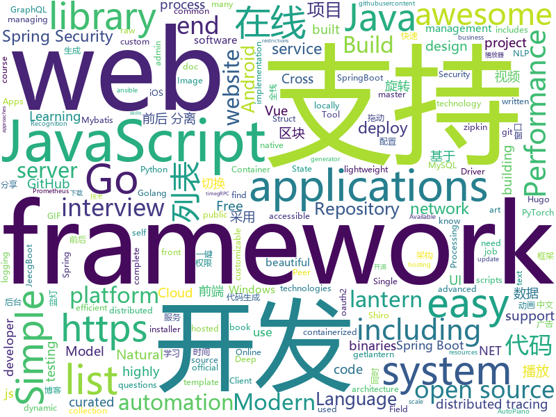

# 2019-11-02
See what the GitHub community is most excited about today.

## python
* [streamlit](https://github.com/streamlit/streamlit)(**247 stars today**): Streamlit — The fastest way to build custom ML tools
* [iOS-DeviceSupport](https://github.com/iGhibli/iOS-DeviceSupport)(**99 stars today**): This repository holds the device support files for the iOS, and I will update it regularly.
* [SinGAN](https://github.com/tamarott/SinGAN)(**235 stars today**): Official pytorch implementation of the paper: "SinGAN: Learning a Generative Model from a Single Natural Image"
* [dash](https://github.com/plotly/dash)(**46 stars today**): Analytical Web Apps for Python & R. No JavaScript Required.
* [DeepLearningExamples](https://github.com/NVIDIA/DeepLearningExamples)(**49 stars today**): Deep Learning Examples
* [HelloGitHub](https://github.com/521xueweihan/HelloGitHub)(**150 stars today**): Find pearls on open-source seashore 分享 GitHub 上有趣、入门级的开源项目
* [SlowFast](https://github.com/facebookresearch/SlowFast)(**89 stars today**): Present SlowFast networks for video recognition.
* [spleeter](https://github.com/deezer/spleeter)(**50 stars today**): Deezer source separation library including pretrained models.
* [BrachioGraph](https://github.com/evildmp/BrachioGraph)(**17 stars today**): BrachioGraph is an ultra-cheap (total cost of materials: €14) plotter that can be built with minimal skills.
* [transformers](https://github.com/huggingface/transformers)(**101 stars today**): 🤗Transformers: State-of-the-art Natural Language Processing for TensorFlow 2.0 and PyTorch.
* [generative_inpainting](https://github.com/JiahuiYu/generative_inpainting)(**8 stars today**): DeepFill v1/v2, Contextual Attention and Gated Convolution, CVPR 2018, and ICCV 2019 Oral
* [system-design-primer](https://github.com/donnemartin/system-design-primer)(**62 stars today**): Learn how to design large-scale systems. Prep for the system design interview. Includes Anki flashcards.
* [models](https://github.com/tensorflow/models)(**35 stars today**): Models and examples built with TensorFlow
* [reid-strong-baseline](https://github.com/michuanhaohao/reid-strong-baseline)(**6 stars today**): Bag of Tricks and A Strong Baseline for Deep Person Re-identification
* [gen-efficientnet-pytorch](https://github.com/rwightman/gen-efficientnet-pytorch)(**60 stars today**): Pretrained EfficientNet, MixNet, MobileNetV3, MNASNet A1 and B1, FBNet, Single-Path NAS
* [NLP-progress](https://github.com/sebastianruder/NLP-progress)(**19 stars today**): Repository to track the progress in Natural Language Processing (NLP), including the datasets and the current state-of-the-art for the most common NLP tasks.
* [imagededup](https://github.com/idealo/imagededup)(**16 stars today**): 😎Finding duplicate images made easy!
* [frappe](https://github.com/frappe/frappe)(**4 stars today**): The most powerful web framework on the planet
* [ansible](https://github.com/ansible/ansible)(**30 stars today**): Ansible is a radically simple IT automation platform that makes your applications and systems easier to deploy. Avoid writing scripts or custom code to deploy and update your applications — automate in a language that approaches plain English, using SSH, with no agents to install on remote systems. https://docs.ansible.com/ansible/
* [healthchecks](https://github.com/healthchecks/healthchecks)(**19 stars today**): A Cron Monitoring Tool written in Python & Django
* [FATE](https://github.com/FederatedAI/FATE)(**7 stars today**): An Industrial Level Federated Learning Framework
* [robotframework](https://github.com/robotframework/robotframework)(**3 stars today**): Generic automation framework for acceptance testing and RPA
* [nni](https://github.com/microsoft/nni)(**13 stars today**): An open source AutoML toolkit for neural architecture search and hyper-parameter tuning.
* [simpledet](https://github.com/TuSimple/simpledet)(**5 stars today**): A Simple and Versatile Framework for Object Detection and Instance Recognition
* [lihang_book_algorithm](https://github.com/WenDesi/lihang_book_algorithm)(**1 stars today**): 致力于将李航博士《统计学习方法》一书中所有算法实现一遍

## java
* [fullstack-tutorial](https://github.com/frank-lam/fullstack-tutorial)(**141 stars today**): 🚀fullstack tutorial 2019，后台技术栈/架构师之路/全栈开发社区，春招/秋招/校招/面试
* [Signal-Android](https://github.com/signalapp/Signal-Android)(**12 stars today**): A private messenger for Android.
* [SpringAll](https://github.com/wuyouzhuguli/SpringAll)(**72 stars today**): 循序渐进，学习Spring Boot、Spring Boot & Shiro、Spring Cloud、Spring Security & Spring Security OAuth2，博客Spring系列源码
* [jenkins](https://github.com/jenkinsci/jenkins)(**11 stars today**): Jenkins automation server
* [spring-security](https://github.com/spring-projects/spring-security)(**4 stars today**): Spring Security
* [eladmin](https://github.com/elunez/eladmin)(**49 stars today**): 项目基于 Spring Boot 2.1.0 、 Jpa、 Spring Security、redis、Vue的前后端分离的后台管理系统，项目采用分模块开发方式， 权限控制采用 RBAC，支持数据字典与数据权限管理，支持一键生成前后端代码，支持动态路由
* [jeecg-boot](https://github.com/zhangdaiscott/jeecg-boot)(**25 stars today**): 一款基于代码生成器的JAVA快速开发平台！采用最新技术，前后端分离架构：SpringBoot 2.x，Ant Design&Vue，Mybatis-plus，Shiro，JWT。强大的代码生成器让前后端代码一键生成，无需写任何代码，绝对是全栈开发福音！！ JeecgBoot的宗旨是提高UI能力的同时,降低前后分离的开发成本，JeecgBoot还独创在线开发模式，No代码概念，一系列在线智能开发：在线配置表单、在线配置报表、在线设计流程等等。
* [Mapper](https://github.com/abel533/Mapper)(**6 stars today**): Mybatis Common Mapper - Easy to use
* [avro](https://github.com/apache/avro)(**1 stars today**): Apache Avro
* [BigData-Notes](https://github.com/heibaiying/BigData-Notes)(**100 stars today**): 大数据入门指南⭐️
* [GSYVideoPlayer](https://github.com/CarGuo/GSYVideoPlayer)(**29 stars today**): 视频播放器（IJKplayer、ExoPlayer、MediaPlayer），HTTPS，支持弹幕，支持滤镜、水印、gif截图，片头广告、中间广告，多个同时播放，支持基本的拖动，声音、亮度调节，支持边播边缓存，支持视频自带rotation的旋转（90,270之类），重力旋转与手动旋转的同步支持，支持列表播放 ，列表全屏动画，视频加载速度，列表小窗口支持拖动，动画效果，调整比例，多分辨率切换，支持切换播放器，进度条小窗口预览，列表切换详情页面无缝播放，rtsp、concat、mpeg。
* [SpringCloud](https://github.com/zhoutaoo/SpringCloud)(**7 stars today**): 基于SpringCloud2.1的微服务开发脚手架，整合了spring-security-oauth2、nacos、feign、sentinel、springcloud-gateway等。服务治理方面引入elasticsearch、skywalking、springboot-admin、zipkin等，让项目开发快速进入业务开发，而不需过多时间花费在架构搭建上。持续更新中
* [graphql-java](https://github.com/graphql-java/graphql-java)(**11 stars today**): GraphQL Java implementation
* [zipkin](https://github.com/openzipkin/zipkin)(**11 stars today**): Zipkin is a distributed tracing system
* [interviews](https://github.com/kdn251/interviews)(**46 stars today**): Everything you need to know to get the job.
* [rest-assured](https://github.com/rest-assured/rest-assured)(**6 stars today**): Java DSL for easy testing of REST services
* [ghidra](https://github.com/NationalSecurityAgency/ghidra)(**23 stars today**): Ghidra is a software reverse engineering (SRE) framework
* [google-cloud-java](https://github.com/googleapis/google-cloud-java)(**5 stars today**): Google Cloud Client Library for Java
* [brave](https://github.com/openzipkin/brave)(**6 stars today**): Java distributed tracing implementation compatible with Zipkin backend services.
* [guice](https://github.com/google/guice)(**3 stars today**): Guice (pronounced 'juice') is a lightweight dependency injection framework for Java 6 and above, brought to you by Google.
* [rocketmq](https://github.com/apache/rocketmq)(**10 stars today**): Mirror of Apache RocketMQ
* [assertj-core](https://github.com/joel-costigliola/assertj-core)(**8 stars today**): AssertJ is a library providing easy to use rich typed assertions
* [hive](https://github.com/apache/hive)(**5 stars today**): Apache Hive
* [flowable-engine](https://github.com/flowable/flowable-engine)(**6 stars today**): A compact and highly efficient workflow and Business Process Management (BPM) platform for developers, system admins and business users.
* [jmx_exporter](https://github.com/prometheus/jmx_exporter)(**2 stars today**): A process for exposing JMX Beans via HTTP for Prometheus consumption

## unknown
* [Best-websites-a-programmer-should-visit](https://github.com/sdmg15/Best-websites-a-programmer-should-visit)(**89 stars today**): 🔗Some useful websites for programmers.
* [awesome-interview-questions](https://github.com/MaximAbramchuck/awesome-interview-questions)(**61 stars today**): A curated awesome list of lists of interview questions. Feel free to contribute!🎓
* [you-dont-know-js-ru](https://github.com/azat-io/you-dont-know-js-ru)(**13 stars today**): 📚Russian translation of "You Don't Know JS" book series
* [blockchain](https://github.com/LiuBoyu/blockchain)(**175 stars today**): 区块链 - 中文资源
* [The-Open-Book](https://github.com/joeycastillo/The-Open-Book)(**32 stars today**): 
* [amundsen](https://github.com/lyft/amundsen)(**10 stars today**): Repository for the Amundsen project
* [build-your-own-x](https://github.com/danistefanovic/build-your-own-x)(**80 stars today**): 🤓Build your own (insert technology here)
* [slides](https://github.com/TritonHo/slides)(**1 stars today**): it is a repository to store all slides used by Triton Ho's public presentation and course.
* [new-pac](https://github.com/Alvin9999/new-pac)(**31 stars today**): 
* [README-template.md](https://github.com/scottydocs/README-template.md)(**96 stars today**): A README template for anyone to copy and use.
* [spellbook-of-modern-webdev](https://github.com/dexteryy/spellbook-of-modern-webdev)(**38 stars today**): A Big Picture, Thesaurus, and Taxonomy of Modern JavaScript Web Development
* [123-Essential-JavaScript-Interview-Questions](https://github.com/ganqqwerty/123-Essential-JavaScript-Interview-Questions)(**24 stars today**): JavaScript interview Questions
* [developer-roadmap](https://github.com/kamranahmedse/developer-roadmap)(**72 stars today**): Roadmap to becoming a web developer in 2019
* [Data-Science--Cheat-Sheet](https://github.com/abhat222/Data-Science--Cheat-Sheet)(**48 stars today**): Cheat Sheets
* [Share-SSR-V2ray](https://github.com/selierlin/Share-SSR-V2ray)(**16 stars today**): 🃏Free SS/SSR/V2ray 免费分享节点账号信息网站
* [Awesome-Crowd-Counting](https://github.com/gjy3035/Awesome-Crowd-Counting)(**3 stars today**): Awesome Crowd Counting
* [frontend-architecture-topics](https://github.com/stevekinney/frontend-architecture-topics)(**37 stars today**): What constitutes front-end architecture?
* [OpenAPI-Specification](https://github.com/OAI/OpenAPI-Specification)(**18 stars today**): The OpenAPI Specification Repository
* [awesome](https://github.com/sindresorhus/awesome)(**89 stars today**): 😎Awesome lists about all kinds of interesting topics
* [regular-investing-in-box](https://github.com/xiaolai/regular-investing-in-box)(**6 stars today**): 定投改变命运 —— 让时间陪你慢慢变富
* [ipfs](https://github.com/ipfs/ipfs)(**5 stars today**): Peer-to-peer hypermedia protocol
* [oracle-java](https://github.com/frekele/oracle-java)(**5 stars today**): Oracle Java Binaries
* [frontend-challenges](https://github.com/felipefialho/frontend-challenges)(**12 stars today**): 💥Listing some playful open-source's challenges of jobs to test your knowledge
* [FE-interview](https://github.com/qiu-deqing/FE-interview)(**2 stars today**): 收集的前端面试题和答案
* [awesome-readme](https://github.com/matiassingers/awesome-readme)(**4 stars today**): A curated list of awesome READMEs

## javascript
* [smart-tracker](https://github.com/airuikun/smart-tracker)(**22 stars today**): smart-tracker简易型前端无痕埋点
* [chinese-independent-blogs](https://github.com/timqian/chinese-independent-blogs)(**308 stars today**): 中文独立博客列表
* [BlockChain](https://github.com/itheima1/BlockChain)(**56 stars today**): 黑马程序员 120天全栈区块链开发 开源教程
* [taobaoVisitingVenues](https://github.com/sleepybear1113/taobaoVisitingVenues)(**103 stars today**): 双十一活动自动化地操作淘宝浏览店铺得喵币脚本 for Android
* [AutoPiano](https://github.com/WarpPrism/AutoPiano)(**72 stars today**): 自由钢琴🎹AutoPiano ( https://www.autopiano.cn ) Simple & Elegant Piano Online
* [chakra-ui](https://github.com/chakra-ui/chakra-ui)(**226 stars today**): ⚡️Simple, Modular & Accessible UI Components for your React Applications
* [pdf.js](https://github.com/mozilla/pdf.js)(**17 stars today**): PDF Reader in JavaScript
* [vue](https://github.com/vuejs/vue)(**100 stars today**): 🖖Vue.js is a progressive, incrementally-adoptable JavaScript framework for building UI on the web.
* [jamstack-cms](https://github.com/jamstack-cms/jamstack-cms)(**64 stars today**): Modern full stack CMS. Built with GraphQL, AWS Amplify, and Serverless technologies.
* [slick](https://github.com/kenwheeler/slick)(**12 stars today**): the last carousel you'll ever need
* [Wappalyzer](https://github.com/AliasIO/Wappalyzer)(**14 stars today**): Cross-platform utility that uncovers the technologies used on websites.
* [appium](https://github.com/appium/appium)(**18 stars today**): 📱Automation for iOS, Android, and Windows Apps.
* [clean-code-javascript](https://github.com/ryanmcdermott/clean-code-javascript)(**59 stars today**): 🛁Clean Code concepts adapted for JavaScript
* [omi](https://github.com/Tencent/omi)(**51 stars today**): Front End Cross-Frameworks Framework - 前端跨框架跨平台框架
* [awesome-selfhosted](https://github.com/awesome-selfhosted/awesome-selfhosted)(**104 stars today**): This is a list of Free Software network services and web applications which can be hosted locally. Selfhosting is the process of locally hosting and managing applications instead of renting from SaaS providers.
* [gif.js](https://github.com/jnordberg/gif.js)(**1 stars today**): JavaScript GIF encoding library
* [appium-desktop](https://github.com/appium/appium-desktop)(**6 stars today**): Appium Server and Inspector in Desktop GUIs for Mac, Windows, and Linux
* [jest](https://github.com/facebook/jest)(**15 stars today**): Delightful JavaScript Testing.
* [sweetalert2](https://github.com/sweetalert2/sweetalert2)(**24 stars today**): A beautiful, responsive, highly customizable and accessible (WAI-ARIA) replacement for JavaScript's popup boxes. Zero dependencies.
* [slate](https://github.com/slatedocs/slate)(**42 stars today**): Beautiful static documentation for your API
* [Scripting](https://github.com/langkhach270389/Scripting)(**5 stars today**): 
* [atom](https://github.com/atom/atom)(**20 stars today**): The hackable text editor
* [svelte](https://github.com/sveltejs/svelte)(**87 stars today**): Cybernetically enhanced web apps
* [fastify](https://github.com/fastify/fastify)(**5 stars today**): Fast and low overhead web framework, for Node.js
* [vis-network](https://github.com/visjs/vis-network)(**4 stars today**): 💫Display dynamic, automatically organised, customizable network views.

## html
* [DevOps-Guide](https://github.com/Tikam02/DevOps-Guide)(**171 stars today**): DevOps Guide from basic to advanced with Interview Questions and Notes🔥
* [DetectionLab](https://github.com/clong/DetectionLab)(**20 stars today**): Vagrant & Packer scripts to build a lab environment complete with security tooling and logging best practices
* [nginxconfig.io](https://github.com/digitalocean/nginxconfig.io)(**163 stars today**): ⚙️NGiИX config generator on steroids💉
* [blockchainlittlebook.com](https://github.com/xiaolai/blockchainlittlebook.com)(**39 stars today**): 区块链小白书
* [HiddenEye](https://github.com/DarkSecDevelopers/HiddenEye)(**6 stars today**): Modern Phishing Tool With Advanced Functionality And Multiple Tunnelling Services [ Android-Support-Available ]
* [tools](https://github.com/googlecodelabs/tools)(**4 stars today**): Codelabs management & hosting tools
* [AR.js](https://github.com/jeromeetienne/AR.js)(**13 stars today**): Efficient Augmented Reality for the Web - 60fps on mobile!
* [REKCARC-TSC-UHT](https://github.com/PKUanonym/REKCARC-TSC-UHT)(**22 stars today**): 清华大学计算机系课程攻略 Guidance for courses in Department of Computer Science and Technology, Tsinghua University
* [webdevbootcamp](https://github.com/nax3t/webdevbootcamp)(**3 stars today**): All source code for back-end projects from the Web Developer Bootcamp
* [data_analysis](https://github.com/zhouwei713/data_analysis)(**10 stars today**): 一些爬虫和数据分析相关实战练习
* [sal](https://github.com/mciastek/sal)(**24 stars today**): 🚀Performance focused, lightweight scroll animation library🚀
* [bandinchina](https://github.com/caffeine-overload/bandinchina)(**9 stars today**): Naming and shaming companies who kowtow to Chinese censorship requests
* [twofactorauth](https://github.com/2factorauth/twofactorauth)(**2 stars today**): List of sites with two factor auth support which includes SMS, email, phone calls, hardware, and software.
* [subspace](https://github.com/subspacecloud/subspace)(**85 stars today**): A simple WireGuard VPN server GUI
* [dotnet](https://github.com/microsoft/dotnet)(**2 stars today**): This repo is the official home of .NET on GitHub. It's a great starting point to find many .NET OSS projects from Microsoft and the community, including many that are part of the .NET Foundation.
* [stickyfill](https://github.com/wilddeer/stickyfill)(**3 stars today**): Polyfill for CSS `position: sticky`
* [hugo-academic](https://github.com/gcushen/hugo-academic)(**9 stars today**): 📝The website builder for Hugo. Build and deploy a beautiful website in minutes!
* [compat-table](https://github.com/kangax/compat-table)(**4 stars today**): ECMAScript 5/6/7 compatibility tables
* [dex-demo](https://github.com/tendermint/dex-demo)(**6 stars today**): DeX Demo
* [awesome-webpack](https://github.com/webpack-contrib/awesome-webpack)(**4 stars today**): A curated list of awesome Webpack resources, libraries and tools
* [docsy](https://github.com/google/docsy)(**3 stars today**): A set of Hugo doc templates for launching open source content.
* [front-end-handbook-2019](https://github.com/FrontendMasters/front-end-handbook-2019)(**4 stars today**): [Book] 2019 edition of our front-end development handbook
* [blog_os](https://github.com/phil-opp/blog_os)(**5 stars today**): Writing an OS in Rust
* [awesome-modern-cpp](https://github.com/rigtorp/awesome-modern-cpp)(**14 stars today**): A collection of resources on modern C++
* [fastText](https://github.com/facebookresearch/fastText)(**12 stars today**): Library for fast text representation and classification.

## go
* [shhgit](https://github.com/eth0izzle/shhgit)(**79 stars today**): Ah shhgit! Find GitHub secrets in real time
* [grpc-gateway](https://github.com/grpc-ecosystem/grpc-gateway)(**10 stars today**): gRPC to JSON proxy generator following the gRPC HTTP spec
* [restic](https://github.com/restic/restic)(**240 stars today**): Fast, secure, efficient backup program
* [consul](https://github.com/hashicorp/consul)(**15 stars today**): Consul is a distributed, highly available, and data center aware solution to connect and configure applications across dynamic, distributed infrastructure.
* [alertmanager](https://github.com/prometheus/alertmanager)(**6 stars today**): Prometheus Alertmanager
* [lantern](https://github.com/getlantern/lantern)(**48 stars today**): 蓝灯Windows下载 https://raw.githubusercontent.com/getlantern/lantern-binaries/master/lantern-installer.exe 蓝灯安卓下载 https://raw.githubusercontent.com/getlantern/lantern-binaries/master/lantern-installer.apk
* [charts](https://github.com/helm/charts)(**19 stars today**): Curated applications for Kubernetes
* [origin](https://github.com/openshift/origin)(**5 stars today**): The self-managing, auto-upgrading, Kubernetes distribution for everyone
* [logrus](https://github.com/sirupsen/logrus)(**15 stars today**): Structured, pluggable logging for Go.
* [v2ray-core](https://github.com/v2ray/v2ray-core)(**56 stars today**): A platform for building proxies to bypass network restrictions.
* [rancher](https://github.com/rancher/rancher)(**8 stars today**): Complete container management platform
* [mysql](https://github.com/go-sql-driver/mysql)(**4 stars today**): Go MySQL Driver is a MySQL driver for Go's (golang) database/sql package
* [cosmos-sdk](https://github.com/cosmos/cosmos-sdk)(**4 stars today**): ⛓A Framework for Building High Value Public Blockchains✨
* [mock](https://github.com/golang/mock)(**1 stars today**): GoMock is a mocking framework for the Go programming language.
* [gitea](https://github.com/go-gitea/gitea)(**37 stars today**): Git with a cup of tea, painless self-hosted git service
* [validator](https://github.com/go-playground/validator)(**6 stars today**): 💯Go Struct and Field validation, including Cross Field, Cross Struct, Map, Slice and Array diving
* [nats-server](https://github.com/nats-io/nats-server)(**13 stars today**): High-Performance server for NATS, the cloud native messaging system.
* [redigo](https://github.com/gomodule/redigo)(**7 stars today**): Go client for Redis
* [opencensus-go](https://github.com/census-instrumentation/opencensus-go)(**2 stars today**): A stats collection and distributed tracing framework
* [coredns](https://github.com/coredns/coredns)(**7 stars today**): CoreDNS is a DNS server that chains plugins
* [gh-ost](https://github.com/github/gh-ost)(**4 stars today**): GitHub's Online Schema Migrations for MySQL
* [kubernetes](https://github.com/kubernetes/kubernetes)(**38 stars today**): Production-Grade Container Scheduling and Management
* [nomad](https://github.com/hashicorp/nomad)(**5 stars today**): Nomad is an easy-to-use, flexible, and performant workload orchestrator that can deploy a mix of microservice, batch, containerized, and non-containerized applications. Nomad is easy to operate and scale and has native Consul and Vault integrations.
* [kubeadm](https://github.com/kubernetes/kubeadm)(**4 stars today**): Aggregator for issues filed against kubeadm
* [gin](https://github.com/gin-gonic/gin)(**35 stars today**): Gin is a HTTP web framework written in Go (Golang). It features a Martini-like API with much better performance -- up to 40 times faster. If you need smashing performance, get yourself some Gin.

## WordCloud

