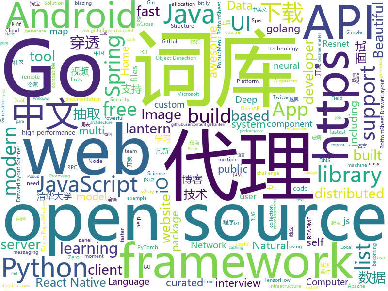

# 2019-11-03
See what the GitHub community is most excited about today.

## python
* [streamlit](https://github.com/streamlit/streamlit)(**283 stars today**): Streamlit — The fastest way to build custom ML tools
* [SinGAN](https://github.com/tamarott/SinGAN)(**297 stars today**): Official pytorch implementation of the paper: "SinGAN: Learning a Generative Model from a Single Natural Image"
* [DeepLearningExamples](https://github.com/NVIDIA/DeepLearningExamples)(**65 stars today**): Deep Learning Examples
* [mypy](https://github.com/python/mypy)(**27 stars today**): Optional static typing for Python 3 and 2 (PEP 484)
* [python-patterns](https://github.com/faif/python-patterns)(**32 stars today**): A collection of design patterns/idioms in Python
* [dash](https://github.com/plotly/dash)(**84 stars today**): Analytical Web Apps for Python & R. No JavaScript Required.
* [nni](https://github.com/microsoft/nni)(**17 stars today**): An open source AutoML toolkit for neural architecture search and hyper-parameter tuning.
* [seq2seq-couplet](https://github.com/wb14123/seq2seq-couplet)(**96 stars today**): Play couplet with seq2seq model. 用深度学习对对联。
* [optuna](https://github.com/pfnet/optuna)(**10 stars today**): A hyperparameter optimization framework
* [transformers](https://github.com/huggingface/transformers)(**136 stars today**): 🤗Transformers: State-of-the-art Natural Language Processing for TensorFlow 2.0 and PyTorch.
* [HelloGitHub](https://github.com/521xueweihan/HelloGitHub)(**167 stars today**): Find pearls on open-source seashore 分享 GitHub 上有趣、入门级的开源项目
* [iOS-DeviceSupport](https://github.com/iGhibli/iOS-DeviceSupport)(**98 stars today**): This repository holds the device support files for the iOS, and I will update it regularly.
* [numpy-ml](https://github.com/ddbourgin/numpy-ml)(**37 stars today**): Machine learning, in numpy
* [spleeter](https://github.com/deezer/spleeter)(**47 stars today**): Deezer source separation library including pretrained models.
* [doccano](https://github.com/chakki-works/doccano)(**7 stars today**): Open source text annotation tool for machine learning practitioner.
* [ImageAI](https://github.com/OlafenwaMoses/ImageAI)(**11 stars today**): A python library built to empower developers to build applications and systems with self-contained Computer Vision capabilities
* [chainer](https://github.com/chainer/chainer)(**4 stars today**): A flexible framework of neural networks for deep learning
* [pytorch-cifar100](https://github.com/weiaicunzai/pytorch-cifar100)(**5 stars today**): Practice on cifar100(ResNet, DenseNet, VGG, GoogleNet, InceptionV3, InceptionV4, Inception-ResNetv2, Xception, Resnet In Resnet, ResNext,ShuffleNet, ShuffleNetv2, MobileNet, MobileNetv2, SqueezeNet, NasNet, Residual Attention Network, SENet)
* [podman-compose](https://github.com/containers/podman-compose)(**6 stars today**): a script to run docker-compose.yml using podman
* [TensorFlow-Object-Detection-API-Tutorial-Train-Multiple-Objects-Windows-10](https://github.com/EdjeElectronics/TensorFlow-Object-Detection-API-Tutorial-Train-Multiple-Objects-Windows-10)(**4 stars today**): How to train a TensorFlow Object Detection Classifier for multiple object detection on Windows
* [DeepCreamPy](https://github.com/deeppomf/DeepCreamPy)(**11 stars today**): Decensoring Hentai with Deep Neural Networks
* [python-spider](https://github.com/Jack-Cherish/python-spider)(**12 stars today**): 🌈Python3网络爬虫实战：VIP视频破解助手；GEETEST验证码破解；小说、动漫下载；手机APP爬取；财务报表入库；火车票抢票；抖音APP视频下载；百万英雄辅助；网易云音乐下载；B站视频和弹幕下载；京东晒单图下载
* [nlp-recipes](https://github.com/microsoft/nlp-recipes)(**8 stars today**): Natural Language Processing Best Practices & Examples
* [odoo](https://github.com/odoo/odoo)(**24 stars today**): Odoo. Open Source Apps To Grow Your Business.
* [funNLP](https://github.com/fighting41love/funNLP)(**68 stars today**): 中英文敏感词、语言检测、中外手机/电话归属地/运营商查询、名字推断性别、手机号抽取、身份证抽取、邮箱抽取、中日文人名库、中文缩写库、拆字词典、词汇情感值、停用词、反动词表、暴恐词表、繁简体转换、英文模拟中文发音、汪峰歌词生成器、职业名称词库、同义词库、反义词库、否定词库、汽车品牌词库、汽车零件词库、连续英文切割、各种中文词向量、公司名字大全、古诗词库、IT词库、财经词库、成语词库、地名词库、历史名人词库、诗词词库、医学词库、饮食词库、法律词库、汽车词库、动物词库、中文聊天语料、中文谣言数据、百度中文问答数据集、句子相似度匹配算法集合、bert资源、文本生成&摘要相关工具、cocoNLP信息抽取工具、国内电话号码正则匹配、清华大学XLORE:中英文跨语言百科知识图谱、清华大学人工智能技术…

## java
* [fullstack-tutorial](https://github.com/frank-lam/fullstack-tutorial)(**144 stars today**): 🚀fullstack tutorial 2019，后台技术栈/架构师之路/全栈开发社区，春招/秋招/校招/面试
* [BigData-Notes](https://github.com/heibaiying/BigData-Notes)(**108 stars today**): 大数据入门指南⭐️
* [alf.io](https://github.com/alfio-event/alf.io)(**133 stars today**): alf.io - The open source ticket reservation system for conferences, trade shows, workshops, meetups
* [libgdx](https://github.com/libgdx/libgdx)(**11 stars today**): Desktop/Android/HTML5/iOS Java game development framework
* [SpringAll](https://github.com/wuyouzhuguli/SpringAll)(**93 stars today**): 循序渐进，学习Spring Boot、Spring Boot & Shiro、Spring Cloud、Spring Security & Spring Security OAuth2，博客Spring系列源码
* [interviews](https://github.com/kdn251/interviews)(**64 stars today**): Everything you need to know to get the job.
* [CS-Notes](https://github.com/CyC2018/CS-Notes)(**121 stars today**): 📚Tech Interview Guide 技术面试必备基础知识、Leetcode、Java、C++、Python、后端面试、计算机操作系统、计算机网络、系统设计
* [flink-learning](https://github.com/zhisheng17/flink-learning)(**19 stars today**): flink learning blog. http://www.54tianzhisheng.cn
* [glide](https://github.com/bumptech/glide)(**16 stars today**): An image loading and caching library for Android focused on smooth scrolling
* [SmartRefreshLayout](https://github.com/scwang90/SmartRefreshLayout)(**22 stars today**): 🔥下拉刷新、上拉加载、二级刷新、淘宝二楼、RefreshLayout、OverScroll，Android智能下拉刷新框架，支持越界回弹、越界拖动，具有极强的扩展性，集成了几十种炫酷的Header和 Footer。
* [assertj-core](https://github.com/joel-costigliola/assertj-core)(**25 stars today**): AssertJ is a library providing easy to use rich typed assertions
* [react-native-camera](https://github.com/react-native-community/react-native-camera)(**6 stars today**): A Camera component for React Native. Also supports barcode scanning!
* [azure-sdk-for-java](https://github.com/Azure/azure-sdk-for-java)(**1 stars today**): Microsoft Azure SDK for Java
* [AndroidUtilCode](https://github.com/Blankj/AndroidUtilCode)(**19 stars today**): 🔥Android developers should collect the following utils(updating).
* [dubbo](https://github.com/apache/dubbo)(**29 stars today**): Apache Dubbo is a high-performance, java based, open source RPC framework.
* [sofa-rpc](https://github.com/sofastack/sofa-rpc)(**5 stars today**): SOFARPC is a high-performance, high-extensibility, production-level Java RPC framework.
* [openapi-generator](https://github.com/OpenAPITools/openapi-generator)(**18 stars today**): OpenAPI Generator allows generation of API client libraries (SDK generation), server stubs, documentation and configuration automatically given an OpenAPI Spec (v2, v3)
* [react-native-push-notification](https://github.com/zo0r/react-native-push-notification)(**5 stars today**): React Native Local and Remote Notifications
* [Signal-Android](https://github.com/signalapp/Signal-Android)(**10 stars today**): A private messenger for Android.
* [maps](https://github.com/react-native-mapbox-gl/maps)(**3 stars today**): A Mapbox GL react native module for creating custom maps
* [XPopup](https://github.com/li-xiaojun/XPopup)(**12 stars today**): 🔥功能强大，UI简洁，交互优雅的通用弹窗！可以替代Dialog，PopupWindow，PopupMenu，BottomSheet，DrawerLayout，Spinner等组件，自带十几种效果良好的动画， 支持完全的UI和动画自定义！(Powerful and Beautiful Popup，can absolutely replace Dialog，PopupWindow，PopupMenu，BottomSheet，DrawerLayout，Spinner. With built-in animators , very easy to custom popup view.)
* [Luban](https://github.com/Curzibn/Luban)(**14 stars today**): Luban(鲁班)—Image compression with efficiency very close to WeChat Moments/可能是最接近微信朋友圈的图片压缩算法
* [JavaGuide](https://github.com/Snailclimb/JavaGuide)(**154 stars today**): 【Java学习+面试指南】 一份涵盖大部分Java程序员所需要掌握的核心知识。
* [halo](https://github.com/halo-dev/halo)(**27 stars today**): ✍ Halo 一款现代化的个人独立博客系统
* [pulsar](https://github.com/apache/pulsar)(**10 stars today**): Apache Pulsar - distributed pub-sub messaging system

## unknown
* [Cookbook](https://github.com/andkret/Cookbook)(**95 stars today**): The Data Engineering Cookbook
* [computer-science](https://github.com/ossu/computer-science)(**290 stars today**): 🎓Path to a free self-taught education in Computer Science!
* [Best-websites-a-programmer-should-visit](https://github.com/sdmg15/Best-websites-a-programmer-should-visit)(**185 stars today**): 🔗Some useful websites for programmers.
* [You-Dont-Know-JS](https://github.com/getify/You-Dont-Know-JS)(**111 stars today**): A book series on JavaScript. @YDKJS on twitter.
* [awesome-interview-questions](https://github.com/MaximAbramchuck/awesome-interview-questions)(**73 stars today**): A curated awesome list of lists of interview questions. Feel free to contribute!🎓
* [developer-roadmap](https://github.com/kamranahmedse/developer-roadmap)(**84 stars today**): Roadmap to becoming a web developer in 2019
* [SSR](https://github.com/DuyaoSS/SSR)(**19 stars today**): 毒药笔记
* [awesome](https://github.com/sindresorhus/awesome)(**135 stars today**): 😎Awesome lists about all kinds of interesting topics
* [python_for_data_analysis_2nd_chinese_version](https://github.com/iamseancheney/python_for_data_analysis_2nd_chinese_version)(**87 stars today**): 《利用Python进行数据分析·第2版》
* [build-your-own-x](https://github.com/danistefanovic/build-your-own-x)(**100 stars today**): 🤓Build your own (insert technology here)
* [trackerslist](https://github.com/ngosang/trackerslist)(**135 stars today**): Updated list of public BitTorrent trackers
* [README-template.md](https://github.com/scottydocs/README-template.md)(**94 stars today**): A README template for anyone to copy and use.
* [123-Essential-JavaScript-Interview-Questions](https://github.com/ganqqwerty/123-Essential-JavaScript-Interview-Questions)(**32 stars today**): JavaScript interview Questions
* [AspNetCore-Developer-Roadmap](https://github.com/MoienTajik/AspNetCore-Developer-Roadmap)(**10 stars today**): Roadmap to becoming an ASP.NET Core developer in 2019
* [typescript-cheatsheet](https://github.com/delprzemo/typescript-cheatsheet)(**30 stars today**): Cheatsheet for TypeScript with most useful functionalities
* [spellbook-of-modern-webdev](https://github.com/dexteryy/spellbook-of-modern-webdev)(**50 stars today**): A Big Picture, Thesaurus, and Taxonomy of Modern JavaScript Web Development
* [frontend-architecture-topics](https://github.com/stevekinney/frontend-architecture-topics)(**58 stars today**): What constitutes front-end architecture?
* [blockchain](https://github.com/LiuBoyu/blockchain)(**170 stars today**): 区块链 - 中文资源
* [frontend-challenges](https://github.com/felipefialho/frontend-challenges)(**17 stars today**): 💥Listing some playful open-source's challenges of jobs to test your knowledge
* [Python](https://github.com/TwoWater/Python)(**25 stars today**): 最良心的 Python 教程：
* [weekly](https://github.com/ruanyf/weekly)(**38 stars today**): 科技爱好者周刊，每周五发布
* [StabilityGuide](https://github.com/StabilityMan/StabilityGuide)(**24 stars today**): 【稳定大于一切】打造国内稳定性领域知识库，让无法解决的问题少一点点，让世界的确定性多一点点。
* [vagas](https://github.com/backend-br/vagas)(**8 stars today**): ✌️Espaço para divulgação de vagas para backenders
* [gold-miner](https://github.com/xitu/gold-miner)(**27 stars today**): 🥇掘金翻译计划，可能是世界最大最好的英译中技术社区，最懂读者和译者的翻译平台：
* [clash_for_windows_pkg](https://github.com/Fndroid/clash_for_windows_pkg)(**35 stars today**): A Windows GUI based on Clash

## javascript
* [BullshitGenerator](https://github.com/menzi11/BullshitGenerator)(**902 stars today**): Needs to generate some texts to test if my GUI rendering codes good or not. so I made this.
* [taobaoVisitingVenues](https://github.com/sleepybear1113/taobaoVisitingVenues)(**119 stars today**): 双十一活动自动化地操作淘宝浏览店铺得喵币脚本 for Android
* [chinese-independent-blogs](https://github.com/timqian/chinese-independent-blogs)(**398 stars today**): 中文独立博客列表
* [BlockChain](https://github.com/itheima1/BlockChain)(**136 stars today**): 黑马程序员 120天全栈区块链开发 开源教程
* [kbone](https://github.com/wechat-miniprogram/kbone)(**66 stars today**): Web 与小程序同构解决方案
* [AutoPiano](https://github.com/WarpPrism/AutoPiano)(**108 stars today**): 自由钢琴🎹AutoPiano ( https://www.autopiano.cn ) Simple & Elegant Piano Online
* [Administrative-divisions-of-China](https://github.com/modood/Administrative-divisions-of-China)(**52 stars today**): 中华人民共和国行政区划：省级（省份直辖市自治区）、 地级（城市）、 县级（区县）、 乡级（乡镇街道）、 村级（村委会居委会） ，中国省市区镇村二级三级四级五级联动地址数据 Node.js 爬虫。
* [jamstack-cms](https://github.com/jamstack-cms/jamstack-cms)(**52 stars today**): Modern full stack CMS. Built with GraphQL, AWS Amplify, and Serverless technologies.
* [Rocket.Chat](https://github.com/RocketChat/Rocket.Chat)(**17 stars today**): The ultimate Free Open Source Solution for team communications.
* [clean-code-javascript](https://github.com/ryanmcdermott/clean-code-javascript)(**68 stars today**): 🛁Clean Code concepts adapted for JavaScript
* [javascript-algorithms](https://github.com/trekhleb/javascript-algorithms)(**99 stars today**): 📝Algorithms and data structures implemented in JavaScript with explanations and links to further readings
* [mini-tokyo-3d](https://github.com/nagix/mini-tokyo-3d)(**43 stars today**): A real-time 3D digital map of Tokyo's public transport system
* [chakra-ui](https://github.com/chakra-ui/chakra-ui)(**224 stars today**): ⚡️Simple, Modular & Accessible UI Components for your React Applications
* [bootstrap-material-design](https://github.com/mdbootstrap/bootstrap-material-design)(**27 stars today**): Material Design for Bootstrap - Powerful and free UI KIT for Bootstrap 4
* [Daily-Interview-Question](https://github.com/Advanced-Frontend/Daily-Interview-Question)(**58 stars today**): 我是木易杨，公众号「高级前端进阶」作者，每天搞定一道前端大厂面试题，祝大家天天进步，一年后会看到不一样的自己。
* [nideshop](https://github.com/tumobi/nideshop)(**16 stars today**): NideShop 开源微信小程序商城服务端 API（Node.js + ThinkJS）
* [webextensions-examples](https://github.com/mdn/webextensions-examples)(**9 stars today**): Example Firefox add-ons created using the WebExtensions API
* [AwesomeXSS](https://github.com/s0md3v/AwesomeXSS)(**11 stars today**): Awesome XSS stuff
* [wangEditor](https://github.com/wangfupeng1988/wangEditor)(**18 stars today**): wangEditor —— 轻量级web富文本框
* [swiper](https://github.com/nolimits4web/swiper)(**29 stars today**): Most modern mobile touch slider with hardware accelerated transitions
* [gatsby](https://github.com/gatsbyjs/gatsby)(**50 stars today**): Build blazing fast, modern apps and websites with React
* [react-native-snap-carousel](https://github.com/archriss/react-native-snap-carousel)(**9 stars today**): Swiper/carousel component for React Native with previews, multiple layouts, parallax images, performant handling of huge numbers of items, and RTL support. Compatible with Android & iOS.
* [slate](https://github.com/slatedocs/slate)(**28 stars today**): Beautiful static documentation for your API
* [readme-md-generator](https://github.com/kefranabg/readme-md-generator)(**39 stars today**): 📄CLI that generates beautiful README.md files
* [moment-timezone](https://github.com/moment/moment-timezone)(**4 stars today**): Timezone support for moment.js

## html
* [wpt](https://github.com/web-platform-tests/wpt)(**4 stars today**): Test suites for Web platform specs — including WHATWG, W3C, and others
* [fluxion](https://github.com/FluxionNetwork/fluxion)(**5 stars today**): Fluxion is a remake of linset by vk496 with less bugs and enhanced functionality.
* [OpenClash](https://github.com/vernesong/OpenClash)(**10 stars today**): A Clash Client For OpenWrt
* [v2-ui](https://github.com/sprov065/v2-ui)(**15 stars today**): 支持多协议多用户的 v2ray 面板，Support multi-protocol multi-user v2ray panel
* [REKCARC-TSC-UHT](https://github.com/PKUanonym/REKCARC-TSC-UHT)(**26 stars today**): 清华大学计算机系课程攻略 Guidance for courses in Department of Computer Science and Technology, Tsinghua University
* [blog_os](https://github.com/phil-opp/blog_os)(**7 stars today**): Writing an OS in Rust
* [compat-table](https://github.com/kangax/compat-table)(**4 stars today**): ECMAScript 5/6/7 compatibility tables
* [shellphish](https://github.com/thelinuxchoice/shellphish)(**3 stars today**): Phishing Tool for 18 social media: Instagram, Facebook, Snapchat, Github, Twitter, Yahoo, Protonmail, Spotify, Netflix, Linkedin, Wordpress, Origin, Steam, Microsoft, InstaFollowers, Gitlab, Pinterest
* [tabler](https://github.com/tabler/tabler)(**31 stars today**): Tabler is free and open-source HTML Dashboard UI Kit built on Bootstrap
* [EIPs](https://github.com/ethereum/EIPs)(**5 stars today**): The Ethereum Improvement Proposal repository
* [jackfrued-Python-100-Days](https://github.com/Julie-Wang/jackfrued-Python-100-Days)(**5 stars today**): 
* [awesome-piracy](https://github.com/Igglybuff/awesome-piracy)(**13 stars today**): A curated list of awesome warez and piracy links
* [nginxconfig.io](https://github.com/digitalocean/nginxconfig.io)(**180 stars today**): ⚙️NGiИX config generator on steroids💉
* [hugo-academic](https://github.com/gcushen/hugo-academic)(**9 stars today**): 📝The website builder for Hugo. Build and deploy a beautiful website in minutes!
* [awesome-competitive-programming](https://github.com/lnishan/awesome-competitive-programming)(**9 stars today**): 💎A curated list of awesome Competitive Programming, Algorithm and Data Structure resources
* [awesome-modern-cpp](https://github.com/rigtorp/awesome-modern-cpp)(**17 stars today**): A collection of resources on modern C++
* [JavaScript30](https://github.com/wesbos/JavaScript30)(**15 stars today**): 30 Day Vanilla JS Challenge
* [home-assistant.io](https://github.com/home-assistant/home-assistant.io)(**2 stars today**): 📘Home Assistant User documentation
* [qiubaiying.github.io](https://github.com/qiubaiying/qiubaiying.github.io)(**7 stars today**): BY Blog ->
* [home](https://github.com/rime/home)(**9 stars today**): Rime::Home is home to Rime users and developers
* [reference](https://github.com/rust-lang/reference)(**0 stars today**): The Rust Reference
* [dart-pad](https://github.com/dart-lang/dart-pad)(**3 stars today**): The UI client for a web based interactive Dart service
* [Dism-Multi-language](https://github.com/Chuyu-Team/Dism-Multi-language)(**7 stars today**): Dism++ Multi-language Support & BUG Report
* [en.javascript.info](https://github.com/javascript-tutorial/en.javascript.info)(**19 stars today**): Modern JavaScript Tutorial
* [pcc_2e](https://github.com/ehmatthes/pcc_2e)(**1 stars today**): Online resources for Python Crash Course (Second Edition), from No Starch Press

## go
* [go-micro](https://github.com/micro/go-micro)(**21 stars today**): A Go microservices development framework
* [clash](https://github.com/Dreamacro/clash)(**32 stars today**): A rule-based tunnel in Go.
* [cloud-torrent](https://github.com/jpillora/cloud-torrent)(**52 stars today**): ☁️Cloud Torrent: a self-hosted remote torrent client
* [go-admin](https://github.com/GoAdminGroup/go-admin)(**125 stars today**): A dataviz framework help gopher to build a admin panel in ten minutes
* [terraform](https://github.com/hashicorp/terraform)(**33 stars today**): Terraform enables you to safely and predictably create, change, and improve infrastructure. It is an open source tool that codifies APIs into declarative configuration files that can be shared amongst team members, treated as code, edited, reviewed, and versioned.
* [frp](https://github.com/fatedier/frp)(**70 stars today**): A fast reverse proxy to help you expose a local server behind a NAT or firewall to the internet.
* [gin](https://github.com/gin-gonic/gin)(**42 stars today**): Gin is a HTTP web framework written in Go (Golang). It features a Martini-like API with much better performance -- up to 40 times faster. If you need smashing performance, get yourself some Gin.
* [fasthttp](https://github.com/valyala/fasthttp)(**65 stars today**): Fast HTTP package for Go. Tuned for high performance. Zero memory allocations in hot paths. Up to 10x faster than net/http
* [iris](https://github.com/kataras/iris)(**21 stars today**): 感谢中国开发商 - https://bit.ly/謝謝 | The fastest community-driven web framework for Go. Webassembly, Automatic HTTPS with Public Domain, MVC, Sessions, Caching, Versioning API, Problem API, Websocket, Dependency Injection and more. Fully compatible with the standard library and 3rd-party middleware packages. | https://bit.ly/iriscandothat1 | https://bi…
* [jaeger](https://github.com/jaegertracing/jaeger)(**35 stars today**): CNCF Jaeger, a Distributed Tracing Platform
* [lantern](https://github.com/getlantern/lantern)(**68 stars today**): 蓝灯Windows下载 https://raw.githubusercontent.com/getlantern/lantern-binaries/master/lantern-installer.exe 蓝灯安卓下载 https://raw.githubusercontent.com/getlantern/lantern-binaries/master/lantern-installer.apk
* [graphql-go](https://github.com/graph-gophers/graphql-go)(**8 stars today**): GraphQL server with a focus on ease of use
* [aks-engine](https://github.com/Azure/aks-engine)(**1 stars today**): AKS Engine: Units of Kubernetes on Azure!
* [zerolog](https://github.com/rs/zerolog)(**13 stars today**): Zero Allocation JSON Logger
* [go-gin-example](https://github.com/EDDYCJY/go-gin-example)(**15 stars today**): An example of gin
* [restic](https://github.com/restic/restic)(**214 stars today**): Fast, secure, efficient backup program
* [chat](https://github.com/tinode/chat)(**9 stars today**): Instant messaging server; backend in Go; iOS, Android, web, command line clients; chatbots
* [goproxy](https://github.com/snail007/goproxy)(**35 stars today**): Proxy是高性能全功能的http代理、https代理、socks5代理、内网穿透、内网穿透p2p、内网穿透代理、内网穿透反向代理、内网穿透服务器、Websocket代理、TCP代理、UDP代理、DNS代理、DNS加密代理，代理API认证，全能跨平台代理服务器。
* [xlsx](https://github.com/tealeg/xlsx)(**9 stars today**): Google Go (golang) library for reading and writing XLSX files.
* [zap](https://github.com/uber-go/zap)(**21 stars today**): Blazing fast, structured, leveled logging in Go.
* [consul](https://github.com/hashicorp/consul)(**24 stars today**): Consul is a distributed, highly available, and data center aware solution to connect and configure applications across dynamic, distributed infrastructure.
* [validator](https://github.com/go-playground/validator)(**8 stars today**): 💯Go Struct and Field validation, including Cross Field, Cross Struct, Map, Slice and Array diving
* [vault](https://github.com/hashicorp/vault)(**15 stars today**): A tool for secrets management, encryption as a service, and privileged access management
* [client_golang](https://github.com/prometheus/client_golang)(**3 stars today**): Prometheus instrumentation library for Go applications
* [color](https://github.com/fatih/color)(**9 stars today**): Color package for Go (golang)

## WordCloud

