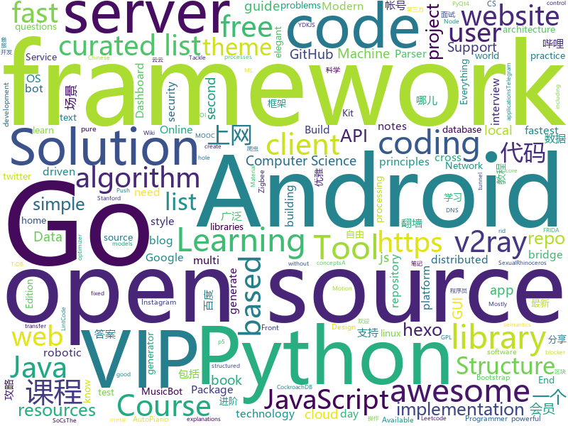

# 2019-11-05
See what the GitHub community is most excited about today.

## python
* [spleeter](https://github.com/deezer/spleeter)(**1,269 stars today**): Deezer source separation library including pretrained models.
* [home-assistant](https://github.com/home-assistant/home-assistant)(**49 stars today**): 🏡Open source home automation that puts local control and privacy first
* [searx](https://github.com/asciimoo/searx)(**43 stars today**): Privacy-respecting metasearch engine
* [streamlit](https://github.com/streamlit/streamlit)(**171 stars today**): Streamlit — The fastest way to build custom ML tools
* [Machine-Learning-Yearning-Vietnamese-Translation](https://github.com/aivivn/Machine-Learning-Yearning-Vietnamese-Translation)(**9 stars today**): 
* [rockstar](https://github.com/avinassh/rockstar)(**30 stars today**): Makes you a Rockstar C++ Programmer in 2 minutes
* [Real-Time-Voice-Cloning](https://github.com/CorentinJ/Real-Time-Voice-Cloning)(**43 stars today**): Clone a voice in 5 seconds to generate arbitrary speech in real-time
* [localstack](https://github.com/localstack/localstack)(**476 stars today**): 💻A fully functional local AWS cloud stack. Develop and test your cloud & Serverless apps offline!
* [interpy-zh](https://github.com/eastlakeside/interpy-zh)(**35 stars today**): 📘《Python进阶》（Intermediate Python 中文版）
* [whapa](https://github.com/B16f00t/whapa)(**10 stars today**): WhatsApp Parser Toolset v1.14
* [fast-style-transfer](https://github.com/lengstrom/fast-style-transfer)(**4 stars today**): TensorFlow CNN for fast style transfer ⚡🖥🎨🖼
* [Telethon](https://github.com/LonamiWebs/Telethon)(**6 stars today**): Pure Python 3 MTProto API Telegram client library, for bots too!
* [inbac](https://github.com/weclaw1/inbac)(**14 stars today**): 
* [RAdam](https://github.com/LiyuanLucasLiu/RAdam)(**16 stars today**): On the Variance of the Adaptive Learning Rate and Beyond
* [MusicBot](https://github.com/Just-Some-Bots/MusicBot)(**3 stars today**): 🎵The original MusicBot for Discord (formerly SexualRhinoceros/MusicBot)
* [interview_internal_reference](https://github.com/0voice/interview_internal_reference)(**73 stars today**): 2019年最新总结，阿里，腾讯，百度，美团，头条等技术面试题目，以及答案，专家出题人分析汇总。
* [code_snippets](https://github.com/CoreyMSchafer/code_snippets)(**9 stars today**): 
* [imbalanced-learn](https://github.com/scikit-learn-contrib/imbalanced-learn)(**8 stars today**): A Python Package to Tackle the Curse of Imbalanced Datasets in Machine Learning
* [docker-pi-hole](https://github.com/pi-hole/docker-pi-hole)(**6 stars today**): Pi-hole in a docker container
* [awesome-machine-learning](https://github.com/josephmisiti/awesome-machine-learning)(**22 stars today**): A curated list of awesome Machine Learning frameworks, libraries and software.
* [InstaPy](https://github.com/timgrossmann/InstaPy)(**9 stars today**): 📷Instagram Bot - Tool for automated Instagram interactions
* [PyQt](https://github.com/PyQt5/PyQt)(**9 stars today**): PyQt Examples（PyQt各种测试和例子） PyQt4 PyQt5
* [c3dpo_nrsfm](https://github.com/facebookresearch/c3dpo_nrsfm)(**14 stars today**): C3DPO - Canonical 3D Pose Networks for Non-rigid Structure From Motion.
* [nut](https://github.com/blawar/nut)(**1 stars today**): 
* [Computer-Networking-A-Top-Down-Approach-NOTES](https://github.com/moranzcw/Computer-Networking-A-Top-Down-Approach-NOTES)(**15 stars today**): 《计算机网络－自顶向下方法(原书第6版)》编程作业，Wireshark实验文档的翻译和解答。

## java
* [BigData-Notes](https://github.com/heibaiying/BigData-Notes)(**125 stars today**): 大数据入门指南⭐️
* [SkyStone](https://github.com/FIRST-Tech-Challenge/SkyStone)(**3 stars today**): FTC SDK
* [CtCI-6th-Edition](https://github.com/careercup/CtCI-6th-Edition)(**12 stars today**): Cracking the Coding Interview 6th Ed. Solutions
* [HanLP](https://github.com/hankcs/HanLP)(**266 stars today**): 自然语言处理 中文分词 词性标注 命名实体识别 依存句法分析 新词发现 关键词短语提取 自动摘要 文本分类聚类 拼音简繁
* [cassandra](https://github.com/apache/cassandra)(**4 stars today**): Mirror of Apache Cassandra
* [LintCode](https://github.com/awangdev/LintCode)(**3 stars today**): Java Solutions to problems on LintCode/LeetCode
* [Play-with-Data-Structures](https://github.com/liuyubobobo/Play-with-Data-Structures)(**4 stars today**): Codes of my MOOC Course <Play Data Structures in Java>. Updated contents and practices are also included. 我在慕课网上的课程《Java语言玩转数据结构》示例代码。课程的更多更新内容及辅助练习也将逐步添加进这个代码仓。
* [termux-app](https://github.com/termux/termux-app)(**16 stars today**): Android terminal and Linux environment - app repository.
* [interviews](https://github.com/kdn251/interviews)(**33 stars today**): Everything you need to know to get the job.
* [Pix-EzViewer](https://github.com/Notsfsssf/Pix-EzViewer)(**2 stars today**): 一个支持免代理直连及查看动图的第三方Pixiv android客户端
* [NewPipe](https://github.com/TeamNewPipe/NewPipe)(**6 stars today**): A libre lightweight streaming front-end for Android.
* [JAViewer](https://github.com/SplashCodes/JAViewer)(**4 stars today**): 更优雅的驾车体验
* [citra_android](https://github.com/SachinVin/citra_android)(**3 stars today**): An Android frontend for the Citra Emulator
* [Java](https://github.com/TheAlgorithms/Java)(**101 stars today**): All Algorithms implemented in Java
* [antlr4](https://github.com/antlr/antlr4)(**13 stars today**): ANTLR (ANother Tool for Language Recognition) is a powerful parser generator for reading, processing, executing, or translating structured text or binary files.
* [android-mvvm-architecture](https://github.com/MindorksOpenSource/android-mvvm-architecture)(**5 stars today**): This repository contains a detailed sample app that implements MVVM architecture using Dagger2, Room, RxJava2, FastAndroidNetworking and PlaceholderView
* [NLPIR](https://github.com/NLPIR-team/NLPIR)(**4 stars today**): 
* [sofa-jraft](https://github.com/sofastack/sofa-jraft)(**6 stars today**): A production-grade java implementation of RAFT consensus algorithm.
* [closure-compiler](https://github.com/google/closure-compiler)(**4 stars today**): A JavaScript checker and optimizer.
* [ActivityLauncher](https://github.com/butzist/ActivityLauncher)(**3 stars today**): 
* [qmq](https://github.com/qunarcorp/qmq)(**3 stars today**): QMQ是去哪儿网内部广泛使用的消息中间件，自2012年诞生以来在去哪儿网所有业务场景中广泛的应用，包括跟交易息息相关的订单场景； 也包括报价搜索等高吞吐量场景。
* [booksource](https://github.com/guolindev/booksource)(**3 stars today**): 《第一行代码 第2版》全书源代码
* [AntennaPod](https://github.com/AntennaPod/AntennaPod)(**2 stars today**): A podcast manager for Android
* [RIBs](https://github.com/uber/RIBs)(**1 stars today**): Uber's cross-platform mobile architecture framework.
* [OpenCV](https://github.com/xikuqi/OpenCV)(**83 stars today**): 

## unknown
* [build-your-own-x](https://github.com/danistefanovic/build-your-own-x)(**1,593 stars today**): 🤓Build your own (insert technology here)
* [awesome-interview-questions](https://github.com/MaximAbramchuck/awesome-interview-questions)(**303 stars today**): A curated awesome list of lists of interview questions. Feel free to contribute!🎓
* [goodies](https://github.com/rsapkf/goodies)(**183 stars today**): Collection of GitHub repos, blogs and websites to learn cool things
* [You-Dont-Know-JS](https://github.com/getify/You-Dont-Know-JS)(**98 stars today**): A book series on JavaScript. @YDKJS on twitter.
* [Data-Science--Cheat-Sheet](https://github.com/abhat222/Data-Science--Cheat-Sheet)(**55 stars today**): Cheat Sheets
* [trackerslist](https://github.com/ngosang/trackerslist)(**140 stars today**): Updated list of public BitTorrent trackers
* [awesome-robotic-tooling](https://github.com/Ly0n/awesome-robotic-tooling)(**301 stars today**): Just a bunch of powerful robotic resources and tools for professional robotic development with ROS in C++ and Python.
* [project-based-learning](https://github.com/tuvtran/project-based-learning)(**49 stars today**): Curated list of project-based tutorials
* [hosts](https://github.com/googlehosts/hosts)(**24 stars today**): 镜像：https://coding.net/u/scaffrey/p/hosts/git
* [Cookbook](https://github.com/andkret/Cookbook)(**141 stars today**): The Data Engineering Cookbook
* [Best-websites-a-programmer-should-visit](https://github.com/sdmg15/Best-websites-a-programmer-should-visit)(**284 stars today**): 🔗Some useful websites for programmers.
* [computer-science](https://github.com/ossu/computer-science)(**103 stars today**): 🎓Path to a free self-taught education in Computer Science!
* [stanford-cs-229-machine-learning](https://github.com/afshinea/stanford-cs-229-machine-learning)(**3 stars today**): VIP cheatsheets for Stanford's CS 229 Machine Learning
* [OI-wiki](https://github.com/OI-wiki/OI-wiki)(**6 stars today**): 🌟Wiki for OI / ICPC. （某大型游戏线上攻略，内含炫酷算术魔法）
* [MIT-Linear-Algebra-Notes](https://github.com/yizhen20133868/MIT-Linear-Algebra-Notes)(**70 stars today**): Notes for MIT-Linear-Algebra
* [goQuality-dev-contents](https://github.com/Integerous/goQuality-dev-contents)(**7 stars today**): { 고퀄리티⚡️개발 컨텐츠 모음 }
* [android_guides](https://github.com/codepath/android_guides)(**3 stars today**): Extensive Open-Source Guides for Android Developers
* [My-blog](https://github.com/markyun/My-blog)(**5 stars today**): 马云云在Github的学习片段 https://www.yuque.com/markyun
* [Profiles](https://github.com/ConnersHua/Profiles)(**23 stars today**): 
* [wildcat-vip-account](https://github.com/wuxingsanren/wildcat-vip-account)(**16 stars today**): 野猫VIP帐号 - 每天分享最新的百度网盘SVIP、迅雷超级会员、优酷VIP会员、哔哩哔哩大会员、百度文库VIP、苹果ID、天眼查VIP等等各类VIP帐号，随取随用，完全免费，绝无套路，欢迎推荐分享给好友！
* [ncmdump](https://github.com/NoColor2/ncmdump)(**5 stars today**): 
* [leetcode](https://github.com/grandyang/leetcode)(**9 stars today**): Provide all my solutions and explanations in Chinese for all the Leetcode coding problems.
* [clash_for_windows_pkg](https://github.com/Fndroid/clash_for_windows_pkg)(**14 stars today**): A Windows GUI based on Clash
* [awesome-c](https://github.com/kozross/awesome-c)(**8 stars today**): A curated list of awesome C frameworks, libraries, resources and other shiny things. Inspired by all the other awesome-... projects out there.
* [coding-interview-university](https://github.com/jwasham/coding-interview-university)(**57 stars today**): A complete computer science study plan to become a software engineer.

## javascript
* [BullshitGenerator](https://github.com/menzi11/BullshitGenerator)(**665 stars today**): Needs to generate some texts to test if my GUI rendering codes good or not. so I made this.
* [taobaoVisitingVenues](https://github.com/sleepybear1113/taobaoVisitingVenues)(**110 stars today**): 双十一活动自动化地操作淘宝浏览店铺得喵币脚本 for Android
* [homebridge](https://github.com/nfarina/homebridge)(**7 stars today**): HomeKit support for the impatient
* [iptv](https://github.com/iptv-org/iptv)(**163 stars today**): Collection of 8000+ publicly available IPTV channels from all over the world
* [BlockChain](https://github.com/itheima1/BlockChain)(**268 stars today**): 黑马程序员 120天全栈区块链开发 开源教程
* [Kuiper](https://github.com/DFIRKuiper/Kuiper)(**20 stars today**): Digital Investigation Platform
* [dyo](https://github.com/dyo/dyo)(**96 stars today**): Dyo is a JavaScript library for building user interfaces.
* [AutoPiano](https://github.com/WarpPrism/AutoPiano)(**74 stars today**): 自由钢琴🎹AutoPiano ( https://www.autopiano.cn ) Simple & Elegant Piano Online
* [node-red](https://github.com/node-red/node-red)(**14 stars today**): Low-code programming for event-driven applications
* [webogram](https://github.com/zhukov/webogram)(**11 stars today**): Telegram web application, GPL v3
* [hexo-theme-yilia](https://github.com/litten/hexo-theme-yilia)(**7 stars today**): 一个简洁优雅的hexo主题 A simple and elegant theme for hexo.
* [omi](https://github.com/Tencent/omi)(**40 stars today**): Front End Cross-Frameworks Framework - 前端跨框架跨平台框架
* [Administrative-divisions-of-China](https://github.com/modood/Administrative-divisions-of-China)(**65 stars today**): 中华人民共和国行政区划：省级（省份直辖市自治区）、 地级（城市）、 县级（区县）、 乡级（乡镇街道）、 村级（村委会居委会） ，中国省市区镇村二级三级四级五级联动地址数据 Node.js 爬虫。
* [uBlock](https://github.com/gorhill/uBlock)(**5 stars today**): uBlock Origin - An efficient blocker for Chromium and Firefox. Fast and lean.
* [fanqiang](https://github.com/bannedbook/fanqiang)(**17 stars today**): 翻墙-科学上网
* [zigbee2mqtt](https://github.com/Koenkk/zigbee2mqtt)(**8 stars today**): Zigbee🐝to MQTT bridge🌉, get rid of your proprietary Zigbee bridges🔨
* [lx-music-desktop](https://github.com/lyswhut/lx-music-desktop)(**25 stars today**): 一个基于 electron 的音乐软件
* [mostly-adequate-guide](https://github.com/MostlyAdequate/mostly-adequate-guide)(**15 stars today**): Mostly adequate guide to FP (in javascript)
* [kbone](https://github.com/wechat-miniprogram/kbone)(**47 stars today**): Web 与小程序同构解决方案
* [etcher](https://github.com/balena-io/etcher)(**11 stars today**): Flash OS images to SD cards & USB drives, safely and easily.
* [p5.js](https://github.com/processing/p5.js)(**12 stars today**): p5.js is a client-side JS platform that empowers artists, designers, students, and anyone to learn to code and express themselves creatively on the web. It is based on the core principles of Processing. http://twitter.com/p5xjs —
* [website](https://github.com/CodingTrain/website)(**6 stars today**): Coding Train website
* [site-kit-wp](https://github.com/google/site-kit-wp)(**5 stars today**): Site Kit is a one-stop solution for WordPress users to use everything Google has to offer to make them successful on the web.
* [fingerprintjs2](https://github.com/Valve/fingerprintjs2)(**14 stars today**): Modern & flexible browser fingerprinting library

## html
* [Disclosures](https://github.com/badd1e/Disclosures)(**29 stars today**): Zero-day and N-day security vulnerability notes, analysis, and proof-of-concepts
* [subspace](https://github.com/subspacecloud/subspace)(**29 stars today**): A simple WireGuard VPN server GUI
* [CLRS](https://github.com/walkccc/CLRS)(**6 stars today**): 📚Solutions to Introduction to Algorithms Third Edition
* [learning-area](https://github.com/mdn/learning-area)(**5 stars today**): Github repo for the MDN Learning Area.
* [home-assistant.io](https://github.com/home-assistant/home-assistant.io)(**0 stars today**): 📘Home Assistant User documentation
* [Java-Interview-Advanced](https://github.com/shishan100/Java-Interview-Advanced)(**11 stars today**): 中华石杉--互联网Java进阶面试训练营
* [pcc_2e](https://github.com/ehmatthes/pcc_2e)(**0 stars today**): Online resources for Python Crash Course (Second Edition), from No Starch Press
* [Coursera-ML-AndrewNg-Notes](https://github.com/fengdu78/Coursera-ML-AndrewNg-Notes)(**28 stars today**): 吴恩达老师的机器学习课程个人笔记
* [manual](https://github.com/v2ray/manual)(**3 stars today**): Source code for https://www.v2ray.com/
* [go101](https://github.com/go101/go101)(**14 stars today**): An online book focusing on Go syntax/semantics.
* [awesome-piracy](https://github.com/Igglybuff/awesome-piracy)(**20 stars today**): A curated list of awesome warez and piracy links
* [v2-ui](https://github.com/sprov065/v2-ui)(**3 stars today**): 支持多协议多用户的 v2ray 面板，Support multi-protocol multi-user v2ray panel
* [tabler](https://github.com/tabler/tabler)(**9 stars today**): Tabler is free and open-source HTML Dashboard UI Kit built on Bootstrap
* [frida-all-in-one](https://github.com/hookmaster/frida-all-in-one)(**15 stars today**): 《FRIDA操作手册》by @hluwa @r0ysue
* [dragon-book-exercise-answers](https://github.com/fool2fish/dragon-book-exercise-answers)(**4 stars today**): Compilers Principles, Techniques, & Tools (purple dragon book) second edition exercise answers. 编译原理（紫龙书）第2版习题答案。
* [mkdocs-material](https://github.com/squidfunk/mkdocs-material)(**1 stars today**): A Material Design theme for MkDocs
* [datasciencecoursera](https://github.com/mGalarnyk/datasciencecoursera)(**5 stars today**): Data Science Repo and blog for John Hopkins Coursera Courses. Please let me know if you have any questions.
* [gentelella](https://github.com/ColorlibHQ/gentelella)(**16 stars today**): Free Bootstrap 4 Admin Dashboard Template
* [nginxconfig.io](https://github.com/digitalocean/nginxconfig.io)(**81 stars today**): ⚙️NGiИX config generator on steroids💉
* [styleguide](https://github.com/google/styleguide)(**22 stars today**): Style guides for Google-originated open-source projects
* [DIGITS](https://github.com/NVIDIA/DIGITS)(**2 stars today**): Deep Learning GPU Training System
* [hexo-matery-modified](https://github.com/godweiyang/hexo-matery-modified)(**2 stars today**): My personal modified hexo matery theme with some bugs fixed.
* [REKCARC-TSC-UHT](https://github.com/PKUanonym/REKCARC-TSC-UHT)(**6 stars today**): 清华大学计算机系课程攻略 Guidance for courses in Department of Computer Science and Technology, Tsinghua University
* [computer-science-flash-cards](https://github.com/jwasham/computer-science-flash-cards)(**4 stars today**): Mini website for testing both general CS knowledge and enforce coding practice and common algorithm/data structure memorization.
* [HiddenEye](https://github.com/DarkSecDevelopers/HiddenEye)(**0 stars today**): Modern Phishing Tool With Advanced Functionality And Multiple Tunnelling Services [ Android-Support-Available ]

## go
* [go-micro](https://github.com/micro/go-micro)(**38 stars today**): A Go microservices development framework
* [FreeNet](https://github.com/xiaoming2028/FreeNet)(**26 stars today**): 科学上网/梯子/自由上网/翻墙 SSR/V2Ray/Brook 最全搭建教程
* [go-git](https://github.com/src-d/go-git)(**14 stars today**): A highly extensible Git implementation in pure Go.
* [nsq](https://github.com/nsqio/nsq)(**9 stars today**): A realtime distributed messaging platform
* [coredns](https://github.com/coredns/coredns)(**11 stars today**): CoreDNS is a DNS server that chains plugins
* [opentelemetry-go](https://github.com/open-telemetry/opentelemetry-go)(**11 stars today**): 
* [frp](https://github.com/fatedier/frp)(**51 stars today**): A fast reverse proxy to help you expose a local server behind a NAT or firewall to the internet.
* [ent](https://github.com/facebookincubator/ent)(**27 stars today**): An entity framework for Go
* [OpenDiablo2](https://github.com/OpenDiablo2/OpenDiablo2)(**10 stars today**): An open source re-implementation of Diablo 2
* [client](https://github.com/keybase/client)(**11 stars today**): Keybase Go Library, Client, Service, OS X, iOS, Android, Electron
* [pspy](https://github.com/DominicBreuker/pspy)(**4 stars today**): Monitor linux processes without root permissions
* [gosec](https://github.com/securego/gosec)(**17 stars today**): Golang security checker
* [go-github](https://github.com/google/go-github)(**5 stars today**): Go library for accessing the GitHub API
* [opentracing-go](https://github.com/opentracing/opentracing-go)(**1 stars today**): OpenTracing API for Go
* [clash](https://github.com/Dreamacro/clash)(**16 stars today**): A rule-based tunnel in Go.
* [lnd](https://github.com/lightningnetwork/lnd)(**4 stars today**): Lightning Network Daemon⚡️
* [sshcode](https://github.com/cdr/sshcode)(**5 stars today**): Run VS Code on any server over SSH.
* [tidb](https://github.com/pingcap/tidb)(**10 stars today**): TiDB is an open source distributed HTAP database compatible with the MySQL protocol
* [tamago](https://github.com/inversepath/tamago)(**18 stars today**): TamaGo - bare metal Go for ARM SoCs
* [hugo](https://github.com/gohugoio/hugo)(**33 stars today**): The world’s fastest framework for building websites.
* [cockroach](https://github.com/cockroachdb/cockroach)(**7 stars today**): CockroachDB - the open source, cloud-native SQL database.
* [proposal](https://github.com/golang/proposal)(**2 stars today**): Go Project Design Documents
* [color](https://github.com/fatih/color)(**5 stars today**): Color package for Go (golang)
* [glog](https://github.com/golang/glog)(**1 stars today**): Leveled execution logs for Go
* [vulcain](https://github.com/dunglas/vulcain)(**16 stars today**): Use HTTP/2 Server Push to create fast and idiomatic client-driven REST APIs

## WordCloud

