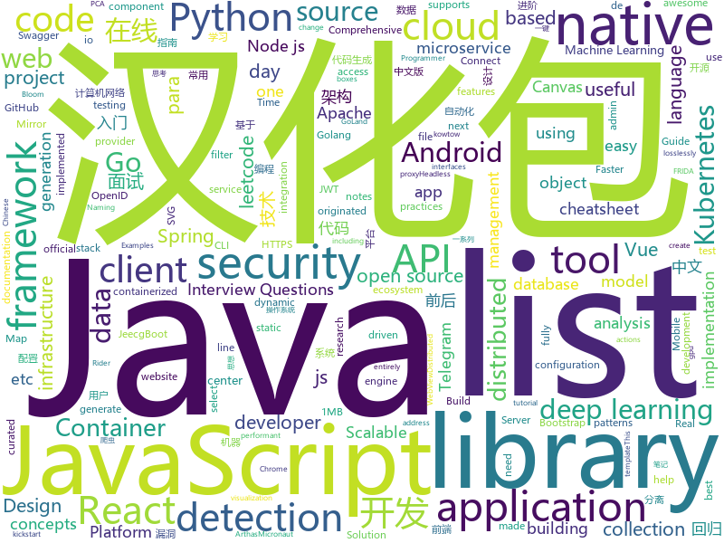

# 2019-11-06
See what the GitHub community is most excited about today.

## python
* [spleeter](https://github.com/deezer/spleeter)(**973 stars today**): Deezer source separation library including pretrained models.
* [DeepCTR](https://github.com/shenweichen/DeepCTR)(**9 stars today**): Easy-to-use,Modular and Extendible package of deep-learning based CTR models.
* [localstack](https://github.com/localstack/localstack)(**153 stars today**): 💻A fully functional local AWS cloud stack. Develop and test your cloud & Serverless apps offline!
* [Ultra-Light-Fast-Generic-Face-Detector-1MB](https://github.com/Linzaer/Ultra-Light-Fast-Generic-Face-Detector-1MB)(**42 stars today**): 💎1MB lightweight face detection model (1MB轻量级人脸检测模型)
* [rockstar](https://github.com/avinassh/rockstar)(**114 stars today**): Makes you a Rockstar C++ Programmer in 2 minutes
* [cloud-custodian](https://github.com/cloud-custodian/cloud-custodian)(**6 stars today**): Rules engine for cloud security, cost optimization, and governance, DSL in yaml for policies to query, filter, and take actions on resources
* [ambassador](https://github.com/datawire/ambassador)(**4 stars today**): open source Kubernetes-native API gateway for microservices built on the Envoy Proxy
* [httpx](https://github.com/encode/httpx)(**17 stars today**): A next generation HTTP client for Python.🦋
* [interpy-zh](https://github.com/eastlakeside/interpy-zh)(**61 stars today**): 📘《Python进阶》（Intermediate Python 中文版）
* [aws-cloudformation-templates](https://github.com/awslabs/aws-cloudformation-templates)(**6 stars today**): A collection of useful CloudFormation templates
* [detectron2](https://github.com/facebookresearch/detectron2)(**53 stars today**): Detectron2 is FAIR's next-generation research platform for object detection and segmentation.
* [Python-100-Days](https://github.com/ZiniuLu/Python-100-Days)(**9 stars today**): 出处：https://github.com/jackfrued/Python-100-Days.git
* [SlimYOLOv3](https://github.com/PengyiZhang/SlimYOLOv3)(**6 stars today**): This page is for the SlimYOLOv3: Narrower, Faster and Better for UAV Real-Time Applications
* [incubator-tvm](https://github.com/apache/incubator-tvm)(**8 stars today**): Open deep learning compiler stack for cpu, gpu and specialized accelerators
* [scipy](https://github.com/scipy/scipy)(**11 stars today**): Scipy library main repository
* [CenterNet](https://github.com/xingyizhou/CenterNet)(**14 stars today**): Object detection, 3D detection, and pose estimation using center point detection:
* [netbox](https://github.com/netbox-community/netbox)(**8 stars today**): IP address management (IPAM) and data center infrastructure management (DCIM) tool.
* [django-oauth-toolkit](https://github.com/jazzband/django-oauth-toolkit)(**3 stars today**): OAuth2 goodies for the Djangonauts!
* [Computer-Networking-A-Top-Down-Approach-NOTES](https://github.com/moranzcw/Computer-Networking-A-Top-Down-Approach-NOTES)(**18 stars today**): 《计算机网络－自顶向下方法(原书第6版)》编程作业，Wireshark实验文档的翻译和解答。
* [generative_inpainting](https://github.com/JiahuiYu/generative_inpainting)(**15 stars today**): DeepFill v1/v2, Contextual Attention and Gated Convolution, CVPR 2018, and ICCV 2019 Oral
* [spaCy](https://github.com/explosion/spaCy)(**14 stars today**): 💫Industrial-strength Natural Language Processing (NLP) with Python and Cython
* [code_snippets](https://github.com/CoreyMSchafer/code_snippets)(**18 stars today**): 
* [DeepSpeech](https://github.com/PaddlePaddle/DeepSpeech)(**6 stars today**): A PaddlePaddle implementation of DeepSpeech2 architecture for ASR.
* [keras](https://github.com/keras-team/keras)(**36 stars today**): Deep Learning for humans
* [DeepLearningExamples](https://github.com/NVIDIA/DeepLearningExamples)(**42 stars today**): Deep Learning Examples

## java
* [HanLP](https://github.com/hankcs/HanLP)(**90 stars today**): 自然语言处理 中文分词 词性标注 命名实体识别 依存句法分析 新词发现 关键词短语提取 自动摘要 文本分类聚类 拼音简繁
* [BigData-Notes](https://github.com/heibaiying/BigData-Notes)(**311 stars today**): 大数据入门指南⭐️
* [CS-Notes](https://github.com/CyC2018/CS-Notes)(**119 stars today**): 📚技术面试必备基础知识、Leetcode、Java、C++、Python、后端面试、计算机操作系统、计算机网络、系统设计
* [react-native-camera](https://github.com/react-native-community/react-native-camera)(**8 stars today**): A Camera component for React Native. Also supports barcode scanning!
* [selenium](https://github.com/SeleniumHQ/selenium)(**14 stars today**): A browser automation framework and ecosystem.
* [tutorials](https://github.com/eugenp/tutorials)(**33 stars today**): The "REST With Spring" Course:
* [Java](https://github.com/TheAlgorithms/Java)(**151 stars today**): All Algorithms implemented in Java
* [h2o-3](https://github.com/h2oai/h2o-3)(**4 stars today**): Open Source Fast Scalable Machine Learning Platform For Smarter Applications: Deep Learning, Gradient Boosting & XGBoost, Random Forest, Generalized Linear Modeling (Logistic Regression, Elastic Net), K-Means, PCA, Stacked Ensembles, Automatic Machine Learning (AutoML), etc.
* [jeecg-boot](https://github.com/zhangdaiscott/jeecg-boot)(**27 stars today**): 一款基于代码生成器的JAVA快速开发平台！采用最新技术，前后端分离架构：SpringBoot 2.x，Ant Design&Vue，Mybatis-plus，Shiro，JWT。强大的代码生成器让前后端代码一键生成，无需写任何代码，绝对是全栈开发福音！！ JeecgBoot的宗旨是提高UI能力的同时,降低前后分离的开发成本，JeecgBoot还独创在线开发模式，No代码概念，一系列在线智能开发：在线配置表单、在线配置报表、在线设计流程等等。
* [java-design-patterns](https://github.com/iluwatar/java-design-patterns)(**43 stars today**): Design patterns implemented in Java
* [litemall](https://github.com/linlinjava/litemall)(**17 stars today**): 又一个小商城。litemall = Spring Boot后端 + Vue管理员前端 + 微信小程序用户前端 + Vue用户移动端
* [camel](https://github.com/apache/camel)(**4 stars today**): Apache Camel
* [dbeaver](https://github.com/dbeaver/dbeaver)(**24 stars today**): Free universal database tool and SQL client
* [Auto.js](https://github.com/hyb1996/Auto.js)(**113 stars today**): A UiAutomator on android, does not need root access(安卓平台上的JavaScript自动化工具)
* [spring-cloud-kubernetes](https://github.com/spring-cloud/spring-cloud-kubernetes)(**5 stars today**): Kubernetes integration with Spring Cloud Discovery Client, Configuration, etc...
* [react-native-webview](https://github.com/react-native-community/react-native-webview)(**4 stars today**): React Native Cross-Platform WebView
* [incubator-shardingsphere](https://github.com/apache/incubator-shardingsphere)(**35 stars today**): Distributed database middleware
* [YCSB](https://github.com/brianfrankcooper/YCSB)(**4 stars today**): Yahoo! Cloud Serving Benchmark
* [spring-framework](https://github.com/spring-projects/spring-framework)(**31 stars today**): Spring Framework
* [arthas](https://github.com/alibaba/arthas)(**36 stars today**): Alibaba Java Diagnostic Tool Arthas/Alibaba Java诊断利器Arthas
* [micronaut-core](https://github.com/micronaut-projects/micronaut-core)(**98 stars today**): Micronaut Application Framework
* [redisson](https://github.com/redisson/redisson)(**16 stars today**): Redisson - Redis Java client with features of In-Memory Data Grid. Supports over 30 objects and services: Set, Multimap, SortedSet, Map, List, Queue, Deque, Semaphore, Lock, AtomicLong, Map Reduce, Publish / Subscribe, Bloom filter, Spring Cache, Tomcat, Scheduler, JCache API, Hibernate, RPC.
* [Telegram](https://github.com/DrKLO/Telegram)(**8 stars today**): Telegram for Android source
* [springboot-socks](https://github.com/yizhiwazi/springboot-socks)(**12 stars today**): SpringBoot 基础教程 | 从入门到上瘾 | 基于2.0.0.M5制作
* [hbase](https://github.com/apache/hbase)(**2 stars today**): Mirror of Apache HBase

## unknown
* [fanhaodaquan](https://github.com/imfht/fanhaodaquan)(**192 stars today**): 番号大全。
* [the-book-of-secret-knowledge](https://github.com/trimstray/the-book-of-secret-knowledge)(**65 stars today**): A collection of inspiring lists, manuals, cheatsheets, blogs, hacks, one-liners, cli/web tools and more.
* [hacker-laws](https://github.com/dwmkerr/hacker-laws)(**133 stars today**): 💻📖Laws, Theories, Principles and Patterns that developers will find useful. #hackerlaws
* [few-shot-vid2vid](https://github.com/NVlabs/few-shot-vid2vid)(**115 stars today**): 
* [awesome-interview-questions](https://github.com/MaximAbramchuck/awesome-interview-questions)(**249 stars today**): A curated awesome list of lists of interview questions. Feel free to contribute!🎓
* [You-Dont-Know-JS](https://github.com/getify/You-Dont-Know-JS)(**101 stars today**): A book series on JavaScript. @YDKJS on twitter.
* [Specs](https://github.com/CocoaPods/Specs)(**4 stars today**): The CocoaPods Master Repo
* [coding-music](https://github.com/xaca/coding-music)(**8 stars today**): Buscamos crear listas en texto con los nombres de canciones organizadas por genero. Esta es una iniciativa para cuando necesites inspiración musical para programar.
* [gitignore](https://github.com/github/gitignore)(**65 stars today**): A collection of useful .gitignore templates
* [modern-cpp-features](https://github.com/AnthonyCalandra/modern-cpp-features)(**16 stars today**): A cheatsheet of modern C++ language and library features.
* [chromium](https://github.com/chromium/chromium)(**18 stars today**): The official GitHub mirror of the Chromium source
* [reverse-interview-zh](https://github.com/yifeikong/reverse-interview-zh)(**71 stars today**): 技术面试最后反问面试官的话
* [react-typescript-cheatsheet](https://github.com/typescript-cheatsheets/react-typescript-cheatsheet)(**39 stars today**): Cheatsheets for experienced React developers getting started with TypeScript
* [vagas](https://github.com/frontendbr/vagas)(**7 stars today**): 🔬Espaço para divulgação de vagas para front-enders.
* [new-grads-2020](https://github.com/cmackenzie1/new-grads-2020)(**2 stars today**): A collection of new grad roles for 2020
* [the-art-of-command-line](https://github.com/jlevy/the-art-of-command-line)(**59 stars today**): Master the command line, in one page
* [botframework](https://github.com/microsoft/botframework)(**4 stars today**): Microsoft BotFramework - A comprehensive framework for building enterprise-grade conversational AI experiences
* [Machine-Learning-Session](https://github.com/shuhuai007/Machine-Learning-Session)(**19 stars today**): 
* [OnJava8](https://github.com/LingCoder/OnJava8)(**32 stars today**): 《On Java 8》中文版，又名《Java编程思想》 第5版
* [arXivTimes](https://github.com/arXivTimes/arXivTimes)(**5 stars today**): repository to research & share the machine learning articles
* [PureCSS-Font](https://github.com/cyanharlow/PureCSS-Font)(**12 stars today**): For secrecy or CAPTCHA purposes: a customizable, scalable font made entirely of CSS and HTML, delivered in a single JS file.
* [technology-talk](https://github.com/aalansehaiyang/technology-talk)(**27 stars today**): 汇总java生态圈常用技术框架、开源中间件，系统架构、数据库、大公司架构案例、常用三方类库、项目管理、线上问题排查、个人成长、思考等知识
* [reactjs-interview-questions](https://github.com/sudheerj/reactjs-interview-questions)(**14 stars today**): List of top 500 ReactJS Interview Questions & Answers....Coding exercise questions are coming soon!!
* [javascript-testing-best-practices](https://github.com/goldbergyoni/javascript-testing-best-practices)(**53 stars today**): 📗🌐🚢Comprehensive and exhaustive JavaScript & Node.js testing best practices (August 2019)
* [deep_learning_object_detection](https://github.com/hoya012/deep_learning_object_detection)(**22 stars today**): A paper list of object detection using deep learning.

## javascript
* [BullshitGenerator](https://github.com/menzi11/BullshitGenerator)(**837 stars today**): Needs to generate some texts to test if my GUI rendering codes good or not. so I made this.
* [taobaoVisitingVenues](https://github.com/sleepybear1113/taobaoVisitingVenues)(**136 stars today**): 双十一活动自动化地操作淘宝浏览店铺得喵币脚本 for Android
* [BlockChain](https://github.com/itheima1/BlockChain)(**112 stars today**): 黑马程序员 120天全栈区块链开发 开源教程
* [webogram](https://github.com/zhukov/webogram)(**14 stars today**): Telegram web application, GPL v3
* [slate](https://github.com/slatedocs/slate)(**22 stars today**): Beautiful static documentation for your API
* [Administrative-divisions-of-China](https://github.com/modood/Administrative-divisions-of-China)(**53 stars today**): 中华人民共和国行政区划：省级（省份直辖市自治区）、 地级（城市）、 县级（区县）、 乡级（乡镇街道）、 村级（村委会居委会） ，中国省市区镇村二级三级四级五级联动地址数据 Node.js 爬虫。
* [react-native](https://github.com/facebook/react-native)(**41 stars today**): A framework for building native apps with React.
* [leetcode](https://github.com/azl397985856/leetcode)(**118 stars today**): LeetCode Solutions: A Record of My Problem Solving Journey.( leetcode题解，记录自己的leetcode解题之路。)
* [Mobile-Security-Framework-MobSF](https://github.com/MobSF/Mobile-Security-Framework-MobSF)(**7 stars today**): Mobile Security Framework (MobSF) is an automated, all-in-one mobile application (Android/iOS/Windows) pen-testing, malware analysis and security assessment framework capable of performing static and dynamic analysis.
* [fabric.js](https://github.com/fabricjs/fabric.js)(**10 stars today**): Javascript Canvas Library, SVG-to-Canvas (& canvas-to-SVG) Parser
* [telegram-react](https://github.com/evgeny-nadymov/telegram-react)(**7 stars today**): Experimental Telegram web client with tdlib, webassembly and react js under the hood
* [33-js-concepts](https://github.com/leonardomso/33-js-concepts)(**43 stars today**): 📜33 concepts every JavaScript developer should know.
* [clean-code-javascript](https://github.com/ryanmcdermott/clean-code-javascript)(**68 stars today**): 🛁Clean Code concepts adapted for JavaScript
* [dyo](https://github.com/dyo/dyo)(**50 stars today**): Dyo is a JavaScript library for building user interfaces.
* [react-query](https://github.com/tannerlinsley/react-query)(**553 stars today**): ⚛️Hooks for fetching, caching and updating asynchronous data in React
* [deck.gl](https://github.com/uber/deck.gl)(**10 stars today**): WebGL2 powered geospatial visualization layers
* [lossless-cut](https://github.com/mifi/lossless-cut)(**11 stars today**): Save space by quickly and losslessly trimming video and audio files
* [nuxt.js](https://github.com/nuxt/nuxt.js)(**33 stars today**): The Vue.js Framework
* [plexis](https://github.com/plexis-js/plexis)(**13 stars today**): Lo-fi, powerful, community-driven string manipulation library.
* [500lines](https://github.com/aosabook/500lines)(**18 stars today**): 500 Lines or Less
* [selectize.js](https://github.com/selectize/selectize.js)(**3 stars today**): Selectize is the hybrid of a textbox and <select> box. It's jQuery based and it has autocomplete and native-feeling keyboard navigation; useful for tagging, contact lists, etc.
* [material-ui](https://github.com/mui-org/material-ui)(**52 stars today**): React components for faster and easier web development. Build your own design system, or start with Material Design.
* [whistle](https://github.com/avwo/whistle)(**15 stars today**): HTTP, HTTP2, HTTPS, Websocket debugging proxy
* [puppeteer](https://github.com/GoogleChrome/puppeteer)(**41 stars today**): Headless Chrome Node.js API
* [jsPDF](https://github.com/MrRio/jsPDF)(**14 stars today**): Client-side JavaScript PDF generation for everyone.

## html
* [DevOps-Guide](https://github.com/Tikam02/DevOps-Guide)(**355 stars today**): DevOps Guide from basic to advanced with Interview Questions and Notes🔥
* [Disclosures](https://github.com/badd1e/Disclosures)(**23 stars today**): Zero-day and N-day security vulnerability notes, analysis, and proof-of-concepts
* [Java-Interview-Advanced](https://github.com/shishan100/Java-Interview-Advanced)(**11 stars today**): 中华石杉--互联网Java进阶面试训练营
* [swagger-codegen](https://github.com/swagger-api/swagger-codegen)(**5 stars today**): swagger-codegen contains a template-driven engine to generate documentation, API clients and server stubs in different languages by parsing your OpenAPI / Swagger definition.
* [nginxconfig.io](https://github.com/digitalocean/nginxconfig.io)(**55 stars today**): ⚙️NGiИX config generator on steroids💉
* [istio.io](https://github.com/istio/istio.io)(**2 stars today**): Source for the istio.io site
* [awesome-piracy](https://github.com/Igglybuff/awesome-piracy)(**14 stars today**): A curated list of awesome warez and piracy links
* [chosen](https://github.com/harvesthq/chosen)(**3 stars today**): Chosen is a library for making long, unwieldy select boxes more friendly.
* [nsfocus-rsas-knowledge-base](https://github.com/biggerwing/nsfocus-rsas-knowledge-base)(**34 stars today**): 绿盟科技漏洞扫描器(RSAS)漏洞库
* [bandinchina](https://github.com/caffeine-overload/bandinchina)(**14 stars today**): Naming and shaming companies who kowtow to Chinese censorship requests
* [MSEdgeExplainers](https://github.com/MicrosoftEdge/MSEdgeExplainers)(**8 stars today**): Home for explainer documents originated by the Microsoft Edge team
* [TranslatorX](https://github.com/pingfangx/TranslatorX)(**8 stars today**): JetBrains 系列软件汉化包 关键字: Android Studio 3.5 汉化包 CLion 2019.2 汉化包 DataGrip 2019.2 汉化包 GoLand 2019.2 汉化包 IntelliJ IDEA 2019.2 汉化包 PhpStorm 2019.2 汉化包 PyCharm 2019.2 汉化包 Rider 2019.2 汉化包 RubyMine 2019.2 汉化包 WebStorm 2019.2 汉化包
* [personal-website](https://github.com/github/personal-website)(**4 stars today**): Code that'll help you kickstart a personal website that showcases your work as a software developer.
* [Machine-Learning](https://github.com/Jack-Cherish/Machine-Learning)(**7 stars today**): ⚡️机器学习实战（Python3）：kNN、决策树、贝叶斯、逻辑回归、SVM、线性回归、树回归
* [aws-well-architected-labs](https://github.com/awslabs/aws-well-architected-labs)(**7 stars today**): Hands on labs and code to help you learn, measure, and build using architectural best practices.
* [styleguide](https://github.com/google/styleguide)(**17 stars today**): Style guides for Google-originated open-source projects
* [FLY_US](https://github.com/hot13399/FLY_US)(**4 stars today**): 美国大学备考资料 How to apply US colleges
* [Coursera-ML-AndrewNg-Notes](https://github.com/fengdu78/Coursera-ML-AndrewNg-Notes)(**31 stars today**): 吴恩达老师的机器学习课程个人笔记
* [minimus](https://github.com/hamedbaatour/minimus)(**6 stars today**): A fully featured production ready Angular 8 weather app tutorial project
* [frida-all-in-one](https://github.com/hookmaster/frida-all-in-one)(**7 stars today**): 《FRIDA操作手册》by @hluwa @r0ysue
* [ace](https://github.com/bopoda/ace)(**4 stars today**): Twitter bootstrap 3 admin template
* [devopsdays-web](https://github.com/devopsdays/devopsdays-web)(**2 stars today**): This is the website for devopsdays
* [gentelella](https://github.com/ColorlibHQ/gentelella)(**14 stars today**): Free Bootstrap 4 Admin Dashboard Template
* [csswg-drafts](https://github.com/w3c/csswg-drafts)(**4 stars today**): CSS Working Group Editor Drafts
* [JavaScript30](https://github.com/wesbos/JavaScript30)(**9 stars today**): 30 Day Vanilla JS Challenge

## go
* [consul](https://github.com/hashicorp/consul)(**16 stars today**): Consul is a distributed, highly available, and data center aware solution to connect and configure applications across dynamic, distributed infrastructure.
* [moby](https://github.com/moby/moby)(**22 stars today**): Moby Project - a collaborative project for the container ecosystem to assemble container-based systems
* [opentelemetry-go](https://github.com/open-telemetry/opentelemetry-go)(**11 stars today**): 
* [terraform](https://github.com/hashicorp/terraform)(**20 stars today**): Terraform enables you to safely and predictably create, change, and improve infrastructure. It is an open source tool that codifies APIs into declarative configuration files that can be shared amongst team members, treated as code, edited, reviewed, and versioned.
* [go-micro](https://github.com/micro/go-micro)(**88 stars today**): A Go microservices development framework
* [vault](https://github.com/hashicorp/vault)(**11 stars today**): A tool for secrets management, encryption as a service, and privileged access management
* [spikeSystem](https://github.com/GuoZhaoran/spikeSystem)(**46 stars today**): 
* [helmfile](https://github.com/roboll/helmfile)(**5 stars today**): Deploy Kubernetes Helm Charts
* [confluent-kafka-go](https://github.com/confluentinc/confluent-kafka-go)(**4 stars today**): Confluent's Apache Kafka Golang client
* [ent](https://github.com/facebookincubator/ent)(**27 stars today**): An entity framework for Go
* [gosec](https://github.com/securego/gosec)(**19 stars today**): Golang security checker
* [cri-o](https://github.com/cri-o/cri-o)(**6 stars today**): Open Container Initiative-based implementation of Kubernetes Container Runtime Interface
* [go](https://github.com/golang/go)(**56 stars today**): The Go programming language
* [charts](https://github.com/helm/charts)(**11 stars today**): Curated applications for Kubernetes
* [nomad](https://github.com/hashicorp/nomad)(**5 stars today**): Nomad is an easy-to-use, flexible, and performant workload orchestrator that can deploy a mix of microservice, batch, containerized, and non-containerized applications. Nomad is easy to operate and scale and has native Consul and Vault integrations.
* [influxdb](https://github.com/influxdata/influxdb)(**14 stars today**): Scalable datastore for metrics, events, and real-time analytics
* [eksctl](https://github.com/weaveworks/eksctl)(**7 stars today**): The official CLI for Amazon EKS
* [the-way-to-go_ZH_CN](https://github.com/unknwon/the-way-to-go_ZH_CN)(**34 stars today**): 《The Way to Go》中文译本，中文正式名《Go 入门指南》
* [ebiten](https://github.com/hajimehoshi/ebiten)(**43 stars today**): A dead simple 2D game library in Go
* [etcd](https://github.com/etcd-io/etcd)(**22 stars today**): Distributed reliable key-value store for the most critical data of a distributed system
* [hydra](https://github.com/ory/hydra)(**11 stars today**): OAuth2 Server and OpenID Certified™ OpenID Connect Provider written in Go - cloud native, security-first, open source API security for your infrastructure. SDKs for any language.
* [jwt-go](https://github.com/dgrijalva/jwt-go)(**4 stars today**): Golang implementation of JSON Web Tokens (JWT)
* [terraform-provider-azurerm](https://github.com/terraform-providers/terraform-provider-azurerm)(**6 stars today**): Terraform provider for Azure Resource Manager
* [tidb](https://github.com/pingcap/tidb)(**38 stars today**): TiDB is an open source distributed HTAP database compatible with the MySQL protocol
* [flux](https://github.com/fluxcd/flux)(**8 stars today**): The GitOps Kubernetes operator

## WordCloud

