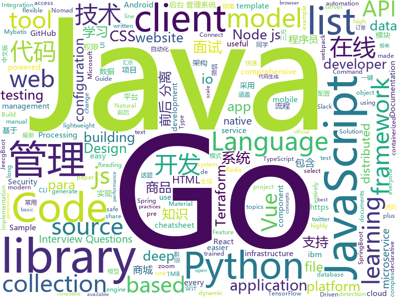

# 2019-11-07
See what the GitHub community is most excited about today.

## python
* [spleeter](https://github.com/deezer/spleeter)(**1,084 stars today**): Deezer source separation library including pretrained models.
* [gpt-2](https://github.com/openai/gpt-2)(**250 stars today**): Code for the paper "Language Models are Unsupervised Multitask Learners"
* [models](https://github.com/PaddlePaddle/models)(**19 stars today**): Pre-trained and Reproduced Deep Learning Models （『飞桨』官方模型库，包含多种学术前沿和工业场景验证的深度学习模型）
* [interview_internal_reference](https://github.com/0voice/interview_internal_reference)(**90 stars today**): 2019年最新总结，阿里，腾讯，百度，美团，头条等技术面试题目，以及答案，专家出题人分析汇总。
* [python](https://github.com/kubernetes-client/python)(**7 stars today**): Official Python client library for kubernetes
* [GNNs-for-NLP](https://github.com/svjan5/GNNs-for-NLP)(**41 stars today**): Graph Neural Networks for Natural Language Processing tutorial at EMNLP 2019
* [Ultra-Light-Fast-Generic-Face-Detector-1MB](https://github.com/Linzaer/Ultra-Light-Fast-Generic-Face-Detector-1MB)(**48 stars today**): 💎1MB lightweight face detection model (1MB轻量级人脸检测模型)
* [transformers](https://github.com/huggingface/transformers)(**104 stars today**): 🤗Transformers: State-of-the-art Natural Language Processing for TensorFlow 2.0 and PyTorch.
* [research-charnet](https://github.com/MalongTech/research-charnet)(**23 stars today**): CharNet: Convolutional Character Networks
* [perception](https://github.com/thorn-oss/perception)(**10 stars today**): Perceptual hashing tools for detecting child sexual abuse material
* [interpy-zh](https://github.com/eastlakeside/interpy-zh)(**49 stars today**): 📘《Python进阶》（Intermediate Python 中文版）
* [azure-cli](https://github.com/Azure/azure-cli)(**2 stars today**): Command-line tools for Azure.
* [django-rest-framework](https://github.com/encode/django-rest-framework)(**11 stars today**): Web APIs for Django.🎸
* [algo](https://github.com/wangzheng0822/algo)(**44 stars today**): 数据结构和算法必知必会的50个代码实现
* [marshmallow](https://github.com/marshmallow-code/marshmallow)(**1 stars today**): A lightweight library for converting complex objects to and from simple Python datatypes.
* [models](https://github.com/tensorflow/models)(**41 stars today**): Models and examples built with TensorFlow
* [ClamAV_0Day_exploit](https://github.com/momika233/ClamAV_0Day_exploit)(**21 stars today**): ClamAV_0Day_exploit
* [xlnet](https://github.com/zihangdai/xlnet)(**8 stars today**): XLNet: Generalized Autoregressive Pretraining for Language Understanding
* [ZEN](https://github.com/sinovation/ZEN)(**70 stars today**): A BERT-based Chinese Text Encoder Enhanced by N-gram Representations
* [DeepCTR](https://github.com/shenweichen/DeepCTR)(**47 stars today**): Easy-to-use,Modular and Extendible package of deep-learning based CTR models.
* [bert](https://github.com/google-research/bert)(**46 stars today**): TensorFlow code and pre-trained models for BERT
* [Python](https://github.com/geekcomputers/Python)(**51 stars today**): My Python Examples
* [hydra](https://github.com/facebookresearch/hydra)(**43 stars today**): Hydra is a framework for elegantly configuring complex applications
* [httpx](https://github.com/encode/httpx)(**18 stars today**): A next generation HTTP client for Python.🦋
* [pointnet2](https://github.com/charlesq34/pointnet2)(**5 stars today**): PointNet++: Deep Hierarchical Feature Learning on Point Sets in a Metric Space

## java
* [Jetpack-MVVM-Best-Practice](https://github.com/KunMinX/Jetpack-MVVM-Best-Practice)(**68 stars today**): 是 难得一见 的 Jetpack MVVM 最佳实践！在 蕴繁于简 的代码中，对 视图控制器 乃至 标准化开发模式 形成正确、深入的理解！
* [BigData-Notes](https://github.com/heibaiying/BigData-Notes)(**225 stars today**): 大数据入门指南⭐️
* [Java](https://github.com/TheAlgorithms/Java)(**88 stars today**): All Algorithms implemented in Java
* [CS-Notes](https://github.com/CyC2018/CS-Notes)(**171 stars today**): 📚技术面试必备基础知识、Leetcode、Java、C++、Python、后端面试、计算机操作系统、计算机网络、系统设计
* [selenium](https://github.com/SeleniumHQ/selenium)(**19 stars today**): A browser automation framework and ecosystem.
* [advanced-java](https://github.com/doocs/advanced-java)(**66 stars today**): 😮互联网 Java 工程师进阶知识完全扫盲：涵盖高并发、分布式、高可用、微服务等领域知识，后端同学必看，前端同学也可学习
* [eladmin](https://github.com/elunez/eladmin)(**55 stars today**): 项目基于 Spring Boot 2.1.0 、 Jpa、 Spring Security、redis、Vue的前后端分离的后台管理系统，项目采用分模块开发方式， 权限控制采用 RBAC，支持数据字典与数据权限管理，支持一键生成前后端代码，支持动态路由
* [retrofit](https://github.com/square/retrofit)(**16 stars today**): Type-safe HTTP client for Android and Java by Square, Inc.
* [jeecg-boot](https://github.com/zhangdaiscott/jeecg-boot)(**48 stars today**): 一款基于代码生成器的JAVA快速开发平台！采用最新技术，前后端分离架构：SpringBoot 2.x，Ant Design&Vue，Mybatis-plus，Shiro，JWT。强大的代码生成器让前后端代码一键生成，无需写任何代码，绝对是全栈开发福音！！ JeecgBoot的宗旨是提高UI能力的同时,降低前后分离的开发成本，JeecgBoot还独创在线开发模式，No代码概念，一系列在线智能开发：在线配置表单、在线配置报表、在线设计流程等等。
* [mall](https://github.com/macrozheng/mall)(**67 stars today**): mall项目是一套电商系统，包括前台商城系统及后台管理系统，基于SpringBoot+MyBatis实现。 前台商城系统包含首页门户、商品推荐、商品搜索、商品展示、购物车、订单流程、会员中心、客户服务、帮助中心等模块。 后台管理系统包含商品管理、订单管理、会员管理、促销管理、运营管理、内容管理、统计报表、财务管理、权限管理、设置等模块。
* [kafka-connect-jdbc](https://github.com/confluentinc/kafka-connect-jdbc)(**0 stars today**): Kafka Connect connector for JDBC-compatible databases
* [JavaGuide](https://github.com/Snailclimb/JavaGuide)(**144 stars today**): 【Java学习+面试指南】 一份涵盖大部分Java程序员所需要掌握的核心知识。
* [HanLP](https://github.com/hankcs/HanLP)(**171 stars today**): 自然语言处理 中文分词 词性标注 命名实体识别 依存句法分析 新词发现 关键词短语提取 自动摘要 文本分类聚类 拼音简繁
* [LintCode](https://github.com/awangdev/LintCode)(**14 stars today**): Java Solutions to problems on LintCode/LeetCode
* [thingsboard](https://github.com/thingsboard/thingsboard)(**5 stars today**): Open-source IoT Platform - Device management, data collection, processing and visualization.
* [Auto.js](https://github.com/hyb1996/Auto.js)(**106 stars today**): A UiAutomator on android, does not need root access(安卓平台上的JavaScript自动化工具)
* [spring-cloud-netflix](https://github.com/spring-cloud/spring-cloud-netflix)(**3 stars today**): Integration with Netflix OSS components
* [schema-registry](https://github.com/confluentinc/schema-registry)(**2 stars today**): Confluent Schema Registry for Kafka
* [flink](https://github.com/apache/flink)(**18 stars today**): Apache Flink
* [paascloud-master](https://github.com/paascloud/paascloud-master)(**28 stars today**): spring cloud + vue + oAuth2.0全家桶实战，前后端分离模拟商城，完整的购物流程、后端运营平台，可以实现快速搭建企业级微服务项目。支持微信登录等三方登录。
* [nacos](https://github.com/alibaba/nacos)(**29 stars today**): an easy-to-use dynamic service discovery, configuration and service management platform for building cloud native applications.
* [JCSprout](https://github.com/crossoverJie/JCSprout)(**23 stars today**): 👨‍🎓Java Core Sprout : basic, concurrent, algorithm
* [ksql](https://github.com/confluentinc/ksql)(**9 stars today**): KSQL - the Streaming SQL Engine for Apache Kafka
* [RIBs](https://github.com/uber/RIBs)(**2 stars today**): Uber's cross-platform mobile architecture framework.
* [configuration-as-code-plugin](https://github.com/jenkinsci/configuration-as-code-plugin)(**4 stars today**): Jenkins Configuration as Code Plugin

## unknown
* [fanhaodaquan](https://github.com/imfht/fanhaodaquan)(**208 stars today**): 番号大全。
* [the-book-of-secret-knowledge](https://github.com/trimstray/the-book-of-secret-knowledge)(**100 stars today**): A collection of inspiring lists, manuals, cheatsheets, blogs, hacks, one-liners, cli/web tools and more.
* [hacker-laws](https://github.com/dwmkerr/hacker-laws)(**95 stars today**): 💻📖Laws, Theories, Principles and Patterns that developers will find useful. #hackerlaws
* [few-shot-vid2vid](https://github.com/NVlabs/few-shot-vid2vid)(**47 stars today**): 
* [awesome-interview-questions](https://github.com/MaximAbramchuck/awesome-interview-questions)(**146 stars today**): A curated awesome list of lists of interview questions. Feel free to contribute!🎓
* [You-Dont-Know-JS](https://github.com/getify/You-Dont-Know-JS)(**72 stars today**): A book series on JavaScript. @YDKJS on twitter.
* [Specs](https://github.com/CocoaPods/Specs)(**4 stars today**): The CocoaPods Master Repo
* [coding-music](https://github.com/xaca/coding-music)(**0 stars today**): Buscamos crear listas en texto con los nombres de canciones organizadas por genero. Esta es una iniciativa para cuando necesites inspiración musical para programar.
* [gitignore](https://github.com/github/gitignore)(**53 stars today**): A collection of useful .gitignore templates
* [modern-cpp-features](https://github.com/AnthonyCalandra/modern-cpp-features)(**13 stars today**): A cheatsheet of modern C++ language and library features.
* [chromium](https://github.com/chromium/chromium)(**15 stars today**): The official GitHub mirror of the Chromium source
* [reverse-interview-zh](https://github.com/yifeikong/reverse-interview-zh)(**34 stars today**): 技术面试最后反问面试官的话
* [react-typescript-cheatsheet](https://github.com/typescript-cheatsheets/react-typescript-cheatsheet)(**44 stars today**): Cheatsheets for experienced React developers getting started with TypeScript
* [vagas](https://github.com/frontendbr/vagas)(**7 stars today**): 🔬Espaço para divulgação de vagas para front-enders.
* [new-grads-2020](https://github.com/cmackenzie1/new-grads-2020)(**1 stars today**): A collection of new grad roles for 2020
* [the-art-of-command-line](https://github.com/jlevy/the-art-of-command-line)(**38 stars today**): Master the command line, in one page
* [botframework](https://github.com/microsoft/botframework)(**5 stars today**): Microsoft BotFramework - A comprehensive framework for building enterprise-grade conversational AI experiences
* [Machine-Learning-Session](https://github.com/shuhuai007/Machine-Learning-Session)(**8 stars today**): 
* [OnJava8](https://github.com/LingCoder/OnJava8)(**16 stars today**): 《On Java 8》中文版，又名《Java编程思想》 第5版
* [arXivTimes](https://github.com/arXivTimes/arXivTimes)(**3 stars today**): repository to research & share the machine learning articles
* [PureCSS-Font](https://github.com/cyanharlow/PureCSS-Font)(**4 stars today**): For secrecy or CAPTCHA purposes: a customizable, scalable font made entirely of CSS and HTML, delivered in a single JS file.
* [technology-talk](https://github.com/aalansehaiyang/technology-talk)(**16 stars today**): 汇总java生态圈常用技术框架、开源中间件，系统架构、数据库、大公司架构案例、常用三方类库、项目管理、线上问题排查、个人成长、思考等知识
* [reactjs-interview-questions](https://github.com/sudheerj/reactjs-interview-questions)(**12 stars today**): List of top 500 ReactJS Interview Questions & Answers....Coding exercise questions are coming soon!!
* [javascript-testing-best-practices](https://github.com/goldbergyoni/javascript-testing-best-practices)(**29 stars today**): 📗🌐🚢Comprehensive and exhaustive JavaScript & Node.js testing best practices (August 2019)
* [deep_learning_object_detection](https://github.com/hoya012/deep_learning_object_detection)(**16 stars today**): A paper list of object detection using deep learning.

## javascript
* [relay-examples](https://github.com/relayjs/relay-examples)(**30 stars today**): A collection of sample Relay applications
* [react-query](https://github.com/tannerlinsley/react-query)(**515 stars today**): ⚛️Hooks for fetching, caching and updating asynchronous data in React
* [BullshitGenerator](https://github.com/menzi11/BullshitGenerator)(**363 stars today**): Needs to generate some texts to test if my GUI rendering codes good or not. so I made this.
* [selectize.js](https://github.com/selectize/selectize.js)(**12 stars today**): Selectize is the hybrid of a textbox and <select> box. It's jQuery based and it has autocomplete and native-feeling keyboard navigation; useful for tagging, contact lists, etc.
* [material-ui](https://github.com/mui-org/material-ui)(**43 stars today**): React components for faster and easier web development. Build your own design system, or start with Material Design.
* [33-js-concepts](https://github.com/leonardomso/33-js-concepts)(**26 stars today**): 📜33 concepts every JavaScript developer should know.
* [vue](https://github.com/vuejs/vue)(**103 stars today**): 🖖Vue.js is a progressive, incrementally-adoptable JavaScript framework for building UI on the web.
* [NeteaseCloudMusicApi](https://github.com/Binaryify/NeteaseCloudMusicApi)(**33 stars today**): 网易云音乐 Node.js API service
* [telegram-react](https://github.com/evgeny-nadymov/telegram-react)(**6 stars today**): Experimental Telegram web client with tdlib, webassembly and react js under the hood
* [wp-calypso](https://github.com/Automattic/wp-calypso)(**6 stars today**): The JavaScript and API powered WordPress.com
* [vee-validate](https://github.com/logaretm/vee-validate)(**6 stars today**): ✔ Template Driven Validation Framework for Vue.js
* [clean-code-javascript](https://github.com/ryanmcdermott/clean-code-javascript)(**53 stars today**): 🛁Clean Code concepts adapted for JavaScript
* [jsPDF](https://github.com/MrRio/jsPDF)(**29 stars today**): Client-side JavaScript PDF generation for everyone.
* [webpack-dev-server](https://github.com/webpack/webpack-dev-server)(**4 stars today**): Serves a webpack app. Updates the browser on changes. Documentation https://webpack.js.org/configuration/dev-server/.
* [Pos](https://github.com/NHadi/Pos)(**9 stars today**): Sample Application DDD, Reactive Microservices, CQRS Event Sourcing Powered by DERMAYON LIBRARY
* [history](https://github.com/ReactTraining/history)(**10 stars today**): Manage session history with JavaScript
* [BlockChain](https://github.com/itheima1/BlockChain)(**239 stars today**): 黑马程序员 120天全栈区块链开发 开源教程
* [pokemon-showdown](https://github.com/smogon/pokemon-showdown)(**6 stars today**): Pokémon battle simulator.
* [node](https://github.com/nodejs/node)(**36 stars today**): Node.js JavaScript runtime✨🐢🚀✨
* [appium](https://github.com/appium/appium)(**7 stars today**): 📱Automation for iOS, Android, and Windows Apps.
* [emotion](https://github.com/emotion-js/emotion)(**13 stars today**): 👩‍🎤CSS-in-JS library designed for high performance style composition
* [nodebestpractices](https://github.com/goldbergyoni/nodebestpractices)(**33 stars today**): ✅The largest Node.js best practices list (November 2019)
* [react](https://github.com/facebook/react)(**88 stars today**): A declarative, efficient, and flexible JavaScript library for building user interfaces.
* [sheetjs](https://github.com/SheetJS/sheetjs)(**24 stars today**): 📗SheetJS Community Edition -- Spreadsheet Data Toolkit
* [taobaoVisitingVenues](https://github.com/sleepybear1113/taobaoVisitingVenues)(**247 stars today**): 双十一活动自动化地操作淘宝浏览店铺得喵币脚本 for Android

## html
* [DevOps-Guide](https://github.com/Tikam02/DevOps-Guide)(**309 stars today**): DevOps Guide from basic to advanced with Interview Questions and Notes🔥
* [purecss-lace](https://github.com/cyanharlow/purecss-lace)(**30 stars today**): HTML/CSS drawing inspired by Flemish baroque oil portraits. Hand-coded entirely in HTML & CSS.
* [ecma262](https://github.com/tc39/ecma262)(**14 stars today**): Status, process, and documents for ECMA-262
* [swagger-codegen](https://github.com/swagger-api/swagger-codegen)(**14 stars today**): swagger-codegen contains a template-driven engine to generate documentation, API clients and server stubs in different languages by parsing your OpenAPI / Swagger definition.
* [quickstart-js](https://github.com/firebase/quickstart-js)(**0 stars today**): Firebase Quickstart Samples for Web
* [chosen](https://github.com/harvesthq/chosen)(**4 stars today**): Chosen is a library for making long, unwieldy select boxes more friendly.
* [typedoc](https://github.com/TypeStrong/typedoc)(**6 stars today**): Documentation generator for TypeScript projects.
* [owasp-mstg](https://github.com/OWASP/owasp-mstg)(**5 stars today**): The Mobile Security Testing Guide (MSTG) is a comprehensive manual for mobile app security development, testing and reverse engineering.
* [skill-map](https://github.com/TeamStuQ/skill-map)(**24 stars today**): 程序员技能图谱
* [cypress-example-kitchensink](https://github.com/cypress-io/cypress-example-kitchensink)(**3 stars today**): This is an example app used to showcase Cypress.io testing.
* [istio.io](https://github.com/istio/istio.io)(**4 stars today**): Source for the istio.io site
* [hoverboard](https://github.com/gdg-x/hoverboard)(**5 stars today**): Conference website template
* [fe4ml-zh](https://github.com/apachecn/fe4ml-zh)(**5 stars today**): 📖[译] 面向机器学习的特征工程
* [learning-area](https://github.com/mdn/learning-area)(**6 stars today**): Github repo for the MDN Learning Area.
* [flag-icon-css](https://github.com/lipis/flag-icon-css)(**3 stars today**): 🎏A collection of all country flags in SVG — plus the CSS for easier integration
* [3d-force-graph](https://github.com/vasturiano/3d-force-graph)(**0 stars today**): 3D force-directed graph component using ThreeJS/WebGL
* [MSEdgeExplainers](https://github.com/MicrosoftEdge/MSEdgeExplainers)(**2 stars today**): Home for explainer documents originated by the Microsoft Edge team
* [website](https://github.com/kubeflow/website)(**0 stars today**): Kubeflow's public website
* [hugo-academic](https://github.com/gcushen/hugo-academic)(**7 stars today**): 📝The website builder for Hugo. Build and deploy a beautiful website in minutes!
* [twemoji](https://github.com/twitter/twemoji)(**6 stars today**): Emoji for everyone. https://twemoji.twitter.com/
* [isotope](https://github.com/metafizzy/isotope)(**0 stars today**): 💞Filter & sort magical layouts
* [kryo](https://github.com/EsotericSoftware/kryo)(**2 stars today**): Java binary serialization and cloning: fast, efficient, automatic
* [MatBlazor](https://github.com/SamProf/MatBlazor)(**4 stars today**): Material Design components for Blazor and Razor Components
* [core](https://github.com/stackblitz/core)(**3 stars today**): Online IDE powered by Visual Studio Code⚡️
* [proposal-optional-chaining](https://github.com/tc39/proposal-optional-chaining)(**6 stars today**): 

## go
* [consul](https://github.com/hashicorp/consul)(**48 stars today**): Consul is a distributed, highly available, and data center aware solution to connect and configure applications across dynamic, distributed infrastructure.
* [night-reading-go](https://github.com/developer-learning/night-reading-go)(**32 stars today**): Night-Reading-Go《Go 夜读》 > Share the related technical topics of Go every week through zoom online live broadcast, every day on the WeChat/Slack to communicate programming technology topics. 每周通过 zoom 在线直播的方式分享 Go 相关的技术话题，每天大家在微信/Slack 上及时沟通交流编程技术话题。
* [go-micro](https://github.com/micro/go-micro)(**42 stars today**): A Go microservices development framework
* [vault](https://github.com/hashicorp/vault)(**14 stars today**): A tool for secrets management, encryption as a service, and privileged access management
* [terraform](https://github.com/hashicorp/terraform)(**24 stars today**): Terraform enables you to safely and predictably create, change, and improve infrastructure. It is an open source tool that codifies APIs into declarative configuration files that can be shared amongst team members, treated as code, edited, reviewed, and versioned.
* [spikeSystem](https://github.com/GuoZhaoran/spikeSystem)(**105 stars today**): 
* [nomad](https://github.com/hashicorp/nomad)(**7 stars today**): Nomad is an easy-to-use, flexible, and performant workload orchestrator that can deploy a mix of microservice, batch, containerized, and non-containerized applications. Nomad is easy to operate and scale and has native Consul and Vault integrations.
* [gorm](https://github.com/jinzhu/gorm)(**19 stars today**): The fantastic ORM library for Golang, aims to be developer friendly
* [fsnotify](https://github.com/fsnotify/fsnotify)(**3 stars today**): Cross-platform file system notifications for Go.
* [grpc-go](https://github.com/grpc/grpc-go)(**11 stars today**): The Go language implementation of gRPC. HTTP/2 based RPC
* [ffuf](https://github.com/ffuf/ffuf)(**43 stars today**): Fast web fuzzer written in Go
* [elastic](https://github.com/olivere/elastic)(**4 stars today**): Elasticsearch client for Go.
* [redis](https://github.com/go-redis/redis)(**5 stars today**): Type-safe Redis client for Golang
* [thanos](https://github.com/thanos-io/thanos)(**13 stars today**): Highly available Prometheus setup with long term storage capabilities. CNCF Sandbox project.
* [tidb](https://github.com/pingcap/tidb)(**37 stars today**): TiDB is an open source distributed HTAP database compatible with the MySQL protocol
* [excelize](https://github.com/360EntSecGroup-Skylar/excelize)(**10 stars today**): Golang library for reading and writing Microsoft Excel™ (XLSX) files.
* [terraform-provider-aws](https://github.com/terraform-providers/terraform-provider-aws)(**6 stars today**): Terraform AWS provider
* [httprouter](https://github.com/julienschmidt/httprouter)(**14 stars today**): A high performance HTTP request router that scales well
* [terragrunt](https://github.com/gruntwork-io/terragrunt)(**6 stars today**): Terragrunt is a thin wrapper for Terraform that provides extra tools for working with multiple Terraform modules.
* [go-git](https://github.com/src-d/go-git)(**18 stars today**): A highly extensible Git implementation in pure Go.
* [terratest](https://github.com/gruntwork-io/terratest)(**10 stars today**): Terratest is a Go library that makes it easier to write automated tests for your infrastructure code.
* [cron](https://github.com/robfig/cron)(**11 stars today**): a cron library for go
* [concourse](https://github.com/concourse/concourse)(**6 stars today**): Concourse is a container-based continuous thing-doer written in Go and Elm.
* [terraform-provider-ibm](https://github.com/IBM-Cloud/terraform-provider-ibm)(**1 stars today**): Terraform IBM provider https://ibm-cloud.github.io/tf-ibm-docs/v0.18.0/
* [cobra](https://github.com/spf13/cobra)(**45 stars today**): A Commander for modern Go CLI interactions

## WordCloud

