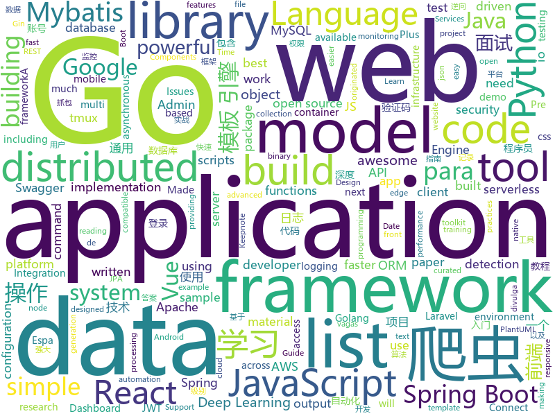

# 2019-11-08
See what the GitHub community is most excited about today.

## python
* [gpt-2](https://github.com/openai/gpt-2)(**204 stars today**): Code for the paper "Language Models are Unsupervised Multitask Learners"
* [gpt-2-output-dataset](https://github.com/openai/gpt-2-output-dataset)(**60 stars today**): Dataset of GPT-2 outputs for research in detection, biases, and more
* [pandas](https://github.com/pandas-dev/pandas)(**20 stars today**): Flexible and powerful data analysis / manipulation library for Python, providing labeled data structures similar to R data.frame objects, statistical functions, and much more
* [DeepCTR](https://github.com/shenweichen/DeepCTR)(**28 stars today**): Easy-to-use,Modular and Extendible package of deep-learning based CTR models.
* [spleeter](https://github.com/deezer/spleeter)(**721 stars today**): Deezer source separation library including pretrained models.
* [models](https://github.com/PaddlePaddle/models)(**82 stars today**): Pre-trained and Reproduced Deep Learning Models （『飞桨』官方模型库，包含多种学术前沿和工业场景验证的深度学习模型）
* [interview_internal_reference](https://github.com/0voice/interview_internal_reference)(**78 stars today**): 2019年最新总结，阿里，腾讯，百度，美团，头条等技术面试题目，以及答案，专家出题人分析汇总。
* [locust](https://github.com/locustio/locust)(**20 stars today**): Scalable user load testing tool written in Python
* [algo](https://github.com/wangzheng0822/algo)(**33 stars today**): 数据结构和算法必知必会的50个代码实现
* [sentry](https://github.com/getsentry/sentry)(**61 stars today**): Sentry is cross-platform application monitoring, with a focus on error reporting.
* [detectron2](https://github.com/facebookresearch/detectron2)(**80 stars today**): Detectron2 is FAIR's next-generation research platform for object detection and segmentation.
* [models](https://github.com/tensorflow/models)(**44 stars today**): Models and examples built with TensorFlow
* [GPT2-Chinese](https://github.com/Morizeyao/GPT2-Chinese)(**63 stars today**): Chinese version of GPT2 training code, using BERT tokenizer.
* [airflow](https://github.com/apache/airflow)(**13 stars today**): Apache Airflow
* [helm-charts](https://github.com/elastic/helm-charts)(**3 stars today**): You know, for Kubernetes
* [ntlm_challenger](https://github.com/b17zr/ntlm_challenger)(**19 stars today**): Parse NTLM over HTTP challenge messages
* [transformers](https://github.com/huggingface/transformers)(**78 stars today**): 🤗Transformers: State-of-the-art Natural Language Processing for TensorFlow 2.0 and PyTorch.
* [hydra](https://github.com/facebookresearch/hydra)(**19 stars today**): Hydra is a framework for elegantly configuring complex applications
* [ERNIE](https://github.com/PaddlePaddle/ERNIE)(**8 stars today**): An Implementation of ERNIE For Language Understanding (including Pre-training models and Fine-tuning tools)
* [learn_python3_spider](https://github.com/wistbean/learn_python3_spider)(**16 stars today**): python爬虫教程系列、从0到1学习python爬虫，包括浏览器抓包，手机APP抓包，如 fiddler、mitmproxy，各种爬虫涉及的模块的使用，如：requests、beautifulSoup、selenium、appium、scrapy等，以及IP代理，验证码识别，Mysql，MongoDB数据库的python使用，多线程多进程爬虫的使用，css 爬虫加密逆向破解，JS爬虫逆向，分布式爬虫，爬虫项目实战实例等
* [open_stt](https://github.com/snakers4/open_stt)(**3 stars today**): Russian open STT dataset
* [pytorch_geometric](https://github.com/rusty1s/pytorch_geometric)(**14 stars today**): Geometric Deep Learning Extension Library for PyTorch
* [compose](https://github.com/docker/compose)(**12 stars today**): Define and run multi-container applications with Docker
* [sigma](https://github.com/Neo23x0/sigma)(**2 stars today**): Generic Signature Format for SIEM Systems

## java
* [CS-Notes](https://github.com/CyC2018/CS-Notes)(**160 stars today**): 📚技术面试必备基础知识、Leetcode、Java、C++、Python、后端面试、计算机操作系统、计算机网络、系统设计
* [BigData-Notes](https://github.com/heibaiying/BigData-Notes)(**179 stars today**): 大数据入门指南⭐️
* [Jetpack-MVVM-Best-Practice](https://github.com/KunMinX/Jetpack-MVVM-Best-Practice)(**232 stars today**): 是 难得一见 的 Jetpack MVVM 最佳实践！在 蕴繁于简 的代码中，对 视图控制器 乃至 标准化开发模式 形成正确、深入的理解！
* [Java](https://github.com/TheAlgorithms/Java)(**134 stars today**): All Algorithms implemented in Java
* [springboot-socks](https://github.com/yizhiwazi/springboot-socks)(**34 stars today**): SpringBoot 基础教程 | 从入门到上瘾 | 基于2.0.0.M5制作
* [schema-registry](https://github.com/confluentinc/schema-registry)(**6 stars today**): Confluent Schema Registry for Kafka
* [ksql](https://github.com/confluentinc/ksql)(**8 stars today**): KSQL - the Streaming SQL Engine for Apache Kafka
* [spring-framework](https://github.com/spring-projects/spring-framework)(**28 stars today**): Spring Framework
* [Auto.js](https://github.com/hyb1996/Auto.js)(**125 stars today**): A UiAutomator on android, does not need root access(安卓平台上的JavaScript自动化工具)
* [servicetalk](https://github.com/apple/servicetalk)(**94 stars today**): A networking framework that evolves with your application
* [tutorials](https://github.com/eugenp/tutorials)(**23 stars today**): The "REST With Spring" Course:
* [JavaGuide](https://github.com/Snailclimb/JavaGuide)(**112 stars today**): 【Java学习+面试指南】 一份涵盖大部分Java程序员所需要掌握的核心知识。
* [javamelody](https://github.com/javamelody/javamelody)(**20 stars today**): JavaMelody : monitoring of JavaEE applications
* [spring-boot](https://github.com/spring-projects/spring-boot)(**51 stars today**): Spring Boot
* [kafka](https://github.com/apache/kafka)(**21 stars today**): Mirror of Apache Kafka
* [react-native-device-info](https://github.com/react-native-community/react-native-device-info)(**4 stars today**): Device Information for React Native iOS and Android
* [litemall](https://github.com/linlinjava/litemall)(**19 stars today**): 又一个小商城。litemall = Spring Boot后端 + Vue管理员前端 + 微信小程序用户前端 + Vue用户移动端
* [pentaho-kettle](https://github.com/pentaho/pentaho-kettle)(**7 stars today**): Pentaho Data Integration ( ETL ) a.k.a Kettle
* [swagger-core](https://github.com/swagger-api/swagger-core)(**2 stars today**): Examples and server integrations for generating the Swagger API Specification, which enables easy access to your REST API
* [antlr4](https://github.com/antlr/antlr4)(**12 stars today**): ANTLR (ANother Tool for Language Recognition) is a powerful parser generator for reading, processing, executing, or translating structured text or binary files.
* [karate](https://github.com/intuit/karate)(**3 stars today**): Test Automation Made Simple
* [spring-boot-demo](https://github.com/xkcoding/spring-boot-demo)(**27 stars today**): spring boot demo 是一个用来深度学习并实战 spring boot 的项目，目前总共包含 63 个集成demo，已经完成 52 个。 该项目已成功集成 actuator(监控)、admin(可视化监控)、logback(日志)、aopLog(通过AOP记录web请求日志)、统一异常处理(json级别和页面级别)、freemarker(模板引擎)、thymeleaf(模板引擎)、Beetl(模板引擎)、Enjoy(模板引擎)、JdbcTemplate(通用JDBC操作数据库)、JPA(强大的ORM框架)、mybatis(强大的ORM框架)、通用Mapper(快速操作Mybatis)、PageHelper(通用的Mybatis分页插件)、mybatis-plus(快速操作M…
* [incubator-shardingsphere](https://github.com/apache/incubator-shardingsphere)(**21 stars today**): Distributed database middleware
* [gs-spring-boot](https://github.com/spring-guides/gs-spring-boot)(**1 stars today**): Building an Application with Spring Boot :: Learn how to build an application with minimal configuration.
* [x-boot](https://github.com/Exrick/x-boot)(**33 stars today**): 基于Spring Boot 2.x的前后端分离开发平台X-Boot 前端：Vue+iView Admin 后端：Spring Boot 2.x/Spring Security/JWT/Spring Data JPA+Mybatis-Plus/Redis/Elasticsearch/Activiti 分布式限流/同步锁/验证码/SnowFlake雪花算法ID生成 动态权限管理 数据权限 工作流 代码生成 日志记录 定时任务 第三方社交账号、短信登录 单点登录

## unknown
* [fanhaodaquan](https://github.com/imfht/fanhaodaquan)(**389 stars today**): 番号大全。
* [best-practices-checklist](https://github.com/palash25/best-practices-checklist)(**26 stars today**): A list of awesome idiomatic code resources. Rust, Go, Erlang, Ruby, Pony and more
* [the-book-of-secret-knowledge](https://github.com/trimstray/the-book-of-secret-knowledge)(**140 stars today**): A collection of inspiring lists, manuals, cheatsheets, blogs, hacks, one-liners, cli/web tools and more.
* [haoel.github.io](https://github.com/haoel/haoel.github.io)(**343 stars today**): 
* [new-pac](https://github.com/Alvin9999/new-pac)(**50 stars today**): 科学/自由上网，免费ss/ssr/v2ray/goflyway账号，搭建教程
* [sec-chart](https://github.com/SecWiki/sec-chart)(**9 stars today**): 安全思维导图集合
* [Anime-Girls-Holding-Programming-Books](https://github.com/laynH/Anime-Girls-Holding-Programming-Books)(**10 stars today**): Anime Girls Holding Programming Books
* [hacker-laws](https://github.com/dwmkerr/hacker-laws)(**112 stars today**): 💻📖Laws, Theories, Principles and Patterns that developers will find useful. #hackerlaws
* [aws-modern-application-workshop](https://github.com/aws-samples/aws-modern-application-workshop)(**0 stars today**): A tutorial for developers that want to learn about how to build modern applications on top of AWS. You will build a sample website that leverages infrastructure as code, containers, serverless code functions, CI/CD, and more.
* [distributed-consensus-reading-list](https://github.com/heidi-ann/distributed-consensus-reading-list)(**12 stars today**): List of academic papers on distributed consensus
* [spec](https://github.com/oam-dev/spec)(**13 stars today**): The Open Application Model specification
* [Fuck-XueXiQiangGuo](https://github.com/fuck-xuexiqiangguo/Fuck-XueXiQiangGuo)(**16 stars today**): 学习强国 懒人刷分工具 自动学习
* [Specs](https://github.com/CocoaPods/Specs)(**6 stars today**): The CocoaPods Master Repo
* [deep_learning_object_detection](https://github.com/hoya012/deep_learning_object_detection)(**11 stars today**): A paper list of object detection using deep learning.
* [blog](https://github.com/brickspert/blog)(**3 stars today**): 个人技术博客，博文写在 Issues 里。
* [vagas](https://github.com/frontendbr/vagas)(**4 stars today**): 🔬Espaço para divulgação de vagas para front-enders.
* [heroicons-ui](https://github.com/sschoger/heroicons-ui)(**3 stars today**): 
* [Awesome-Crowd-Counting](https://github.com/gjy3035/Awesome-Crowd-Counting)(**3 stars today**): Awesome Crowd Counting
* [FE-interview](https://github.com/qiu-deqing/FE-interview)(**4 stars today**): 收集的前端面试题和答案
* [awesome-cli-apps](https://github.com/agarrharr/awesome-cli-apps)(**9 stars today**): 🖥📊🕹🛠A curated list of command line apps
* [awesome-pipeline](https://github.com/pditommaso/awesome-pipeline)(**3 stars today**): A curated list of awesome pipeline toolkits inspired by Awesome Sysadmin
* [C4-PlantUML](https://github.com/RicardoNiepel/C4-PlantUML)(**7 stars today**): C4-PlantUML combines the benefits of PlantUML and the C4 model for providing a simple way of describing and communicate software architectures
* [awesome-react-components](https://github.com/brillout/awesome-react-components)(**32 stars today**): Curated List of React Components & Libraries.
* [.tmux](https://github.com/gpakosz/.tmux)(**15 stars today**): 🇫🇷Oh My Tmux! Pretty & versatile tmux configuration made with❤️(imho the best tmux configuration that just works)
* [vagas](https://github.com/backend-br/vagas)(**7 stars today**): ✌️Espaço para divulgação de vagas para backenders

## javascript
* [react-query](https://github.com/tannerlinsley/react-query)(**305 stars today**): ⚛️Hooks for fetching, caching and updating asynchronous data in React
* [marktext](https://github.com/marktext/marktext)(**392 stars today**): 📝A simple and elegant markdown editor, available for Linux, macOS and Windows.
* [taobaoVisitingVenues](https://github.com/sleepybear1113/taobaoVisitingVenues)(**224 stars today**): 双十一活动自动化地操作淘宝浏览店铺得喵币脚本 for Android
* [d3](https://github.com/d3/d3)(**31 stars today**): Bring data to life with SVG, Canvas and HTML.📊📈🎉
* [suspense-experimental-github-demo](https://github.com/gaearon/suspense-experimental-github-demo)(**85 stars today**): Sample project built with Suspense to demonstrate render-as-you-fetch
* [WheelChair](https://github.com/hrt/WheelChair)(**2 stars today**): A nerfed piece of alien technology
* [material-ui](https://github.com/mui-org/material-ui)(**50 stars today**): React components for faster and easier web development. Build your own design system, or start with Material Design.
* [bpmn-js](https://github.com/bpmn-io/bpmn-js)(**8 stars today**): A BPMN 2.0 rendering toolkit and web modeler.
* [vxe-table](https://github.com/xuliangzhan/vxe-table)(**7 stars today**): 🐬一个简单实用的 Vue 表格组件
* [next.js](https://github.com/zeit/next.js)(**38 stars today**): The React Framework
* [javascript](https://github.com/airbnb/javascript)(**41 stars today**): JavaScript Style Guide
* [relay-examples](https://github.com/relayjs/relay-examples)(**64 stars today**): A collection of sample Relay applications
* [prettier](https://github.com/prettier/prettier)(**23 stars today**): Prettier is an opinionated code formatter.
* [bootstrap](https://github.com/twbs/bootstrap)(**44 stars today**): The most popular HTML, CSS, and JavaScript framework for developing responsive, mobile first projects on the web.
* [serverless](https://github.com/serverless/serverless)(**17 stars today**): Serverless Framework – Build web, mobile and IoT applications with serverless architectures using AWS Lambda, Azure Functions, Google CloudFunctions & more! –
* [daterangepicker](https://github.com/dangrossman/daterangepicker)(**5 stars today**): JavaScript Date Range, Date and Time Picker Component
* [grapesjs](https://github.com/artf/grapesjs)(**16 stars today**): Free and Open source Web Builder Framework. Next generation tool for building templates without coding
* [label-studio](https://github.com/heartexlabs/label-studio)(**22 stars today**): Label Studio is a multi-type data labeling and annotation tool with standardized output format
* [is-website-vulnerable](https://github.com/lirantal/is-website-vulnerable)(**15 stars today**): finds publicly known security vulnerabilities in a website's frontend JavaScript libraries
* [mongoose](https://github.com/Automattic/mongoose)(**7 stars today**): MongoDB object modeling designed to work in an asynchronous environment.
* [kbone](https://github.com/wechat-miniprogram/kbone)(**42 stars today**): Web 与小程序同构解决方案
* [relay](https://github.com/facebook/relay)(**36 stars today**): Relay is a JavaScript framework for building data-driven React applications.
* [nodebestpractices](https://github.com/goldbergyoni/nodebestpractices)(**37 stars today**): ✅The largest Node.js best practices list (November 2019)
* [axios](https://github.com/axios/axios)(**35 stars today**): Promise based HTTP client for the browser and node.js
* [react-native](https://github.com/facebook/react-native)(**37 stars today**): A framework for building native apps with React.

## html
* [DevOps-Guide](https://github.com/Tikam02/DevOps-Guide)(**252 stars today**): DevOps Guide from basic to advanced with Interview Questions and Notes🔥
* [portainer](https://github.com/portainer/portainer)(**13 stars today**): Making Docker management easy.
* [ctf-wiki](https://github.com/ctf-wiki/ctf-wiki)(**9 stars today**): CTF Wiki Online. Come and join us, we need you!
* [foundation-sites](https://github.com/foundation/foundation-sites)(**6 stars today**): The most advanced responsive front-end framework in the world. Quickly create prototypes and production code for sites that work on any kind of device.
* [swagger-codegen](https://github.com/swagger-api/swagger-codegen)(**9 stars today**): swagger-codegen contains a template-driven engine to generate documentation, API clients and server stubs in different languages by parsing your OpenAPI / Swagger definition.
* [chosen](https://github.com/harvesthq/chosen)(**2 stars today**): Chosen is a library for making long, unwieldy select boxes more friendly.
* [fastText](https://github.com/facebookresearch/fastText)(**11 stars today**): Library for fast text representation and classification.
* [professional-services](https://github.com/GoogleCloudPlatform/professional-services)(**1 stars today**): Common solutions and tools developed by Google Cloud's Professional Services team
* [DetectionLab](https://github.com/clong/DetectionLab)(**11 stars today**): Vagrant & Packer scripts to build a lab environment complete with security tooling and logging best practices
* [skill-map](https://github.com/TeamStuQ/skill-map)(**5 stars today**): 程序员技能图谱
* [laravel-roles](https://github.com/jeremykenedy/laravel-roles)(**2 stars today**): A Powerful package for handling roles and permissions in Laravel. Supports Laravel 5.3, 5.4, 5.5, 5.6, 5.7, 5.8, and 6.0
* [MSEdgeExplainers](https://github.com/MicrosoftEdge/MSEdgeExplainers)(**4 stars today**): Home for explainer documents originated by the Microsoft Edge team
* [istio.io](https://github.com/istio/istio.io)(**2 stars today**): Source for the istio.io site
* [cornerstone](https://github.com/bigcommerce/cornerstone)(**0 stars today**): The BigCommerce Cornerstone theme
* [styleguide](https://github.com/google/styleguide)(**15 stars today**): Style guides for Google-originated open-source projects
* [meu-primeiro-jogo-multiplayer](https://github.com/filipedeschamps/meu-primeiro-jogo-multiplayer)(**4 stars today**): Um jogo multiplayer bastante simples para testarmos o Socket.io
* [tiny-slider](https://github.com/ganlanyuan/tiny-slider)(**5 stars today**): Vanilla javascript slider for all purposes.
* [ai-deadlines](https://github.com/abhshkdz/ai-deadlines)(**4 stars today**): ⏰AI conference deadline countdowns
* [JavaScript30](https://github.com/wesbos/JavaScript30)(**14 stars today**): 30 Day Vanilla JS Challenge
* [cypress-example-kitchensink](https://github.com/cypress-io/cypress-example-kitchensink)(**0 stars today**): This is an example app used to showcase Cypress.io testing.
* [OSCPRepo](https://github.com/rewardone/OSCPRepo)(**2 stars today**): A list of commands, scripts, resources, and more that I have gathered and attempted to consolidate for use as OSCP (and more) study material. Commands in 'Usefulcommands' Keepnote. Bookmarks and reading material in 'BookmarkList' Keepnote. Reconscan in scripts folder.
* [kryo](https://github.com/EsotericSoftware/kryo)(**1 stars today**): Java binary serialization and cloning: fast, efficient, automatic
* [chilipie-kiosk](https://github.com/futurice/chilipie-kiosk)(**3 stars today**): Easy-to-use Raspberry Pi image for booting directly into full-screen Chrome, with built-in convenience features for unattended operation. Perfect for dashboards and build monitors.
* [serenity-core](https://github.com/serenity-bdd/serenity-core)(**0 stars today**): Serenity BDD is a test automation library designed to make writing automated acceptance tests easier, and more fun.
* [gentelella](https://github.com/ColorlibHQ/gentelella)(**9 stars today**): Free Bootstrap 4 Admin Dashboard Template

## go
* [spikeSystem](https://github.com/GuoZhaoran/spikeSystem)(**78 stars today**): 
* [elastic](https://github.com/olivere/elastic)(**12 stars today**): Elasticsearch client for Go.
* [consul](https://github.com/hashicorp/consul)(**43 stars today**): Consul is a distributed, highly available, and data center aware solution to connect and configure applications across dynamic, distributed infrastructure.
* [gorm](https://github.com/jinzhu/gorm)(**31 stars today**): The fantastic ORM library for Golang, aims to be developer friendly
* [vitess](https://github.com/vitessio/vitess)(**39 stars today**): Vitess is a database clustering system for horizontal scaling of MySQL.
* [tidb](https://github.com/pingcap/tidb)(**31 stars today**): TiDB is an open source distributed HTAP database compatible with the MySQL protocol
* [helmfile](https://github.com/roboll/helmfile)(**5 stars today**): Deploy Kubernetes Helm Charts
* [golangci-lint](https://github.com/golangci/golangci-lint)(**9 stars today**): Linters Runner for Go. 5x faster than gometalinter. Nice colored output. Can report only new issues. Fewer false-positives. Yaml/toml config.
* [gin](https://github.com/gin-gonic/gin)(**46 stars today**): Gin is a HTTP web framework written in Go (Golang). It features a Martini-like API with much better performance -- up to 40 times faster. If you need smashing performance, get yourself some Gin.
* [istio](https://github.com/istio/istio)(**40 stars today**): Connect, secure, control, and observe services.
* [m3](https://github.com/m3db/m3)(**24 stars today**): M3 monorepo - Distributed TSDB, Aggregator and Query Engine, Prometheus Sidecar, Graphite Compatible, Metrics Platform
* [logrus](https://github.com/sirupsen/logrus)(**19 stars today**): Structured, pluggable logging for Go.
* [protobuf](https://github.com/golang/protobuf)(**7 stars today**): Go support for Google's protocol buffers
* [dapr](https://github.com/dapr/dapr)(**68 stars today**): Dapr is a portable, event-driven, runtime for building distributed applications across cloud and edge.
* [gost](https://github.com/ginuerzh/gost)(**362 stars today**): GO Simple Tunnel - a simple tunnel written in golang
* [charts](https://github.com/helm/charts)(**27 stars today**): Curated applications for Kubernetes
* [mock](https://github.com/golang/mock)(**7 stars today**): GoMock is a mocking framework for the Go programming language.
* [cron](https://github.com/robfig/cron)(**17 stars today**): a cron library for go
* [jwt-go](https://github.com/dgrijalva/jwt-go)(**9 stars today**): Golang implementation of JSON Web Tokens (JWT)
* [aws-alb-ingress-controller](https://github.com/kubernetes-sigs/aws-alb-ingress-controller)(**3 stars today**): AWS ALB Ingress Controller for Kubernetes
* [helm](https://github.com/helm/helm)(**28 stars today**): The Kubernetes Package Manager
* [go-ethereum](https://github.com/ethereum/go-ethereum)(**27 stars today**): Official Go implementation of the Ethereum protocol
* [fsnotify](https://github.com/fsnotify/fsnotify)(**16 stars today**): Cross-platform file system notifications for Go.
* [go-micro](https://github.com/micro/go-micro)(**103 stars today**): A Go microservices development framework
* [mux](https://github.com/gorilla/mux)(**10 stars today**): A powerful HTTP router and URL matcher for building Go web servers with🦍

## WordCloud

