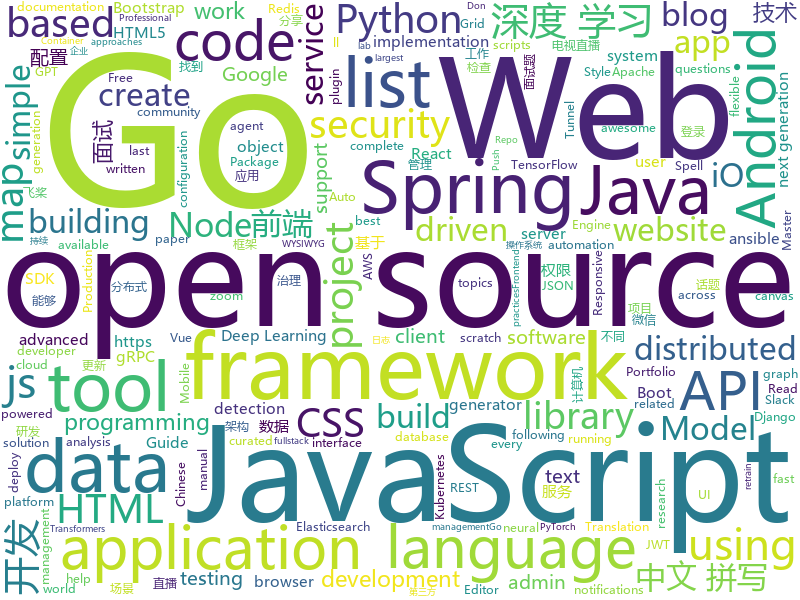

# 2019-11-09
See what the GitHub community is most excited about today.

## python
* [gpt-2](https://github.com/openai/gpt-2)(**271 stars today**): Code for the paper "Language Models are Unsupervised Multitask Learners"
* [gpt-2-output-dataset](https://github.com/openai/gpt-2-output-dataset)(**101 stars today**): Dataset of GPT-2 outputs for research in detection, biases, and more
* [FASPell](https://github.com/iqiyi/FASPell)(**129 stars today**): 产学界最强（SOTA）的简繁中文拼写检查工具：FASPell Chinese Spell Checker (Chinese Spell Check / 中文拼写检错 / 中文拼写纠错 / 中文拼写检查)
* [ansible](https://github.com/ansible/ansible)(**51 stars today**): Ansible is a radically simple IT automation platform that makes your applications and systems easier to deploy. Avoid writing scripts or custom code to deploy and update your applications — automate in a language that approaches plain English, using SSH, with no agents to install on remote systems. https://docs.ansible.com/ansible/
* [OUCML](https://github.com/OUCMachineLearning/OUCML)(**18 stars today**): 
* [d2l-zh](https://github.com/d2l-ai/d2l-zh)(**24 stars today**): 《动手学深度学习》：面向中文读者、能运行、可讨论。英文版即伯克利“深度学习导论”教材。
* [pytorch_geometric](https://github.com/rusty1s/pytorch_geometric)(**22 stars today**): Geometric Deep Learning Extension Library for PyTorch
* [GPT2-Chinese](https://github.com/Morizeyao/GPT2-Chinese)(**36 stars today**): Chinese version of GPT2 training code, using BERT tokenizer.
* [public-apis](https://github.com/public-apis/public-apis)(**103 stars today**): A collective list of free APIs for use in software and web development.
* [mmfashion](https://github.com/open-mmlab/mmfashion)(**14 stars today**): Open-source toolbox for visual fashion analysis based on PyTorch
* [locust](https://github.com/locustio/locust)(**19 stars today**): Scalable user load testing tool written in Python
* [aws-cdk-examples](https://github.com/aws-samples/aws-cdk-examples)(**2 stars today**): Example projects using the AWS CDK
* [pandas](https://github.com/pandas-dev/pandas)(**60 stars today**): Flexible and powerful data analysis / manipulation library for Python, providing labeled data structures similar to R data.frame objects, statistical functions, and much more
* [keras](https://github.com/keras-team/keras)(**20 stars today**): Deep Learning for humans
* [kamerka](https://github.com/woj-ciech/kamerka)(**6 stars today**): Build interactive map of cameras from Shodan
* [DetNAS](https://github.com/megvii-model/DetNAS)(**11 stars today**): 
* [CRAFT-pytorch](https://github.com/clovaai/CRAFT-pytorch)(**3 stars today**): Official implementation of Character Region Awareness for Text Detection (CRAFT)
* [gpt-2-simple](https://github.com/minimaxir/gpt-2-simple)(**8 stars today**): Python package to easily retrain OpenAI's GPT-2 text-generating model on new texts
* [transformers](https://github.com/huggingface/transformers)(**86 stars today**): 🤗Transformers: State-of-the-art Natural Language Processing for TensorFlow 2.0 and PyTorch.
* [Douyin-Bot](https://github.com/wangshub/Douyin-Bot)(**10 stars today**): 😍Python 抖音机器人，论如何在抖音上找到漂亮小姐姐？
* [OpenNMT-py](https://github.com/OpenNMT/OpenNMT-py)(**3 stars today**): Open Source Neural Machine Translation in PyTorch
* [keras-yolo3](https://github.com/qqwweee/keras-yolo3)(**16 stars today**): A Keras implementation of YOLOv3 (Tensorflow backend)
* [models](https://github.com/PaddlePaddle/models)(**50 stars today**): Pre-trained and Reproduced Deep Learning Models （『飞桨』官方模型库，包含多种学术前沿和工业场景验证的深度学习模型）
* [detectron2](https://github.com/facebookresearch/detectron2)(**54 stars today**): Detectron2 is FAIR's next-generation research platform for object detection and segmentation.
* [DialoGPT](https://github.com/microsoft/DialoGPT)(**44 stars today**): Large-scale pretraining for dialogue

## java
* [Jetpack-MVVM-Best-Practice](https://github.com/KunMinX/Jetpack-MVVM-Best-Practice)(**151 stars today**): 是 难得一见 的 Jetpack MVVM 最佳实践！在 蕴繁于简 的代码中，对 视图控制器 乃至 标准化开发模式 形成正确、深入的理解！
* [CS-Notes](https://github.com/CyC2018/CS-Notes)(**203 stars today**): 📚技术面试必备基础知识、Leetcode、Java、C++、Python、后端面试、计算机操作系统、计算机网络、系统设计
* [tutorials](https://github.com/eugenp/tutorials)(**25 stars today**): The "REST With Spring" Course:
* [apollo](https://github.com/ctripcorp/apollo)(**36 stars today**): Apollo（阿波罗）是携程框架部门研发的分布式配置中心，能够集中化管理应用不同环境、不同集群的配置，配置修改后能够实时推送到应用端，并且具备规范的权限、流程治理等特性，适用于微服务配置管理场景。
* [spring-boot](https://github.com/spring-projects/spring-boot)(**34 stars today**): Spring Boot
* [resilience4j](https://github.com/resilience4j/resilience4j)(**6 stars today**): Resilience4j is a fault tolerance library designed for Java8 and functional programming
* [redisson](https://github.com/redisson/redisson)(**12 stars today**): Redisson - Redis Java client with features of In-Memory Data Grid. Supports over 30 objects and services: Set, Multimap, SortedSet, Map, List, Queue, Deque, Semaphore, Lock, AtomicLong, Map Reduce, Publish / Subscribe, Bloom filter, Spring Cache, Tomcat, Scheduler, JCache API, Hibernate, RPC.
* [x-boot](https://github.com/Exrick/x-boot)(**25 stars today**): 基于Spring Boot 2.x的前后端分离开发平台X-Boot 前端：Vue+iView Admin 后端：Spring Boot 2.x/Spring Security/JWT/Spring Data JPA+Mybatis-Plus/Redis/Elasticsearch/Activiti 分布式限流/同步锁/验证码/SnowFlake雪花算法ID生成 动态权限管理 数据权限 工作流 代码生成 日志记录 定时任务 第三方社交账号、短信登录 单点登录
* [libgdx](https://github.com/libgdx/libgdx)(**13 stars today**): Desktop/Android/HTML5/iOS Java game development framework
* [DoraemonKit](https://github.com/didi/DoraemonKit)(**80 stars today**): 简称 "DoKit" 。一款功能齐全的客户端（ iOS 、Android、微信小程序 ）研发助手，你值得拥有。
* [quarkus](https://github.com/quarkusio/quarkus)(**24 stars today**): Quarkus: Supersonic Subatomic Java.
* [javamelody](https://github.com/javamelody/javamelody)(**13 stars today**): JavaMelody : monitoring of JavaEE applications
* [flink](https://github.com/apache/flink)(**27 stars today**): Apache Flink
* [AndroidUtilCode](https://github.com/Blankj/AndroidUtilCode)(**12 stars today**): 🔥Android developers should collect the following utils(updating).
* [selenium](https://github.com/SeleniumHQ/selenium)(**18 stars today**): A browser automation framework and ecosystem.
* [Java](https://github.com/TheAlgorithms/Java)(**89 stars today**): All Algorithms implemented in Java
* [BigData-Notes](https://github.com/heibaiying/BigData-Notes)(**135 stars today**): 大数据入门指南⭐️
* [strimzi-kafka-operator](https://github.com/strimzi/strimzi-kafka-operator)(**1 stars today**): Apache Kafka running on Kubernetes
* [servicetalk](https://github.com/apple/servicetalk)(**28 stars today**): A networking framework that evolves with your application
* [SpringCloud](https://github.com/zhoutaoo/SpringCloud)(**16 stars today**): 基于SpringCloud2.1的微服务开发脚手架，整合了spring-security-oauth2、nacos、feign、sentinel、springcloud-gateway等。服务治理方面引入elasticsearch、skywalking、springboot-admin、zipkin等，让项目开发快速进入业务开发，而不需过多时间花费在架构搭建上。持续更新中
* [jjwt](https://github.com/jwtk/jjwt)(**8 stars today**): Java JWT: JSON Web Token for Java and Android
* [ksql](https://github.com/confluentinc/ksql)(**10 stars today**): KSQL - the Streaming SQL Engine for Apache Kafka
* [janusgraph](https://github.com/JanusGraph/janusgraph)(**6 stars today**): JanusGraph: an open-source, distributed graph database
* [openapi-generator](https://github.com/OpenAPITools/openapi-generator)(**17 stars today**): OpenAPI Generator allows generation of API client libraries (SDK generation), server stubs, documentation and configuration automatically given an OpenAPI Spec (v2, v3)
* [HikariCP](https://github.com/brettwooldridge/HikariCP)(**14 stars today**): 光 HikariCP・A solid, high-performance, JDBC connection pool at last.

## unknown
* [haoel.github.io](https://github.com/haoel/haoel.github.io)(**201 stars today**): 
* [the-book-of-secret-knowledge](https://github.com/trimstray/the-book-of-secret-knowledge)(**113 stars today**): A collection of inspiring lists, manuals, cheatsheets, blogs, hacks, one-liners, cli/web tools and more.
* [Specs](https://github.com/CocoaPods/Specs)(**4 stars today**): The CocoaPods Master Repo
* [wtv](https://github.com/biancangming/wtv)(**8 stars today**): 解决电脑、手机看电视直播的苦恼，收集各种直播源，电视直播网站
* [awesome-android-ui](https://github.com/wasabeef/awesome-android-ui)(**7 stars today**): A curated list of awesome Android UI/UX libraries
* [Dancing2Music](https://github.com/NVlabs/Dancing2Music)(**32 stars today**): 
* [few-shot-vid2vid](https://github.com/NVlabs/few-shot-vid2vid)(**18 stars today**): 
* [GNNPapers](https://github.com/thunlp/GNNPapers)(**25 stars today**): Must-read papers on graph neural networks (GNN)
* [first-contributions](https://github.com/firstcontributions/first-contributions)(**30 stars today**): 🚀✨Help beginners to contribute to open source projects
* [css-modules](https://github.com/css-modules/css-modules)(**6 stars today**): Documentation about css-modules
* [url](https://github.com/baacloud/url)(**6 stars today**): Baacloud官网
* [Android-Daily-Interview](https://github.com/Moosphan/Android-Daily-Interview)(**15 stars today**): 📌每工作日更新一道 Android 面试题，小聚成河，大聚成江，共勉之～
* [recursive](https://github.com/arrowtype/recursive)(**49 stars today**): Recursive Mono & Sans is a variable font family for code & UI (work in progress!)
* [awesome-blazor](https://github.com/AdrienTorris/awesome-blazor)(**14 stars today**): Resources for Blazor, a .NET web framework using C#/Razor and HTML that runs in the browser with WebAssembly.
* [architect-awesome](https://github.com/xingshaocheng/architect-awesome)(**19 stars today**): 后端架构师技术图谱
* [from_coder_to_expert](https://github.com/0voice/from_coder_to_expert)(**15 stars today**): 2019年最新总结，从程序员到CTO，从专业走向卓越，分享大牛企业内部pdf与PPT
* [awesome-tailwindcss](https://github.com/aniftyco/awesome-tailwindcss)(**12 stars today**): A curated list of awesome things related to Tailwind CSS
* [web-interview](https://github.com/yisainan/web-interview)(**5 stars today**): 我是「齐丶先丶森」，公众号「前端面试秘籍」作者，收集整理全网面试题及面试技巧，旨在帮助前端工程师们找到一份好工作！
* [spec](https://github.com/oam-dev/spec)(**11 stars today**): The Open Application Model specification
* [you-dont-know-js-ru](https://github.com/azat-io/you-dont-know-js-ru)(**8 stars today**): 📚Russian translation of "You Don't Know JS" book series
* [javascript-questions](https://github.com/lydiahallie/javascript-questions)(**14 stars today**): A long list of (advanced) JavaScript questions, and their explanations✨
* [start-here-guidelines](https://github.com/zero-to-mastery/start-here-guidelines)(**1 stars today**): Guidelines on how this open source community works
* [community-meetups](https://github.com/innovationacademy-kr/community-meetups)(**22 stars today**): 한국에서 벌어지는 커뮤니티 행사들, by
* [The-Flask-Mega-Tutorial-zh](https://github.com/luhuisicnu/The-Flask-Mega-Tutorial-zh)(**4 stars today**): 翻译自Miguel Grinberg的blog https://blog.miguelgrinberg.com 的2017年新版The Flask Mega-Tutorial教程

## javascript
* [ARC](https://github.com/fchollet/ARC)(**43 stars today**): The Abstraction and Reasoning Corpus
* [marktext](https://github.com/marktext/marktext)(**253 stars today**): 📝A simple and elegant markdown editor, available for Linux, macOS and Windows.
* [nodebestpractices](https://github.com/goldbergyoni/nodebestpractices)(**73 stars today**): ✅The largest Node.js best practices list (November 2019)
* [react](https://github.com/facebook/react)(**71 stars today**): A declarative, efficient, and flexible JavaScript library for building user interfaces.
* [prettier](https://github.com/prettier/prettier)(**26 stars today**): Prettier is an opinionated code formatter.
* [openlayers](https://github.com/openlayers/openlayers)(**6 stars today**): OpenLayers
* [slick](https://github.com/kenwheeler/slick)(**15 stars today**): the last carousel you'll ever need
* [Auto.js_Projects](https://github.com/SuperMonster003/Auto.js_Projects)(**39 stars today**): 基于Auto.js的辅助工具项目 Auto.js-based assistant tools projects
* [lottie-web](https://github.com/airbnb/lottie-web)(**21 stars today**): Render After Effects animations natively on Web, Android and iOS, and React Native. http://airbnb.io/lottie/
* [relay](https://github.com/facebook/relay)(**19 stars today**): Relay is a JavaScript framework for building data-driven React applications.
* [prism](https://github.com/prism-rb/prism)(**54 stars today**): Build frontend web apps with Ruby and WebAssembly
* [wp-calypso](https://github.com/Automattic/wp-calypso)(**5 stars today**): The JavaScript and API powered WordPress.com
* [junior-recruit-scheduler](https://github.com/jojoldu/junior-recruit-scheduler)(**4 stars today**): 주니어 개발자 채용 정보
* [NeteaseCloudMusicApi](https://github.com/Binaryify/NeteaseCloudMusicApi)(**35 stars today**): 网易云音乐 Node.js API service
* [nuxt.js](https://github.com/nuxt/nuxt.js)(**28 stars today**): The Vue.js Framework
* [javascript](https://github.com/airbnb/javascript)(**42 stars today**): JavaScript Style Guide
* [Chart.js](https://github.com/chartjs/Chart.js)(**15 stars today**): Simple HTML5 Charts using the <canvas> tag
* [aws-sdk-js](https://github.com/aws/aws-sdk-js)(**5 stars today**): AWS SDK for JavaScript in the browser and Node.js
* [pixi.js](https://github.com/pixijs/pixi.js)(**10 stars today**): The HTML5 Creation Engine: Create beautiful digital content with the fastest, most flexible 2D WebGL renderer.
* [realworld](https://github.com/gothinkster/realworld)(**40 stars today**): "The mother of all demo apps" — Exemplary fullstack Medium.com clone powered by React, Angular, Node, Django, and many more🏅
* [grapesjs](https://github.com/artf/grapesjs)(**28 stars today**): Free and Open source Web Builder Framework. Next generation tool for building templates without coding
* [gatsby](https://github.com/gatsbyjs/gatsby)(**32 stars today**): Build blazing fast, modern apps and websites with React
* [scratch-gui](https://github.com/LLK/scratch-gui)(**11 stars today**): Graphical User Interface for creating and running Scratch 3.0 projects.
* [d3](https://github.com/d3/d3)(**38 stars today**): Bring data to life with SVG, Canvas and HTML.📊📈🎉
* [cesium](https://github.com/AnalyticalGraphicsInc/cesium)(**5 stars today**): An open-source JavaScript library for world-class 3D globes and maps🌎

## html
* [portainer](https://github.com/portainer/portainer)(**15 stars today**): Making Docker management easy.
* [bootstrap-multiselect](https://github.com/davidstutz/bootstrap-multiselect)(**2 stars today**): JQuery multiselect plugin based on Twitter Bootstrap.
* [book](https://github.com/PaddlePaddle/book)(**3 stars today**): Deep Learning 101 with PaddlePaddle （『飞桨』深度学习框架入门教程）
* [wysiwyg-editor](https://github.com/froala/wysiwyg-editor)(**2 stars today**): The next generation Javascript WYSIWYG HTML Editor.
* [foundation-sites](https://github.com/foundation/foundation-sites)(**5 stars today**): The most advanced responsive front-end framework in the world. Quickly create prototypes and production code for sites that work on any kind of device.
* [styleguide](https://github.com/google/styleguide)(**15 stars today**): Style guides for Google-originated open-source projects
* [DevOps-Guide](https://github.com/Tikam02/DevOps-Guide)(**91 stars today**): DevOps Guide from basic to advanced with Interview Questions and Notes🔥
* [embaixadoras](https://github.com/okfn-brasil/embaixadoras)(**2 stars today**): 
* [Django-CRM](https://github.com/MicroPyramid/Django-CRM)(**1 stars today**): Open Source Python CRM based on Django aimed to salesforce compatible for migrating to
* [PortFolio_Website](https://github.com/akashyap2013/PortFolio_Website)(**5 stars today**): Complete Portfolio Website with Bootstrap - HTML/CSS In this project, we are going to learn and build how to create a complete portfolio website with bootstrap using HTML and CSS. We will understand everything from scratch.
* [storytelling](https://github.com/mapbox/storytelling)(**7 stars today**): Storytelling with maps template
* [keep-a-changelog](https://github.com/olivierlacan/keep-a-changelog)(**3 stars today**): If you build software, keep a changelog.
* [professional-services](https://github.com/GoogleCloudPlatform/professional-services)(**2 stars today**): Common solutions and tools developed by Google Cloud's Professional Services team
* [personal-website](https://github.com/github/personal-website)(**8 stars today**): Code that'll help you kickstart a personal website that showcases your work as a software developer.
* [owasp-mstg](https://github.com/OWASP/owasp-mstg)(**8 stars today**): The Mobile Security Testing Guide (MSTG) is a comprehensive manual for mobile app security development, testing and reverse engineering.
* [technical-books](https://github.com/doocs/technical-books)(**12 stars today**): 😆国内外互联网技术大牛们都写了哪些书籍：计算机基础、网络、前端、后端、数据库、架构、大数据、深度学习...
* [telescope](https://github.com/Seneca-CDOT/telescope)(**0 stars today**): A tool for tracking blogs in orbit around Seneca's open source involvement
* [tiny-slider](https://github.com/ganlanyuan/tiny-slider)(**8 stars today**): Vanilla javascript slider for all purposes.
* [selfdefined](https://github.com/tatianamac/selfdefined)(**10 stars today**): Dictionary database with future API and bot integrations
* [DetectionLab](https://github.com/clong/DetectionLab)(**0 stars today**): Vagrant & Packer scripts to build a lab environment complete with security tooling and logging best practices
* [fem-layout](https://github.com/jen4web/fem-layout)(**0 stars today**): Frontend Masters: CSS Grids and Flexbox in Responsive Web Design workshop files
* [ecma262](https://github.com/tc39/ecma262)(**4 stars today**): Status, process, and documents for ECMA-262
* [pnotify](https://github.com/sciactive/pnotify)(**5 stars today**): Beautiful JavaScript notifications with Web Notifications support.
* [typedoc](https://github.com/TypeStrong/typedoc)(**3 stars today**): Documentation generator for TypeScript projects.
* [webcomponents](https://github.com/w3c/webcomponents)(**2 stars today**): Web Components specifications

## go
* [gost](https://github.com/ginuerzh/gost)(**156 stars today**): GO Simple Tunnel - a simple tunnel written in golang
* [terraform-provider-aws](https://github.com/terraform-providers/terraform-provider-aws)(**12 stars today**): Terraform AWS provider
* [go-micro](https://github.com/micro/go-micro)(**89 stars today**): A Go microservices development framework
* [aws-sdk-go](https://github.com/aws/aws-sdk-go)(**8 stars today**): AWS SDK for the Go programming language.
* [consul](https://github.com/hashicorp/consul)(**13 stars today**): Consul is a distributed, highly available, and data center aware solution to connect and configure applications across dynamic, distributed infrastructure.
* [fabric](https://github.com/hyperledger/fabric)(**25 stars today**): Read-only mirror of https://gerrit.hyperledger.org/r/#/admin/projects/fabric
* [night-reading-go](https://github.com/developer-learning/night-reading-go)(**27 stars today**): Night-Reading-Go《Go 夜读》 > Share the related technical topics of Go every week through zoom online live broadcast, every day on the WeChat/Slack to communicate programming technology topics. 每周通过 zoom 在线直播的方式分享 Go 相关的技术话题，每天大家在微信/Slack 上及时沟通交流编程技术话题。
* [kubernetes](https://github.com/kubernetes/kubernetes)(**44 stars today**): Production-Grade Container Scheduling and Management
* [go](https://github.com/golang/go)(**39 stars today**): The Go programming language
* [telegraf](https://github.com/influxdata/telegraf)(**9 stars today**): The plugin-driven server agent for collecting & reporting metrics.
* [grpc-gateway](https://github.com/grpc-ecosystem/grpc-gateway)(**31 stars today**): gRPC to JSON proxy generator following the gRPC HTTP spec
* [vitess](https://github.com/vitessio/vitess)(**36 stars today**): Vitess is a database clustering system for horizontal scaling of MySQL.
* [vault](https://github.com/hashicorp/vault)(**10 stars today**): A tool for secrets management, encryption as a service, and privileged access management
* [protobuf](https://github.com/golang/protobuf)(**4 stars today**): Go support for Google's protocol buffers
* [vulcain](https://github.com/dunglas/vulcain)(**44 stars today**): Use HTTP/2 Server Push to create fast and idiomatic client-driven REST APIs
* [hcl](https://github.com/hashicorp/hcl)(**5 stars today**): HCL is the HashiCorp configuration language.
* [mongo-go-driver](https://github.com/mongodb/mongo-go-driver)(**5 stars today**): The Go driver for MongoDB
* [mock](https://github.com/golang/mock)(**8 stars today**): GoMock is a mocking framework for the Go programming language.
* [govalidator](https://github.com/asaskevich/govalidator)(**6 stars today**): [Go] Package of validators and sanitizers for strings, numerics, slices and structs
* [community](https://github.com/kubernetes/community)(**13 stars today**): Kubernetes community content
* [grpc-go](https://github.com/grpc/grpc-go)(**9 stars today**): The Go language implementation of gRPC. HTTP/2 based RPC
* [dapr](https://github.com/dapr/dapr)(**38 stars today**): Dapr is a portable, event-driven, runtime for building distributed applications across cloud and edge.
* [flux](https://github.com/fluxcd/flux)(**20 stars today**): The GitOps Kubernetes operator
* [istio](https://github.com/istio/istio)(**31 stars today**): Connect, secure, control, and observe services.
* [k3s](https://github.com/rancher/k3s)(**25 stars today**): Lightweight Kubernetes. 5 less than k8s.

## WordCloud

