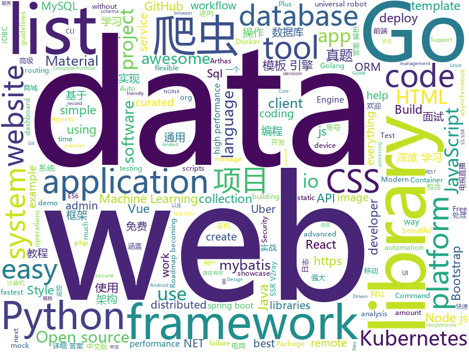

# 2019-11-10
See what the GitHub community is most excited about today.

## python
* [gpt-2-output-dataset](https://github.com/openai/gpt-2-output-dataset)(**63 stars today**): Dataset of GPT-2 outputs for research in detection, biases, and more
* [gpt-2](https://github.com/openai/gpt-2)(**127 stars today**): Code for the paper "Language Models are Unsupervised Multitask Learners"
* [DialoGPT](https://github.com/microsoft/DialoGPT)(**19 stars today**): Large-scale pretraining for dialogue
* [ansible](https://github.com/ansible/ansible)(**61 stars today**): Ansible is a radically simple IT automation platform that makes your applications and systems easier to deploy. Avoid writing scripts or custom code to deploy and update your applications — automate in a language that approaches plain English, using SSH, with no agents to install on remote systems. https://docs.ansible.com/ansible/
* [learn_python3_spider](https://github.com/wistbean/learn_python3_spider)(**10 stars today**): python爬虫教程系列、从0到1学习python爬虫，包括浏览器抓包，手机APP抓包，如 fiddler、mitmproxy，各种爬虫涉及的模块的使用，如：requests、beautifulSoup、selenium、appium、scrapy等，以及IP代理，验证码识别，Mysql，MongoDB数据库的python使用，多线程多进程爬虫的使用，css 爬虫加密逆向破解，JS爬虫逆向，分布式爬虫，爬虫项目实战实例等
* [CppCoreGuidelines](https://github.com/isocpp/CppCoreGuidelines)(**13 stars today**): The C++ Core Guidelines are a set of tried-and-true guidelines, rules, and best practices about coding in C++
* [Awesome-WAF](https://github.com/0xInfection/Awesome-WAF)(**17 stars today**): 🔥Everything awesome about web-application firewalls (WAF).
* [transformers](https://github.com/huggingface/transformers)(**58 stars today**): 🤗Transformers: State-of-the-art Natural Language Processing for TensorFlow 2.0 and PyTorch.
* [public-apis](https://github.com/public-apis/public-apis)(**36 stars today**): A collective list of free APIs for use in software and web development.
* [azure-cli](https://github.com/Azure/azure-cli)(**1 stars today**): Command-line tools for Azure.
* [my_first_calculator.py](https://github.com/AceLewis/my_first_calculator.py)(**382 stars today**): my_first_calculator.py
* [ml-agents](https://github.com/Unity-Technologies/ml-agents)(**12 stars today**): Unity Machine Learning Agents Toolkit
* [2019](https://github.com/pwn2winctf/2019)(**1 stars today**): Pwn2Win CTF 2019 platform client
* [interpy-zh](https://github.com/eastlakeside/interpy-zh)(**15 stars today**): 📘《Python进阶》（Intermediate Python 中文版）
* [SeleniumBase](https://github.com/seleniumbase/SeleniumBase)(**8 stars today**): ✅Easy Web Automation and Testing with Python.
* [compose](https://github.com/docker/compose)(**10 stars today**): Define and run multi-container applications with Docker
* [GPT2-Chinese](https://github.com/Morizeyao/GPT2-Chinese)(**15 stars today**): Chinese version of GPT2 training code, using BERT tokenizer.
* [stellargraph](https://github.com/stellargraph/stellargraph)(**6 stars today**): StellarGraph - Machine Learning on Graphs
* [optuna](https://github.com/pfnet/optuna)(**7 stars today**): A hyperparameter optimization framework
* [AiLearning](https://github.com/apachecn/AiLearning)(**38 stars today**): AiLearning: 机器学习 - MachineLearning - ML、深度学习 - DeepLearning - DL、自然语言处理 NLP
* [PayloadsAllTheThings](https://github.com/swisskyrepo/PayloadsAllTheThings)(**14 stars today**): A list of useful payloads and bypass for Web Application Security and Pentest/CTF
* [universal_robot](https://github.com/ros-industrial/universal_robot)(**1 stars today**): ROS-Industrial universal robot meta-package (http://wiki.ros.org/universal_robot)
* [mlflow](https://github.com/mlflow/mlflow)(**10 stars today**): Open source platform for the machine learning lifecycle
* [redash](https://github.com/getredash/redash)(**12 stars today**): Make Your Company Data Driven. Connect to any data source, easily visualize, dashboard and share your data.
* [pandas](https://github.com/pandas-dev/pandas)(**25 stars today**): Flexible and powerful data analysis / manipulation library for Python, providing labeled data structures similar to R data.frame objects, statistical functions, and much more

## java
* [CS-Notes](https://github.com/CyC2018/CS-Notes)(**55 stars today**): 📚技术面试必备基础知识、Leetcode、Java、C++、Python、后端面试、计算机操作系统、计算机网络、系统设计
* [DoraemonKit](https://github.com/didi/DoraemonKit)(**24 stars today**): 简称 "DoKit" 。一款功能齐全的客户端（ iOS 、Android、微信小程序 ）研发助手，你值得拥有。
* [tutorials](https://github.com/eugenp/tutorials)(**24 stars today**): The "REST With Spring" Course:
* [zuul](https://github.com/Netflix/zuul)(**7 stars today**): Zuul is a gateway service that provides dynamic routing, monitoring, resiliency, security, and more.
* [spring-boot-demo](https://github.com/xkcoding/spring-boot-demo)(**3 stars today**): spring boot demo 是一个用来深度学习并实战 spring boot 的项目，目前总共包含 63 个集成demo，已经完成 52 个。 该项目已成功集成 actuator(监控)、admin(可视化监控)、logback(日志)、aopLog(通过AOP记录web请求日志)、统一异常处理(json级别和页面级别)、freemarker(模板引擎)、thymeleaf(模板引擎)、Beetl(模板引擎)、Enjoy(模板引擎)、JdbcTemplate(通用JDBC操作数据库)、JPA(强大的ORM框架)、mybatis(强大的ORM框架)、通用Mapper(快速操作Mybatis)、PageHelper(通用的Mybatis分页插件)、mybatis-plus(快速操作M…
* [Hystrix](https://github.com/Netflix/Hystrix)(**7 stars today**): Hystrix is a latency and fault tolerance library designed to isolate points of access to remote systems, services and 3rd party libraries, stop cascading failure and enable resilience in complex distributed systems where failure is inevitable.
* [mantis](https://github.com/Netflix/mantis)(**111 stars today**): A platform that makes it easy for developers to build realtime, cost-effective, operations-focused applications
* [arthas](https://github.com/alibaba/arthas)(**15 stars today**): Alibaba Java Diagnostic Tool Arthas/Alibaba Java诊断利器Arthas
* [litemall](https://github.com/linlinjava/litemall)(**10 stars today**): 又一个小商城。litemall = Spring Boot后端 + Vue管理员前端 + 微信小程序用户前端 + Vue用户移动端
* [TubeMQ](https://github.com/Tencent/TubeMQ)(**19 stars today**): TubeMQ focuses on high-performance storage and transmission of massive data in big data scenarios
* [conductor](https://github.com/Netflix/conductor)(**1 stars today**): Conductor is a microservices orchestration engine - https://netflix.github.io/conductor/
* [lottie-android](https://github.com/airbnb/lottie-android)(**7 stars today**): Render After Effects animations natively on Android and iOS, Web, and React Native
* [springboot-socks](https://github.com/yizhiwazi/springboot-socks)(**1 stars today**): SpringBoot 基础教程 | 从入门到上瘾 | 基于2.0.0.M5制作
* [elasticsearch](https://github.com/elastic/elasticsearch)(**12 stars today**): Open Source, Distributed, RESTful Search Engine
* [spring-boot](https://github.com/spring-projects/spring-boot)(**47 stars today**): Spring Boot
* [gpmall](https://github.com/2227324689/gpmall)(**9 stars today**): 【咕泡学院实战项目】-基于SpringBoot+Dubbo构建的电商平台-微服务架构、商城、电商、微服务、高并发、kafka、Elasticsearch
* [nifi](https://github.com/apache/nifi)(**0 stars today**): Mirror of Apache NiFi
* [HikariCP](https://github.com/brettwooldridge/HikariCP)(**11 stars today**): 光 HikariCP・A solid, high-performance, JDBC connection pool at last.
* [debezium](https://github.com/debezium/debezium)(**4 stars today**): Change data capture for a variety of databases. https://debezium.io Please log issues in our JIRA at https://issues.jboss.org/projects/DBZ/issues
* [ksql](https://github.com/confluentinc/ksql)(**2 stars today**): KSQL - the Streaming SQL Engine for Apache Kafka
* [kubernetes-client](https://github.com/fabric8io/kubernetes-client)(**0 stars today**): Java client for Kubernetes & OpenShift
* [opentracing-tutorial](https://github.com/yurishkuro/opentracing-tutorial)(**0 stars today**): A collection of tutorials for the OpenTracing API
* [camunda-bpm-platform](https://github.com/camunda/camunda-bpm-platform)(**0 stars today**): Flexible framework for workflow and decision automation
* [react-native-push-notification](https://github.com/zo0r/react-native-push-notification)(**2 stars today**): React Native Local and Remote Notifications
* [netty](https://github.com/netty/netty)(**12 stars today**): Netty project - an event-driven asynchronous network application framework

## unknown
* [awesome-programming-books](https://github.com/jobbole/awesome-programming-books)(**71 stars today**): 经典编程书籍大全，涵盖：计算机系统与网络、系统架构、算法与数据结构、前端开发、后端开发、移动开发、数据库、测试、项目与团队、程序员职业修炼、求职面试等
* [free-programming-books-zh_CN](https://github.com/justjavac/free-programming-books-zh_CN)(**167 stars today**): 📚免费的计算机编程类中文书籍，欢迎投稿
* [awesome-dotnet](https://github.com/quozd/awesome-dotnet)(**12 stars today**): A collection of awesome .NET libraries, tools, frameworks and software
* [best-practices-checklist](https://github.com/palash25/best-practices-checklist)(**44 stars today**): A list of awesome idiomatic code resources. Rust, Go, Erlang, Ruby, Pony and more
* [javascript-questions](https://github.com/lydiahallie/javascript-questions)(**7 stars today**): A long list of (advanced) JavaScript questions, and their explanations✨
* [the-book-of-secret-knowledge](https://github.com/trimstray/the-book-of-secret-knowledge)(**55 stars today**): A collection of inspiring lists, manuals, cheatsheets, blogs, hacks, one-liners, cli/web tools and more.
* [community-meetups](https://github.com/innovationacademy-kr/community-meetups)(**9 stars today**): 한국에서 벌어지는 커뮤니티 행사들, by
* [system_architect](https://github.com/xxlllq/system_architect)(**2 stars today**): 💯高质量的系统架构设计师（软考高级）备考资源库，包含2009年-2018年综合知识（真题+详细答案解析）、案例分析（真题+详细答案解析）、论文（真题）、综合知识章节分类真题以及官方教材和整套教学视频。欢迎各位下载使用和指正错误，可加入QQ交流群(746552968)和群友讨论与学习。
* [starter-workflows](https://github.com/actions/starter-workflows)(**3 stars today**): Accelerating new GitHub Actions workflows
* [guide](https://github.com/uber-go/guide)(**25 stars today**): The Uber Go Style Guide.
* [teach_yourself_demoscene_in_14_days](https://github.com/psenough/teach_yourself_demoscene_in_14_days)(**23 stars today**): guidebook idea from http://www.pouet.net/topic.php?which=10882&page=1
* [first-contributions](https://github.com/firstcontributions/first-contributions)(**29 stars today**): 🚀✨Help beginners to contribute to open source projects
* [architecture_decision_record](https://github.com/joelparkerhenderson/architecture_decision_record)(**4 stars today**): Architecture decision record (ADR) examples for software planning, IT leadership, and template documenation
* [awesome-java](https://github.com/akullpp/awesome-java)(**11 stars today**): A curated list of awesome frameworks, libraries and software for the Java programming language.
* [Dancing2Music](https://github.com/NVlabs/Dancing2Music)(**5 stars today**): 
* [new-pac](https://github.com/Alvin9999/new-pac)(**33 stars today**): 科学/自由上网，免费ss/ssr/v2ray/goflyway账号，搭建教程
* [wtv](https://github.com/biancangming/wtv)(**40 stars today**): 解决电脑、手机看电视直播的苦恼，收集各种直播源，电视直播网站
* [awesome-vue](https://github.com/vuejs/awesome-vue)(**28 stars today**): 🎉A curated list of awesome things related to Vue.js
* [weekly](https://github.com/ruanyf/weekly)(**3 stars today**): 科技爱好者周刊，每周五发布
* [uber_go_guide_cn](https://github.com/xxjwxc/uber_go_guide_cn)(**7 stars today**): Uber Go 语言编码规范中文版. The Uber Go Style Guide .
* [kubernetes-the-hard-way](https://github.com/kelseyhightower/kubernetes-the-hard-way)(**14 stars today**): Bootstrap Kubernetes the hard way on Google Cloud Platform. No scripts.
* [AspNetCore-Developer-Roadmap](https://github.com/MoienTajik/AspNetCore-Developer-Roadmap)(**10 stars today**): Roadmap to becoming an ASP.NET Core developer in 2019
* [recursive](https://github.com/arrowtype/recursive)(**19 stars today**): Recursive Mono & Sans is a variable font family for code & UI (work in progress!)
* [Share-SSR-V2ray](https://github.com/selierlin/Share-SSR-V2ray)(**14 stars today**): 🃏Free SS/SSR/V2ray 免费分享节点账号信息网站

## javascript
* [ARC](https://github.com/fchollet/ARC)(**65 stars today**): The Abstraction and Reasoning Corpus
* [marktext](https://github.com/marktext/marktext)(**303 stars today**): 📝A simple and elegant markdown editor, available for Linux, macOS and Windows.
* [react-router](https://github.com/ReactTraining/react-router)(**16 stars today**): Declarative routing for React
* [quasar](https://github.com/quasarframework/quasar)(**14 stars today**): Quasar Framework - Build high-performance VueJS user interfaces in record time
* [Auto.js_Projects](https://github.com/SuperMonster003/Auto.js_Projects)(**8 stars today**): 基于Auto.js的辅助工具项目 Auto.js-based assistant tools projects
* [faker.js](https://github.com/Marak/faker.js)(**15 stars today**): generate massive amounts of realistic fake data in Node.js and the browser
* [slick](https://github.com/kenwheeler/slick)(**16 stars today**): the last carousel you'll ever need
* [prettier](https://github.com/prettier/prettier)(**26 stars today**): Prettier is an opinionated code formatter.
* [Leaflet](https://github.com/Leaflet/Leaflet)(**9 stars today**): 🍃JavaScript library for mobile-friendly interactive maps
* [react-query](https://github.com/tannerlinsley/react-query)(**138 stars today**): ⚛️Hooks for fetching, caching and updating asynchronous data in React
* [d3](https://github.com/d3/d3)(**21 stars today**): Bring data to life with SVG, Canvas and HTML.📊📈🎉
* [puppeteer](https://github.com/GoogleChrome/puppeteer)(**21 stars today**): Headless Chrome Node.js API
* [nanoid](https://github.com/ai/nanoid)(**24 stars today**): A tiny (139 bytes), secure, URL-friendly, unique string ID generator for JavaScript
* [sharp](https://github.com/lovell/sharp)(**56 stars today**): High performance Node.js image processing, the fastest module to resize JPEG, PNG, WebP and TIFF images. Uses the libvips library.
* [Sortable](https://github.com/SortableJS/Sortable)(**15 stars today**): Sortable — is a JavaScript library for reorderable drag-and-drop lists on modern browsers and touch devices. No jQuery required. Supports Meteor, AngularJS, React, Polymer, Vue, Ember, Knockout and any CSS library, e.g. Bootstrap.
* [react-developer-roadmap](https://github.com/adam-golab/react-developer-roadmap)(**12 stars today**): Roadmap to becoming a React developer in 2019
* [grapesjs](https://github.com/artf/grapesjs)(**14 stars today**): Free and Open source Web Builder Framework. Next generation tool for building templates without coding
* [vxe-table](https://github.com/xuliangzhan/vxe-table)(**1 stars today**): 🐬vxe-table 表格解决方案
* [styled-components](https://github.com/styled-components/styled-components)(**11 stars today**): Visual primitives for the component age. Use the best bits of ES6 and CSS to style your apps without stress💅
* [nodebestpractices](https://github.com/goldbergyoni/nodebestpractices)(**85 stars today**): ✅The largest Node.js best practices list (November 2019)
* [openlayers](https://github.com/openlayers/openlayers)(**5 stars today**): OpenLayers
* [tech-interview-handbook](https://github.com/yangshun/tech-interview-handbook)(**13 stars today**): 💯Materials to help you rock your next coding interview
* [date-fns](https://github.com/date-fns/date-fns)(**21 stars today**): ⏳Modern JavaScript date utility library⌛️
* [pixi.js](https://github.com/pixijs/pixi.js)(**18 stars today**): The HTML5 Creation Engine: Create beautiful digital content with the fastest, most flexible 2D WebGL renderer.
* [react-admin](https://github.com/marmelab/react-admin)(**10 stars today**): A frontend Framework for building admin applications running in the browser on top of REST/GraphQL APIs, using ES6, React and Material Design

## html
* [github-markdown-css](https://github.com/sindresorhus/github-markdown-css)(**2 stars today**): The minimal amount of CSS to replicate the GitHub Markdown style
* [cypress-example-kitchensink](https://github.com/cypress-io/cypress-example-kitchensink)(**1 stars today**): This is an example app used to showcase Cypress.io testing.
* [chart-doctor](https://github.com/ft-interactive/chart-doctor)(**3 stars today**): Sample files to accompany the FT's Chart Doctor column
* [Cerberus](https://github.com/TedGoas/Cerberus)(**1 stars today**): A few simple, but solid patterns for responsive HTML email templates and newsletters. Even in Outlook and Gmail.
* [PortFolio_Website](https://github.com/akashyap2013/PortFolio_Website)(**5 stars today**): Complete Portfolio Website with Bootstrap - HTML/CSS In this project, we are going to learn and build how to create a complete portfolio website with bootstrap using HTML and CSS. We will understand everything from scratch.
* [hugo-academic](https://github.com/gcushen/hugo-academic)(**3 stars today**): 📝The website builder for Hugo. Build and deploy a beautiful website in minutes!
* [nndl.github.io](https://github.com/nndl/nndl.github.io)(**8 stars today**): 《神经网络与深度学习》 邱锡鹏著 Neural Network and Deep Learning
* [Adminator-admin-dashboard](https://github.com/puikinsh/Adminator-admin-dashboard)(**2 stars today**): Adminator is a easy to use and well design admin dashboard template for web apps, websites, services and more
* [data-science-at-the-command-line](https://github.com/jeroenjanssens/data-science-at-the-command-line)(**1 stars today**): Data Science at the Command Line
* [simpl](https://github.com/samdutton/simpl)(**2 stars today**): Simplest possible examples of HTML, CSS and Javascript:
* [mkdocs-material](https://github.com/squidfunk/mkdocs-material)(**2 stars today**): A Material Design theme for MkDocs
* [selfdefined](https://github.com/tatianamac/selfdefined)(**3 stars today**): Dictionary database with future API and bot integrations
* [portainer](https://github.com/portainer/portainer)(**9 stars today**): Making Docker management easy.
* [foundation-sites](https://github.com/foundation/foundation-sites)(**2 stars today**): The most advanced responsive front-end framework in the world. Quickly create prototypes and production code for sites that work on any kind of device.
* [NGINX-Demos](https://github.com/nginxinc/NGINX-Demos)(**0 stars today**): NGINX and NGINX Plus demos
* [sql-formatter](https://github.com/jdorn/sql-formatter)(**4 stars today**): A lightweight php class for formatting sql statements. Handles automatic indentation and syntax highlighting.
* [personal-website](https://github.com/github/personal-website)(**3 stars today**): Code that'll help you kickstart a personal website that showcases your work as a software developer.
* [awesome-quantum-machine-learning](https://github.com/krishnakumarsekar/awesome-quantum-machine-learning)(**2 stars today**): Here you can get all the Quantum Machine learning Basics, Algorithms ,Study Materials ,Projects and the descriptions of the projects around the web
* [cs.sakaryauniversity](https://github.com/erbilnas/cs.sakaryauniversity)(**1 stars today**): Sakarya Üniversitesi'nde okuduğum süre boyunca karşıma çıkan tüm ödevler, ders notları ve çıkmış sınav soruları (All the assignments, lecture notes and exams)
* [snakemake](https://github.com/snakemake/snakemake)(**2 stars today**): This is the development home of the workflow management system Snakemake. For general information, see
* [twofactorauth](https://github.com/2factorauth/twofactorauth)(**2 stars today**): List of sites with two factor auth support which includes SMS, email, phone calls, hardware, and software.
* [fmriprep](https://github.com/poldracklab/fmriprep)(**1 stars today**): fMRIPrep is a robust and easy-to-use pipeline for preprocessing of diverse fMRI data. The transparent workflow dispenses of manual intervention, thereby ensuring the reproducibility of the results.
* [wpt](https://github.com/web-platform-tests/wpt)(**3 stars today**): Test suites for Web platform specs — including WHATWG, W3C, and others
* [git-it-electron](https://github.com/jlord/git-it-electron)(**3 stars today**): 💻🎓Git-it is a (Mac, Win, Linux) Desktop App for Learning Git and GitHub
* [web](https://github.com/OCA/web)(**0 stars today**): Odoo web client UI related addons

## go
* [helm](https://github.com/helm/helm)(**30 stars today**): The Kubernetes Package Manager
* [istio](https://github.com/istio/istio)(**40 stars today**): Connect, secure, control, and observe services.
* [advanced-go-programming-book](https://github.com/chai2010/advanced-go-programming-book)(**27 stars today**): 📚《Go语言高级编程》开源图书，涵盖CGO、Go汇编语言、RPC实现、Protobuf插件实现、Web框架实现、分布式系统等高阶主题(完稿)
* [charts](https://github.com/helm/charts)(**9 stars today**): Curated applications for Kubernetes
* [redis](https://github.com/go-redis/redis)(**7 stars today**): Type-safe Redis client for Golang
* [go-tools](https://github.com/dominikh/go-tools)(**22 stars today**): Staticcheck – a collection of static analysis tools for working with Go code
* [vitess](https://github.com/vitessio/vitess)(**10 stars today**): Vitess is a database clustering system for horizontal scaling of MySQL.
* [tutorials](https://github.com/micro-in-cn/tutorials)(**8 stars today**): Micro 中文示例、教程、资料，源码解读
* [client_golang](https://github.com/prometheus/client_golang)(**9 stars today**): Prometheus instrumentation library for Go applications
* [tidb](https://github.com/pingcap/tidb)(**28 stars today**): TiDB is an open source distributed HTAP database compatible with the MySQL protocol
* [gin](https://github.com/gin-gonic/gin)(**16 stars today**): Gin is a HTTP web framework written in Go (Golang). It features a Martini-like API with much better performance -- up to 40 times faster. If you need smashing performance, get yourself some Gin.
* [helmfile](https://github.com/roboll/helmfile)(**11 stars today**): Deploy Kubernetes Helm Charts
* [skaffold](https://github.com/GoogleContainerTools/skaffold)(**36 stars today**): Easy and Repeatable Kubernetes Development
* [viper](https://github.com/spf13/viper)(**12 stars today**): Go configuration with fangs
* [sqlboiler](https://github.com/volatiletech/sqlboiler)(**3 stars today**): Generate a Go ORM tailored to your database schema.
* [packr](https://github.com/gobuffalo/packr)(**10 stars today**): The simple and easy way to embed static files into Go binaries.
* [dns](https://github.com/miekg/dns)(**12 stars today**): DNS library in Go
* [lazydocker](https://github.com/jesseduffield/lazydocker)(**25 stars today**): The lazier way to manage everything docker
* [k9s](https://github.com/derailed/k9s)(**23 stars today**): 🐶Kubernetes CLI To Manage Your Clusters In Style!
* [gh-ost](https://github.com/github/gh-ost)(**62 stars today**): GitHub's Online Schema Migrations for MySQL
* [kops](https://github.com/kubernetes/kops)(**7 stars today**): Kubernetes Operations (kops) - Production Grade K8s Installation, Upgrades, and Management
* [aws-sdk-go](https://github.com/aws/aws-sdk-go)(**9 stars today**): AWS SDK for the Go programming language.
* [go-sqlmock](https://github.com/DATA-DOG/go-sqlmock)(**3 stars today**): Sql mock driver for golang to test database interactions
* [kaniko](https://github.com/GoogleContainerTools/kaniko)(**12 stars today**): Build Container Images In Kubernetes
* [testify](https://github.com/stretchr/testify)(**6 stars today**): A toolkit with common assertions and mocks that plays nicely with the standard library

## WordCloud

