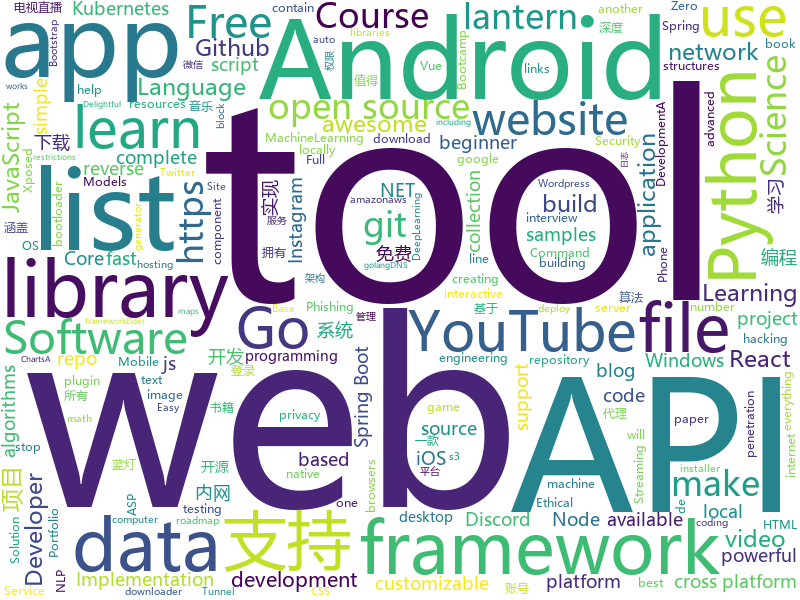

# 2019-11-11
See what the GitHub community is most excited about today.

## python
* [my_first_calculator.py](https://github.com/AceLewis/my_first_calculator.py)(**444 stars today**): my_first_calculator.py
* [gpt-2](https://github.com/openai/gpt-2)(**180 stars today**): Code for the paper "Language Models are Unsupervised Multitask Learners"
* [PhoneInfoga](https://github.com/sundowndev/PhoneInfoga)(**10 stars today**): Advanced information gathering & OSINT tool for phone numbers
* [instabot](https://github.com/instagrambot/instabot)(**11 stars today**): 🐙Free Instagram scripts, bots and Python API wrapper. Get free instagram followers with our auto like, auto follow and other scripts!
* [youtube-dl](https://github.com/ytdl-org/youtube-dl)(**71 stars today**): Command-line program to download videos from YouTube.com and other video sites
* [Douyin-Bot](https://github.com/wangshub/Douyin-Bot)(**12 stars today**): 😍Python 抖音机器人，论如何在抖音上找到漂亮小姐姐？
* [multi-agent-emergence-environments](https://github.com/openai/multi-agent-emergence-environments)(**7 stars today**): Environment generation code for the paper "Emergent Tool Use From Multi-Agent Autocurricula"
* [2019](https://github.com/pwn2winctf/2019)(**4 stars today**): Pwn2Win CTF 2019 platform client
* [optuna](https://github.com/pfnet/optuna)(**9 stars today**): A hyperparameter optimization framework
* [gpt-2-output-dataset](https://github.com/openai/gpt-2-output-dataset)(**92 stars today**): Dataset of GPT-2 outputs for research in detection, biases, and more
* [interactive-coding-challenges](https://github.com/donnemartin/interactive-coding-challenges)(**15 stars today**): 120+ interactive Python coding interview challenges (algorithms and data structures). Includes Anki flashcards.
* [AiLearning](https://github.com/apachecn/AiLearning)(**56 stars today**): AiLearning: 机器学习 - MachineLearning - ML、深度学习 - DeepLearning - DL、自然语言处理 NLP
* [code_snippets](https://github.com/CoreyMSchafer/code_snippets)(**13 stars today**): 
* [MNWeeklyCategory](https://github.com/rogerzhu/MNWeeklyCategory)(**84 stars today**): 码农周刊一周精选分类
* [PySyft](https://github.com/OpenMined/PySyft)(**15 stars today**): A library for encrypted, privacy preserving machine learning
* [streamlink](https://github.com/streamlink/streamlink)(**16 stars today**): CLI for extracting streams from various websites to a video player of your choosing
* [manim](https://github.com/3b1b/manim)(**45 stars today**): Animation engine for explanatory math videos
* [scikit-learn](https://github.com/scikit-learn/scikit-learn)(**31 stars today**): scikit-learn: machine learning in Python
* [faceswap](https://github.com/deepfakes/faceswap)(**31 stars today**): Deepfakes Software For All
* [ParlAI](https://github.com/facebookresearch/ParlAI)(**5 stars today**): A framework for training and evaluating AI models on a variety of openly available dialogue datasets.
* [home-assistant](https://github.com/home-assistant/home-assistant)(**64 stars today**): 🏡Open source home automation that puts local control and privacy first
* [tensorlayer](https://github.com/tensorlayer/tensorlayer)(**22 stars today**): Deep Learning and Reinforcement Learning Library for Scientists
* [yfinance](https://github.com/ranaroussi/yfinance)(**15 stars today**): Yahoo! Finance market data downloader (+faster Pandas Datareader)
* [word_cloud](https://github.com/amueller/word_cloud)(**18 stars today**): A little word cloud generator in Python
* [esptool](https://github.com/espressif/esptool)(**4 stars today**): ESP8266 and ESP32 serial bootloader utility

## java
* [resilience4j](https://github.com/resilience4j/resilience4j)(**31 stars today**): Resilience4j is a fault tolerance library designed for Java8 and functional programming
* [mantis](https://github.com/Netflix/mantis)(**174 stars today**): A platform that makes it easy for developers to build realtime, cost-effective, operations-focused applications
* [DoraemonKit](https://github.com/didi/DoraemonKit)(**141 stars today**): 简称 "DoKit" 。一款功能齐全的客户端（ iOS 、Android、微信小程序 ）研发助手，你值得拥有。
* [baritone](https://github.com/cabaletta/baritone)(**12 stars today**): google maps for block game
* [Telegram](https://github.com/DrKLO/Telegram)(**9 stars today**): Telegram for Android source
* [staffjoy](https://github.com/spring2go/staffjoy)(**10 stars today**): 微服务和云原生架构教学案例项目，基于Spring Boot和Kubernetes技术栈
* [interview](https://github.com/mission-peace/interview)(**11 stars today**): Interview questions
* [MinecraftForge](https://github.com/MinecraftForge/MinecraftForge)(**6 stars today**): Modifications to the Minecraft base files to assist in compatibility between mods.
* [Mindustry](https://github.com/Anuken/Mindustry)(**21 stars today**): A sandbox tower defense game
* [x-boot](https://github.com/Exrick/x-boot)(**35 stars today**): 基于Spring Boot 2.x的前后端分离开发平台X-Boot 前端：Vue+iView Admin 后端：Spring Boot 2.x/Spring Security/JWT/Spring Data JPA+Mybatis-Plus/Redis/Elasticsearch/Activiti 分布式限流/同步锁/验证码/SnowFlake雪花算法ID生成 动态权限管理 数据权限 工作流 代码生成 日志记录 定时任务 第三方社交账号、短信登录 单点登录
* [Apktool](https://github.com/iBotPeaches/Apktool)(**11 stars today**): A tool for reverse engineering Android apk files
* [api-samples](https://github.com/youtube/api-samples)(**9 stars today**): Code samples for YouTube APIs, including the YouTube Data API, YouTube Analytics API, and YouTube Live Streaming API. The repo contains language-specific directories that contain the samples.
* [Signal-Android](https://github.com/signalapp/Signal-Android)(**7 stars today**): A private messenger for Android.
* [libgdx](https://github.com/libgdx/libgdx)(**13 stars today**): Desktop/Android/HTML5/iOS Java game development framework
* [NetGuard](https://github.com/M66B/NetGuard)(**5 stars today**): A simple way to block access to the internet per application
* [android-developer-roadmap](https://github.com/MindorksOpenSource/android-developer-roadmap)(**5 stars today**): Android Developer Roadmap - A complete roadmap to learn Android App Development
* [maps](https://github.com/react-native-mapbox-gl/maps)(**1 stars today**): A Mapbox GL react native module for creating custom maps
* [ghidra](https://github.com/NationalSecurityAgency/ghidra)(**30 stars today**): Ghidra is a software reverse engineering (SRE) framework
* [EdXposed](https://github.com/ElderDrivers/EdXposed)(**15 stars today**): Elder driver Xposed Framework.
* [Algorithms](https://github.com/williamfiset/Algorithms)(**21 stars today**): A collection of algorithms and data structures
* [guava](https://github.com/google/guava)(**20 stars today**): Google core libraries for Java
* [antlr4](https://github.com/antlr/antlr4)(**13 stars today**): ANTLR (ANother Tool for Language Recognition) is a powerful parser generator for reading, processing, executing, or translating structured text or binary files.
* [megabasterd](https://github.com/tonikelope/megabasterd)(**10 stars today**): Yet another unofficial (and ugly) cross-platform MEGA downloader/uploader/streaming suite.
* [VirtualXposed](https://github.com/android-hacker/VirtualXposed)(**7 stars today**): A simple app to use Xposed without root, unlock the bootloader or modify system image, etc.
* [data-structures](https://github.com/williamfiset/data-structures)(**8 stars today**): A collection of powerful data structures

## unknown
* [awesome-programming-books](https://github.com/jobbole/awesome-programming-books)(**218 stars today**): 经典编程书籍大全，涵盖：计算机系统与网络、系统架构、算法与数据结构、前端开发、后端开发、移动开发、数据库、测试、项目与团队、程序员职业修炼、求职面试等
* [free-programming-books-zh_CN](https://github.com/justjavac/free-programming-books-zh_CN)(**346 stars today**): 📚免费的计算机编程类中文书籍，欢迎投稿
* [wtv](https://github.com/biancangming/wtv)(**83 stars today**): 解决电脑、手机看电视直播的苦恼，收集各种直播源，电视直播网站
* [free-programming-books](https://github.com/EbookFoundation/free-programming-books)(**65 stars today**): 📚Freely available programming books
* [Beginner-Network-Pentesting](https://github.com/hmaverickadams/Beginner-Network-Pentesting)(**18 stars today**): Notes for Beginner Network Pentesting Course
* [new-pac](https://github.com/Alvin9999/new-pac)(**63 stars today**): 科学/自由上网，免费ss/ssr/v2ray/goflyway账号，搭建教程
* [trackerslist](https://github.com/ngosang/trackerslist)(**117 stars today**): Updated list of public BitTorrent trackers
* [Data-Science--Cheat-Sheet](https://github.com/abhat222/Data-Science--Cheat-Sheet)(**52 stars today**): Cheat Sheets
* [PandaOCR](https://github.com/miaomiaosoft/PandaOCR)(**37 stars today**): PandaOCR - 图像字符云识别
* [Vulkan-Guide](https://github.com/KhronosGroup/Vulkan-Guide)(**77 stars today**): One stop shop for getting started with the Vulkan API
* [awesome](https://github.com/sindresorhus/awesome)(**130 stars today**): 😎Awesome lists about all kinds of interesting topics
* [StudyBook](https://github.com/changwookjun/StudyBook)(**10 stars today**): Study E-Book(ComputerVision DeepLearning MachineLearning Math NLP Python ReinforcementLearning)
* [cs-video-courses](https://github.com/Developer-Y/cs-video-courses)(**9 stars today**): List of Computer Science courses with video lectures.
* [awesome-nodejs](https://github.com/sindresorhus/awesome-nodejs)(**33 stars today**): ⚡️Delightful Node.js packages and resources
* [awesome-electron](https://github.com/sindresorhus/awesome-electron)(**13 stars today**): Useful resources for creating apps with Electron
* [awesome-dotnet](https://github.com/quozd/awesome-dotnet)(**51 stars today**): A collection of awesome .NET libraries, tools, frameworks and software
* [Android](https://github.com/open-android/Android)(**10 stars today**): GitHub上最火的Android开源项目,所有开源项目都有详细资料和配套视频
* [awesome-for-beginners](https://github.com/MunGell/awesome-for-beginners)(**51 stars today**): A list of awesome beginners-friendly projects.
* [Python-programming-exercises](https://github.com/zhiwehu/Python-programming-exercises)(**35 stars today**): 100+ Python challenging programming exercises
* [PENTESTING-BIBLE](https://github.com/blaCCkHatHacEEkr/PENTESTING-BIBLE)(**28 stars today**): This repository was created and developed by Ammar Amer @cry__pto Only. Updates to this repository will continue to arrive until the number of links reaches 10000 links & 10000 pdf files .Learn Ethical Hacking and penetration testing .hundreds of ethical hacking & penetration testing & red team & cyber security & computer science resources.
* [Xiaomi_Kernel_OpenSource](https://github.com/MiCode/Xiaomi_Kernel_OpenSource)(**8 stars today**): Xiaomi Mobile Phone Kernel OpenSource
* [api-guidelines](https://github.com/microsoft/api-guidelines)(**13 stars today**): Microsoft REST API Guidelines
* [first-contributions](https://github.com/firstcontributions/first-contributions)(**56 stars today**): 🚀✨Help beginners to contribute to open source projects
* [bootcamp-gostack-desafio-02](https://github.com/Rocketseat/bootcamp-gostack-desafio-02)(**4 stars today**): Desafio do segundo módulo do Bootcamp GoStack🚀👨🏻‍🚀
* [qwqjsq](https://github.com/qwqjsq/qwqjsq)(**6 stars today**): qwqjsq.com 的 最新地址

## javascript
* [freeCodeCamp](https://github.com/freeCodeCamp/freeCodeCamp)(**53 stars today**): The https://www.freeCodeCamp.org open source codebase and curriculum. Learn to code for free together with millions of people.
* [WheelChair](https://github.com/hrt/WheelChair)(**6 stars today**): Become a cripple, use a WheelChair
* [nodebestpractices](https://github.com/goldbergyoni/nodebestpractices)(**96 stars today**): ✅The largest Node.js best practices list (November 2019)
* [ARC](https://github.com/fchollet/ARC)(**92 stars today**): The Abstraction and Reasoning Corpus
* [edex-ui](https://github.com/GitSquared/edex-ui)(**25 stars today**): A cross-platform, customizable science fiction terminal emulator with advanced monitoring & touchscreen support.
* [discord.js](https://github.com/discordjs/discord.js)(**14 stars today**): A powerful JavaScript library for interacting with the Discord API
* [etcher](https://github.com/balena-io/etcher)(**23 stars today**): Flash OS images to SD cards & USB drives, safely and easily.
* [site-kit-wp](https://github.com/google/site-kit-wp)(**7 stars today**): Site Kit is a one-stop solution for WordPress users to use everything Google has to offer to make them successful on the web.
* [atom](https://github.com/atom/atom)(**23 stars today**): The hackable text editor
* [simplenote-electron](https://github.com/Automattic/simplenote-electron)(**10 stars today**): A Simplenote React app packaged via Electron for Windows and Linux
* [git-history](https://github.com/pomber/git-history)(**50 stars today**): Quickly browse the history of a file from any git repository
* [violentmonkey](https://github.com/violentmonkey/violentmonkey)(**4 stars today**): Violentmonkey provides userscripts support for browsers. It works on browsers with WebExtensions support.
* [Fantasy-Map-Generator](https://github.com/Azgaar/Fantasy-Map-Generator)(**4 stars today**): Web application generating interactive and customizable maps
* [Magnific-Popup](https://github.com/dimsemenov/Magnific-Popup)(**4 stars today**): Light and responsive lightbox script with focus on performance.
* [awesome-selfhosted](https://github.com/awesome-selfhosted/awesome-selfhosted)(**102 stars today**): A list of Free Software network services and web applications which can be hosted locally. Selfhosting is the process of hosting and managing applications instead of renting from Software-as-a-Service providers
* [BetterDiscordApp](https://github.com/Jiiks/BetterDiscordApp)(**4 stars today**): Better Discord App enhances Discord desktop app with new features.
* [react-native-largelist](https://github.com/bolan9999/react-native-largelist)(**19 stars today**): The best large list component for React Native.
* [Motrix](https://github.com/agalwood/Motrix)(**26 stars today**): A full-featured download manager.
* [gatsby](https://github.com/gatsbyjs/gatsby)(**48 stars today**): Build blazing fast, modern apps and websites with React
* [baseweb](https://github.com/uber/baseweb)(**21 stars today**): A React Component library implementing the Base design language
* [Boostnote](https://github.com/BoostIO/Boostnote)(**20 stars today**): A markdown editor for developers on Mac, Windows and Linux.
* [website](https://github.com/CodingTrain/website)(**7 stars today**): Coding Train website
* [udemy-docker-mastery](https://github.com/BretFisher/udemy-docker-mastery)(**9 stars today**): Udemy Course to build, compose, deploy, and manage containers from local development to high-availability in the cloud
* [samples](https://github.com/webrtc/samples)(**14 stars today**): WebRTC Web demos and samples
* [vue](https://github.com/vuejs/vue)(**95 stars today**): 🖖Vue.js is a progressive, incrementally-adoptable JavaScript framework for building UI on the web.

## html
* [awesome-piracy](https://github.com/Igglybuff/awesome-piracy)(**31 stars today**): A curated list of awesome warez and piracy links
* [PortFolio_Website](https://github.com/akashyap2013/PortFolio_Website)(**15 stars today**): Complete Portfolio Website with Bootstrap - HTML/CSS In this project, we are going to learn and build how to create a complete portfolio website with bootstrap using HTML and CSS. We will understand everything from scratch.
* [blog_os](https://github.com/phil-opp/blog_os)(**20 stars today**): Writing an OS in Rust
* [tools](https://github.com/googlecodelabs/tools)(**4 stars today**): Codelabs management & hosting tools
* [nndl.github.io](https://github.com/nndl/nndl.github.io)(**20 stars today**): 《神经网络与深度学习》 邱锡鹏著 Neural Network and Deep Learning
* [blackeye](https://github.com/thelinuxchoice/blackeye)(**2 stars today**): The most complete Phishing Tool, with 32 templates +1 customizable
* [CLRS](https://github.com/walkccc/CLRS)(**5 stars today**): 📚Solutions to Introduction to Algorithms Third Edition
* [twemoji](https://github.com/twitter/twemoji)(**5 stars today**): Emoji for everyone. https://twemoji.twitter.com/
* [fluxion](https://github.com/FluxionNetwork/fluxion)(**3 stars today**): Fluxion is a remake of linset by vk496 with less bugs and enhanced functionality.
* [JPProject.IdentityServer4.AdminUI](https://github.com/brunohbrito/JPProject.IdentityServer4.AdminUI)(**12 stars today**): 🔧ASP.NET Core 3 & Angular 8 Administration Panel for💞IdentityServer4 and ASP.NET Core Identity
* [dragon-book-exercise-answers](https://github.com/fool2fish/dragon-book-exercise-answers)(**16 stars today**): Compilers Principles, Techniques, & Tools (purple dragon book) second edition exercise answers. 编译原理（紫龙书）第2版习题答案。
* [learning-area](https://github.com/mdn/learning-area)(**11 stars today**): Github repo for the MDN Learning Area.
* [nodejs_wx_aipay_api](https://github.com/yioMe/nodejs_wx_aipay_api)(**4 stars today**): 微信支付宝个人免签收款Api系统，有了它对接再也不用担心我的业务不能支付了
* [hyperblog](https://github.com/freddier/hyperblog)(**6 stars today**): Un blog increíble para el curso de Git y Github de Platzi
* [datasciencecoursera](https://github.com/mGalarnyk/datasciencecoursera)(**7 stars today**): Data Science Repo and blog for John Hopkins Coursera Courses. Please let me know if you have any questions.
* [zfaka](https://github.com/zlkbdotnet/zfaka)(**25 stars today**): 免费、安全、稳定、高效的发卡系统，值得拥有!
* [skrollr](https://github.com/Prinzhorn/skrollr)(**5 stars today**): Stand-alone parallax scrolling library for mobile (Android + iOS) and desktop. No jQuery. Just plain JavaScript (and some love).
* [devcamper-api](https://github.com/bradtraversy/devcamper-api)(**4 stars today**): Backend for devcamper app
* [Keka](https://github.com/aonez/Keka)(**7 stars today**): The macOS file archiver
* [en.javascript.info](https://github.com/javascript-tutorial/en.javascript.info)(**16 stars today**): Modern JavaScript Tutorial
* [hugo-coder](https://github.com/luizdepra/hugo-coder)(**6 stars today**): A minimalist blog theme for hugo.
* [shellphish](https://github.com/thelinuxchoice/shellphish)(**3 stars today**): Phishing Tool for 18 social media: Instagram, Facebook, Snapchat, Github, Twitter, Yahoo, Protonmail, Spotify, Netflix, Linkedin, Wordpress, Origin, Steam, Microsoft, InstaFollowers, Gitlab, Pinterest
* [training-kit](https://github.com/github/training-kit)(**4 stars today**): Open source cheat sheets for Git and GitHub
* [Home-Assistant-Config](https://github.com/JamesMcCarthy79/Home-Assistant-Config)(**2 stars today**): Home Assistant Configuration & Documentation for my Smart House.
* [webdevbootcamp](https://github.com/nax3t/webdevbootcamp)(**4 stars today**): All source code for back-end projects from the Web Developer Bootcamp

## go
* [advanced-go-programming-book](https://github.com/chai2010/advanced-go-programming-book)(**52 stars today**): 📚《Go语言高级编程》开源图书，涵盖CGO、Go汇编语言、RPC实现、Protobuf插件实现、Web框架实现、分布式系统等高阶主题(完稿)
* [skaffold](https://github.com/GoogleContainerTools/skaffold)(**63 stars today**): Easy and Repeatable Kubernetes Development
* [go-micro](https://github.com/micro/go-micro)(**222 stars today**): A Go microservices development framework
* [mxget](https://github.com/winterssy/mxget)(**103 stars today**): 优雅的一站式音乐搜索、下载试听服务，支持国内所有音乐平台
* [frp](https://github.com/fatedier/frp)(**74 stars today**): A fast reverse proxy to help you expose a local server behind a NAT or firewall to the internet.
* [go-plugins](https://github.com/micro/go-plugins)(**9 stars today**): Community maintained plugins for micro
* [aws-sdk-go](https://github.com/aws/aws-sdk-go)(**13 stars today**): AWS SDK for the Go programming language.
* [caddy](https://github.com/caddyserver/caddy)(**44 stars today**): Fast, cross-platform HTTP/2 web server with automatic HTTPS
* [mkcert](https://github.com/FiloSottile/mkcert)(**120 stars today**): A simple zero-config tool to make locally trusted development certificates with any names you'd like.
* [kcptun](https://github.com/xtaci/kcptun)(**11 stars today**): A Stable & Secure Tunnel based on KCP with N:M multiplexing and FEC. Available for ARM, MIPS, 386 and AMD64
* [hub](https://github.com/github/hub)(**9 stars today**): A command-line tool that makes git easier to use with GitHub.
* [nps](https://github.com/cnlh/nps)(**32 stars today**): 一款轻量级、功能强大的内网穿透代理服务器。支持tcp、udp流量转发，支持内网http代理、内网socks5代理，同时支持snappy压缩、站点保护、加密传输、多路复用、header修改等。支持web图形化管理，集成多用户模式。
* [helmfile](https://github.com/roboll/helmfile)(**15 stars today**): Deploy Kubernetes Helm Charts
* [v2ray-core](https://github.com/v2ray/v2ray-core)(**51 stars today**): A platform for building proxies to bypass network restrictions.
* [lotus](https://github.com/filecoin-project/lotus)(**3 stars today**): Implementation of the Filecoin protocol, written in Go
* [OpenDiablo2](https://github.com/OpenDiablo2/OpenDiablo2)(**74 stars today**): An open source re-implementation of Diablo 2
* [gopsutil](https://github.com/shirou/gopsutil)(**7 stars today**): psutil for golang
* [dns](https://github.com/miekg/dns)(**17 stars today**): DNS library in Go
* [v2ray-plugin](https://github.com/shadowsocks/v2ray-plugin)(**7 stars today**): A SIP003 plugin based on v2ray
* [colly](https://github.com/gocolly/colly)(**13 stars today**): Elegant Scraper and Crawler Framework for Golang
* [clash](https://github.com/Dreamacro/clash)(**19 stars today**): A rule-based tunnel in Go.
* [lantern](https://github.com/getlantern/lantern)(**35 stars today**): 蓝灯Windows下载 https://s3.amazonaws.com/lantern/lantern-installer.exe 蓝灯安卓下载 https://s3.amazonaws.com/lantern/lantern-installer.apk
* [go-filecoin](https://github.com/filecoin-project/go-filecoin)(**3 stars today**): Filecoin Full Node Implementation in Go
* [k3sup](https://github.com/alexellis/k3sup)(**94 stars today**): k3sup: from Zero to KUBECONFIG in < 1 min
* [gh-ost](https://github.com/github/gh-ost)(**75 stars today**): GitHub's Online Schema Migrations for MySQL

## WordCloud

