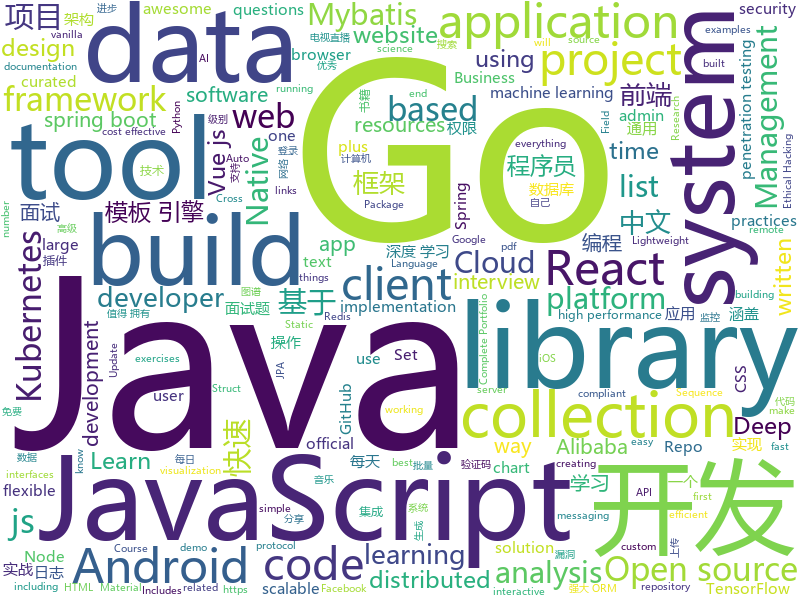

# 2019-11-13
See what the GitHub community is most excited about today.

## python
* [exercises](https://github.com/Softwarepark/exercises)(**43 stars today**): SoftwarePark exercises and dojos
* [my_first_calculator.py](https://github.com/AceLewis/my_first_calculator.py)(**197 stars today**): my_first_calculator.py
* [DeepFaceLab](https://github.com/iperov/DeepFaceLab)(**50 stars today**): DeepFaceLab is a tool that utilizes machine learning to replace faces in videos. Includes prebuilt ready to work standalone Windows 7,8,10 binary (look readme.md).
* [dbt](https://github.com/fishtown-analytics/dbt)(**7 stars today**): dbt (data build tool) enables data analysts and engineers to transform their data using the same practices that software engineers use to build applications.
* [fairseq](https://github.com/pytorch/fairseq)(**19 stars today**): Facebook AI Research Sequence-to-Sequence Toolkit written in Python.
* [pytorch_geometric](https://github.com/rusty1s/pytorch_geometric)(**13 stars today**): Geometric Deep Learning Extension Library for PyTorch
* [models](https://github.com/tensorflow/models)(**43 stars today**): Models and examples built with TensorFlow
* [system-design-primer](https://github.com/donnemartin/system-design-primer)(**133 stars today**): Learn how to design large-scale systems. Prep for the system design interview. Includes Anki flashcards.
* [ray](https://github.com/ray-project/ray)(**19 stars today**): A fast and simple framework for building and running distributed applications. Ray is packaged with RLlib, a scalable reinforcement learning library, and Tune, a scalable hyperparameter tuning library.
* [rasa](https://github.com/RasaHQ/rasa)(**12 stars today**): 💬Open source machine learning framework to automate text- and voice-based conversations: NLU, dialogue management, connect to Slack, Facebook, and more - Create chatbots and voice assistants
* [doccano](https://github.com/chakki-works/doccano)(**8 stars today**): Open source text annotation tool for machine learning practitioner.
* [detectron2](https://github.com/facebookresearch/detectron2)(**68 stars today**): Detectron2 is FAIR's next-generation research platform for object detection and segmentation.
* [CTFd](https://github.com/CTFd/CTFd)(**13 stars today**): CTFs as you need them
* [AttentionOCR](https://github.com/zhang0jhon/AttentionOCR)(**151 stars today**): Scene text recognition
* [dovpanda](https://github.com/dovpanda-dev/dovpanda)(**68 stars today**): Directions overlay for working with pandas in an analysis environment
* [GitHub-Chinese-Top-Charts](https://github.com/kon9chunkit/GitHub-Chinese-Top-Charts)(**100 stars today**): 🇨🇳GitHub中文排行榜，帮助你发现高分优秀中文项目、更高效地吸收国人的优秀经验成果；榜单每周更新一次，敬请关注！
* [Deep-Learning-with-TensorFlow-book](https://github.com/dragen1860/Deep-Learning-with-TensorFlow-book)(**320 stars today**): 深度学习开源书，基于TensorFlow 2.0实战。Open source Deep Learning book, based on TensorFlow 2.0 framework.
* [Lihang](https://github.com/SmirkCao/Lihang)(**17 stars today**): Statistical learning methods, 统计学习方法(第2版)[李航] [笔记, 代码, notebook, 参考文献, Errata, lihang]
* [incubator-mxnet](https://github.com/apache/incubator-mxnet)(**7 stars today**): Lightweight, Portable, Flexible Distributed/Mobile Deep Learning with Dynamic, Mutation-aware Dataflow Dep Scheduler; for Python, R, Julia, Scala, Go, Javascript and more
* [my_first_tic_tac_toe](https://github.com/asweigart/my_first_tic_tac_toe)(**19 stars today**): My first Tic Tac Toe program. I welcome any code reviews and pull requests!
* [odoo](https://github.com/odoo/odoo)(**18 stars today**): Odoo. Open Source Apps To Grow Your Business.
* [insightface](https://github.com/deepinsight/insightface)(**17 stars today**): Face Analysis Project on MXNet
* [taobao-tianmao-auto-buy](https://github.com/thelastleft-back/taobao-tianmao-auto-buy)(**6 stars today**): 淘宝/天猫秒杀抢购
* [tf-pose-estimation](https://github.com/ildoonet/tf-pose-estimation)(**8 stars today**): Deep Pose Estimation implemented using Tensorflow with Custom Architectures for fast inference.
* [image-segmentation-keras](https://github.com/divamgupta/image-segmentation-keras)(**5 stars today**): Implementation of Segnet, FCN, UNet , PSPNet and other models in Keras.

## java
* [DoraemonKit](https://github.com/didi/DoraemonKit)(**219 stars today**): 简称 "DoKit" 。一款功能齐全的客户端（ iOS 、Android、微信小程序 ）研发助手，你值得拥有。
* [Algorithms](https://github.com/williamfiset/Algorithms)(**11 stars today**): A collection of algorithms and data structures
* [kubernetes-client](https://github.com/fabric8io/kubernetes-client)(**2 stars today**): Java client for Kubernetes & OpenShift
* [JavaGuide](https://github.com/Snailclimb/JavaGuide)(**107 stars today**): 【Java学习+面试指南】 一份涵盖大部分Java程序员所需要掌握的核心知识。
* [mantis](https://github.com/Netflix/mantis)(**54 stars today**): A platform that makes it easy for developers to build realtime, cost-effective, operations-focused applications
* [resilience4j](https://github.com/resilience4j/resilience4j)(**40 stars today**): Resilience4j is a fault tolerance library designed for Java8 and functional programming
* [quarkus](https://github.com/quarkusio/quarkus)(**21 stars today**): Quarkus: Supersonic Subatomic Java.
* [x-boot](https://github.com/Exrick/x-boot)(**12 stars today**): 基于Spring Boot 2.x的前后端分离开发平台X-Boot 前端：Vue+iView Admin 后端：Spring Boot 2.x/Spring Security/JWT/Spring Data JPA+Mybatis-Plus/Redis/Elasticsearch/Activiti 分布式限流/同步锁/验证码/SnowFlake雪花算法ID生成 动态权限管理 数据权限 工作流 代码生成 日志记录 定时任务 第三方社交账号、短信登录 单点登录
* [AnyChart-Android](https://github.com/AnyChart/AnyChart-Android)(**10 stars today**): AnyChart Android Chart is an amazing data visualization library for easily creating interactive charts in Android apps. It runs on API 19+ (Android 4.4) and features dozens of built-in chart types.
* [java](https://github.com/kubernetes-client/java)(**2 stars today**): Official Java client library for kubernetes
* [react-native-push-notification](https://github.com/zo0r/react-native-push-notification)(**1 stars today**): React Native Local and Remote Notifications
* [maps](https://github.com/react-native-mapbox-gl/maps)(**0 stars today**): A Mapbox GL react native module for creating custom maps
* [DependencyCheck](https://github.com/jeremylong/DependencyCheck)(**4 stars today**): OWASP dependency-check is a software composition analysis utility that detects publicly disclosed vulnerabilities in application dependencies.
* [arthas](https://github.com/alibaba/arthas)(**37 stars today**): Alibaba Java Diagnostic Tool Arthas/Alibaba Java诊断利器Arthas
* [YCSB](https://github.com/brianfrankcooper/YCSB)(**5 stars today**): Yahoo! Cloud Serving Benchmark
* [pinpoint](https://github.com/naver/pinpoint)(**8 stars today**): APM, (Application Performance Management) tool for large-scale distributed systems written in Java.
* [eureka](https://github.com/Netflix/eureka)(**13 stars today**): AWS Service registry for resilient mid-tier load balancing and failover.
* [MVVMHabit](https://github.com/goldze/MVVMHabit)(**10 stars today**): 👕基于谷歌最新AAC架构，MVVM设计模式的一套快速开发库，整合Okhttp+RxJava+Retrofit+Glide等主流模块，满足日常开发需求。使用该框架可以快速开发一个高质量、易维护的Android应用。
* [thingsboard](https://github.com/thingsboard/thingsboard)(**3 stars today**): Open-source IoT Platform - Device management, data collection, processing and visualization.
* [spring-cloud-alibaba](https://github.com/alibaba/spring-cloud-alibaba)(**17 stars today**): Spring Cloud Alibaba provides a one-stop solution for application development for the distributed solutions of Alibaba middleware.
* [flowable-engine](https://github.com/flowable/flowable-engine)(**3 stars today**): A compact and highly efficient workflow and Business Process Management (BPM) platform for developers, system admins and business users.
* [data-structures](https://github.com/williamfiset/data-structures)(**3 stars today**): A collection of powerful data structures
* [shimmer-android](https://github.com/facebook/shimmer-android)(**7 stars today**): An easy, flexible way to add a shimmering effect to any view in an Android app.
* [spring-boot-demo](https://github.com/xkcoding/spring-boot-demo)(**40 stars today**): spring boot demo 是一个用来深度学习并实战 spring boot 的项目，目前总共包含 63 个集成demo，已经完成 52 个。 该项目已成功集成 actuator(监控)、admin(可视化监控)、logback(日志)、aopLog(通过AOP记录web请求日志)、统一异常处理(json级别和页面级别)、freemarker(模板引擎)、thymeleaf(模板引擎)、Beetl(模板引擎)、Enjoy(模板引擎)、JdbcTemplate(通用JDBC操作数据库)、JPA(强大的ORM框架)、mybatis(强大的ORM框架)、通用Mapper(快速操作Mybatis)、PageHelper(通用的Mybatis分页插件)、mybatis-plus(快速操作M…
* [dubbo](https://github.com/apache/dubbo)(**21 stars today**): Apache Dubbo is a high-performance, java based, open source RPC framework.

## unknown
* [Data-Science--Cheat-Sheet](https://github.com/abhat222/Data-Science--Cheat-Sheet)(**99 stars today**): Cheat Sheets
* [awesome-programming-books](https://github.com/jobbole/awesome-programming-books)(**314 stars today**): 经典编程书籍大全，涵盖：计算机系统与网络、系统架构、算法与数据结构、前端开发、后端开发、移动开发、数据库、测试、项目与团队、程序员职业修炼、求职面试等
* [Beginner-Network-Pentesting](https://github.com/hmaverickadams/Beginner-Network-Pentesting)(**80 stars today**): Notes for Beginner Network Pentesting Course
* [wtv](https://github.com/biancangming/wtv)(**137 stars today**): 解决电脑、手机看电视直播的苦恼，收集各种直播源，电视直播网站
* [PENTESTING-BIBLE](https://github.com/blaCCkHatHacEEkr/PENTESTING-BIBLE)(**73 stars today**): This repository was created and developed by Ammar Amer @cry__pto Only. Updates to this repository will continue to arrive until the number of links reaches 10000 links & 10000 pdf files .Learn Ethical Hacking and penetration testing .hundreds of ethical hacking & penetration testing & red team & cyber security & computer science resources.
* [free-programming-books](https://github.com/EbookFoundation/free-programming-books)(**128 stars today**): 📚Freely available programming books
* [project-based-learning](https://github.com/tuvtran/project-based-learning)(**72 stars today**): Curated list of project-based tutorials
* [free-programming-books-zh_CN](https://github.com/justjavac/free-programming-books-zh_CN)(**122 stars today**): 📚免费的计算机编程类中文书籍，欢迎投稿
* [from_coder_to_expert](https://github.com/0voice/from_coder_to_expert)(**58 stars today**): 2019年最新总结，从程序员到CTO，从专业走向卓越，分享大牛企业内部pdf与PPT
* [architect-awesome](https://github.com/xingshaocheng/architect-awesome)(**33 stars today**): 后端架构师技术图谱
* [react-cheatsheet](https://github.com/delprzemo/react-cheatsheet)(**17 stars today**): Set of basic functionalities from React in one place.
* [TheDeepDarkVideoManager](https://github.com/developerlala/TheDeepDarkVideoManager)(**14 stars today**): 
* [awesome-ida](https://github.com/xrkk/awesome-ida)(**203 stars today**): awesome IDA Pro resources collections. For Github Repos, extra info included: Star, Last Commit Time, Main Programming Language. Update Regularly!
* [Java-Interview](https://github.com/gzc426/Java-Interview)(**185 stars today**): Java 面试必会 直通BAT
* [BugTracker](https://github.com/checkra1n/BugTracker)(**12 stars today**): checkra1n bug tracker
* [kubernetes-the-hard-way](https://github.com/kelseyhightower/kubernetes-the-hard-way)(**23 stars today**): Bootstrap Kubernetes the hard way on Google Cloud Platform. No scripts.
* [real-world-javascript-interview-questions](https://github.com/RealToughCandy/real-world-javascript-interview-questions)(**27 stars today**): JavaScript questions that were asked at real job interviews.
* [CKAD-exercises](https://github.com/dgkanatsios/CKAD-exercises)(**8 stars today**): A set of exercises to prepare for Certified Kubernetes Application Developer exam by Cloud Native Computing Foundation
* [chromium](https://github.com/jjqqkk/chromium)(**17 stars today**): Chromium browser with SSL VPN. Use this browser to unblock websites.
* [Flutter-Course-Resources](https://github.com/londonappbrewery/Flutter-Course-Resources)(**6 stars today**): 
* [system-design-interview](https://github.com/checkcheckzz/system-design-interview)(**16 stars today**): System design interview for IT companies
* [awesome-grpc](https://github.com/grpc-ecosystem/awesome-grpc)(**23 stars today**): A curated list of useful resources for gRPC
* [OnJava8](https://github.com/LingCoder/OnJava8)(**36 stars today**): 《On Java 8》中文版，又名《Java编程思想》 第5版
* [awesome-pentest](https://github.com/enaqx/awesome-pentest)(**7 stars today**): A collection of awesome penetration testing resources, tools and other shiny things
* [awesome-vue](https://github.com/vuejs/awesome-vue)(**52 stars today**): 🎉A curated list of awesome things related to Vue.js

## javascript
* [33-js-concepts](https://github.com/leonardomso/33-js-concepts)(**97 stars today**): 📜33 concepts every JavaScript developer should know.
* [react-interactive-paycard](https://github.com/jasminmif/react-interactive-paycard)(**86 stars today**): Interactive React Paycard
* [vue-cli](https://github.com/vuejs/vue-cli)(**17 stars today**): 🛠️Standard Tooling for Vue.js Development
* [Daily-Interview-Question](https://github.com/Advanced-Frontend/Daily-Interview-Question)(**21 stars today**): 我是木易杨，公众号「高级前端进阶」作者，每天搞定一道前端大厂面试题，祝大家天天进步，一年后会看到不一样的自己。
* [react](https://github.com/facebook/react)(**61 stars today**): A declarative, efficient, and flexible JavaScript library for building user interfaces.
* [fe-interview](https://github.com/haizlin/fe-interview)(**37 stars today**): 前端面试每日 3+1，以面试题来驱动学习，提倡每日学习与思考，每天进步一点！每天早上5点纯手工发布面试题（死磕自己，愉悦大家）
* [GSAP](https://github.com/greensock/GSAP)(**23 stars today**): GreenSock's GSAP JavaScript animation library (including Draggable).
* [create-react-app](https://github.com/facebook/create-react-app)(**39 stars today**): Set up a modern web app by running one command.
* [material-components-web](https://github.com/material-components/material-components-web)(**8 stars today**): Modular and customizable Material Design UI components for the web
* [nuxt.js](https://github.com/nuxt/nuxt.js)(**29 stars today**): The Vue.js Framework
* [taro](https://github.com/NervJS/taro)(**33 stars today**): 多端统一开发框架，支持用 React 的开发方式编写一次代码，生成能运行在微信/百度/支付宝/字节跳动/ QQ 小程序、快应用、H5、React Native 等的应用。 https://taro.jd.com/
* [nodebestpractices](https://github.com/goldbergyoni/nodebestpractices)(**78 stars today**): ✅The largest Node.js best practices list (November 2019)
* [Auto.js_Projects](https://github.com/SuperMonster003/Auto.js_Projects)(**38 stars today**): 基于Auto.js的辅助工具项目 (蚂蚁森林) Auto.js-based assistant tools projects (Ant Forest)
* [tenko](https://github.com/pvdz/tenko)(**26 stars today**): An 100% spec compliant ES2020 JavaScript parser written in JS
* [lerna](https://github.com/lerna/lerna)(**23 stars today**): 🐉A tool for managing JavaScript projects with multiple packages.
* [cypress-example-recipes](https://github.com/cypress-io/cypress-example-recipes)(**5 stars today**): Various recipes for testing common scenarios with Cypress
* [next.js](https://github.com/zeit/next.js)(**45 stars today**): The React Framework
* [github-search](https://github.com/gwen001/github-search)(**5 stars today**): Tools to perform basic search on GitHub.
* [dash.js](https://github.com/Dash-Industry-Forum/dash.js)(**1 stars today**): A reference client implementation for the playback of MPEG DASH via Javascript and compliant browsers.
* [vue-router](https://github.com/vuejs/vue-router)(**6 stars today**): 🚦The official router for Vue.js.
* [freeCodeCamp](https://github.com/freeCodeCamp/freeCodeCamp)(**37 stars today**): The https://www.freeCodeCamp.org open source codebase and curriculum. Learn to code for free together with millions of people.
* [AnotherRedisDesktopManager](https://github.com/qishibo/AnotherRedisDesktopManager)(**26 stars today**): 🚀🚀🚀A faster, better and more stable redis desktop manager, compatible with Linux, windows, mac. What's more, it won't crash when loading a large number of keys.
* [quasar](https://github.com/quasarframework/quasar)(**19 stars today**): Quasar Framework - Build high-performance VueJS user interfaces in record time
* [braft-editor](https://github.com/margox/braft-editor)(**10 stars today**): 美观易用的React富文本编辑器，基于draft-js开发
* [faker.js](https://github.com/Marak/faker.js)(**24 stars today**): generate massive amounts of realistic fake data in Node.js and the browser

## html
* [datasciencecoursera](https://github.com/mGalarnyk/datasciencecoursera)(**4 stars today**): Data Science Repo and blog for John Hopkins Coursera Courses. Please let me know if you have any questions.
* [mxgraph](https://github.com/jgraph/mxgraph)(**37 stars today**): mxGraph is a fully client side JavaScript diagramming library
* [zfaka](https://github.com/zlkbdotnet/zfaka)(**1 stars today**): 免费、安全、稳定、高效的发卡系统，值得拥有!
* [Front-end-Developer-Interview-Questions](https://github.com/h5bp/Front-end-Developer-Interview-Questions)(**11 stars today**): A list of helpful front-end related questions you can use to interview potential candidates, test yourself or completely ignore.
* [node-js-getting-started](https://github.com/heroku/node-js-getting-started)(**1 stars today**): Getting Started with Node on Heroku
* [CLRS](https://github.com/walkccc/CLRS)(**6 stars today**): 📚Solutions to Introduction to Algorithms Third Edition
* [webdevbootcamp](https://github.com/nax3t/webdevbootcamp)(**2 stars today**): All source code for back-end projects from the Web Developer Bootcamp
* [flag-icon-css](https://github.com/lipis/flag-icon-css)(**2 stars today**): 🎏A collection of all country flags in SVG — plus the CSS for easier integration
* [embeddedsw](https://github.com/Xilinx/embeddedsw)(**0 stars today**): Xilinx Embedded Software (embeddedsw) Development
* [kongqi_laravel_admin](https://github.com/kong-qi/kongqi_laravel_admin)(**6 stars today**): 快速laravel后台管理系统，集成了，图片上传，多图上传，批量Excel导入，批量插入，修改，添加，搜索，权限管理RBAC,验证码，插件一个综合完善后台，助你开发快人一步。
* [nsfocus-rsas-knowledge-base](https://github.com/biggerwing/nsfocus-rsas-knowledge-base)(**8 stars today**): 绿盟科技漏洞扫描器(RSAS)漏洞库
* [rellax](https://github.com/dixonandmoe/rellax)(**6 stars today**): Lightweight, vanilla javascript parallax library
* [books](https://github.com/Thinkgamer/books)(**2 stars today**): 技术资料分享
* [Markdown-Resume](https://github.com/CyC2018/Markdown-Resume)(**3 stars today**): ⭐️Markdown 简历模版
* [aws-well-architected-labs](https://github.com/awslabs/aws-well-architected-labs)(**5 stars today**): Hands on labs and code to help you learn, measure, and build using architectural best practices.
* [tiny-slider](https://github.com/ganlanyuan/tiny-slider)(**6 stars today**): Vanilla javascript slider for all purposes.
* [skill-map](https://github.com/TeamStuQ/skill-map)(**10 stars today**): 程序员技能图谱
* [website](https://github.com/kubernetes/website)(**0 stars today**): Kubernetes website and documentation repo:
* [keep-a-changelog](https://github.com/olivierlacan/keep-a-changelog)(**7 stars today**): If you build software, keep a changelog.
* [compat-table](https://github.com/kangax/compat-table)(**2 stars today**): ECMAScript 5/6/7 compatibility tables
* [technical-books](https://github.com/doocs/technical-books)(**10 stars today**): 😆国内外互联网技术大牛们都写了哪些书籍：计算机基础、网络、前端、后端、数据库、架构、大数据、深度学习...
* [PortFolio_Website](https://github.com/akashyap2013/PortFolio_Website)(**7 stars today**): Complete Portfolio Website with Bootstrap - HTML/CSS In this project, we are going to learn and build how to create a complete portfolio website with bootstrap using HTML and CSS. We will understand everything from scratch.
* [dom-examples](https://github.com/mdn/dom-examples)(**0 stars today**): Code examples that accompany various MDN DOM and Web API documentation pages
* [flutter-in-action](https://github.com/flutterchina/flutter-in-action)(**8 stars today**): 《Flutter实战》电子书
* [ai-deadlines](https://github.com/abhshkdz/ai-deadlines)(**4 stars today**): ⏰AI conference deadline countdowns

## go
* [tfsec](https://github.com/liamg/tfsec)(**79 stars today**): 🔒🌍Static analysis powered security scanner for your terraform code
* [advanced-go-programming-book](https://github.com/chai2010/advanced-go-programming-book)(**74 stars today**): 📚《Go语言高级编程》开源图书，涵盖CGO、Go汇编语言、RPC实现、Protobuf插件实现、Web框架实现、分布式系统等高阶主题(完稿)
* [gotraining](https://github.com/ardanlabs/gotraining)(**9 stars today**): Go Training Class Material :
* [go-tools](https://github.com/dominikh/go-tools)(**17 stars today**): Staticcheck – a collection of static analysis tools for working with Go code
* [kubernetes](https://github.com/kubernetes/kubernetes)(**48 stars today**): Production-Grade Container Scheduling and Management
* [the-way-to-go_ZH_CN](https://github.com/unknwon/the-way-to-go_ZH_CN)(**118 stars today**): 《The Way to Go》中文译本，中文正式名《Go 入门指南》
* [lazydocker](https://github.com/jesseduffield/lazydocker)(**54 stars today**): The lazier way to manage everything docker
* [prometheus](https://github.com/prometheus/prometheus)(**31 stars today**): The Prometheus monitoring system and time series database.
* [minio-go](https://github.com/minio/minio-go)(**2 stars today**): MinIO Client SDK for Go
* [eksctl](https://github.com/weaveworks/eksctl)(**3 stars today**): The official CLI for Amazon EKS
* [mkcert](https://github.com/FiloSottile/mkcert)(**160 stars today**): A simple zero-config tool to make locally trusted development certificates with any names you'd like.
* [charts](https://github.com/helm/charts)(**24 stars today**): Curated applications for Kubernetes
* [skaffold](https://github.com/GoogleContainerTools/skaffold)(**276 stars today**): Easy and Repeatable Kubernetes Development
* [helm](https://github.com/helm/helm)(**20 stars today**): The Kubernetes Package Manager
* [dns](https://github.com/miekg/dns)(**11 stars today**): DNS library in Go
* [mxget](https://github.com/winterssy/mxget)(**21 stars today**): 优雅的一站式音乐搜索、下载试听服务，支持国内所有音乐平台
* [validator](https://github.com/go-playground/validator)(**10 stars today**): 💯Go Struct and Field validation, including Cross Field, Cross Struct, Map, Slice and Array diving
* [Amass](https://github.com/OWASP/Amass)(**7 stars today**): In-depth Attack Surface Mapping and Asset Discovery
* [chat](https://github.com/tinode/chat)(**7 stars today**): Instant messaging server; backend in Go; iOS, Android, web, command line clients; chatbots
* [nats-server](https://github.com/nats-io/nats-server)(**4 stars today**): High-Performance server for NATS, the cloud native messaging system.
* [protobuf](https://github.com/golang/protobuf)(**10 stars today**): Go support for Google's protocol buffers
* [grpc-go](https://github.com/grpc/grpc-go)(**12 stars today**): The Go language implementation of gRPC. HTTP/2 based RPC
* [lotus](https://github.com/filecoin-project/lotus)(**2 stars today**): Implementation of the Filecoin protocol, written in Go
* [viper](https://github.com/spf13/viper)(**9 stars today**): Go configuration with fangs
* [VictoriaMetrics](https://github.com/VictoriaMetrics/VictoriaMetrics)(**10 stars today**): VictoriaMetrics - high-performance, cost-effective and scalable time series database, long-term remote storage for Prometheus

## WordCloud

