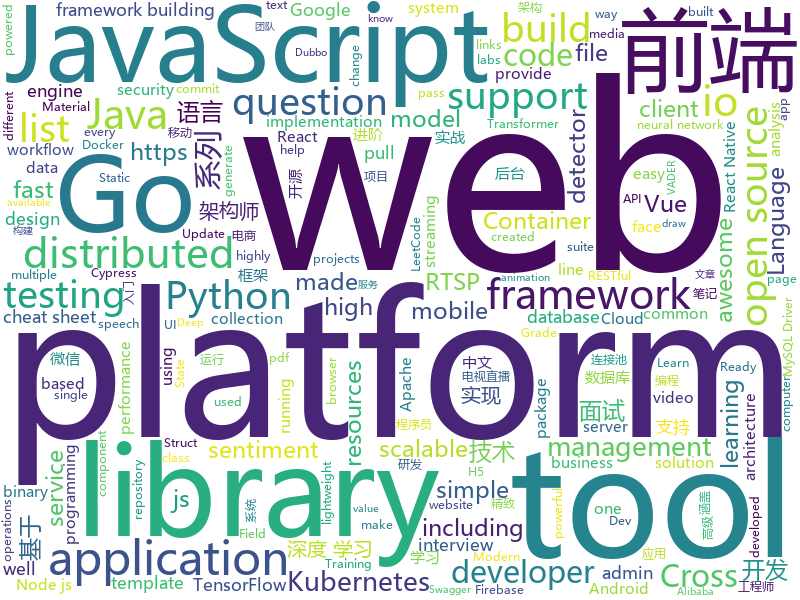

# 2019-11-14
See what the GitHub community is most excited about today.

## python
* [Real-Time-Voice-Cloning](https://github.com/CorentinJ/Real-Time-Voice-Cloning)(**589 stars today**): Clone a voice in 5 seconds to generate arbitrary speech in real-time
* [quay](https://github.com/quay/quay)(**580 stars today**): Build, Store, and Distribute your Applications and Containers
* [Deep-Learning-with-TensorFlow-book](https://github.com/dragen1860/Deep-Learning-with-TensorFlow-book)(**371 stars today**): 深度学习开源书，基于TensorFlow 2.0实战。Open source Deep Learning book, based on TensorFlow 2.0 framework.
* [python](https://github.com/kubernetes-client/python)(**6 stars today**): Official Python client library for kubernetes
* [SeleniumBase](https://github.com/seleniumbase/SeleniumBase)(**178 stars today**): ✅Easy Web Automation and Testing with Python.
* [c9-python-getting-started](https://github.com/microsoft/c9-python-getting-started)(**36 stars today**): Sample code for Channel 9 Python for Beginners course
* [Arjun](https://github.com/s0md3v/Arjun)(**35 stars today**): HTTP parameter discovery suite.
* [modin](https://github.com/modin-project/modin)(**49 stars today**): Modin: Speed up your Pandas workflows by changing a single line of code
* [DeepFaceLab](https://github.com/iperov/DeepFaceLab)(**62 stars today**): DeepFaceLab is a tool that utilizes machine learning to replace faces in videos. Includes prebuilt ready to work standalone Windows 7,8,10 binary (look readme.md).
* [exercises](https://github.com/Softwarepark/exercises)(**51 stars today**): SoftwarePark exercises and dojos
* [great_expectations](https://github.com/great-expectations/great_expectations)(**13 stars today**): Always know what to expect from your data.
* [CheatSheetSeries](https://github.com/OWASP/CheatSheetSeries)(**30 stars today**): The OWASP Cheat Sheet Series was created to provide a concise collection of high value information on specific application security topics.
* [black](https://github.com/psf/black)(**31 stars today**): The uncompromising Python code formatter
* [spack](https://github.com/spack/spack)(**6 stars today**): A flexible package manager that supports multiple versions, configurations, platforms, and compilers.
* [ray](https://github.com/ray-project/ray)(**33 stars today**): A fast and simple framework for building and running distributed applications. Ray is packaged with RLlib, a scalable reinforcement learning library, and Tune, a scalable hyperparameter tuning library.
* [SlowFast](https://github.com/facebookresearch/SlowFast)(**27 stars today**): PySlowFast: video understanding codebase from FAIR for reproducing state-of-the-art video models.
* [simpletransformers](https://github.com/ThilinaRajapakse/simpletransformers)(**12 stars today**): Transformers made simple with training, evaluation, and prediction possible with one line each. Currently supports Sequence Classification (binary, multiclass, multilabel), Token Classification (NER), and Question Answering. Built on top of the Hugging Face Transformer library.
* [A-Light-and-Fast-Face-Detector-for-Edge-Devices](https://github.com/YonghaoHe/A-Light-and-Fast-Face-Detector-for-Edge-Devices)(**9 stars today**): A light and fast one class detection framework for edge devices. We provide face detector, head detector, pedestrian detector, vehicle detector......
* [sentence-transformers](https://github.com/UKPLab/sentence-transformers)(**10 stars today**): Sentence Embeddings with BERT & XLNet
* [poetry](https://github.com/sdispater/poetry)(**35 stars today**): Python dependency management and packaging made easy.
* [seq2seq-couplet](https://github.com/wb14123/seq2seq-couplet)(**77 stars today**): Play couplet with seq2seq model. 用深度学习对对联。
* [vaderSentiment](https://github.com/cjhutto/vaderSentiment)(**6 stars today**): VADER Sentiment Analysis. VADER (Valence Aware Dictionary and sEntiment Reasoner) is a lexicon and rule-based sentiment analysis tool that is specifically attuned to sentiments expressed in social media, and works well on texts from other domains.
* [tacotron](https://github.com/keithito/tacotron)(**18 stars today**): A TensorFlow implementation of Google's Tacotron speech synthesis with pre-trained model (unofficial)
* [ImageAI](https://github.com/OlafenwaMoses/ImageAI)(**11 stars today**): A python library built to empower developers to build applications and systems with self-contained Computer Vision capabilities
* [gpt2-ml](https://github.com/imcaspar/gpt2-ml)(**28 stars today**): GPT2 for Multiple Languages, including pretrained models. GPT2 多语言支持, 15亿参数中文预训练模型

## java
* [DoraemonKit](https://github.com/didi/DoraemonKit)(**249 stars today**): 简称 "DoKit" 。一款功能齐全的客户端（ iOS 、Android、微信小程序 ）研发助手，你值得拥有。
* [Sentinel](https://github.com/alibaba/Sentinel)(**61 stars today**): A lightweight powerful flow control component enabling reliability and monitoring for microservices. (轻量级的流量控制、熔断降级 Java 库)
* [druid](https://github.com/alibaba/druid)(**29 stars today**): 阿里巴巴数据库事业部出品，为监控而生的数据库连接池。阿里云Data Lake Analytics(https://www.aliyun.com/product/datalakeanalytics )、DRDS、TDDL 连接池powered by Druid
* [spring-cloud-alibaba](https://github.com/alibaba/spring-cloud-alibaba)(**36 stars today**): Spring Cloud Alibaba provides a one-stop solution for application development for the distributed solutions of Alibaba middleware.
* [atlas](https://github.com/apache/atlas)(**2 stars today**): Apache Atlas
* [DataX](https://github.com/alibaba/DataX)(**11 stars today**): 
* [LeetCodeAnimation](https://github.com/MisterBooo/LeetCodeAnimation)(**50 stars today**): Demonstrate all the questions on LeetCode in the form of animation.（用动画的形式呈现解LeetCode题目的思路）
* [flowable-engine](https://github.com/flowable/flowable-engine)(**12 stars today**): A compact and highly efficient workflow and Business Process Management (BPM) platform for developers, system admins and business users.
* [dubbo](https://github.com/apache/dubbo)(**39 stars today**): Apache Dubbo is a high-performance, java based, open source RPC framework.
* [testcontainers-java](https://github.com/testcontainers/testcontainers-java)(**10 stars today**): Testcontainers is a Java library that supports JUnit tests, providing lightweight, throwaway instances of common databases, Selenium web browsers, or anything else that can run in a Docker container.
* [pinpoint](https://github.com/naver/pinpoint)(**9 stars today**): APM, (Application Performance Management) tool for large-scale distributed systems written in Java.
* [fullstack-tutorial](https://github.com/frank-lam/fullstack-tutorial)(**30 stars today**): 🚀fullstack tutorial 2019，后台技术栈/架构师之路/全栈开发社区，春招/秋招/校招/面试
* [cas](https://github.com/apereo/cas)(**9 stars today**): Apereo CAS - Enterprise Single Sign On for all earthlings and beyond.
* [react-native-webview](https://github.com/react-native-community/react-native-webview)(**13 stars today**): React Native Cross-Platform WebView
* [jmeter](https://github.com/apache/jmeter)(**7 stars today**): Apache JMeter
* [gpmall](https://github.com/2227324689/gpmall)(**27 stars today**): 【咕泡学院实战项目】-基于SpringBoot+Dubbo构建的电商平台-微服务架构、商城、电商、微服务、高并发、kafka、Elasticsearch
* [resilience4j](https://github.com/resilience4j/resilience4j)(**10 stars today**): Resilience4j is a fault tolerance library designed for Java8 and functional programming
* [kafka-rest](https://github.com/confluentinc/kafka-rest)(**2 stars today**): Confluent REST Proxy for Kafka
* [RIBs](https://github.com/uber/RIBs)(**10 stars today**): Uber's cross-platform mobile architecture framework.
* [mantis](https://github.com/Netflix/mantis)(**20 stars today**): A platform that makes it easy for developers to build realtime, cost-effective, operations-focused applications
* [AndroidUtilCode](https://github.com/Blankj/AndroidUtilCode)(**18 stars today**): 🔥Android developers should collect the following utils(updating).
* [hadoop](https://github.com/apache/hadoop)(**6 stars today**): Apache Hadoop
* [debezium](https://github.com/debezium/debezium)(**1 stars today**): Change data capture for a variety of databases. https://debezium.io Please log issues in our JIRA at https://issues.jboss.org/projects/DBZ/issues
* [zeebe](https://github.com/zeebe-io/zeebe)(**2 stars today**): Distributed Workflow Engine for Microservices Orchestration
* [antlr4](https://github.com/antlr/antlr4)(**12 stars today**): ANTLR (ANother Tool for Language Recognition) is a powerful parser generator for reading, processing, executing, or translating structured text or binary files.

## unknown
* [PENTESTING-BIBLE](https://github.com/blaCCkHatHacEEkr/PENTESTING-BIBLE)(**152 stars today**): This repository was created and developed by Ammar Amer @cry__pto Only. Updates to this repository will continue to arrive until the number of links reaches 10000 links & 10000 pdf files .Learn Ethical Hacking and penetration testing .hundreds of ethical hacking & penetration testing & red team & cyber security & computer science resources.
* [awesome-programming-books](https://github.com/jobbole/awesome-programming-books)(**439 stars today**): 经典编程书籍大全，涵盖：计算机系统与网络、系统架构、算法与数据结构、前端开发、后端开发、移动开发、数据库、测试、项目与团队、程序员职业修炼、求职面试等
* [awesome-interview-questions](https://github.com/MaximAbramchuck/awesome-interview-questions)(**254 stars today**): A curated awesome list of lists of interview questions. Feel free to contribute!🎓
* [Java-Interview](https://github.com/gzc426/Java-Interview)(**205 stars today**): Java 面试必会 直通BAT
* [AZ-103-MicrosoftAzureAdministrator](https://github.com/MicrosoftLearning/AZ-103-MicrosoftAzureAdministrator)(**8 stars today**): AZ-103: Microsoft Azure Administrator
* [real-world-javascript-interview-questions](https://github.com/RealToughCandy/real-world-javascript-interview-questions)(**11 stars today**): JavaScript questions that were asked at real job interviews.
* [free-programming-books](https://github.com/EbookFoundation/free-programming-books)(**139 stars today**): 📚Freely available programming books
* [Data-Science--Cheat-Sheet](https://github.com/abhat222/Data-Science--Cheat-Sheet)(**168 stars today**): Cheat Sheets
* [dev-day-labs](https://github.com/aws-john/dev-day-labs)(**13 stars today**): Labs for AWS Dev Day Online
* [what-happens-when](https://github.com/alex/what-happens-when)(**15 stars today**): An attempt to answer the age old interview question "What happens when you type google.com into your browser and press enter?"
* [awesome-ida](https://github.com/xrkk/awesome-ida)(**136 stars today**): awesome IDA Pro resources collections. For Github Repos, extra info included: Star, Last Commit Time, Main Programming Language. Update Regularly!
* [Blog](https://github.com/mqyqingfeng/Blog)(**26 stars today**): 冴羽写博客的地方，预计写四个系列：JavaScript深入系列、JavaScript专题系列、ES6系列、React系列。
* [OSCP-Cheat-Sheet](https://github.com/akenofu/OSCP-Cheat-Sheet)(**12 stars today**): This is my OSCP cheat sheet made by combining a lot of different resources online with a little bit of tweaking. I used this cheat sheet during my exam (Fri, 13 Sep 2019) and during the labs. I can proudly say it helped me pass so I hope it can help you as well ! Good Luck and Try Harder
* [blog](https://github.com/ProtoTeam/blog)(**17 stars today**): 蚂蚁数据体验技术团队的文章仓库
* [wtv](https://github.com/biancangming/wtv)(**118 stars today**): 解决电脑、手机看电视直播的苦恼，收集各种直播源，电视直播网站
* [awesome](https://github.com/sindresorhus/awesome)(**118 stars today**): 😎Awesome lists about all kinds of interesting topics
* [BugTracker](https://github.com/checkra1n/BugTracker)(**17 stars today**): checkra1n bug tracker
* [blog](https://github.com/fouber/blog)(**9 stars today**): 没事写写文章，喜欢的话请点star，想订阅点watch，千万别fork！
* [awesome-nodejs](https://github.com/sindresorhus/awesome-nodejs)(**21 stars today**): ⚡️Delightful Node.js packages and resources
* [awesome-wechat-weapp](https://github.com/justjavac/awesome-wechat-weapp)(**46 stars today**): 微信小程序开发资源汇总💯
* [from_coder_to_expert](https://github.com/0voice/from_coder_to_expert)(**49 stars today**): 2019年最新总结，从程序员到CTO，从专业走向卓越，分享大牛企业内部pdf与PPT
* [TheDeepDarkVideoManager](https://github.com/developerlala/TheDeepDarkVideoManager)(**16 stars today**): 
* [awesome-react](https://github.com/enaqx/awesome-react)(**19 stars today**): A collection of awesome things regarding React ecosystem
* [awesome-architecture](https://github.com/toutiaoio/awesome-architecture)(**62 stars today**): 架构师技术图谱，助你早日成为架构师
* [weekly](https://github.com/dt-fe/weekly)(**19 stars today**): 前端精读周刊

## javascript
* [drawio](https://github.com/jgraph/drawio)(**1,015 stars today**): Source to www.draw.io
* [d2-admin](https://github.com/d2-projects/d2-admin)(**35 stars today**): 🌈An elegant dashboard
* [cypress-example-recipes](https://github.com/cypress-io/cypress-example-recipes)(**10 stars today**): Various recipes for testing common scenarios with Cypress
* [vue](https://github.com/vuejs/vue)(**89 stars today**): 🖖Vue.js is a progressive, incrementally-adoptable JavaScript framework for building UI on the web.
* [node](https://github.com/nodejs/node)(**47 stars today**): Node.js JavaScript runtime✨🐢🚀✨
* [devShop](https://github.com/secretGeek/devShop)(**17 stars today**): the game of kanban
* [send](https://github.com/mozilla/send)(**13 stars today**): Simple, private file sharing from the makers of Firefox
* [react-native-firebase](https://github.com/invertase/react-native-firebase)(**12 stars today**): 🔥A well-tested feature-rich modular Firebase implementation for React Native. Supports both iOS & Android platforms for all Firebase services.
* [gatsby](https://github.com/gatsbyjs/gatsby)(**39 stars today**): Build blazing fast, modern apps and websites with React
* [drawio-desktop](https://github.com/jgraph/drawio-desktop)(**52 stars today**): Official electron build of draw.io
* [Web](https://github.com/qianguyihao/Web)(**27 stars today**): 前端入门和进阶学习笔记，超详细的Web前端学习图文教程。从零开始学前端，做一名精致的前端工程师。持续更新...
* [lighthouse-ci](https://github.com/GoogleChrome/lighthouse-ci)(**221 stars today**): Automate running Lighthouse for every commit, viewing the changes, and preventing regressions
* [Daily-Interview-Question](https://github.com/Advanced-Frontend/Daily-Interview-Question)(**53 stars today**): 我是木易杨，公众号「高级前端进阶」作者，每天搞定一道前端大厂面试题，祝大家天天进步，一年后会看到不一样的自己。
* [eui](https://github.com/elastic/eui)(**13 stars today**): Elastic UI Framework🙌
* [33-js-concepts](https://github.com/leonardomso/33-js-concepts)(**137 stars today**): 📜33 concepts every JavaScript developer should know.
* [node-elm](https://github.com/bailicangdu/node-elm)(**7 stars today**): 基于 node.js + Mongodb 构建的后台系统
* [taro](https://github.com/NervJS/taro)(**27 stars today**): 多端统一开发框架，支持用 React 的开发方式编写一次代码，生成能运行在微信/百度/支付宝/字节跳动/ QQ 小程序/快应用/H5/React Native 等的应用。 https://taro.jd.com/
* [33-js-concepts](https://github.com/stephentian/33-js-concepts)(**33 stars today**): 📜每个 JavaScript 工程师都应懂的33个概念 @leonardomso
* [vue-enterprise-boilerplate](https://github.com/chrisvfritz/vue-enterprise-boilerplate)(**1 stars today**): An ever-evolving, very opinionated architecture and dev environment for new Vue SPA projects using Vue CLI 3.
* [react-sortable-hoc](https://github.com/clauderic/react-sortable-hoc)(**3 stars today**): A set of higher-order components to turn any list into an animated, accessible and touch-friendly sortable list✌️
* [GSAP](https://github.com/greensock/GSAP)(**32 stars today**): GreenSock's GSAP JavaScript animation library (including Draggable).
* [svelte](https://github.com/sveltejs/svelte)(**62 stars today**): Cybernetically enhanced web apps
* [lighthousebot](https://github.com/GoogleChromeLabs/lighthousebot)(**7 stars today**): Run Lighthouse in CI, as a web service, using Docker. Pass/Fail GH pull requests.
* [luban-h5](https://github.com/ly525/luban-h5)(**15 stars today**): en: web design tool || mobile page builder/editor || mini webflow for mobile page. zh: 类似易企秀的H5制作、建站工具.
* [vue-admin-template](https://github.com/PanJiaChen/vue-admin-template)(**27 stars today**): a vue2.0 minimal admin template

## html
* [blog](https://github.com/biaochenxuying/blog)(**7 stars today**): 大前端技术为主，读书笔记、随笔、理财为辅，做个终身学习者。
* [mxgraph](https://github.com/jgraph/mxgraph)(**32 stars today**): mxGraph is a fully client side JavaScript diagramming library
* [mescroll](https://github.com/mescroll/mescroll)(**11 stars today**): 精致的下拉刷新和上拉加载 js框架.支持vue,完美运行于移动端和主流PC浏览器 (JS framework for pull-refresh and pull-up-loading)
* [almanac.httparchive.org](https://github.com/HTTPArchive/almanac.httparchive.org)(**5 stars today**): HTTP Archive's annual "State of the Web" report made by the web community
* [cypress-example-kitchensink](https://github.com/cypress-io/cypress-example-kitchensink)(**3 stars today**): This is an example app used to showcase Cypress.io testing.
* [nndl.github.io](https://github.com/nndl/nndl.github.io)(**57 stars today**): 《神经网络与深度学习》 邱锡鹏著 Neural Network and Deep Learning
* [Coursera-ML-AndrewNg-Notes](https://github.com/fengdu78/Coursera-ML-AndrewNg-Notes)(**20 stars today**): 吴恩达老师的机器学习课程个人笔记
* [AR.js](https://github.com/jeromeetienne/AR.js)(**9 stars today**): Efficient Augmented Reality for the Web - 60fps on mobile!
* [electron-api-demos](https://github.com/electron/electron-api-demos)(**8 stars today**): Explore the Electron APIs
* [Screenshot-to-code](https://github.com/emilwallner/Screenshot-to-code)(**18 stars today**): A neural network that transforms a design mock-up into a static website.
* [lite-youtube-embed](https://github.com/paulirish/lite-youtube-embed)(**38 stars today**): A faster youtube embed.
* [aws-well-architected-labs](https://github.com/awslabs/aws-well-architected-labs)(**1 stars today**): Hands on labs and code to help you learn, measure, and build using architectural best practices.
* [swagger-codegen](https://github.com/swagger-api/swagger-codegen)(**5 stars today**): swagger-codegen contains a template-driven engine to generate documentation, API clients and server stubs in different languages by parsing your OpenAPI / Swagger definition.
* [js-reverse](https://github.com/freedom-wy/js-reverse)(**3 stars today**): JS逆向研究
* [en.javascript.info](https://github.com/javascript-tutorial/en.javascript.info)(**18 stars today**): Modern JavaScript Tutorial
* [wpt](https://github.com/web-platform-tests/wpt)(**3 stars today**): Test suites for Web platform specs — including WHATWG, W3C, and others
* [stickyfill](https://github.com/wilddeer/stickyfill)(**3 stars today**): Polyfill for CSS `position: sticky`
* [python_ebook](https://github.com/shihyu/python_ebook)(**1 stars today**): 
* [flutter-in-action](https://github.com/flutterchina/flutter-in-action)(**10 stars today**): 《Flutter实战》电子书
* [ace](https://github.com/bopoda/ace)(**2 stars today**): Twitter bootstrap 3 admin template
* [Java-Interview-Advanced](https://github.com/shishan100/Java-Interview-Advanced)(**7 stars today**): 中华石杉--互联网Java进阶面试训练营
* [professional-services](https://github.com/GoogleCloudPlatform/professional-services)(**4 stars today**): Common solutions and tools developed by Google Cloud's Professional Services team
* [500LineorLess_CN](https://github.com/HT524/500LineorLess_CN)(**6 stars today**): 500 line or less 中文翻译计划。
* [gopl-zh](https://github.com/golang-china/gopl-zh)(**15 stars today**): 📚Go语言圣经中文版
* [mkdocs-material](https://github.com/squidfunk/mkdocs-material)(**7 stars today**): A Material Design theme for MkDocs

## go
* [OpenDiablo2](https://github.com/OpenDiablo2/OpenDiablo2)(**448 stars today**): An open source re-implementation of Diablo 2
* [tfsec](https://github.com/liamg/tfsec)(**220 stars today**): 🔒🌍Static analysis powered security scanner for your terraform code
* [advanced-go-programming-book](https://github.com/chai2010/advanced-go-programming-book)(**315 stars today**): 📚《Go语言高级编程》开源图书，涵盖CGO、Go汇编语言、RPC实现、Protobuf插件实现、Web框架实现、分布式系统等高阶主题(完稿)
* [vault](https://github.com/hashicorp/vault)(**10 stars today**): A tool for secrets management, encryption as a service, and privileged access management
* [dgraph](https://github.com/dgraph-io/dgraph)(**12 stars today**): Fast, Distributed Graph DB
* [Amass](https://github.com/OWASP/Amass)(**10 stars today**): In-depth Attack Surface Mapping and Asset Discovery
* [terraform](https://github.com/hashicorp/terraform)(**16 stars today**): Terraform enables you to safely and predictably create, change, and improve infrastructure. It is an open source tool that codifies APIs into declarative configuration files that can be shared amongst team members, treated as code, edited, reviewed, and versioned.
* [mkcert](https://github.com/FiloSottile/mkcert)(**42 stars today**): A simple zero-config tool to make locally trusted development certificates with any names you'd like.
* [validator](https://github.com/go-playground/validator)(**21 stars today**): 💯Go Struct and Field validation, including Cross Field, Cross Struct, Map, Slice and Array diving
* [redis](https://github.com/go-redis/redis)(**11 stars today**): Type-safe Redis client for Golang
* [skaffold](https://github.com/GoogleContainerTools/skaffold)(**39 stars today**): Easy and Repeatable Kubernetes Development
* [kubernetes-ingress](https://github.com/nginxinc/kubernetes-ingress)(**3 stars today**): NGINX and NGINX Plus Ingress Controllers for Kubernetes
* [mysql](https://github.com/go-sql-driver/mysql)(**12 stars today**): Go MySQL Driver is a MySQL driver for Go's (golang) database/sql package
* [the-way-to-go_ZH_CN](https://github.com/unknwon/the-way-to-go_ZH_CN)(**49 stars today**): 《The Way to Go》中文译本，中文正式名《Go 入门指南》
* [go](https://github.com/golang/go)(**53 stars today**): The Go programming language
* [cadence](https://github.com/uber/cadence)(**7 stars today**): Cadence is a distributed, scalable, durable, and highly available orchestration engine to execute asynchronous long-running business logic in a scalable and resilient way.
* [EasyDarwin](https://github.com/EasyDarwin/EasyDarwin)(**9 stars today**): open source、high performance、industrial rtsp streaming server,a lot of optimization on streaming relay,KeyFrame cache,RESTful,and web management,also EasyDarwin support distributed load balancing,a simple streaming media cloud platform architecture.高性能开源RTSP流媒体服务器，基于go语言研发，维护和优化：RTSP推模式转发、RTSP拉模式转发、录像、检索、回放、关键帧缓存、秒开画面、RESTful接口、WEB后台管理、分布式负载均衡，基…
* [caddy](https://github.com/caddyserver/caddy)(**36 stars today**): Fast, cross-platform HTTP/2 web server with automatic HTTPS
* [terraform-provider-kubernetes](https://github.com/terraform-providers/terraform-provider-kubernetes)(**2 stars today**): Terraform Kubernetes provider
* [kubernetes](https://github.com/kubernetes/kubernetes)(**50 stars today**): Production-Grade Container Scheduling and Management
* [gotraining](https://github.com/ardanlabs/gotraining)(**51 stars today**): Go Training Class Material :
* [kops](https://github.com/kubernetes/kops)(**6 stars today**): Kubernetes Operations (kops) - Production Grade K8s Installation, Upgrades, and Management
* [kubesphere](https://github.com/kubesphere/kubesphere)(**15 stars today**): Easy-to-use Production Ready Container Platform
* [charts](https://github.com/helm/charts)(**27 stars today**): Curated applications for Kubernetes
* [cosmos-sdk](https://github.com/cosmos/cosmos-sdk)(**4 stars today**): ⛓A Framework for Building High Value Public Blockchains✨

## WordCloud

