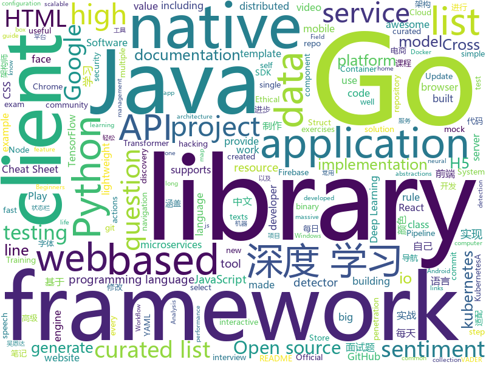

# 2019-11-15
See what the GitHub community is most excited about today.

## python
* [Real-Time-Voice-Cloning](https://github.com/CorentinJ/Real-Time-Voice-Cloning)(**1,329 stars today**): Clone a voice in 5 seconds to generate arbitrary speech in real-time
* [quay](https://github.com/quay/quay)(**637 stars today**): Build, Store, and Distribute your Applications and Containers
* [Deep-Learning-with-TensorFlow-book](https://github.com/dragen1860/Deep-Learning-with-TensorFlow-book)(**181 stars today**): 深度学习开源书，基于TensorFlow 2.0实战。Open source Deep Learning book, based on TensorFlow 2.0 framework.
* [python](https://github.com/kubernetes-client/python)(**5 stars today**): Official Python client library for kubernetes
* [SeleniumBase](https://github.com/seleniumbase/SeleniumBase)(**106 stars today**): ✅Easy Web Automation and Testing with Python.
* [c9-python-getting-started](https://github.com/microsoft/c9-python-getting-started)(**24 stars today**): Sample code for Channel 9 Python for Beginners course
* [Arjun](https://github.com/s0md3v/Arjun)(**19 stars today**): HTTP parameter discovery suite.
* [modin](https://github.com/modin-project/modin)(**34 stars today**): Modin: Speed up your Pandas workflows by changing a single line of code
* [DeepFaceLab](https://github.com/iperov/DeepFaceLab)(**98 stars today**): DeepFaceLab is a tool that utilizes machine learning to replace faces in videos. Includes prebuilt ready to work standalone Windows 7,8,10 binary (look readme.md).
* [exercises](https://github.com/Softwarepark/exercises)(**14 stars today**): SoftwarePark exercises and dojos
* [great_expectations](https://github.com/great-expectations/great_expectations)(**7 stars today**): Always know what to expect from your data.
* [CheatSheetSeries](https://github.com/OWASP/CheatSheetSeries)(**24 stars today**): The OWASP Cheat Sheet Series was created to provide a concise collection of high value information on specific application security topics.
* [black](https://github.com/psf/black)(**22 stars today**): The uncompromising Python code formatter
* [spack](https://github.com/spack/spack)(**2 stars today**): A flexible package manager that supports multiple versions, configurations, platforms, and compilers.
* [ray](https://github.com/ray-project/ray)(**21 stars today**): A fast and simple framework for building and running distributed applications. Ray is packaged with RLlib, a scalable reinforcement learning library, and Tune, a scalable hyperparameter tuning library.
* [SlowFast](https://github.com/facebookresearch/SlowFast)(**16 stars today**): PySlowFast: video understanding codebase from FAIR for reproducing state-of-the-art video models.
* [simpletransformers](https://github.com/ThilinaRajapakse/simpletransformers)(**4 stars today**): Transformers made simple with training, evaluation, and prediction possible with one line each. Currently supports Sequence Classification (binary, multiclass, multilabel), Token Classification (NER), and Question Answering. Built on top of the Hugging Face Transformer library.
* [A-Light-and-Fast-Face-Detector-for-Edge-Devices](https://github.com/YonghaoHe/A-Light-and-Fast-Face-Detector-for-Edge-Devices)(**5 stars today**): A light and fast one class detection framework for edge devices. We provide face detector, head detector, pedestrian detector, vehicle detector......
* [sentence-transformers](https://github.com/UKPLab/sentence-transformers)(**7 stars today**): Sentence Embeddings with BERT & XLNet
* [poetry](https://github.com/sdispater/poetry)(**37 stars today**): Python dependency management and packaging made easy.
* [seq2seq-couplet](https://github.com/wb14123/seq2seq-couplet)(**71 stars today**): Play couplet with seq2seq model. 用深度学习对对联。
* [vaderSentiment](https://github.com/cjhutto/vaderSentiment)(**4 stars today**): VADER Sentiment Analysis. VADER (Valence Aware Dictionary and sEntiment Reasoner) is a lexicon and rule-based sentiment analysis tool that is specifically attuned to sentiments expressed in social media, and works well on texts from other domains.
* [tacotron](https://github.com/keithito/tacotron)(**14 stars today**): A TensorFlow implementation of Google's Tacotron speech synthesis with pre-trained model (unofficial)
* [ImageAI](https://github.com/OlafenwaMoses/ImageAI)(**8 stars today**): A python library built to empower developers to build applications and systems with self-contained Computer Vision capabilities
* [gpt2-ml](https://github.com/imcaspar/gpt2-ml)(**24 stars today**): GPT2 for Multiple Languages, including pretrained models. GPT2 多语言支持, 15亿参数中文预训练模型

## java
* [gpmall](https://github.com/2227324689/gpmall)(**48 stars today**): 【咕泡学院实战项目】-基于SpringBoot+Dubbo构建的电商平台-微服务架构、商城、电商、微服务、高并发、kafka、Elasticsearch
* [springfox](https://github.com/springfox/springfox)(**6 stars today**): Automated JSON API documentation for API's built with Spring
* [DataX](https://github.com/alibaba/DataX)(**28 stars today**): 
* [lombok](https://github.com/rzwitserloot/lombok)(**7 stars today**): Very spicy additions to the Java programming language.
* [Sentinel](https://github.com/alibaba/Sentinel)(**66 stars today**): A lightweight powerful flow control component enabling reliability and monitoring for microservices. (轻量级的流量控制、熔断降级 Java 库)
* [jdk](https://github.com/openjdk/jdk)(**29 stars today**): Read-only mirror of https://hg.openjdk.java.net/jdk/jdk
* [arthas](https://github.com/alibaba/arthas)(**36 stars today**): Alibaba Java Diagnostic Tool Arthas/Alibaba Java诊断利器Arthas
* [cas](https://github.com/apereo/cas)(**10 stars today**): Apereo CAS - Enterprise Single Sign On for all earthlings and beyond.
* [java](https://github.com/kubernetes-client/java)(**3 stars today**): Official Java client library for kubernetes
* [aviator](https://github.com/killme2008/aviator)(**6 stars today**): A high performance expression evaluator for java
* [spring-kafka](https://github.com/spring-projects/spring-kafka)(**1 stars today**): Provides Familiar Spring Abstractions for Apache Kafka
* [flink](https://github.com/apache/flink)(**21 stars today**): Apache Flink
* [react-native-webview](https://github.com/react-native-community/react-native-webview)(**8 stars today**): React Native Cross-Platform WebView
* [incubator-hudi](https://github.com/apache/incubator-hudi)(**8 stars today**): Upserts And Incremental Processing on Big Data
* [presto](https://github.com/prestosql/presto)(**2 stars today**): Official home of the community managed version of Presto, the distributed SQL query engine for big data, under the auspices of the Presto Software Foundation.
* [quarkus](https://github.com/quarkusio/quarkus)(**15 stars today**): Quarkus: Supersonic Subatomic Java.
* [RIBs](https://github.com/uber/RIBs)(**9 stars today**): Uber's cross-platform mobile architecture framework.
* [TubeMQ](https://github.com/Tencent/TubeMQ)(**21 stars today**): TubeMQ focuses on high-performance storage and transmission of massive data in big data scenarios
* [ImmersionBar](https://github.com/gyf-dev/ImmersionBar)(**11 stars today**): android 4.4以上沉浸式状态栏和沉浸式导航栏管理，适配横竖屏切换、刘海屏、软键盘弹出等问题，可以修改状态栏字体颜色和导航栏图标颜色，以及不可修改字体颜色手机的适配，适用于Activity、Fragment、DialogFragment、Dialog，PopupWindow，一句代码轻松实现，以及对bar的其他设置，详见README。简书请参考：http://www.jianshu.com/p/2a884e211a62
* [xxl-job](https://github.com/xuxueli/xxl-job)(**26 stars today**): A lightweight distributed task scheduling framework.（分布式任务调度平台XXL-JOB）
* [react-native-navigation](https://github.com/wix/react-native-navigation)(**9 stars today**): A complete native navigation solution for React Native
* [hadoop](https://github.com/apache/hadoop)(**8 stars today**): Apache Hadoop
* [zeebe](https://github.com/zeebe-io/zeebe)(**9 stars today**): Distributed Workflow Engine for Microservices Orchestration
* [servicecomb-java-chassis](https://github.com/apache/servicecomb-java-chassis)(**7 stars today**): ServiceComb Java Chassis is a Software Development Kit (SDK) for rapid development of microservices in Java, providing service registration, service discovery, dynamic routing, and service management features

## unknown
* [awesome-interview-questions](https://github.com/MaximAbramchuck/awesome-interview-questions)(**249 stars today**): A curated awesome list of lists of interview questions. Feel free to contribute!🎓
* [Data-Science--Cheat-Sheet](https://github.com/abhat222/Data-Science--Cheat-Sheet)(**39 stars today**): Cheat Sheets
* [awesome-programming-books](https://github.com/jobbole/awesome-programming-books)(**447 stars today**): 经典编程书籍大全，涵盖：计算机系统与网络、系统架构、算法与数据结构、前端开发、后端开发、移动开发、数据库、测试、项目与团队、程序员职业修炼、求职面试等
* [awesome-architecture](https://github.com/toutiaoio/awesome-architecture)(**35 stars today**): 架构师技术图谱，助你早日成为架构师
* [project-based-learning](https://github.com/tuvtran/project-based-learning)(**53 stars today**): Curated list of project-based tutorials
* [awesome-ida](https://github.com/xrkk/awesome-ida)(**111 stars today**): awesome IDA Pro resources collections. For Github Repos, extra info included: Star, Last Commit Time, Main Programming Language. Update Regularly!
* [PENTESTING-BIBLE](https://github.com/blaCCkHatHacEEkr/PENTESTING-BIBLE)(**192 stars today**): This repository was created and developed by Ammar Amer @cry__pto Only. Updates to this repository will continue to arrive until the number of links reaches 10000 links & 10000 pdf files .Learn Ethical Hacking and penetration testing .hundreds of ethical hacking & penetration testing & red team & cyber security & computer science resources.
* [git-flight-rules](https://github.com/k88hudson/git-flight-rules)(**94 stars today**): Flight rules for git
* [sensitive-stop-words](https://github.com/fwwdn/sensitive-stop-words)(**7 stars today**): 互联网常用敏感词、停止词词库
* [starter-workflows](https://github.com/actions/starter-workflows)(**42 stars today**): Accelerating new GitHub Actions workflows
* [AZ-103-MicrosoftAzureAdministrator](https://github.com/MicrosoftLearning/AZ-103-MicrosoftAzureAdministrator)(**18 stars today**): AZ-103: Microsoft Azure Administrator
* [CKAD-exercises](https://github.com/dgkanatsios/CKAD-exercises)(**8 stars today**): A set of exercises to prepare for Certified Kubernetes Application Developer exam by Cloud Native Computing Foundation
* [HackTheBox-CTF-Writeups](https://github.com/Ignitetechnologies/HackTheBox-CTF-Writeups)(**4 stars today**): This cheasheet is aimed at the CTF Players and Beginners to help them sort Hack The Box Labs on the basis of Operating System and Difficulty.
* [awesome-actions](https://github.com/sdras/awesome-actions)(**38 stars today**): A curated list of awesome actions to use on GitHub
* [DeepLearning-500-questions](https://github.com/scutan90/DeepLearning-500-questions)(**49 stars today**): 深度学习500问，以问答形式对常用的概率知识、线性代数、机器学习、深度学习、计算机视觉等热点问题进行阐述，以帮助自己及有需要的读者。 全书分为18个章节，50余万字。由于水平有限，书中不妥之处恳请广大读者批评指正。 未完待续............ 如有意合作，联系scutjy2015@163.com 版权所有，违权必究 Tan 2018.06
* [architecture_decision_record](https://github.com/joelparkerhenderson/architecture_decision_record)(**10 stars today**): Architecture decision record (ADR) examples for software planning, IT leadership, and template documenation
* [awesome-sre](https://github.com/dastergon/awesome-sre)(**19 stars today**): A curated list of Site Reliability and Production Engineering resources.
* [chromium](https://github.com/jjqqkk/chromium)(**11 stars today**): Chromium browser with SSL VPN. Use this browser to unblock websites.
* [python_for_data_analysis_2nd_chinese_version](https://github.com/iamseancheney/python_for_data_analysis_2nd_chinese_version)(**21 stars today**): 《利用Python进行数据分析·第2版》
* [azure-pipelines-yaml](https://github.com/microsoft/azure-pipelines-yaml)(**3 stars today**): Azure Pipelines YAML examples, templates, and community interaction
* [awesome-self-supervised-learning](https://github.com/jason718/awesome-self-supervised-learning)(**13 stars today**): A curated list of awesome self-supervised methods
* [awesome-spider](https://github.com/facert/awesome-spider)(**24 stars today**): 爬虫集合
* [deep_learning_object_detection](https://github.com/hoya012/deep_learning_object_detection)(**23 stars today**): A paper list of object detection using deep learning.
* [DCA](https://github.com/Evalle/DCA)(**1 stars today**): Docker Certified Associate Exam Preparation Guide
* [javascript-questions](https://github.com/lydiahallie/javascript-questions)(**12 stars today**): A long list of (advanced) JavaScript questions, and their explanations✨

## javascript
* [BullshitGenerator](https://github.com/menzi11/BullshitGenerator)(**1,590 stars today**): Needs to generate some texts to test if my GUI rendering codes good or not. so I made this.
* [quark-h5](https://github.com/huangwei9527/quark-h5)(**186 stars today**): 基于vue2 + koa2的 H5制作工具。让不会写代码的人也能轻松快速上手制作H5页面。类似易企秀、百度H5等H5制作、建站工具
* [drawio](https://github.com/jgraph/drawio)(**700 stars today**): Source to www.draw.io
* [fe-interview](https://github.com/haizlin/fe-interview)(**74 stars today**): 前端面试每日 3+1，以面试题来驱动学习，提倡每日学习与思考，每天进步一点！每天早上5点纯手工发布面试题（死磕自己，愉悦大家）
* [react-interactive-paycard](https://github.com/jasminmif/react-interactive-paycard)(**215 stars today**): Interactive React Paycard
* [selectize.js](https://github.com/selectize/selectize.js)(**4 stars today**): Selectize is the hybrid of a textbox and <select> box. It's jQuery based and it has autocomplete and native-feeling keyboard navigation; useful for tagging, contact lists, etc.
* [svelte](https://github.com/sveltejs/svelte)(**40 stars today**): Cybernetically enhanced web apps
* [Daily-Interview-Question](https://github.com/Advanced-Frontend/Daily-Interview-Question)(**33 stars today**): 我是木易杨，公众号「高级前端进阶」作者，每天搞定一道前端大厂面试题，祝大家天天进步，一年后会看到不一样的自己。
* [markdown-here](https://github.com/adam-p/markdown-here)(**42 stars today**): Google Chrome, Firefox, and Thunderbird extension that lets you write email in Markdown and render it before sending.
* [incubator-echarts](https://github.com/apache/incubator-echarts)(**35 stars today**): A powerful, interactive charting and visualization library for browser
* [comlink](https://github.com/GoogleChromeLabs/comlink)(**24 stars today**): Comlink makes WebWorkers enjoyable.
* [animavita](https://github.com/wendelfreitas/animavita)(**74 stars today**): Trigger life-saving alerts, register animals for adoption and find the closest pet friend to adopt🐶
* [WebGL-Fluid-Simulation](https://github.com/PavelDoGreat/WebGL-Fluid-Simulation)(**8 stars today**): Play with fluids in your browser (works even on mobile)
* [d2-admin](https://github.com/d2-projects/d2-admin)(**115 stars today**): 🌈An elegant dashboard
* [GSAP](https://github.com/greensock/GSAP)(**22 stars today**): GreenSock's GSAP JavaScript animation library (including Draggable).
* [33-js-concepts](https://github.com/leonardomso/33-js-concepts)(**38 stars today**): 📜33 concepts every JavaScript developer should know.
* [react-native-firebase](https://github.com/invertase/react-native-firebase)(**16 stars today**): 🔥A well-tested feature-rich modular Firebase implementation for React Native. Supports both iOS & Android platforms for all Firebase services.
* [lighthouse-ci](https://github.com/GoogleChrome/lighthouse-ci)(**101 stars today**): Automate running Lighthouse for every commit, viewing the changes, and preventing regressions
* [RDR2CollectorsMap](https://github.com/jeanropke/RDR2CollectorsMap)(**2 stars today**): 
* [mellow](https://github.com/mellow-io/mellow)(**6 stars today**): Mellow is a rule-based global transparent proxy client for Windows, macOS and Linux.
* [amphtml](https://github.com/ampproject/amphtml)(**5 stars today**): The AMP web component framework.
* [puppeteer](https://github.com/GoogleChrome/puppeteer)(**54 stars today**): Headless Chrome Node.js API
* [d3](https://github.com/d3/d3)(**49 stars today**): Bring data to life with SVG, Canvas and HTML.📊📈🎉
* [eui](https://github.com/elastic/eui)(**20 stars today**): Elastic UI Framework🙌
* [faker.js](https://github.com/Marak/faker.js)(**16 stars today**): generate massive amounts of realistic fake data in Node.js and the browser

## html
* [mxgraph](https://github.com/jgraph/mxgraph)(**16 stars today**): mxGraph is a fully client side JavaScript diagramming library
* [nndl.github.io](https://github.com/nndl/nndl.github.io)(**42 stars today**): 《神经网络与深度学习》 邱锡鹏著 Neural Network and Deep Learning
* [Tang](https://github.com/KirikoXX/Tang)(**7 stars today**): 泡面哥汤达人的前世今生，从默默无闻到人人喊打【截止到2019年11月13日】
* [Front-end-Developer-Interview-Questions](https://github.com/h5bp/Front-end-Developer-Interview-Questions)(**11 stars today**): A list of helpful front-end related questions you can use to interview potential candidates, test yourself or completely ignore.
* [purecss-lace](https://github.com/cyanharlow/purecss-lace)(**41 stars today**): HTML/CSS drawing inspired by Flemish baroque oil portraits. Hand-coded entirely in HTML & CSS.
* [moveit_tutorials](https://github.com/ros-planning/moveit_tutorials)(**1 stars today**): A sphinx-based centralized documentation repo for MoveIt
* [Coursera-ML-AndrewNg-Notes](https://github.com/fengdu78/Coursera-ML-AndrewNg-Notes)(**44 stars today**): 吴恩达老师的机器学习课程个人笔记
* [cypress-example-kitchensink](https://github.com/cypress-io/cypress-example-kitchensink)(**2 stars today**): This is an example app used to showcase Cypress.io testing.
* [professional-services](https://github.com/GoogleCloudPlatform/professional-services)(**1 stars today**): Common solutions and tools developed by Google Cloud's Professional Services team
* [chosen](https://github.com/harvesthq/chosen)(**3 stars today**): Chosen is a library for making long, unwieldy select boxes more friendly.
* [typedoc](https://github.com/TypeStrong/typedoc)(**3 stars today**): Documentation generator for TypeScript projects.
* [flutter-in-action](https://github.com/flutterchina/flutter-in-action)(**14 stars today**): 《Flutter实战》电子书
* [styleguide](https://github.com/google/styleguide)(**13 stars today**): Style guides for Google-originated open-source projects
* [gopl-zh](https://github.com/golang-china/gopl-zh)(**15 stars today**): 📚Go语言圣经中文版
* [docs](https://github.com/aws-amplify/docs)(**0 stars today**): Amplify Framework Documentation
* [swagger-codegen](https://github.com/swagger-api/swagger-codegen)(**9 stars today**): swagger-codegen contains a template-driven engine to generate documentation, API clients and server stubs in different languages by parsing your OpenAPI / Swagger definition.
* [Screenshot-to-code](https://github.com/emilwallner/Screenshot-to-code)(**8 stars today**): A neural network that transforms a design mock-up into a static website.
* [training-kit](https://github.com/github/training-kit)(**4 stars today**): Open source cheat sheets for Git and GitHub
* [deeplearning_ai_books](https://github.com/fengdu78/deeplearning_ai_books)(**28 stars today**): deeplearning.ai（吴恩达老师的深度学习课程笔记及资源）
* [sql-formatter](https://github.com/jdorn/sql-formatter)(**10 stars today**): A lightweight php class for formatting sql statements. Handles automatic indentation and syntax highlighting.
* [stickyfill](https://github.com/wilddeer/stickyfill)(**2 stars today**): Polyfill for CSS `position: sticky`
* [html](https://github.com/whatwg/html)(**5 stars today**): HTML Standard
* [AR.js](https://github.com/jeromeetienne/AR.js)(**8 stars today**): Efficient Augmented Reality for the Web - 60fps on mobile!
* [intro.js](https://github.com/usablica/intro.js)(**9 stars today**): A better way for new feature introduction and step-by-step users guide for your website and project.
* [500LineorLess_CN](https://github.com/HT524/500LineorLess_CN)(**7 stars today**): 500 line or less 中文翻译计划。

## go
* [OpenDiablo2](https://github.com/OpenDiablo2/OpenDiablo2)(**730 stars today**): An open source re-implementation of Diablo 2
* [advanced-go-programming-book](https://github.com/chai2010/advanced-go-programming-book)(**135 stars today**): 📚《Go语言高级编程》开源图书，涵盖CGO、Go汇编语言、RPC实现、Protobuf插件实现、Web框架实现、分布式系统等高阶主题(完稿)
* [grpc-go](https://github.com/grpc/grpc-go)(**18 stars today**): The Go language implementation of gRPC. HTTP/2 based RPC
* [validator](https://github.com/go-playground/validator)(**26 stars today**): 💯Go Struct and Field validation, including Cross Field, Cross Struct, Map, Slice and Array diving
* [mongo-go-driver](https://github.com/mongodb/mongo-go-driver)(**5 stars today**): The Go driver for MongoDB
* [testify](https://github.com/stretchr/testify)(**15 stars today**): A toolkit with common assertions and mocks that plays nicely with the standard library
* [mapstructure](https://github.com/mitchellh/mapstructure)(**6 stars today**): Go library for decoding generic map values into native Go structures.
* [coredns](https://github.com/coredns/coredns)(**7 stars today**): CoreDNS is a DNS server that chains plugins
* [govmomi](https://github.com/vmware/govmomi)(**3 stars today**): Go library for the VMware vSphere API
* [cosmos-sdk](https://github.com/cosmos/cosmos-sdk)(**8 stars today**): ⛓A Framework for Building High Value Public Blockchains✨
* [aws-sdk-go](https://github.com/aws/aws-sdk-go)(**8 stars today**): AWS SDK for the Go programming language.
* [viper](https://github.com/spf13/viper)(**18 stars today**): Go configuration with fangs
* [operator-sdk](https://github.com/operator-framework/operator-sdk)(**7 stars today**): SDK for building Kubernetes applications. Provides high level APIs, useful abstractions, and project scaffolding.
* [redigo](https://github.com/gomodule/redigo)(**6 stars today**): Go client for Redis
* [the-way-to-go_ZH_CN](https://github.com/unknwon/the-way-to-go_ZH_CN)(**131 stars today**): 《The Way to Go》中文译本，中文正式名《Go 入门指南》
* [logrus](https://github.com/sirupsen/logrus)(**13 stars today**): Structured, pluggable logging for Go.
* [charts](https://github.com/helm/charts)(**29 stars today**): Curated applications for Kubernetes
* [pipeline](https://github.com/tektoncd/pipeline)(**20 stars today**): A K8s-native Pipeline resource.
* [gotraining](https://github.com/ardanlabs/gotraining)(**18 stars today**): Go Training Class Material :
* [kustomize](https://github.com/kubernetes-sigs/kustomize)(**8 stars today**): Customization of kubernetes YAML configurations
* [ReverseProxy](https://github.com/ilanyu/ReverseProxy)(**7 stars today**): ReverseProxy in golang
* [chat](https://github.com/tinode/chat)(**6 stars today**): Instant messaging server; backend in Go; iOS, Android, web, command line clients; chatbots
* [distribution](https://github.com/docker/distribution)(**2 stars today**): The Docker toolset to pack, ship, store, and deliver content
* [libpod](https://github.com/containers/libpod)(**30 stars today**): libpod is a library used to create container pods. Home of Podman.
* [mock](https://github.com/golang/mock)(**11 stars today**): GoMock is a mocking framework for the Go programming language.

## WordCloud

