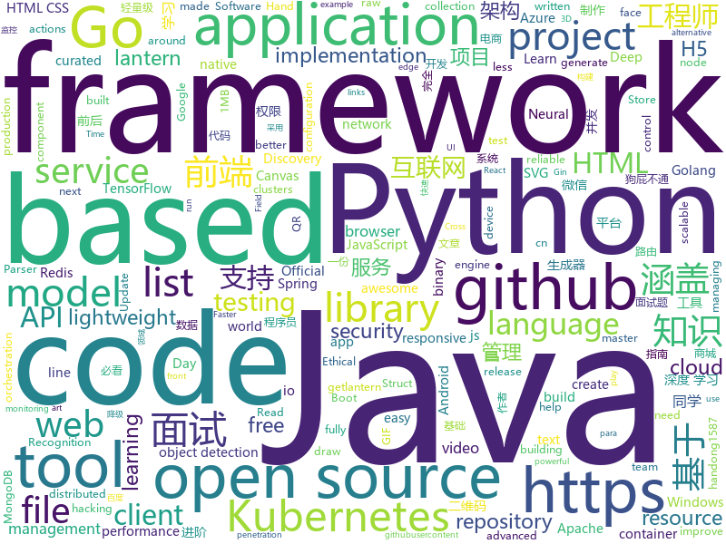

# 2019-11-16
See what the GitHub community is most excited about today.

## python
* [Deep-Learning-with-TensorFlow-book](https://github.com/dragen1860/Deep-Learning-with-TensorFlow-book)(**394 stars today**): 深度学习开源书，基于TensorFlow 2.0实战。Open source Deep Learning book, based on TensorFlow 2.0 framework.
* [Real-Time-Voice-Cloning](https://github.com/CorentinJ/Real-Time-Voice-Cloning)(**1,338 stars today**): Clone a voice in 5 seconds to generate arbitrary speech in real-time
* [seq2seq-couplet](https://github.com/wb14123/seq2seq-couplet)(**97 stars today**): Play couplet with seq2seq model. 用深度学习对对联。
* [quay](https://github.com/quay/quay)(**321 stars today**): Build, Store, and Distribute your Applications and Containers
* [azure-cli](https://github.com/Azure/azure-cli)(**7 stars today**): Command-line tools for Azure.
* [Ultra-Light-Fast-Generic-Face-Detector-1MB](https://github.com/Linzaer/Ultra-Light-Fast-Generic-Face-Detector-1MB)(**68 stars today**): 💎1MB lightweight face detection model (1MB轻量级人脸检测模型)
* [localstack](https://github.com/localstack/localstack)(**264 stars today**): 💻A fully functional local AWS cloud stack. Develop and test your cloud & Serverless apps offline!
* [c9-python-getting-started](https://github.com/microsoft/c9-python-getting-started)(**27 stars today**): Sample code for Channel 9 Python for Beginners course
* [qiling](https://github.com/qilingframework/qiling)(**86 stars today**): Qiling Advanced Binary Emulation framework
* [TGBullshitGeneratorBot](https://github.com/abc1763613206/TGBullshitGeneratorBot)(**30 stars today**): "狗屁不通文章生成器" (https://github.com/menzi11/BullshitGenerator) 的 Telegram Bot 移植版
* [face_recognition](https://github.com/ageitgey/face_recognition)(**75 stars today**): The world's simplest facial recognition api for Python and the command line
* [Bullshit-WebUI](https://github.com/pluto0x0/Bullshit-WebUI)(**11 stars today**): 自动狗屁不通文章生成器网页版
* [TensorFlow-Lite-Object-Detection-on-Android-and-Raspberry-Pi](https://github.com/EdjeElectronics/TensorFlow-Lite-Object-Detection-on-Android-and-Raspberry-Pi)(**13 stars today**): A tutorial showing how to train, convert, and run TensorFlow Lite object detection models on Android devices, the Raspberry Pi, and more!
* [WebHubBot](https://github.com/xiyouMc/WebHubBot)(**19 stars today**): Python + Scrapy + MongoDB . 5 million data per day !!!💥The world's largest website.
* [DeepFaceLab](https://github.com/iperov/DeepFaceLab)(**105 stars today**): DeepFaceLab is a tool that utilizes machine learning to replace faces in videos. Includes prebuilt ready to work standalone Windows 7,8,10 binary (look readme.md).
* [poetry](https://github.com/sdispater/poetry)(**64 stars today**): Python dependency management and packaging made easy.
* [Python-100-Days](https://github.com/ZiniuLu/Python-100-Days)(**16 stars today**): 出处：https://github.com/jackfrued/Python-100-Days.git
* [OpenNRE](https://github.com/thunlp/OpenNRE)(**38 stars today**): An Open-Source Package for Neural Relation Extraction (NRE)
* [models](https://github.com/tensorflow/models)(**95 stars today**): Models and examples built with TensorFlow
* [bert](https://github.com/google-research/bert)(**56 stars today**): TensorFlow code and pre-trained models for BERT
* [boto3](https://github.com/boto/boto3)(**10 stars today**): AWS SDK for Python
* [qrcode](https://github.com/sylnsfar/qrcode)(**17 stars today**): artistic QR Code in Python （Animated GIF qr code）- Python 艺术二维码生成器 （GIF动态二维码、图片二维码）
* [python](https://github.com/kubernetes-client/python)(**11 stars today**): Official Python client library for kubernetes
* [SlowFast](https://github.com/facebookresearch/SlowFast)(**47 stars today**): PySlowFast: video understanding codebase from FAIR for reproducing state-of-the-art video models.
* [vmaf](https://github.com/Netflix/vmaf)(**7 stars today**): Perceptual video quality assessment based on multi-method fusion.

## java
* [JavaGuide](https://github.com/Snailclimb/JavaGuide)(**303 stars today**): 【Java学习+面试指南】 一份涵盖大部分Java程序员所需要掌握的核心知识。
* [gpmall](https://github.com/2227324689/gpmall)(**104 stars today**): 【咕泡学院实战项目】-基于SpringBoot+Dubbo构建的电商平台-微服务架构、商城、电商、微服务、高并发、kafka、Elasticsearch
* [easyexcel](https://github.com/alibaba/easyexcel)(**56 stars today**): 快速、简单避免OOM的java处理Excel工具
* [Sentinel](https://github.com/alibaba/Sentinel)(**87 stars today**): A lightweight powerful flow control component enabling reliability and monitoring for microservices. (轻量级的流量控制、熔断降级 Java 库)
* [DataX](https://github.com/alibaba/DataX)(**49 stars today**): 
* [nacos](https://github.com/alibaba/nacos)(**45 stars today**): an easy-to-use dynamic service discovery, configuration and service management platform for building cloud native applications.
* [ksql](https://github.com/confluentinc/ksql)(**20 stars today**): KSQL - the Streaming SQL Engine for Apache Kafka
* [toBeTopJavaer](https://github.com/hollischuang/toBeTopJavaer)(**37 stars today**): To Be Top Javaer - Java工程师成神之路
* [redis-manager](https://github.com/ngbdf/redis-manager)(**190 stars today**): Redis 一站式管理平台，支持集群创建、管理、监控、报警
* [flink](https://github.com/apache/flink)(**33 stars today**): Apache Flink
* [flink-learning](https://github.com/zhisheng17/flink-learning)(**28 stars today**): flink learning blog. http://www.54tianzhisheng.cn
* [AndroidUtilCode](https://github.com/Blankj/AndroidUtilCode)(**32 stars today**): 🔥Android developers should collect the following utils(updating).
* [antlr4](https://github.com/antlr/antlr4)(**21 stars today**): ANTLR (ANother Tool for Language Recognition) is a powerful parser generator for reading, processing, executing, or translating structured text or binary files.
* [eladmin](https://github.com/elunez/eladmin)(**108 stars today**): 项目基于 Spring Boot 2.1.0 、 Jpa、 Spring Security、redis、Vue的前后端分离的后台管理系统，项目采用分模块开发方式， 权限控制采用 RBAC，支持数据字典与数据权限管理，支持一键生成前后端代码，支持动态路由
* [jdk](https://github.com/openjdk/jdk)(**47 stars today**): Read-only mirror of https://hg.openjdk.java.net/jdk/jdk
* [skywalking](https://github.com/apache/skywalking)(**29 stars today**): APM, Application Performance Monitoring System
* [FEBS-Shiro](https://github.com/wuyouzhuguli/FEBS-Shiro)(**10 stars today**): Spring Boot 2.1.8，Shiro1.4.0 & Layui 2.5.5 权限管理系统。预览地址：https://shiro.mrbird.cn:8080
* [nifi](https://github.com/apache/nifi)(**8 stars today**): Mirror of Apache NiFi
* [graal](https://github.com/oracle/graal)(**37 stars today**): GraalVM: Run Programs Faster Anywhere🚀
* [aeron](https://github.com/real-logic/aeron)(**4 stars today**): Efficient reliable UDP unicast, UDP multicast, and IPC message transport
* [arthas](https://github.com/alibaba/arthas)(**80 stars today**): Alibaba Java Diagnostic Tool Arthas/Alibaba Java诊断利器Arthas
* [advanced-java](https://github.com/doocs/advanced-java)(**127 stars today**): 😮互联网 Java 工程师进阶知识完全扫盲：涵盖高并发、分布式、高可用、微服务等领域知识，后端同学必看，前端同学也可学习
* [Discovery](https://github.com/Nepxion/Discovery)(**41 stars today**): 🐳Nepxion Discovery is an enhancement for Spring Cloud Discovery with gray release, router, weight, limitation, circuit breaker, degrade, isolation, monitor, tracing 灰度发布、路由、权重、限流、熔断、降级、隔离、监控、追踪
* [grpc-java](https://github.com/grpc/grpc-java)(**11 stars today**): The Java gRPC implementation. HTTP/2 based RPC
* [spring-boot](https://github.com/spring-projects/spring-boot)(**71 stars today**): Spring Boot

## unknown
* [awesome-interview-questions](https://github.com/MaximAbramchuck/awesome-interview-questions)(**373 stars today**): A curated awesome list of lists of interview questions. Feel free to contribute!🎓
* [JavaFamily](https://github.com/AobingJava/JavaFamily)(**95 stars today**): 【 互联网 Java 工程师大厂面试+学习指南】，进阶知识完全扫盲：涵盖高并发、分布式、高可用、微服务等领域知识，作者风格幽默，后端同学必看，前端同学也可学习。
* [PENTESTING-BIBLE](https://github.com/blaCCkHatHacEEkr/PENTESTING-BIBLE)(**196 stars today**): This repository was created and developed by Ammar Amer @cry__pto Only. Updates to this repository will continue to arrive until the number of links reaches 10000 links & 10000 pdf files .Learn Ethical Hacking and penetration testing .hundreds of ethical hacking & penetration testing & red team & cyber security & computer science resources.
* [awesome-ida](https://github.com/xrkk/awesome-ida)(**116 stars today**): awesome IDA Pro resources collections. For Github Repos, extra info included: Star, Last Commit Time, Main Programming Language. Update Regularly!
* [starter-workflows](https://github.com/actions/starter-workflows)(**52 stars today**): Accelerating new GitHub Actions workflows
* [download](https://github.com/getlantern/download)(**31 stars today**): 蓝灯Windows下载 https://raw.githubusercontent.com/getlantern/lantern-binaries/master/lantern-installer.exe 蓝灯安卓下载 https://raw.githubusercontent.com/getlantern/lantern-binaries/master/lantern-installer.apk
* [app-ideas](https://github.com/florinpop17/app-ideas)(**56 stars today**): A Collection of application ideas which can be used to improve your coding skills.
* [git-flight-rules](https://github.com/k88hudson/git-flight-rules)(**97 stars today**): Flight rules for git
* [GNNPapers](https://github.com/thunlp/GNNPapers)(**40 stars today**): Must-read papers on graph neural networks (GNN)
* [vagas](https://github.com/frontendbr/vagas)(**9 stars today**): 🔬Espaço para divulgação de vagas para front-enders.
* [awesome-sre](https://github.com/dastergon/awesome-sre)(**23 stars today**): A curated list of Site Reliability and Production Engineering resources.
* [awesome-programming-books](https://github.com/jobbole/awesome-programming-books)(**330 stars today**): 经典编程书籍大全，涵盖：计算机系统与网络、系统架构、算法与数据结构、前端开发、后端开发、移动开发、数据库、测试、项目与团队、程序员职业修炼、求职面试等
* [3y](https://github.com/ZhongFuCheng3y/3y)(**27 stars today**): 📓从Java基础、JavaWeb基础到常用的框架再到面试题都有完整的教程，几乎涵盖了Java后端必备的知识点
* [kubernetes-production-best-practices](https://github.com/learnk8s/kubernetes-production-best-practices)(**79 stars today**): A checklist of Kubernetes best practices to help you release to production
* [awesome-object-detection](https://github.com/amusi/awesome-object-detection)(**22 stars today**): Awesome Object Detection based on handong1587 github: https://handong1587.github.io/deep_learning/2015/10/09/object-detection.html
* [web-interview](https://github.com/yisainan/web-interview)(**15 stars today**): 我是「齐丶先丶森」，公众号「前端面试秘籍」作者，收集整理全网面试题及面试技巧，旨在帮助前端工程师们找到一份好工作！
* [ru-test-assignments](https://github.com/Hexlet/ru-test-assignments)(**6 stars today**): Тестовые задания для самостоятельного выполнения от разных it компаний
* [learn-regex](https://github.com/ziishaned/learn-regex)(**54 stars today**): Learn regex the easy way
* [binance-official-api-docs](https://github.com/binance-exchange/binance-official-api-docs)(**4 stars today**): Official Documentation for the Binance APIs and Streams
* [azure-policy](https://github.com/Azure/azure-policy)(**2 stars today**): Repository for Azure Resource Policy samples
* [wiki](https://github.com/ethereum/wiki)(**12 stars today**): The Ethereum Wiki
* [awesome-actions](https://github.com/sdras/awesome-actions)(**65 stars today**): A curated list of awesome actions to use on GitHub
* [weekly](https://github.com/dt-fe/weekly)(**16 stars today**): 前端精读周刊
* [AZ-103-MicrosoftAzureAdministrator](https://github.com/MicrosoftLearning/AZ-103-MicrosoftAzureAdministrator)(**19 stars today**): AZ-103: Microsoft Azure Administrator
* [architecture.of.internet-product](https://github.com/davideuler/architecture.of.internet-product)(**13 stars today**): 互联网公司技术架构，微信/淘宝/微博/腾讯/阿里/美团点评/百度/Google/Facebook/Amazon/eBay的架构，欢迎PR补充

## javascript
* [BullshitGenerator](https://github.com/menzi11/BullshitGenerator)(**2,381 stars today**): Needs to generate some texts to test if my GUI rendering codes good or not. so I made this.
* [drawio-desktop](https://github.com/jgraph/drawio-desktop)(**179 stars today**): Official electron build of draw.io
* [d2-admin](https://github.com/d2-projects/d2-admin)(**115 stars today**): 🌈An elegant dashboard
* [WheelChair](https://github.com/hrt/WheelChair)(**9 stars today**): State of the art, cutting edge Neo man
* [fabric.js](https://github.com/fabricjs/fabric.js)(**23 stars today**): Javascript Canvas Library, SVG-to-Canvas (& canvas-to-SVG) Parser
* [quark-h5](https://github.com/huangwei9527/quark-h5)(**315 stars today**): 基于vue2 + koa2的 H5制作工具。让不会写代码的人也能轻松快速上手制作H5页面。类似易企秀、百度H5等H5制作、建站工具
* [axios](https://github.com/axios/axios)(**88 stars today**): Promise based HTTP client for the browser and node.js
* [flow-typed](https://github.com/flow-typed/flow-typed)(**6 stars today**): A central repository for Flow library definitions
* [brave-browser](https://github.com/brave/brave-browser)(**82 stars today**): Next generation Brave browser for macOS, Windows, Linux, and eventually Android
* [wechat-app-mall](https://github.com/EastWorld/wechat-app-mall)(**19 stars today**): 微信小程序商城，微信小程序微店
* [gutenberg](https://github.com/WordPress/gutenberg)(**8 stars today**): The Block Editor project for WordPress and beyond. Plugin is available from the official repository.
* [vue-interactive-paycard](https://github.com/muhammederdem/vue-interactive-paycard)(**123 stars today**): Credit card form with smooth and sweet micro-interactions
* [node-elm](https://github.com/bailicangdu/node-elm)(**28 stars today**): 基于 node.js + Mongodb 构建的后台系统
* [yapi](https://github.com/YMFE/yapi)(**78 stars today**): YApi 是一个可本地部署的、打通前后端及QA的、可视化的接口管理平台
* [drawio](https://github.com/jgraph/drawio)(**894 stars today**): Source to www.draw.io
* [uppy](https://github.com/transloadit/uppy)(**23 stars today**): The next open source file uploader for web browsers🐶
* [awesome-selfhosted](https://github.com/awesome-selfhosted/awesome-selfhosted)(**118 stars today**): A list of Free Software network services and web applications which can be hosted locally. Selfhosting is the process of hosting and managing applications instead of renting from Software-as-a-Service providers
* [open-ui](https://github.com/WICG/open-ui)(**22 stars today**): A place to play around a little bit with controls to see if there is a better path forward
* [Semantic-UI](https://github.com/Semantic-Org/Semantic-UI)(**28 stars today**): Semantic is a UI component framework based around useful principles from natural language.
* [react-native](https://github.com/facebook/react-native)(**65 stars today**): A framework for building native apps with React.
* [bootstrap](https://github.com/twbs/bootstrap)(**63 stars today**): The most popular HTML, CSS, and JavaScript framework for developing responsive, mobile first projects on the web.
* [dayjs](https://github.com/iamkun/dayjs)(**54 stars today**): ⏰Day.js 2KB immutable date library alternative to Moment.js with the same modern API
* [Script](https://github.com/NobyDa/Script)(**8 stars today**): 
* [three.js](https://github.com/mrdoob/three.js)(**62 stars today**): JavaScript 3D library.
* [animavita](https://github.com/wendelfreitas/animavita)(**69 stars today**): Trigger life-saving alerts, register animals for adoption and find the closest pet friend to adopt🐶

## html
* [nndl.github.io](https://github.com/nndl/nndl.github.io)(**46 stars today**): 《神经网络与深度学习》 邱锡鹏著 Neural Network and Deep Learning
* [cypress-example-kitchensink](https://github.com/cypress-io/cypress-example-kitchensink)(**3 stars today**): This is an example app used to showcase Cypress.io testing.
* [purecss-lace](https://github.com/cyanharlow/purecss-lace)(**49 stars today**): HTML/CSS drawing inspired by Flemish baroque oil portraits. Hand-coded entirely in HTML & CSS.
* [glTF](https://github.com/KhronosGroup/glTF)(**6 stars today**): glTF – Runtime 3D Asset Delivery
* [html](https://github.com/whatwg/html)(**8 stars today**): HTML Standard
* [boost](https://github.com/boostorg/boost)(**9 stars today**): Super-project for modularized Boost
* [500LineorLess_CN](https://github.com/HT524/500LineorLess_CN)(**9 stars today**): 500 line or less 中文翻译计划。
* [free-for-dev](https://github.com/ripienaar/free-for-dev)(**54 stars today**): A list of SaaS, PaaS and IaaS offerings that have free tiers of interest to devops and infradev
* [Java-Interview-Advanced](https://github.com/shishan100/Java-Interview-Advanced)(**13 stars today**): 中华石杉--互联网Java进阶面试训练营
* [responsive-html-email-template](https://github.com/leemunroe/responsive-html-email-template)(**14 stars today**): A free simple responsive HTML email template
* [Coursera-ML-AndrewNg-Notes](https://github.com/fengdu78/Coursera-ML-AndrewNg-Notes)(**50 stars today**): 吴恩达老师的机器学习课程个人笔记
* [aws-well-architected-labs](https://github.com/awslabs/aws-well-architected-labs)(**5 stars today**): Hands on labs and code to help you learn, measure, and build using architectural best practices.
* [SVG-Loaders](https://github.com/SamHerbert/SVG-Loaders)(**2 stars today**): Loading icons and small animations built with pure SVG.
* [COMP9021_19T3](https://github.com/marey/COMP9021_19T3)(**0 stars today**): 
* [fastclick](https://github.com/ftlabs/fastclick)(**9 stars today**): Polyfill to remove click delays on browsers with touch UIs
* [turndown](https://github.com/domchristie/turndown)(**6 stars today**): 🛏An HTML to Markdown converter written in JavaScript
* [fastText](https://github.com/facebookresearch/fastText)(**27 stars today**): Library for fast text representation and classification.
* [nce-live](https://github.com/ncehk2019/nce-live)(**4 stars today**): 
* [foundation-sites](https://github.com/foundation/foundation-sites)(**9 stars today**): The most advanced responsive front-end framework in the world. Quickly create prototypes and production code for sites that work on any kind of device.
* [wysiwyg-editor](https://github.com/froala/wysiwyg-editor)(**1 stars today**): The next generation Javascript WYSIWYG HTML Editor.
* [sql-formatter](https://github.com/jdorn/sql-formatter)(**13 stars today**): A lightweight php class for formatting sql statements. Handles automatic indentation and syntax highlighting.
* [docs](https://github.com/pingcap/docs)(**0 stars today**): TiDB/TiKV/PD documents.
* [django-DefectDojo](https://github.com/DefectDojo/django-DefectDojo)(**3 stars today**): DefectDojo is an open-source application vulnerability correlation and security orchestration tool.
* [mxgraph](https://github.com/jgraph/mxgraph)(**19 stars today**): mxGraph is a fully client side JavaScript diagramming library
* [tianocore.github.io](https://github.com/tianocore/tianocore.github.io)(**2 stars today**): Tianocore website

## go
* [OpenDiablo2](https://github.com/OpenDiablo2/OpenDiablo2)(**1,433 stars today**): An open source re-implementation of Diablo 2
* [validator](https://github.com/go-playground/validator)(**85 stars today**): 💯Go Struct and Field validation, including Cross Field, Cross Struct, Map, Slice and Array diving
* [terraform](https://github.com/hashicorp/terraform)(**36 stars today**): Terraform enables you to safely and predictably create, change, and improve infrastructure. It is an open source tool that codifies APIs into declarative configuration files that can be shared amongst team members, treated as code, edited, reviewed, and versioned.
* [kubeedge](https://github.com/kubeedge/kubeedge)(**24 stars today**): Kubernetes Native Edge Computing Framework (project under CNCF)
* [grpc-go](https://github.com/grpc/grpc-go)(**48 stars today**): The Go language implementation of gRPC. HTTP/2 based RPC
* [operator-lifecycle-manager](https://github.com/operator-framework/operator-lifecycle-manager)(**12 stars today**): A management framework for extending Kubernetes with Operators
* [kubernetes](https://github.com/kubernetes/kubernetes)(**120 stars today**): Production-Grade Container Scheduling and Management
* [moby](https://github.com/moby/moby)(**43 stars today**): Moby Project - a collaborative project for the container ecosystem to assemble container-based systems
* [jwt-go](https://github.com/dgrijalva/jwt-go)(**15 stars today**): Golang implementation of JSON Web Tokens (JWT)
* [mattermost-server](https://github.com/mattermost/mattermost-server)(**25 stars today**): Open source Slack-alternative in Golang and React - Mattermost
* [redigo](https://github.com/gomodule/redigo)(**15 stars today**): Go client for Redis
* [the-way-to-go_ZH_CN](https://github.com/unknwon/the-way-to-go_ZH_CN)(**130 stars today**): 《The Way to Go》中文译本，中文正式名《Go 入门指南》
* [xlsx](https://github.com/tealeg/xlsx)(**11 stars today**): Google Go (golang) library for reading and writing XLSX files.
* [kind](https://github.com/kubernetes-sigs/kind)(**27 stars today**): Kubernetes IN Docker - local clusters for testing Kubernetes
* [tfsec](https://github.com/liamg/tfsec)(**121 stars today**): 🔒🌍Static analysis powered security scanner for your terraform code
* [vault](https://github.com/hashicorp/vault)(**16 stars today**): A tool for secrets management, encryption as a service, and privileged access management
* [cadence](https://github.com/uber/cadence)(**22 stars today**): Cadence is a distributed, scalable, durable, and highly available orchestration engine to execute asynchronous long-running business logic in a scalable and resilient way.
* [gin](https://github.com/gin-gonic/gin)(**56 stars today**): Gin is a HTTP web framework written in Go (Golang). It features a Martini-like API with much better performance -- up to 40 times faster. If you need smashing performance, get yourself some Gin.
* [k3s](https://github.com/rancher/k3s)(**78 stars today**): Lightweight Kubernetes. 5 less than k8s.
* [mock](https://github.com/golang/mock)(**23 stars today**): GoMock is a mocking framework for the Go programming language.
* [loki](https://github.com/grafana/loki)(**12 stars today**): Like Prometheus, but for logs.
* [origin](https://github.com/openshift/origin)(**11 stars today**): The self-managing, auto-upgrading, Kubernetes distribution for everyone
* [prometheus-operator](https://github.com/coreos/prometheus-operator)(**21 stars today**): Prometheus Operator creates/configures/manages Prometheus clusters atop Kubernetes
* [testify](https://github.com/stretchr/testify)(**26 stars today**): A toolkit with common assertions and mocks that plays nicely with the standard library
* [etcd](https://github.com/etcd-io/etcd)(**46 stars today**): Distributed reliable key-value store for the most critical data of a distributed system

## WordCloud

