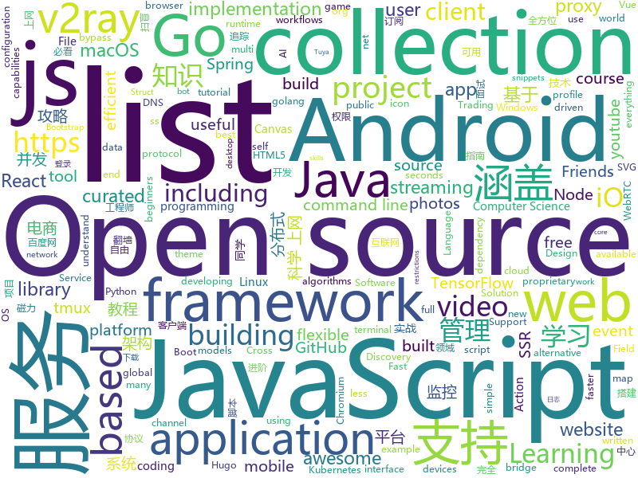

# 2019-11-18
See what the GitHub community is most excited about today.

## python
* [Deep-Learning-with-TensorFlow-book](https://github.com/dragen1860/Deep-Learning-with-TensorFlow-book)(**1,222 stars today**): 深度学习开源书，基于TensorFlow 2.0实战。Open source Deep Learning book, based on TensorFlow 2.0 framework.
* [modin](https://github.com/modin-project/modin)(**157 stars today**): Modin: Speed up your Pandas workflows by changing a single line of code
* [tuya-convert](https://github.com/ct-Open-Source/tuya-convert)(**20 stars today**): A collection of scripts to flash Tuya IoT devices to alternative firmwares
* [cpython](https://github.com/python/cpython)(**72 stars today**): The Python programming language
* [numpy-ml](https://github.com/ddbourgin/numpy-ml)(**84 stars today**): Machine learning, in numpy
* [gym](https://github.com/openai/gym)(**43 stars today**): A toolkit for developing and comparing reinforcement learning algorithms.
* [PayloadsAllTheThings](https://github.com/swisskyrepo/PayloadsAllTheThings)(**80 stars today**): A list of useful payloads and bypass for Web Application Security and Pentest/CTF
* [FALdetector](https://github.com/PeterWang512/FALdetector)(**84 stars today**): Code for the paper: Detecting Photoshopped Faces by Scripting Photoshop
* [keras](https://github.com/keras-team/keras)(**97 stars today**): Deep Learning for humans
* [ipwndfu](https://github.com/axi0mX/ipwndfu)(**26 stars today**): open-source jailbreaking tool for many iOS devices
* [clusterman](https://github.com/Yelp/clusterman)(**13 stars today**): Cluster Autoscaler for Kubernetes and Mesos
* [spleeter](https://github.com/deezer/spleeter)(**192 stars today**): Deezer source separation library including pretrained models.
* [TensorFlow-Lite-Object-Detection-on-Android-and-Raspberry-Pi](https://github.com/EdjeElectronics/TensorFlow-Lite-Object-Detection-on-Android-and-Raspberry-Pi)(**32 stars today**): A tutorial showing how to train, convert, and run TensorFlow Lite object detection models on Android devices, the Raspberry Pi, and more!
* [Ultimate-Facebook-Scraper](https://github.com/harismuneer/Ultimate-Facebook-Scraper)(**34 stars today**): 🤖A bot which scrapes almost everything about a Facebook user's profile including all public posts/statuses available on the user's timeline, uploaded photos, tagged photos, videos, friends list and their profile photos (including Followers, Following, Work Friends, College Friends etc).
* [faceswap](https://github.com/deepfakes/faceswap)(**72 stars today**): Deepfakes Software For All
* [XX-Net](https://github.com/XX-net/XX-Net)(**27 stars today**): a web proxy tool
* [django](https://github.com/django/django)(**80 stars today**): The Web framework for perfectionists with deadlines.
* [OctoPrint](https://github.com/foosel/OctoPrint)(**10 stars today**): OctoPrint is the snappy web interface for your 3D printer!
* [30-seconds-of-python](https://github.com/30-seconds/30-seconds-of-python)(**45 stars today**): A curated collection of useful Python snippets that you can understand in 30 seconds or less.
* [ytmdl](https://github.com/deepjyoti30/ytmdl)(**13 stars today**): A simple script to get songs from youtube in mp3 format with all tags from itunes
* [deepdrive](https://github.com/deepdrive/deepdrive)(**49 stars today**): End-to-end simulation for self-driving cars
* [fashion-mnist](https://github.com/zalandoresearch/fashion-mnist)(**27 stars today**): A MNIST-like fashion product database. Benchmark👉
* [v2rayL](https://github.com/jiangxufeng/v2rayL)(**12 stars today**): v2ray linux GUI客户端，支持订阅、vemss、ss等协议，自动更新订阅、检查版本更新
* [zipline](https://github.com/quantopian/zipline)(**22 stars today**): Zipline, a Pythonic Algorithmic Trading Library
* [Sublist3r](https://github.com/aboul3la/Sublist3r)(**17 stars today**): Fast subdomains enumeration tool for penetration testers

## java
* [JavaGuide](https://github.com/Snailclimb/JavaGuide)(**481 stars today**): 【Java学习+面试指南】 一份涵盖大部分Java程序员所需要掌握的核心知识。
* [NewPipe](https://github.com/TeamNewPipe/NewPipe)(**23 stars today**): A libre lightweight streaming front-end for Android.
* [Spring-Boot-In-Action](https://github.com/hansonwang99/Spring-Boot-In-Action)(**57 stars today**): Spring Boot 系列实战合集
* [halo](https://github.com/halo-dev/halo)(**87 stars today**): ✍ Halo 一款现代化的个人独立博客系统
* [gpmall](https://github.com/2227324689/gpmall)(**185 stars today**): 【咕泡学院实战项目】-基于SpringBoot+Dubbo构建的电商平台-微服务架构、商城、电商、微服务、高并发、kafka、Elasticsearch
* [interview](https://github.com/mission-peace/interview)(**25 stars today**): Interview questions
* [Discovery](https://github.com/Nepxion/Discovery)(**68 stars today**): 🐳Nepxion Discovery is an enhancement for Spring Cloud Discovery with gray release, router, weight, limitation, circuit breaker, degrade, isolation, monitor, tracing 灰度发布、路由、权重、限流、熔断、降级、隔离、监控、追踪
* [advanced-java](https://github.com/doocs/advanced-java)(**74 stars today**): 😮互联网 Java 工程师进阶知识完全扫盲：涵盖高并发、分布式、高可用、微服务等领域知识，后端同学必看，前端同学也可学习
* [magnetW](https://github.com/dengyuhan/magnetW)(**43 stars today**): 磁力搜网页版 - 磁力链接聚合搜索 - https://bt.lansou.pw
* [netty](https://github.com/netty/netty)(**59 stars today**): Netty project - an event-driven asynchronous network application framework
* [ksql](https://github.com/confluentinc/ksql)(**31 stars today**): KSQL - the Streaming SQL Engine for Apache Kafka
* [FEBS-Shiro](https://github.com/wuyouzhuguli/FEBS-Shiro)(**24 stars today**): Spring Boot 2.1.8，Shiro1.4.0 & Layui 2.5.5 权限管理系统。预览地址：https://shiro.mrbird.cn:8080
* [mall-learning](https://github.com/macrozheng/mall-learning)(**34 stars today**): mall学习教程，架构、业务、技术要点全方位解析。mall项目（20k+star）是一套电商系统，使用现阶段主流技术实现。 涵盖了SpringBoot2.1.3、MyBatis3.4.6、Elasticsearch6.2.2、RabbitMQ3.7.15、Redis3.2、Mongodb3.2、Mysql5.7等技术，采用Docker容器化部署。
* [CtCI-6th-Edition](https://github.com/careercup/CtCI-6th-Edition)(**7 stars today**): Cracking the Coding Interview 6th Ed. Solutions
* [OpenHub](https://github.com/ThirtyDegreesRay/OpenHub)(**32 stars today**): An open source GitHub Android client app, faster and concise.
* [easyexcel](https://github.com/alibaba/easyexcel)(**112 stars today**): 快速、简单避免OOM的java处理Excel工具
* [syndesis](https://github.com/syndesisio/syndesis)(**48 stars today**): A flexible, customizable, open source platform that provides core integration capabilities as a service.
* [Signal-Android](https://github.com/signalapp/Signal-Android)(**23 stars today**): A private messenger for Android.
* [proxyee-down](https://github.com/proxyee-down-org/proxyee-down)(**34 stars today**): http下载工具，基于http代理，支持多连接分块下载
* [runelite](https://github.com/runelite/runelite)(**9 stars today**): Open source Old School RuneScape client
* [libgdx](https://github.com/libgdx/libgdx)(**23 stars today**): Desktop/Android/HTML5/iOS Java game development framework
* [baritone](https://github.com/cabaletta/baritone)(**8 stars today**): google maps for block game
* [zheng](https://github.com/shuzheng/zheng)(**24 stars today**): 基于Spring+SpringMVC+Mybatis分布式敏捷开发系统架构，提供整套公共微服务服务模块：集中权限管理（单点登录）、内容管理、支付中心、用户管理（支持第三方登录）、微信平台、存储系统、配置中心、日志分析、任务和通知等，支持服务治理、监控和追踪，努力为中小型企业打造全方位J2EE企业级开发解决方案。
* [Algorithms](https://github.com/williamfiset/Algorithms)(**38 stars today**): A collection of algorithms and data structures
* [redis-manager](https://github.com/ngbdf/redis-manager)(**58 stars today**): Redis 一站式管理平台，支持集群创建、管理、监控、报警

## unknown
* [starter-workflows](https://github.com/actions/starter-workflows)(**67 stars today**): Accelerating new GitHub Actions workflows
* [hosts](https://github.com/googlehosts/hosts)(**10 stars today**): 镜像：https://coding.net/u/scaffrey/p/hosts/git
* [JavaFamily](https://github.com/AobingJava/JavaFamily)(**175 stars today**): 【 互联网 Java 工程师大厂面试+学习指南】，进阶知识完全扫盲：涵盖高并发、分布式、高可用、微服务等领域知识，作者风格幽默，看起来津津有味，把学习当做一种乐趣，何乐而不为，后端同学必看。
* [awesome-actions](https://github.com/sdras/awesome-actions)(**22 stars today**): A curated list of awesome actions to use on GitHub
* [new-pac](https://github.com/Alvin9999/new-pac)(**40 stars today**): 科学/自由上网，免费ss/ssr/v2ray/goflyway账号，搭建教程
* [react-redux-complete-playlist](https://github.com/iamshaunjp/react-redux-complete-playlist)(**1 stars today**): The course files for the React & Redux Complete tutorial playlist on The Net Ninja YouTube channel.
* [the-art-of-command-line](https://github.com/jlevy/the-art-of-command-line)(**18 stars today**): Master the command line, in one page
* [new-grads-2020](https://github.com/cmackenzie1/new-grads-2020)(**0 stars today**): A collection of new grad roles for 2020
* [app-ideas](https://github.com/florinpop17/app-ideas)(**14 stars today**): A Collection of application ideas which can be used to improve your coding skills.
* [shadowsocks-rss](https://github.com/shadowsocksr-backup/shadowsocks-rss)(**5 stars today**): ShadowsocksR update rss, SSR organization
* [coding-interview-university](https://github.com/jwasham/coding-interview-university)(**32 stars today**): A complete computer science study plan to become a software engineer.
* [fancyss_history_package](https://github.com/hq450/fancyss_history_package)(**12 stars today**): 科学上网插件的离线安装包储存在这里
* [awesome](https://github.com/sindresorhus/awesome)(**56 stars today**): 😎Awesome lists about all kinds of interesting topics
* [Projects](https://github.com/karan/Projects)(**9 stars today**): 📃A list of practical projects that anyone can solve in any programming language.
* [la-capitaine-icon-theme](https://github.com/keeferrourke/la-capitaine-icon-theme)(**0 stars today**): La Capitaine is an icon pack designed to integrate with most desktop environments. The set of icons takes inspiration from the latest iterations of macOS and Google's Material Design.
* [chromium](https://github.com/jjqqkk/chromium)(**6 stars today**): Chromium browser with SSL VPN. Use this browser to unblock websites.
* [trackerslist](https://github.com/ngosang/trackerslist)(**37 stars today**): Updated list of public BitTorrent trackers
* [cs-video-courses](https://github.com/Developer-Y/cs-video-courses)(**2 stars today**): List of Computer Science courses with video lectures.
* [.tmux](https://github.com/gpakosz/.tmux)(**17 stars today**): 🇫🇷Oh My Tmux! Pretty & versatile tmux configuration made with❤️(imho the best tmux configuration that just works)
* [AI-Job-Notes](https://github.com/amusi/AI-Job-Notes)(**3 stars today**): AI算法岗求职攻略（涵盖准备攻略、刷题指南、内推和AI公司清单等资料）
* [awesome-for-beginners](https://github.com/MunGell/awesome-for-beginners)(**21 stars today**): A list of awesome beginners-friendly projects.
* [UABE](https://github.com/DerPopo/UABE)(**0 stars today**): Unity Assets Bundle Extractor
* [project-based-learning](https://github.com/tuvtran/project-based-learning)(**23 stars today**): Curated list of project-based tutorials
* [shadowsocks](https://github.com/Shadowsocks-Wiki/shadowsocks)(**5 stars today**): shadowsocks.wiki
* [AMD_Vanilla](https://github.com/AMD-OSX/AMD_Vanilla)(**2 stars today**): Native AMD macOS via Clover & OpenCore

## javascript
* [DPlayer](https://github.com/MoePlayer/DPlayer)(**26 stars today**): 🍭Wow, such a lovely HTML5 danmaku video player
* [fanqiang](https://github.com/bannedbook/fanqiang)(**60 stars today**): 翻墙-科学上网
* [fabric.js](https://github.com/fabricjs/fabric.js)(**113 stars today**): Javascript Canvas Library, SVG-to-Canvas (& canvas-to-SVG) Parser
* [30-seconds-of-code](https://github.com/30-seconds/30-seconds-of-code)(**328 stars today**): A curated collection of useful JavaScript snippets that you can understand in 30 seconds or less.
* [Awesome-Design-Tools](https://github.com/LisaDziuba/Awesome-Design-Tools)(**62 stars today**): The best design tools and plugins for everything👉
* [uBlock](https://github.com/gorhill/uBlock)(**31 stars today**): uBlock Origin - An efficient blocker for Chromium and Firefox. Fast and lean.
* [joplin](https://github.com/laurent22/joplin)(**206 stars today**): Joplin - a note taking and to-do application with synchronization capabilities for Windows, macOS, Linux, Android and iOS. Forum: https://discourse.joplinapp.org/
* [iptv](https://github.com/iptv-org/iptv)(**156 stars today**): Collection of 8000+ publicly available IPTV channels from all over the world
* [organice](https://github.com/200ok-ch/organice)(**109 stars today**): An implementation of Org mode without the dependency of Emacs - built for mobile and desktop browsers
* [didact](https://github.com/pomber/didact)(**169 stars today**): A DIY guide to build your own React
* [react-native](https://github.com/facebook/react-native)(**110 stars today**): A framework for building native apps with React.
* [keystone](https://github.com/keystonejs/keystone)(**34 stars today**): A scalable platform and CMS to build Node.js applications
* [vue-realworld-example-app](https://github.com/gothinkster/vue-realworld-example-app)(**56 stars today**): An exemplary real-world application built with Vue.js, Vuex, axios and different other technologies. This is a good example to discover Vue for beginners.
* [react](https://github.com/facebook/react)(**206 stars today**): A declarative, efficient, and flexible JavaScript library for building user interfaces.
* [Motrix](https://github.com/agalwood/Motrix)(**90 stars today**): A full-featured download manager.
* [pokemon-showdown](https://github.com/smogon/pokemon-showdown)(**8 stars today**): Pokémon battle simulator.
* [Rocket.Chat](https://github.com/RocketChat/Rocket.Chat)(**36 stars today**): The ultimate Free Open Source Solution for team communications.
* [mellow](https://github.com/mellow-io/mellow)(**31 stars today**): Mellow is a rule-based global transparent proxy client for Windows, macOS and Linux.
* [next.js](https://github.com/zeit/next.js)(**102 stars today**): The React Framework
* [zigbee2mqtt](https://github.com/Koenkk/zigbee2mqtt)(**15 stars today**): Zigbee🐝to MQTT bridge🌉, get rid of your proprietary Zigbee bridges🔨
* [streama](https://github.com/streamaserver/streama)(**32 stars today**): Self hosted streaming media server.
* [bootstrap](https://github.com/twbs/bootstrap)(**110 stars today**): The most popular HTML, CSS, and JavaScript framework for developing responsive, mobile first projects on the web.
* [baiduyun](https://github.com/syhyz1990/baiduyun)(**77 stars today**): 🖖油猴脚本 一个脚本搞定百度网盘下载 https://www.baiduyun.wiki
* [todomvc](https://github.com/tastejs/todomvc)(**18 stars today**): Helping you select an MV* framework - Todo apps for React.js, Ember.js, Angular, and many more
* [node](https://github.com/nodejs/node)(**23 stars today**): Node.js JavaScript runtime✨🐢🚀✨

## html
* [blog_os](https://github.com/phil-opp/blog_os)(**8 stars today**): Writing an OS in Rust
* [hugo-academic](https://github.com/gcushen/hugo-academic)(**14 stars today**): 📝The website builder for Hugo. Build and deploy a beautiful website in minutes!
* [free-for-dev](https://github.com/ripienaar/free-for-dev)(**33 stars today**): A list of SaaS, PaaS and IaaS offerings that have free tiers of interest to devops and infradev
* [REKCARC-TSC-UHT](https://github.com/PKUanonym/REKCARC-TSC-UHT)(**13 stars today**): 清华大学计算机系课程攻略 Guidance for courses in Department of Computer Science and Technology, Tsinghua University
* [qiubaiying.github.io](https://github.com/qiubaiying/qiubaiying.github.io)(**3 stars today**): BY Blog ->
* [blaze](https://github.com/blenderskool/blaze)(**9 stars today**): ⚡️File sharing progressive web app built using WebRTC and WebSockets
* [node-ytdl-core](https://github.com/fent/node-ytdl-core)(**3 stars today**): YouTube video downloader in javascript.
* [coreui-free-bootstrap-admin-template](https://github.com/coreui/coreui-free-bootstrap-admin-template)(**1 stars today**): CoreUI is free bootstrap admin template
* [zenbot](https://github.com/DeviaVir/zenbot)(**3 stars today**): Zenbot is a command-line cryptocurrency trading bot using Node.js and MongoDB.
* [gohugo-theme-ananke](https://github.com/budparr/gohugo-theme-ananke)(**2 stars today**): Ananke: A theme for Hugo Sites
* [lite-youtube-embed](https://github.com/paulirish/lite-youtube-embed)(**13 stars today**): A faster youtube embed.
* [AR.js](https://github.com/jeromeetienne/AR.js)(**7 stars today**): Efficient Augmented Reality for the Web - 60fps on mobile!
* [startbootstrap-resume](https://github.com/BlackrockDigital/startbootstrap-resume)(**1 stars today**): A Bootstrap 4 resume/CV theme created by Start Bootstrap
* [playground](https://github.com/tailwindcss/playground)(**0 stars today**): 
* [compat-table](https://github.com/kangax/compat-table)(**0 stars today**): ECMAScript 5/6/7 compatibility tables
* [awesome-piracy](https://github.com/Igglybuff/awesome-piracy)(**11 stars today**): A curated list of awesome warez and piracy links
* [css-grid](https://github.com/wesbos/css-grid)(**1 stars today**): Starter Files + Solutions to my CSSGrid.io Course
* [web-moderno](https://github.com/cod3rcursos/web-moderno)(**1 stars today**): 
* [JavaScript30](https://github.com/wesbos/JavaScript30)(**4 stars today**): 30 Day Vanilla JS Challenge
* [learning-area](https://github.com/mdn/learning-area)(**0 stars today**): Github repo for the MDN Learning Area.
* [privacytools.io](https://github.com/privacytoolsIO/privacytools.io)(**3 stars today**): 🛡️encryption against global mass surveillance
* [html](https://github.com/whatwg/html)(**13 stars today**): HTML Standard
* [geektime-ELK](https://github.com/onebirdrocks/geektime-ELK)(**7 stars today**): ELK Training
* [v2-ui](https://github.com/sprov065/v2-ui)(**3 stars today**): 支持多协议多用户的 v2ray 面板，Support multi-protocol multi-user v2ray panel
* [en.javascript.info](https://github.com/javascript-tutorial/en.javascript.info)(**12 stars today**): Modern JavaScript Tutorial

## go
* [OpenDiablo2](https://github.com/OpenDiablo2/OpenDiablo2)(**1,834 stars today**): An open source re-implementation of Diablo 2
* [pan-light](https://github.com/peterq/pan-light)(**40 stars today**): 百度网盘不限速客户端, golang + qt5, 跨平台图形界面
* [bfe](https://github.com/baidu/bfe)(**265 stars today**): Open-source layer 7 load balancer derived from proprietary Baidu FrontEnd
* [inlets](https://github.com/inlets/inlets)(**62 stars today**): Expose your local endpoints to the Internet
* [gopl.io](https://github.com/adonovan/gopl.io)(**23 stars today**): Example programs from "The Go Programming Language"
* [validator](https://github.com/go-playground/validator)(**199 stars today**): 💯Go Struct and Field validation, including Cross Field, Cross Struct, Map, Slice and Array diving
* [FreeNet](https://github.com/xiaoming2028/FreeNet)(**42 stars today**): 科学上网/梯子/自由上网/翻墙 SSR/V2Ray/Brook 最全搭建教程
* [gitops-engine](https://github.com/argoproj/gitops-engine)(**103 stars today**): 
* [fzf](https://github.com/junegunn/fzf)(**108 stars today**): 🌸A command-line fuzzy finder
* [firebolt](https://github.com/digitalocean/firebolt)(**26 stars today**): Golang framework for streaming ETL, observability data pipeline, and event processing apps
* [dep](https://github.com/golang/dep)(**14 stars today**): Go dependency management tool
* [client](https://github.com/keybase/client)(**27 stars today**): Keybase Go Library, Client, Service, OS X, iOS, Android, Electron
* [v2ray-core](https://github.com/v2ray/v2ray-core)(**44 stars today**): A platform for building proxies to bypass network restrictions.
* [micro](https://github.com/zyedidia/micro)(**22 stars today**): A modern and intuitive terminal-based text editor
* [client-go](https://github.com/kubernetes/client-go)(**11 stars today**): Go client for Kubernetes.
* [dnscrypt-proxy](https://github.com/DNSCrypt/dnscrypt-proxy)(**21 stars today**): dnscrypt-proxy 2 - A flexible DNS proxy, with support for encrypted DNS protocols.
* [annie](https://github.com/iawia002/annie)(**25 stars today**): 👾Fast, simple and clean video downloader
* [hugo](https://github.com/gohugoio/hugo)(**86 stars today**): The world’s fastest framework for building websites.
* [tview](https://github.com/rivo/tview)(**70 stars today**): Rich interactive widgets for terminal-based UIs written in Go
* [dapr](https://github.com/dapr/dapr)(**40 stars today**): Dapr is a portable, event-driven, runtime for building distributed applications across cloud and edge.
* [webrtc](https://github.com/pion/webrtc)(**21 stars today**): Pure Go implementation of the WebRTC API
* [termbox-go](https://github.com/nsf/termbox-go)(**8 stars today**): Pure Go termbox implementation
* [btcd](https://github.com/btcsuite/btcd)(**8 stars today**): An alternative full node bitcoin implementation written in Go (golang)
* [code](https://github.com/goinaction/code)(**8 stars today**): Source Code for Go In Action examples

## WordCloud

