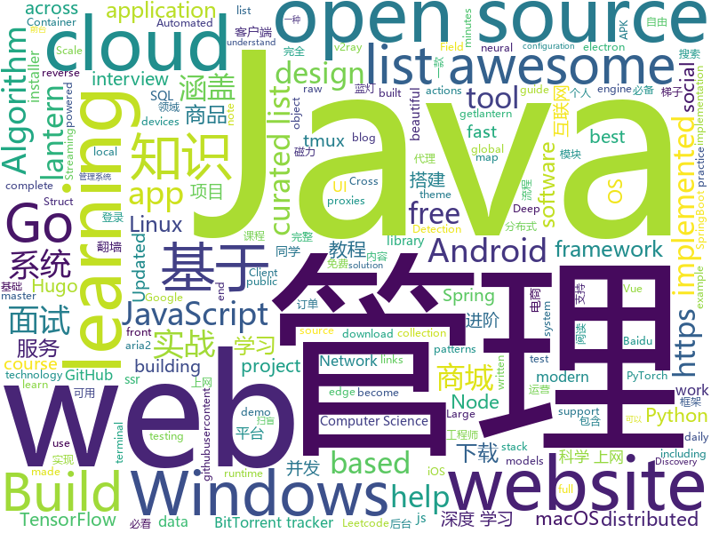

# 2019-11-19
See what the GitHub community is most excited about today.

## python
* [Deep-Learning-with-TensorFlow-book](https://github.com/dragen1860/Deep-Learning-with-TensorFlow-book)(**1,272 stars today**): 深度学习开源书，基于TensorFlow 2.0实战。Open source Deep Learning book, based on TensorFlow 2.0 framework.
* [HackingNeuralNetworks](https://github.com/Kayzaks/HackingNeuralNetworks)(**223 stars today**): A small course on exploiting and defending neural networks
* [rsh](https://github.com/mzfr/rsh)(**30 stars today**): generate reverse shell from CLI for linux and Windows.
* [FALdetector](https://github.com/PeterWang512/FALdetector)(**18 stars today**): Code for the paper: Detecting Photoshopped Faces by Scripting Photoshop
* [Python](https://github.com/TheAlgorithms/Python)(**75 stars today**): All Algorithms implemented in Python
* [localstack](https://github.com/localstack/localstack)(**120 stars today**): 💻A fully functional local AWS cloud stack. Develop and test your cloud & Serverless apps offline!
* [spleeter](https://github.com/deezer/spleeter)(**153 stars today**): Deezer source separation library including pretrained models.
* [modin](https://github.com/modin-project/modin)(**124 stars today**): Modin: Speed up your Pandas workflows by changing a single line of code
* [tuya-convert](https://github.com/ct-Open-Source/tuya-convert)(**29 stars today**): A collection of scripts to flash Tuya IoT devices to alternative firmwares
* [TensorFlow-Lite-Object-Detection-on-Android-and-Raspberry-Pi](https://github.com/EdjeElectronics/TensorFlow-Lite-Object-Detection-on-Android-and-Raspberry-Pi)(**14 stars today**): A tutorial showing how to train, convert, and run TensorFlow Lite object detection models on Android devices, the Raspberry Pi, and more!
* [Deep-Learning-with-PyTorch-Tutorials](https://github.com/dragen1860/Deep-Learning-with-PyTorch-Tutorials)(**31 stars today**): 深度学习与PyTorch入门实战视频教程 配套源代码和PPT
* [system-design-primer](https://github.com/donnemartin/system-design-primer)(**82 stars today**): Learn how to design large-scale systems. Prep for the system design interview. Includes Anki flashcards.
* [Sublist3r](https://github.com/aboul3la/Sublist3r)(**9 stars today**): Fast subdomains enumeration tool for penetration testers
* [sherlock](https://github.com/sherlock-project/sherlock)(**9 stars today**): 🔎Find usernames across social networks
* [scikit-learn](https://github.com/scikit-learn/scikit-learn)(**16 stars today**): scikit-learn: machine learning in Python
* [python-telegram-bot](https://github.com/python-telegram-bot/python-telegram-bot)(**8 stars today**): We have made you a wrapper you can't refuse
* [cpython](https://github.com/python/cpython)(**58 stars today**): The Python programming language
* [seeker](https://github.com/thewhiteh4t/seeker)(**4 stars today**): Accurately Locate Smartphones using Social Engineering
* [numpy-ml](https://github.com/ddbourgin/numpy-ml)(**27 stars today**): Machine learning, in numpy
* [Reinforcement-learning-with-tensorflow](https://github.com/MorvanZhou/Reinforcement-learning-with-tensorflow)(**9 stars today**): Simple Reinforcement learning tutorials
* [keras](https://github.com/keras-team/keras)(**25 stars today**): Deep Learning for humans
* [Towards-Realtime-MOT](https://github.com/Zhongdao/Towards-Realtime-MOT)(**12 stars today**): Joint Detection and Embedding for fast multi-object tracking
* [keras-tuner](https://github.com/keras-team/keras-tuner)(**22 stars today**): Hyperparameter tuning for humans
* [code_snippets](https://github.com/CoreyMSchafer/code_snippets)(**4 stars today**): 
* [pytorch-cifar](https://github.com/kuangliu/pytorch-cifar)(**6 stars today**): 95.16% on CIFAR10 with PyTorch

## java
* [JavaGuide](https://github.com/Snailclimb/JavaGuide)(**210 stars today**): 【Java学习+面试指南】 一份涵盖大部分Java程序员所需要掌握的核心知识。
* [gpmall](https://github.com/2227324689/gpmall)(**37 stars today**): 【咕泡学院实战项目】-基于SpringBoot+Dubbo构建的电商平台-微服务架构、商城、电商、微服务、高并发、kafka、Elasticsearch
* [halo](https://github.com/halo-dev/halo)(**43 stars today**): ✍ Halo 一款现代化的个人独立博客系统
* [JCSprout](https://github.com/crossoverJie/JCSprout)(**25 stars today**): 👨‍🎓Java Core Sprout : basic, concurrent, algorithm
* [advanced-java](https://github.com/doocs/advanced-java)(**70 stars today**): 😮互联网 Java 工程师进阶知识完全扫盲：涵盖高并发、分布式、高可用、微服务等领域知识，后端同学必看，前端同学也可学习
* [ghidra](https://github.com/NationalSecurityAgency/ghidra)(**27 stars today**): Ghidra is a software reverse engineering (SRE) framework
* [paascloud-master](https://github.com/paascloud/paascloud-master)(**23 stars today**): spring cloud + vue + oAuth2.0全家桶实战，前后端分离模拟商城，完整的购物流程、后端运营平台，可以实现快速搭建企业级微服务项目。支持微信登录等三方登录。
* [Spring-Boot-In-Action](https://github.com/hansonwang99/Spring-Boot-In-Action)(**45 stars today**): Spring Boot 系列实战合集
* [Mindustry](https://github.com/Anuken/Mindustry)(**11 stars today**): A sandbox tower defense game
* [baritone](https://github.com/cabaletta/baritone)(**3 stars today**): google maps for block game
* [Nukkit](https://github.com/NukkitX/Nukkit)(**0 stars today**): Nuclear-Powered Server Software for Minecraft: Bedrock Edition.
* [NewPipe](https://github.com/TeamNewPipe/NewPipe)(**8 stars today**): A libre lightweight streaming front-end for Android.
* [java-design-patterns](https://github.com/iluwatar/java-design-patterns)(**33 stars today**): Design patterns implemented in Java
* [proxyee-down](https://github.com/proxyee-down-org/proxyee-down)(**11 stars today**): http下载工具，基于http代理，支持多连接分块下载
* [Java](https://github.com/TheAlgorithms/Java)(**79 stars today**): All Algorithms implemented in Java
* [MyBookshelf](https://github.com/gedoor/MyBookshelf)(**7 stars today**): 阅读是一款可以自定义来源阅读网络内容的工具，为广大网络文学爱好者提供一种方便、快捷舒适的试读体验。
* [ssm](https://github.com/liyifeng1994/ssm)(**7 stars today**): 手把手教你整合最优雅SSM框架：SpringMVC + Spring + MyBatis
* [ksql](https://github.com/confluentinc/ksql)(**6 stars today**): KSQL - the Streaming SQL Engine for Apache Kafka
* [Leetcode](https://github.com/fishercoder1534/Leetcode)(**3 stars today**): Complete solutions to Leetcode problems; updated daily.
* [openhab2-addons](https://github.com/openhab/openhab2-addons)(**1 stars today**): Add-ons for openHAB 2.x
* [Discovery](https://github.com/Nepxion/Discovery)(**50 stars today**): 🐳Nepxion Discovery is an enhancement for Spring Cloud Discovery with gray release, router, weight, limitation, circuit breaker, degrade, isolation, monitor, tracing 灰度发布、路由、权重、限流、熔断、降级、隔离、监控、追踪
* [magnetW](https://github.com/dengyuhan/magnetW)(**25 stars today**): 磁力搜网页版 - 磁力链接聚合搜索 - https://bt.lansou.pw
* [SAI](https://github.com/Aefyr/SAI)(**2 stars today**): Android split APKs installer
* [CS-Notes](https://github.com/CyC2018/CS-Notes)(**68 stars today**): 📚技术面试必备基础知识、Leetcode、Java、C++、Python、后端面试、计算机操作系统、计算机网络、系统设计
* [mall](https://github.com/macrozheng/mall)(**75 stars today**): mall项目是一套电商系统，包括前台商城系统及后台管理系统，基于SpringBoot+MyBatis实现。 前台商城系统包含首页门户、商品推荐、商品搜索、商品展示、购物车、订单流程、会员中心、客户服务、帮助中心等模块。 后台管理系统包含商品管理、订单管理、会员管理、促销管理、运营管理、内容管理、统计报表、财务管理、权限管理、设置等模块。

## unknown
* [starter-workflows](https://github.com/actions/starter-workflows)(**71 stars today**): Accelerating new GitHub Actions workflows
* [coding-interview-university](https://github.com/jwasham/coding-interview-university)(**40 stars today**): A complete computer science study plan to become a software engineer.
* [awesome-actions](https://github.com/sdras/awesome-actions)(**32 stars today**): A curated list of awesome actions to use on GitHub
* [TrackersListCollection](https://github.com/XIU2/TrackersListCollection)(**14 stars today**): 🎈Updated daily! A list of popular public BitTorrent trackers. / 每天更新！全网热门公共 BitTorrent Tracker 列表！
* [trackerslist](https://github.com/ngosang/trackerslist)(**27 stars today**): Updated list of public BitTorrent trackers
* [new-pac](https://github.com/Alvin9999/new-pac)(**50 stars today**): 科学/自由上网，免费ss/ssr/v2ray/goflyway账号，搭建教程
* [awesome](https://github.com/sindresorhus/awesome)(**75 stars today**): 😎Awesome lists about all kinds of interesting topics
* [Privilege-Escalation](https://github.com/Ignitetechnologies/Privilege-Escalation)(**2 stars today**): This cheasheet is aimed at the CTF Players and Beginners to help them understand the fundamentals of Privilege Escalation with examples.
* [JavaFamily](https://github.com/AobingJava/JavaFamily)(**149 stars today**): 【 互联网 Java 工程师大厂面试+学习指南】，进阶知识完全扫盲：涵盖高并发、分布式、高可用、微服务等领域知识，作者风格幽默，看起来津津有味，把学习当做一种乐趣，何乐而不为，后端同学必看。
* [3y](https://github.com/ZhongFuCheng3y/3y)(**32 stars today**): 📓从Java基础、JavaWeb基础到常用的框架再到面试题都有完整的教程，几乎涵盖了Java后端必备的知识点
* [download](https://github.com/getlantern/download)(**31 stars today**): 蓝灯Windows下载 https://raw.githubusercontent.com/getlantern/lantern-binaries/master/lantern-installer.exe 蓝灯安卓下载 https://raw.githubusercontent.com/getlantern/lantern-binaries/master/lantern-installer.apk
* [.tmux](https://github.com/gpakosz/.tmux)(**8 stars today**): 🇫🇷Oh My Tmux! Pretty & versatile tmux configuration made with❤️(imho the best tmux configuration that just works)
* [Kubernetes-Certified-Administrator](https://github.com/walidshaari/Kubernetes-Certified-Administrator)(**10 stars today**): Online resources that will help you prepare for taking the CNCF CKA "Kubernetes Certified Administrator" Certification exam. with time, This is not likely the comprehensive up to date list - please make a pull request if there something that should be added here.
* [developer-roadmap](https://github.com/kamranahmedse/developer-roadmap)(**39 stars today**): Roadmap to becoming a web developer in 2019
* [Xiaomi_Kernel_OpenSource](https://github.com/MiCode/Xiaomi_Kernel_OpenSource)(**3 stars today**): Xiaomi Mobile Phone Kernel OpenSource
* [awesome-courses](https://github.com/prakhar1989/awesome-courses)(**7 stars today**): 📚List of awesome university courses for learning Computer Science!
* [electron-ssr-backup](https://github.com/qingshuisiyuan/electron-ssr-backup)(**10 stars today**): electron-ssr原作者删除了这个伟大的项目，故备份了下来，不继续开发,且用且珍惜
* [1](https://github.com/1jie/1)(**2 stars today**): 这里是直播平台永久回家页，有最新app下载地址。
* [clover-builder](https://github.com/Dids/clover-builder)(**2 stars today**): Automated Clover builds.
* [awesome-algorithms](https://github.com/tayllan/awesome-algorithms)(**4 stars today**): A curated list of awesome places to learn and/or practice algorithms.
* [Manual](https://github.com/Bloomberg-Beta/Manual)(**6 stars today**): You were probably looking for our website... this is it. We moved our website here, so you can see the insides of how we work.
* [awesome-vpn](https://github.com/hugetiny/awesome-vpn)(**3 stars today**): A curated list of awesome free VPNs and proxies.免费的代理,科学上网,翻墙，梯子大集合
* [1024app-android](https://github.com/yuuwill/1024app-android)(**8 stars today**): 草榴官方客户端，小草客户端，Android
* [go](https://github.com/datasciencemasters/go)(**4 stars today**): The Open Source Data Science Masters
* [awesome-scalability](https://github.com/binhnguyennus/awesome-scalability)(**10 stars today**): The Patterns of Scalable, Reliable, and Performant Large-Scale Systems

## javascript
* [joplin](https://github.com/laurent22/joplin)(**125 stars today**): Joplin - a note taking and to-do application with synchronization capabilities for Windows, macOS, Linux, Android and iOS. Forum: https://discourse.joplinapp.org/
* [Motrix](https://github.com/agalwood/Motrix)(**27 stars today**): A full-featured download manager.
* [30-seconds-of-code](https://github.com/30-seconds/30-seconds-of-code)(**193 stars today**): A curated collection of useful JavaScript snippets that you can understand in 30 seconds or less.
* [fanqiang](https://github.com/bannedbook/fanqiang)(**267 stars today**): 翻墙-科学上网
* [comments-api](https://github.com/dev-mastery/comments-api)(**4 stars today**): 
* [DPlayer](https://github.com/MoePlayer/DPlayer)(**185 stars today**): 🍭Wow, such a lovely HTML5 danmaku video player
* [signalr-ports](https://github.com/davidfowl/signalr-ports)(**14 stars today**): 
* [Awesome-Design-Tools](https://github.com/LisaDziuba/Awesome-Design-Tools)(**100 stars today**): The best design tools and plugins for everything👉
* [awesome-mac](https://github.com/jaywcjlove/awesome-mac)(**23 stars today**):  Now we have become very big, Different from the original idea. Collect premium software in various categories.
* [homebridge](https://github.com/nfarina/homebridge)(**8 stars today**): HomeKit support for the impatient
* [cgm-remote-monitor](https://github.com/nightscout/cgm-remote-monitor)(**1 stars today**): nightscout web monitor
* [mellow](https://github.com/mellow-io/mellow)(**11 stars today**): Mellow is a rule-based global transparent proxy client for Windows, macOS and Linux.
* [javascript-algorithms](https://github.com/trekhleb/javascript-algorithms)(**34 stars today**): 📝Algorithms and data structures implemented in JavaScript with explanations and links to further readings
* [create-react-app](https://github.com/facebook/create-react-app)(**40 stars today**): Set up a modern web app by running one command.
* [complete-javascript-course](https://github.com/jonasschmedtmann/complete-javascript-course)(**3 stars today**): Starter files, final projects and FAQ for my Complete JavaScript course
* [etcher](https://github.com/balena-io/etcher)(**10 stars today**): Flash OS images to SD cards & USB drives, safely and easily.
* [lx-music-desktop](https://github.com/lyswhut/lx-music-desktop)(**31 stars today**): 一个基于 electron 的音乐软件
* [nodebestpractices](https://github.com/goldbergyoni/nodebestpractices)(**88 stars today**): ✅The largest Node.js best practices list (November 2019)
* [entropic](https://github.com/entropic-dev/entropic)(**25 stars today**): 🦝📦a package registry for anything, but mostly javascript 🦝 🦝 🦝
* [brave-browser](https://github.com/brave/brave-browser)(**45 stars today**): Next generation Brave browser for macOS, Windows, Linux, and eventually Android
* [realworld](https://github.com/gothinkster/realworld)(**25 stars today**): "The mother of all demo apps" — Exemplary fullstack Medium.com clone powered by React, Angular, Node, Django, and many more🏅
* [vue](https://github.com/vuejs/vue)(**72 stars today**): 🖖Vue.js is a progressive, incrementally-adoptable JavaScript framework for building UI on the web.
* [gatsby](https://github.com/gatsbyjs/gatsby)(**40 stars today**): Build blazing fast, modern apps and websites with React
* [didact](https://github.com/pomber/didact)(**54 stars today**): A DIY guide to build your own React
* [BaiduExporter](https://github.com/acgotaku/BaiduExporter)(**9 stars today**): Assistant for Baidu to export download links to aria2/aria2-rpc

## html
* [hugo-academic](https://github.com/gcushen/hugo-academic)(**9 stars today**): 📝The website builder for Hugo. Build and deploy a beautiful website in minutes!
* [bulma-templates](https://github.com/BulmaTemplates/bulma-templates)(**5 stars today**): free flexbox templates built with the bulma css framework
* [REKCARC-TSC-UHT](https://github.com/PKUanonym/REKCARC-TSC-UHT)(**14 stars today**): 清华大学计算机系课程攻略 Guidance for courses in Department of Computer Science and Technology, Tsinghua University
* [Coursera-ML-AndrewNg-Notes](https://github.com/fengdu78/Coursera-ML-AndrewNg-Notes)(**13 stars today**): 吴恩达老师的机器学习课程个人笔记
* [beautiful-jekyll](https://github.com/daattali/beautiful-jekyll)(**2 stars today**): ✨Build a beautiful and simple website in literally minutes. Demo at http://deanattali.com/beautiful-jekyll
* [awesome-piracy](https://github.com/Igglybuff/awesome-piracy)(**18 stars today**): A curated list of awesome warez and piracy links
* [Front-end-Developer-Interview-Questions](https://github.com/h5bp/Front-end-Developer-Interview-Questions)(**14 stars today**): A list of helpful front-end related questions you can use to interview potential candidates, test yourself or completely ignore.
* [opencatan](https://github.com/event-modeling/opencatan)(**0 stars today**): an open source implementation of Katan that observes specific technology approach goals
* [blog_os](https://github.com/phil-opp/blog_os)(**6 stars today**): Writing an OS in Rust
* [devcamper-api](https://github.com/bradtraversy/devcamper-api)(**0 stars today**): Backend for devcamper app
* [qiubaiying.github.io](https://github.com/qiubaiying/qiubaiying.github.io)(**5 stars today**): BY Blog ->
* [node-interview](https://github.com/ElemeFE/node-interview)(**3 stars today**): How to pass the Node.js interview of ElemeFE.
* [Salesforce-Interview-Handbook](https://github.com/usmanovs/Salesforce-Interview-Handbook)(**3 stars today**): 🌐Project to help aspiring Salesforce professionals land their dream job!
* [tabler](https://github.com/tabler/tabler)(**10 stars today**): Tabler is free and open-source HTML Dashboard UI Kit built on Bootstrap
* [hugo-coder](https://github.com/luizdepra/hugo-coder)(**0 stars today**): A minimalist blog theme for hugo.
* [additive-guis](https://github.com/samsquire/additive-guis)(**4 stars today**): guis constructed from tuples/triples
* [persona5-negotiation](https://github.com/joyce-chen/persona5-negotiation)(**0 stars today**): A tool to help negotiations in Persona 5. (Note: Currently incomplete. Work-in-progress.)
* [Java-Interview-Advanced](https://github.com/shishan100/Java-Interview-Advanced)(**7 stars today**): 中华石杉--互联网Java进阶面试训练营
* [gohugo-theme-ananke](https://github.com/budparr/gohugo-theme-ananke)(**0 stars today**): Ananke: A theme for Hugo Sites
* [shellphish](https://github.com/thelinuxchoice/shellphish)(**1 stars today**): Phishing Tool for 18 social media: Instagram, Facebook, Snapchat, Github, Twitter, Yahoo, Protonmail, Spotify, Netflix, Linkedin, Wordpress, Origin, Steam, Microsoft, InstaFollowers, Gitlab, Pinterest
* [nndl.github.io](https://github.com/nndl/nndl.github.io)(**40 stars today**): 《神经网络与深度学习》 邱锡鹏著 Neural Network and Deep Learning
* [coreui-free-bootstrap-admin-template](https://github.com/coreui/coreui-free-bootstrap-admin-template)(**3 stars today**): CoreUI is free bootstrap admin template
* [styleguide](https://github.com/google/styleguide)(**11 stars today**): Style guides for Google-originated open-source projects
* [privacytools.io](https://github.com/privacytoolsIO/privacytools.io)(**0 stars today**): 🛡️encryption against global mass surveillance
* [fluxion](https://github.com/wi-fi-analyzer/fluxion)(**0 stars today**): Offical repo for fluxion

## go
* [micro](https://github.com/micro/micro)(**26 stars today**): A microservice runtime environment
* [ffuf](https://github.com/ffuf/ffuf)(**15 stars today**): Fast web fuzzer written in Go
* [dapr](https://github.com/dapr/dapr)(**45 stars today**): Dapr is a portable, event-driven, runtime for building distributed applications across cloud and edge.
* [libpod](https://github.com/containers/libpod)(**18 stars today**): libpod is a library used to create container pods. Home of Podman.
* [micro](https://github.com/zyedidia/micro)(**10 stars today**): A modern and intuitive terminal-based text editor
* [client](https://github.com/keybase/client)(**12 stars today**): Keybase Go Library, Client, Service, OS X, iOS, Android, Electron
* [lnd](https://github.com/lightningnetwork/lnd)(**3 stars today**): Lightning Network Daemon⚡️
* [FreeNet](https://github.com/xiaoming2028/FreeNet)(**20 stars today**): 科学上网/梯子/自由上网/翻墙 SSR/V2Ray/Brook 最全搭建教程
* [protobuf](https://github.com/golang/protobuf)(**8 stars today**): Go support for Google's protocol buffers
* [bfe](https://github.com/baidu/bfe)(**311 stars today**): Open-source layer 7 load balancer derived from proprietary Baidu FrontEnd
* [validator](https://github.com/go-playground/validator)(**47 stars today**): 💯Go Struct and Field validation, including Cross Field, Cross Struct, Map, Slice and Array diving
* [ramsql](https://github.com/proullon/ramsql)(**14 stars today**): In-memory SQL engine in Go sql/driver for testing purpose
* [dep](https://github.com/golang/dep)(**5 stars today**): Go dependency management tool
* [traefik](https://github.com/containous/traefik)(**19 stars today**): The Cloud Native Edge Router
* [tview](https://github.com/rivo/tview)(**30 stars today**): Rich interactive widgets for terminal-based UIs written in Go
* [go-gin-example](https://github.com/EDDYCJY/go-gin-example)(**9 stars today**): An example of gin
* [pan-light](https://github.com/peterq/pan-light)(**18 stars today**): 百度网盘不限速客户端, golang + qt5, 跨平台图形界面
* [inlets](https://github.com/inlets/inlets)(**15 stars today**): Expose your local endpoints to the Internet
* [revel](https://github.com/revel/revel)(**6 stars today**): A high productivity, full-stack web framework for the Go language.
* [kubernetes](https://github.com/kubernetes/kubernetes)(**56 stars today**): Production-Grade Container Scheduling and Management
* [consul](https://github.com/hashicorp/consul)(**12 stars today**): Consul is a distributed, highly available, and data center aware solution to connect and configure applications across dynamic, distributed infrastructure.
* [v2ray-core](https://github.com/v2ray/v2ray-core)(**58 stars today**): A platform for building proxies to bypass network restrictions.
* [OpenDiablo2](https://github.com/OpenDiablo2/OpenDiablo2)(**154 stars today**): An open source re-implementation of Diablo 2
* [backoori](https://github.com/giuliocomi/backoori)(**5 stars today**): Tool aided persistence via Windows URI schemes abuse
* [jaeles](https://github.com/jaeles-project/jaeles)(**15 stars today**): The Swiss Army knife for automated Web Application Testing

## WordCloud

