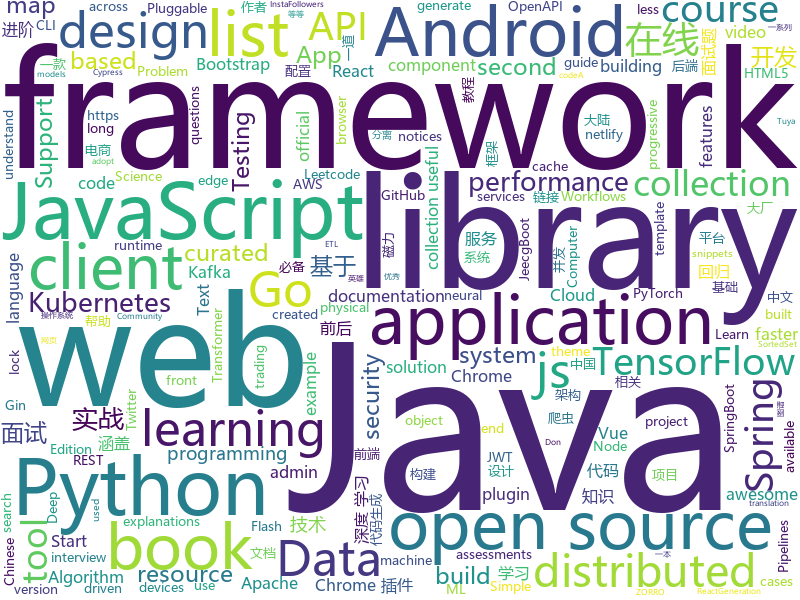

# 2019-11-20
See what the GitHub community is most excited about today.

## python
* [Deep-Learning-with-TensorFlow-book](https://github.com/dragen1860/Deep-Learning-with-TensorFlow-book)(**688 stars today**): 深度学习开源书，基于TensorFlow 2.0实战。Open source Deep Learning book, based on TensorFlow 2.0 framework.
* [ChromeAppHeroes](https://github.com/zhaoolee/ChromeAppHeroes)(**40 stars today**): 🌈谷粒-Chrome插件英雄榜, 为优秀的Chrome插件写一本中文说明书, 让Chrome插件英雄们造福人类~ ChromePluginHeroes, Write a Chinese manual for the excellent Chrome plugin, let the Chrome plugin heroes benefit the human~
* [HackingNeuralNetworks](https://github.com/Kayzaks/HackingNeuralNetworks)(**436 stars today**): A small course on exploiting and defending neural networks
* [modin](https://github.com/modin-project/modin)(**64 stars today**): Modin: Speed up your Pandas workflows by changing a single line of code
* [tuya-convert](https://github.com/ct-Open-Source/tuya-convert)(**9 stars today**): A collection of scripts to flash Tuya IoT devices to alternative firmwares
* [models](https://github.com/tensorflow/models)(**27 stars today**): Models and examples built with TensorFlow
* [streamlit](https://github.com/streamlit/streamlit)(**57 stars today**): Streamlit — The fastest way to build custom ML tools
* [interpy-zh](https://github.com/eastlakeside/interpy-zh)(**18 stars today**): 📘《Python进阶》（Intermediate Python 中文版）
* [system-design-primer](https://github.com/donnemartin/system-design-primer)(**67 stars today**): Learn how to design large-scale systems. Prep for the system design interview. Includes Anki flashcards.
* [transformers](https://github.com/huggingface/transformers)(**78 stars today**): 🤗Transformers: State-of-the-art Natural Language Processing for TensorFlow 2.0 and PyTorch.
* [rsh](https://github.com/mzfr/rsh)(**51 stars today**): generate reverse shell from CLI for linux and Windows.
* [text-to-text-transfer-transformer](https://github.com/google-research/text-to-text-transfer-transformer)(**13 stars today**): Code for the paper "Exploring the Limits of Transfer Learning with a Unified Text-to-Text Transformer"
* [image_search_engine](https://github.com/CVxTz/image_search_engine)(**10 stars today**): Image search engine
* [machine_learning_security](https://github.com/13o-bbr-bbq/machine_learning_security)(**11 stars today**): Source code about machine learning and security.
* [dash](https://github.com/plotly/dash)(**8 stars today**): Analytical Web Apps for Python & R. No JavaScript Required.
* [Deep-Learning-with-PyTorch-Tutorials](https://github.com/dragen1860/Deep-Learning-with-PyTorch-Tutorials)(**22 stars today**): 深度学习与PyTorch入门实战视频教程 配套源代码和PPT
* [Python](https://github.com/TheAlgorithms/Python)(**86 stars today**): All Algorithms implemented in Python
* [baikal](https://github.com/alegonz/baikal)(**28 stars today**): A graph-based functional API for building complex scikit-learn pipelines.
* [dagster](https://github.com/dagster-io/dagster)(**13 stars today**): A Python library for building data applications: ETL, ML, Data Pipelines, and more.
* [Reinforcement-learning-with-tensorflow](https://github.com/MorvanZhou/Reinforcement-learning-with-tensorflow)(**7 stars today**): Simple Reinforcement learning tutorials
* [cpython](https://github.com/python/cpython)(**32 stars today**): The Python programming language
* [TensorFlow-Lite-Object-Detection-on-Android-and-Raspberry-Pi](https://github.com/EdjeElectronics/TensorFlow-Lite-Object-Detection-on-Android-and-Raspberry-Pi)(**10 stars today**): A tutorial showing how to train, convert, and run TensorFlow Lite object detection models on Android devices, the Raspberry Pi, and more!
* [numpy-ml](https://github.com/ddbourgin/numpy-ml)(**20 stars today**): Machine learning, in numpy
* [stylegan](https://github.com/NVlabs/stylegan)(**7 stars today**): StyleGAN - Official TensorFlow Implementation
* [catalyst](https://github.com/catalyst-team/catalyst)(**6 stars today**): Reproducible and fast DL & RL

## java
* [JavaGuide](https://github.com/Snailclimb/JavaGuide)(**264 stars today**): 【Java学习+面试指南】 一份涵盖大部分Java程序员所需要掌握的核心知识。
* [retrofit](https://github.com/square/retrofit)(**16 stars today**): Type-safe HTTP client for Android and Java by Square, Inc.
* [univocity-trader](https://github.com/uniVocity/univocity-trader)(**9 stars today**): open-source trading framework for java, supports backtesting and live trading with exchanges
* [halo](https://github.com/halo-dev/halo)(**44 stars today**): ✍ Halo 一款现代化的个人独立博客系统
* [JCSprout](https://github.com/crossoverJie/JCSprout)(**17 stars today**): 👨‍🎓Java Core Sprout : basic, concurrent, algorithm
* [CS-Notes](https://github.com/CyC2018/CS-Notes)(**105 stars today**): 📚技术面试必备基础知识、Leetcode、Java、C++、Python、后端面试、计算机操作系统、计算机网络、系统设计
* [elasticsearch](https://github.com/elastic/elasticsearch)(**27 stars today**): Open Source, Distributed, RESTful Search Engine
* [kafka-streams-examples](https://github.com/confluentinc/kafka-streams-examples)(**4 stars today**): Demo applications and code examples for Apache Kafka's Streams API.
* [tutorials](https://github.com/eugenp/tutorials)(**22 stars today**): The "REST With Spring" Course:
* [aws-sdk-java-v2](https://github.com/aws/aws-sdk-java-v2)(**0 stars today**): The official AWS SDK for Java - Version 2
* [SpringCloudLearning](https://github.com/forezp/SpringCloudLearning)(**14 stars today**): 《史上最简单的Spring Cloud教程源码》
* [camel](https://github.com/apache/camel)(**3 stars today**): Apache Camel
* [tinker](https://github.com/Tencent/tinker)(**14 stars today**): Tinker is a hot-fix solution library for Android, it supports dex, library and resources update without reinstall apk.
* [redisson](https://github.com/redisson/redisson)(**23 stars today**): Redisson - Redis Java client with features of In-Memory Data Grid. Supports over 30 objects and services: Set, Multimap, SortedSet, Map, List, Queue, Deque, Semaphore, Lock, AtomicLong, Map Reduce, Publish / Subscribe, Bloom filter, Spring Cache, Tomcat, Scheduler, JCache API, Hibernate, RPC.
* [Spring-Boot-In-Action](https://github.com/hansonwang99/Spring-Boot-In-Action)(**18 stars today**): Spring Boot 系列实战合集
* [gpmall](https://github.com/2227324689/gpmall)(**90 stars today**): 【咕泡学院实战项目】-基于SpringBoot+Dubbo构建的电商平台-微服务架构、商城、电商、微服务、高并发、kafka、Elasticsearch
* [ARouter](https://github.com/alibaba/ARouter)(**12 stars today**): 💪A framework for assisting in the renovation of Android componentization (帮助 Android App 进行组件化改造的路由框架)
* [magnetW](https://github.com/dengyuhan/magnetW)(**16 stars today**): 磁力搜网页版 - 磁力链接聚合搜索 - https://bt.lansou.pw
* [skywalking](https://github.com/apache/skywalking)(**15 stars today**): APM, Application Performance Monitoring System
* [jeecg-boot](https://github.com/zhangdaiscott/jeecg-boot)(**34 stars today**): 一款基于代码生成器的JAVA快速开发平台！采用最新技术，前后端分离架构：SpringBoot 2.x，Ant Design&Vue，Mybatis-plus，Shiro，JWT。强大的代码生成器让前后端代码一键生成，无需写任何代码，绝对是全栈开发福音！！ JeecgBoot的宗旨是提高UI能力的同时,降低前后分离的开发成本，JeecgBoot还独创在线开发模式，No代码概念，一系列在线智能开发：在线配置表单、在线配置报表、在线设计流程等等。
* [selenium](https://github.com/SeleniumHQ/selenium)(**12 stars today**): A browser automation framework and ecosystem.
* [okhttp](https://github.com/square/okhttp)(**13 stars today**): An HTTP client for Android, Kotlin, and Java.
* [spring-security-oauth](https://github.com/spring-projects/spring-security-oauth)(**6 stars today**): Support for adding OAuth1(a) and OAuth2 features (consumer and provider) for Spring web applications.
* [ShedLock](https://github.com/lukas-krecan/ShedLock)(**2 stars today**): Distributed lock for your scheduled tasks
* [schema-registry](https://github.com/confluentinc/schema-registry)(**0 stars today**): Confluent Schema Registry for Kafka

## unknown
* [tamagotchiTemp](https://github.com/graceavery/tamagotchiTemp)(**275 stars today**): 
* [physical-docs](https://github.com/trustedsec/physical-docs)(**79 stars today**): This is a collection of legal wording and documentation used for physical security assessments. The goal is to hopefully allow this as a template for other companies to use and to protect themselves when conducting physical security assessments.
* [JavaFamily](https://github.com/AobingJava/JavaFamily)(**143 stars today**): 【 互联网 Java 工程师大厂面试+学习指南】，进阶知识完全扫盲：涵盖高并发、分布式、高可用、微服务等领域知识，作者风格幽默，看起来津津有味，把学习当做一种乐趣，何乐而不为，后端同学必看。
* [resources-of-learning](https://github.com/tagnja/resources-of-learning)(**44 stars today**): Documentations, books, courses, git repositories and so on.
* [Cookbook](https://github.com/andkret/Cookbook)(**11 stars today**): The Data Engineering Cookbook
* [iCloudBypassCA](https://github.com/crazymind90/iCloudBypassCA)(**12 stars today**): 
* [gov-takedowns](https://github.com/github/gov-takedowns)(**25 stars today**): Text of government takedown notices as received. GitHub does not endorse or adopt any assertion contained in the following notices.
* [aws-cloudformation-coverage-roadmap](https://github.com/aws-cloudformation/aws-cloudformation-coverage-roadmap)(**8 stars today**): The AWS CloudFormation Public Coverage Roadmap
* [LearningNotes](https://github.com/francistao/LearningNotes)(**10 stars today**): Enjoy Learning.
* [javascript-questions](https://github.com/lydiahallie/javascript-questions)(**14 stars today**): A long list of (advanced) JavaScript questions, and their explanations✨
* [You-dont-need-loops](https://github.com/you-dont-need/You-dont-need-loops)(**15 stars today**): Avoid The One-off Problem, Infinite Loops, Statefulness and Hidden intent.
* [Android-Daily-Interview](https://github.com/Moosphan/Android-Daily-Interview)(**10 stars today**): 📌每工作日更新一道 Android 面试题，小聚成河，大聚成江，共勉之～
* [CS-Books](https://github.com/huihut/CS-Books)(**10 stars today**): 📚Computer Science Books 计算机技术类书籍 PDF
* [intellij-community](https://github.com/JetBrains/intellij-community)(**23 stars today**): IntelliJ IDEA Community Edition
* [gitignore](https://github.com/github/gitignore)(**75 stars today**): A collection of useful .gitignore templates
* [OpenAPI-Specification](https://github.com/OAI/OpenAPI-Specification)(**19 stars today**): The OpenAPI Specification Repository
* [architect-awesome](https://github.com/xingshaocheng/architect-awesome)(**27 stars today**): 后端架构师技术图谱
* [Awesome-Hacking](https://github.com/Hack-with-Github/Awesome-Hacking)(**22 stars today**): A collection of various awesome lists for hackers, pentesters and security researchers
* [leetcode](https://github.com/grandyang/leetcode)(**17 stars today**): Provide all my solutions and explanations in Chinese for all the Leetcode coding problems.
* [document-style-guide](https://github.com/ruanyf/document-style-guide)(**12 stars today**): 中文技术文档的写作规范
* [3y](https://github.com/ZhongFuCheng3y/3y)(**24 stars today**): 📓从Java基础、JavaWeb基础到常用的框架再到面试题都有完整的教程，几乎涵盖了Java后端必备的知识点
* [books](https://github.com/programthink/books)(**22 stars today**): 【编程随想】收藏的电子书清单（多个学科，含下载链接）
* [awesome-php](https://github.com/ziadoz/awesome-php)(**12 stars today**): A curated list of amazingly awesome PHP libraries, resources and shiny things.
* [you-dont-know-js-ru](https://github.com/azat-io/you-dont-know-js-ru)(**5 stars today**): 📚Russian translation of "You Don't Know JS" book series
* [You-Dont-Know-JS](https://github.com/getify/You-Dont-Know-JS)(**51 stars today**): A book series on JavaScript. @YDKJS on twitter.

## javascript
* [umi](https://github.com/umijs/umi)(**29 stars today**): 🌋Pluggable enterprise-level react application framework.
* [fanqiang](https://github.com/bannedbook/fanqiang)(**92 stars today**): 翻墙-科学上网
* [30-seconds-of-code](https://github.com/30-seconds/30-seconds-of-code)(**104 stars today**): A curated collection of useful JavaScript snippets that you can understand in 30 seconds or less.
* [DPlayer](https://github.com/MoePlayer/DPlayer)(**61 stars today**): 🍭Wow, such a lovely HTML5 danmaku video player
* [material-ui](https://github.com/mui-org/material-ui)(**24 stars today**): React components for faster and easier web development. Build your own design system, or start with Material Design.
* [Awesome-Design-Tools](https://github.com/LisaDziuba/Awesome-Design-Tools)(**28 stars today**): The best design tools and plugins for everything👉
* [jest](https://github.com/facebook/jest)(**23 stars today**): Delightful JavaScript Testing.
* [lite-youtube-embed](https://github.com/paulirish/lite-youtube-embed)(**34 stars today**): A faster youtube embed.
* [video.js](https://github.com/videojs/video.js)(**14 stars today**): Video.js - open source HTML5 & Flash video player
* [Leaflet](https://github.com/Leaflet/Leaflet)(**10 stars today**): 🍃JavaScript library for mobile-friendly interactive maps
* [lx-music-desktop](https://github.com/lyswhut/lx-music-desktop)(**32 stars today**): 一个基于 electron 的音乐软件
* [didact](https://github.com/pomber/didact)(**45 stars today**): A DIY guide to build your own React
* [enzyme](https://github.com/airbnb/enzyme)(**8 stars today**): JavaScript Testing utilities for React
* [mermaid](https://github.com/mermaid-js/mermaid)(**48 stars today**): Generation of diagram and flowchart from text in a similar manner as markdown
* [mapbox-gl-js](https://github.com/mapbox/mapbox-gl-js)(**7 stars today**): Interactive, thoroughly customizable maps in the browser, powered by vector tiles and WebGL
* [umi-request](https://github.com/umijs/umi-request)(**6 stars today**): A request tool based on fetch.
* [amphtml](https://github.com/ampproject/amphtml)(**4 stars today**): The AMP web component framework.
* [Vue.Draggable](https://github.com/SortableJS/Vue.Draggable)(**18 stars today**): Vue drag-and-drop component based on Sortable.js
* [Daily-Interview-Question](https://github.com/Advanced-Frontend/Daily-Interview-Question)(**39 stars today**): 我是木易杨，公众号「高级前端进阶」作者，每天搞定一道前端大厂面试题，祝大家天天进步，一年后会看到不一样的自己。
* [30-seconds-of-react](https://github.com/30-seconds/30-seconds-of-react)(**17 stars today**): Curated collection of useful React snippets that you can understand in 30 seconds or less.
* [ml5-examples](https://github.com/ml5js/ml5-examples)(**3 stars today**): A collection of ml5.js examples
* [keystone](https://github.com/keystonejs/keystone)(**11 stars today**): A scalable platform and CMS to build Node.js applications
* [text-mask](https://github.com/text-mask/text-mask)(**5 stars today**): Input mask for React, Angular, Ember, Vue, & plain JavaScript
* [three.js](https://github.com/mrdoob/three.js)(**36 stars today**): JavaScript 3D library.
* [puppeteer](https://github.com/GoogleChrome/puppeteer)(**35 stars today**): Headless Chrome Node.js API

## html
* [Front-end-Developer-Interview-Questions](https://github.com/h5bp/Front-end-Developer-Interview-Questions)(**29 stars today**): A list of helpful front-end related questions you can use to interview potential candidates, test yourself or completely ignore.
* [baremetrics-v1](https://github.com/Baremetrics/baremetrics-v1)(**21 stars today**): This was the very first version of Baremetrics from 2013. It's published here for posterity.
* [qcloud-documents](https://github.com/tencentyun/qcloud-documents)(**2 stars today**): 腾讯云官方文档 使用Markdown自动构建
* [Machine-Learning](https://github.com/Jack-Cherish/Machine-Learning)(**6 stars today**): ⚡️机器学习实战（Python3）：kNN、决策树、贝叶斯、逻辑回归、SVM、线性回归、树回归
* [Crawler_Illegal_Cases_In_China](https://github.com/HiddenStrawberry/Crawler_Illegal_Cases_In_China)(**170 stars today**): Collection of China illegal cases about web crawler 本项目用来整理所有中国大陆爬虫开发者涉诉与违规相关的新闻、资料与法律法规。致力于帮助在中国大陆工作的爬虫行业从业者了解我国相关法律，避免触碰数据合规红线。
* [cypress-example-kitchensink](https://github.com/cypress-io/cypress-example-kitchensink)(**1 stars today**): This is an example app used to showcase Cypress.io testing.
* [startbootstrap-resume](https://github.com/BlackrockDigital/startbootstrap-resume)(**1 stars today**): A Bootstrap 4 resume/CV theme created by Start Bootstrap
* [swagger-codegen](https://github.com/swagger-api/swagger-codegen)(**8 stars today**): swagger-codegen contains a template-driven engine to generate documentation, API clients and server stubs in different languages by parsing your OpenAPI / Swagger definition.
* [REKCARC-TSC-UHT](https://github.com/PKUanonym/REKCARC-TSC-UHT)(**17 stars today**): 清华大学计算机系课程攻略 Guidance for courses in Department of Computer Science and Technology, Tsinghua University
* [seleniumhq.github.io](https://github.com/SeleniumHQ/seleniumhq.github.io)(**0 stars today**): Official Selenium website and documentation
* [styleguide](https://github.com/google/styleguide)(**17 stars today**): Style guides for Google-originated open-source projects
* [blaze](https://github.com/blenderskool/blaze)(**31 stars today**): ⚡ File sharing progressive web app built using WebRTC and WebSockets
* [nndl.github.io](https://github.com/nndl/nndl.github.io)(**19 stars today**): 《神经网络与深度学习》 邱锡鹏著 Neural Network and Deep Learning
* [startbootstrap-sb-admin-2](https://github.com/BlackrockDigital/startbootstrap-sb-admin-2)(**6 stars today**): A free, open source, Bootstrap admin theme created by Start Bootstrap
* [ng-alain](https://github.com/ng-alain/ng-alain)(**3 stars today**): NG-ZORRO admin panel front-end framework (netlify mirror https://netlify.ng-alain.com/)
* [shellphish](https://github.com/thelinuxchoice/shellphish)(**4 stars today**): Phishing Tool for 18 social media: Instagram, Facebook, Snapchat, Github, Twitter, Yahoo, Protonmail, Spotify, Netflix, Linkedin, Wordpress, Origin, Steam, Microsoft, InstaFollowers, Gitlab, Pinterest
* [OpenClash](https://github.com/vernesong/OpenClash)(**4 stars today**): A Clash Client For OpenWrt
* [stisla](https://github.com/stisla/stisla)(**9 stars today**): Free Bootstrap Admin Template
* [dragon-book-exercise-answers](https://github.com/fool2fish/dragon-book-exercise-answers)(**5 stars today**): Compilers Principles, Techniques, & Tools (purple dragon book) second edition exercise answers. 编译原理（紫龙书）第2版习题答案。
* [varharrie.github.io](https://github.com/varHarrie/varharrie.github.io)(**4 stars today**): 📘Personal blog.
* [rellax](https://github.com/dixonandmoe/rellax)(**3 stars today**): Lightweight, vanilla javascript parallax library
* [WebFundamentals](https://github.com/google/WebFundamentals)(**3 stars today**): Best practices for modern web development
* [pcc_2e](https://github.com/ehmatthes/pcc_2e)(**3 stars today**): Online resources for Python Crash Course (Second Edition), from No Starch Press
* [awesome-competitive-programming](https://github.com/lnishan/awesome-competitive-programming)(**7 stars today**): 💎A curated list of awesome Competitive Programming, Algorithm and Data Structure resources
* [ecma262](https://github.com/tc39/ecma262)(**12 stars today**): Status, process, and documents for ECMA-262

## go
* [bfe](https://github.com/baidu/bfe)(**270 stars today**): Open-source layer 7 load balancer derived from proprietary Baidu FrontEnd
* [spikeSystem](https://github.com/GuoZhaoran/spikeSystem)(**51 stars today**): 
* [micro](https://github.com/micro/micro)(**41 stars today**): A microservice runtime environment
* [userspace-vga2usb](https://github.com/benjojo/userspace-vga2usb)(**39 stars today**): A userspace driver implementation of the Epiphan VGA2USB LR
* [eksctl](https://github.com/weaveworks/eksctl)(**8 stars today**): The official CLI for Amazon EKS
* [dapr](https://github.com/dapr/dapr)(**41 stars today**): Dapr is a portable, event-driven, runtime for building distributed applications across cloud and edge.
* [origin](https://github.com/openshift/origin)(**4 stars today**): The self-managing, auto-upgrading, Kubernetes distribution for everyone
* [gin](https://github.com/gin-gonic/gin)(**37 stars today**): Gin is a HTTP web framework written in Go (Golang). It features a Martini-like API with much better performance -- up to 40 times faster. If you need smashing performance, get yourself some Gin.
* [kops](https://github.com/kubernetes/kops)(**6 stars today**): Kubernetes Operations (kops) - Production Grade K8s Installation, Upgrades, and Management
* [sarama](https://github.com/Shopify/sarama)(**11 stars today**): Sarama is a Go library for Apache Kafka 0.8, and up.
* [resty](https://github.com/go-resty/resty)(**2 stars today**): Simple HTTP and REST client library for Go
* [istio](https://github.com/istio/istio)(**19 stars today**): Connect, secure, control, and observe services.
* [operator-lifecycle-manager](https://github.com/operator-framework/operator-lifecycle-manager)(**11 stars today**): A management framework for extending Kubernetes with Operators
* [thanos](https://github.com/thanos-io/thanos)(**9 stars today**): Highly available Prometheus setup with long term storage capabilities. CNCF Sandbox project.
* [consul](https://github.com/hashicorp/consul)(**15 stars today**): Consul is a distributed, highly available, and data center aware solution to connect and configure applications across dynamic, distributed infrastructure.
* [cadvisor](https://github.com/google/cadvisor)(**6 stars today**): Analyzes resource usage and performance characteristics of running containers.
* [argo](https://github.com/argoproj/argo)(**14 stars today**): Argo Workflows: Get stuff done with Kubernetes.
* [beego](https://github.com/astaxie/beego)(**23 stars today**): beego is an open-source, high-performance web framework for the Go programming language.
* [groupcache](https://github.com/golang/groupcache)(**4 stars today**): groupcache is a caching and cache-filling library, intended as a replacement for memcached in many cases.
* [logrus](https://github.com/sirupsen/logrus)(**15 stars today**): Structured, pluggable logging for Go.
* [flagger](https://github.com/weaveworks/flagger)(**4 stars today**): Progressive delivery Kubernetes operator (Canary, A/B Testing and Blue/Green deployments)
* [gin-jwt](https://github.com/appleboy/gin-jwt)(**5 stars today**): JWT Middleware for Gin framework
* [client_golang](https://github.com/prometheus/client_golang)(**3 stars today**): Prometheus instrumentation library for Go applications
* [go](https://github.com/golang/go)(**55 stars today**): The Go programming language
* [traefik](https://github.com/containous/traefik)(**28 stars today**): The Cloud Native Edge Router

## WordCloud

